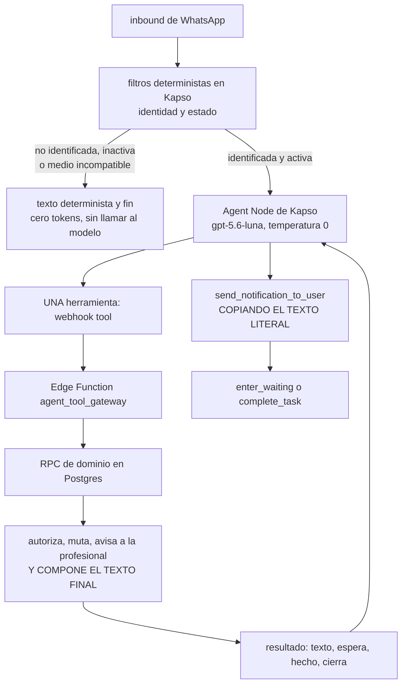

# El agente de WhatsApp de Agenda Psi

Corte: 2026-09-02.

Aquí vive la **especificación de producción** del agente: qué entiende, qué puede hacer, qué texto
entrega, cómo se autoriza cada gestión y cómo se implementa. Está escrita para que quien la
implemente **no tenga que adivinar nada**.

Son **ocho archivos**, y ninguno más. Cada tema tiene un dueño único; los demás archivos lo citan
en vez de repetirlo. Las reglas de edición y la lista cerrada de archivos están en `AGENTS.md`.

**Este repositorio no contiene SQL desplegable, migraciones, secretos ni datos de pacientes.** Sí
contiene **pseudocódigo**: es lo que le da nombre al repositorio y el motivo está escrito en
`AGENTS.md` §2. La frontera entre pseudocódigo y SQL desplegable también se define ahí, con una
prueba concreta para saber de qué lado está un bloque.

---

## Índice

1. [Qué es el agente](#1-qué-es-el-agente)
2. [La arquitectura decidida](#2-la-arquitectura-decidida)
3. [Los ocho archivos y su orden de lectura](#3-los-ocho-archivos-y-su-orden-de-lectura)
4. [Cómo se cita entre archivos](#4-cómo-se-cita-entre-archivos)
5. [Quién manda cuando hay una contradicción](#5-quién-manda-cuando-hay-una-contradicción)
6. [Lo que queda fuera](#6-lo-que-queda-fuera)

---

## 1. Qué es el agente

Un asistente de WhatsApp que atiende a las **pacientes** de las profesionales de Agenda Psi. Ve
citas, pagos visibles y comprobantes; en el catálogo completo también modalidades, servicios,
horarios y agenda. Cada gestión la resuelve el servidor: **el agente sólo la enruta**.

Lo que **no** es, y está decidido: no es un expediente clínico, no da atención psicológica, no
acredita pagos ni negocia dinero, no redacta el texto que lee la paciente y no es una conversación
larga. El tope decidido es de **cuatro mensajes salientes por gestión**. El desarrollo de cada una
de esas negativas vive en `docs/01-producto.md` §1.

**El alcance está partido en fases** y la lista es cerrada:

| Fase | Herramientas de dominio | Qué hay escrito |
|---|---|---|
| **MVP** | `mis_citas`, `confirmar`, `mandar_comprobante`, `crisis` | Todo: guion, contrato y **pseudocódigo fiel e implementable** |
| **Fase 2** | `cancelar`, `buscar_horarios`, `agendar`, `reprogramar` | Esbozadas: firma, autorización y forma del resultado |
| **Fase 3** | `cambiar_modalidad`, `ver_servicios` | Esbozadas: firma, autorización y forma del resultado |
| **Pospuesta** | `dejar_resena` | Fuera de alcance, con su motivo |

Son **once herramientas de dominio**. `crisis` es la undécima y es una herramienta de dominio de
verdad: su texto lo sirve el servidor y notifica a la profesional en la misma transacción. No es un
texto fijo del prompt. `send_notification_to_user`, `enter_waiting` y `complete_task` **no** entran
en la cuenta: son herramientas de control.

Encima de todo mandan **diecinueve reglas numeradas** (`docs/01-producto.md` §2). Los números no se
reciclan y se citan por número desde los demás archivos.

---

## 2. La arquitectura decidida

Es la versión simple, está decidida por el fundador y **no se discute en la documentación**. Se
implementa así:

Seis piezas de ese recorrido son decisiones, no detalles:

1. **Los filtros de identidad y estado corren antes del modelo.** Son deterministas, no gastan
   tokens y no llaman a nadie. Quien no es paciente activa recibe un texto fijo y la ejecución
   termina ahí. Dueño: `docs/04-workflow-y-prompt.md` Parte A.
2. **Una herramienta de dominio por batch entrante** (regla 9). El modelo no encadena acciones.
3. **La herramienta es un `webhook tool`**, no una `function tool`. El motivo y su costo están en
   `docs/04-workflow-y-prompt.md` §A.6.
4. **La RPC compone el texto final.** El precio, la fecha, el monto y el plazo salen de la base
   dentro de la misma transacción que autoriza y muta. El modelo nunca los calcula ni los formatea.
5. **El texto regresa al Agent Node** dentro del resultado `{texto, espera, hecho, cierra}`, y el
   modelo lo manda con `send_notification_to_user` **copiándolo palabra por palabra**. Ésa es la
   **regla dura 7** del prompt (`docs/04-workflow-y-prompt.md` §C.3 y §C.6) y es una de las piezas
   más importantes del diseño. El texto viaja dos veces por turno; por eso el prefijo cacheable del
   prompt importa todavía más (`docs/04-workflow-y-prompt.md` §C.1).
6. **El turno cierra con `enter_waiting` o `complete_task`**, según `espera` y `cierra`. El
   inventario de salidas abiertas —las que dejan estado vivo— vive en `docs/03-contratos.md` §1.5.

**Una alternativa quedó descartada y no vuelve:** que el adaptador entregara el texto directamente
por la API de Kapso, saltándose al modelo. Se descartó. En consecuencia `send_notification_to_user`
sigue siendo **la única vía de salida** del texto, y la regla dura 7 se conserva y se refuerza. El
riesgo que eso implica está evaluado y **aceptado**, con su mitigación opcional descrita y marcada
como no adoptada, en el registro de decisiones de `docs/06-implementacion-y-decisiones.md`. Ahí se
lee una vez y no se repite en el resto de los documentos.

**La base sigue siendo la única verdad del negocio.** El modelo no recibe identificadores internos,
no autoriza, no calcula fechas ni precios y no escribe en ninguna tabla (reglas 17, 18 y 19).

---

## 3. Los ocho archivos y su orden de lectura

Léelos en este orden la primera vez. Después se entra por el dueño del tema.

| # | Archivo | Qué te da | Dueño de |
|---|---|---|---|
| 1 | `README.md` | Este archivo | Arquitectura decidida, orden de lectura y jerarquía de contradicciones |
| 2 | `AGENTS.md` | Cómo se edita el repositorio | Lista cerrada de archivos, lo que sí y lo que no se escribe aquí, y lo que no se reintroduce |
| 3 | `docs/01-producto.md` | Qué es y qué no es el agente | **Las diecinueve reglas numeradas**, identidad y sus estados, dinero, horarios y alcance por fases |
| 4 | `docs/02-conversaciones-y-textos.md` | Lo que la paciente lee y cómo se siente cada gestión | **Fuente única de los textos visibles** (97 claves) y los guiones con su conteo de salientes contra el tope de cuatro |
| 5 | `docs/03-contratos.md` | Lo que se firma entre el modelo, el gateway y la base | Las **once herramientas**: parámetros, RPC de respaldo, resultado de cuatro claves, `espera`, `cierra`, `pending_step`, `allowed_next_tools` y avisos a la profesional |
| 6 | `docs/04-workflow-y-prompt.md` | Lo que se pega en Kapso | El **grafo del workflow** nodo por nodo, el **portero** (atestación, bitácora, estado sellado, idempotencia, frenos) y el **prompt** con la configuración completa del Agent Node |
| 7 | `docs/05-pseudocodigo.md` | Cómo se implementa | **Pseudocódigo** de las cuatro RPC del MVP, las rutas del gateway, el pipeline de medios y los once adaptadores |
| 8 | `docs/06-implementacion-y-decisiones.md` | Por qué es así y qué falta | **Registro de decisiones y riesgos aceptados**, evidencia empírica medida, límites de admisión, orden de trabajo, corte a producción y **pendientes globales** |

**Atajos según a qué vengas:**

- **Entender el producto:** `01` y luego `02`.
- **Configurar Kapso:** `04` completo, con `03` §1 al lado.
- **Escribir las RPC o el gateway:** `05`, con `03` al lado para las firmas.
- **Cambiar una frase que ve la paciente:** `02`, y sólo `02`.
- **Antes de escribir la primera línea de código:** `06`, para no reimplementar una decisión ya
  tomada ni tropezar con un pendiente conocido.

---

## 4. Cómo se cita entre archivos

Un tema se define una vez. Las citas tienen forma fija, y respetarla es lo que evita que existan
dos definiciones de lo mismo:

- Las **reglas de producto** se citan **por número**: «regla 13». Viven en `docs/01-producto.md` §2.
- Los **textos visibles** se citan **por clave**: «el texto `paciente_inactivo`». Viven completos en
  `docs/02-conversaciones-y-textos.md` y en ningún otro lado. La única excepción es el bloque
  `<textos_fijos>` del prompt (`docs/04-workflow-y-prompt.md` §C.3), que tiene que reproducirlos
  para poder pegarse en Kapso.
- Los **contratos** se citan **por sección**: «`03` §3.2».
- Todo se cita por **nombre de archivo nuevo y sección**. Los nombres antiguos (`docs/00-el-agente.md`
  a `docs/09-anotaciones-auditoria.md`, `TRASPASO-AUDITORIA.md`) ya no existen y no se citan.

**Cuidado con una colisión de numeración que es real y no se arregla renumerando.** Hay dos reglas
distintas que llevan el número 7 en listas distintas, y **las dos están vigentes**:

| Cuál | Dónde | Qué dice |
|---|---|---|
| Regla 7 de producto | `docs/01-producto.md` §2 | Cinco opciones como máximo y horizonte de treinta días; los servicios hasta ocho |
| **Regla dura 7** del prompt | `docs/04-workflow-y-prompt.md` §C.3 | El texto del servidor se manda literal, sin tocarlo |

No se fusionan y no se renumeran. Quien borre una creyendo que borra la otra, pierde o el tope de
opciones o la fidelidad del texto.

---

## 5. Quién manda cuando hay una contradicción

**Primero, entre fuentes.** De mayor a menor autoridad:

1. **Las decisiones del fundador.** La arquitectura de §2 y el alcance de §1 entran aquí.
2. **El esquema y el comportamiento de la base desplegada**, verificados en lectura.
3. **La documentación oficial vigente** de Kapso, Meta, Supabase y del proveedor del modelo.
4. **Estos ocho archivos.**

Lo que no se pueda comprobar en 2 o 3 **no se estima**: se escribe como pendiente en el archivo que
lo necesita y se recoge en `docs/06-implementacion-y-decisiones.md`.

**Segundo, entre archivos.** Manda el dueño del tema, según la tabla de §3. En la práctica:

| Si chocan… | Manda |
|---|---|
| Una clave de texto, en cualquier archivo contra `02` | **`02`** |
| Una firma, un parámetro o la forma del resultado, contra `03` | **`03`** |
| Una regla de producto, contra `01` | **`01`**, y se cita por número |
| La configuración del Agent Node o del workflow, contra `04` | **`04`** |
| Un detalle de implementación, contra `05` | **`05`**, salvo que contradiga una firma de `03` |

**`06` es un caso aparte y conviene entenderlo.** No redefine contratos: registra **por qué** son
como son. Si una decisión registrada en `06` contradice lo que dice su archivo dueño, la decisión es
la intención vigente y **el archivo dueño está desactualizado**: se corrige el archivo dueño y se
anota. Lo que nunca se hace es implementar desde el archivo desactualizado en silencio.

---

## 6. Lo que queda fuera

- **Código ejecutable, SQL desplegable y migraciones.** El pseudocódigo sí vive aquí; la frontera la
  define `AGENTS.md` §2.
- **Secretos, llaves, tokens y cadenas de conexión.**
- **Datos reales de pacientes y conteos de producción.** Las reglas hablan de **lo que cada
  profesional configura**, nunca de la muestra que exista hoy.
- **Memoria conversacional propia.** El único estado entre turnos es el de control sellado en
  `vars.agent_state` —`command_id`, `pending_step` y `allowed_next_tools`—, cuyo dueño es
  `docs/04-workflow-y-prompt.md` §B.5.
- **Respuestas del agente por `whatsapp_outbox`.** Esa cola queda reservada a plantillas y avisos
  iniciados por el negocio (regla 15).
- **Un modelo dentro de Supabase.** La Edge Function es una frontera de seguridad y de negocio, no
  un segundo agente.
