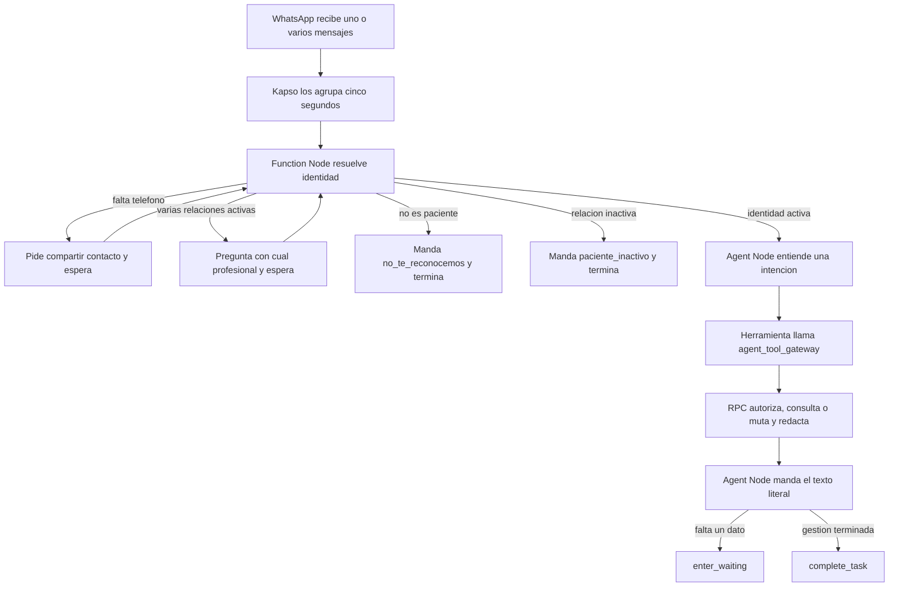

# El agente

Aquí está el modelo completo: el recorrido de un mensaje, el reparto de responsabilidades y las
diecinueve reglas que mandan. Los demás archivos citan estas reglas por número.

---

## 1. Qué es

Es un asistente de WhatsApp para la agenda de pacientes de profesionales de Agenda Psi. Consulta y
gestiona citas, pagos, comprobantes y reseñas. No es un expediente clínico, no diagnostica, no da
consejo psicológico y no negocia dinero.

---

## 2. El diseño en diez líneas

1. Kapso recibe los mensajes y junta durante cinco segundos los que llegan seguidos.
2. Una Function Node resuelve la identidad con datos confiables del canal; el modelo no participa.
3. La identidad usa primero BSUID, después el contacto de Kapso y por último el teléfono E.164.
4. `not_patient` e `inactive_patient` son desenlaces distintos y reciben textos distintos.
5. Sólo `identified` entra al Agent Node. `needs_contact` y `needs_professional` se resuelven antes.
6. El Agent Node usa `gpt-5.6-luna`, temperatura cero y `tool_only`.
7. Una intención llama una herramienta; el modelo nunca recibe UUID.
8. `agent_tool_gateway` verifica el contexto y llama una RPC que resuelve toda la regla de negocio.
9. La RPC devuelve `texto`, `espera`, `hecho` y `cierra`; el agente manda `texto` literalmente,
   salvo la única coletilla autorizada de `pendiente_lo_otro`.
10. Si falta una respuesta llama `enter_waiting`; si terminó llama `complete_task`. Con dos
    intenciones espera aunque la primera gestión haya terminado.

---

## 3. El recorrido de un mensaje



La identidad termina antes de gastar tokens. Kapso entrega automáticamente BSUID y el contexto del
contacto; no se le pregunta a la paciente por un identificador técnico. Sólo si el BSUID todavía
no está ligado y el evento no trae teléfono se usa la solicitud nativa para compartir contacto.
Con ese teléfono se busca un vínculo existente. Un contacto desconocido nunca crea por sí solo una
fila en `whatsapp_links`.

La conversación vive en la ejecución del Agent Node mientras está en `waiting`. No se crea una
tabla paralela de memoria. La base conserva sólo la verdad de negocio y la idempotencia de las
mutaciones.

El texto de la RPC sí vuelve al Agent Node para que éste llame `send_notification_to_user`. Eso
consume algunos tokens adicionales, pero evita que el gateway sea también transportista de
WhatsApp y tenga que resolver entregas duplicadas. En el MVP se privilegia esa separación. El
modelo tiene prohibido reescribir el texto.

---

## 4. Las cinco piezas

| Pieza | Responsabilidad | No hace |
|---|---|---|
| **WhatsApp y Kapso** | Recibir, agrupar, mantener la ejecución y enviar | No autorizar reglas de negocio |
| **Function Node de identidad** | Resolver BSUID, contacto, teléfono, relación y profesional | No usar IA ni modificar citas |
| **Agent Node** | Entender una intención, llamar una herramienta, enviar el texto y controlar espera o cierre | No calcular, autorizar ni redactar resultados de servidor |
| **`agent_tool_gateway`** | Validar origen, contexto, herramienta y forma; derivar idempotencia; llamar la RPC | No guardar memoria conversacional ni ejecutar OpenAI |
| **RPC de dominio** | Reautorizar, leer o mutar atómicamente, avisar a la profesional y redactar | No enviar WhatsApp ni confiar en el modelo |

`whatsapp_outbox` conserva los avisos programados y las plantillas iniciadas por el negocio. Las
respuestas de esta conversación salen directamente desde el Agent Node dentro de la ventana de
WhatsApp.

---

## 5. Las diecinueve reglas

1. **El agente nunca calcula fechas.** Empareja lo que escribió la paciente contra etiquetas que
   el servidor ya produjo.
2. **Ningún plazo se escribe a mano.** Sale de la configuración de la profesional.
3. **El aviso de cambio y la anticipación mínima no son lo mismo.** El primero determina el efecto
   de cancelar, reprogramar o cambiar modalidad; la segunda recorta los horarios que se ofrecen.
4. **El agente nunca dice “pagado” ni “aprobado”.** Dice que recibió el comprobante. La
   acreditación corresponde a la profesional.
5. **A la paciente se le dice qué ocurrirá, no que alguien decidirá después.** Las decisiones
   internas de cobro no se presentan como incertidumbre del agente.
6. **Los comprobantes se reciben para todas las profesionales.** Sólo la petición de prepago al
   agendar depende de su configuración.
7. **Cinco opciones como máximo y horizonte de treinta días.** Los servicios son la única
   excepción: hasta ocho.
8. **Sólo se ofrece lo permitido por esa profesional.** Una capacidad desactivada no aparece en el
   menú.
9. **Una herramienta de dominio por batch entrante.** Después de obtener un texto, el agente lo
   manda y espera o termina. `send_notification_to_user`, `enter_waiting` y `complete_task` son
   herramientas de control y no cuentan como acciones de dominio.
10. **“Dinero adentro” tiene una sola definición:** pago acreditado o comprobante adjunto. Una
    solicitud sellada sin archivo no cuenta.
11. **Una cita con dinero adentro sí puede cancelarse.** A tiempo se ofrecen las salidas que
    correspondan; tarde se cancela y se registra el efecto económico.
12. **En un cambio tardío, el pago anterior se conserva en su estado.** La cita nueva lleva su
    propio cobro.
13. **Ninguna mutación termina sin aviso a la profesional en la misma transacción.** Si no puede
    escribirse el aviso, la mutación no ocurre.
14. **Una mutación por batch.** Si se pidieron dos acciones, se atiende una y se invita a escribir
    la siguiente. Una RPC puede afectar varias citas sólo cuando el contrato lo define como una
    sola operación, por ejemplo confirmar “ambas”.
15. **El agente no usa `whatsapp_outbox` para contestar.** Esa cola sigue reservada a plantillas y
    avisos iniciados por el negocio.
16. **La concurrencia se resuelve donde se escribe.** Las RPC toman bloqueos transaccionales cortos
    y vuelven a comprobar el estado. No existe un candado de sesión durante toda la conversación.
17. **Ningún identificador interno cruza al modelo.** BSUID, UUID, `patient_id`, `professional_id`,
    `appointment_id`, `command_id` y equivalentes viajan sólo en contexto confiable.
18. **Los argumentos del modelo son pequeños y validados.** Sólo escalares y arreglos de escalares,
    con claves conocidas. El gateway rechaza lo demás antes de llamar la base.
19. **El “ahora” lo pone el servidor.** El modelo no manda fecha actual ni zona horaria. La zona
    canónica sale de la profesional.

---

## 6. Las diez funciones

Las herramientas son `ver_servicios`, `buscar_horarios`, `agendar`, `confirmar`, `reprogramar`,
`cancelar`, `cambiar_modalidad`, `mandar_comprobante`, `dejar_resena` y `mis_citas`.

Cada herramienta recibe sólo lo que la paciente dijo. La identidad y los identificadores llegan
por el `execution_context` y el `whatsapp_context` que Kapso inyecta; el agente sólo controla
`input`. El gateway deriva el contexto interno y la RPC vuelve a autorizarlo.

Las diez devuelven:

```json
{
  "texto": "Respuesta final para WhatsApp",
  "espera": null,
  "hecho": true,
  "cierra": true
}
```

El agente no interpreta `texto`: lo envía palabra por palabra. `espera` y `cierra` sólo controlan
si llama `enter_waiting` o `complete_task`. Los contratos completos viven en
`docs/02-funciones.md`.
