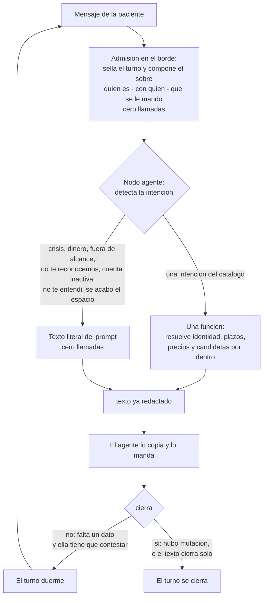

# El agente

Aquí está el modelo entero: el grafo, las tres superficies y las veinte reglas que mandan. Las
reglas viven aquí y en ningún otro lado: los demás archivos las citan por número —«regla 2»— y no
las repiten, para que corregir una sea corregir un solo renglón.

---

## 1. Qué es

Un asistente de WhatsApp para las pacientes de las profesionales de Agenda Psi. Sabe de sus citas,
de sus pagos y de su reseña, y de nada más, y sólo hace con ellas lo que esa profesional permite.
**Nunca interviene una persona.** Y hay cosas que no hace jamás: no diagnostica, no aconseja, no
negocia dinero, no calcula fechas ni plazos, no arma frases con datos sueltos, y no dice que algo
quedó listo si el servidor no le confirmó que se escribió.

---

## 2. El modelo en diez líneas

1. La paciente escribe por WhatsApp. El agente la atiende.
2. El agente hace una sola cosa: **detecta la intención**.
3. Cada intención tiene **una función** y la función se llama como la intención.
4. La función recibe lo poco que la paciente dijo, resuelve todo por dentro —quién es, con quién,
   qué cita, qué plazo, qué precio— y devuelve **el texto ya redactado en español**.
5. El agente copia ese texto y lo manda. No arma frases, no calcula fechas, no ramifica.
6. El agente nunca ve un identificador de la base. Ve números del 1 al 5 y prosa.
7. No hay función de apertura. Cada función se basta sola.
8. Lo que la paciente es —su nombre, su profesional, su estado— viaja en el sobre del turno,
   resuelto por la admisión, sin costar ninguna llamada.
9. Los textos de borde —crisis, fuera de alcance, dinero, no te reconocemos, cuenta inactiva, no
   te entendí, se acabó el espacio— viven literales en el prompt y cuestan cero.
10. El portero cuenta las llamadas, cuenta las mutaciones y cierra el turno. La regla es doce
    llamadas por gestión y una mutación por turno.

---

## 3. El grafo

Tres cosas que el grafo dice y conviene leer despacio.

**El sobre no es una llamada.** La admisión tiene que resolver teléfono → paciente →
profesional para poder sellar el turno; no puede no hacerlo. Con ese mismo trabajo compone un
sobre corto que viaja como variable hasta el nodo agente: cómo se llama, con quién está, en qué
estado, qué le permite hacer esa profesional, y qué plantilla le mandamos por última vez. No
gasta presupuesto y no puede fallar por tope. El detalle está en `docs/07-portero.md`.

**El sobre sirve para hablar, no para actuar.** Las once funciones vuelven a resolver la
identidad por su cuenta, del contexto sellado del turno, y nunca del sobre. Si el sobre estuviera
viejo, lo peor que pasa es un saludo con un nombre equivocado durante un mensaje; nunca una cita
movida de quien no era. Ése es el corte de seguridad de todo el diseño.

**El turno duerme entre dos mensajes de ella, no se cierra.** Una gestión completa es un turno
abierto, y por eso agendar cabe en tres llamadas. El turno sólo se cierra cuando algo se escribió
en la base, o cuando el texto que se mandó cierra solo.

---

## 4. Las tres superficies

| Superficie | Qué hace | Qué **no** hace |
|---|---|---|
| **La admisión, en el borde** | Recibe el mensaje, descarta el repetido, sella teléfono, paciente, profesional y sesión, compone el sobre, y arranca la ejecución o despierta la que estaba dormida | No habla con la paciente, no lee dominio, no interpreta el mensaje, no toca citas ni pagos |
| **El nodo agente** | Detecta la intención, llama una función con lo que ella dijo, copia el texto que vuelve y lo manda | No calcula fechas, horas, plazos ni precios; no arma frases; no cuenta llamadas; no decide si algo se puede; no ve un identificador de la base |
| **El servidor: el portal, el portero y las once funciones** | Autoriza, cuenta, resuelve identidad y candidatas, muta una sola vez, avisa a la profesional en la misma transacción, y **redacta el texto** | No decide de qué se habla, no manda mensajes por su cuenta, no encola plantillas |

El reparto tiene una consecuencia: **el único componente que ve el mensaje crudo de WhatsApp es
la admisión**. La foto del comprobante entra ahí, se guarda ahí, y la
función la toma del renglón del mensaje entrante. El modelo no mira la imagen.

---

## 5. Las veinte reglas

Las nueve primeras son del ensayo. De la diez en adelante salen del dinero, del portero y de la
base viva. Ninguna es negociable.

1. **El agente nunca calcula fechas.** Ni «el próximo sábado es el 29», ni restas de horas.
   Empareja lo que ella escribe contra una lista que el servidor ya resolvió, con el nombre del
   día y su fecha. Un modelo que calcula fechas se equivoca en silencio.
2. **Ningún plazo se escribe a mano.** Salen de la ficha de cada profesional. Hoy Miranda pide 12
   horas de aviso de cambio y las otras cinco 24. Un texto con «24 horas» adentro le miente a las
   pacientes de Miranda en la dirección peligrosa. Única excepción: las 24 horas del reloj del
   prepago, que es un valor fijo del producto.
3. **El tiempo mínimo es regla de la paciente, no de la profesional.** La profesional nunca está
   limitada por él: siempre decide. El plazo sólo gobierna lo que el agente permite y lo que
   advierte.
4. **El agente nunca dice «pagado» ni «aprobado».** Dice «recibí tu comprobante». Quien acredita
   un pago es la profesional, no el agente.
5. **A la paciente no se le dice que la profesional va a decidir.** Se le dice lo que va a pasar.
   Que la profesional condone o no es asunto interno suyo.
6. **Cobrar desde el agente sólo aplica cuando la profesional cobra por adelantado.** Si cobra
   después, el agente no pide comprobante ni menciona pago al agendar. Hoy sólo Araceli cobra
   antes.
7. **Cinco opciones como máximo** en cualquier lista, y horizonte de 30 días. Si quiere algo más
   lejano, se consulta de nuevo.
8. **El agente sólo ofrece lo que esa profesional permite.** El menú es personalizado: si no
   permite cambios de modalidad, no se menciona. No se ofrece para después negar.
9. **El presupuesto es de 12 llamadas por gestión.** Agendar gasta 3, así que quedan nueve de
   margen para quien pregunta mucho. El cierre del turno vive fuera del presupuesto.
10. **«Dinero adentro» tiene una definición exacta y una sola:** el cobro está acreditado, o hay
    un comprobante pegado. Una petición sellada sin archivo **no** es dinero adentro.
11. **Una cita con dinero adentro no se cancela.** Se ofrece moverla, y pasar el pago si hay una
    próxima del mismo servicio. Si insiste, se le dice que eso lo resuelve su profesional desde su
    app. El agente no cede: cancelar ahí perdería su dinero.
12. **En el cambio tardío el pago viejo se congela tal como está** y queda abierta la decisión de
    cobro para la profesional. La cita nueva va aparte, con su propio pago. La superficie de la
    paciente es hoy la única que abre esa decisión: nadie más la produce.
13. **Ninguna mutación termina sin que la profesional se entere, en la misma transacción.** Si el
    aviso no se pudo escribir, la mutación no ocurrió. El aviso del comprobante **nunca** lleva el
    monto.
14. **Una mutación por turno.** Después de mutar, el turno se cierra. Si se durmiera, el «y de
    paso cancélame la del jueves» del mensaje siguiente chocaría con el portero.
15. **El agente no encola nada en la cola de salida.** Contesta dentro de la sesión abierta. Esa
    cola sólo produce plantillas y sólo la usan los cron. Leer la pista de la última plantilla no
    es encolar.
16. **Todo pasa por el portero.** Se reclama antes de trabajar y se finaliza después. Ninguna
    función se llama por fuera. Un turno no se duerme con una herramienta a medio terminar.
17. **Ningún identificador de la base cruza al modelo.** Ni un uuid, ni nada que ocupe su lugar,
    ni una etiqueta que lo lleve pegado. Lo que viaja son números de lista: 1, 2, 3. Un número
    sólo vale contra la última lista de esa función en ese turno.
18. **La entrada y la salida son planas.** Escalares y arreglos de escalares, nunca un objeto
    anidado ni un arreglo de objetos. Todas las claves van siempre presentes, en nulo cuando no
    aplican. El parser del nodo agente rechaza el JSON mal formado antes de invocar, y entonces la
    función nunca corre.
19. **El «ahora» lo pone el servidor.** Ninguna función acepta zona horaria ni fecha de hoy como
    parámetro del modelo. La zona del negocio es la canónica y se normaliza en código.
20. **Nada de lo que se escriba propone borrar tablas, RLS, RPC ni ningún objeto que use la app
    Flutter.** Si un objeto lo toca la app, se queda. Sin excepciones y sin matices.

---

## 6. Las once funciones

Son once y se llaman como la intención: `ver_servicios`, `buscar_horarios`, `agendar`,
`confirmar`, `reprogramar`, `cancelar`, `cambiar_modalidad`, `pasar_pago`, `mandar_comprobante`,
`dejar_resena` y `mis_citas`. Ocho escriben, tres leen. Cada una salió de una frase que Gael
ensayó: quítese cualquiera y hay una conversación que se queda sin contestar. Las once cuelgan de
una sola función de Kapso, que despacha por ruta.

Las once devuelven la misma forma de cuatro claves: `texto`, `espera`, `hecho`, `cierra`. **No
hay campo de error**, y es deliberado: un código que el agente sólo puede convertir en un texto
es ruido que le enseña a ramificar. Los parámetros, los textos y los avisos están en
`docs/02-funciones.md`. Los textos literales, en `docs/06-textos.md`.
