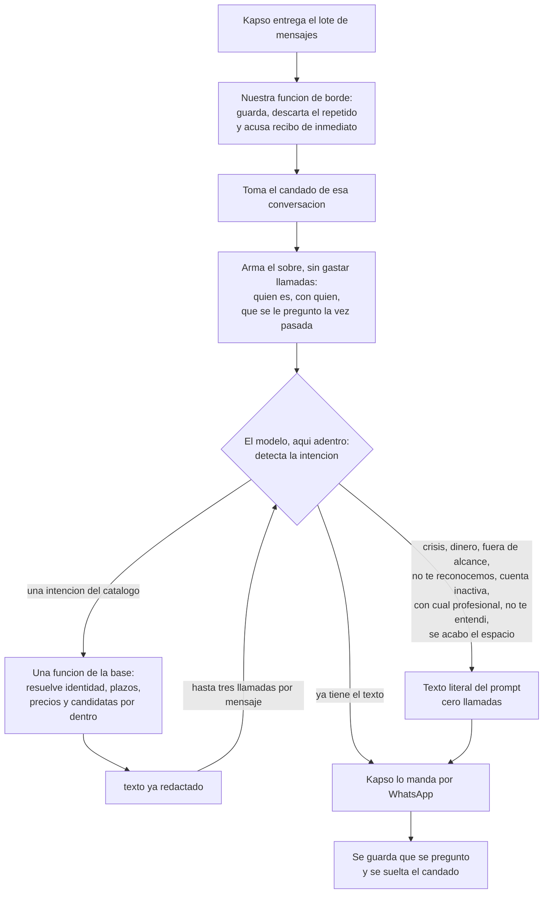

# El agente

Aquí está el modelo entero: el recorrido de un mensaje, las cuatro piezas y las veinte reglas que
mandan. Las reglas viven aquí y en ningún otro lado: los demás archivos las citan por número
—«regla 2»— y no las repiten, para que corregir una sea corregir un solo renglón.

---

## 1. Qué es

Un asistente de WhatsApp para las pacientes de las profesionales de Agenda Psi. Sabe de sus citas,
de sus pagos y de su reseña, y de nada más, y sólo hace con ellas lo que esa profesional permite.
**Nunca interviene una persona.** Y hay cosas que no hace jamás: no diagnostica, no aconseja, no
negocia dinero, no calcula fechas ni plazos, no arma frases con datos sueltos, y no dice que algo
quedó listo si el servidor no le confirmó que se escribió.

---

## 2. El diseño en diez líneas

1. La paciente escribe por WhatsApp. Kapso entrega lo que llega, siempre en lote, aunque venga un
   solo mensaje.
2. El lote cae en **nuestra función de borde**. Ahí se guarda, se descarta el repetido, se acusa
   recibo de inmediato y el trabajo sigue aparte.
3. **El modelo corre adentro de esa función**, en nuestro código. Hace una sola cosa: **detecta la
   intención**.
4. Cada intención tiene **una función** y la función se llama como la intención.
5. La función recibe lo poco que la paciente dijo, resuelve todo por dentro —quién es, con quién,
   qué cita, qué plazo, qué precio— y devuelve **el texto ya redactado en español**.
6. El modelo copia ese texto y se manda por Kapso. No arma frases, no calcula fechas, no ramifica.
7. No hay función de apertura. Cada función se basta sola.
8. El modelo nunca ve un identificador de la base. Ve números del 1 al 5 y prosa.
9. Lo que la paciente es —su nombre, su profesional, su estado— viaja en el sobre que arma la
   función de borde, sin costar ninguna llamada. Los textos de borde viven literales en el prompt
   y cuestan cero.
10. El freno son tres cosas: tres llamadas por mensaje, un mensaje a la vez por conversación, y
    una sola mutación.

---

## 3. El recorrido de un mensaje

Cuatro cosas que el recorrido dice y conviene leer despacio.

**El acuse de recibo va primero, antes de pensar.** Si la función de borde tarda en contestarle a
Kapso, Kapso da la entrega por fallida y la vuelve a mandar; la paciente recibe dos respuestas a
lo mismo. Por eso se contesta de inmediato y el trabajo sigue en segundo plano.

**El sobre no es una llamada.** La función de borde tiene que resolver teléfono → paciente →
profesional para saber de quién es el mensaje; no puede no hacerlo. Con ese mismo trabajo arma un
sobre corto que viaja al modelo: cómo se llama, con quién está, en qué estado, qué le permite
hacer esa profesional, y qué le mandamos la última vez. No gasta ninguna de las tres llamadas y no
puede fallar por tope. El detalle está en `docs/07-portero.md`.

**El sobre sirve para hablar, no para actuar.** Las once funciones vuelven a resolver la identidad
por su cuenta, del teléfono que entró, y nunca del sobre. Si el sobre estuviera viejo, lo peor que
pasa es un saludo con un nombre equivocado durante un mensaje; nunca una cita movida de quien no
era. Ése es el corte de seguridad de todo el diseño.

**Lo que se recuerda entre un mensaje y el siguiente no son las palabras.** Es qué se le preguntó,
qué función lo preguntó y qué opciones numeradas se le ofrecieron. Eso vive en una tabla chica,
una fila por teléfono. Con ella, un «la 2» nunca aterriza en la función equivocada, porque no lo
decide el modelo. Las palabras también se guardan, pero para poder depurar, no porque el agente
las necesite: **cuántos días se guardan hay que decidirlo antes de que entre la primera paciente
de verdad**, porque son conversaciones de terapia.

---

## 4. Las cuatro piezas

| Pieza | Qué hace | Qué **no** hace |
|---|---|---|
| **Kapso, la mensajería** | Guarda el número y las plantillas, junta los mensajes que llegan seguidos, entrega el lote y manda lo que le damos | No piensa: no interpreta el mensaje, no decide nada y no toca la base |
| **Nuestra función de borde** | Recibe el lote, descarta el repetido, guarda el mensaje, acusa recibo, toma el candado, arma el sobre, corre el modelo, despacha las llamadas y manda la respuesta | No habla por su cuenta, no interpreta el mensaje, no toca citas ni pagos |
| **El modelo, adentro de esa función** | Detecta la intención, llama una función con lo que ella dijo, copia el texto que vuelve y lo manda | No calcula fechas, horas, plazos ni precios; no arma frases; no cuenta llamadas; no decide si algo se puede; no ve un identificador de la base |
| **Las once funciones de la base** | Resuelven identidad, plazos, precios y candidatas, mutan una sola vez, avisan a la profesional en la misma transacción, y **redactan el texto** | No deciden de qué se habla, no mandan mensajes por su cuenta, no encolan plantillas |

Entre la función de borde y las funciones de la base no hay nada en medio: ningún intermediario
autoriza lo que la propia función ya autoriza.

El reparto tiene una consecuencia: **el único componente que ve el mensaje crudo de WhatsApp es la
función de borde**. La foto del comprobante entra ahí y se guarda ahí, y para bajarla se pide una
liga fresca con el identificador del archivo, porque no está comprobado que la liga del mensaje
dure. La función la toma del renglón del mensaje entrante. El modelo no mira la imagen.

---

## 5. Las veinte reglas

Las nueve primeras son del ensayo. De la diez en adelante salen del dinero, del recorrido del
mensaje y de la base viva. Ninguna es negociable.

1. **El agente nunca calcula fechas.** Ni «el próximo sábado es el 29», ni restas de horas.
   Empareja lo que ella escribe contra una lista que el servidor ya resolvió, con el nombre del
   día y su fecha. Un modelo que calcula fechas se equivoca en silencio.
2. **Ningún plazo se escribe a mano.** Salen de la ficha de cada profesional, y cada una configura
   el suyo. Si una pide 24 horas de aviso de cambio y otra 12, un texto con «24 horas» adentro le
   miente a las pacientes de la segunda, y le miente en la dirección peligrosa: creen que ya es
   tarde cuando todavía están a tiempo. No hay ninguna excepción: no queda un solo plazo fijo del
   producto que el agente diga en voz alta.
3. **El tiempo mínimo ya no bloquea.** Cancelar y reprogramar se permiten siempre; el plazo sólo
   decide si queda un cargo. **La única excepción es el cambio de modalidad**, que sí se niega
   fuera de plazo, porque la profesional necesita saber con tiempo si va al consultorio. Y el
   plazo nunca limita a la profesional: ella siempre decide.
4. **El agente nunca dice «pagado» ni «aprobado».** Dice «recibí tu comprobante». Quien acredita
   un pago es la profesional, no el agente.
5. **A la paciente no se le dice que la profesional va a decidir.** Se le dice lo que va a pasar.
   Que la profesional condone o no es asunto interno suyo. «Tu pago queda registrado y
   {profesional} lo resuelve contigo» sí es decir lo que va a pasar; «ella decidirá si te lo
   cobra» no lo es.
6. **Recibir comprobantes aplica a todas las profesionales**, cobren antes o después de la sesión.
   Lo único que depende del cobro por adelantado es **pedir pago al agendar**: si la profesional
   cobra después, el agente no menciona dinero al agendar, pero sigue recibiendo y registrando el
   comprobante que ella mande.
7. **Cinco opciones como máximo** en cualquier lista, y horizonte de 30 días. Si quiere algo más
   lejano, se consulta de nuevo.
8. **El agente sólo ofrece lo que esa profesional permite.** El menú es personalizado: si no
   permite cambios de modalidad, no se menciona. No se ofrece para después negar.
9. **Tres llamadas a funciones por mensaje, y ni una más.** El tope es por mensaje, no por
   conversación: cada mensaje se atiende entero y se acaba, y el siguiente trae sus tres. Existe
   por un caso concreto y nada más: un modelo confundido llama funciones en círculo y nadie lo
   detiene. A la tercera se contesta con el texto `se_acabo_el_espacio`.
10. **«Dinero adentro» tiene una definición exacta y una sola:** el cobro está acreditado, o hay
    un comprobante pegado. Una petición sellada sin archivo **no** es dinero adentro.
11. **Una cita con dinero adentro sí se cancela.** Antes se ofrecen dos salidas: pasar el pago a
    su próxima cita, o reprogramar ésta y que el pago se vaya con ella. Si dice que no a las dos,
    se cancela: se registra como cancelación sin tiempo mínimo, el estado del pago se conserva tal
    cual, y se le dice que su pago queda registrado y su profesional lo resuelve con ella. **El
    agente no insiste una segunda vez.**
12. **En el cambio tardío el pago viejo se congela tal como está** y queda abierta la decisión de
    cobro para la profesional. La cita nueva va aparte, con su propio pago. La superficie de la
    paciente es hoy la única que abre esa decisión: nadie más la produce.
13. **Ninguna mutación termina sin que la profesional se entere, en la misma transacción.** Si el
    aviso no se pudo escribir, la mutación no ocurrió. El aviso del comprobante **nunca** lleva el
    monto.
14. **Una mutación por mensaje.** Después de escribir se manda el texto y el trabajo de ese
    mensaje se acaba. Si ella pidió dos cosas, la segunda se atiende en el mensaje siguiente.
    Confirmar dos citas cuando contesta «ambas» no rompe la regla: es una sola llamada y una sola
    transacción.
15. **El agente no encola nada en la cola de salida.** Contesta dentro de la sesión abierta. Esa
    cola sólo produce plantillas y sólo la usan los trabajos programados. Leer la pista de la
    última plantilla no es encolar.
16. **Un mensaje a la vez por conversación.** Mientras se atiende un mensaje de ese teléfono, el
    siguiente espera. Sin ese candado, un «la 2» mandado dos veces se atiende dos veces en
    paralelo y salen dos citas. Es lo que más fácil se olvida.
17. **Ningún identificador de la base cruza al modelo.** Ni un uuid, ni nada que ocupe su lugar,
    ni una etiqueta que lo lleve pegado. Lo que viaja son números de lista: 1, 2, 3. Un número
    sólo vale contra la última lista que esa función le ofreció, y de eso se acuerda la base, no
    el modelo.
18. **La entrada y la salida son planas.** Escalares y arreglos de escalares, nunca un objeto
    anidado ni un arreglo de objetos. Todas las claves van siempre presentes, en nulo cuando no
    aplican. Nuestro código revisa el JSON antes de invocar; si viene mal formado, la función
    nunca corre.
19. **El «ahora» lo pone el servidor.** Ninguna función acepta zona horaria ni fecha de hoy como
    parámetro del modelo. La zona del negocio es la canónica y se normaliza en código.
20. **Nada de lo que se escriba propone borrar tablas, RLS, RPC ni ningún objeto que use la app
    Flutter.** Si un objeto lo toca la app, se queda. Sin excepciones y sin matices.

---

## 6. Las once funciones

Son once y se llaman como la intención: `ver_servicios`, `buscar_horarios`, `agendar`,
`confirmar`, `reprogramar`, `cancelar`, `cambiar_modalidad`, `pasar_pago`, `mandar_comprobante`,
`dejar_resena` y `mis_citas`. Ocho escriben, tres leen. Cada una salió de una frase que Gael
ensayó: quítese cualquiera y hay una conversación que se queda sin contestar. Viven en la base y
la función de borde las llama directo, sin nada en medio.

Agendar tiene un paso que las demás no tienen: **pregunta antes de apartar**. «¿Aparto tu cita del
miércoles 2 a las 4:00, en línea?», y la cita se crea cuando ella dice que sí.

Las once devuelven la misma forma de cuatro claves: `texto`, `espera`, `hecho`, `cierra`. **No
hay campo de error**, y es deliberado: un código que el agente sólo puede convertir en un texto
es ruido que le enseña a ramificar. Tampoco hay un texto para cuando el servidor no sabe si la
escritura ocurrió: si no lo sabe, lee de vuelta y contesta con certeza. Los parámetros, los textos
y los avisos están en `docs/02-funciones.md`. Los textos literales, en `docs/06-textos.md`.
