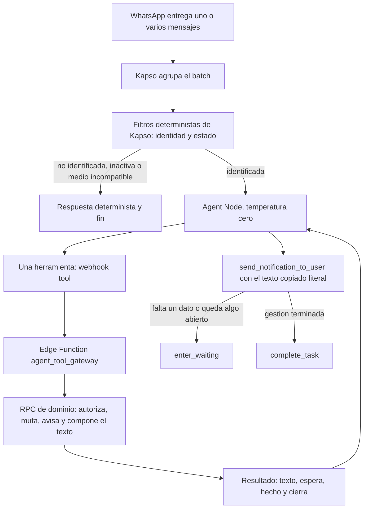

# 01 · El producto

Corte: 2026-09-02.

Este archivo es el **dueño del modelo de producto**: qué es el agente y qué no es, las diecinueve
reglas numeradas que mandan sobre todo lo demás, la identidad de quien escribe, el dinero, los
horarios y el alcance por fases.

Lo que **no** vive aquí, y se cita en vez de repetirse:

| Tema | Dueño |
|---|---|
| Guiones de conversación y textos visibles por clave | `docs/02-conversaciones-y-textos.md` |
| Contratos de herramienta, argumentos y forma del resultado | `docs/03-contratos.md` |
| Workflow de Kapso, trigger, variables, prompt y Agent Node | `docs/04-workflow-y-prompt.md` |
| Pseudocódigo del gateway y de las RPC | `docs/05-pseudocodigo.md` |
| Registro de decisiones, riesgos aceptados, límites de admisión y pendientes globales | `docs/06-implementacion-y-decisiones.md` |

**Nada de aquí describe una base concreta.** Cada regla se escribe sobre **lo que cada profesional
configura** —si cobra antes o después, cuánto plazo de aviso pide, cuánta anticipación mínima
exige, qué precio tiene cada servicio—, nunca sobre lo que alguien tenga configurado hoy. Los
nombres y las cifras de los ejemplos son inventados y están marcados como ejemplos.

**Cómo leer la evidencia.** Toda afirmación de esquema lleva su fuente. Las marcadas
*(comprobado 2026-09-02)* se ejecutaron en lectura contra el proyecto de producción
`ssyzfeadyrczlzjbvxyl` mientras se escribía este archivo. Las marcadas *(mapeo)* vienen del mapeo
previo, que las verificó contra el mismo proyecto y contra el código desplegado en
`/home/user/Agenda-Psi-V2`. Lo que no se pudo comprobar está en §7 como pendiente y **no se
estima**.

---

## Índice

1. [Qué es el agente y qué no es](#1-qué-es-el-agente-y-qué-no-es)
2. [Las diecinueve reglas](#2-las-diecinueve-reglas)
3. [Identidad](#3-identidad)
4. [Dinero](#4-dinero)
5. [Horarios (Fase 2)](#5-horarios-fase-2)
6. [Alcance por fases](#6-alcance-por-fases)
7. [Pendientes de este archivo](#7-pendientes-de-este-archivo)

---

## 1. Qué es el agente y qué no es

### 1.1 Qué es

Un asistente de WhatsApp para la agenda de las pacientes de las profesionales de Agenda Psi.
Consulta y gestiona **citas, pagos visibles y comprobantes**, y en el catálogo completo también
modalidades, servicios, horarios y reseñas. Cada gestión la resuelve el servidor y el agente sólo
la enruta.

### 1.2 Qué no es

- **No es un expediente clínico.** No diagnostica, no da consejo psicológico y no interpreta nada
  de lo que la paciente cuente sobre su tratamiento.
- **No es un cobrador ni un cajero.** No negocia dinero, no acredita pagos, no aprueba
  comprobantes, no da descuentos ni devoluciones y nunca cambia el importe de un cobro (§4.1, D4).
- **No es un chat largo.** El tope decidido es de **cuatro mensajes salientes por gestión**. Si una
  gestión no cabe en cuatro, el diseño de esa gestión está mal, no el tope. El reparto concreto de
  esos cuatro mensajes por guion vive en `docs/02-conversaciones-y-textos.md`.
- **No es un redactor.** El texto que lee la paciente lo compone la RPC de dominio en el servidor.
  El modelo lo copia literal y no lo toca (regla 9 y regla 15).
- **No es una segunda base de datos.** No hay memoria conversacional propia. El único estado que
  viaja entre turnos es el estado de control sellado en `vars.agent_state` —`command_id`,
  `pending_step` y `allowed_next_tools`—, cuyo dueño es `docs/04-workflow-y-prompt.md`.

### 1.3 El recorrido de un mensaje



Cinco cosas de ese recorrido son decisiones, no detalles:

1. **Los filtros de identidad y estado corren antes del modelo.** Son deterministas, no gastan
   tokens y no llaman a nadie. Una persona que no es paciente activa recibe su respuesta sin que el
   modelo se entere de que escribió (§3).
2. **El agente llama exactamente una herramienta de dominio por batch** (regla 9). Esa herramienta
   es un webhook tool que aterriza en `agent_tool_gateway`.
3. **La RPC hace todo el trabajo de negocio en una transacción:** autoriza otra vez, lee o muta,
   avisa a la profesional (regla 13) y **compone el texto final**.
4. **El texto regresa al Agent Node y el modelo lo manda con `send_notification_to_user`,
   copiándolo literal.** Ésa es la única vía de salida del texto de esta conversación, y la regla
   dura que la sostiene es la regla dura 7 del prompt, cuyo dueño es
   `docs/04-workflow-y-prompt.md`. El resultado que ve el modelo lleva las cuatro claves:
   `{texto, espera, hecho, cierra}`.
5. **El turno termina con `enter_waiting` o con `complete_task`, nunca con los dos ni con
   ninguno.** Es la única decisión que le queda al modelo después de recibir el resultado.

---

## 2. Las diecinueve reglas

Los demás archivos citan estas reglas **por número**. Los números **no se reciclan**: una regla que
sólo se ejerce en una fase posterior conserva su número y se marca con su fase. Renumerar rompería
en silencio todas las citas cruzadas.

**Cómo leer la columna de fase.** `MVP` quiere decir que la regla se ejerce con las cuatro
herramientas del MVP (`mis_citas`, `confirmar`, `mandar_comprobante`, `crisis`). `2` y `3` quieren
decir que la regla es correcta y está decidida, pero que ninguna herramienta habilitada la ejerce
todavía. Ninguna regla está derogada.

| # | Regla | Fase |
|---|---|---|
| 1 | **El agente nunca calcula fechas.** Empareja lo que escribió la paciente contra etiquetas que el servidor ya produjo. | MVP |
| 2 | **Ningún plazo se escribe a mano.** Sale de la configuración de la profesional. | MVP · ver §2.1 |
| 3 | **El aviso de cambio y la anticipación mínima no son lo mismo.** El primero determina el efecto de cancelar, reprogramar o cambiar modalidad; la segunda recorta los horarios que se ofrecen. | 2 y 3 |
| 4 | **El agente nunca dice “pagado” ni “aprobado”.** Dice que recibió el comprobante. La acreditación corresponde a la profesional. | MVP |
| 5 | **A la paciente se le dice qué ocurrirá, no que alguien decidirá después.** Las decisiones internas de cobro no se presentan como incertidumbre del agente. | MVP |
| 6 | **Los comprobantes se reciben para todas las profesionales.** Sólo la petición de prepago al agendar depende de su configuración. | MVP la primera oración · 2 la segunda |
| 7 | **Cinco opciones como máximo y horizonte de treinta días.** Los servicios son la única excepción: hasta ocho. | 2 (horas) y 3 (servicios) |
| 8 | **Sólo se ofrece lo permitido por esa profesional.** Una capacidad desactivada no aparece en el menú. | MVP |
| 9 | **Una herramienta de dominio por batch entrante.** Después de obtener el resultado, el agente manda `texto` con `send_notification_to_user` y espera o termina. `send_notification_to_user`, `enter_waiting` y `complete_task` son herramientas de control y no cuentan como acciones de dominio. **`crisis` sí cuenta: es la undécima herramienta de dominio.** | MVP |
| 10 | **“Dinero adentro” tiene una sola definición:** pago acreditado o comprobante adjunto. Una solicitud sellada sin archivo no cuenta. | MVP la definición · 2 su consecuencia |
| 11 | **Una cita con dinero adentro sí puede cancelarse.** A tiempo se ofrecen las salidas que correspondan; tarde se cancela y se registra el efecto económico. | 2 |
| 12 | **En un cambio tardío, el pago anterior se conserva en su estado.** La cita nueva lleva su propio cobro. | 2 y 3 |
| 13 | **Ninguna mutación termina sin aviso a la profesional en la misma transacción.** Si no puede escribirse el aviso, la mutación no ocurre. **También vale para `crisis`,** que notifica sin mutar agenda. | MVP |
| 14 | **Una mutación por batch.** Si se pidieron dos acciones, se atiende una y se invita a escribir la siguiente. Una RPC puede afectar varias citas sólo cuando el contrato lo define como una sola operación, por ejemplo confirmar “ambas”. | MVP |
| 15 | **El agente no usa `whatsapp_outbox` para contestar.** Esa cola sigue reservada a plantillas y avisos iniciados por el negocio. La respuesta de esta conversación sale del Agent Node con `send_notification_to_user`, dentro de la ventana de WhatsApp. | MVP |
| 16 | **La concurrencia se resuelve donde se escribe.** Las RPC toman bloqueos transaccionales cortos y vuelven a comprobar el estado. No existe un candado de sesión durante toda la conversación. | MVP |
| 17 | **Ningún identificador interno cruza al modelo.** BSUID, UUID, `patient_id`, `professional_id`, `appointment_id`, `command_id` y equivalentes viajan sólo en contexto confiable. El `command_id` **lo acuña el gateway** a partir de (`conversation_id`, contador de turno) y viaja sellado en `vars.agent_state`. **No se deriva de ningún WAMID.** | MVP |
| 18 | **Los argumentos del modelo son pequeños y validados.** Sólo escalares y arreglos de escalares, con claves conocidas. El gateway rechaza lo demás antes de llamar la base, **y además rechaza toda herramienta que no esté en `allowed_next_tools` del `pending_step` vigente.** | MVP |
| 19 | **El “ahora” lo pone el servidor.** El modelo no manda fecha actual ni zona horaria. La zona canónica sale de la profesional. | MVP |

### 2.1 Cuatro reglas que hay que leer con su límite

**Regla 2 · el motor de políticas no existe desplegado.** La regla es correcta y no se toca, pero
hoy nadie la ejecuta. `professional_appointment_policies.free_change_notice_minutes` existe, es
`NOT NULL` con valor por omisión `1440`, y aparece en exactamente dos funciones desplegadas:
`get_appointment_policies`, que lo devuelve, y `update_appointment_policies`, que lo escribe
*(comprobado 2026-09-02)*. **Ninguna función desplegada decide nada con él.** Quien implemente
cancelar o reprogramar (Fase 2) construye ese motor; no lo encuentra hecho. Ver §4.6.

**Regla 7 · no se confunde con la regla dura 7 del prompt.** Ésta, la regla 7 de este archivo, es
el tope de opciones y el horizonte. La **regla dura 7** del prompt es la del envío literal del
texto y vive en `docs/04-workflow-y-prompt.md`. Son dos reglas distintas con el mismo número en
listas distintas, **las dos vigentes**, y ninguna sustituye a la otra. Si alguien borra una
creyendo que borra la otra, se pierde o el tope de cinco opciones o la fidelidad del texto.

**Regla 9 · `crisis` consume el cupo.** En borradores anteriores `crisis` era un texto fijo que el
modelo mandaba solo. Ya no: es la undécima herramienta de dominio, sirve su texto desde el servidor
y notifica a la profesional en la misma transacción. Por eso cuenta contra el tope de una
herramienta de dominio por batch, y por eso no se mezcla con otra gestión.

**Regla 13 · es la que hace visible la mutación.** `notifications` es el único canal con Realtime
hacia la app de la profesional, así que un aviso que no se escribe en la misma transacción es una
mutación que la profesional no ve. La regla no es una cortesía: es el mecanismo. El detalle de las
claves literales del payload vive en `docs/03-contratos.md`.

---

## 3. Identidad

Antes de que el modelo vea nada, un filtro determinista contesta una sola pregunta: **quién
escribió y con qué profesional**. No usa IA, no clasifica intención y no gasta tokens. Su mecánica
—Function Node, variables del trigger, atestación del mensaje entrante— vive en
`docs/04-workflow-y-prompt.md`; aquí está el modelo de producto.

### 3.1 Los seis estados

| Estado | Significado | Desenlace |
|---|---|---|
| `identified` | Hay una relación activa y una profesional resuelta | Entra al Agent Node |
| `needs_contact` | Llegó un BSUID no ligado y no hay teléfono confiable | Solicitud nativa de contacto y espera |
| `needs_professional` | La misma identidad tiene más de una relación activa | Lista numerada de profesionales y espera |
| `not_patient` | No existe relación después de agotar la resolución válida | `no_te_reconocemos` y fin |
| `inactive_patient` | Sí existe la relación, pero está inactiva | `paciente_inactivo` y fin |
| `identity_conflict` | BSUID y teléfono apuntan a relaciones locales incompatibles | No se une nada; `fuera_de_alcance`, se registra y fin |

**`not_patient` e `inactive_patient` son desenlaces distintos y reciben textos distintos.** Quien
tiene un vínculo inactivo no es una desconocida: conserva su relación local y merece otro mensaje.
Esta separación se prueba de punta a punta.

**Sólo `identified` entra al Agent Node.** Los otros cinco se resuelven con texto compuesto en
servidor, sin modelo. Las claves de texto viven en `docs/02-conversaciones-y-textos.md`.

### 3.2 Orden de resolución

Se ejecuta en este orden y **gana el primero que resuelve**:

1. Obtener el `business_portfolio_id` desde una configuración confiable del servidor que mapea el
   `phone_number_id` receptor. No se usa el `business_account_id` del WABA como sustituto.
2. Buscar por `(business_portfolio_id, business_scoped_user_id)`.
3. Si no resuelve, buscar por `kapso_contact_id` como ancla de reconciliación, y validar contra el
   contacto actual de Kapso antes de actualizar un BSUID rotado.
4. Si sigue sin resolver y hay teléfono, normalizarlo a E.164 y buscarlo.
5. Comprobar la actividad de la relación y de los objetos de negocio necesarios.
6. Si quedan varias relaciones activas, producir una lista numerada sin UUID y preguntar.

Dos invariantes que no se negocian:

- **Un contacto desconocido nunca crea por sí solo una fila en `whatsapp_links`.** Compartir
  contacto confirma un número; no crea una relación de negocio.
- **`parent_business_scoped_user_id` y `whatsapp_username` se guardan como metadatos y nunca
  autorizan.** Si teléfono y BSUID apuntan a personas distintas, no se escoge uno, no se fusionan
  filas y no se sobrescribe nada: es `identity_conflict`.

### 3.3 Qué es una “relación activa”

Hasta ahora el repositorio usaba el término sin anclarlo a ninguna columna. Queda definido así:

> **Una relación es activa cuando la fila de `whatsapp_links` apunta a una paciente cuyo
> `patients.patient_status` es `active`.** El valor `inactive` produce `inactive_patient`. No hay
> tercer valor.

Evidencia: el enum `patient_status` tiene exactamente dos etiquetas, `active` e `inactive`, y
`patients.patient_status` es `NOT NULL` con valor por omisión `active` *(comprobado 2026-09-02)*.
`whatsapp_links` tiene `patient_id` y `professional_id` `NOT NULL`, así que toda fila ya nombra la
pareja *(comprobado 2026-09-02)*.

De ahí sale también la razón de que la misma persona pueda caer en `needs_professional`: el índice
único de `whatsapp_links` es por profesional, portafolio y BSUID, deliberadamente, porque la misma
paciente puede tener relación con más de una profesional.

### 3.4 Qué estados son alcanzables hoy y cuáles no

Esto importa porque decide qué se prueba en el MVP y qué se escribe para más adelante.

El trigger de mensajes entrantes de Kapso expone únicamente `context.phone_number`,
`context.conversation_id`, `context.channel`, `last_user_input` y tres variables de system. **No
expone BSUID ni WAMID.** El inventario completo y su fuente viven en
`docs/04-workflow-y-prompt.md`. Consecuencia directa: los pasos 2 y 3 del orden de resolución no
tienen hoy con qué alimentarse, y la resolución real empieza en el paso 4, el teléfono.

| Estado | ¿Alcanzable hoy? | Por qué |
|---|---|---|
| `identified` | **Sí** | Se resuelve por teléfono. `whatsapp_links.phone` es `NOT NULL` *(comprobado 2026-09-02)*, así que toda fila existente es alcanzable por esa vía |
| `not_patient` | **Sí** | Un teléfono sin fila en `whatsapp_links` cae aquí de inmediato |
| `inactive_patient` | **Sí** | Depende sólo de `patients.patient_status`, que está poblado y es `NOT NULL` |
| `needs_professional` | **Sí** | Depende de que el mismo teléfono tenga más de una relación activa; el esquema lo permite por diseño |
| `needs_contact` | **No, todavía** | Requiere un inbound con BSUID y sin teléfono. El trigger no entrega BSUID, así que ese camino no se puede ejercitar |
| `identity_conflict` | **No, todavía** | Requiere BSUID **y** teléfono apuntando a filas distintas. Sin BSUID en el trigger, no hay conflicto que detectar |

**Los dos inalcanzables se escriben igual y se implementan igual.** Las columnas ya existen y son
nullables —`business_portfolio_id`, `business_scoped_user_id`,
`parent_business_scoped_user_id`, `kapso_contact_id`, `whatsapp_username`
*(comprobado 2026-09-02)*—, y el día que Kapso entregue BSUID en el trigger de entrada, los dos
estados se activan sin rediseñar la identidad. Lo que **no** se hace es probarlos de punta a punta
en el MVP ni bloquear el lanzamiento por ellos. Queda como pendiente en §7 comprobar si alguna
configuración del trigger expone BSUID.

### 3.5 Decisión explícita: `consent_status` se ignora

**Qué se decidió.** El agente atiende con normalidad aunque `patients.consent_status` esté en
`pending`. No lo consulta, no lo menciona, no lo pide y no lo usa para bloquear ninguna
herramienta.

**Esto es una decisión, no un olvido.** Se escribe aquí para que nadie la lea como un hueco y la
“arregle” metiendo una reja que el producto no quiere.

**Lo que dice el esquema.** `patients.consent_status` es `NOT NULL` con valor por omisión
`'pending'`, y su enum tiene dos etiquetas: `pending` y `signed` *(comprobado 2026-09-02)*.
Aparece en exactamente cuatro funciones desplegadas —`create_patient`, `get_patient`,
`get_patient_detail` y `update_patient`—, todas de alta y lectura de la ficha de la paciente
*(comprobado 2026-09-02)*.

**Motivo.**

1. **Ninguna función desplegada condiciona nada a ese valor.** La app de la profesional agenda,
   cobra y cancela sin mirarlo. Si el agente lo mirara, sería **más estricto que el producto que lo
   contiene**, y una paciente podría agendar en la app y no poder confirmar por WhatsApp la misma
   cita. Esa incoherencia es peor que el problema que resolvería.
2. **El valor por omisión es `pending`.** Toda paciente nace en `pending`, así que bloquear por
   `pending` equivale a bloquear a todas hasta que alguien haga un trabajo administrativo que hoy
   no tiene ni flujo ni recordatorio.
3. **El agente no recoge consentimiento.** Pedir una firma por WhatsApp, con el tier más barato de
   modelo y sin acuse, sería peor que no pedirla: dejaría un rastro que parece consentimiento sin
   serlo.

**Riesgo aceptado.** El agente atiende a pacientes cuyo consentimiento informado o aviso de
privacidad puede no estar firmado, y lo hace por un canal donde queda registro escrito. Si mañana
el producto decide que el consentimiento es condición para operar, el filtro entra como un séptimo
estado de identidad —no como una comprobación dentro de cada herramienta— y hay que redactar el
texto que se le manda a quien está en `pending`. Mientras eso no se decida, ninguna herramienta lo
consulta.

**Quién puede reabrirla.** Es una decisión de producto del fundador y de quien lleve el
cumplimiento, no de quien implementa. El registro está en
`docs/06-implementacion-y-decisiones.md`.

---

## 4. Dinero

Este capítulo contesta una sola pregunta: **qué le pasa al cobro en cada acción**. Los textos se
citan por clave y viven en `docs/02-conversaciones-y-textos.md`.

**Lo que parte el capítulo en dos es el reloj.** Con tiempo mínimo de aviso, el cobro nuevo hereda
lo que el viejo tenía. Sin tiempo mínimo, el viejo se congela donde está y el nuevo nace desde
cero. Casi todo lo demás es consecuencia de esas dos líneas.

Del MVP, sólo dos herramientas tocan dinero: `mis_citas` (qué debe, §4.3) y `mandar_comprobante`
(§4.5). El resto de este capítulo es Fase 2, y se documenta completo aquí para que no haya que
redescubrirlo.

### 4.1 Las cuatro reglas del dinero

Son cuatro, no diez. Las otras que solían estar aquí son las reglas 4, 5, 6, 10, 13 y 15 de §2
escritas otra vez, y repetirlas hacía que el repositorio citara “la regla 5” y “(D3)” como si
fueran cosas distintas. Se leen en §2 y no se copian.

**D1 · Los plazos salen de la ficha de cada profesional. La única constante del producto son las
26 horas.** Ningún plazo de aviso ni de anticipación se escribe a mano (regla 2). Lo único fijo es
la ventana de 26 horas, que decide si una cita nace confirmada y cuándo sale el recordatorio del
comprobante. Es un solo número para todas y es el mismo que ya usa el trabajo programado, para que
el agente y el aviso automático nunca se pisen. Ver §4.2.

**D2 · La decisión de cobro se abre en tres casos, y sólo en tres.** Dos los decide el reloj
—cancelar y mover **sin** el aviso mínimo— y el tercero **no lo mira**: cancelar una cita **con
dinero adentro**, aunque avise con dos semanas. En los tres queda un cargo que alguien tiene que
resolver, y sus dos salidas son cobrar o no cobrar. Los tres los abre el agente y **la cierra
siempre la profesional**, desde su app. **En ningún caso se cobra solo.**

*Esto corrige una contradicción real del borrador anterior*, donde §1 de `03-dinero` decía dos
productores y §5 y §6 decían tres. Gana la versión de tres, y la base la respalda: la cancelación
desplegada exige una decisión de dinero para **todo** cobro pendiente y para **todo** cobro
acreditado, sin consultar ningún plazo *(mapeo, `cancel_appointment` líneas 165-170 y 260-261)*.
Quien implemente con la versión de dos no abriría decisión en la cancelación **a tiempo** con
dinero adentro, y el dinero se quedaría sin dueño.

**Todo lo demás no la toca.** Agendar, confirmar, cancelar a tiempo sin dinero adentro y mover a
tiempo no abren ninguna decisión: o no hay cargo, o el cobro simplemente viaja con la cita. Y
**mandar el comprobante tampoco**: pega el archivo y el cobro sigue pendiente. Acreditarlo es otra
cosa, es de la profesional, y no tiene nada que ver con el aviso mínimo.

**D3 · Cuando una cita se cierra, el motivo del cobro se reclasifica en el mismo acto.** De
“sesión” a “cancelación” o a “cambio”. Es la parte que no se puede olvidar: sin ella la fila
desaparece de la facturación **aunque la profesional decida cobrar**, sin error y sin aviso. El
enum ya lo soporta: `charge_reason` admite `session`, `no_show`, `cancellation` y `reschedule`
*(comprobado 2026-09-02)*, y las funciones desplegadas ya lo hacen *(mapeo)*. D3 no hay que
inventarlo: hay que no olvidarlo en las funciones nuevas.

**D4 · Ninguna operación del agente cambia el importe de un cobro.** Ni al congelarlo, ni al
heredarlo, ni al trasladarlo: el importe viaja tal como estaba. Si deja de coincidir con el precio
de la cita donde acaba, **lo ajusta la profesional desde su app**. El agente no tiene esa acción y
no debe tenerla.

### 4.2 El único reloj fijo del producto

Dos frases del repositorio se contradecían: “ya no hay ningún reloj fijo” y “la única constante son
las 26 horas”. **Gana la segunda, y la base lo zanja.**

- La constante existe y está desplegada. El literal `1560` (26 horas en minutos) aparece en siete
  funciones de `public` *(comprobado 2026-09-02)*. El mapeo verificó sus tres declaraciones:
  `cron_appointment_confirmation_26h` línea 3, `create_appointment` línea 311 y
  `reschedule_appointment` línea 3 *(mapeo)*. El trabajo programado `cron_confirmation_26h` corre
  cada cinco minutos *(mapeo)*.
- La frase correcta, entonces, es más estrecha: **ningún plazo de la política de una profesional se
  escribe a mano.** Ésos salen de su ficha y viajan en `{plazo}`, que sólo aparece en los avisos de
  cambio. La ventana de 26 horas no es la política de nadie, no viaja en `{plazo}` y **no se
  imprime como cifra en ningún texto**.
- **1560 minutos es el número exacto.** No se escribe “26 h” como si fuera aproximado ni se
  redondea en ninguna implementación.

### 4.3 Los cinco estados de un cobro, y las dos definiciones

Estas dos definiciones viven aquí y en ningún otro sitio. Los demás archivos las citan.

**“Dinero adentro”** (regla 10): un cobro tiene dinero adentro cuando **está acreditado** o cuando
**tiene un comprobante pegado**. Nada más. Un cobro al que sólo se le pidió comprobante, sin
archivo, **no** es dinero adentro: una petición es una petición, no entró nada.

Los cinco estados en que el agente se puede encontrar un cobro, **evaluados en este orden**:

| Orden | Estado | Cómo se reconoce | ¿Dinero adentro? |
|---|---|---|---|
| 1 | Acreditado | El cobro ya entró, de un prepago o de una sesión cobrada | **sí** |
| 2 | Comprobante recibido | Llegó el archivo, nadie lo ha revisado | **sí** |
| 3 | Comprobante pedido | Se selló la petición, no llegó archivo | no |
| 4 | Pendiente desnudo | Se debe y nadie ha pedido nada | no |
| 5 | Sin costo | El precio efectivo es cero | no |

**No son filas disjuntas: es un orden de lectura.** Acreditar no borra el comprobante; el camino
normal es que ella mande el archivo y después la profesional acredite, así que el estado más común
de un prepago resuelto son los dos a la vez. **Acreditado con comprobante pegado se lee como
acreditado**, porque el archivo ya se revisó. Sin esa precedencia escrita, tres decisiones se
quedan sin dato: qué primera línea sale al ofrecer las salidas de una cita con dinero adentro, qué
coletilla lleva el cierre de cancelar y qué fila de §4.6 aplica a un cobro congelado. Las tres las
escoge el servidor, nunca el modelo.

**“Cobro esperando comprobante”:** todo cobro suyo que siga **pendiente**, con la **petición
sellada** y **sin archivo pegado**, sin importar el estado de la cita —programada, cancelada,
movida o pasada—. De una serie, sólo el de la ocurrencia más próxima. Es lo que decide las
candidatas de `mandar_comprobante` y lo que contesta `mis_citas` cuando pregunta cuánto debe.

Las dos definiciones se traducen sin ambigüedad contra el esquema desplegado. Los enums lo
permiten: `payment_status` admite `not_applicable|pending|credited|waived` y `payment_method` sólo
`cash|transfer` *(comprobado 2026-09-02)*. La forma exacta del predicado vive en
`docs/05-pseudocodigo.md`; aquí sólo se fija la definición de producto.

**Un cobro sin petición sellada no es una deuda todavía.** Con cobro después, la cita nace con su
cobro pendiente desde que se agenda, pero decirle que debe una sesión que aún no ocurre y que nadie
le ha cobrado sería inventarle una deuda. Por eso la misma condición gobierna las dos cosas: lo que
acepta comprobante y lo que se le dice que debe.

**Un cambio tardío cuenta como deuda desde que se avisó**, aunque la profesional no haya resuelto
si lo cobra. La razón es simple: **el agente ya se lo dijo**. Deja de contar sólo si la profesional
resuelve que no se cobra. Esto no rompe la regla 5: no se le dice que su profesional está
decidiendo, se le repite lo que ya se le había dicho.

### 4.4 Cuándo se abre la decisión de cobro, y quién la cierra

La decisión abierta se materializa en `payments.late_change_decision`, cuyo enum es
`pending|charge|no_charge` *(comprobado 2026-09-02)*. **`pending` es la decisión abierta.**

| Situación | ¿Se abre decisión? | Quién la cierra |
|---|---|---|
| Cancelar **sin** el aviso mínimo | **Sí** | La profesional, desde su app |
| Mover **sin** el aviso mínimo | **Sí** | La profesional |
| Cancelar **con dinero adentro**, aunque avise a tiempo | **Sí** | La profesional |
| Cancelar a tiempo, sin dinero adentro | No: el cobro pendiente se condona | — |
| Mover a tiempo | No: el cobro viaja con la cita | — |
| Agendar, confirmar, mandar comprobante, cambiar modalidad | No | — |

**Y aquí está la trampa de implementación más cara de la Fase 2.** La función de cancelación
desplegada, `cancel_appointment(p_appointment_id uuid, p_payment_action text, p_payment_method
text, p_command_id uuid)` *(comprobado 2026-09-02)*, **exige** una acción de dinero y **ninguna de
sus salidas deja la decisión abierta**: sus cuatro valores son `no_charge`, `credit`,
`request_proof` y `retain`, y pasar nulo lanza `PAYMENT_ACTION_REQUIRED` tanto sobre un cobro
pendiente como sobre uno acreditado *(mapeo)*.

Por eso **cancelar necesita una función gemela** que cancele dejando
`late_change_decision = 'pending'`. **Y reprogramar necesita otra, por el mismo motivo:**
`reschedule_appointment` tiene el mismo tapón en su modo de cobrar la cita vieja, y su única salida
que no resuelve —`defer`— sólo existe cuando ya hay un comprobante pegado; sobre un pendiente
desnudo no hay forma de dejar la decisión abierta *(mapeo)*. **Son dos funciones nuevas, no una.**
El agente no puede tomar esa decisión porque el dinero lo resuelve la profesional.

### 4.5 Prepago y comprobantes

El prepago aplica cuando esa profesional cobra por adelantado **y** el precio efectivo es mayor que
cero. `charge_timing` admite `before` y `after`, y su valor por omisión en
`professional_appointment_policies` es `after` *(comprobado 2026-09-02)*.

**La cita de prepago nace apartada, sin confirmar y con el comprobante pedido.** En la misma
escritura se sella la petición. Que no nazca confirmada tiene dos razones y las dos apuntan al
mismo sitio:

1. **El comprobante es lo que confirma.** Si la cita naciera confirmada, el acuse del comprobante
   —“ya quedó confirmada”— sería falso: ya lo estaba.
2. **La profesional necesita ver la diferencia.** Apartada, sin confirmar y con el comprobante
   pedido es exactamente la forma de “se pidió y no ha llegado”. Nacer confirmada borraría esa
   señal justo cuando le sirve.

**Con prepago, decir “sí voy” no confirma.** `confirmar` **no muta**: devuelve
`comprobante_pedido` y ahí se queda. Lo que confirma es el archivo. Cuando el archivo llega,
`mandar_comprobante` lo pega y **confirma la cita en el mismo acto**, siempre que siga viva y en el
futuro. El cobro sigue pendiente: recibir no es acreditar, y el agente **no acredita nunca**
(regla 4).

**Si ella ya mandó su comprobante, no se le pide de nuevo** y “sí voy” confirma normal. Volver a
pedir lo que ya está pegado es el error que más rápido le enseña a la paciente que nadie está
leyendo.

**Consecuencia para el MVP y para el candado de secuencia.** Después de `confirmar` con prepago, el
siguiente paso legítimo de la paciente es mandar el archivo. El `pending_step` que deja `confirmar`
tiene que incluir `mandar_comprobante` en su `allowed_next_tools`, o la paciente queda atrapada en
una conversación que no puede avanzar. La tabla completa productor → consumidores vive en
`docs/03-contratos.md`.

**Cabe un solo comprobante por cobro.** El índice `payment_proofs_payment_id_key` es UNIQUE sobre
`payment_id` *(mapeo)*. Por eso `mandar_comprobante` **siempre pregunta antes de guardar, aunque
haya una sola candidata**: una foto equivocada queda pegada para siempre. Es la única excepción
declarada a la regla general de actuar cuando hay una sola opción.

**Si manda un comprobante y no hay ningún cobro sellado**, el agente se lo dice y le da la salida
(`comprobante_nada_esperando`). Ése es el mensaje correcto, no un hueco.

**Nada cancela citas solo.** No hay reloj que mate una cita de prepago sin comprobante. A la hora
de la sesión el barrido de citas vencidas la pasa a revisión, como a cualquier otra; ahí deja de
estar programada y sale del alcance de `mis_citas`, **pero su cobro sigue vivo y el comprobante se
le puede seguir pegando**, precisamente porque las candidatas de `mandar_comprobante` son cobros y
no citas.

### 4.6 La trampa: sellar la petición compromete el cobro como transferencia

Esto se lee como una regla de producto y **no lo es**: es una reja de base de datos que nadie puede
esquivar.

```
chk_payment_proof_requested_transfer
CHECK (((proof_requested_at IS NULL) OR (method = 'transfer'::payment_method)))
```

*(comprobado 2026-09-02, sobre `public.payments`)*. Y `payment_method` sólo tiene dos etiquetas,
`cash` y `transfer` *(comprobado 2026-09-02)*: **no hay un tercer valor al que escapar**.

Tres consecuencias, en orden de gravedad:

1. **Sellar la petición de prepago compromete el cobro como transferencia y bloquea el efectivo,
   para siempre.** Una vez que `proof_requested_at` deja de ser nulo, ninguna escritura puede poner
   `method = 'cash'` sobre esa fila.
2. **Hay una segunda reja dentro de la RPC.** La cancelación desplegada vuelve a rechazar el
   efectivo antes de escribir, y no sólo por la petición sellada: **el archivo recibido lo fuerza
   igual** *(mapeo, `cancel_appointment` líneas 196-200)*. No es una regla de pantalla.
3. **Sellar no siempre lo hace una persona.** Hay **tres selladores**, y el tercero no es nadie:
   - **Cobra por adelantado:** se sella al agendar, automáticamente.
   - **Cobra después:** se sella cuando la profesional lo pide desde su app, normalmente al cerrar
     la sesión.
   - **El trabajo programado de las 26 horas:** sella por su cuenta todo prepago pendiente sin
     comprobante que entre en la ventana, poniendo `proof_requested_at = now()` y
     `method = 'transfer'`, y deja su asiento en `payment_events` *(mapeo,
     `cron_appointment_confirmation_26h` líneas 54-67)*.

**Lo que eso significa para el agente:** las candidatas de `mandar_comprobante` y la deuda que
contesta `mis_citas` **pueden crecer solas**, sin que la profesional ni el agente hayan hecho nada,
y el agente hereda cobros ya comprometidos como transferencia que él nunca selló. Ninguna
herramienta debe asumir que el estado de un cobro es el que dejó el turno anterior: se relee dentro
de la transacción (regla 16).

**Y hay una cuarta consecuencia, para la Fase 3.** Lo que bloquea `cambiar_modalidad` no es el
aviso de cambio: es el interruptor `is_editable` de la cita, que se apaga al entrar en la ventana
de 26 horas, al confirmarse la cita, al acreditarse el cobro y al pedirse el comprobante *(mapeo)*.
En todo prepago, eso significa que **la modalidad deja de poder cambiarse en cuanto se pide el
pago**. El aviso de cambio no lo mira nadie: ninguna función desplegada evalúa
`free_change_notice_minutes` (§2.1).

### 4.7 Movimientos de dinero que el agente no produce

Se documentan porque el agente **se los encuentra**, no porque los haga.

| Movimiento | Quién lo hace | Qué significa para el agente |
|---|---|---|
| Marcar que no asistió | La profesional | Deja un cobro pendiente por la falta. Es candidato de `mandar_comprobante` como cualquier otro |
| Cerrar la sesión como asistida | La profesional | Nada. El agente no cobra sesiones |
| Cobrar o condonar una decisión abierta | La profesional | El agente no llama a esas acciones y no le dice a la paciente cuál se tomó |
| Ajustar el importe de un cobro | La profesional | Es la salida cuando un pago acaba sobre una sesión que cuesta distinto (D4) |
| Pasar la cita a revisión al llegar su hora | El barrido de citas vencidas | La cita sale del alcance del agente; el cobro sigue vivo (§4.5) |
| Sellar la petición al entrar en la ventana de 26 h | El trabajo programado | Aparecen candidatas nuevas sin que nadie las pidiera (§4.6) |
| Devoluciones y descuentos | La profesional, fuera de la app | Texto `asunto_de_dinero`, cero llamadas |

---

## 5. Horarios (Fase 2)

**Todo este capítulo es Fase 2.** Ninguna herramienta del MVP busca ni ofrece horas. Se documenta
completo porque el análisis ya está hecho y verificado, y redescubrirlo cuesta más que leerlo.

### 5.1 Qué motor se usa, y cuál no

El motor de disponibilidad **existe, sirve y no se toca**:

```
public._get_internal_availability_core(
  p_professional_id uuid, p_service_id uuid, p_day date, p_modality modality,
  p_exclude_appointment_id uuid, p_restrict_to_configured_schedule boolean,
  p_apply_patient_lead boolean
) RETURNS jsonb
```

*(comprobado 2026-09-02)*. **Se llama con `p_professional_id` explícito y con los dos interruptores
en `true`.** Ésa es la vista de la paciente.

**El entrypoint que ya existe no sirve, y por dos razones concretas.**
`get_internal_availability(p_day date, p_service_id uuid, p_modality modality,
p_exclude_appointment_id uuid)` *(comprobado 2026-09-02)* resuelve la profesional con
`current_professional_id()` —el agente no tiene esa sesión autenticada— y pasa
`p_restrict_to_configured_schedule => false` y `p_apply_patient_lead => false` *(mapeo)*.
Reutilizarlo tal cual devuelve la vista de la **profesional**: horas de mañana mismo y horas de
quien tiene el agendado apagado. Es exactamente lo contrario de lo que la paciente puede ver.

**Aviso de orden de argumentos:** el día es el **tercer** argumento en el núcleo y el **primero**
en el entrypoint. Se llama siempre con argumentos con nombre (`=>`) para no invertirlos.

### 5.2 La pasada barata y el cálculo exacto

Son dos pasadas de precio muy distinto y el orden importa:

1. **La pasada barata** dice qué días están abiertos para ese servicio y esa modalidad, **sin tocar
   la agenda**. Mira el **horario semanal** (`weekly_schedules`), las **excepciones del día**
   (`special_schedules`), los **bloqueos que cubren el día entero** (`blocked_slots`) y el reloj de
   la anticipación mínima. **Cubre el horizonte completo de una sola vez.** Las tres tablas existen
   y el núcleo las lee *(comprobado 2026-09-02)*.
2. **El cálculo exacto** sólo corre sobre los días que sobrevivieron, y sólo para saber si están
   llenos. **Es el único paso caro.**

**El tope del cálculo exacto son diez días visitados, y se cuentan los visitados, no los que
devolvieron algo.** Si se contaran los que traen opciones, un día abierto pero lleno no contaría y
el recorrido seguiría: con la agenda llena, eso sería recorrer la ventana entera por una sola
pregunta. Además se deja de visitar en cuanto ya hay cinco opciones y ella no nombró días.

**El reparto de las cinco es por rondas:** la primera hora de cada día visitado, luego la segunda
de cada uno, y así hasta juntar cinco. Por eso “martes y jueves por la tarde” contesta de los dos
días y no cinco horas del martes.

**Y todo eso es una sola llamada del agente.** Aunque el servidor mire treinta días y toque el
cálculo exacto en diez, el agente hizo un viaje. **El freno cuenta viajes del agente al servidor,
no trabajo de la base** (regla 9).

### 5.3 El paso de quince minutos vive en el núcleo; el tope de seis no vive en la base

**El paso de quince minutos es del motor y no se cambia.** Está declarado en el núcleo:
`v_step constant int := 15` (línea 13 de su cuerpo) y se usa en
`make_interval(mins => v_step)` (línea 105) *(comprobado 2026-09-02)*. Entrega un candidato cada
quince minutos porque así lo necesita la app de la profesional, que agenda a mano y a cualquier
hora.

**El tope de seis candidatos NO vive en la base, y por lo tanto NO se arregla ahí.** El mapeo
comprobó que ninguna función de `public` recorta a seis, que el único `LIMIT` del núcleo es un
`LIMIT 1` escalar, y que tampoco aparece en `/home/user/Agenda-Psi-V2` *(mapeo)*. **El recorte vive
en la app**, en una superficie que el mapeo no pudo localizar. Queda como pendiente en §7 nombrarla
antes de escribir “la lectura desplegada” en ningún documento.

**Consecuencia de diseño:** la función nueva de búsqueda **no hereda el defecto**. Barre el día
entero, arma la lista **sólo con los candidatos de minuto cero**, **quita los traslapes**
—conserva la primera hora y descarta todo lo que empiece antes de que ésa termine— y **filtra por
la hora de inicio** contra la franja pedida. Los cuatro arreglos van juntos: con el tope arriba y
sin los otros tres se seguirían enseñando cuartos de hora seguidos de la mañana, el mismo defecto
barriendo más día.

**Los minutos sueltos sólo entran si ella los pide por su nombre.** Y lo que se le ofrece se le
puede apartar: no hay una segunda regla que rechace los minutos al escribir.

### 5.4 Los dos plazos, que no son el mismo

| | Qué decide | ¿Bloquea? |
|---|---|---|
| **Aviso de cambio** (`free_change_notice_minutes`) | Si la cancelación o el cambio lleva cargo, y si el pago puede irse con la cita | **No.** Mover y cancelar se permiten sin importar el aviso |
| **Anticipación mínima** (`patient_min_booking_lead_minutes`) | Desde cuándo se puede tomar un horario | **Sí.** Ningún día anterior al corte entra en la ventana |

Los dos son columnas reales de `professional_appointment_policies`, `NOT NULL`, con valor por
omisión `1440` minutos cada uno *(comprobado 2026-09-02)*. El núcleo aplica el segundo con
`COALESCE(pol.patient_min_booking_lead_minutes, 1440)` (línea 55) y filtra con
`WHERE c.starts_at >= v_lead_cutoff` (línea 112) *(comprobado 2026-09-02)*.

**El corte se cuenta desde ahora, no desde la cita que se mueve.** Se recalcula hoy porque el
horario nuevo se está tomando hoy.

**Los dos pueden aparecer en la misma gestión y no es un error:** primero se le avisa que se cobran
las dos sesiones —eso es el aviso de cambio— y después la búsqueda sólo le ofrece días a partir del
primero que la anticipación permite. Y **el aviso de cambio no lo evalúa hoy ninguna función
desplegada** (§2.1): ese motor es trabajo de la Fase 2.

### 5.5 Nunca se devuelve una lista vacía

Una lista vacía la obliga a adivinar y al agente a preguntar otra vez, y cada pregunta cuesta una
llamada y un mensaje. **Se devuelve el motivo, y cada motivo lleva alternativas numeradas de
verdad.** Los motivos se clasifican día por día y gana el primero que aplica, en este orden:
primero el reloj de la anticipación, después la fecha concreta —una excepción de calendario manda
sobre el horario semanal—, después la semana, después la hora, y al final la ocupación, que es lo
único que exige el cálculo caro. **El motivo que se dice es el del primer día que ella pidió**,
porque ésa fue su pregunta.

Antes de todos ellos se comprueba algo que no depende del día ni de la ocupación y cuesta cero: si
el servicio **admite esa modalidad**. Un servicio que sólo se da en línea, pedido presencial,
caería en “no trabaja esos días”, que es falso e irrecuperable.

Las claves de texto de cada motivo viven en `docs/02-conversaciones-y-textos.md`.

### 5.6 El interruptor de agendado por parte de la paciente

Existe y se llama `professionals.is_patient_scheduling_enabled`, booleano con valor por omisión
`false` *(comprobado 2026-09-02)*. **El núcleo de disponibilidad no lo mira:** su cuerpo no lo
menciona, y las únicas funciones desplegadas que lo tocan son `create_professional`,
`get_onboarding_state`, `get_professional_info`, `save_special_schedules` y `save_weekly_schedules`
*(comprobado 2026-09-02)*.

**Consecuencia:** el corte por ese interruptor **es del que llama**, igual que los dos
interruptores del núcleo. Si `buscar_horarios` entra en Fase 2 sin `ver_servicios` (Fase 3), la
comprobación tiene que hacerla `buscar_horarios`, o una profesional con el agendado apagado
ofrecería horas por WhatsApp que su propio producto no permite tomar.

### 5.7 La zona horaria y la segunda red de la base

**La zona horaria ya está resuelta y no hay que construirla.** La profesional tiene su zona en su
ficha, cuyo valor por omisión es Ciudad de México, y el motor hace toda la aritmética de días y
rangos en esa zona *(mapeo, el núcleo declara `v_tz` y convierte con `AT TIME ZONE v_tz`)*.

**Debajo de la comprobación de la escritura hay una segunda red en la base**, y es una restricción
de verdad, no un índice:

```
excl_appointments_no_overlap
EXCLUDE USING gist (professional_id WITH =, tstzrange(starts_at, ends_at) WITH &&)
WHERE ((status = 'scheduled'::appointment_status))
```

*(comprobado 2026-09-02)*. Cuando se dispara, **se traduce a `horario_ocupado`, nunca a un error
crudo**. Qué SQLSTATE traducir queda como pendiente en §7.

**Y la exclusión de la cita que se mueve tiene que valer también en la escritura.** Si la búsqueda
excluye la cita que se está moviendo y la escritura no, el servidor ofrece una hora que él mismo va
a rechazar un mensaje después: mover una cita de las 10:00 a las 10:30 se rechazaría por chocar
consigo misma. El núcleo ya trae el parámetro para hacerlo, `p_exclude_appointment_id`
*(comprobado 2026-09-02)*.

---

## 6. Alcance por fases

**Las once herramientas de dominio** son `mis_citas`, `confirmar`, `mandar_comprobante`, `crisis`,
`cancelar`, `buscar_horarios`, `agendar`, `reprogramar`, `cambiar_modalidad`, `ver_servicios` y
`dejar_resena`.

`send_notification_to_user`, `enter_waiting` y `complete_task` **no** están en esa lista: son
herramientas de control y no cuentan como acciones de dominio (regla 9).

| Herramienta | Fase | Por qué esa fase |
|---|---|---|
| `mis_citas` | **MVP** | Sólo lee. No muta, no abre decisiones de dinero y no necesita ni el motor de políticas ni el de horarios. Es también la que más se va a usar |
| `confirmar` | **MVP** | Muta poco y su única rama difícil ya está resuelta: con prepago no confirma, devuelve `comprobante_pedido` (§4.5). El “ambas” de una serie cabe en el contrato como una sola operación (regla 14) |
| `mandar_comprobante` | **MVP** | Es la única acción que la paciente puede completar sola y que la profesional está esperando. `payments` y `payment_proofs` ya soportan el camino completo; no hace falta ninguna función gemela |
| `crisis` | **MVP** | Es la undécima herramienta de dominio por decisión C4: el texto lo sirve el servidor y la notificación a la profesional va en la misma transacción (regla 13). No depende de nada del dominio de agenda, así que su costo de construcción es mínimo y su costo de omitirla no lo es |
| `cancelar` | **2** | La cancelación desplegada **exige** una decisión de dinero y ninguna de sus salidas deja `late_change_decision = 'pending'`: hace falta una función gemela (§4.4). Además necesita el motor de `free_change_notice_minutes`, que no existe (§2.1) |
| `buscar_horarios` | **2** | El motor sirve tal cual (§5.1), pero **la lectura entera está por construir**: tope, horas en punto, traslapes, franja y las dos pasadas (§5.2, §5.3). Es el trabajo más grande de la Fase 2 y no bloquea nada del MVP |
| `agendar` | **2** | Depende de `buscar_horarios` para tener qué ofrecer, y del prepago para saber cómo cerrar. La reserva con recomprobación dentro de la escritura y la traducción del traslape son nuevas (§5.7) |
| `reprogramar` | **2** | Doble dependencia: horarios **y** una segunda función gemela de dinero, porque el camino desplegado tampoco deja la decisión abierta sobre un pendiente desnudo (§4.4). Además su cita nueva nunca nace confirmada, y la base lo impone: `chk_appointment_patient_booking_origin` exige `rescheduled_from_appointment_id IS NULL` para confirmar al nacer *(comprobado 2026-09-02)* |
| `cambiar_modalidad` | **3** | Mucha regla por poco valor. En la práctica la bloquea `is_editable`, no el aviso de cambio, y en todo prepago muere en cuanto se pide el comprobante (§4.6). Sus dos interruptores existen —`patient_can_switch_to_online` y `patient_can_switch_to_in_person`, ambos con valor por omisión `false` *(comprobado 2026-09-02)*—, así que por omisión nadie la tiene encendida |
| `ver_servicios` | **3** | Su valor real es alimentar a `agendar`; sin agendar es un catálogo que no lleva a ninguna parte. Es la única lista que llega a ocho opciones (regla 7). Ojo: se lleva consigo la comprobación del agendado apagado, que hay que mover a `buscar_horarios` si ésta llega antes (§5.6) |
| `dejar_resena` | **POSPUESTA** | **No hay moderación**, y `get_marketplace_reviews` filtra por `published` *(comprobado 2026-09-02)*: una reseña escrita por WhatsApp no se vería hasta que alguien la publique, y nadie tiene hoy esa pantalla. Publicar sin moderar texto libre de pacientes en un perfil público no es una opción |

**El flujo de dos pasos de la reseña no se reinventa cuando se retome.** Ya está resuelto: si sólo
llegó comentario, se pide la calificación; si sólo llegó calificación, se pide el comentario **una
sola vez** y se permite omitirlo. Está archivado con sus textos en
`docs/02-conversaciones-y-textos.md`.

**Qué significa “Fase 2 y 3 sólo esbozadas”.** De esas siete herramientas se escribe **firma,
autorización y forma del resultado** en `docs/03-contratos.md`, y **no** pseudocódigo fiel. El
pseudocódigo implementable de `docs/05-pseudocodigo.md` es sólo el de las cuatro del MVP.

---

## 7. Pendientes de este archivo

Lo que no se pudo comprobar se escribe aquí. **No se estima.**

1. **Dónde vive el recorte a seis candidatos.** Comprobado que **no** está en la base y que **no**
   está en `/home/user/Agenda-Psi-V2` *(mapeo)*. Vive en una superficie fuera de los dos
   repositorios. Hasta identificarla, ningún documento puede decir “la lectura de horarios que hay
   desplegada” sin nombrarla. Afecta sólo a la Fase 2 (§5.3).
2. **Si alguna configuración del trigger de mensajes entrantes de Kapso puede exponer el BSUID.**
   De eso depende que `needs_contact` e `identity_conflict` dejen de ser inalcanzables (§3.4). Se
   comprueba contra la documentación vigente de Kapso, no por inspección de la base.
3. **Qué SQLSTATE devuelve `excl_appointments_no_overlap` al dispararse.** Lo esperable es `23P01`
   (`exclusion_violation`), pero no se verificó empíricamente y no se puede provocar en un proyecto
   de sólo lectura. Se comprueba antes de escribir la traducción a `horario_ocupado` (§5.7).
4. **Si `_get_internal_availability_core` declara valores por omisión en sus dos interruptores.**
   `pg_get_function_identity_arguments` no los muestra. No cambia la instrucción —se llaman siempre
   con nombre y en `true`—, pero sí cambia cómo se redacta el riesgo de llamarlo mal (§5.1).
5. **Qué escribe exactamente cada función desplegada en `late_change_decision`.** La tocan
   `cancel_appointment`, `credit_appointment_payment`, `request_appointment_payment_proof`,
   `waive_appointment_payment` y `mark_appointment_no_show` *(mapeo)*. Parte de la maquinaria de la
   decisión abierta puede existir ya, y hay que leerlas antes de diseñar las dos funciones gemelas
   de §4.4.
6. **De qué columna sale `{como_pagar}` en el cierre del prepago.** El borrador anterior decía “los
   datos de transferencia del perfil o la salida de pedírselos a su profesional”, pero no nombraba
   la columna y el mapeo tampoco la buscó. Es Fase 2 (`agendar`), pero el texto es del MVP si algún
   día se reutiliza.
7. **La retención de `whatsapp_inbound_messages`.** Existe un trabajo programado
   `purge_whatsapp_inbound` *(mapeo)*, así que una bitácora montada sobre esa tabla no es
   append-only indefinidamente. Cuánto dura y qué hacer con eso lo decide
   `docs/06-implementacion-y-decisiones.md`; aquí sólo se deja anotado que afecta a la trazabilidad
   de las gestiones de dinero.

**Pendientes que no son de este archivo y no se duplican aquí:** la tarifa de los mensajes de
servicio en México a partir del 1 de octubre de 2026, con sus dos fuentes enfrentadas, y el riesgo
aceptado de la fidelidad del texto copiado por el modelo, están registrados una sola vez en
`docs/06-implementacion-y-decisiones.md`.
