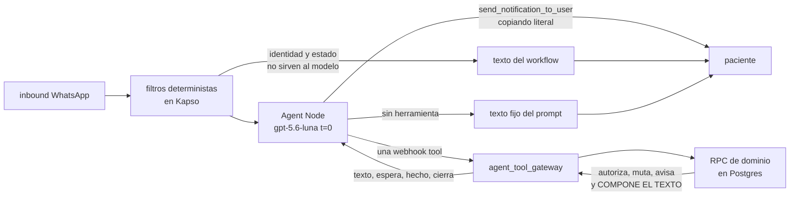

# Conversaciones y textos

Este archivo tiene dos mitades y un solo dueño.

**Parte A** es la **fuente única de todo lo que lee la paciente.** Ninguna frase que ella pueda ver
existe en otro archivo del repo: los demás citan por clave —«el texto `paciente_inactivo`»— y no
vuelven a escribirla. El conteo de claves también se lleva aquí y sólo aquí.

**Parte B** es el guion: cómo se siente cada gestión desde WhatsApp, mensaje por mensaje, y **cuánto
cuesta en mensajes salientes** contra el tope de cuatro.

Lo que este archivo **no** define: el contrato del resultado, `pending_step` y `allowed_next_tools`
(eso es `03-contratos.md`), el prompt y su regla dura 7 (`04-workflow-y-prompt.md`), el
pseudocódigo de las RPC (`05-pseudocodigo.md`) y el registro de decisiones y riesgos
(`06-implementacion-y-decisiones.md`).

---

## Índice

- [Cómo leer este archivo](#cómo-leer-este-archivo)
  - [La cadena: quién compone y quién manda](#la-cadena-quién-compone-y-quién-manda)
  - [Los tres cuidados de redacción](#los-tres-cuidados-de-redacción)
  - [El reparto de ejemplo](#el-reparto-de-ejemplo)
- **PARTE A · Catálogo de textos**
  - [A.1 Quién compone cada texto](#a1-quién-compone-cada-texto)
  - [A.2 Los huecos](#a2-los-huecos)
  - [A.3 La marca de zona horaria](#a3-la-marca-de-zona-horaria)
  - [A.4 Textos del workflow](#a4-textos-del-workflow-deterministas-cero-tokens)
  - [A.5 Textos del Agent Node](#a5-textos-del-agent-node-los-siete-que-compone-el-modelo)
  - [A.6 Textos del gateway](#a6-textos-del-gateway)
  - [A.7 `crisis`](#a7-crisis--herramienta-de-dominio-11--mvp)
  - [A.8 `mis_citas`](#a8-mis_citas--mvp)
  - [A.9 `confirmar`](#a9-confirmar--mvp)
  - [A.10 `mandar_comprobante`](#a10-mandar_comprobante--mvp)
  - [A.11 La coletilla `pendiente_lo_otro`](#a11-la-coletilla-pendiente_lo_otro--mvp)
  - [A.12 Los textos de carrera](#a12-los-textos-de-carrera)
  - [A.13 Fase 2](#a13-fase-2--textos-completos-sin-detalle-de-flujo)
  - [A.14 Fase 3](#a14-fase-3)
  - [A.15 Pospuesto: reseñas](#a15-pospuesto-reseñas)
  - [A.16 Índice de claves](#a16-índice-de-claves)
- **PARTE B · Flujos**
  - [B.1 Cómo se cuentan los salientes](#b1-cómo-se-cuentan-los-salientes)
  - [B.2 Paso previo: con cuál profesional](#b2-paso-previo-con-cuál-profesional--1-saliente)
  - [B.3 Responder al cron de 26 h](#b3-mvp--responder-al-cron-de-26-h)
  - [B.4 Prepago](#b4-mvp--prepago-el-flujo-de-la-mayoría-de-las-citas)
  - [B.5 Mandar comprobante](#b5-mvp--mandar-comprobante)
  - [B.6 Mis citas](#b6-mvp--mis-citas)
  - [B.7 Crisis](#b7-mvp--crisis)
  - [B.8 Los bordes del MVP](#b8-los-bordes-del-mvp)
  - [B.9 Fase 2, resumida](#b9-fase-2-resumida)
  - [B.10 Fase 3, resumida](#b10-fase-3-resumida)
  - [B.11 La tabla de conteo](#b11-la-tabla-de-conteo)
- [Pendientes](#pendientes)

---

## Cómo leer este archivo

### La cadena: quién compone y quién manda



Hay **tres orígenes de texto y sólo tres**:

1. **El workflow.** Filtros deterministas de identidad y estado, antes del Agent Node. No gastan
   tokens ni llaman al modelo, y su texto llega a la paciente sin pasar por él.
2. **El Agent Node.** Siete textos fijos que viven literales en el prompt y que el modelo escribe
   cuando **no** llama ninguna herramienta.
3. **El servidor.** Las once herramientas de dominio y el gateway. Su texto llega al modelo dentro
   de `texto` y **el modelo lo copia palabra por palabra** con `send_notification_to_user`.

Esa última frase es la **regla dura 7** del prompt (`04-workflow-y-prompt.md` §3). Es la pieza más
importante del diseño y este archivo la refuerza de dos maneras: **le quita su única excepción**
—la coletilla `pendiente_lo_otro` pasa a componerla el servidor, [A.11](#a11-la-coletilla-pendiente_lo_otro--mvp)— y
**empuja al servidor todo texto que lleve un dato**. Un texto sin datos que el modelo escriba mal se
lee raro; un precio, una fecha o un monto que el modelo reescriba es un daño que la paciente no
puede detectar. Por eso los siete textos del prompt no llevan ni una cifra, ni una fecha, ni un
monto: el peor caso de que el modelo los estropee es una frase torcida.

El riesgo residual de la regla 7 —que hoy ningún componente compara lo que compuso la RPC con lo que
mandó el modelo— está aceptado y documentado **una sola vez**, en
`06-implementacion-y-decisiones.md`. No se vuelve a abrir aquí.

**Leyenda de los bloques de Parte B:**

```
>>  lo que llega por WhatsApp
<<  lo que la paciente lee
[qué herramienta se llamó · si muta · qué espera · si cierra]
(n salientes)
```

### Los tres cuidados de redacción

Atraviesan todo lo de aquí y no tienen excepción.

1. **Nada de género en la paciente.** Hay pacientes hombres: ni «activa» ni «activo» aplicados a
   ella. Se escribe de tú y en segunda persona, que no tiene género.
2. **Nada de género en la profesional.** Se le nombra por su nombre de pila. Donde todavía no se
   sabe quién es, se dicen los dos: «tu psicóloga o psicólogo».
3. **Ningún plazo escrito a mano.** Sale de la ficha de cada profesional —la columna es
   `professional_appointment_policies.free_change_notice_minutes`, verificada en producción— y
   viaja en `{plazo}`. `{plazo}` aparece en cuatro textos y los cuatro son de fase 2 y 3.
   Hoy **ninguna función desplegada evalúa esa columna**: el motor de políticas no existe, así que
   los cuatro textos con `{plazo}` no son implementables todavía. Está anotado en cada ficha.

Y una regla que se aplica al MVP con especial dureza: **sólo se ofrece lo que de verdad se puede
hacer.** No basta con recortar el menú por lo que esa profesional permite (regla 8 de
`01-producto.md`): en el MVP lo recorta también **la fase**. Ofrecer «te la puedo mover» cuando
`reprogramar` no existe manda a la paciente a un «no te entendí» que ella provocó siguiendo nuestra
propia invitación.

### El reparto de ejemplo

**Todo lo que sigue es inventado.** Los nombres, los plazos, los precios y los horarios no salen de
la base: están escogidos para que se vean las dos ramas que de verdad existen —quien cobra antes de
la sesión y quien cobra después—. Cada profesional configura los suyos y el agente lee lo que ella
configuró, nunca un número escrito a mano.

| | Lucía · ejemplo | Ramiro · ejemplo |
|---|---|---|
| Cobro | **por adelantado** | después |
| Datos de transferencia en el perfil | sí | no |
| Aviso de cambio | 24 horas | 12 horas |
| Dirección guardada | no | no |
| Zona | Hora CDMX | Hora CDMX |

Las pacientes también son inventadas: **Emilio** es de Lucía y **Ariadna** es de Ramiro. En el
ejemplo, hoy es **jueves 27 de agosto** y son las 9 de la mañana.

---

# PARTE A · CATÁLOGO DE TEXTOS

## A.1 Quién compone cada texto

| Origen | Cuántos en el MVP | Quién lo entrega | ¿Pasa por el modelo? |
|---|---|---|---|
| **Workflow** (filtros deterministas de Kapso) | 10 | El workflow | No. El modelo ni siquiera se ejecuta |
| **Agent Node** (literales en el prompt) | 7 | El modelo, sin llamar herramienta | Sí: lo escribe él |
| **Servidor · gateway** | 4 | El modelo, copiando `texto` | Sí, copiado literal |
| **Servidor · RPC de dominio** | 25 | El modelo, copiando `texto` | Sí, copiado literal |

**El servidor compone 29 de los 46 textos del MVP, y son todos los que llevan un dato.** Los siete
del modelo no llevan ninguno; de los siete, cinco son constantes exactas y dos sustituyen un único
hueco, `{profesional}`, cuyo valor le llega al modelo en el bloque de estado del turno —nunca en el
system prompt, para no romper el prefijo cacheable (`04-workflow-y-prompt.md` §2).

Regla de reparto, para que nadie tenga que adivinar dónde va un texto nuevo:

- ¿Lleva una fecha, una hora, un monto, un plazo, una lista o un nombre de servicio? **Servidor.**
  Sin excepción.
- ¿Se decide antes de saber quién es ella o si su relación está activa? **Workflow.**
- ¿Es una respuesta constante a algo que el modelo entendió y para lo cual no hay nada que
  consultar? **Agent Node**, y sólo entonces.

### El desempate de las cuatro negativas

En el MVP hay cuatro maneras de decir que no, y confundirlas es el error más caro del catálogo
porque tres de ellas se leen como si fueran «no te entendí» sin serlo.

| Lo que ella pidió | Clave | Origen |
|---|---|---|
| Algo que el producto no hace y resuelve el equipo: reactivar su cuenta, corregir un comprobante ya mandado, mandar un recado, recoger materiales | `fuera_de_alcance` | Agent Node |
| Algo que el producto **sí** hará pero todavía no: mover, cancelar, agendar, cambiar modalidad, dejar reseña | `todavia_no_lo_hago` | Agent Node |
| Cobros, descuentos y devoluciones | `asunto_de_dinero` | Agent Node |
| Genuinamente ininteligible | `no_entendi` | Agent Node |

Y tres casos que **hoy caen en `no_entendi` y dejan de caer**, porque se entienden perfectamente:
un número suelto sin ninguna lista viva (`no_se_de_cual_lista`), un audio, un video o un sticker
(`medio_no_soportado`), y **lo que se dice contra un paso abierto sin emparejar con ninguna opción**
(`seguimos_en`). Los dos primeros los resuelve el workflow sin gastar un token; el tercero lo
resuelve el gateway contra el estado sellado, sin llamar ninguna RPC.

**El orden de esa cadena es fijo:** con paso abierto, `seguimos_en`; sin paso abierto,
`no_entendi`; en el segundo fallo seguido, `no_entendi_otra_vez`. Está escrito también en la ficha
de `no_entendi` para que nadie tenga que deducirlo.

**«Ya te mandé el comprobante, ¿ya quedó?» no es ninguna de las cuatro.** Eso tiene datos detrás y
lo contesta `mandar_comprobante`. Igual «¿cuánto le debo?», que es `mis_citas`.

---

## A.2 Los huecos

Los rellena **siempre el servidor** al componer. La tabla existe para leer las plantillas de abajo,
no para componerlas a mano.

| Hueco | Qué mete el servidor |
|---|---|
| `{paciente}` · `{profesional}` | Nombre de pila. `patients.first_name`, `professionals.first_name` |
| `{servicio}` · `{duracion}` | «Psicoterapia individual» · «50 minutos» |
| `{monto}` | El precio efectivo de esa paciente, preferente si lo tiene: «$800». La palabra «preferente» nunca sale al mensaje |
| `{dia}` · `{hora}` | «miércoles 2 de septiembre» · «4:00» |
| `{modalidad}` | «presencial» o «en línea», ya en español. El enum de base es `modality = in_person \| online` |
| `{plazo}` | El plazo de esa ficha: «24 horas». **Ninguna función desplegada lo evalúa todavía** |
| `{ritmo}` · `{parte_del_dia}` | «cada semana» · «mañana», «mediodía», «tarde», «noche» |
| `{zona}` | La marca corta de la zona **de esa profesional**, de `professionals.timezone`: «Hora CDMX» |
| `{lista}` | Las opciones numeradas, máximo cinco —hasta ocho sólo en la lista de servicios—, con su etiqueta ya escrita |
| `{verbos}` | Sólo lo que esa profesional permite **y lo que la fase tiene desplegado** |
| `{como_pagar}` | Cómo transferir, en una de dos frases fijas |
| `{banco}` · `{titular}` · `{clabe}` | `professionals.payment_bank_name`, `payment_account_holder`, `payment_clabe_or_account`. Sólo dentro de `{como_pagar}` |
| `{direccion}` | `professionals.office_address` |
| `{peticion_pendiente}` | Lo que quedó sin atender del mismo lote. Ver [A.11](#a11-la-coletilla-pendiente_lo_otro--mvp) |

**`{como_pagar}` tiene exactamente dos valores** y los escoge el servidor según el perfil:

> Transfiere a {banco}, a nombre de {titular}, CLABE {clabe}, y mándame el comprobante por aquí.

> Pídele los datos para la transferencia y mándame el comprobante por aquí.

La segunda no repite el nombre de la profesional porque el texto que la recibe ya lo dijo.

**Sellar `{como_pagar}` compromete el cobro como transferencia.** La restricción
`chk_payment_proof_requested_transfer` —verificada en producción: `CHECK ((proof_requested_at IS
NULL) OR (method = 'transfer'))`— obliga a `method='transfer'` en cuanto `proof_requested_at` deja
de ser nulo. Es decir: pedir el comprobante **bloquea el efectivo para ese cobro**. No es un efecto
secundario del texto, es lo que el texto significa.

**`{verbos}` en el MVP es una constante.** Las cuatro herramientas del MVP —`mis_citas`,
`confirmar`, `mandar_comprobante`, `crisis`— no dependen de la configuración de ninguna profesional:
todas confirman citas y todas reciben comprobantes (regla 6 de `01-producto.md`). Por eso en el MVP
`{verbos}` vale siempre lo mismo y los textos que lo llevan pueden vivir literales en el prompt. **En
fase 2 deja de ser constante** —ahí sí manda el menú de cada profesional— y esos textos se mudan al
servidor. Está anotado en cada ficha afectada.

**No hay hueco de liga.** La liga de la sesión en línea sale una sola vez, en el aviso de una hora
antes. Ver la nota de [`mis_citas_donde_en_linea`](#a8-mis_citas--mvp).

---

## A.3 La marca de zona horaria

**Todo mensaje que diga una hora lleva su zona, y la pone el servidor al componer**, con una sola
regla, para que no haya que acordarse texto por texto. Ningún texto la trae escrita adentro.

**En las listas de horas va en el encabezado**, entre paréntesis, pegada a donde se leen las horas:

> Para el {dia}, {modalidad}, tengo estas horas ({zona}):

**En cualquier otro mensaje con hora va como última línea**, sola:

> Listo, tu cita del {dia} a las {hora} quedó confirmada.
>
> {zona}

**Y no va en ningún mensaje sin hora.** Un «no tengo ninguna cita tuya por confirmar» no lleva
marca: no hay ninguna hora que situar.

La columna «zona» del [índice de claves](#a16-índice-de-claves) dice, clave por clave, si la lleva,
**y ahí y sólo ahí vive el conteo** —hoy 40 en el catálogo completo, 12 en el MVP—. No se repite el
número en ningún encabezado: cambia cada vez que se agrega o se mueve una clave, y un total
desactualizado suelto en el texto es peor que ninguno. Quien agregue una clave actualiza la columna
del índice y el total sale de contarla.

La zona sale de `professionals.timezone`, nunca escrita a mano. **La cita ocurre donde está ella**,
así que su hora es la que manda, y la marca existe justo para que la paciente que vive en otro huso
no tenga que adivinarlo. Los avisos automáticos y la app de la profesional usan esa misma zona
—el cron de 26 h la copia al payload de la plantilla—, así que todo lo que ella lee coincide.

---

## A.4 Textos del workflow (deterministas, cero tokens)

Diez claves. **Ninguna llega al modelo**: el workflow contesta y termina, o contesta y espera. Son
las respuestas más baratas del sistema —cero llamadas al modelo, cero RPC— y por eso todo lo que se
pueda resolver aquí se resuelve aquí.

### `comparte_tu_contacto` · MVP

**Cuándo.** El workflow recibe un BSUID todavía no ligado y el trigger no trae un teléfono con el
que pueda buscar una relación existente.

> Para confirmar que este WhatsApp corresponde a tu cuenta de Agenda Psi, toca el botón para
> compartir el contacto de este número.

Va con la solicitud nativa de contacto de WhatsApp y después espera. La paciente no captura un
BSUID ni escribe su teléfono: sólo usa el botón. Si el teléfono no coincide con ningún vínculo
local, el siguiente resultado es `no_te_reconocemos`. **Compartirlo nunca crea una fila nueva en
`whatsapp_links`.**

### `no_te_reconocemos` · MVP

**Cuándo.** El teléfono no tiene vínculo con ninguna profesional. Nunca fue paciente.

> Hola. Este número es el asistente de Agenda Psi, y desde aquí sólo puedo ayudar a pacientes que
> ya están con un psicólogo o psicóloga de la plataforma.
>
> Si estás buscando uno, aquí puedes ver quiénes están disponibles: https://agendapsi.mx

Cierra. **Cualquiera de las once herramientas de dominio puede devolverlo también como cerrojo**, si
la relación se cayó entre el filtro y la escritura. El directorio se ofrece aquí y sólo aquí: quien
no tiene vínculo local necesita encontrar a alguien.

### `paciente_inactivo` · MVP

**Cuándo.** `patients.patient_status = 'inactive'`. El enum está verificado en producción y tiene
exactamente dos valores: `active | inactive`. **Ésta es la única condición de relación que corta.**

> Por ahora tu cuenta con {profesional} no aparece activa, así que desde aquí no puedo ayudarte con
> tus citas. Escríbele para que te reactive y seguimos por aquí.

Cierra y **no manda al directorio**. El corte es limpio: quien nunca fue paciente va al directorio;
quien fue y ya no, va a que la reactiven. Evita el género en la paciente: dice «tu cuenta … no
aparece activa», no «no apareces activa».

**El consentimiento no filtra, y es una decisión, no un olvido.** `patients.consent_status` existe
en producción con dos valores, `pending | signed`, y el agente **lo ignora**: a una paciente con el
consentimiento en `pending` se le contesta igual, se le confirman sus citas igual y se le recibe su
comprobante igual. El motivo, la evidencia y el riesgo aceptado están en
`06-implementacion-y-decisiones.md`; aquí sólo se deja constancia de que ninguna clave de este
catálogo depende de `consent_status`, y de que eso es deliberado.

### `con_cual_profesional` · MVP

**Cuándo.** El teléfono tiene vínculo activo con dos o más profesionales.

> Estás con más de una persona de Agenda Psi. ¿Con quién es lo que necesitas?
>
> {lista}

`{lista}` son nombres de pila numerados. Se resuelve **antes** del Agent Node, y el workflow
conserva el lote original para entregarlo junto con la selección: así «con Ramiro» continúa la
gestión sin pedirle que repita su intención. Nunca se adivina, ni por la última plantilla ni por la
cita más próxima: adivinar aquí manda toda la conversación a la profesional equivocada y ella no
tiene cómo darse cuenta a tiempo.

**Cuesta un saliente y ese saliente se suma a la gestión que venga detrás.** Ver [B.2](#b2-paso-previo-con-cuál-profesional--1-saliente).

### `gestion_inactiva` · MVP · clave nueva

**Cuándo.** El estado sellado del turno anterior venció, no verifica o no existe, y el mensaje que
llega sólo tiene sentido contra él. Es el desenlace de todo `pending_step` caducado.

> Esta gestión ya no está activa. Escríbeme de nuevo qué necesitas y empezamos otra vez.

Cierra, **no muta nada** y el workflow llama `complete_task`. El mismo texto lo devuelve el gateway
si el sello no verifica del lado del servidor: dos guardas, una sola clave. Los TTL que la disparan
—`turn_idle_ttl_minutes` 30 y `session_ttl_hours` 24— viven en `03-contratos.md`.

No dice «venció tu sesión» ni «token inválido»: la paciente no tiene por qué saber que existe un
token, y la regla 10 del prompt prohíbe nombrar mecanismos internos.

### `identity_conflict` · MVP · clave nueva

**Cuándo.** El BSUID del evento y el teléfono apuntan a relaciones locales incompatibles.

> No pude confirmar que este WhatsApp sea el de tu cuenta. Escríbele a tu psicóloga o psicólogo para
> que lo revise, y en cuanto quede seguimos por aquí.

Cierra. Hoy este texto **cubre un caso que el modelo mandaba a `fuera_de_alcance`** —«Eso no lo
puedo ver desde aquí»—, que no describe nada de lo que pasó y deja a la paciente sin ninguna acción
posible.

**PENDIENTE, y no se disimula:** la rama no es decidible con el esquema actual. No existe hoy
ninguna entidad que declare que un BSUID y un teléfono están en conflicto, así que el texto está
escrito y la condición que lo dispara no. Se da de alta la clave para que el día que exista la
entidad no haya que inventar la frase con prisa; hasta entonces, la rama es inalcanzable por
construcción. Anotado en [Pendientes](#pendientes).

### `medio_no_soportado` · MVP · clave nueva

**Cuándo.** Llega un audio, un video, un sticker, una ubicación o cualquier archivo que no sea
imagen ni PDF. El workflow revisa el tipo **antes** del Agent Node.

> Por aquí sólo puedo leer texto, fotos y PDF. Escríbeme qué necesitas.

No cierra: la conversación sigue abierta. **Sale de `no_entendi`**, donde estaba mal puesto: un
audio se entiende perfectamente como audio, y contestarle «no te entendí» le sugiere que lo repita
—posiblemente con otro audio—.

Cero herramientas, cero RPC, cero tokens y un saliente: es el ahorro más limpio del sistema. El
silencio sería peor: un audio sin respuesta parece un número que no funciona.

**PENDIENTE sobre los formatos que promete.** «Fotos y PDF» es lo que hoy prometen los textos
heredados, pero con Edge Functions de 256 MB y 2 s de CPU **normalizar HEIC o rasterizar un PDF
adentro es inviable**. La opción recomendada, que es la única compatible con ese presupuesto de CPU,
es **guardar el archivo tal como llega, sin transformarlo**, registrando su tipo MIME y dejando que
la app de la profesional lo abra. Con eso el texto es cierto y no hay que recortarlo. Anotado en
[Pendientes](#pendientes).

### `no_se_de_cual_lista` · MVP · clave nueva

**Cuándo.** Llega un número suelto —«la 2», «2»— y **no hay ningún `pending_step` vivo con
opciones**. El workflow lo sabe sin preguntarle a nadie: el estado sellado está o no está.

> No sé de cuál lista es ese número. Dime con palabras qué necesitas.

No cierra. **También sale de `no_entendi`.** Un número suelto es comprensible como número; lo que
falta es contra qué contarlo, y decirlo así le da una salida concreta —escribir palabras— en vez de
repetir el menú entero.

**Este texto es la última red, no la primera.** Con `pending_step` y `allowed_next_tools` bien
declarados, un número que llega **con** lista viva va a la herramienta que ese paso autoriza y nunca
llega hasta aquí. Ver [A.8](#a8-mis_citas--mvp) y `03-contratos.md`.

### `demasiados_mensajes` · MVP · clave nueva · fallo del portero

**Cuándo.** Se rebasa cualquiera de los frenos de admisión: `inbound_per_phone_5m` 10,
`new_turns_per_phone_5m` 5, `new_turns_per_phone_24h` 30 o `new_turns_per_professional_24h` 100.
Los valores viven en `03-contratos.md`.

> Recibimos varios mensajes en poco tiempo y voy a pausar esta conversación un rato. Escríbeme más
> tarde y seguimos.
>
> Si necesitas ayuda inmediata: Agenda Psi no es un servicio de emergencias. Si tú o alguien más se
> encuentra en peligro, llama al 911. Para recibir apoyo en salud mental, comunícate gratis, las 24
> horas, a Línea de la Vida: 800 911 2000.

Cierra. **Lleva las dos líneas de crisis pegadas y eso no es adorno:** una ráfaga de mensajes es
exactamente la forma que tiene una crisis de verse desde afuera, y el freno que la calla es el mismo
que le quitaría su única salida. Es la única clave del catálogo que repite el texto de
[`crisis`](#a7-crisis--herramienta-de-dominio-11--mvp), y se repite a propósito.

**Se manda una sola vez por ventana de enfriamiento** —`rate_limit_notice_cooldown_minutes` 15—, no
una vez por mensaje frenado. Un aviso de límite que se dispara por mensaje se convierte él mismo en
la ráfaga que estaba frenando, y encima se factura.

### `mensaje_muy_largo` · MVP · clave nueva · fallo del portero

**Cuándo.** El texto entrante pasa de `max_inbound_text_chars` 4000.

> Ese mensaje es muy largo para leerlo por aquí. Mándame en pocas palabras qué necesitas.

No cierra. **Se rechaza en vez de recortarse**, y el motivo es de seguridad, no de estética: un
mensaje truncado a la mitad puede cambiar de sentido —o esconder al final una instrucción que el
modelo sí alcanzaría a leer— y actuar sobre media petición es peor que no actuar.

---

## A.5 Textos del Agent Node (los siete que compone el modelo)

**Éstos son todos.** Viven literales en el bloque `<textos_fijos>` del prompt
(`04-workflow-y-prompt.md` §3) y se reproducen ahí y aquí, en ningún otro sitio. El modelo los
escribe **sin llamar herramienta**: si llamó una, el texto viene del servidor y la regla 7 manda.

Ninguno lleva fecha, hora, monto, plazo ni lista. Cinco son constantes exactas; dos sustituyen
`{profesional}`, cuyo valor llega en el bloque de estado del turno.

### `en_que_puedo_ayudarte` · MVP

**Cuándo.** Sólo saluda o agradece, sin pedir nada.

> ¿En qué puedo ayudarte con tus citas o comprobantes?

No cierra: `enter_waiting`. Un saludo **con** intención directa no pasa por aquí —«hola, ¿qué citas
tengo?» va a `mis_citas` sin escalón intermedio—. Cuesta un saliente aunque cueste cero llamadas:
un saludo suelto ya no es gratis.

### `fuera_de_alcance` · MVP

**Cuándo.** Reactivar su cuenta, corregir un comprobante ya mandado, pedir que le hagamos llegar un
recado, pedir ayuda del equipo, recoger materiales.

> Eso no lo puedo ver desde aquí. Si necesitas ayuda de nuestro equipo, escríbenos por aquí:
> https://wa.me/525564370081
>
> Yo te sigo ayudando a ver tus citas, confirmarlas y recibir tus comprobantes.

No cierra. **La última línea cambió respecto del texto heredado**, que decía «con tus citas y los
comprobantes» y prometía mover y cancelar. En el MVP dice exactamente las tres cosas que existen.
En fase 2 vuelve a `{verbos}` y el texto se muda al servidor.

### `asunto_de_dinero` · MVP

**Cuándo.** Cobros, descuentos, devoluciones, «¿me pueden regresar lo de la sesión que no tomé?».

> Los cobros, los descuentos y las devoluciones los decide {profesional} directamente.
>
> Yo te ayudo con tus citas y los comprobantes.

No cierra. **No se usa para «¿cuánto le debo?»** —eso tiene datos detrás y lo contesta `mis_citas`—
ni para «¿ya quedó mi comprobante?» —eso es `mandar_comprobante`—. El desempate es simple: si la
respuesta correcta necesita leer la base, no es asunto de dinero.

### `todavia_no_lo_hago` · MVP · clave nueva

**Cuándo.** Ella pidió algo que el producto **sí** hará y que en esta fase no está desplegado:
mover, cancelar, agendar, cambiar de modalidad, dejar reseña.

> Eso todavía no lo puedo hacer yo. Escríbeselo a {profesional} y lo resuelve contigo.
>
> Por aquí sí te puedo decir qué citas tienes, confirmarlas y recibir tus comprobantes.

No cierra. **Es la clave que faltaba para «te entendí, pero eso no lo hago yo».** Sin ella, «cancela
la del martes» caía en `no_entendi` —que es falso y la hace repetir— o en `fuera_de_alcance` —que la
manda a soporte por algo que soporte tampoco hace—.

En el MVP este texto **absorbe el tráfico de fase 2 y fase 3 completas**, así que deja de ser un
borde raro y pasa a ser una de las salidas más frecuentes. Por eso dice «todavía»: es cierto, y
prepara a la paciente para que vuelva a intentarlo cuando la herramienta exista.

Cuando la fase 2 despliegue `cancelar` y `reprogramar`, esta clave no desaparece: se queda para lo
que la profesional tenga apagado en su configuración (regla 8), y su segunda línea vuelve a
`{verbos}` y se muda al servidor.

### `no_entendi` · MVP

**Cuándo.** Genuinamente ininteligible. **Y nada más.**

> No te entendí. Por aquí te puedo decir qué citas tienes, confirmarlas y recibir tus comprobantes.
> ¿Qué necesitas?

No cierra. Cinco casos que hoy terminan aquí y **dejan de terminar aquí**: un número suelto sin
lista viva (`no_se_de_cual_lista`), un audio o un sticker (`medio_no_soportado`), algo entendido que
esta fase no hace (`todavia_no_lo_hago`), un segundo fallo consecutivo (`no_entendi_otra_vez`) y
—el más frecuente— **algo dicho contra un paso abierto que no empareja con ninguna opción**
(`seguimos_en`).

**La regla de precedencia, y no admite lectura al revés:** si hay un paso abierto, `seguimos_en`. Si
no lo hay, `no_entendi`. Si el turno anterior ya terminó en una de las dos, `no_entendi_otra_vez`.
`no_entendi` es el caso residual, no el primero que se prueba.

No se usa para un saludo, un agradecimiento ni una intención corta pero clara.

En el MVP el menú es constante y por eso el texto puede vivir en el prompt. En fase 2 el menú
depende de la profesional, vuelve `{verbos}` y el texto se muda al servidor.

### `seguimos_en` · MVP · clave nueva

**Cuándo.** Hay un `pending_step` vivo con opciones y lo que ella escribió **no empareja con
ninguna**: ni por posición ni por fecha, hora o atributo (`03-contratos.md` §2.2.1, cero
coincidencias). También cuando pregunta directo *«¿en qué quedamos?»* o *«¿qué estábamos
haciendo?»*.

> Seguimos con tu cita del jueves 4 a las 10 de la mañana. ¿Te la confirmo o prefieres moverla?
>
> Hora CDMX.

No cierra, y **conserva el paso abierto**: el estado sellado no se borra, así que ella puede
contestar a esto mismo.

**Lo compone el gateway**, no la RPC y no el modelo: es el único que ve el estado sellado y lo que
ella dijo, y no necesita tocar la base para responder. Sale de `pending_step` —que dice en qué paso
estamos— y de `options` —que da el dato con el que se nombra la opción—. **Nunca repite la lista
entera**: nombra una sola opción cuando hay una, y cuando hay varias dice de qué se trata sin
enumerarlas.

**Existe porque «no te entendí» era mentira.** Cuando ella nombra un día que no está en la lista, se
le entendió perfectamente: quiere otro día. Decirle que no se le entiende la deja sin saber qué se
espera de ella, y ése es el momento exacto en que el agente deja de parecer una recepcionista.

Lleva `{zona}` cuando nombra una hora.

### `cual_de_esas` · MVP · clave nueva

**Cuándo.** Lo que ella dijo empareja con **más de una** opción de la lista viva
(`03-contratos.md` §2.2.1, coincidencia múltiple). El caso típico: dos citas el mismo jueves y ella
dice «el jueves».

> Tienes dos ese día: una a las 10 de la mañana y otra a las 4 de la tarde. ¿Cuál?
>
> Hora CDMX.

No cierra y conserva el paso abierto.

**Nombra sólo las opciones que coincidieron**, nunca la lista completa: repetirla entera obliga a
ella a releer lo que ya leyó y desperdicia un mensaje saliente. Lo compone el gateway, por lo mismo
que `seguimos_en`.

Lleva `{zona}` cuando nombra una hora.

### `no_entendi_otra_vez` · MVP · clave nueva

**Cuándo.** El turno inmediatamente anterior ya terminó en `no_entendi` y éste también.

> Sigo sin entenderte y no quiero hacerte perder el tiempo. Escríbele directo a {profesional}, o
> escríbenos por aquí: https://wa.me/525564370081

Cierra. **Existe porque dos `no_entendi` seguidos salían idénticos palabra por palabra**, con el
mismo menú, sin escalar a nadie y sin ninguna salida distinta. Leer dos veces exactamente la misma
frase es la manera más rápida de que la paciente deje de escribir.

**La cuenta la lleva el servidor, nunca el modelo.** El workflow sella en el estado del turno un
booleano `no_entendi_previo` y lo entrega en el bloque de estado del mensaje —no en el system
prompt—. El modelo sólo lee un sí o un no; no cuenta, no acumula y no decide cuándo se reinicia. El
booleano se limpia en cuanto un turno termina en cualquier otra cosa.

### `se_acabo_el_espacio` · MVP

**Cuándo.** El resultado de la herramienta llegó con un contrato inválido, o se agotó una
recuperación segura.

> Se me acabó el espacio de esta consulta. Escríbeme otra vez y seguimos justo desde donde nos
> quedamos.

Cierra. **Nunca se manda sólo porque una mutación perdió su respuesta.** Antes, el gateway repite
con el mismo `command_id` —el que acuñó él mismo a partir de `(conversation_id, contador de turno)`
y que viaja sellado en `vars.agent_state`; **no se deriva de ningún WAMID**, porque el trigger
inbound de Kapso no expone ninguno— y recupera de `command_log` el resultado real de la escritura.
Sólo si eso también falla hay texto que mandar, y entonces el que corresponde es
[`no_se_si_quedo`](#a6-textos-del-gateway), no éste.

---

## A.6 Textos del gateway

Dos claves nuevas. El gateway **nunca devuelve una forma de error**: devuelve siempre
`{texto, espera, hecho, cierra}`, igual que una RPC de dominio, y el modelo lo copia con la misma
regla 7. Ésta es la corrección de fondo: hoy, cuando el gateway falla, **el modelo recibe algo que
no puede mandar** y termina improvisando o mandando `se_acabo_el_espacio`, que casi siempre es
falso.

### `no_pude_ahorita` · MVP · clave nueva

**Cuándo.** El gateway **no alcanzó a llamar la RPC**: se agotó `gateway_timeout_ms` (10 000) antes
de abrir la transacción, falló el transporte después de su único reintento
(`gateway_transport_retries` 1), o el turno rebasó `tool_calls_per_turn` (8).

> No pude terminar eso ahorita. Vuelve a escribirme en un minuto y lo reviso.

No cierra. **Se puede afirmar que no ocurrió**, porque no se escribió nada: por eso este texto sí
dice «no pude».

### `no_se_si_quedo` · MVP · clave nueva

**Cuándo.** El gateway llamó la RPC, **perdió la respuesta**, y el reintento con el mismo
`command_id` tampoco resolvió contra `command_log`.

> No pude confirmar si eso quedó registrado, y prefiero no intentarlo otra vez para no duplicarlo.
> Revísalo en un rato conmigo, o coméntaselo a {profesional}.

Cierra. **No afirma ni niega que la escritura ocurrió**, y ésa es toda su razón de existir: decir
«listo» sobre una mutación no verificada le miente, y decir «no pude» le hace pedirlo de nuevo y
duplicarlo. También dice explícitamente por qué no reintenta, para que la falta de insistencia no
se lea como abandono.

El resultado que acompaña este texto lleva `hecho: false`, y eso es correcto aunque la escritura
haya ocurrido: `hecho` significa «la escritura quedó **confirmada**», no «la escritura pasó».

---

## A.7 `crisis` · herramienta de dominio 11 · MVP

**Cuándo.** Después de identificar una relación activa, el modelo detecta una señal explícita e
inmediata de peligro para ella o para alguien más.

> Si necesitas ayuda inmediata: Agenda Psi no es un servicio de emergencias. Si tú o alguien más se
> encuentra en peligro, llama al 911. Para recibir apoyo en salud mental, comunícate gratis, las 24
> horas, a Línea de la Vida: 800 911 2000.

Sin huecos. **Cierra.** Las 24 horas que menciona son el horario de la línea, no un plazo del
producto.

**Éste es el texto íntegro y verificado**, palabra por palabra igual en las dos fuentes que lo
tenían: la configuración heredada de la era A1
(`config/static-responses.es-MX.json`, clave `crisis`) y el prompt actual. Que las dos coincidan
literalmente es lo que permite moverlo de sitio sin volver a redactarlo ni volver a revisar los
números de emergencia.

**Con C4 lo compone el servidor, no la memoria del modelo.** Ésa es toda la diferencia y es
grande: el texto que lleva un 911 y un 800 no puede depender de que el tier más barato lo
transcriba de su prompt. Ahora sale de la RPC como cualquier otro, y el modelo lo copia bajo la
regla 7 —que sigue siendo la única garantía, pero ahora sobre un texto que el servidor puede
auditar en su bitácora—.

**Muta:** sí. En la **misma transacción** se inserta el aviso a la profesional en `notifications`
(regla 13 de `01-producto.md`: ninguna mutación termina sin aviso). Si el aviso no se puede
escribir, no hay respuesta de crisis: se cae al camino de fallo del gateway.

**El aviso no es un mensaje de WhatsApp**, es una fila en `notifications` —el único canal con
Realtime hacia la app Flutter—. Por eso esta gestión cuesta **un saliente y sólo uno**.

**Va sola y no lleva otra gestión.** Si el mismo lote traía además una petición operativa, se
atiende la crisis y la petición se pierde: aquí **no** se pega
[`pendiente_lo_otro`](#a11-la-coletilla-pendiente_lo_otro--mvp). Pegarle «¿y en qué más te puedo
ayudar?» a un mensaje de emergencia es exactamente lo que no se debe hacer, y es una decisión
consciente, no un descuido del contrato.

**PENDIENTE, verificado y con consecuencia real.** `notifications.type` es `text` sin `CHECK` en
producción, así que insertar un tipo nuevo no necesita migración; pero el parser de la app Flutter
—`flutter_application_1/lib/pages/notifications/notification_models.dart`— no tiene caso para él y
cae en la presentación neutra de la línea 250: **«Nueva notificación · Hay una actualización reciente
en tu cuenta.»** Para el único aviso que no puede ser neutro, eso es inaceptable. Antes de encender
`crisis` hay que agregar su caso al `switch` de Flutter. Anotado en [Pendientes](#pendientes).

**Y un hueco que el texto no puede tapar:** una paciente con `patient_status='inactive'` **nunca
alcanza `crisis`**, porque `paciente_inactivo` cierra antes del Agent Node. Una señal de peligro
desde una cuenta dada de baja recibe «tu cuenta no aparece activa». También en
[Pendientes](#pendientes).

---

## A.8 `mis_citas` · MVP

Una sola herramienta para tres preguntas de la misma familia —**qué citas tengo, dónde es, y cuánto
debo**—. No hay función de dirección aparte ni de adeudos: partirla en tres obligaría al modelo a
elegir entre tres puertas que llevan al mismo cuarto.

### El arreglo del callejón sin salida

El texto heredado **numeraba opciones, cerraba la gestión y borraba el estado sellado**, así que un
«la 2» perfectamente razonable caía en `no_entendi`. Es una herramienta del MVP, así que el defecto
duele hoy. El arreglo tiene dos mitades.

**Primera: `mis_citas` sólo abre estado cuando ofrece algo.** La última línea la escoge el servidor
según lo que de verdad se puede hacer con esas citas, y el contrato del resultado va detrás de esa
línea:

| Situación real | Última línea | `espera` | `cierra` | `allowed_next_tools` | Por defecto |
|---|---|---|---|---|---|
| Hay citas por confirmar **y** cobros esperando comprobante | las dos | `"cita"` | falso | `confirmar`, `mandar_comprobante` | `confirmar` |
| Hay citas por confirmar, ningún cobro esperando | sólo la de confirmar | `"cita"` | falso | `confirmar` | `confirmar` |
| Ninguna por confirmar, hay cobros esperando | sólo la del comprobante | nulo | falso | `mandar_comprobante` | — |
| Ni una ni otra | ninguna | nulo | **verdadero** | — | — |

**Segunda: el número se resuelve contra la lista que lo produjo.** El `pending_step` sellado guarda
las opciones —con los identificadores reales, que el modelo nunca ve— y una **herramienta por
defecto**. Un número suelto va a esa herramienta con su posición; un número con verbo («la 2,
cancélala») va a la herramienta que el verbo nombra, si está en `allowed_next_tools`; un número sin
`pending_step` vivo es [`no_se_de_cual_lista`](#a4-textos-del-workflow-deterministas-cero-tokens).
**Una posición sólo significa algo contra la lista que la selló.** El mecanismo completo vive en
`03-contratos.md`.

**Consecuencia sobre el inventario de salidas abiertas, y hay que decirla.** El renglón 3 de la
tabla es una salida abierta nueva: `espera` nulo y `cierra` falso.

El borrador anterior de este catálogo —el archivo `docs/02-funciones.md` de la era A2, hoy
sustituido por `03-contratos.md`— **declaraba tres** salidas abiertas en sus líneas 87-89, pero sus
tablas de resultado tenían **diez renglones** con `espera` nulo y `cierra` falso: las líneas 211,
581, 590, 591, 592, 681, 682, 688, 689 y 862. Son **ocho claves distintas**, porque
`cita_ya_no_esta` y `cita_ya_paso` aparecían dos veces cada una; **siete** si se descuenta
`servicio_no_asignado`, que la línea 216 declaraba aparte y con su propio motivo.

Se cita porque la diferencia no es de conteo: **ese inventario es el que decide cuándo el gateway
NO borra `agent_state`**, y con tres de diez la mayoría de las salidas abiertas quedaban sin sello.
Con las correcciones de `mis_citas` el inventario todavía se alarga. **El inventario definitivo lo
lleva `03-contratos.md`**, no este archivo; aquí sólo se declara, texto por texto, qué `espera`,
qué `cierra` y qué `allowed_next_tools` corresponden a cada uno.

### Los textos

**`mis_citas_lista`** · varias citas

> Tienes esto con {profesional}:
>
> {lista}
>
> {cierre}

`{lista}` va con día, hora y modalidad, la más próxima primero. `{cierre}` es una de estas tres,
según la tabla de arriba:

> ¿Necesitas confirmar alguna? Dime cuál.

> ¿Necesitas confirmar alguna? Dime cuál. Y si ya pagaste, mándame tu comprobante por aquí.

> Si ya pagaste alguna, mándame tu comprobante por aquí.

Lleva `{zona}`. Cuando no aplica ninguna de las tres, no hay última línea y cierra.

**`mis_citas_una`** · una sola cita

> Hola {paciente}. Tienes tu cita del {dia} a las {hora}. {cierre}

Con los cierres equivalentes: «¿Te la confirmo?», «¿Te la confirmo? Si ya pagaste, mándame tu
comprobante por aquí», «Si ya pagaste, mándame tu comprobante por aquí», o nada. Lleva `{zona}`.

**No se ofrece confirmar una cita que ya está confirmada.** Ése era el otro filo del texto heredado:
preguntaba «¿cuál prefieres?» sobre un menú que podía no tener ninguna opción válida.

**`mis_citas_donde_presencial`** · con dirección guardada

> Tu cita del {dia} a las {hora} es presencial. La dirección es {direccion}.

Sin dirección guardada, **el servidor cambia sólo la segunda frase**:

> Tu cita del {dia} a las {hora} es presencial. La dirección te la comparte {profesional} directamente.

La primera frase no cambia nunca: sin ella, la variante perdería el día, la hora y el dato de que es
presencial, que es justo lo que preguntó. Lleva `{zona}`. `{direccion}` sale de
`professionals.office_address`, verificada en producción. **No se inventa una dirección.**

**`mis_citas_donde_en_linea`**

> Tu cita del {dia} a las {hora} es en línea. La liga te llega una hora antes.

Lleva `{zona}`. **La liga no se manda aquí.** Sale una sola vez, en el aviso de una hora antes, para
que la tenga a la mano cuando la necesita y no la busque tres días atrás en la conversación.

**Ese aviso existe y está verificado en producción**, lo cual cierra una duda heredada: la función
`cron_appointment_reminder_1h` está desplegada y el job `cron_appointment_reminder_1h` corre cada
cinco minutos y está activo. Encola una de tres plantillas —`appointment_reminder_1h_in_person`,
`appointment_reminder_1h_online` (que sí lleva `meeting_url`, tomado de
`professionals.fixed_meeting_url`) y `appointment_reminder_1h_online_simple`—.

**Pero la promesa tiene dos agujeros verificados y hay que conocerlos.** Uno: si la profesional no
tiene `fixed_meeting_url`, la plantilla que sale es la `_simple` y **no lleva liga**. Dos: el cron se
calla —`CONTINUE`— cuando la confirmación de esa misma cita salió hace menos de seis horas o sigue
en cola, así que **una cita creada con poca anticipación puede no recibir nunca el aviso de una
hora antes**, y con él se va la liga. Anotado en [Pendientes](#pendientes) con la opción
recomendada.

**`mis_citas_adeudos`**

> De lo que tienes con {profesional}, esto está pendiente de pago:
>
> {lista}
>
> Cuando lo transfieras, mándame el comprobante por aquí.

`{lista}` va con fecha y monto, la más antigua primero. **Ésta es la respuesta a «¿cuánto le
debo?»**, no `asunto_de_dinero`. No dice «pagado» ni promete que algo quedó saldado. La última línea
ya es la invitación a `mandar_comprobante`, así que engancha sin gastar un saliente extra.

No lleva `{zona}`: los renglones son fechas sin hora.

**`mis_citas_sin_adeudos`**

> No tienes ningún pago pendiente con {profesional}.

Cierra. No lleva `{zona}`.

**`mis_citas_sin_citas`** · MVP

> Ahorita no tienes ninguna cita con {profesional}. Escríbele para que te dé un espacio y en cuanto
> quede la ves por aquí.

Cierra. No lleva `{zona}`. **El texto heredado terminaba con «¿Te busco día para una?»**, que en el
MVP ofrece `buscar_horarios` —que no existe— y manda el «sí» de ella derecho a
`todavia_no_lo_hago`. La pregunta vuelve en fase 2, cuando haya con qué contestarla.

---

## A.9 `confirmar` · MVP

**`confirmar_cierre`** · una candidata, cobro después

> Listo, tu cita del {dia} a las {hora} quedó confirmada.

Lleva `{zona}`. Muta; el aviso `appointment_confirmed` va en la misma transacción.

**`confirmar_cierre_ambas`** · contestó «ambas»

> Listo, tus citas del {dia} y del {dia} quedaron confirmadas.

Lleva `{zona}`. **Una sola llamada y una sola transacción**, con un aviso por cita; si alguno no se
puede escribir, no se confirma ninguna. Es la excepción autorizada de la regla 14 de
`01-producto.md`, y está autorizada porque el contrato la define como **una** operación.

**`comprobante_pedido`** · cobro por adelantado y todavía sin comprobante

> Tu cita del {dia} a las {hora} se confirma con tu comprobante.
>
> {como_pagar}

Lleva `{zona}`. **No muta**: `hecho` falso, y cierra. Sin plazo y sin amenaza de cancelar: no hay
motor de políticas que respalde un plazo, y amenazar con cancelar por un comprobante que no llegó es
justo lo que hace que deje de escribir.

**Éste es el desenlace real de «sí voy» para la mayoría de las citas**, y por eso es el texto más
importante del MVP después del acuse. Ver [B.4](#b4-mvp--prepago-el-flujo-de-la-mayoría-de-las-citas).

**Si ella ya mandó su comprobante, este texto no sale** y «sí voy» confirma normal con
`confirmar_cierre`: pedir dos veces el mismo archivo la hace dudar de que el primero llegó, y la
base admite uno solo por cobro.

**`confirmar_lista`** · más de una candidata

> ¿Cuál me confirmas?
>
> {lista}

Lleva `{zona}`. `espera: "citas"`, en plural, **porque puede contestar «ambas»**.
`allowed_next_tools = [confirmar]`, herramienta por defecto `confirmar`: el número no cruza de
herramienta, así que éste es el caso fácil del enrutamiento por posición.

**Siempre se pregunta cuál.** Nunca se asume, ni por la última plantilla ni por la más próxima.

**`confirmar_nada_que_confirmar`** · ninguna esperando. **Dos valores.**

Con una próxima cita:

> No tengo ninguna cita tuya esperando confirmación. Tu próxima es el {dia} a las {hora}, y ya está
> confirmada.

Sin ninguna próxima:

> No tengo ninguna cita tuya esperando confirmación.

Cierra. **El segundo valor es nuevo y hacía falta:** el texto heredado daba por hecho que existía una
próxima cita, y sin ella faltaban `{dia}` y `{hora}` y el mensaje no se podía componer. Es una
herramienta del MVP, así que el hueco era de hoy. El primer valor lleva `{zona}`; el segundo no,
porque no dice ninguna hora.

Este texto cubre también la cita ya confirmada: preguntar por algo que ya está hecho no es un error.

---

## A.10 `mandar_comprobante` · MVP

**Siempre se pregunta antes de guardar**, aunque haya un solo cobro esperando y aunque la plantilla
que ella contesta nombre la cita. **La base admite un comprobante por cobro para siempre y la app no
ofrece manera de reemplazarlo: una foto equivocada queda pegada.** Es la única excepción del diseño
a la regla de actuar cuando hay una sola candidata, y se conserva.

**Las candidatas son cobros, no citas.** Todo cobro suyo que siga pendiente, **con la petición
sellada** —`payments.proof_requested_at` no nulo— y sin archivo pegado, **sin importar el estado de
la cita**: programada, cancelada, movida o pasada. De una serie, sólo el de la ocurrencia más
próxima. La definición completa vive una sola vez, en `03-contratos.md`.

**Recibir comprobantes vale para todas las profesionales**, cobren antes o después de la sesión. Lo
único que depende de la configuración es **pedir el pago al agendar**, y en el MVP eso no puede
nacer del agente: nace de la app de la profesional o del cron.

**`comprobante_pregunta_una`** · una sola candidata

> ¿Es el comprobante de tu cita del {dia}?

`espera: "cita"` —hay número aunque la candidata sea una sola, y la respuesta vuelve como
`cita: 1`—. `allowed_next_tools = [mandar_comprobante]`. **El cobro se identifica por fecha**; la
hora sólo se agrega cuando hay dos o más cobros del mismo día, que es el único caso en que la fecha
sola no alcanza. Sin hora, no lleva `{zona}`.

**`comprobante_lista`** · varias candidatas

> ¿De cuál de estas es tu comprobante?
>
> {lista}

Fecha y monto, la más antigua primero. `espera: "cita"`, `allowed_next_tools =
[mandar_comprobante]`. **Las sesiones pasadas no se colapsan:** cada una es su propia deuda, y
juntarlas escondería dinero sin dueño.

**`comprobante_varias_imagenes`** · llegaron dos o más archivos en el lote

> Me llegaron varias imágenes. Me quedo con la última. ¿Es el comprobante de tu cita del {dia}?

El `pending_step` sellado guarda **de qué archivo se preguntó** y deja `mandar_comprobante` como
única herramienta permitida en el siguiente turno.

**`comprobante_ultimo_archivo`** · clave nueva · tope de rehechuras

Si llega un archivo nuevo antes de que ella conteste, la pregunta se rehace sobre el nuevo, y eso
**cuesta un saliente cada vez**. A partir de la tercera rehechura deja de rehacerse la pregunta:

> Me quedé con la última imagen que mandaste. Cuando estés lista, dime de cuál cita es.

`espera: "cita"`, no cierra. **Existe porque sin tope el flujo se desborda:** tres fotos en tres
lotes son cuatro salientes y ni un comprobante guardado, y la gestión se come sola la cuenta entera
de la conversación.

**`comprobante_acuse`** · pegó, cita futura

> Listo, recibí tu comprobante. Tu cita del {dia} a las {hora} ya quedó confirmada.

Lleva `{zona}`. Muta; **los dos avisos —`payment_proof_received` y `appointment_confirmed`— van en
la misma transacción** (regla 13). Los dos existen ya en el parser de Flutter, así que no hace falta
tocar la app: `appointment_confirmed` y `payment_proof_received` tienen su caso y su presentación.
El aviso que le llega a la profesional **no lleva el monto**.

**`comprobante_acuse_sesion_pasada`** · pegó, la sesión ya ocurrió

> Listo, recibí el comprobante de tu sesión del {dia}. Ya se lo hice llegar a {profesional}.

No confirma nada, porque no hay nada que confirmar. Sin hora, no lleva `{zona}`. Dice «el
comprobante», no «tu comprobante»: el archivo es de un pago, no de ella.

**Nunca dice «pagado» ni «aprobado»** (regla 4 de `01-producto.md`). Dice que lo recibió, y el cobro
sigue `pending`. El enum verificado es `payment_status = not_applicable | pending | credited |
waived`, y pasar a `credited` es de la profesional. **El agente no acredita nunca**, y tampoco mira
la imagen: no valida que sea un comprobante, valida que haya un cobro al cual pegarlo.

**`comprobante_nada_esperando`**

> No tengo ningún cobro tuyo esperando comprobante. Si es de algo que {profesional} te pidió aparte,
> mándaselo directo.

Cierra. Es la salida más barata del flujo: un saliente.

**`comprobante_ya_hay_uno`**

> Ese cobro ya tiene su comprobante, así que no le puedo pegar otro. Si algo no cuadra, coméntaselo
> a {profesional}.

Cierra. **No se ofrece reemplazo** porque la base admite un comprobante por cobro para siempre.
Ofrecer algo que no se puede hacer es peor que negarlo con su razón.

**`comprobante_sin_archivo`**

> No me llegó ninguna imagen. Mándame la foto o el PDF del comprobante por aquí.

`espera` nulo, `cierra` falso: **es una salida abierta**, de las que el gateway no borra. Ver la
nota de formatos en [`medio_no_soportado`](#a4-textos-del-workflow-deterministas-cero-tokens).

---

## A.11 La coletilla `pendiente_lo_otro` · MVP

**Cuándo.** El lote traía dos peticiones distintas y se atendió la primera.

> Me faltó lo de {peticion_pendiente}. ¿Te ayudo con eso ahora?

Va **pegada al final del texto de la herramienta**, separada por dos saltos de línea y **después de
la marca de zona**. Se manda `enter_waiting` aunque el resultado dijera `cierra: true`: terminó la
primera gestión, pero falta que ella vuelva a pedir la segunda.

**Dos cambios respecto del texto heredado, y los dos importan.**

**Uno: la compone el servidor, dentro del mismo `texto`.** Antes la pegaba el modelo, y era **la
única excepción a la regla 7**. Quitarle esa excepción deja la regla sin ningún caso especial que
memorizar: *el campo `texto` se manda exactamente como llegó, siempre, sin excepciones*. Una regla
sin excepciones la cumple mejor cualquier modelo, y en particular el más barato.

**Dos: nombra lo que quedó pendiente.** «¿Y en qué más te puedo ayudar?» le pregunta a ella algo que
nosotros ya sabíamos, y la obliga a repetir lo que acaba de escribir. Nombrarlo demuestra que se
leyó.

**Cómo llega `{peticion_pendiente}` sin abrir una grieta en la regla 7.** El modelo pasa en su
llamada un parámetro corto con la segunda petición en las palabras de ella —«mover la cita del
martes»—. El gateway lo **recorta a 60 caracteres, le quita saltos de línea y URLs**, y si queda
vacío usa el valor de respaldo: «¿Y en qué más te puedo ayudar?». Es el único fragmento de texto
saliente que se origina en el modelo, mide 60 caracteres, no puede llevar cifras que la paciente vaya
a creerse como un precio o una fecha, y su peor caso es una paráfrasis torpe de algo que ella misma
escribió hace un segundo. Esa acotación es deliberada y es la razón de que el parámetro exista.

**No se pega nunca a [`crisis`](#a7-crisis--herramienta-de-dominio-11--mvp).** Ver ahí el motivo.

**Cuesta cero salientes y por eso existe:** sin la coletilla harían falta dos mensajes.

---

## A.12 Los textos de carrera

Son los que salen cuando la profesional toca la cita entre el turno y la escritura. Los tres los
compone el servidor dentro de la transacción, después de volver a leer la cita.

**`cita_ya_no_esta`** · MVP con `confirmar`, y fase 2 con `cancelar` y `reprogramar`

> Esa cita ya no está: se canceló mientras hablábamos. ¿Te busco día para otra?

`hecho` falso, `espera` nulo, `cierra` falso. **En el MVP la última pregunta se cae**, porque ofrece
`buscar_horarios`. El valor del MVP es:

> Esa cita ya no está: se canceló mientras hablábamos. Escríbele a {profesional} si necesitas otra.

**`cita_ya_paso`** · MVP con `confirmar`, y fase 2

> Esa cita ya pasó, así que desde aquí ya no la puedo cambiar. Si necesitas algo de ella, coméntaselo
> a {profesional}.

`hecho` falso, `espera` nulo, `cierra` falso.

**Los dos entran al MVP, y esto resuelve una duda heredada.** El borrador anterior sólo se los
asignaba a `reprogramar` y `cancelar` (`docs/02-funciones.md:1112`, era A2), pero `confirmar`
**también relee la cita dentro de su transacción**, y sin estos dos textos su desenlace ante una
carrera sería `se_acabo_el_espacio` —que es falso: no se acabó ningún espacio, la cita cambió, y
además es un texto que cierra y le impide preguntar—. Se le asignan a `confirmar` desde el MVP.

**`cita_cambio_de_lugar`** · fase 2, sólo `reprogramar`

> Esa cita se movió mientras hablábamos: ahora es el {dia} a las {hora}. ¿Te la muevo desde ahí?

`hecho` falso, `espera` nulo, `cierra` falso. Lleva `{zona}`. No aplica a `confirmar`: una cita
movida se sigue pudiendo confirmar, así que ahí no hay nada que avisar.

---

## A.13 Fase 2 · textos completos, sin detalle de flujo

Los textos ya están escritos y se conservan tal cual; lo que falta para desplegarlos es firma,
autorización y contrato de resultado, no redacción. **Los cuatro que llevan `{plazo}` no son
implementables hasta que exista el motor de políticas.**

### `buscar_horarios`

**`sin_horarios`** — también la devuelve `ver_servicios`. Cierra.
> Ahorita {profesional} no tiene horarios abiertos para las próximas semanas. Escríbele directamente
> para que te dé un espacio.

**`horarios_lista`** — `espera: "opcion"`, hasta cinco opciones, `{zona}` en el encabezado.
> Para el {dia}, {modalidad}, tengo estas horas ({zona}):
>
> {lista}
>
> Dime cuál te acomoda.

**`horarios_lista_compartida`** — `espera: "opcion"`. Única lista tras la cual `agendar` recibe
además el parámetro `dia`.
> El {dia} y el {dia} tengo estas horas ({zona}):
>
> {lista}
>
> Dime la hora y en cuál de los dos días.

**`horarios_falta_modalidad`** — `espera: "modalidad"`.
> Ese lo puedes tomar presencial o en línea. ¿Cómo lo prefieres?

**`modalidad_no_disponible_en_servicio`** — `espera: "modalidad"`. Se comprueba **antes** que los
cinco motivos.
> {servicio} sólo se da {modalidad}. ¿Te busco día así, o prefieres otro servicio?

**`fuera_del_horizonte`** — `espera: "filtros"`.
> Hasta esa fecha todavía no alcanzo a ver la agenda. Puedo buscarte algo dentro de las próximas
> semanas. ¿Te busco día?

### Los cinco motivos de que no haya horarios

Ninguno se contesta con «no hay nada» y **todos llevan alternativas de verdad**: un motivo sin
alternativas obliga a volver a preguntar y cuesta otro saliente. **Ninguno de los cinco nombra a la
profesional.** Son el mejor precedente de lo que `03-contratos.md` formaliza como
`allowed_next_tools`: cada uno declara qué espera y a dónde puede ir la respuesta.

**`sin_hueco_fuera_de_horario`** — `espera: "opcion"`.
> Por la {parte_del_dia} no hay consultas. El horario es de {hora} a {hora}, y para el {dia} tengo
> estas horas ({zona}):
>
> {lista}
>
> ¿Te sirve alguno, o te busco otra fecha?

**`sin_hueco_dias_que_no_trabaja`** — `espera: "filtros"`. **Único de los cinco sin marca de zona:**
su lista no lleva horas.
> Los {dia} y los {dia} no hay consultas. Los días más próximos que sí tengo son estos:
>
> {lista}
>
> ¿Te sirve alguno, o te busco otra fecha?

**`sin_hueco_ausencia`** — `espera: "opcion"`.
> El {dia} y el {dia} no hay consultas. Lo más cercano es el {dia}, y ahí tengo estas horas ({zona}):
>
> {lista}
>
> ¿Te sirve alguno, o te busco otra fecha?

**`sin_hueco_lleno`** — `espera: "opcion"`. La lista mezcla las dos salidas y cada renglón lleva día
y hora.
> Para esos días ya no tengo espacio a esa hora. Esa misma hora la tengo el {dia}, y ese mismo día
> tengo otras horas ({zona}):
>
> {lista}
>
> ¿Te sirve alguno, o te busco otra fecha?

**`sin_hueco_demasiado_pronto`** — `espera: "opcion"`. **No dice cuánta anticipación pide la
profesional**, a propósito: es un número de su configuración y decirlo invita a negociarlo.
> Para el {dia} ya no alcanzo. Lo más cercano es el {dia}, y ahí tengo estas horas ({zona}):
>
> {lista}
>
> ¿Te sirve alguno, o te busco otra fecha?

### `agendar`

**`agendar_pregunta_confirmar`** — `espera: "confirmado"`. **Escoger no aparta.**
> ¿Aparto tu cita del {dia} a las {hora}, {modalidad}?

**`agendar_no_aparta`** — `hecho` falso, cierra.
> Va, no la aparto. Cuando quieras, dime qué días te quedan mejor y te busco.

**`agendar_cierre_cobra_despues`** — `{zona}` como última línea. **Ni una palabra de pago.**
> Listo, {paciente}. Aparté tu {servicio} del {dia} a las {hora}, {modalidad}, con {profesional}.

**`agendar_cierre_prepago`** — `{zona}` como última línea. Sin plazo y sin amenaza de cancelar.
> Listo, {paciente}. Aparté tu {servicio} del {dia} a las {hora}, {modalidad}, con {profesional}. Son
> {monto}, y para confirmarla necesito tu comprobante.
>
> {como_pagar}

**`horario_ocupado`** — `espera: "opcion"`, `hecho` falso. También la devuelve `reprogramar`. Es la
salida de la carrera contra `excl_appointments_no_overlap`.
> Se acaba de ocupar esa hora. Ese mismo día tengo estas horas ({zona}):
>
> {lista}
>
> ¿Te sirve alguna, o te busco otra fecha?

### `reprogramar`

**`reprogramar_pregunta_dia`** — `espera: "filtros"`. El segundo párrafo **es condicional**: sólo si
el servicio admite las dos modalidades.
> Va, muevo tu cita del {dia} a las {hora}. ¿Qué días te quedan mejor y a qué hora?
>
> Tu cita nueva la puedes tomar presencial o en línea, dime también cómo la prefieres.

**`reprogramar_aviso_tardio`** — `espera: "confirmado"`. **Lleva `{plazo}`: no implementable hoy.**
Con precio efectivo cero no se menciona dinero.
> Perfecto, te ayudo a reprogramarla. Sólo te aviso antes: {profesional} pide {plazo} de aviso para
> cambios y ya faltan menos, así que se cobran las dos sesiones — la del {dia} y la nueva.
>
> ¿La movemos?

**`reprogramar_no_mueve`** — `hecho` falso, cierra.
> Va, la dejo como está: tu cita del {dia} a las {hora} sigue en pie.

**`reprogramar_lista`** — `espera: "cita"`.
> ¿Cuál quieres mover?
>
> {lista}

**`reprogramar_cierre`** — `{zona}` como última línea.
> Listo, moví tu cita al {dia} a las {hora}, {modalidad}.

**`reprogramar_cierre_prepago`** — cuando la cita nueva nace con un cobro que necesita comprobante.
> Listo, moví tu cita al {dia} a las {hora}, {modalidad}. Son {monto}, y para confirmarla necesito tu
> comprobante.
>
> {como_pagar}

**`reprogramar_recurrencia_dos_salidas`** — `espera` nulo, `cierra` falso. **Salida abierta**, y el
caso de manual para `allowed_next_tools`: la respuesta puede ir a `reprogramar` o a
`buscar_horarios`.
> Esa cita es de tus sesiones {ritmo}. Te busco otro día, o te la paso a tu próxima del {dia} a las
> {hora} y cancelo ésta. ¿Cuál prefieres?

**`reprogramar_pasada_a_la_proxima`** — con tiempo mínimo. La última frase **sólo va si esa cita
traía pago**.
> Listo, cancelé tu cita del {dia}. Tu próxima sigue en pie, el {dia} a las {hora}, y tu pago quedó
> ahí.

**`reprogramar_pasada_a_la_proxima_tarde`** — sin tiempo mínimo: el pago no viaja, así que no se
menciona.
> Listo, cancelé tu cita del {dia}. Tu próxima sigue en pie, el {dia} a las {hora}.

**`reprogramar_nada_que_mover`** — cierra.
> No tengo ninguna cita tuya por mover. Si quieres agendar una, dime qué días te quedan mejor.

**`reprogramar_solo_la_proxima`** — `espera: "confirmado"`.
> De tus sesiones {ritmo} sólo puedo mover la más próxima, la del {dia} a las {hora}. Las de después
> las ajusta {profesional} desde su app. ¿Muevo ésa?

### `cancelar`

**`cancelar_cierre`** — cierre único, y **el servidor le pega la coletilla que corresponda**. Las
escoge el resultado, no lo que el modelo crea que pasó.
> Listo, cancelé tu cita del {dia} a las {hora}.

Las cuatro coletillas:

1. A tiempo y sin cobro → «No te queda ningún cobro pendiente por ella.»
2. Sin tiempo mínimo y sin dinero adentro → nada.
3. Con dinero adentro y sin pasarlo → «Tu pago queda registrado y {profesional} lo resuelve contigo.»
4. Con el pago pasado a su próxima → «Tu pago quedó en tu sesión del {dia} a las {hora}.», y «Tu
   comprobante quedó…» si lo que viajó fue el comprobante.

**`cancelar_aviso_tardio`** — `espera: "confirmado"`. **Lleva `{plazo}`.**
> Te la cancelo, pero antes te aviso: {profesional} pide {plazo} de aviso y ya faltan menos, así que
> la sesión se te cobra. ¿La cancelo de todos modos?

**`cancelar_no_cancela`** — `hecho` falso, cierra.
> Va, no la cancelo: tu cita del {dia} a las {hora} sigue en pie.

**`cancelar_lista`** — `espera: "cita"`.
> ¿Cuál te cancelo?
>
> {lista}

**`cancelar_nada_que_cancelar`** — no lleva `{zona}` porque no dice ninguna hora.
> No tengo ninguna cita tuya por cancelar. Si quieres agendar una, dime qué días te quedan mejor.

**`cancelar_dinero_adentro`** — `espera` nulo, `cierra` falso. **Salida abierta.** Primera línea
alterna: «Ya mandaste tu comprobante de esa cita.» si sólo hay archivo; **acreditado gana siempre**.
> Esa cita ya está pagada. Te la puedo reprogramar y tu pago se va con ella. ¿Te busco día?

**`cancelar_dinero_adentro_con_proxima`** — `espera` nulo, `cierra` falso. **Salida abierta.** Sólo
con una próxima ocurrencia viva de la serie.
> Ya mandaste tu comprobante de esa cita. Puedo reprogramarla, o cancelarla y pasar tu comprobante a
> la próxima, la del {dia}. ¿Qué prefieres?

**`cancelar_dinero_adentro_tarde`** — muta, `hecho` verdadero, cierra, **no pregunta nada**. Lleva
`{plazo}`. **No es una salida abierta:** fuera de plazo se cancela y ya.
> Listo, cancelé tu cita del {dia} a las {hora}. Como {profesional} pide {plazo} de aviso y ya
> faltaban menos, tu pago se queda registrado en ella y {profesional} lo resuelve contigo.

**Por qué las dos salidas abiertas van con `espera` nulo.** Declarar `confirmado` ahí mandaría un
«reprográmala» a la rama contraria: la cita que ella pidió mover acabaría **cancelada**, con dinero
adentro. Un `espera` que nombra el parámetro equivocado no es un detalle de redacción: es el
enrutamiento haciendo lo contrario de lo que se pidió. Con `allowed_next_tools` explícito el caso
por fin se escribe bien: `espera` nulo y `allowed_next_tools = [cancelar, reprogramar]`.

---

## A.14 Fase 3

### `ver_servicios`

**`servicios_varios`** — `espera: "servicio"`. Renglón = `{servicio}` · `{duracion}` · `{monto}`.
**Única lista que llega a ocho.**
> Hola {paciente}. Con gusto te agendo con {profesional}. Sus servicios son:
>
> {lista}
>
> Dime cuál te interesa, qué días te quedan mejor y a qué hora.

**`servicios_uno`** — `espera: "filtros"`. También cuando pide por su nombre un servicio que sí
tiene: no se le vuelve a enseñar el menú.
> Hola {paciente}. Con gusto te agendo con {profesional}. {servicio}, {duracion}, {monto}. ¿Qué días
> te quedan mejor y a qué hora?

**`aviso_recurrencia`** — `espera: "confirmado"`. Va **antes** de todo lo demás.
> Ya tienes {servicio} {ritmo}, los {dia} a las {hora}, y tu próxima es el {dia} a las {hora}.
> ¿Quieres agendar otra sesión aparte de ésa?

**`servicio_no_asignado`** — `espera` nulo, `cierra` falso. **Salida abierta**, y va sin `espera`
porque **no enseña lista**: pedir un número contra una lista que no se escribió es el camino más
corto a que el modelo se invente uno.
> Ese servicio no lo tienes asignado, así que desde aquí no te lo puedo agendar. Pídele a
> {profesional} que te lo habilite y con gusto te lo agendo.

**`servicio_no_existe`** — `espera: "servicio"`. Son **dos textos y no uno** porque prometen cosas
distintas: decirle «pídele que te lo habilite» de algo que su profesional no da es mandarla a una
conversación que no lleva a nada.
> Ese servicio no está entre los de {profesional}. Sus servicios son:
>
> {lista}
>
> ¿Te agendo alguno?

### `cambiar_modalidad`

**`modalidad_propuesta`** — `espera: "confirmado"`.
> Sí. Tu cita del {dia} a las {hora} pasaría de {modalidad} a {modalidad}. ¿La cambio?

**`modalidad_cierre`**
> Listo, tu cita del {dia} a las {hora} queda {modalidad}.

**`modalidad_no_cambia`** — `hecho` falso, cierra.
> Va, la dejo como está: tu cita del {dia} se queda {modalidad}.

**`modalidad_lista`** — `espera: "cita"`. Cada renglón con su modalidad actual; el patrón de renglón
es «1. Jueves 27, 5:00 p.m. — presencial».
> ¿De cuál cita quieres cambiar la modalidad?
>
> {lista}

**`modalidad_nada_que_cambiar`** — cierra. No lleva `{zona}`.
> Ahorita no tengo ninguna cita tuya a la que le pueda cambiar la modalidad.

**`modalidad_no_permitida`** — una de las dos únicas negativas por permiso del sistema.
> Esos cambios no los tengo permitidos. Tu cita del {dia} se queda {modalidad}. Si es urgente,
> coméntaselo.

**`modalidad_sin_anticipacion`** — **lleva `{plazo}`.**
> Para eso {profesional} pide {plazo} de anticipación y ya faltan menos. Tu cita del {dia} se queda
> {modalidad}. Si es urgente, coméntaselo.

---

## A.15 Pospuesto: reseñas

**`dejar_resena` queda pospuesta** y sus cinco claves salen del catálogo vivo. El motivo no es de
redacción: **no hay moderación**, y `get_marketplace_reviews` sólo devuelve las reseñas
`published`, así que una reseña escrita por WhatsApp no se publicaría sola ni se revisaría por
nadie. Se conservan los textos para no volver a escribirlos.

**`resena_gracias`** — **corregido**
> Listo, te agradecemos mucho que compartieras esto. Tu nombre queda anónimo: en su perfil sólo se
> muestra la inicial de tu nombre.
>
> Nos ayuda a que más personas encuentren en el directorio a quien las acompañe.

**La corrección es de veracidad, no de estilo.** El texto heredado decía «sólo se muestran tus
iniciales», en plural, y eso es falso: la función desplegada deriva **una sola** inicial del nombre
de pila. En
`/home/user/Agenda-Psi-V2/referencias/database_pseudocodigo/functions/marketplace/get_marketplace_reviews.sql:127-129`:

```
when nullif(btrim(r.patient_first_name), '') is null then 'Anónimo'
else upper(left(btrim(r.patient_first_name), 1)) || '.'
```

Nunca se lee un apellido. Prometer «tus iniciales» le hace creer que su apellido aparece de alguna
forma, y en una reseña de terapia esa diferencia no es menor.

**`resena_ya_enviada`** — cierra.
> Ya tenemos tu reseña de {profesional}, y te lo agradecemos mucho. Si quieres cambiarla, coméntaselo.

**`resena_no_disponible`** — cierra.
> Todavía no puedo guardar una reseña de {profesional}. Cuando corresponda, te llegará la invitación
> por aquí.

**`resena_pide_calificacion`** — vivía en el prompt.
> Gracias por escribirlo. ¿Cuántas estrellas le pones, del 1 al 5?

**`resena_pide_comentario`** — vivía en el prompt. Se pregunta una vez y no se insiste.
> Gracias. ¿Quieres agregar un comentario para su perfil? Si no, así la dejo.

---

## A.16 Índice de claves

**97 claves distintas.** El MVP usa **44**; entran **36** nuevas en fase 2, **12** en fase 3 y
quedan **5** pospuestas. Tres claves las comparten dos fases —`cita_ya_no_esta` y `cita_ya_paso`
entre el MVP y la fase 2, `sin_horarios` entre la fase 2 y la fase 3— y en el total se cuentan una
sola vez: 44 + 36 + 12 + 5 = 97.

Del MVP: 10 las compone el workflow, 7 el modelo desde el prompt, 2 el gateway y 25 las RPC de
dominio. **10 de las 44 llevan marca de zona horaria**; en el catálogo completo son 38.
`pendiente_lo_otro` no la lleva: se pega **después** de ella.

La columna «zona» dice si el servidor le pega la marca.

| Clave | Fase | Compone | Zona |
|---|---|---|---|
| `comparte_tu_contacto` | MVP | workflow | no |
| `no_te_reconocemos` | MVP | workflow | no |
| `paciente_inactivo` | MVP | workflow | no |
| `con_cual_profesional` | MVP | workflow | no |
| `gestion_inactiva` | MVP | workflow | no |
| `identity_conflict` | MVP | workflow | no |
| `medio_no_soportado` | MVP | workflow | no |
| `no_se_de_cual_lista` | MVP | workflow | no |
| `demasiados_mensajes` | MVP | workflow | no |
| `mensaje_muy_largo` | MVP | workflow | no |
| `en_que_puedo_ayudarte` | MVP | modelo | no |
| `fuera_de_alcance` | MVP | modelo | no |
| `asunto_de_dinero` | MVP | modelo | no |
| `todavia_no_lo_hago` | MVP | modelo | no |
| `no_entendi` | MVP | modelo | no |
| `no_entendi_otra_vez` | MVP | modelo | no |
| `se_acabo_el_espacio` | MVP | modelo | no |
| `no_pude_ahorita` | MVP | gateway | no |
| `no_se_si_quedo` | MVP | gateway | no |
| `seguimos_en` | MVP | gateway | **sí** |
| `cual_de_esas` | MVP | gateway | **sí** |
| `crisis` | MVP | servidor | no |
| `mis_citas_lista` | MVP | servidor | **sí** |
| `mis_citas_una` | MVP | servidor | **sí** |
| `mis_citas_donde_presencial` | MVP | servidor | **sí** |
| `mis_citas_donde_en_linea` | MVP | servidor | **sí** |
| `mis_citas_adeudos` | MVP | servidor | no |
| `mis_citas_sin_adeudos` | MVP | servidor | no |
| `mis_citas_sin_citas` | MVP | servidor | no |
| `confirmar_cierre` | MVP | servidor | **sí** |
| `confirmar_cierre_ambas` | MVP | servidor | **sí** |
| `comprobante_pedido` | MVP | servidor | **sí** |
| `confirmar_lista` | MVP | servidor | **sí** |
| `confirmar_nada_que_confirmar` | MVP | servidor | **sí** en su primer valor |
| `comprobante_pregunta_una` | MVP | servidor | no |
| `comprobante_lista` | MVP | servidor | no |
| `comprobante_varias_imagenes` | MVP | servidor | no |
| `comprobante_ultimo_archivo` | MVP | servidor | no |
| `comprobante_acuse` | MVP | servidor | **sí** |
| `comprobante_acuse_sesion_pasada` | MVP | servidor | no |
| `comprobante_nada_esperando` | MVP | servidor | no |
| `comprobante_ya_hay_uno` | MVP | servidor | no |
| `comprobante_sin_archivo` | MVP | servidor | no |
| `pendiente_lo_otro` | MVP | servidor | va después de la marca |
| `cita_ya_no_esta` | MVP y fase 2 | servidor | no |
| `cita_ya_paso` | MVP y fase 2 | servidor | no |
| `sin_horarios` | fase 2 y 3 | servidor | no |
| `horarios_lista` | fase 2 | servidor | **sí**, encabezado |
| `horarios_lista_compartida` | fase 2 | servidor | **sí**, encabezado |
| `horarios_falta_modalidad` | fase 2 | servidor | no |
| `modalidad_no_disponible_en_servicio` | fase 2 | servidor | no |
| `fuera_del_horizonte` | fase 2 | servidor | no |
| `sin_hueco_fuera_de_horario` | fase 2 | servidor | **sí**, encabezado |
| `sin_hueco_dias_que_no_trabaja` | fase 2 | servidor | no |
| `sin_hueco_ausencia` | fase 2 | servidor | **sí**, encabezado |
| `sin_hueco_lleno` | fase 2 | servidor | **sí**, encabezado |
| `sin_hueco_demasiado_pronto` | fase 2 | servidor | **sí**, encabezado |
| `agendar_pregunta_confirmar` | fase 2 | servidor | **sí** |
| `agendar_no_aparta` | fase 2 | servidor | no |
| `agendar_cierre_cobra_despues` | fase 2 | servidor | **sí** |
| `agendar_cierre_prepago` | fase 2 | servidor | **sí** |
| `horario_ocupado` | fase 2 | servidor | **sí**, encabezado |
| `reprogramar_pregunta_dia` | fase 2 | servidor | **sí** |
| `reprogramar_aviso_tardio` | fase 2 | servidor | no |
| `reprogramar_no_mueve` | fase 2 | servidor | **sí** |
| `reprogramar_lista` | fase 2 | servidor | **sí** |
| `reprogramar_cierre` | fase 2 | servidor | **sí** |
| `reprogramar_cierre_prepago` | fase 2 | servidor | **sí** |
| `reprogramar_recurrencia_dos_salidas` | fase 2 | servidor | **sí** |
| `reprogramar_pasada_a_la_proxima` | fase 2 | servidor | **sí** |
| `reprogramar_pasada_a_la_proxima_tarde` | fase 2 | servidor | **sí** |
| `reprogramar_nada_que_mover` | fase 2 | servidor | no |
| `reprogramar_solo_la_proxima` | fase 2 | servidor | **sí** |
| `cancelar_cierre` | fase 2 | servidor | **sí** |
| `cancelar_aviso_tardio` | fase 2 | servidor | no |
| `cancelar_no_cancela` | fase 2 | servidor | **sí** |
| `cancelar_lista` | fase 2 | servidor | **sí** |
| `cancelar_nada_que_cancelar` | fase 2 | servidor | no |
| `cancelar_dinero_adentro` | fase 2 | servidor | no |
| `cancelar_dinero_adentro_con_proxima` | fase 2 | servidor | no |
| `cancelar_dinero_adentro_tarde` | fase 2 | servidor | **sí** |
| `cita_cambio_de_lugar` | fase 2 | servidor | **sí** |
| `servicios_varios` | fase 3 | servidor | no |
| `servicios_uno` | fase 3 | servidor | no |
| `aviso_recurrencia` | fase 3 | servidor | **sí** |
| `servicio_no_asignado` | fase 3 | servidor | no |
| `servicio_no_existe` | fase 3 | servidor | no |
| `modalidad_propuesta` | fase 3 | servidor | **sí** |
| `modalidad_cierre` | fase 3 | servidor | **sí** |
| `modalidad_no_cambia` | fase 3 | servidor | no |
| `modalidad_lista` | fase 3 | servidor | **sí** |
| `modalidad_nada_que_cambiar` | fase 3 | servidor | no |
| `modalidad_no_permitida` | fase 3 | servidor | no |
| `modalidad_sin_anticipacion` | fase 3 | servidor | no |
| `resena_gracias` | pospuesta | servidor | no |
| `resena_ya_enviada` | pospuesta | servidor | no |
| `resena_no_disponible` | pospuesta | servidor | no |
| `resena_pide_calificacion` | pospuesta | modelo | no |
| `resena_pide_comentario` | pospuesta | modelo | no |

**Fragmentos, que no son claves de mensaje:** `{como_pagar}` con sus dos valores, la marca `{zona}`,
`{verbos}` y el patrón de renglón de `{lista}`. No se cuentan porque nunca salen solos.

---

# PARTE B · FLUJOS

## B.1 Cómo se cuentan los salientes

**El tope decidido es de cuatro mensajes salientes por gestión.**

**Qué cuenta:** todo mensaje que sale del número de WhatsApp de Agenda Psi dentro de la gestión.
Incluye la **plantilla que la provocó**, cuando la provocó una plantilla, e incluye el mensaje del
**paso previo** de selección de profesional. Una gestión es un hilo de intención, de punta a punta,
aunque atraviese varias herramientas y varios turnos.

**Qué no cuenta:** los avisos a la profesional. Van a `notifications`, que es una fila en la base y
el único canal con Realtime hacia la app Flutter. **Ningún aviso a la profesional es un mensaje de
WhatsApp.**

**Por qué el tope existe:** desde el 1 de octubre de 2026 podría facturarse cada mensaje de servicio
saliente en México. **Esa tarifa NO está verificada y este archivo no pone ninguna cifra.** Las dos
fuentes enfrentadas y el pendiente completo viven en `06-implementacion-y-decisiones.md`. Lo que sí
está decidido, y vale con tarifa o sin ella, es el tope: cuatro mensajes por gestión es también el
límite de lo que una conversación de WhatsApp puede pedirle a alguien sin volverse cansada.

**La cuenta de herramientas es otra cosa y no se mezcla.** Un lote entrante llama **como máximo una
herramienta de dominio**. Después de recibir el resultado, el modelo manda el texto y espera o
termina; no encadena otra herramienta en el mismo lote. `send_notification_to_user`, `enter_waiting`
y `complete_task` son control del Agent Node, no acciones de negocio.

**Una ráfaga de cinco mensajes entrantes produce un solo saliente.** Un lote es una solicitud: los
cinco se leen juntos y se contesta una vez. Ése es el mecanismo que hace que el tope sea sostenible.

---

## B.2 Paso previo: con cuál profesional — 1 saliente

Un teléfono puede tener vínculo con dos profesionales. Cuando pasa, **se pregunta con cuál antes de
nada**, y de ahí toda la conversación es de esa profesional.

```
>>  hola, ¿qué citas tengo?

<<  Estás con más de una persona de Agenda Psi. ¿Con quién es lo que necesitas?

    1. Lucía
    2. Ramiro
[cero herramientas · cero tokens · el workflow espera]
(saliente 1)

>>  con Ramiro

<<  Tienes esto con Ramiro:

    1. Miércoles 2 de septiembre, 4:00 — en línea
    2. Viernes 4 de septiembre, 10:00 — en línea

    ¿Necesitas confirmar alguna? Dime cuál.

    Hora CDMX.
[mis_citas(sobre: "citas") · no muta · espera: cita · allowed_next_tools: confirmar]
(saliente 2 · total de la gestión: 2)
```

**No cuesta ninguna herramienta ni tokens** porque ocurre antes del Agent Node. **Sí cuesta un
saliente, y ese saliente se suma a toda gestión que venga detrás.** Con un solo vínculo —el caso
normal— este paso no existe y no se nota.

«Con Ramiro» produce una gestión y no un «no te entendí» porque el workflow **conserva el lote
original** y lo entrega al Agent Node junto con la selección. Así ella no tiene que repetir su
intención.

---

## B.3 MVP · Responder al cron de 26 h

`cron_confirmation_26h` está **desplegado y activo en producción**, corriendo cada cinco minutos.
Encola una plantilla por cita, con `dedup_key = 'appointment_confirmation:{appointment_id}'`, y
escoge entre dos según si esa cita tiene un cobro por adelantado pendiente y sin comprobante:
`appointment_confirmation_prepay` o `appointment_confirmation_request`.

### B.3.1 · Cobra después, una sola cita — 2 salientes

```
[T0 · lo manda el cron, no el agente]
<<  plantilla appointment_confirmation_request
(saliente 1)

>>  sí voy

<<  Listo, tu cita del miércoles 2 de septiembre a las 4:00 quedó confirmada.

    Hora CDMX.
[confirmar() · una herramienta · muta · aviso appointment_confirmed en la misma transacción · cierra]
(saliente 2 · total: 2)
```

**Es la gestión más barata del catálogo.** El agente pone un solo mensaje. La pista de qué plantilla
la provocó se lee de la cola de salida y **no cuesta ni herramienta ni saliente**: ya está escrita
en `whatsapp_outbox`. La pista dura siete días, que es lo que tarda la purga en borrar las filas
enviadas.

### B.3.2 · Varias citas esperando — 4 salientes, el tope entero

**Verificado en producción, y cambia el conteo heredado:** el cron encola **una fila por cita**, no
una por paciente. Con dos citas esperando confirmación salen **dos plantillas**.

```
[T0 y T0' · dos plantillas del cron, una por cita]
(salientes 1 y 2)

>>  sí voy

<<  ¿Cuál me confirmas?

    1. Miércoles 2, 4:00
    2. Viernes 4, 10:00

    Hora CDMX.
[confirmar() · una herramienta · no muta · espera: citas · allowed_next_tools: confirmar]
(saliente 3)

>>  la 1        (o «ambas»)

<<  Listo, tu cita del miércoles 2 de septiembre a las 4:00 quedó confirmada.

    Hora CDMX.
[confirmar(citas: [1]) · una herramienta · muta · cierra]
(saliente 4 · TOPE ALCANZADO)
```

**El «la 1» no cruza de herramienta**, así que es el caso fácil del enrutamiento por posición:
`allowed_next_tools = [confirmar]`, herramienta por defecto `confirmar`, y la posición se resuelve
contra las opciones selladas.

Con «ambas»: `confirmar(citas: "todas")`, **una sola llamada y una sola transacción**, con un aviso
`appointment_confirmed` por cita; si alguno no se puede escribir, no se confirma ninguna. Mismo
conteo, y sale `confirmar_cierre_ambas`.

**Siempre se pregunta cuál.** Nunca se asume por la plantilla más reciente ni por la cita más
próxima: son dos plantillas idénticas en forma y ella pudo estar contestando cualquiera.

### B.3.3 · Contesta con la hora, no con el número — 4 salientes

La lista de arriba, pero ella no cuenta renglones. **Ésta es la forma más común de contestar**, y
antes del parámetro `dicho` terminaba en «no te entendí».

```
[T0 y T0' · dos plantillas del cron]
(salientes 1 y 2)

>>  sí voy

<<  ¿Cuál me confirmas?

    1. Miércoles 2, 4:00
    2. Viernes 4, 10:00

    Hora CDMX.
[confirmar() · espera: citas · allowed_next_tools: confirmar]
(saliente 3)

>>  las cuatro

<<  Listo, tu cita del miércoles 2 de septiembre a las 4:00 quedó confirmada.

    Hora CDMX.
[confirmar(dicho: "las cuatro") · muta · cierra]
(saliente 4 · TOPE ALCANZADO)
```

**El modelo no interpretó nada.** Copió «las cuatro» a `dicho` y el gateway comparó contra el
`hora_min` de las dos opciones selladas: 960 y 600. Coincide una sola, la resuelve, y a partir de
ahí el recorrido es idéntico al de «la 1». Mismo conteo de salientes.

**«las cuatro» no se confunde con «la 4»**: el artículo singular más número va al parámetro entero
de posición, y aquí sólo hay dos opciones. La regla completa está en `03-contratos.md` §2.2.1.

### B.3.4 · Contesta con una fecha — 4 salientes

```
>>  el miércoles dos

<<  Listo, tu cita del miércoles 2 de septiembre a las 4:00 quedó confirmada.

    Hora CDMX.
[confirmar(dicho: "el miercoles dos") · muta · cierra]
(saliente 4 · TOPE ALCANZADO)
```

Coincide por `dia` y por `dia_num`, y las dos apuntan a la misma opción. Igual funciona **«el dos
del cero nueve»**: coincide por `dia_num` y por el mes de `fecha`.

**No hay intérprete de fechas.** No se decide si «2/09» es septiembre o febrero: se compara contra
las dos etiquetas que el servidor ya escribió al componer la lista. Con cinco opciones como máximo
—regla 7— eso alcanza, y no existe el modo de fallo de agendar en el mes equivocado.

### B.3.5 · Nombra un día que no está en la lista — 4 salientes

El caso que antes se sentía como hablar con una máquina.

```
<<  ¿Cuál me confirmas?

    1. Miércoles 2, 4:00
    2. Viernes 4, 10:00

    Hora CDMX.
[confirmar() · espera: citas]
(saliente 3)

>>  el jueves

<<  De esas dos, ninguna cae en jueves: tienes una el miércoles 2 a las 4:00 y otra el viernes 4
    a las 10:00. ¿Cuál te confirmo?

    Hora CDMX.
[cero coincidencias · el gateway responde seguimos_en · no llama ninguna RPC · paso abierto]
(saliente 4 · TOPE ALCANZADO)
```

**Antes esto era `no_entendi`, y era falso.** Se le entendió perfectamente: dijo un día que no está
en la lista. `seguimos_en` lo dice, **conserva el paso abierto** y no gasta una llamada de dominio
—lo compone el gateway con el estado que ya tiene sellado—.

Si en vez de dos citas hubiera dos el mismo jueves, «el jueves» coincidiría con las dos y saldría
`cual_de_esas`, que nombra **sólo esas dos** y no vuelve a listar todo.

---

## B.4 MVP · Prepago, el flujo de la mayoría de las citas

**Con cobro por adelantado, «sí voy» no confirma: devuelve `comprobante_pedido`.** Éste es el
recorrido real de la enorme mayoría de las citas del producto, no un borde.

```
[T0 · plantilla del cron]
<<  plantilla appointment_confirmation_prepay
(saliente 1)

>>  ahí estaré

<<  Tu cita del martes 1 de septiembre a las 4:00 se confirma con tu comprobante.

    Transfiere a {banco}, a nombre de {titular}, CLABE {clabe}, y mándame el comprobante por aquí.

    Hora CDMX.
[confirmar() · una herramienta · NO muta · hecho: falso · cierra]
(saliente 2)

>>  [imagen]

<<  ¿Es el comprobante de tu cita del martes 1 de septiembre?
[mandar_comprobante() · una herramienta · no muta · espera: cita · allowed_next_tools: mandar_comprobante]
(saliente 3)

>>  sí

<<  Listo, recibí tu comprobante. Tu cita del martes 1 de septiembre a las 4:00 ya quedó confirmada.

    Hora CDMX.
[mandar_comprobante(cita: 1) · una herramienta · muta · avisos payment_proof_received y
 appointment_confirmed en la misma transacción · cierra]
(saliente 4 · TOPE ALCANZADO)
```

### El saliente 2 no es redundante, y está verificado

La duda heredada era si `comprobante_pedido` repetía lo que la plantilla de prepago ya había dicho.
**No lo repite.** El payload que el cron encola para `appointment_confirmation_prepay` lleva
exactamente `appointment_id`, `patient_id`, `patient_first_name`, `professional_first_name`,
`starts_at`, `timezone` y `payment_id`. **No lleva banco, titular ni CLABE**, y no podría llevarlos
sin cambiarlo: una plantilla de Meta es una para todas las profesionales y los datos de
transferencia son de cada una.

Es decir: **`comprobante_pedido` es el único mensaje donde aparecen los datos para pagar.** Es la
pieza que sostiene todo el flujo y no se puede quitar.

### Qué se decide sobre el tope

**Decisión: la cadena de prepago vive en el tope de cuatro, y la pregunta antes de guardar se
conserva.** Se conserva porque el daño de equivocarse no tiene arreglo: la base admite un
comprobante por cobro para siempre y la app no ofrece manera de reemplazarlo, así que una foto
pegada al cobro equivocado queda pegada.

**Y con el paso previo de selección de profesional delante son cinco, y el tope se rebasa.** Es el
único caso admitido del MVP, y queda registrado como tal en
`06-implementacion-y-decisiones.md` en vez de esconderse.

**Si el comprobante ya había llegado**, el saliente 2 desaparece: «sí voy» confirma normal con
`confirmar_cierre` y la gestión cuesta 2. No se pide dos veces el mismo archivo.

---

## B.5 MVP · Mandar comprobante

### B.5.1 · Una sola pendiente — 2 salientes

```
>>  [imagen]

<<  ¿Es el comprobante de tu cita del martes 1 de septiembre?
[mandar_comprobante() · una herramienta · no muta · espera: cita · allowed_next_tools: mandar_comprobante]
(saliente 1)

>>  sí

<<  Listo, recibí tu comprobante. Tu cita del martes 1 de septiembre a las 4:00 ya quedó confirmada.

    Hora CDMX.
[mandar_comprobante(cita: 1) · una herramienta · muta · dos avisos en la misma transacción · cierra]
(saliente 2 · total: 2)
```

### B.5.2 · Varias pendientes — 2 salientes

El saliente 1 es la lista con fecha y monto, la más antigua primero; el 2 es el acuse. Cuando la
sesión ya pasó, el acuse es `comprobante_acuse_sesion_pasada` y **no confirma nada**.

```
>>  [imagen] ya pagué

<<  ¿De cuál de estas es tu comprobante?

    1. Jueves 20 de agosto — $800
    2. Martes 1 de septiembre — $800
[mandar_comprobante() · no muta · espera: cita]
(saliente 1)

>>  la 1

<<  Listo, recibí el comprobante de tu sesión del jueves 20 de agosto. Ya se lo hice llegar a Lucía.
[mandar_comprobante(cita: 1) · muta · aviso payment_proof_received · cierra]
(saliente 2 · total: 2)
```

### B.5.3 · El comprobante de una cita que ya se canceló — 2 salientes del agente, 3 con la plantilla

Es el mismo flujo y se cuenta aparte porque **es el único camino que el producto tiene para cobrar
una cancelación tardía**. Con las candidatas puestas sobre cobros y no sobre citas vivas, entra. En
el MVP este caso **sólo puede nacer de una plantilla** —`request_late_payment_proof`—, porque
`cancelar` es fase 2.

### B.5.4 · Manda dos fotos seguidas — 2 salientes, con tope

Dentro de la misma ventana de agrupamiento: sale `comprobante_varias_imagenes`, que se queda con la
última y pregunta. **Si llega un archivo nuevo antes de que ella conteste, la pregunta se rehace y
eso cuesta un saliente cada vez.** A la tercera rehechura sale `comprobante_ultimo_archivo`, que ya
no pregunta y sólo dice cuál quedó en pie. Sin ese tope, tres fotos en tres lotes son cuatro
salientes y ningún comprobante guardado.

### B.5.5 · Ninguna pendiente — 1 saliente

```
>>  [imagen]

<<  No tengo ningún cobro tuyo esperando comprobante. Si es de algo que Lucía te pidió aparte,
    mándaselo directo.
[mandar_comprobante() · no muta · cierra]
(saliente 1 · total: 1)
```

### B.5.6 · Audio, video o sticker — 0 herramientas, 0 tokens, 1 saliente

El workflow revisa el tipo **antes** del Agent Node y manda `medio_no_soportado`. Cero RPC, cero
tokens: **es el ahorro más limpio del sistema.**

### B.5.7 · Tiene un comprobante pendiente y escribe por otra cosa

**No se le menciona.** Cobrarle de paso en una conversación sobre otro tema es lo que hace que deje
de escribir. Además, ahora tampoco agrega renglones a un mensaje que se factura.

---

## B.6 MVP · Mis citas

Una herramienta, tres preguntas, **un saliente cada una**.

```
>>  hola, ¿qué citas tengo?

<<  Tienes esto con Lucía:

    1. Miércoles 2 de septiembre, 4:00 — en línea
    2. Viernes 4 de septiembre, 10:00 — en línea

    ¿Necesitas confirmar alguna? Dime cuál. Y si ya pagaste, mándame tu comprobante por aquí.

    Hora CDMX.
[mis_citas(sobre: "citas") · no muta · espera: cita · allowed_next_tools: confirmar,
 mandar_comprobante · por defecto: confirmar]
(saliente 1)

>>  la 2

<<  Listo, tu cita del viernes 4 de septiembre a las 10:00 quedó confirmada.

    Hora CDMX.
[confirmar(cita: 2) · muta · cierra]
(saliente 2 · total: 2)
```

**Ése segundo turno es exactamente lo que hoy no funciona.** Con el texto heredado, `mis_citas`
cerraba y borraba el estado sellado, así que «la 2» caía en `no_entendi`: un callejón sin salida,
en una herramienta del MVP, provocado por una lista que nosotros mismos numeramos. Con la corrección
de [A.8](#a8-mis_citas--mvp) la posición se resuelve contra la lista que la selló.

**Cuando no hay nada que ofrecer, `mis_citas` cierra y no abre estado**, y entonces cuesta un solo
saliente. Las otras dos preguntas:

```
>>  ¿dónde es la cita?

<<  Tu cita del miércoles 2 de septiembre a las 4:00 es presencial. La dirección te la comparte
    Lucía directamente.

    Hora CDMX.
[mis_citas(sobre: "donde") · no muta · cierra]
(saliente 1 · total: 1)
```

```
>>  ¿cuánto le debo?

<<  De lo que tienes con Lucía, esto está pendiente de pago:

    1. Jueves 20 de agosto — $800
    2. Martes 1 de septiembre — $800

    Cuando lo transfieras, mándame el comprobante por aquí.
[mis_citas(sobre: "adeudos") · no muta · cierra]
(saliente 1 · total: 1)
```

La última línea **ya es la invitación** a mandar el comprobante, así que engancha con el otro flujo
sin gastar un saliente de invitación.

**Un «hola» sin petición no llama `mis_citas`:** manda `en_que_puedo_ayudarte` y entra en espera.
Cuesta un saliente aunque cueste cero llamadas.

---

## B.7 MVP · Crisis

```
>>  ya no quiero seguir aquí, no le veo sentido a nada
    [desde una relación ya identificada y activa]

<<  Si necesitas ayuda inmediata: Agenda Psi no es un servicio de emergencias. Si tú o alguien más
    se encuentra en peligro, llama al 911. Para recibir apoyo en salud mental, comunícate gratis,
    las 24 horas, a Línea de la Vida: 800 911 2000.
[crisis() · una herramienta de dominio · muta: escribe el aviso a la profesional en la misma
 transacción · cierra]
(saliente 1 · total: 1)
```

**El texto sale del servidor, no de la memoria del modelo, y la profesional se entera en el mismo
commit.** El aviso es una fila en `notifications`, no un WhatsApp, así que la gestión cuesta un
saliente y sólo uno.

**Va sola.** Si el mismo lote traía además una petición operativa, se atiende la crisis y la petición
se pierde: aquí no se pega `pendiente_lo_otro`.

**Sólo se evalúa después de identificar una relación activa**, porque el workflow no manda
identidades desconocidas ni inactivas al modelo. Eso deja un hueco real, anotado en
[Pendientes](#pendientes): **una paciente dada de baja nunca llega hasta aquí.**

---

## B.8 Los bordes del MVP

Todos cuestan **1 saliente** y **0 herramientas de dominio**. Se reparten así: identidad, estado,
selección de profesional, tipos de medio y frenos de admisión los resuelve el **workflow**, sin
gastar un token. Saludos, límites de alcance y las cuatro negativas los resuelve el **Agent Node**,
sin herramienta.

| Borde | Clave | Quién | ¿Cierra? |
|---|---|---|---|
| BSUID nuevo sin teléfono | `comparte_tu_contacto` | workflow | espera |
| Teléfono desconocido | `no_te_reconocemos` | workflow | sí |
| Cuenta dada de baja | `paciente_inactivo` | workflow | sí |
| Dos profesionales | `con_cual_profesional` | workflow | espera |
| Estado sellado vencido | `gestion_inactiva` | workflow | sí |
| BSUID y teléfono en conflicto | `identity_conflict` | workflow | sí |
| Audio, video, sticker | `medio_no_soportado` | workflow | no |
| Número suelto sin lista viva | `no_se_de_cual_lista` | workflow | no |
| Ráfaga sobre el freno | `demasiados_mensajes` | workflow | sí |
| Texto de más de 4 000 caracteres | `mensaje_muy_largo` | workflow | no |
| Saludo sin petición | `en_que_puedo_ayudarte` | modelo | no |
| Soporte, recados, materiales | `fuera_de_alcance` | modelo | no |
| Cobros, descuentos, devoluciones | `asunto_de_dinero` | modelo | no |
| Mover, cancelar, agendar, modalidad, reseña | `todavia_no_lo_hago` | modelo | no |
| Ininteligible | `no_entendi` | modelo | no |
| Ininteligible dos veces seguidas | `no_entendi_otra_vez` | modelo | sí |
| Contrato de resultado inválido | `se_acabo_el_espacio` | modelo | sí |
| El gateway no alcanzó a llamar la RPC | `no_pude_ahorita` | gateway | no |
| La escritura no se pudo verificar | `no_se_si_quedo` | gateway | sí |
| Dice algo contra un paso abierto y no empareja | `seguimos_en` | gateway | no |
| Lo que dijo empareja con varias opciones | `cual_de_esas` | gateway | no |

**Ráfaga de cinco mensajes entrantes: 1 saliente.** Los cinco se leen como un lote y se contestan
una vez. No hay candado durante toda la conversación: `command_log` evita repetir la misma mutación,
y las RPC toman bloqueos transaccionales cortos donde se escribe.

**Pidió dos cosas: 1 saliente.** Se atiende la primera y la RPC pega
[`pendiente_lo_otro`](#a11-la-coletilla-pendiente_lo_otro--mvp) al final de su propio texto,
nombrando la segunda. Sin esa coletilla harían falta dos mensajes.

**Un caso del MVP que todavía no tiene a dónde ir: «¿cuánto cuesta una sesión?».** La única
herramienta que lo contesta es `ver_servicios`, que es fase 3. Hoy cae en `todavia_no_lo_hago`, que
es la salida menos mala pero no es la correcta. Anotado en [Pendientes](#pendientes).

---

## B.9 Fase 2, resumida

Entran `cancelar`, `buscar_horarios`, `agendar` y `reprogramar`. Los textos están completos en
[A.13](#a13-fase-2--textos-completos-sin-detalle-de-flujo); lo que falta es firma, autorización y
contrato de resultado.

**Por qué no entran al MVP.** Tres razones, y ninguna es de redacción:

1. **El costo en salientes.** `agendar` en su camino feliz —menú, lista de horas, propuesta,
   cierre— cuesta **4 salientes**, el tope entero, sin un solo mensaje de margen. Un filtro que no
   da nada lo lleva a 5; una hora que se ocupa mientras conversan lo lleva a 6, porque el número que
   ella dé después **vuelve a proponer y no aparta**; encadenando los tres desvíos llega a 6 o 7
   salientes y a los doce turnos la cita **todavía no está creada**. Con el paso previo de selección
   de profesional delante, 8.
2. **El enrutamiento por posición cruza de herramienta.** Cada lista numerada de `buscar_horarios`
   se contesta con un número que debe llamar **otra** herramienta: `agendar` o `reprogramar`. Sin
   `allowed_next_tools` explícito esos casos fallan siempre. En el MVP no ocurre nunca: las dos
   listas numeradas que existen —`confirmar_lista` y `comprobante_lista`— se contestan con su propia
   herramienta.
3. **Falta el motor de políticas.** Los cuatro textos que llevan `{plazo}` viven aquí y en fase 3, y
   **ninguna función desplegada evalúa `free_change_notice_minutes`**, así que hoy no hay de dónde
   sacar el plazo ni quién decida «a tiempo» o «tarde».

Además, `cancel_appointment` desplegada exige `p_payment_action`, así que `cancelar` necesita una
gemela que deje la decisión económica en `pending`. Eso es asunto de `03-contratos.md` y
`05-pseudocodigo.md`.

**Conteos de salientes, para cuando vuelvan:**

| Flujo | Salientes |
|---|---|
| `agendar`, camino feliz | 4 · el tope |
| `agendar` + un filtro vacío | 5 |
| `agendar` + lista compartida reemitida | 5 |
| `agendar` + hora ocupada | 6 |
| `agendar`, peor caso encadenado | 6 a 7 |
| `agendar`, dice que no a la propuesta | 1 |
| Sin ningún horario abierto | 1 |
| `reprogramar` con tiempo mínimo | 3 · 4 con varias candidatas |
| `reprogramar` sin tiempo mínimo | 4 · el tope |
| `reprogramar`, salida de la serie | 2 |
| La cita se movió mientras hablaban | +1 |
| `cancelar` a tiempo | 1 |
| `cancelar` tarde | 2 |
| `cancelar` con dinero adentro, a tiempo | 3 |
| `cancelar` con dinero adentro, sin tiempo | 1 |
| `cancelar` pasando el pago a la próxima | 1 |
| `cancelar` de todos modos | 2 |

**Dos textos de fase 2 son el manual de las salidas abiertas** —`reprogramar_recurrencia_dos_salidas`
y las dos de `cancelar_dinero_adentro`—: dejan la conversación abierta, sin dato que esperar, porque
**la respuesta puede ir a dos herramientas distintas**. Están escritas así desde antes de la
auditoría y son el mejor argumento de por qué `espera` sola nunca bastó.

---

## B.10 Fase 3, resumida

Entran `cambiar_modalidad` y `ver_servicios`. Textos completos en [A.14](#a14-fase-3).

| Flujo | Salientes |
|---|---|
| Cambiar modalidad | 2 · 3 con varias candidatas |
| Las dos negativas de modalidad | 1 |
| «¿Cuánto cuesta?» | 1, y depende de `ver_servicios` |

**Por qué no entran al MVP.** `cambiar_modalidad` depende del motor de políticas para
`modalidad_sin_anticipacion`, y sus dos negativas son las únicas del catálogo que niegan por permiso
del sistema —una superficie de configuración que hoy no está probada—. `ver_servicios` arrastra el
catálogo de servicios, los precios preferentes y la lista de hasta ocho renglones, que es la única
del sistema que pasa de cinco; y su valor real es **abrir `agendar`**, que es fase 2. Adelantarla
sola dejaría a la paciente mirando precios de algo que todavía no puede apartar.

---

## B.11 La tabla de conteo

**MVP**

| Gestión | Salientes del agente | Total con plantilla o paso previo |
|---|---|---|
| Mis citas, cualquiera de las tres preguntas | 1 | 2 con selección de profesional |
| Mis citas y luego confirmar por posición | 2 | 3 con selección |
| Confirmar, cobra después | 1 | **2** con la plantilla de 26 h |
| Confirmar, varias citas esperando | 2 | **4** con las dos plantillas · TOPE |
| Confirmar prepago, sin comprobante todavía | 1 | 2 con la plantilla |
| Prepago encadenado hasta el acuse | 3 | **4** con la plantilla · TOPE · 5 con selección |
| Mandar comprobante, una o varias pendientes | 2 | 3 cuando lo pidió una plantilla |
| Mandar comprobante, ninguna pendiente | 1 | — |
| Comprobante con rehechuras | 2 a 4 | tope en `comprobante_ultimo_archivo` |
| Crisis | 1 | — |
| Cualquier borde | 1 | 2 con selección |

**Los dos que tocan el tope son los dos del prepago y el de varias citas esperando.** Los tres
tienen en común que la plantilla del cron ya gastó uno o dos mensajes antes de que la paciente
escribiera nada. Ninguna gestión que empiece con ella escribiendo pasa de 2 salientes en el MVP.

---

## Pendientes

Lo que no se pudo comprobar se escribe aquí. No se estima.

1. **La tarifa de mensajes de servicio en México desde el 1-oct-2026.** No verificada, y por eso en
   este archivo no hay ninguna cifra. Kapso afirma el cobro; la documentación de Meta consultada el
   1-sep-2026 sigue diciendo que los mensajes no-plantilla son gratuitos dentro de la ventana de
   24 h, y sus cambios de octubre sólo tocan Bangladesh, Irak, Nepal, Sri Lanka, Kazajistán, Kuwait,
   Marruecos, Omán y Ucrania: **México no aparece**. Las dos fuentes enfrentadas y la decisión de
   fijar el tope de todas formas viven en `06-implementacion-y-decisiones.md`.

2. **El aviso de crisis se ve neutro en la app de la profesional.** Verificado:
   `notifications.type` es `text` sin `CHECK`, así que un tipo nuevo entra sin migración, pero el
   parser de Flutter no tiene caso para él y cae en la presentación neutra de
   `flutter_application_1/lib/pages/notifications/notification_models.dart:250` — «Nueva
   notificación · Hay una actualización reciente en tu cuenta.». **Opción recomendada:** agregar el
   caso al `switch` antes de encender `crisis`. Mientras no exista, el único aviso que no puede ser
   neutro lo es.

3. **Una paciente inactiva nunca alcanza `crisis`.** `paciente_inactivo` cierra antes del Agent
   Node, y «relación activa» se decide por `patients.patient_status`. Una señal de peligro desde una
   cuenta dada de baja recibe «tu cuenta no aparece activa». **Opción recomendada:** que el filtro de
   `patient_status` evalúe la señal de crisis **antes** de cerrar y, si la detecta, sirva el texto
   de `crisis` desde el workflow sin aviso a la profesional —no hay relación activa a quien
   avisarle—. No está decidido.

4. **`identity_conflict` no es decidible con el esquema actual.** El texto está escrito y la
   condición que lo dispara no existe: no hay hoy ninguna entidad que declare que un BSUID y un
   teléfono apuntan a relaciones incompatibles. La clave se da de alta para que exista la frase;
   la rama es inalcanzable por construcción hasta que exista esa entidad.

5. **Qué formatos de archivo se aceptan de verdad.** Los textos prometen «foto o PDF», y con Edge
   Functions de 256 MB y 2 s de CPU normalizar HEIC o rasterizar un PDF adentro es inviable.
   **Opción recomendada:** guardar el archivo tal como llega, sin transformarlo, registrando su tipo
   MIME, y dejar que la app de la profesional lo abra. Con eso los textos son ciertos y no hay que
   recortarlos.

6. **La liga de la sesión en línea puede no llegar nunca.** `mis_citas_donde_en_linea` promete «la
   liga te llega una hora antes». El cron **existe y está activo**
   (`cron_appointment_reminder_1h`, cada cinco minutos), pero tiene dos agujeros verificados: si la
   profesional no tiene `fixed_meeting_url` sale la plantilla `_simple` **sin liga**, y el cron se
   calla cuando la confirmación de esa cita salió hace menos de seis horas o sigue en cola —lo que
   pasa siempre con una cita creada con poca anticipación—. **Opción recomendada:** que el texto
   diga «la liga te llega una hora antes» sólo cuando la profesional tenga `fixed_meeting_url`, y en
   caso contrario «la liga te la comparte {profesional} directamente», como ya hace la variante de
   dirección de `mis_citas_donde_presencial`.

7. **«¿Cuánto cuesta una sesión?» no tiene herramienta en el MVP.** Su única salida es
   `ver_servicios`, que es fase 3. Hoy cae en `todavia_no_lo_hago`. Las tres salidas posibles son:
   un cuarto valor de `sobre` en `mis_citas`, dejarlo en `todavia_no_lo_hago`, o adelantar
   `ver_servicios` y dejar de ser un MVP de cuatro herramientas. **Es decisión de producto y no se
   estima aquí.**

8. **Los cuatro textos con `{plazo}` no son implementables.** `professional_appointment_policies.
   free_change_notice_minutes` existe en producción, pero **ninguna función desplegada la evalúa**.
   Los cuatro son de fase 2 y 3, así que el pendiente no bloquea el MVP.

9. **La bitácora del gateway sobre `whatsapp_inbound_messages` choca con el esquema.** Verificado:
   `message_sid` y `phone` son `NOT NULL`, y `message_sid` es `UNIQUE`. Un inbound identificado sólo
   por BSUID, sin WAMID y sin teléfono, no tiene con qué llenar las dos columnas obligatorias. **No
   es asunto de este archivo** —la bitácora la define `03-contratos.md`—, pero se anota aquí porque
   afecta a `comparte_tu_contacto`, que es exactamente el caso del inbound sin teléfono.
