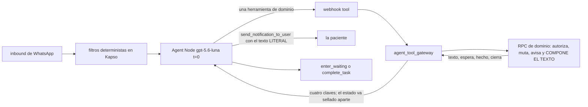

# 03 · Contratos de las once herramientas

Corte: 2026-09-02.

Este archivo es el **contrato** de las once herramientas de dominio: cómo se llaman, qué puede
mandar el modelo, qué RPC las respalda, qué devuelven, con qué clave de texto y qué estado dejan
abierto. Es lo que se firma entre el Agent Node, el gateway y la base.

**Qué no está aquí.** Las reglas numeradas de producto viven en `docs/01-producto.md` §2 y se citan
**por número**. Los textos visibles viven completos en `docs/02-conversaciones-y-textos.md` y se
citan **por clave**; si una clave de aquí y la de allá difieren, **manda `02`**. El prompt, el
workflow y la configuración del Agent Node viven en `docs/04-workflow-y-prompt.md`. El pseudocódigo
implementable de las cuatro del MVP vive en `docs/05-pseudocodigo.md`. Las migraciones, el gateway,
el registro de decisiones y los pendientes globales viven en
`docs/06-implementacion-y-decisiones.md`.

**Ningún ejemplo cita datos de producción.** Las reglas hablan de lo que cada profesional
configura, nunca de la muestra que exista hoy.

---

## Índice

- [1. El contrato común](#1-el-contrato-común)
  - [1.1 Las once, por fase](#11-las-once-por-fase)
  - [1.2 El resultado: cuatro claves, y el texto viaja de vuelta](#12-el-resultado-cuatro-claves-y-el-texto-viaja-de-vuelta)
  - [1.3 El sobre interno: `{result, next_state}`](#13-el-sobre-interno-result-next_state)
  - [1.4 `espera`: los siete valores](#14-espera-los-siete-valores)
  - [1.5 `cierra`, y el inventario de salidas abiertas](#15-cierra-y-el-inventario-de-salidas-abiertas)
  - [1.6 Lo que las once vuelven a comprobar](#16-lo-que-las-once-vuelven-a-comprobar)
  - [1.7 La superficie de parámetros del modelo: veintiséis](#17-la-superficie-de-parámetros-del-modelo-veintiséis)
  - [1.8 Cómo se llama la RPC, y su cabecera](#18-cómo-se-llama-la-rpc-y-su-cabecera)
  - [1.9 Idempotencia: `command_id` y `command_log`](#19-idempotencia-command_id-y-command_log)
  - [1.10 Los avisos a la profesional: las claves literales](#110-los-avisos-a-la-profesional-las-claves-literales)
  - [1.11 El presupuesto de cuatro mensajes](#111-el-presupuesto-de-cuatro-mensajes)
- [2. C3 · `pending_step` y `allowed_next_tools`](#2-c3--pending_step-y-allowed_next_tools)
  - [2.1 El fallo que corrige](#21-el-fallo-que-corrige)
  - [2.2 Los ocho parámetros de selección](#22-los-ocho-parámetros-de-selección)
  - [2.3 Tabla completa productor → consumidores](#23-tabla-completa-productor--consumidores)
  - [2.4 Las cinco reglas del candado](#24-las-cinco-reglas-del-candado)
- [3. Las cuatro del MVP](#3-las-cuatro-del-mvp)
  - [3.1 `mis_citas`](#31-mis_citas)
  - [3.2 `confirmar`](#32-confirmar)
  - [3.3 `mandar_comprobante`](#33-mandar_comprobante)
  - [3.4 `crisis`](#34-crisis)
- [4. Fase 2, esbozadas](#4-fase-2-esbozadas)
  - [4.1 `cancelar`](#41-cancelar)
  - [4.2 `buscar_horarios`](#42-buscar_horarios)
  - [4.3 `agendar`](#43-agendar)
  - [4.4 `reprogramar`](#44-reprogramar)
- [5. Fase 3, esbozadas](#5-fase-3-esbozadas)
  - [5.1 `cambiar_modalidad`](#51-cambiar_modalidad)
  - [5.2 `ver_servicios`](#52-ver_servicios)
- [6. Pospuesta: `dejar_resena`](#6-pospuesta-dejar_resena)
- [7. Claves de texto nuevas que este archivo pide dar de alta](#7-claves-de-texto-nuevas-que-este-archivo-pide-dar-de-alta)
- [8. Pendientes de este archivo](#8-pendientes-de-este-archivo)

---

## 1. El contrato común

### 1.1 Las once, por fase

Once herramientas de dominio. `send_notification_to_user`, `enter_waiting` y `complete_task` **no**
están en la lista: son herramientas de control (regla 9).

| # | Lo que ella escribe | Herramienta | Fase | Muta | Aviso a la profesional |
|---|---|---|---|---|---|
| 1 | «¿qué tengo?» · «¿dónde es?» · «¿cuánto debo?» | `mis_citas` | **MVP** | no | — |
| 2 | «sí voy» · «ahí estaré» · «ambas» | `confirmar` | **MVP** | sí, salvo la rama de prepago sin comprobante | `appointment_confirmed`, uno por cita |
| 3 | «[imagen]» · «ya pagué» | `mandar_comprobante` | **MVP** | sí, en la segunda llamada | `payment_proof_received`, y `appointment_confirmed` cuando el comprobante confirma |
| 4 | señal explícita de peligro inmediato | `crisis` | **MVP** | no toca agenda; **escribe el aviso** | tipo nuevo, §3.4 |
| 5 | «cancélala» | `cancelar` | 2 | sí | `appointment_cancelled_by_patient` |
| 6 | «el miércoles» · «en la tarde» · «mañana» | `buscar_horarios` | 2 | no | — |
| 7 | «la 3» · «a las 12» | `agendar` | 2 | sí, con `confirmado: true` | `appointment_created_by_patient` |
| 8 | «no voy a poder» · «muévela» | `reprogramar` | 2 | sí, en la llamada final | `appointment_rescheduled_by_patient`, o `appointment_cancelled_by_patient` en la salida de la serie |
| 9 | «¿la puedo tomar en línea?» | `cambiar_modalidad` | 3 | sí, con `confirmado: true` | `modality_changed_by_patient` |
| 10 | «quiero una cita» · «¿cuánto cuesta?» | `ver_servicios` | 3 | no | — |
| 11 | «5 estrellas, me ayudó mucho» | `dejar_resena` | **POSPUESTA** | sí | ninguno |

**Seis escriben agenda, tres leen, `crisis` escribe sólo aviso y bitácora, y `dejar_resena` está
fuera.** El reparto por fases y su motivo viven en `docs/01-producto.md` §6 y no se repiten aquí.

**Pasar el pago no es una herramienta:** es un booleano de dos de ellas,
`cancelar(pasa_el_pago)` y `reprogramar(a_la_proxima)`. Se gana lo que importa: **el modelo no
puede mover dinero por iniciativa propia sobre una cita que él eligió.** La salida sólo existe
cuando el servidor ya la ofreció, porque sólo el servidor sabe si hay dinero adentro, si alcanza el
plazo y cuál es el destino.

**Fuera del catálogo, y a propósito:** saludo sin intención, hablar con soporte, devoluciones y
descuentos, no te entendí, se acabó el espacio y `pendiente_lo_otro`. Ésos son textos del servidor
que no cuestan una llamada. **`crisis` ya no está en esa lista:** es la herramienta once, con texto
servido por el servidor y aviso a la profesional en la misma transacción (C4).

**Los dos textos de identidad tampoco cuestan tokens.** `not_patient` manda `no_te_reconocemos` e
`inactive_patient` manda `paciente_inactivo`, los dos antes del Agent Node
(`docs/04-workflow-y-prompt.md`). El cerrojo dentro de las once (§1.6) sigue ahí por si la relación
cambia a mitad de una ejecución.

**No hay herramienta de recursos.** La plantilla `patient_resource_delivery` invita a recoger
materiales y hoy nadie consume esa cola: si ella contesta a esa plantilla, se contesta
`fuera_de_alcance`. Prometer un material que nadie entrega es exactamente el falso éxito contra el
que está armado el resto.

### 1.2 El resultado: cuatro claves, y el texto viaja de vuelta

**El resultado que recibe el modelo tiene cuatro claves, iguales en las once:**

```json
{
  "texto":  "Listo, confirme tu sesion del jueves 27 de agosto a las 3:30 de la tarde.",
  "espera": null,
  "hecho":  true,
  "cierra": true
}
```

| Clave | Tipo | Qué significa |
|---|---|---|
| `texto` | cadena, ≤ 1000 caracteres | Lo que se manda, **palabra por palabra**. El modelo lo copia y no lo adorna |
| `espera` | cadena o nulo | **El nombre exacto de lo que falta** en la llamada siguiente: en seis de los siete valores, el de un parámetro; en `filtros`, el del grupo de día, fecha y franja. No es un enum que haya que interpretar: es la clave que hay que llenar |
| `hecho` | booleano | Verdadero **sólo** cuando algo se escribió en la base y el servidor lo volvió a leer |
| `cierra` | booleano | Si la conversación queda esperando respuesta o no |

**El texto viaja de vuelta porque el modelo es quien lo manda.** La RPC lo compone; el gateway se
lo devuelve al Agent Node dentro del resultado; el modelo lo entrega con
`send_notification_to_user` **copiándolo literal**. Ésa es la **regla dura 7 del prompt**
(`docs/04-workflow-y-prompt.md`), y es una de las piezas más importantes del diseño: la fidelidad
del precio, de la fecha y del monto descansa en ella.

**Qué significa «literal», sin margen.** El modelo no traduce, no corrige, no resume, no adorna, no
reordena, no cambia una cifra, no cambia una hora, no quita ni agrega una línea, y **no concatena
nada** —ni siquiera `pendiente_lo_otro`, que lo pega el servidor al final del `texto` antes de
devolverlo—. El argumento `message` de `send_notification_to_user` es **idéntico byte por byte** al
`texto` que llegó en el resultado. Esta frase se repite en las once fichas porque es la única regla
del contrato que **ningún componente de runtime comprueba hoy**: nadie compara lo que compuso la RPC
con lo que mandó el modelo. **Eso está registrado como riesgo aceptado, con su mitigación opcional,
una sola vez y en un solo lugar:** `docs/06-implementacion-y-decisiones.md`. Aquí no se reabre.

> **Ojo con el número 7.** La **regla 7** de `docs/01-producto.md` §2 es otra cosa: cinco opciones
> como máximo y horizonte de treinta días, con los servicios como única excepción hasta ocho. La
> **regla dura 7** del prompt es la del envío literal. **Las dos están vigentes y no se sustituyen.**
> Están numeradas igual en listas distintas; borrar una creyendo que se borra la otra cuesta o el
> tope de cinco opciones o la fidelidad del texto.



**No hay campo de error, y es deliberado.** Un código que el modelo sólo puede usar para ramificar
es ruido. Un «no se puede» del negocio es un `texto` con su salida adentro y `hecho: false`. Los
motivos siguen existiendo donde sirven: en la bitácora del servidor (C5,
`docs/06-implementacion-y-decisiones.md`). Y ese «qué hacer ahora» tiene **dos destinatarios**: la
paciente lo lee en el `texto`, y el modelo lo lee en `pending_step` y `allowed_next_tools` del
estado sellado (§2). Nunca en el mismo canal.

**La instrucción de copiar vive en el prompt, no en el resultado.** Una instrucción metida dentro
de un resultado se puede ignorar, o marcar como inyección.

### 1.3 El sobre interno: `{result, next_state}`

La RPC devuelve al gateway dos cosas, siempre:

```json
{
  "result":     { "texto": "...", "espera": null, "hecho": false, "cierra": false },
  "next_state": { "...": "opciones, sujeto, paso, acciones permitidas" }
}
```

`result` son las cuatro claves de §1.2 y es lo único que sale hacia el modelo. `next_state` **no
sale de Supabase en claro**: el gateway lo valida, lo sella con cifrado autenticado y una clave que
sólo vive en Supabase, y lo deja en `vars.agent_state`. Su contenido lógico:

| Campo | Para qué |
|---|---|
| herramienta que abrió la pregunta | Contra qué lista resuelve un número |
| `pending_step` | Etiqueta del paso abierto (§2) |
| `allowed_next_tools` | Las herramientas que pueden consumir ese paso (§2) |
| `options` | La lista numerada con sus identificadores internos y sus etiquetas visibles |
| `subject` | El recurso o cita principal de la gestión |
| `file_id` | El archivo que se estaba confirmando, en `mandar_comprobante` |
| `command_id` | Acuñado por el gateway; C2, §1.9 |
| versión y momento de creación | Caducidad y compatibilidad |

**El modelo no puede leer ese sobre.** `get_variable` y `save_variable` quedan deshabilitadas en el
Agent Node —`get_variable` acepta `"*"`, así que habilitarla le daría el token sellado— y el token
no se interpola en el prompt. La mecánica de reinyección y verificación vive en
`docs/04-workflow-y-prompt.md` y `docs/06-implementacion-y-decisiones.md`.

**El tamaño manda.** El resultado que se le devuelve al modelo se acota a
`max_tool_result_bytes = 16384`, que es exactamente `MAX_JSON_RESPONSE_BYTES` de la Edge Function
desplegada (`supabase/functions/_shared/agent/constants.ts:2`, en `/home/user/Agenda-Psi-V2`), y el
`texto` a 1000 caracteres. **Los dos topes los valida el gateway** antes de contestar; una RPC que
componga de más falla ahí y no llega al modelo.

### 1.4 `espera`: los siete valores

`servicio`, `modalidad`, `filtros`, `opcion`, `cita`, `citas`, `confirmado`.

Seis son, literalmente, el nombre de un parámetro de alguna de las once. `filtros` es el único que
no nombra un parámetro sino un grupo: los de día, fecha y franja de `buscar_horarios` (§4.2), que
se piden juntos y se contestan juntos. **Es el enum cerrado que valida el gateway.**

**En el MVP sólo viven dos:** `citas` (de `confirmar`) y `cita` (de `mandar_comprobante`). Los
otros cinco son Fase 2 y 3, y se escriben ahora para no renumerar después.

Eran nueve: se fueron `estrellas` y `comentario`, porque las dos preguntas de la reseña las hace el
prompt y ninguna herramienta las devuelve.

### 1.5 `cierra`, y el inventario de salidas abiertas

| Caso | `cierra` |
|---|---|
| `hecho` es verdadero | verdadero: lo que se pidió ya ocurrió y no falta contestar nada |
| `no_te_reconocemos` o `paciente_inactivo` | verdadero |
| `espera` no es nulo | falso: falta un dato y ella tiene que darlo |
| La herramienta dejó salidas abiertas y la respuesta puede ir a otra herramienta | falso |
| El texto cierra y no hay nada que continuar | verdadero: `sin_horarios`, el acuse del comprobante, la petición de comprobante de `confirmar` con prepago, y todo `mis_citas` |

**Una salida abierta va con `espera: null` y `cierra: false`, nunca con un `espera` prestado.** Un
`espera` que nombra el parámetro equivocado no es un detalle de redacción: es el enrutamiento
haciendo lo contrario de lo que se pidió. `cancelar_dinero_adentro_tarde` **no** es una salida
abierta: fuera de plazo se cancela y ya, así que es un cierre. Poner ahí `confirmado` mandaría un
«reprográmala» a cancelar la cita que ella pidió mover, con dinero adentro.

**El inventario corregido: son ocho claves en diez renglones, no tres.** El borrador anterior decía
tres y ése es el inventario del que depende el adaptador para **no** borrar `agent_state`.

| # | Clave | Herramienta(s) donde aparece | Renglones | Fase |
|---|---|---|---|---|
| 1 | `servicio_no_asignado` | `ver_servicios` | 1 | 3 |
| 2 | `reprogramar_recurrencia_dos_salidas` | `reprogramar` | 1 | 2 |
| 3 | `cita_ya_no_esta` | `reprogramar`, `cancelar` | **2** | 2 |
| 4 | `cita_cambio_de_lugar` | `reprogramar` | 1 | 2 |
| 5 | `cita_ya_paso` | `reprogramar`, `cancelar` | **2** | 2 |
| 6 | `cancelar_dinero_adentro` | `cancelar` | 1 | 2 |
| 7 | `cancelar_dinero_adentro_con_proxima` | `cancelar` | 1 | 2 |
| 8 | `comprobante_sin_archivo` | `mandar_comprobante` | 1 | **MVP** |

**Ocho claves, diez renglones.** Siete si alguien descuenta `servicio_no_asignado`, que su propia
ficha (§5.2) ya declara como salida abierta por separado; **el adaptador usa el inventario de
ocho**, porque lo que él compara es la clave del desenlace, no dónde estaba documentada.

**En el MVP existe exactamente una:** `comprobante_sin_archivo`.

**Este archivo agrega una novena, y lo dice.** `comprobante_formato_no_soportado` (§3.3, §7) nace
aquí porque el gateway no puede normalizar HEIC ni PDF y el bucket no los acepta. Con ella el
inventario vigente pasa a **nueve claves en once renglones**, y dos de ellas son del MVP. Se
declara así, y no escondida dentro de la tabla, para que quien compare con el borrador anterior vea
la corrección (ocho) separada del añadido (uno).

**Y hay cierres que tampoco borran el estado.** `comprobante_pedido` (§3.2) va con `cierra: true` y
aun así deja `pending_step = esperando_comprobante`: la gestión termina el turno, pero el paso
siguiente legítimo es un archivo que llega en un inbound nuevo. La regla completa del adaptador
queda así, y es la única que hay:

> **`agent_state` se borra cuando `cierra` es verdadero y el desenlace no está ni en el inventario
> de salidas abiertas ni en la lista de cierres con paso pendiente.**

**La lista de cierres con paso pendiente tiene hoy dos miembros, los dos del MVP y los dos de
`confirmar`:** `comprobante_pedido` y `confirmar_cierre_parcial_prepago` (§7). Los dos terminan con
lo mismo —se le pidió un comprobante— y por eso los dos dejan el mismo paso abierto.

### 1.6 Lo que las once vuelven a comprobar

**La identidad no viaja en los parámetros.** Kapso la inyecta en el contexto de ejecución; el
gateway la convierte en contexto interno y la RPC la vuelve a derivar. Valen sin repetirlas las
reglas **17, 18 y 19** de `docs/01-producto.md` §2: ningún identificador interno cruza al modelo,
la entrada es plana y validada, y el «ahora» lo pone el servidor.

**Las once vuelven a comprobar, dentro de su transacción, cuatro cosas:**

1. **Relación.** Se resuelve **siempre desde `whatsapp_link.id`**, nunca desde un `p_patient_id`
   suelto. `whatsapp_links` tiene `patient_id` y `professional_id` `NOT NULL`, así que la fila ya
   nombra la pareja, y `whatsapp_links_patient_id_key` es `UNIQUE (patient_id)`
   *(comprobado 2026-09-02)*.
2. **Actividad.** `patients.patient_status = 'active'`. Un `inactive` devuelve `paciente_inactivo`.
   La definición completa está en `docs/01-producto.md` §3.3 y no se repite.
3. **Profesional.** La cita, el cobro o el servicio pertenecen a la profesional resuelta. Las FK
   compuestas de la base ya lo imponen —`appointments_patient_id_professional_id_fkey`,
   `payments_appointment_id_professional_id_fkey`, `notifications_*_professional_id_fkey`— pero la
   RPC lo comprueba igual, porque una FK impide escribir mal, no leer de más.
4. **Propiedad y estado.** La cita sigue programada, el cobro sigue pendiente, el archivo sigue
   sin pegarse. **Se relee dentro de la misma transacción** (regla 16): entre la lista y la
   escritura pasan dos mensajes de ella, y en ese rato la profesional pudo mover todo desde su app.

**`consent_status` no se comprueba.** Es una **decisión explícita** con su motivo y su riesgo, no
una omisión: `docs/01-producto.md` §3.5. Ninguna de las once lo consulta.

Es un cerrojo, no el camino normal: el workflow ya separó `not_patient` de `inactive_patient` antes
del Agent Node.

### 1.7 La superficie de parámetros del modelo: veintiséis

Esto se cuenta porque es la superficie de ataque y la superficie de error del modelo.

| Herramienta | Parámetros | Cuántos | Fase |
|---|---|---|---|
| `mis_citas` | `sobre` | **1** | MVP |
| `confirmar` | `citas` | **1** | MVP |
| `mandar_comprobante` | `cita` | **1** | MVP |
| `crisis` | — | **0** | MVP |
| `cancelar` | `cita`, `confirmado`, `pasa_el_pago` | 3 | 2 |
| `buscar_horarios` | `servicio`, `modalidad`, `dias`, `fechas`, `relativo`, `hora`, `parte_del_dia` | 7 | 2 |
| `agendar` | `opcion`, `dia`, `confirmado` | 3 | 2 |
| `reprogramar` | `cita`, `opcion`, `confirmado`, `a_la_proxima` | 4 | 2 |
| `cambiar_modalidad` | `cita`, `confirmado` | 2 | 3 |
| `ver_servicios` | `pidio`, `confirmado` | 2 | 3 |
| `dejar_resena` | `estrellas`, `comentario` | 2 | POSPUESTA |

**Los números reales:**

- **26 parámetros** en las once herramientas.
- **24** en las diez que no están pospuestas.
- **18 nombres distintos**, porque `cita`, `confirmado` y `opcion` se repiten entre herramientas:
  `sobre`, `citas`, `cita`, `pidio`, `confirmado`, `servicio`, `modalidad`, `dias`, `fechas`,
  `relativo`, `hora`, `parte_del_dia`, `opcion`, `dia`, `a_la_proxima`, `pasa_el_pago`,
  `estrellas`, `comentario`.
- **8 de esos 18 son parámetros de selección** (§2.2); los otros 10 son texto o filtros.
- **En el MVP la superficie entera son 3 parámetros**, todos escalares: `sobre`, `citas`, `cita`.
  `crisis` no acepta ninguno.

**Tres parámetros es la cifra que importa.** El MVP se lanza con una superficie de tres claves
sobre cuatro herramientas, y de esas tres, dos son un número contra una lista que el propio
servidor escribió. No hay ni una fecha, ni una hora, ni un identificador, ni una cadena libre que
el modelo pueda inventar en todo el MVP. Ésa es la regla 18 llevada hasta el final.

**Ninguna herramienta acepta claves extra.** El gateway rechaza el cuerpo con una clave desconocida
**antes** de llamar a la base, y no la ignora en silencio: ignorarla convierte una alucinación en
un parámetro que nadie vio.

### 1.8 Cómo se llama la RPC, y su cabecera

**Ninguna de las once RPC existe hoy.** Verificado el 2026-09-02 contra producción:
`SELECT count(*) FROM pg_proc WHERE proname LIKE 'agent%'` devuelve **0**, y no existe ninguna
función llamada `confirmar`, `mis_citas`, `mandar_comprobante` ni `crisis` en `public`. Se crean
todas por migración nueva.

**El bautizo, decidido aquí:** cada herramienta se respalda con **una sola** RPC llamada
`public.agent_<nombre_de_la_herramienta>`.

| Herramienta | RPC de respaldo |
|---|---|
| `mis_citas` | `public.agent_mis_citas` |
| `confirmar` | `public.agent_confirmar` |
| `mandar_comprobante` | `public.agent_mandar_comprobante` |
| `crisis` | `public.agent_crisis` |
| `cancelar` | `public.agent_cancelar` |
| `buscar_horarios` | `public.agent_buscar_horarios` |
| `agendar` | `public.agent_agendar` |
| `reprogramar` | `public.agent_reprogramar` |
| `cambiar_modalidad` | `public.agent_cambiar_modalidad` |
| `ver_servicios` | `public.agent_ver_servicios` |
| `dejar_resena` | `public.agent_dejar_resena` |

**Motivo del prefijo y del nombre en español.** El prefijo `agent_` está libre (0 funciones) y hace
que el inventario del agente se pueda listar con una sola consulta el día que haya que auditarlo o
revocarlo entero. El nombre en español mantiene el mapeo herramienta → RPC uno a uno y legible; los
nombres en inglés ya están ocupados por funciones de la app con **otra semántica** —
`cancel_appointment` exige `p_payment_action` y sin él no cancela, así que no es la gemela de
`cancelar` (`docs/01-producto.md` §6)—. **Riesgo:** el resto del esquema está en inglés, así que
esta familia se lee distinta; se acepta porque el mapeo uno a uno vale más que la uniformidad, y
porque una colisión de nombres con una función de la app sería mucho peor.

**La cabecera de seguridad es la misma en las once**, copiada de las funciones ya desplegadas:

- `SECURITY DEFINER` con `SET search_path = ''` y toda referencia calificada. **Las 100 funciones
  del esquema `public` llevan `proconfig = {search_path=""}`, sin una sola excepción**
  *(comprobado 2026-09-02)*.
- `RETURNS jsonb`.
- **`REVOKE ALL` a `PUBLIC`, `anon` y `authenticated`; `GRANT EXECUTE` sólo a `service_role`.**

**Ese GRANT es lo que separa a estas once del resto.** En producción hay **75 funciones
`SECURITY DEFINER` ejecutables por `authenticated`** y **4 por `anon`** *(comprobado 2026-09-02)*. Las de la app
resuelven al actor con `current_professional_id()`, así que no sirven al agente sin reescritura, y
además una función del agente ejecutable por `authenticated` sería una puerta abierta a operar en
nombre de cualquier paciente. **Las once nacen cerradas y sólo el gateway, con `service_role`, las
llama.** El riesgo de olvidarlo es exactamente el de C5: una llave maestra multi-tenant.

**La herramienta se identifica por la ruta, no por el cuerpo.** El gateway expone una ruta por
herramienta, `/tools/<nombre>`, y la resuelve contra un mapa fijo. La Edge Function desplegada ya
hace exactamente eso y lo dice en su propio comentario: la seguridad se apoya en el prefijo
canónico más el mapa exacto, **nunca en un encabezado ni en un campo que mande el llamador**
(`supabase/functions/agent_tool_gateway/handler.ts:46-62`, en `/home/user/Agenda-Psi-V2`). Lo que
hay que cambiar es el mapa: `FUTURE_AGENT_ROUTES` (`handler.ts:7-34`) todavía lista las 25 rutas
granulares de la era A1 y hoy toda ruta contesta `403 OPERATION_NOT_ENABLED` (`handler.ts:103`).
La función está desplegada y activa, versión 35 *(comprobado 2026-09-02)*.

### 1.9 Idempotencia: `command_id` y `command_log`

**Las lecturas no llevan `command_id`.** `mis_citas` no toca `command_log`, y en `confirmar`,
`mandar_comprobante` y `crisis` **sólo la rama que escribe lo reclama**. Motivo: una lectura es
idempotente por naturaleza, y meterle una fila al log quemaría el `command_id` del turno y haría
que la escritura siguiente chocara con `COMMAND_PAYLOAD_MISMATCH` contra su propia lectura.

**El `command_id` lo acuña el gateway** a partir de (`conversation_id`, contador de turno) y viaja
sellado en `vars.agent_state` (C2, regla 17). **No se deriva de ningún WAMID**, y esto no es una
preferencia: el trigger de mensajes entrantes de Kapso no expone ninguno. El inventario de lo que
sí expone vive en `docs/04-workflow-y-prompt.md`. Además, la política de entrega de Kapso hace caer
los batches a entrega individual tras agotar reintentos, así que **el conjunto de mensajes de un
batch es inestable por diseño documentado** y no sirve como semilla de un identificador estable.

**La clave del log**, verificada contra producción el 2026-09-02:

| Columna | Valor para el agente |
|---|---|
| `scope_type` | `'whatsapp_agent'` (es `text` libre) |
| `scope_id` | `whatsapp_link.id` |
| `command_id` | el que acuñó el gateway |
| `command_type` | el nombre de la RPC |
| `request_hash` | `private.hash_command_request` sobre operación, argumentos públicos canónicos y el paso autorizado |
| `actor` | `'patient'` |

`pk_command_log` es `PRIMARY KEY (scope_type, scope_id, command_id)` *(comprobado 2026-09-02)*. El
enum `actor_type` tiene exactamente tres etiquetas: `patient | professional | system`
*(comprobado 2026-09-02)*.

> **Trampa verificada:** `actor_type` **admite** `'patient'`, pero **ninguna función desplegada lo
> escribe**: hoy sólo hay `system` y `professional` *(mapeo)*. Estas once son las primeras. No es un
> impedimento —el enum lo acepta— pero sí significa que ninguna pantalla ni reporte existente ha
> visto nunca ese valor, y hay que revisar que ninguno rompa al encontrárselo.

**La secuencia dentro de la transacción**, idéntica en las tres que mutan y copiada del patrón de
`credit_appointment_payment`: reclamar con `INSERT ... ON CONFLICT DO NOTHING`; si no insertó,
`SELECT ... FOR UPDATE`; si `command_type` o `request_hash` no coinciden, fallar con
`COMMAND_PAYLOAD_MISMATCH` sin tocar negocio; si `completed_at` ya existe, **devolver exactamente
el `result` guardado**; si es la dueña, tomar los bloqueos necesarios, revalidar todo (§1.6),
mutar, escribir el aviso y guardar `result` y `completed_at` en la misma escritura. El pseudocódigo
está en `docs/05-pseudocodigo.md`.

**Lo que se guarda en `command_log.result` es el sobre completo `{result, next_state}`**, no sólo
las cuatro claves. Así una respuesta perdida recupera **el texto ya redactado** y también las
opciones o el paso abierto; el gateway vuelve a sellar `next_state` y el reintento devuelve
exactamente lo mismo sin repetir la mutación. Con el texto viajando de vuelta al modelo, esto deja
de ser un detalle: sin él, un reintento tendría que recomponer el texto y podría componer otro.

**No existe el caso «no pudimos saber si se escribió».** El gateway reintenta una sola vez a nivel
de transporte (`gateway_transport_retries = 1`) con el mismo `command_id`, y `command_log` devuelve
el resultado guardado.

### 1.10 Los avisos a la profesional: las claves literales

**Van en la misma transacción que la mutación. Si el aviso no se puede escribir, la mutación no
ocurrió** (regla 13). `notifications` es el único canal con Realtime hacia la app de la
profesional, así que un aviso que no se escribe es una mutación que ella no ve.

`public.notifications` tiene ocho columnas; `type` es **`text` `NOT NULL` sin `CHECK` ni enum**,
`appointment_id` y `patient_id` admiten nulo, `professional_id` es `NOT NULL`, y la única
restricción de contenido es `chk_notification_payload_object`:
`CHECK ((jsonb_typeof(payload) = 'object'::text))` *(comprobado 2026-09-02)*.

**Los seis tipos vigentes y sus claves de payload.** En el MVP sólo se escriben los dos marcados.

| `type` | Claves del `payload` | Quién lo escribe |
|---|---|---|
| `appointment_created_by_patient` | `patient_first_name`, `patient_last_name`, `appointment_starts_at`, `appointment_ends_at`, `appointment_modality` | `agendar` (Fase 2) |
| **`appointment_confirmed`** | las mismas cinco | **`confirmar`** y `mandar_comprobante` cuando el comprobante confirma |
| `appointment_cancelled_by_patient` | las mismas cinco | `cancelar` y `reprogramar` con `a_la_proxima: true` (Fase 2) |
| `appointment_rescheduled_by_patient` | `patient_first_name`, `patient_last_name`, `previous_starts_at`, `previous_modality`, `new_starts_at`, `new_modality` | `reprogramar` (Fase 2) |
| `modality_changed_by_patient` | `patient_first_name`, `patient_last_name`, `appointment_starts_at`, `previous_modality`, `new_modality` | `cambiar_modalidad` (Fase 3) |
| **`payment_proof_received`** | `patient_first_name`, `patient_last_name`, `appointment_starts_at`. **Sin el monto: el contrato lo prohíbe expresamente** | **`mandar_comprobante`** |

**Cuatro precisiones que la app impone y que no se negocian.** Verificadas contra
`flutter_application_1/lib/pages/notifications/notification_models.dart`, en
`/home/user/Agenda-Psi-V2`:

1. **`patient_first_name` obligatorio y no vacío.** `_patientName` (líneas 255-263) devuelve `null`
   si falta o si viene en blanco, y con eso el `when` del `switch` no empareja.
   `patient_last_name` es opcional y se omite si es nulo.
2. **La modalidad va literal, sin traducir.** `_modalityLabel` (líneas 297-300) mapea exactamente
   `'online'` → «en línea» y `'in_person'` → «presencial», y **cualquier otro valor devuelve
   `null`**. Se manda el valor crudo del enum `modality`, nunca la etiqueta en español.
3. **Las horas van con huso.** `_parseOffsetInstant` (líneas 288-294) exige que la cadena termine
   en `Z` o en un desplazamiento `±HH:MM`; el `timestamptz` crudo de Postgres ya cumple. Una hora
   sin huso no pinta.
4. **Si falta una clave, la tarjeta degrada al aviso neutro.** El `switch` cierra con
   `_ => _neutralPresentation` (línea 186), que es literalmente «Nueva notificación · Hay una
   actualización reciente en tu cuenta» (líneas 249-253). No falla: **miente por omisión**, que es
   peor.

**El `switch` conoce ocho tipos** —los seis de arriba más `professional_profile_approved` y
`professional_profile_rejected`—. Cualquier tipo nuevo cae en la tarjeta neutra hasta que se le
agregue su `case`. Eso manda sobre `crisis` (§3.4).

**Dos avisos que el agente NO manda.** Encolar `appointment_cancelled` o `appointment_rescheduled`
en `whatsapp_outbox` hacia el mismo teléfono con el que se acaba de conversar es un eco (regla 15).
Ojo con el homónimo: ahí `appointment_cancelled` es una **plantilla** de `whatsapp_outbox`, no el
tipo de `notifications`.

**Regla 13 sin excepciones, y por qué se puede decir hoy.** La única excepción que existía era
`dejar_resena`, que mutaba y no avisaba a nadie. Con `dejar_resena` pospuesta, en el catálogo
vigente **no queda ninguna**.

### 1.11 El presupuesto de cuatro mensajes

**Tope decidido: 4 mensajes salientes por gestión.** Es un presupuesto de producto y las tablas de
desenlaces tienen que caber en él.

- `mis_citas`: **1 mensaje**. Siempre cierra.
- `crisis`: **1 mensaje**. Siempre cierra.
- `confirmar` con varias esperando: la lista y el cierre, **2**. Con prepago: la lista y
  `comprobante_pedido`, **2**, y el comprobante ya es otra gestión.
- `mandar_comprobante`: la pregunta y el acuse, **2**. Siempre son dos, porque siempre pregunta.

**El MVP entero cabe en dos.** El presupuesto se estrecha en Fase 2: `ver_servicios`,
`buscar_horarios`, la propuesta de `agendar` y la creación son cuatro, y si el hueco se ocupa entre
la propuesta y la escritura, la gestión se pasa. Eso está aceptado y anotado en §4.3. El contador y
su punto de aplicación viven en `docs/06-implementacion-y-decisiones.md`.

---

## 2. C3 · `pending_step` y `allowed_next_tools`

### 2.1 El fallo que corrige

El diseño anterior guardaba `pending_tool` —**una** herramienta— y el gateway exigía que la
herramienta llamada coincidiera con ella. Suena bien y **falla el 100% de las veces** en cuanto un
número producido por una herramienta lo consume otra.

El caso exacto: `buscar_horarios` escribe la lista de horas y deja `espera: opcion`. Ella contesta
«la 2». Ese 2 **tiene que aterrizar en `agendar`**, que es quien tiene el parámetro `opcion`. Con
`pending_tool = 'buscar_horarios'`, `agendar(opcion: 2)` llega con la herramienta «equivocada»,
falla cerrada y vuelve a preguntar. **Se atora justo cuando ella ya había escogido**, y se atora
siempre, no en un caso raro.

Y no es el único traspaso: `servicio` lo produce `ver_servicios` y lo consume `buscar_horarios`.
El propio catálogo lo declaraba —«un número resuelve contra la lista que lo produjo»— sin notar que
el productor y el consumidor son herramientas distintas.

**La corrección.** `pending_tool` desaparece. El estado sellado guarda **dos** campos:

- **`pending_step`**: la etiqueta del paso abierto. Es descriptiva y sirve para la bitácora y para
  que la RPC sepa en qué punto de la gestión está.
- **`allowed_next_tools`**: la **lista explícita** de herramientas que pueden consumir ese paso. Es
  lo que autoriza. Es una lista, no un valor, porque hay pasos con dos destinos legítimos
  —`reprogramar_recurrencia_dos_salidas` ofrece buscar día o quedarse en la próxima de la serie—.

**Lo que no se relaja.** Un número **sigue resolviendo contra la lista que lo produjo**, y esa
lista vive en `options` junto con la herramienta que la escribió. Lo único que cambia es **quién
puede consumirla**, y eso lo declara `allowed_next_tools`, no la identidad del productor.

### 2.2 Los ocho parámetros de selección

El candado no se aplica a toda llamada: se aplica a las llamadas que traen un **parámetro de
selección**, es decir, un valor que sólo significa algo contra una lista o una pregunta que el
servidor escribió antes.

| Parámetro | Resuelve contra | Producido por |
|---|---|---|
| `servicio` | la lista de servicios | `ver_servicios` |
| `opcion` | la lista de horas | `buscar_horarios` |
| `dia` | la lista compartida entre dos días | `buscar_horarios` |
| `cita` | la lista de citas o de cobros | la misma herramienta que la escribió |
| `citas` | la lista de citas de `confirmar` | `confirmar` |
| `confirmado` | la propuesta o el aviso que el servidor acaba de dar | la misma herramienta |
| `pasa_el_pago` | la salida que el servidor ya ofreció | `cancelar` |
| `a_la_proxima` | la salida de la serie que el servidor ya ofreció | `reprogramar` |

**Son ocho, no seis.** El borrador anterior listaba seis y dejaba fuera `servicio` y `dia`, y ese
hueco es real: un `servicio: 3` sin lista vigente resolvería contra nada, y un `dia: "martes"` sin
lista compartida vigente decidiría **qué día se aparta** sin que nadie haya escrito esa opción. Los
dos son números o etiquetas contra una lista del servidor, exactamente como los otros seis.

**Los otros diez parámetros no son de selección**: `sobre`, `pidio`, `modalidad`, `dias`, `fechas`,
`relativo`, `hora`, `parte_del_dia`, `estrellas` y `comentario`. Son lo que ella dijo, tal cual, y
no dependen de ninguna lista previa.

### 2.3 Tabla completa productor → consumidores

Ésta es la tabla que hay que implementar entera. **Todo desenlace que deja algo abierto está
aquí**; los que no aparecen no dejan paso pendiente y su `agent_state` se borra al cerrar.

| Productora | Desenlace | `espera` | `pending_step` | `allowed_next_tools` | Fase |
|---|---|---|---|---|---|
| `confirmar` | `confirmar_lista` | `citas` | `elegir_citas` | `[confirmar]` | **MVP** |
| `confirmar` | `comprobante_pedido` | nulo, **cierra** | `esperando_comprobante` | `[mandar_comprobante]` | **MVP** |
| `confirmar` | `confirmar_cierre_parcial_prepago` | nulo, **cierra** | `esperando_comprobante` | `[mandar_comprobante]` | **MVP** |
| `mandar_comprobante` | `comprobante_pregunta_una` | `cita` | `elegir_cobro` | `[mandar_comprobante]` | **MVP** |
| `mandar_comprobante` | `comprobante_lista` | `cita` | `elegir_cobro` | `[mandar_comprobante]` | **MVP** |
| `mandar_comprobante` | `comprobante_varias_imagenes` | `cita` | `elegir_cobro` | `[mandar_comprobante]` | **MVP** |
| `mandar_comprobante` | `comprobante_sin_archivo` | nulo, abierta | `esperando_archivo` | `[mandar_comprobante]` | **MVP** |
| `mandar_comprobante` | `comprobante_formato_no_soportado` | nulo, abierta | `esperando_archivo` | `[mandar_comprobante]` | **MVP** |
| `buscar_horarios` | `horarios_lista` | `opcion` | `elegir_horario` | `[agendar]` sin `subject`; `[reprogramar]` con `subject` | 2 |
| `buscar_horarios` | `horarios_lista_compartida` | `opcion` | `elegir_horario` | igual que el anterior | 2 |
| `buscar_horarios` | `sin_hueco_fuera_de_horario` | `opcion` | `elegir_horario` | igual | 2 |
| `buscar_horarios` | `sin_hueco_ausencia` | `opcion` | `elegir_horario` | igual | 2 |
| `buscar_horarios` | `sin_hueco_lleno` | `opcion` | `elegir_horario` | igual | 2 |
| `buscar_horarios` | `sin_hueco_demasiado_pronto` | `opcion` | `elegir_horario` | igual | 2 |
| `buscar_horarios` | `horarios_falta_modalidad` | `modalidad` | `dar_modalidad` | `[buscar_horarios]` | 2 |
| `buscar_horarios` | `modalidad_no_disponible_en_servicio` | `modalidad` | `dar_modalidad` | `[buscar_horarios]` | 2 |
| `buscar_horarios` | `sin_hueco_dias_que_no_trabaja` | `filtros` | `dar_filtros` | `[buscar_horarios]` | 2 |
| `buscar_horarios` | `fuera_del_horizonte` | `filtros` | `dar_filtros` | `[buscar_horarios]` | 2 |
| `buscar_horarios` | **`horarios_falta_filtros`** | `filtros` | `dar_filtros` | `[buscar_horarios]` | 2 |
| `agendar` | `agendar_pregunta_confirmar` | `confirmado` | `confirmar_propuesta` | `[agendar]` | 2 |
| `agendar` | `horario_ocupado` | `opcion` | `elegir_horario` | `[agendar]` | 2 |
| `agendar` | `horarios_lista_compartida` | **`dia`** | `decir_dia` | `[agendar]` | 2 |
| `reprogramar` | `reprogramar_lista` | `cita` | `elegir_cita` | `[reprogramar]` | 2 |
| `reprogramar` | `reprogramar_pregunta_dia` | `filtros` | `dar_filtros` | `[buscar_horarios]` | 2 |
| `reprogramar` | `reprogramar_aviso_tardio` | `confirmado` | `confirmar_cambio_tardio` | `[reprogramar]` | 2 |
| `reprogramar` | `reprogramar_solo_la_proxima` | `confirmado` | `confirmar_solo_la_proxima` | `[reprogramar]` | 2 |
| `reprogramar` | `reprogramar_recurrencia_dos_salidas` | nulo, abierta | `elegir_salida_serie` | `[buscar_horarios, reprogramar]` | 2 |
| `reprogramar` | `horario_ocupado` | `opcion` | `elegir_horario` | `[reprogramar]` | 2 |
| `reprogramar` | `cita_ya_no_esta` | nulo, abierta | `cita_se_movio` | `[reprogramar]`, y `ver_servicios` cuando la Fase 3 esté viva | 2 |
| `reprogramar` | `cita_cambio_de_lugar` | nulo, abierta | `cita_se_movio` | igual | 2 |
| `reprogramar` | `cita_ya_paso` | nulo, abierta | `cita_se_movio` | igual | 2 |
| `cancelar` | `cancelar_lista` | `cita` | `elegir_cita` | `[cancelar]` | 2 |
| `cancelar` | `cancelar_aviso_tardio` | `confirmado` | `confirmar_cancelacion_tardia` | `[cancelar]` | 2 |
| `cancelar` | `cancelar_dinero_adentro` | nulo, abierta | `elegir_salida_dinero` | `[reprogramar, cancelar]` | 2 |
| `cancelar` | `cancelar_dinero_adentro_con_proxima` | nulo, abierta | `elegir_salida_dinero_con_proxima` | `[reprogramar, cancelar]` | 2 |
| `cancelar` | `cita_ya_no_esta` | nulo, abierta | `cita_se_movio` | `[cancelar]` | 2 |
| `cancelar` | `cita_ya_paso` | nulo, abierta | `cita_se_movio` | `[cancelar]` | 2 |
| `cambiar_modalidad` | `modalidad_lista` | `cita` | `elegir_cita` | `[cambiar_modalidad]` | 3 |
| `cambiar_modalidad` | `modalidad_propuesta` | `confirmado` | `confirmar_propuesta` | `[cambiar_modalidad]` | 3 |
| `ver_servicios` | `servicios_varios` | `servicio` | `elegir_servicio` | `[buscar_horarios]` | 3 |
| `ver_servicios` | `servicios_uno` | `filtros` | `dar_filtros` | `[buscar_horarios]` | 3 |
| `ver_servicios` | `servicio_no_existe` | `servicio` | `elegir_servicio` | `[buscar_horarios]` | 3 |
| `ver_servicios` | `aviso_recurrencia` | `confirmado` | `confirmar_serie_aparte` | `[ver_servicios]` | 3 |
| `ver_servicios` | `servicio_no_asignado` | nulo, abierta | `servicio_no_asignado` | `[ver_servicios]` | 3 |
| `mis_citas` | los siete | nulo | **ninguno** | — | MVP |
| `crisis` | los dos | nulo | **ninguno** | — | MVP |
| `dejar_resena` | los tres | nulo | **ninguno** | — | POSPUESTA |

**Cuatro cosas que hay que leer despacio en esa tabla:**

1. **Las cuatro del MVP sólo se auto-referencian, con una excepción a favor.** `confirmar` y
   `mandar_comprobante` consumen sus propios números; `mis_citas` y `crisis` no abren nada. La
   única transferencia del MVP es `confirmar → mandar_comprobante`, y es **obligatoria**: sin ella,
   la paciente con prepago que dijo «sí voy» recibe la petición de comprobante y después no puede
   mandarlo. **Ninguno de los traspasos rotos por `pending_tool` cae en el MVP**, así que C3 se
   implementa completo aunque su fallo sólo se manifieste en la Fase 2.
2. **`buscar_horarios(espera: opcion)` tiene dos consumidores posibles y el gateway elige uno.**
   Con `subject` vacío el destino es `agendar`; con una cita en `subject` el destino es
   `reprogramar`. **Se lista uno, no los dos**, porque la lista es una autorización y no un menú:
   ofrecer los dos permitiría que una selección de una reprogramación creara una cita nueva.
3. **`agendar(horarios_lista_compartida)` espera `dia`, no `opcion`.** Es una corrección: el
   borrador anterior ponía `opcion` ahí, y lo que falta cuando la lista era compartida es el día
   —ella ya dio el número—. Un `espera` que nombra el parámetro equivocado manda la respuesta a la
   rama contraria.
4. **`cita_se_movio` ofrece «agendar otra» y eso depende de la Fase 3.** Mientras `ver_servicios`
   no esté desplegada, `allowed_next_tools` no la incluye **y el texto tampoco la ofrece**. Una
   salida escrita que ninguna herramienta atiende es el falso éxito exacto que este contrato existe
   para evitar.

### 2.4 Las cinco reglas del candado

1. **Sin `pending_step`, no hay candado.** Un estado ausente, vencido o sin paso abierto deja pasar
   cualquier herramienta habilitada para esa profesional y esa fase. Lo contrario haría imposible
   empezar una conversación.
2. **Con `pending_step` abierto, una llamada que trae un parámetro de selección (§2.2) sólo se
   acepta si su herramienta está en `allowed_next_tools`.** Si no está, **falla cerrada**: no se
   muta, y se reemite la pregunta o la lista. Nunca se adivina de qué lista era.
3. **Una llamada sin ningún parámetro de selección inicia una gestión nueva** y descarta el estado
   anterior, aunque haya un paso abierto. Es la única forma de que ella pueda cambiar de tema sin
   quedar atrapada. Ese descarte es explícito y queda en la bitácora.
4. **`mis_citas` y `crisis` se aceptan siempre, con paso abierto o sin él, y no descartan el
   estado.** `mis_citas` no tiene parámetros de selección y no muta nada; `crisis` **no se puede
   bloquear jamás por un paso pendiente**, y ése es el motivo entero de la regla. Después de una de
   las dos, el gateway vuelve a sellar el mismo `next_state`, así que ella puede contestar «la 1» a
   la pregunta anterior y el número sigue resolviendo.
5. **Un número fuera del rango de la lista vigente no se manda a la base.** La misma herramienta
   reemite la lista. No se resuelve contra una lista nueva ni contra otra herramienta.

**Lo que esto conserva.** Un `cita: 2` de `cancelar` no significa nada en `cambiar_modalidad`,
porque las dos listas se construyen con reglas distintas. Eso sigue siendo cierto: la lista vive en
`options` con su productora, y `allowed_next_tools` sólo dice quién puede consumirla.

**La prueba que hay que escribir.** El gateway rechaza toda herramienta fuera de
`allowed_next_tools` cuando hay un paso abierto y la llamada trae un parámetro de selección. Va en
la batería de conformidad de `docs/06-implementacion-y-decisiones.md`.

---

## 3. Las cuatro del MVP

Estas cuatro llevan contrato completo. Su pseudocódigo fiel está en `docs/05-pseudocodigo.md`.

---

### 3.1 `mis_citas`

**Intención.** Las tres preguntas de la misma familia: **qué citas tengo, dónde es y cuánto debo.**
Un saludo sólo llega aquí si el mismo batch trae una de esas tres preguntas.

**No hay herramienta de dirección aparte ni de adeudos.** Son la misma consulta con distinto
énfasis, y partirla en tres obligaría al modelo a elegir entre tres puertas que llevan al mismo
cuarto.

#### Parámetros del modelo

| Parámetro | Tipo | De dónde sale |
|---|---|---|
| `sobre` | `"citas"` \| `"donde"` \| `"adeudos"` | Cuál de las tres preguntó. Sólo cambia qué se responde primero; los datos se resuelven igual. **Si no llega, el gateway asume `"citas"`** |

**Por qué el valor por omisión.** El tipo no admite nulo, pero nada impedía que el modelo omitiera
la clave. Rechazar la llamada por eso costaría un mensaje entero para no contestar nada; asumir
`"citas"` contesta lo más probable y lo demás cabe en el mismo texto. **Uno de los tres, siempre:**
cualquier otro valor se rechaza en el gateway antes de llamar a la base.

#### RPC de respaldo

```
public.agent_mis_citas(
  p_whatsapp_link_id uuid,
  p_sobre            text DEFAULT 'citas'
) RETURNS jsonb
```

**No lleva `p_command_id`:** no muta, así que no toca `command_log` (§1.9).

#### Autorización

`SECURITY DEFINER`, `search_path` vacío, `REVOKE` a `PUBLIC`/`anon`/`authenticated`, `GRANT EXECUTE`
sólo a `service_role`. Deriva paciente y profesional **desde `whatsapp_link.id`**, exige
`patients.patient_status = 'active'` y proyecta únicamente citas de esa pareja. `consent_status` no
se consulta (§1.6).

**No se reusa `list_appointments`.** La función desplegada existe pero su ACL es
`{postgres, authenticated}` y resuelve el actor por el camino de la app *(mapeo)*: no sirve al
agente sin reescritura.

#### Qué devuelve

Sus citas futuras —**máximo cinco, de una serie sólo la más próxima** (regla 7)— con lo que puede
hacer con cada una, y la pregunta de cierre.

**Lo que puede hacer sale de la intersección de dos cosas: el menú de esa profesional (regla 8) y
las herramientas efectivamente desplegadas.** En el MVP eso significa **confirmar y mandar
comprobante**, y nada más: **no se menciona cancelar, mover ni cambiar de modalidad.** Ofrecer
cuatro verbos que ninguna herramienta atiende es el falso éxito más caro del MVP, porque lo produce
la herramienta que más se usa.

- **Dónde es, presencial.** La dirección; y si no hay dirección guardada, la segunda frase del
  mismo texto dice que se la comparte su profesional. Es frecuente, no raro.
- **Dónde es, en línea.** Se dice que es en línea y **no se manda la liga**. La liga sale en el
  aviso de una hora antes, y sólo ahí: mandarla dos días antes es mandarla al fondo de una
  conversación donde no la va a encontrar el día de la sesión.
- **Cuánto debo.** Los cobros que están esperando, con su fecha y su monto. **No dice «pagado» ni
  promete que algo quedó saldado** (regla 4): dice qué se espera y de qué sesión.

Cuando dos renglones comparten servicio, el de la serie lleva la coletilla que lo identifica como
tal y el suelto no lleva nada. **Nunca se dice «sesión 1 de 6»:** ese número no está guardado y
contarlo sería intuir (regla 1).

**No es un volcado del historial con otro nombre.** No trae servicios, ni precios, ni capacidades,
ni frases fijas. Trae citas y lo que se debe por ellas.

#### Resultado

| Situación | Clave de texto | `espera` | `hecho` | `cierra` | `pending_step` |
|---|---|---|---|---|---|
| Tiene citas | `mis_citas_lista` | nulo | falso | **verdadero** | ninguno |
| Tiene una sola | `mis_citas_una` | nulo | falso | **verdadero** | ninguno |
| Preguntó dónde es, **una sola cita**, presencial | `mis_citas_donde_presencial` | nulo | falso | **verdadero** | ninguno |
| Preguntó dónde es, **una sola cita**, en línea | `mis_citas_donde_en_linea` | nulo | falso | **verdadero** | ninguno |
| Preguntó dónde es y tiene **varias** | `mis_citas_lista`, con el lugar de cada una | nulo | falso | **verdadero** | ninguno |
| Preguntó cuánto debe, y debe | `mis_citas_adeudos` | nulo | falso | **verdadero** | ninguno |
| Preguntó cuánto debe, y no debe nada | `mis_citas_sin_adeudos` | nulo | falso | **verdadero** | ninguno |
| No tiene ninguna | `mis_citas_sin_citas` | nulo | falso | **verdadero** | ninguno |

**El renglón de «varias» es una corrección.** Los dos textos de «dónde» suponen una sola cita, y la
tabla anterior no decía qué pasa con tres. **No se pregunta cuál**: la respuesta cabe entera, y
preguntar para después contestar lo mismo cuesta un mensaje y una vuelta. `mis_citas` es la
herramienta que no puede fallar; con esa ambigüedad, fallaba.

**El modelo recibe siempre `{null, false, true}` y llama `complete_task`.** Es el caso más simple
de las once: no abre paso, no toma `command_id` y no toca `notifications`.

**Muta:** no. **Aviso:** ninguno.

**El texto se copia literal.** El modelo manda el `texto` recibido con `send_notification_to_user`,
palabra por palabra. En esta herramienta eso protege la dirección del consultorio y los montos
adeudados, que son datos que reescribir sería inventar.

**Cuándo NO se usa.** Cuando el mensaje es genuinamente ininteligible: eso es `no_entendi`, que
vive en el prompt y cuesta cero. Y un «hola» o un «gracias» sin intención **no se convierten** en
`mis_citas`.

**Errores y su remediación.** Ninguno. Es la herramienta que no puede fallar en el sentido del
negocio: o hay citas, o no las hay.

---

### 3.2 `confirmar`

**Intención.** «Sí voy». «Ahí estaré». «Ambas». Casi siempre contestando a
`appointment_confirmation_request` o a `appointment_confirmation_prepay`.

#### Parámetros del modelo

| Parámetro | Tipo | De dónde sale |
|---|---|---|
| `citas` | arreglo de enteros 1..5, o el literal `"todas"`, o nulo | Los números de la lista que escribió **esta misma** herramienta. Nulo en la primera llamada |

**Es la única que recibe varias citas de una vez**, y es un arreglo de escalares, que es justo lo
que la regla 18 permite. Ella puede tener dos avisos esperando y contestar «ambas».

**`"todas"` se expande contra la última lista emitida**, no contra una consulta nueva. Motivo: la
lista es lo que ella vio; expandir contra el conjunto vivo podría confirmar una cita que apareció
después de que ella leyó el mensaje.

**Un número fuera de rango invalida la llamada entera.** Si llega `[1, 4]` y la lista tenía tres,
**no se confirma ninguna** y se reemite `confirmar_lista`. Motivo: aceptar el 1 y descartar el 4
confirmaría una sesión sobre la base de un mensaje que el servidor no entendió completo, y el daño
—que ella crea que avisó de una sesión a la que no va a ir— no tiene arreglo por conversación.

#### RPC de respaldo

```
public.agent_confirmar(
  p_whatsapp_link_id uuid,
  p_command_id       uuid DEFAULT NULL,
  p_appointment_ids  uuid[] DEFAULT NULL
) RETURNS jsonb
```

**El gateway resuelve las posiciones antes de llamar.** `citas: [1,2]` se convierte en los
`appointment_id` que viven en `options` del estado sellado; `"todas"` se expande a todos los de esa
lista. **La RPC nunca recibe una posición**, recibe identificadores, y **los vuelve a comprobar**:
que sean de esa paciente, de esa profesional, futuros y realmente esperando confirmación. Un
identificador que no pase se trata como si no existiera y se reemite la lista.

`p_command_id` llega en nulo en la llamada que sólo lista, y con valor en la que muta.

#### Autorización

La cabecera de §1.8 y las cuatro comprobaciones de §1.6, con dos rejas propias de la base que la
RPC tiene que respetar al escribir *(comprobadas 2026-09-02)*:

```
chk_appointment_confirmation_parity
CHECK (((confirmed_at IS NULL) = (confirmation_source IS NULL)))

chk_appointment_confirmed_not_editable
CHECK (((confirmed_at IS NULL) OR (is_editable = false)))
```

Es decir: **confirmar escribe `confirmed_at` y `confirmation_source` juntos, y apaga
`is_editable`.** Escribir uno sin el otro no falla en la revisión: falla en la base, después de
haber tomado el `command_id`.

`confirmation_source` va con `'patient_response'`. `'patient_booking'` es el otro valor del enum y
está reservado a la cita que nace confirmada al agendar; usarlo aquí dispararía además
`chk_appointment_patient_booking_origin`.

#### Comportamiento

**Candidatas.** Sólo citas **futuras**, de una serie sólo la más próxima, y sólo las que de verdad
están esperando confirmación. Una cita ya confirmada **no entra en el conjunto**, y por eso no hace
falta un desenlace para «ya estaba confirmada».

**Con varias esperando, siempre se pregunta cuál.** Nunca se asume, ni por la última plantilla ni
por la más próxima: confirmar la cita equivocada la deja creyendo que avisó de una sesión a la que
no va a ir. La lista numerada, y ella contesta números o «todas».

**Una sola llamada, una sola transacción, y un aviso por cada cita.** Si alguno de los avisos no se
puede escribir, **no se confirma ninguna** (regla 13).

**Con prepago, decir «sí voy» NO confirma.** La herramienta **no muta** y devuelve
`comprobante_pedido`, con el hueco `{como_pagar}`. Lo que confirma es el archivo. **Salvo que el
comprobante ya haya llegado**: si esa cita ya tiene comprobante recibido, no se le pide de nuevo
—pedir dos veces el mismo archivo la hace dudar de que el primero llegó, y cabe **un solo
comprobante por cobro**, `payment_proofs_payment_id_key UNIQUE (payment_id)`
*(comprobado 2026-09-02)*— y «sí voy» confirma normal y muta.

#### Resultado

| Situación | Clave de texto | `espera` | `hecho` | `cierra` | `pending_step` |
|---|---|---|---|---|---|
| Una candidata, cobra después | `confirmar_cierre` | nulo | **verdadero** | verdadero | ninguno |
| Una candidata, cobra antes y ya hay comprobante | `confirmar_cierre` | nulo | **verdadero** | verdadero | ninguno |
| Varias confirmadas de una vez | `confirmar_cierre_ambas` | nulo | **verdadero** | verdadero | ninguno |
| Cobra antes y no hay comprobante | `comprobante_pedido` | nulo | falso | **verdadero** | `esperando_comprobante` → `[mandar_comprobante]` |
| **Varias: unas confirman y otra es prepago sin comprobante** | **`confirmar_cierre_parcial_prepago`** (clave nueva, §7) | nulo | **verdadero** para las confirmadas | verdadero | `esperando_comprobante` → `[mandar_comprobante]` |
| Varias esperando | `confirmar_lista` | `citas` | falso | falso | `elegir_citas` → `[confirmar]` |
| Ninguna esperando | `confirmar_nada_que_confirmar` | nulo | falso | verdadero | ninguno |

**El renglón mixto es un desenlace que faltaba, y no es raro.** Con dos avisos esperando y un
«ambas», que una de las dos sea prepago sin comprobante es un caso frecuente. **Se confirman las
que sí se pueden y se pide el comprobante de la otra, en un solo texto.**

**Cómo se lee el todo-o-nada, para que no haya duda.** La atomicidad es sobre **las citas que se
van a confirmar y sus avisos** —si un aviso no se escribe, ninguna de ésas se confirma—, **no**
sobre el conjunto entero de candidatas. La lectura contraria —«si una no puede, ninguna»— dejaría a
una paciente que contestó «ambas» sin ninguna confirmación y sin explicación, que es peor que
resolver la mitad y decir con claridad qué falta de la otra.

**`comprobante_pedido` cierra, y está bien.** El modelo recibe `{null, false, true}` y llama
`complete_task`: lo que sigue es un archivo, y un archivo llega como inbound nuevo. El paso queda
abierto en el estado (§1.5) para que `mandar_comprobante` sea legítima cuando llegue.

**Muta:** sí, salvo la rama de prepago sin comprobante. **Aviso:** `appointment_confirmed`, con sus
cinco claves de §1.10, **uno por cada cita confirmada**.

**El texto se copia literal.** El modelo manda el `texto` recibido con `send_notification_to_user`,
palabra por palabra. Aquí eso protege **la fecha y la hora que se le confirman**: una hora
reescrita produce una paciente que llega a la hora equivocada a una sesión que sí existe.

**Errores y su remediación.** Si la cita dejó de estar programada entre la lista y la escritura, se
le dice qué sí tiene y se ofrece la salida que exista en la fase vigente.

---

### 3.3 `mandar_comprobante`

**Intención.** Llega una imagen. O «ya pagué».

**Recibir comprobantes aplica a todas las profesionales**, cobren antes o después. Lo que sólo
aplica al cobro por adelantado es **pedir el pago al agendar**. Quien cobra al cerrar la sesión
también puede recibir una transferencia por WhatsApp, y el agente la pega igual (regla 6).

#### Parámetros del modelo

| Parámetro | Tipo | De dónde sale |
|---|---|---|
| `cita` | entero 1..5, o nulo | Número de la lista que escribió **esta misma** herramienta. Nulo en la primera llamada. **Nunca se adivina** |

**El archivo no viaja en los parámetros.** Kapso entrega su identificador en el contexto del
mensaje; **sólo el gateway** obtiene una URL fresca, descarga y valida. El modelo **no mira la
imagen**: no valida que sea un comprobante y no recibe su URL privada.

#### RPC de respaldo

```
public.agent_mandar_comprobante(
  p_whatsapp_link_id     uuid,
  p_command_id           uuid    DEFAULT NULL,
  p_payment_id           uuid    DEFAULT NULL,
  p_storage_object_path  text    DEFAULT NULL,
  p_mime_type            text    DEFAULT NULL,
  p_size_bytes           integer DEFAULT NULL,
  p_checksum             text    DEFAULT NULL
) RETURNS jsonb
```

**El reparto de trabajo, que aquí importa más que en ninguna otra.** El I/O pesado vive en el
gateway y la verdad vive en la RPC:

| Paso | Quién |
|---|---|
| Obtener URL fresca del proveedor, descargar, validar MIME y tamaño | gateway |
| Subir al bucket privado `comprobantes`, en la ruta canónica | gateway |
| Insertar en `payment_proofs`, escribir el aviso, confirmar la cita si aplica | RPC, en una transacción |

**La ruta del objeto tiene forma obligatoria:**
`<professional_id>/<payment_id>/<nombre_de_archivo>`, **exactamente tres segmentos**. Lo exige
`public.get_payment_proof_signing_receipt`, que es la única vía por la que la app de la profesional
puede ver el comprobante; cualquier otra forma responde `STORAGE_SIGNING_UNAVAILABLE` *(mapeo)*.
El nombre se deriva del `command_id` y la subida es create-only, para que un reintento no cree un
segundo objeto.

**En la primera llamada no se persiste el archivo.** Se sella su identificador de proveedor en
`file_id` del estado y se pregunta. Sólo después de una confirmación explícita se vuelve a
descargar, se valida otra vez y se guarda. Si el proveedor ya no permite recuperarlo, **se pide
enviarlo de nuevo y no se muta nada**.

#### Autorización

La cabecera de §1.8 y las cuatro comprobaciones de §1.6. Además, dos rejas de la base:

- `payment_proofs_payment_id_key UNIQUE (payment_id)`: **cabe un solo comprobante por cobro, para
  siempre**, y no hay pantalla para reemplazarlo *(comprobado 2026-09-02)*.
- `chk_proof_size CHECK ((size_bytes > 0))` *(comprobado 2026-09-02)*.

**Pegar el archivo deja el cobro `pending`.** El agente **nunca acredita** (regla 4).

#### Candidatas: son cobros, no citas

Todo cobro con `status = 'pending'`, `proof_requested_at` no nulo y **sin archivo pegado**, **sin
importar el estado de la cita**. De una serie, sólo el de la ocurrencia más próxima. Los más
antiguos primero, con fecha y monto. Cada uno es su propia deuda: **no se colapsan**.

> **La condición que la base impone y hay que escribir.** `proof_requested_at` no nulo **implica**
> `method = 'transfer'`, porque
> `chk_payment_proof_requested_transfer CHECK (((proof_requested_at IS NULL) OR (method = 'transfer'::payment_method)))`
> *(comprobado 2026-09-02)*. Es decir: **«petición sellada» ya significa transferencia.** El filtro
> de candidatas no necesita nombrar el método, pero quien escriba la RPC tiene que saber que no
> puede sellar una petición sobre un cobro en efectivo, ni volver a efectivo uno sellado. La trampa
> completa —y sus tres selladores, uno de los cuales es un trabajo programado— vive en
> `docs/01-producto.md` §4.6.

**Esa redacción tapa dos agujeros que dejaban al producto sin su único camino de cobro:** los
cobros de citas canceladas o movidas **entran** —tres plantillas piden justo ésos—, y la cita
suelta de prepago **entra**, que es el flujo más frecuente del cobro por adelantado.

**Una cita que llegó a su hora sin comprobante deja de estar programada** y sale de `mis_citas`,
**pero su cobro sigue vivo y el comprobante se le puede seguir pegando**, precisamente porque aquí
las candidatas son cobros.

**Si tiene un comprobante pendiente y escribe por otra cosa, el agente no lo menciona.** Contesta
lo que le preguntaron y ya. El recordatorio sale solo, por plantilla.

#### Siempre pregunta, aunque haya una sola candidata

**Es la única excepción de todo el catálogo a la regla de actuar cuando hay una sola opción.** La
base admite un solo comprobante por cobro y no hay pantalla para reemplazarlo: **una foto
equivocada queda pegada.** El contexto de la plantilla mejora la pregunta; no la elimina.

Consecuencia: **aquí sí hay número aunque la candidata sea una sola.** La pregunta nombra la cita y
la respuesta vuelve como `cita: 1`. Sin eso, la segunda llamada sería idéntica a la primera y
significaría otra cosa.

**El cobro se identifica por fecha.** La hora sólo se dice cuando hay dos o más cobros del mismo
día.

**De un lote con varios archivos se toma el último, y se dice.** Kapso entrega lotes: dos fotos
seguidas son una sola entrega con dos renglones. Y **el estado guarda de qué archivo se preguntó**
(`file_id`): si llega uno nuevo antes de que ella conteste, la pregunta se rehace sobre el nuevo y
el anterior se descarta. Sin eso, la pregunta protege contra la cita equivocada y no contra el
archivo equivocado, que es el mismo daño y tampoco tiene arreglo.

#### Formatos: lo que se acepta y lo que se rechaza

**El bucket manda, y es exhaustivo** *(comprobado 2026-09-02)*:

| `comprobantes` | Valor |
|---|---|
| `public` | `false` |
| `file_size_limit` | `5242880` (5 MiB) |
| `allowed_mime_types` | `image/jpeg`, `image/png`, `image/webp` |

**HEIC/HEIF y PDF no se normalizan, y se rechazan.** La promesa anterior —«el gateway los
normaliza a JPEG»— es **inviable**: las Edge Functions tienen 256 MB de memoria y **2 s de CPU**, y
ni decodificar HEIC ni rasterizar un PDF cabe ahí. Y aunque cupiera, el bucket no acepta
`application/pdf`. Prometerlo produciría un falso éxito justo en la herramienta que cobra.

El desenlace es `comprobante_formato_no_soportado`: se le pide **reenviar la foto como imagen**, no
se muta nada, y el paso queda abierto esperando el archivo.

#### Resultado

| Situación | Clave de texto | `espera` | `hecho` | `cierra` | `pending_step` |
|---|---|---|---|---|---|
| Una candidata | `comprobante_pregunta_una` | `cita` | falso | falso | `elegir_cobro` → `[mandar_comprobante]` |
| Varias candidatas | `comprobante_lista` | `cita` | falso | falso | `elegir_cobro` → `[mandar_comprobante]` |
| Llegaron varios archivos en el mismo lote | `comprobante_varias_imagenes` | `cita` | falso | falso | `elegir_cobro` → `[mandar_comprobante]` |
| Segunda llamada, pega | `comprobante_acuse` | nulo | **verdadero** | verdadero | ninguno |
| Segunda llamada, pega a una sesión que ya pasó | `comprobante_acuse_sesion_pasada` | nulo | **verdadero** | verdadero | ninguno |
| Ningún cobro esperando | `comprobante_nada_esperando` | nulo | falso | verdadero | ninguno |
| Ese cobro ya tiene comprobante | `comprobante_ya_hay_uno` | nulo | falso | verdadero | ninguno |
| No vino archivo en el mensaje | `comprobante_sin_archivo` | nulo | falso | **falso** (abierta) | `esperando_archivo` → `[mandar_comprobante]` |
| **El archivo no es JPEG, PNG ni WebP** | **`comprobante_formato_no_soportado`** (clave nueva, §7) | nulo | falso | **falso** (abierta) | `esperando_archivo` → `[mandar_comprobante]` |

**El acuse nunca dice «pagado» ni «aprobado»: dice «recibí tu comprobante»** (regla 4).

**Muta:** sí, en la segunda llamada. **Aviso:** `payment_proof_received`, con
`patient_first_name`, `patient_last_name` y `appointment_starts_at`. **Sin el monto: el contrato lo
prohíbe expresamente.** **Y cuando el comprobante confirma una cita de prepago se escribe también
`appointment_confirmed`, en la misma transacción**: es una mutación de cita, y en el catálogo
vigente la regla 13 no tiene ninguna excepción (§1.10).

**El texto se copia literal.** El modelo manda el `texto` recibido con `send_notification_to_user`,
palabra por palabra. Aquí eso protege **el monto y la fecha del cobro** que la pregunta nombra: si
el modelo reescribiera el monto, ella podría pegar el comprobante de otra sesión, y el error no se
puede deshacer.

**La pista de la última plantilla, con una precisión que no tiene arreglo si se equivoca.** Siete
de las once plantillas apuntan a esta herramienta. Las dos de reprogramación traen
`old_appointment_id` y `new_appointment_id`, y **el cobro que se pide es el de la vieja**;
`new_appointment_id` sólo sirve para nombrar la cita nueva en el texto. Como cabe un solo
comprobante por cobro, equivocarse ahí pega el archivo en el cobro equivocado para siempre.

**Errores y su remediación.** Los cuatro de la tabla llevan su salida escrita: mandárselo directo a
su profesional, esperar la revisión, volver a mandar el archivo en un solo mensaje, o reenviarlo
como imagen. Ninguno dice «ya está pagado».

---

### 3.4 `crisis`

**Intención.** Una señal **explícita e inmediata** de que alguien está en peligro o puede
lastimarse.

**Es la herramienta once, y es nueva (C4).** Antes era un texto fijo que el modelo mandaba solo,
sin que nadie más se enterara. Ahora es herramienta de dominio: **el texto lo sirve el servidor y
la profesional recibe el aviso en la misma transacción.** Un texto que vive literal en el prompt no
puede notificar a nadie, y ése era el problema entero.

**Cuenta contra el cupo de una herramienta de dominio por batch (regla 9), y no se mezcla con otra
gestión.** Si el mismo mensaje trae una señal de peligro y una pregunta de agenda, se atiende la
señal y la otra queda para el mensaje siguiente.

#### Parámetros del modelo

**Ninguno.** Cero parámetros, y es deliberado: no hay nada que el modelo pueda aportar que mejore
la respuesta, y cualquier parámetro sería una oportunidad de que el contenido del mensaje de la
paciente entrara al servidor como dato estructurado sin necesidad.

#### RPC de respaldo

```
public.agent_crisis(
  p_whatsapp_link_id uuid,
  p_command_id       uuid
) RETURNS jsonb
```

`p_command_id` es **obligatorio**: siempre escribe.

#### Autorización

La cabecera de §1.8 y las comprobaciones de §1.6, con una diferencia importante: **`crisis` no
comprueba propiedad de ninguna cita ni estado de ningún cobro**, porque no toca agenda. Necesita la
pareja paciente–profesional y nada más.

**`crisis` no se puede bloquear por un paso pendiente** (§2.4, regla 4). Es la única herramienta
con esa propiedad junto con `mis_citas`, y por un motivo distinto: `mis_citas` es inofensiva,
`crisis` es urgente.

#### Qué hace por dentro

En una sola transacción:

1. Reclama `command_log` con `command_type = 'agent_crisis'`.
2. **Escribe el aviso a la profesional** en `notifications`.
3. Vuelve a leer lo que escribió.
4. Devuelve el texto de crisis, **servido por el servidor**, sin huecos que llenar.

**El texto, íntegro y verificado.** Vive en `docs/02-conversaciones-y-textos.md` bajo la clave
`crisis` y se reproduce aquí una sola vez porque es el único texto del catálogo que un error de
transcripción vuelve peligroso:

> Si necesitas ayuda inmediata: Agenda Psi no es un servicio de emergencias. Si tú o alguien más se
> encuentra en peligro, llama al 911. Para recibir apoyo en salud mental, comunícate gratis, las 24
> horas, a Línea de la Vida: 800 911 2000.

**«Las 24 horas» es el horario de la línea, no un plazo del producto.** No lleva huecos, así que no
depende de ninguna configuración de la profesional y no se puede componer mal.

#### El aviso a la profesional

| Campo de `notifications` | Valor |
|---|---|
| `type` | `patient_crisis_signal` (**propuesto**, ver el pendiente de abajo) |
| `professional_id` | la profesional resuelta |
| `patient_id` | la paciente resuelta. Se llena aunque la columna admita nulo: sin ella la tarjeta no lleva a ninguna parte |
| `appointment_id` | nulo. No hay cita involucrada |
| `payload` | `patient_first_name` (obligatoria y no vacía), `patient_last_name` (opcional), `signal_received_at` (`timestamptz` crudo, con huso) |

**`notifications.type` es `text` libre sin `CHECK` ni enum** *(comprobado 2026-09-02)*, así que la
fila **entra sin migración de tipo**. Ése no es el problema.

> **Pendiente, y es bloqueante para el valor del aviso.** El `switch` de la app conoce ocho tipos y
> cierra con la tarjeta neutra (§1.10). **Hoy un aviso de crisis llegaría como «Nueva notificación ·
> Hay una actualización reciente en tu cuenta»**, que es exactamente la tarjeta en blanco que el
> contrato de avisos declara inaceptable. Hay que agregar su `case` en **dos copias**: la app
> (`notification_models.dart`) y la Edge Function `notificar-push`, que está desplegada y activa,
> versión 43 *(comprobado 2026-09-02)*. Mientras eso no exista, el aviso se escribe igual —queda el
> registro y el Realtime dispara— pero **no se puede afirmar que la profesional entienda de qué se
> trata**. No se lanza `crisis` diciendo que avisa bien hasta que los dos `case` estén.

**El nombre `patient_crisis_signal` es una propuesta de este archivo**, no un valor verificado.
Quien agregue el `case` fija el valor definitivo y lo escribe en los tres sitios a la vez: RPC, Dart
y TypeScript. Un valor en la RPC que no coincida con el `case` produce la tarjeta neutra sin ningún
error visible.

#### Resultado

| Situación | Clave de texto | `espera` | `hecho` | `cierra` | `pending_step` |
|---|---|---|---|---|---|
| Señal atendida y aviso escrito | `crisis` | nulo | **verdadero** | verdadero | ninguno |
| Señal atendida y el aviso **no** se pudo escribir | `crisis` | nulo | **falso** | verdadero | ninguno |

**El segundo renglón es una excepción declarada a la regla 13, y hay que decir por qué existe.** En
las demás herramientas, si el aviso no se escribe, la mutación no ocurre y el texto dice qué pasó.
Aquí no hay mutación de agenda que revertir, y **el texto de crisis tiene que llegar siempre**:
callarlo porque falló un `INSERT` en `notifications` sería el peor resultado posible del producto
entero.

**Cómo se implementa sin trampas.** La RPC intenta la transacción completa. Si falla, **el gateway
tiene el mismo texto literal como último recurso** y lo devuelve con `hecho: false`, dejando el
fallo en la bitácora de C5 para que alguien lo vea. **El texto de respaldo del gateway es
byte por byte el mismo** que devuelve la RPC; que sean dos copias es en sí un riesgo, y se acepta
porque la alternativa —no contestar nada a una señal de peligro— no es aceptable. Quien implemente
las dos copias las prueba con una comparación exacta en la batería de conformidad.

**Muta:** no toca agenda; **sí escribe** el aviso y `command_log`.

**El texto se copia literal.** El modelo manda el `texto` recibido con `send_notification_to_user`,
palabra por palabra. **Aquí es donde más importa de las once:** el texto lleva el 911 y el 800 911
2000, y un dígito reescrito es el único error de este producto que puede costar algo que no se
repara. El modelo no agrega consejo, no agrega consuelo y no agrega una frase propia antes ni
después.

**Errores y su remediación.** El único camino de fallo está en la tabla y termina igual: el texto
sale.

---

## 4. Fase 2, esbozadas

De estas cuatro se escribe **firma, autorización y forma del resultado**, y **no** pseudocódigo
fiel. Lo que las hace Fase 2 y no MVP está en `docs/01-producto.md` §6.

---

### 4.1 `cancelar`

**Intención.** «Cancélala». Se permite siempre, con dinero adentro o sin él: cancelar no toma
ningún horario, así que la anticipación mínima no la toca, y el plazo sólo decide si queda un cargo.

| Parámetro | Tipo | De dónde sale |
|---|---|---|
| `cita` | entero 1..5, o nulo | Número de la lista que escribió esta misma herramienta. Nulo en la primera llamada |
| `confirmado` | booleano o nulo | Nulo mientras no se le haya preguntado. Verdadero cuando dijo que cancele de todos modos; falso cuando dijo que mejor no |
| `pasa_el_pago` | booleano | Verdadero **sólo** cuando ella aceptó la salida de dejar el pago en la próxima de su serie, que el servidor ya le ofreció |

```
public.agent_cancelar(
  p_whatsapp_link_id uuid,
  p_command_id       uuid    DEFAULT NULL,
  p_appointment_id   uuid    DEFAULT NULL,
  p_confirmado       boolean DEFAULT NULL,
  p_pasa_el_pago     boolean DEFAULT false
) RETURNS jsonb
```

**Autorización.** La cabecera de §1.8 y las cuatro comprobaciones de §1.6. **Y necesita función
propia, que es lo único de esta ficha que no se puede reusar:** la `cancel_appointment` desplegada
**exige** que quien cancela tome una decisión de dinero —condonar, acreditar, pedir comprobante o
retener— y **el agente no puede tomarla**, porque el dinero lo resuelve la profesional. `agent_cancelar`
cancela **dejando `late_change_decision = 'pending'`**. Además hace falta el motor de
`free_change_notice_minutes`, que **no existe desplegado**: ninguna función lo evalúa
(`docs/01-producto.md` §2.1).

**«Dinero adentro» tiene una definición exacta y una sola** (regla 10): el cobro está acreditado, o
hay un comprobante pegado. **Una petición sellada sin archivo no es dinero adentro.**

**Resultado.**

| Situación | Clave de texto | `espera` | `hecho` | `cierra` | `pending_step` |
|---|---|---|---|---|---|
| Varias candidatas | `cancelar_lista` | `cita` | falso | falso | `elegir_cita` → `[cancelar]` |
| A tiempo, sin dinero adentro | `cancelar_cierre` | nulo | **verdadero** | verdadero | ninguno |
| Tarde, sin dinero adentro | `cancelar_aviso_tardio` | `confirmado` | falso | falso | `confirmar_cancelacion_tardia` → `[cancelar]` |
| A tiempo, con dinero adentro, sin próxima viva de su serie | `cancelar_dinero_adentro` | nulo | falso | **falso** (abierta) | `elegir_salida_dinero` → `[reprogramar, cancelar]` |
| A tiempo, con dinero adentro, con próxima viva de su serie | `cancelar_dinero_adentro_con_proxima` | nulo | falso | **falso** (abierta) | `elegir_salida_dinero_con_proxima` → `[reprogramar, cancelar]` |
| Sin tiempo mínimo, con dinero adentro | `cancelar_dinero_adentro_tarde` | nulo | **verdadero** | verdadero | ninguno |
| Confirmó la cancelación, o dijo que no a las salidas | `cancelar_cierre` | nulo | **verdadero** | verdadero | ninguno |
| Aceptó dejar el pago en la próxima | `cancelar_cierre` | nulo | **verdadero** | verdadero | ninguno |
| La próxima se canceló o ya tiene su propio pago | `cancelar_cierre`, coletilla de pago registrado | nulo | **verdadero** | verdadero | ninguno |
| Dijo que mejor no la cancele | `cancelar_no_cancela` | nulo | falso | verdadero | ninguno |
| La cita ya no está | `cita_ya_no_esta` | nulo | falso | **falso** (abierta) | `cita_se_movio` → `[cancelar]` |
| La cita ya pasó | `cita_ya_paso` | nulo | falso | **falso** (abierta) | `cita_se_movio` → `[cancelar]` |
| Sin ninguna candidata | `cancelar_nada_que_cancelar` | nulo | falso | verdadero | ninguno |

**Un solo cierre, con cuatro coletillas que escoge el servidor**, y el modelo no sabe cuál salió.
`cancelar_dinero_adentro_tarde` **no es una salida abierta**: cancela y cierra (§1.5).

**Muta:** sí, cuando cancela. **Aviso:** `appointment_cancelled_by_patient`, también cuando el pago
se pasa a la próxima. Lo que hay que aceptar y no maquillar: **con el traslado, la profesional se
entera de la cancelación, no del movimiento del dinero.**

**El texto se copia literal**, con `send_notification_to_user`, palabra por palabra. Aquí eso
protege la coletilla del dinero: las cuatro dicen cosas distintas sobre lo que pasa con su pago.

---

### 4.2 `buscar_horarios`

**Intención.** «El miércoles». «En la tarde». «Mañana». «Cuando sea». Y la segunda mitad de mover
una cita.

| Parámetro | Tipo | De dónde sale |
|---|---|---|
| `servicio` | entero 1..8, o nulo | Número de la lista de `ver_servicios`. Nulo si sólo tiene uno. **Es el único número que llega a 8**, por la excepción de la regla 7 |
| `modalidad` | `"en_linea"` \| `"presencial"` \| nulo | Lo que ella dijo. Nulo si el servicio admite una sola |
| `dias` | arreglo de nombres de día en español, máximo 7 | Tal cual. El servidor empareja sin acentos y sin mayúsculas |
| `fechas` | arreglo de enteros 1..31, máximo 5 | El número del día del mes, **sin mes y sin año** |
| `relativo` | `"hoy"` \| `"manana"` \| `"pasado_manana"` \| `"esta_semana"` \| `"proxima_semana"` \| `"fin_de_semana"` \| nulo | La palabra que ella usó, **sin convertirla a fecha** |
| `hora` | `"HH:MM"` o nulo | Sólo cuando dijo una hora exacta |
| `parte_del_dia` | `"manana"` \| `"mediodia"` \| `"tarde"` \| `"noche"` \| nulo | Los cuatro literales sin acento. **Nunca viaja junto con `hora`** |

```
public.agent_buscar_horarios(
  p_whatsapp_link_id uuid,
  p_service_id       uuid    DEFAULT NULL,
  p_modalidad        text    DEFAULT NULL,
  p_dias             text[]  DEFAULT NULL,
  p_fechas           int[]   DEFAULT NULL,
  p_relativo         text    DEFAULT NULL,
  p_hora             text    DEFAULT NULL,
  p_parte_del_dia    text    DEFAULT NULL,
  p_excluir_appointment_id uuid DEFAULT NULL
) RETURNS jsonb
```

**Autorización.** La cabecera de §1.8; no muta y no lleva `command_id`. **La cita que se está
moviendo no viaja como parámetro del modelo:** el gateway la recupera de `subject` y la pasa en
`p_excluir_appointment_id`, para que la búsqueda no se tape a sí misma sin que un UUID cruce de una
herramienta a otra.

**El motor sí sirve.** `_get_internal_availability_core` se llama con `p_professional_id` explícito
y los dos interruptores en `true`; el paso de quince minutos vive en el núcleo y el tope de seis
horas **no**, vive en la app (`docs/01-producto.md` §5.1 a §5.3). Su ACL es `{postgres}` **sin
`service_role`** *(mapeo)*, así que hace falta un `GRANT` o una envolvente.

**Resultado.**

| Situación | Clave de texto | `espera` | `hecho` | `cierra` |
|---|---|---|---|---|
| Hay horas | `horarios_lista` | `opcion` | falso | falso |
| Dos días con las mismas horas | `horarios_lista_compartida` | `opcion` | falso | falso |
| Falta la modalidad | `horarios_falta_modalidad` | `modalidad` | falso | falso |
| Ese servicio no se da en esa modalidad | `modalidad_no_disponible_en_servicio` | `modalidad` | falso | falso |
| No trabaja a esa hora, se proponen horas del mismo día | `sin_hueco_fuera_de_horario` | `opcion` | falso | falso |
| No trabaja esos días, se proponen otros días sin hora | `sin_hueco_dias_que_no_trabaja` | `filtros` | falso | falso |
| Esos días no va a estar, se proponen horas de otro día | `sin_hueco_ausencia` | `opcion` | falso | falso |
| Sí trabaja, está llena, se proponen horas con su día | `sin_hueco_lleno` | `opcion` | falso | falso |
| Es demasiado pronto, se proponen horas del primer día que alcanza | `sin_hueco_demasiado_pronto` | `opcion` | falso | falso |
| La fecha que pidió cae más allá del horizonte | `fuera_del_horizonte` | `filtros` | falso | falso |
| **Escogió servicio y no dijo nada de día** | **`horarios_falta_filtros`** (clave nueva, §7) | `filtros` | falso | falso |

**El último renglón es el desenlace que faltaba, y su ausencia producía un disparate.** Hasta ahora,
«llegó servicio y no llegaron `dias`, ni `fechas`, ni `relativo`» se contestaba reusando
`fuera_del_horizonte`, cuyo texto dice **«Hasta esa fecha todavía no alcanzo a ver la agenda»** —le
nombra una fecha que ella nunca dijo—. Además contradecía el propio catálogo, que declara «cuando
sea» como intención válida de esta misma herramienta.

**Los dos casos sin filtros se separan, y no son el mismo:**

- **Dijo «cuando sea»** → se ofrecen las próximas cinco horas disponibles: `horarios_lista`.
- **Sólo escogió servicio y no dijo nada de día** → `horarios_falta_filtros`, con `espera: filtros`.

**Ninguno de los dos es `fuera_del_horizonte`**, que se reserva para lo que su texto dice: una fecha
que ella sí pidió y que cae más allá de los treinta días.

**`espera` se parte por lo que la lista trae.** Cuatro de los cinco motivos «sin hueco» traen horas
apartables, así que esperan `opcion`; `sin_hueco_dias_que_no_trabaja` es el único que propone otra
ventana —su lista son días, sin hora— y por eso es el único que espera `filtros`.

**Muta:** no. **Aviso:** ninguno. **El texto se copia literal**, con `send_notification_to_user`:
aquí eso protege las horas de la lista, que son lo único contra lo que va a resolver el número
siguiente.

---

### 4.3 `agendar`

**Intención.** «La 3». «A las 12». Ella escogió.

| Parámetro | Tipo | De dónde sale |
|---|---|---|
| `opcion` | entero 1..5 | Número de la lista que escribió `buscar_horarios` |
| `dia` | nombre del día en español, o nulo | **Sólo cuando la lista era compartida entre dos días.** Nulo en cualquier otro caso |
| `confirmado` | booleano o nulo | Nulo mientras la propuesta no se haya dado. Verdadero cuando dijo que sí; falso cuando dijo que no |

```
public.agent_agendar(
  p_whatsapp_link_id uuid,
  p_command_id       uuid    DEFAULT NULL,
  p_slot_token       text    DEFAULT NULL,
  p_confirmado       boolean DEFAULT NULL
) RETURNS jsonb
```

`opcion` y `dia` los resuelve el gateway contra `options`; a la RPC llega el horario ya
identificado. **La RPC vuelve a comprobar que el hueco siga libre dentro de la misma escritura.**

**Autorización.** La cabecera de §1.8 y las comprobaciones de §1.6. Al escribir manda la base:
`excl_appointments_no_overlap` es un `EXCLUDE USING gist` sobre `professional_id` y
`tstzrange(starts_at, ends_at)` donde `status = 'scheduled'` *(mapeo)*, y su violación se traduce a
`horario_ocupado`. **Qué SQLSTATE devuelve exactamente está pendiente** y no se estima
(`docs/01-producto.md` §7).

**Agendar confirma antes de apartar.** La primera llamada no escribe: propone la cita completa y
pregunta. Cuesta un mensaje más y se paga solo, porque **agendar es la única acción que crea algo
de la nada** y la paciente no puede editarla desde la app.

**Resultado.**

| Situación | Clave de texto | `espera` | `hecho` | `cierra` |
|---|---|---|---|---|
| Propuesta | `agendar_pregunta_confirmar` | `confirmado` | falso | falso |
| Confirmado, cobra después | `agendar_cierre_cobra_despues` | nulo | **verdadero** | verdadero |
| Confirmado, cobra antes | `agendar_cierre_prepago` | nulo | **verdadero** | verdadero |
| Dijo que no a la propuesta | `agendar_no_aparta` | nulo | falso | verdadero |
| El hueco se ocupó | `horario_ocupado` | `opcion` | falso | falso |
| La lista era compartida y no dijo el día | `horarios_lista_compartida` | **`dia`** | falso | falso |

**El último renglón es una corrección**: el borrador anterior decía `opcion`, y lo que falta ahí es
el **día** —ella ya dio el número—.

**La cuenta de la gestión: cuatro herramientas en cuatro mensajes** —`ver_servicios`,
`buscar_horarios`, la propuesta y la creación—, que es exactamente el presupuesto de §1.11. **Si el
hueco se ocupa entre la propuesta y la escritura, la gestión se pasa del tope**, y eso se acepta
porque la alternativa es apartar sin proponer.

**Muta:** sí, con `confirmado: true`. **Aviso:** `appointment_created_by_patient`. **El texto se
copia literal**, con `send_notification_to_user`: el cierre lleva día, hora, modalidad y, en
prepago, el monto y el hueco `{como_pagar}` ya resuelto por el servidor.

---

### 4.4 `reprogramar`

**Intención.** «No voy a poder». «Muévela».

| Parámetro | Tipo | De dónde sale |
|---|---|---|
| `cita` | entero 1..5, o nulo | Número de la lista que escribió esta misma herramienta. Nulo en la primera llamada |
| `opcion` | entero 1..5, o nulo | Número de la lista de `buscar_horarios` |
| `confirmado` | booleano o nulo | Nulo mientras no se le haya propuesto nada |
| `a_la_proxima` | booleano | Verdadero **sólo** cuando ella aceptó la salida de la serie que el servidor ya le ofreció |

```
public.agent_reprogramar(
  p_whatsapp_link_id uuid,
  p_command_id       uuid    DEFAULT NULL,
  p_appointment_id   uuid    DEFAULT NULL,
  p_slot_token       text    DEFAULT NULL,
  p_confirmado       boolean DEFAULT NULL,
  p_a_la_proxima     boolean DEFAULT false
) RETURNS jsonb
```

**Autorización.** La cabecera de §1.8, las comprobaciones de §1.6 y **una segunda función gemela de
dinero**: el camino desplegado tampoco deja la decisión abierta sobre un pendiente desnudo. Antes de
escribir **relee el estado de la cita de origen dentro de la misma transacción**. Y la base impone
algo que no se puede negociar: la cita nueva **nunca nace confirmada**, porque
`chk_appointment_patient_booking_origin` exige `rescheduled_from_appointment_id IS NULL` para
confirmar al nacer *(comprobado 2026-09-02)*.

**`a_la_proxima` no es una puerta que el modelo pueda abrir solo.** El único texto que la menciona
es `reprogramar_recurrencia_dos_salidas`, y ese texto lo compone el servidor después de comprobar
que hay serie viva y próxima ocurrencia.

**Resultado.**

| Situación | Clave de texto | `espera` | `hecho` | `cierra` |
|---|---|---|---|---|
| Varias candidatas | `reprogramar_lista` | `cita` | falso | falso |
| Primera llamada, a tiempo | `reprogramar_pregunta_dia` | `filtros` | falso | falso |
| Primera llamada, sin tiempo mínimo | `reprogramar_aviso_tardio` | `confirmado` | falso | falso |
| Es de una serie con próxima agendada | `reprogramar_recurrencia_dos_salidas` | nulo | falso | **falso** (abierta) |
| Pidió una ocurrencia que no es la más próxima | `reprogramar_solo_la_proxima` | `confirmado` | falso | falso |
| Dijo que no a lo que se le propuso | `reprogramar_no_mueve` | nulo | falso | verdadero |
| Llamada final, cobra después o sin costo | `reprogramar_cierre` | nulo | **verdadero** | verdadero |
| Llamada final, la cita nueva es de prepago | `reprogramar_cierre_prepago` | nulo | **verdadero** | verdadero |
| Salida de la serie, con tiempo mínimo | `reprogramar_pasada_a_la_proxima` | nulo | **verdadero** | verdadero |
| Salida de la serie, sin tiempo mínimo | `reprogramar_pasada_a_la_proxima_tarde` | nulo | **verdadero** | verdadero |
| La próxima se canceló o ya tiene su propio pago | `cancelar_cierre`, coletilla de pago registrado | nulo | **verdadero** | verdadero |
| El hueco elegido se ocupó | `horario_ocupado` | `opcion` | falso | falso |
| La cita de origen ya no está | `cita_ya_no_esta` | nulo | falso | **falso** (abierta) |
| La cita de origen cambió de día u hora | `cita_cambio_de_lugar` | nulo | falso | **falso** (abierta) |
| La cita de origen ya pasó | `cita_ya_paso` | nulo | falso | **falso** (abierta) |
| Sin ninguna candidata | `reprogramar_nada_que_mover` | nulo | falso | verdadero |

**`reprogramar_recurrencia_dos_salidas` es el caso que prueba que `allowed_next_tools` tiene que ser
una lista.** Deja la conversación abierta **sin `espera`** porque la respuesta puede ir a dos
sitios: seguir aquí buscando día, o volver aquí con `a_la_proxima: true`. Con un solo valor
permitido, una de las dos salidas ofrecidas por escrito sería imposible de tomar.

**Muta:** sí, en la llamada final. **Aviso:** `appointment_rescheduled_by_patient`; con
`a_la_proxima: true` el aviso es `appointment_cancelled_by_patient`, porque eso es lo que de verdad
le pasa a la cita. **El texto se copia literal**, con `send_notification_to_user`: el aviso de
cambio tardío lleva **el plazo de esa ficha** adentro, y un plazo reescrito le miente a la paciente
en la dirección peligrosa (regla 2).

---

## 5. Fase 3, esbozadas

---

### 5.1 `cambiar_modalidad`

**Intención.** «¿La puedo tomar en línea?».

| Parámetro | Tipo | De dónde sale |
|---|---|---|
| `cita` | entero 1..5, o nulo | Número de la lista que escribió esta misma herramienta |
| `confirmado` | booleano o nulo | Nulo mientras la propuesta no se haya dado |

```
public.agent_cambiar_modalidad(
  p_whatsapp_link_id uuid,
  p_command_id       uuid    DEFAULT NULL,
  p_appointment_id   uuid    DEFAULT NULL,
  p_confirmado       boolean DEFAULT NULL
) RETURNS jsonb
```

**No lleva «a qué modalidad»:** es una decisión por dirección, y la dirección la determina la
modalidad que la cita tiene hoy. Una presencial sólo puede ir a en línea.

**Autorización.** La cabecera de §1.8 y las comprobaciones de §1.6, más los dos interruptores de la
profesional, `patient_can_switch_to_online` y `patient_can_switch_to_in_person`, **ambos con valor
por omisión `false`** *(comprobado 2026-09-02)*: por omisión nadie la tiene encendida (regla 8).
**Lo que de verdad la bloquea es `is_editable`**, no el aviso de cambio: en todo prepago la
modalidad deja de poder cambiarse en cuanto se pide el pago (`docs/01-producto.md` §4.6).

**El filtro de candidatas son dos condiciones, no cuatro:** toda cita viva y futura cuyo servicio
admita las dos modalidades. El permiso y la anticipación **no filtran, deciden el texto**. Con el
filtro de cuatro, una cita a la que le faltaba el permiso o el tiempo nunca entraba, el conjunto
quedaba vacío y salía «no tengo ninguna cita a la que le pueda cambiar la modalidad» cuando lo que
pasó es que llegó tarde.

**Resultado.**

| Situación | Clave de texto | `espera` | `hecho` | `cierra` |
|---|---|---|---|---|
| Varias candidatas | `modalidad_lista` | `cita` | falso | falso |
| Propuesta | `modalidad_propuesta` | `confirmado` | falso | falso |
| Confirmado | `modalidad_cierre` | nulo | **verdadero** | verdadero |
| Dijo que no | `modalidad_no_cambia` | nulo | falso | verdadero |
| Esa dirección no se permite | `modalidad_no_permitida` | nulo | falso | verdadero |
| No alcanza la anticipación | `modalidad_sin_anticipacion` | nulo | falso | verdadero |
| Ninguna candidata | `modalidad_nada_que_cambiar` | nulo | falso | verdadero |

**No toca dinero nunca.** Ni el cobro, ni su estado, ni su petición. **Muta:** sí, con
`confirmado: true`. **Aviso:** `modality_changed_by_patient`. **El texto se copia literal**, con
`send_notification_to_user`: la negativa por anticipación lleva **el plazo de esa ficha** adentro.

---

### 5.2 `ver_servicios`

**Intención.** «Quiero una cita». «¿Cuánto cuesta?». «¿Tienes terapia de pareja?».

| Parámetro | Tipo | De dónde sale |
|---|---|---|
| `pidio` | cadena ≤ 60, o nulo | El nombre del servicio que ella nombró, tal cual. Sólo se llena cuando pidió uno por su nombre |
| `confirmado` | booleano o nulo | Nulo mientras no se le haya preguntado. Verdadero cuando el aviso de que ya tiene una serie viva se dio y ella dijo que sí quiere otra sesión aparte |

```
public.agent_ver_servicios(
  p_whatsapp_link_id uuid,
  p_pidio            text    DEFAULT NULL,
  p_confirmado       boolean DEFAULT NULL
) RETURNS jsonb
```

**Autorización.** La cabecera de §1.8; no muta y no lleva `command_id`. **`pidio` es la única
cadena libre de las diez herramientas activas**, y por eso el gateway le aplica su tope de 60
caracteres antes de llamar a la base, y la RPC la usa **sólo para emparejar**, nunca para componer
texto de salida.

**Hasta ocho servicios, que es la única excepción a las cinco opciones de la regla 7.** El catálogo
es corto, estable y no caduca como una lista de horas. Si tuviera más de ocho se enseñan ocho y el
mismo texto le pide que diga cuál busca; `pidio` es la puerta para lo que quedó fuera.

**Resuelve los servicios asignados si tiene alguno; el catálogo activo completo de su profesional si
no tiene ninguno.** No es una marca, es un corte: con asignados, los demás no se enseñan.

**Resultado.**

| Situación | Clave de texto | `espera` | `hecho` | `cierra` |
|---|---|---|---|---|
| Varios servicios | `servicios_varios` | `servicio` | falso | falso |
| Uno solo, o pidió uno que sí tiene | `servicios_uno` | `filtros` | falso | falso |
| Pidió uno que no tiene asignado | `servicio_no_asignado` | nulo | falso | **falso** (abierta) |
| Pidió uno que su profesional no da | `servicio_no_existe` | `servicio` | falso | falso |
| Con serie viva | `aviso_recurrencia` | `confirmado` | falso | falso |
| Sin horario guardado, o agendado apagado | `sin_horarios` | nulo | falso | **verdadero** |

**`servicio_no_asignado` va con `espera: null` porque no enseña lista**, y pedir un número contra
una lista que no se escribió es el camino más corto a que el modelo se invente uno. **Es la salida
abierta número uno del inventario de §1.5**, aunque su ficha ya la declarara por separado.

**El precio sale del número, nunca del nombre**, y la palabra «preferente» no sale nunca al mensaje.
**Muta:** no. **Aviso:** ninguno. **El texto se copia literal**, con `send_notification_to_user`: es
donde viajan los precios, y un precio reescrito es dinero que después no cuadra.

**Nota para cuando se implemente:** su `espera: servicio` y su `espera: filtros` nombran parámetros
de `buscar_horarios`, no suyos. Es uno de los traspasos que C3 tiene que autorizar (§2.3), y
`ver_servicios` está en Fase 3 mientras `buscar_horarios` está en Fase 2: **la que produce el número
llega después que la que lo consume**, así que hasta la Fase 3 el número `servicio` no existe y
`buscar_horarios` trabaja con `p_service_id` resuelto por otra vía.

---

## 6. Pospuesta: `dejar_resena`

**Sigue siendo una de las once y conserva su número**, pero **no se implementa**: no hay moderación
y `get_marketplace_reviews` filtra por `published` *(comprobado 2026-09-02)*. Una reseña escrita por
WhatsApp no se vería hasta que alguien la publique, y nadie tiene hoy esa pantalla.

| Parámetro | Tipo | De dónde sale |
|---|---|---|
| `estrellas` | entero 1..5, o nulo | Obligatorio para escribir. **Sin calificación no se llama** |
| `comentario` | cadena ≤ 1000, o nulo | Opcional. Lo que ella escribió, tal cual |

```
public.agent_dejar_resena(
  p_whatsapp_link_id uuid,
  p_command_id       uuid,
  p_estrellas        integer,
  p_comentario       text DEFAULT NULL
) RETURNS jsonb
```

**Autorización.** La cabecera de §1.8 más la elegibilidad vigente de `request_patient_review`:
relación activa y al menos una cita `attended`, más la unicidad paciente/profesional. **La plantilla
es una invitación, no una autorización:** una reseña enviada sin cumplir eso no se guarda.

**Resultado.**

| Situación | Clave de texto | `espera` | `hecho` | `cierra` |
|---|---|---|---|---|
| Con calificación | `resena_gracias` | nulo | **verdadero** | verdadero |
| Ya había dejado una | `resena_ya_enviada` | nulo | falso | verdadero |
| Sin relación activa o sesión atendida | `resena_no_disponible` | nulo | falso | verdadero |

**Guarda `moderation_status = 'pending'`, el `submitted_at` del servidor y el comentario como texto
plano; nunca escribe `published_at` ni HTML**, y la UI lo escapa al renderizar. **Nunca promete
publicación.**

**El texto se copia literal**, con `send_notification_to_user`, palabra por palabra. Aquí eso
protege lo que el agradecimiento **no** dice: no promete publicación y lleva la nota del anonimato.
Un modelo que la reescribiera podría prometer que su reseña ya se ve, cuando nadie la ha moderado.

**Era la única excepción a la regla 13** —mutaba y no mandaba aviso, porque el contrato de avisos de
la app no tiene un tipo para la reseña y la app pinta neutro lo que no conoce—. Al posponerla, la
regla 13 queda sin excepciones (§1.10). **Esa observación sobre la app se conserva porque manda
sobre `crisis`:** cualquier tipo de aviso nuevo cae en la tarjeta neutra hasta que se le agregue su
`case`.

**Las dos preguntas de la reseña no valen una llamada ni un valor de `espera`:** viven en el prompt
y el flujo de dos pasos está archivado íntegro en `docs/02-conversaciones-y-textos.md`. Cuando se
retome, se copia tal cual; no se reinventa.

---

## 7. Claves de texto nuevas que este archivo pide dar de alta

**`docs/02-conversaciones-y-textos.md` manda sobre las claves y los textos.** Aquí sólo se declara
qué falta, con la forma que debe tener el desenlace. **La redacción se decide allá**, y si el nombre
cambia, cambia allá primero y aquí después.

| Clave propuesta | Herramienta | Fase | Forma del desenlace | Por qué falta |
|---|---|---|---|---|
| `confirmar_cierre_parcial_prepago` | `confirmar` | **MVP** | `espera` nulo, `hecho` verdadero, `cierra` verdadero, `pending_step = esperando_comprobante` | El caso mixto —unas confirman y otra es prepago sin comprobante— no tenía renglón, y con dos avisos esperando es frecuente (§3.2) |
| `comprobante_formato_no_soportado` | `mandar_comprobante` | **MVP** | `espera` nulo, `hecho` falso, **`cierra` falso** (salida abierta), `pending_step = esperando_archivo` | La promesa de normalizar HEIC y PDF era inviable y el bucket no los acepta (§3.3) |
| `horarios_falta_filtros` | `buscar_horarios` | 2 | `espera` `filtros`, `hecho` falso, `cierra` falso | «Escogió servicio y no dijo día» caía en `fuera_del_horizonte`, cuyo texto le nombra una fecha que ella nunca dijo (§4.2) |

**Y un tipo de aviso nuevo, que no es un texto de la paciente:** el de `crisis` (§3.4), propuesto
como `patient_crisis_signal`, que **no se puede dar de alta sin agregar antes su `case` en la app y
en `notificar-push`**.

---

## 8. Pendientes de este archivo

Lo que no se pudo comprobar se escribe aquí. **No se estima.**

1. **El valor definitivo de `notifications.type` para `crisis`, y sus dos `case`.**
   `patient_crisis_signal` es una propuesta de este archivo. La fila entra sin migración porque
   `type` es `text` libre *(comprobado 2026-09-02)*, pero hasta que existan los `case` en
   `notification_models.dart` y en `notificar-push` v43, el aviso llega como tarjeta neutra (§3.4).
   **Es lo único del MVP que se puede desplegar y aun así no cumplir su propósito.**

2. **Cómo navega la app desde una tarjeta de notificación a su pantalla destino.** No se verificó si
   usa `appointment_id`, `patient_id` o algo del `payload`. De eso depende si el aviso de crisis
   necesita alguna columna FK más de las que §3.4 fija. Se comprueba leyendo `notifications_page.dart`
   antes de escribir la migración.

3. **La bitácora de C5 contra `whatsapp_inbound_messages`.** La tabla tiene `message_sid` y `phone`
   **`NOT NULL`** y `UNIQUE (webhook_delivery_key)` *(comprobado 2026-09-02)*, y un inbound
   BSUID-only sin WAMID no trae ninguno de los dos. Además **`service_role` no tiene ningún
   privilegio sobre esa tabla** *(mapeo)*, así que la bitácora no se puede escribir sin una
   migración nueva. **Opción recomendada:** conservar la tabla y llenar `message_sid` con la misma
   pareja con la que el gateway acuña el `command_id` —(`conversation_id`, contador de turno)— en un
   formato con prefijo que la distinga de un WAMID real, y `webhook_delivery_key` con esa misma
   pareja. La decisión y el `GRANT` viven en `docs/06-implementacion-y-decisiones.md`.

4. **Si el proveedor llega a entregar HEIC/HEIF.** WhatsApp normalmente transcodifica las imágenes,
   así que el caso frecuente de `comprobante_formato_no_soportado` puede ser el PDF, no el HEIC. No
   se verificó qué MIME entrega Kapso en cada caso. **No cambia el contrato** —el bucket sólo acepta
   tres tipos y el rechazo es el mismo— pero sí cambia cuánto se va a usar ese desenlace.

5. **Cómo se pega `pendiente_lo_otro`.** Queda decidido que lo pega **el servidor** al final del
   `texto` antes de devolverlo, y no el modelo (§1.2). Lo que falta comprobar es si conviene que lo
   pegue la RPC o el gateway: la RPC conoce el texto, el gateway conoce si el batch traía dos
   intenciones. **Recomendación:** el gateway, porque es quien ve el batch; la RPC no tiene forma de
   saberlo.

6. **El `GRANT` que le falta a `_get_internal_availability_core`.** Su ACL es `{postgres}` **sin
   `service_role`** *(mapeo)*, así que `agent_buscar_horarios` no podrá llamarlo tal cual. Se
   resuelve en la Fase 2, con un `GRANT` o con una envolvente `SECURITY DEFINER`; cuál de las dos no
   se decide aquí porque depende de si se le agrega el recorte que hoy vive fuera de la base
   (`docs/01-producto.md` §7).

7. **La tarifa de mensajes de servicio en México desde el 1-oct-2026 no se pudo verificar, y no se
   pone ninguna cifra.** Las dos fuentes se contradicen: **Kapso afirma el cobro**, mientras que la
   **documentación de Meta consultada el 1-sep-2026 sigue diciendo que los mensajes que no son
   plantilla son gratuitos dentro de la ventana de 24 horas**, y sus cambios de octubre sólo tocan
   Bangladesh, Irak, Nepal, Sri Lanka, Kazajistán, Kuwait, Marruecos, Omán y Ucrania: **México no
   aparece**. Importa a este archivo porque el presupuesto de §1.11 se escribió contando mensajes, y
   si cada mensaje saliente pasa a costar, el tope de cuatro deja de ser una regla de producto y
   pasa a ser una de costo. **Se resuelve preguntando a Kapso por escrito**, no estimando.
