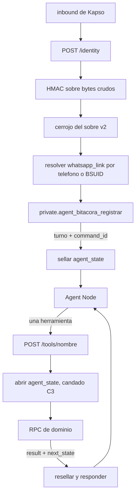

# 05 · Pseudocódigo: RPC, Edge Functions y adaptadores

Corte: 2026-09-02.

Este archivo es el **cómo se implementa**. Las cuatro RPC del MVP en pseudocódigo fiel, las dos
rutas del gateway, el pipeline de medios y los once adaptadores que ve el modelo.

**Qué no está aquí.** El producto y sus diecinueve reglas viven en `docs/01-producto.md` y se citan
**por número**. Los textos visibles viven en `docs/02-conversaciones-y-textos.md` y se citan **por
clave**; si una clave de aquí y la de allá difieren, **manda `02`**. El contrato de las once
herramientas —parámetros, `espera`, `cierra`, `pending_step`, avisos— vive en `docs/03-contratos.md`
y se cita **por sección**; si una firma de aquí y la de allá difieren, **manda `03`**. El workflow
de Kapso, el Agent Node y el prompt viven en `docs/04-workflow-y-prompt.md`. Las migraciones, el
registro de decisiones y los pendientes globales viven en `docs/06-implementacion-y-decisiones.md`.

**Esto es pseudocódigo, no una migración.** Los bloques marcados `PSEUDOCODIGO` siguen la
convención de `referencias/database_pseudocodigo/` (en `/home/user/Agenda-Psi-V2`): forma de SQL
real, identificadores reales, constraints reales, y cuerpos que **no se pegan en el SQL Editor**.
Los sitios donde falta trabajo llevan un marcador explícito. **No hay secretos, ni datos de
producción, ni conteos de la muestra que exista hoy.**

---

## Índice

- [Cómo leer este archivo](#cómo-leer-este-archivo)
- [Parte A · Las RPC](#parte-a--las-rpc)
  - [A.0 El esqueleto común de las once](#a0-el-esqueleto-común-de-las-once)
    - [A.0.1 Cabecera de seguridad y grants](#a01-cabecera-de-seguridad-y-grants)
    - [A.0.2 Los helpers privados que hacen falta](#a02-los-helpers-privados-que-hacen-falta)
    - [A.0.3 Resolver la identidad desde `whatsapp_link.id`](#a03-resolver-la-identidad-desde-whatsapp_linkid)
    - [A.0.4 El sobre de salida `{result, next_state}`](#a04-el-sobre-de-salida-result-next_state)
    - [A.0.5 Bloque R y bloque S: idempotencia contra `command_log`](#a05-bloque-r-y-bloque-s-idempotencia-contra-command_log)
    - [A.0.6 La composición del texto](#a06-la-composición-del-texto)
    - [A.0.7 El vocabulario de excepciones](#a07-el-vocabulario-de-excepciones)
  - [A.1 `agent_mis_citas`](#a1-agent_mis_citas)
  - [A.2 `agent_confirmar`](#a2-agent_confirmar)
  - [A.3 `agent_mandar_comprobante`](#a3-agent_mandar_comprobante)
  - [A.4 `agent_crisis`](#a4-agent_crisis)
  - [A.5 `agent_texto`, la duodécima](#a5-agent_texto-la-duodécima)
  - [A.6 Las otras siete, esbozadas](#a6-las-otras-siete-esbozadas)
- [Parte B · Las Edge Functions](#parte-b--las-edge-functions)
  - [B.1 Qué se reusa y qué se reescribe](#b1-qué-se-reusa-y-qué-se-reescribe)
  - [B.2 El `BASE_PATH` que nunca hace match](#b2-el-base_path-que-nunca-hace-match)
  - [B.3 El mapa de rutas final](#b3-el-mapa-de-rutas-final)
  - [B.4 `/identity`: atestación del mensaje entrante (C5)](#b4-identity-atestación-del-mensaje-entrante-c5)
  - [B.5 La bitácora append-only y la acuñación del `command_id` (C2, C5)](#b5-la-bitácora-append-only-y-la-acuñación-del-command_id-c2-c5)
  - [B.6 Sellado y apertura de `agent_state`](#b6-sellado-y-apertura-de-agent_state)
  - [B.7 `/tool`: la ruta de las once](#b7-tool-la-ruta-de-las-once)
  - [B.8 Los 16 KiB, y qué hacer cuando no caben](#b8-los-16-kib-y-qué-hacer-cuando-no-caben)
  - [B.9 Secretos por ruta y rotación](#b9-secretos-por-ruta-y-rotación)
  - [B.10 El pipeline de medios con 256 MB y 2 s de CPU](#b10-el-pipeline-de-medios-con-256-mb-y-2-s-de-cpu)
- [Parte C · Los adaptadores](#parte-c--los-adaptadores)
  - [C.1 La implementación compartida](#c1-la-implementación-compartida)
  - [C.2 El `body_template` y la sintaxis `{{...}}`](#c2-el-body_template-y-la-sintaxis-)
  - [C.3 Ficha por operación](#c3-ficha-por-operación)
  - [C.4 Cuándo NO se borra `agent_state`](#c4-cuándo-no-se-borra-agent_state)
- [Claves y variantes que este archivo pide dar de alta](#claves-y-variantes-que-este-archivo-pide-dar-de-alta)
- [Pendientes de este archivo](#pendientes-de-este-archivo)

---

## Cómo leer este archivo

**Ninguna de las once RPC existe.** `SELECT count(*) FROM pg_proc WHERE proname LIKE 'agent%'`
devuelve **0** *(comprobado 2026-09-02)*. No hay `confirm_appointment`, no hay
`attach_payment_proof`, no hay nada de crisis en el esquema. Las cuatro del MVP son **código nuevo**;
lo que se copia son tres patrones de funciones que sí están desplegadas:

| Qué se copia | De dónde | Para qué |
|---|---|---|
| Idempotencia con `command_log` | `public.credit_appointment_payment` | Las tres que mutan |
| Anclaje de propiedad y forma del path de Storage | `public.get_payment_proof_signing_receipt` | `agent_mandar_comprobante` |
| Sellos de cita y paridad de constraints | `public.cancel_appointment` | `agent_confirmar` |

**Y un patrón que NO se copia:** el traspaso de propiedad a `agenda_psi_agent_owner`
(`supabase/migrations/20260823235236_agent_whatsapp_foundation.sql:1071-1095`). **Ese rol ya no
existe** *(comprobado 2026-09-02)*; reintroducirlo es reconstruir el andamiaje que la migración
`20260828223432_retirar_andamio_agente_anterior` desmontó. Las once funciones se quedan con el
propietario del despliegue.

**Tres hechos de partida que cambian lo que se puede escribir:**

1. **La Edge Function `kapso_inbound_webhook` v32 llama una RPC que no existe.**
   `supabase.rpc('agent_register_inbound_context', ...)` (`kapso_inbound_webhook/index.ts:48`) apunta
   a una función retirada. Ese camino de entrada **está roto hoy**, aunque puede no manifestarse: si
   `AGENT_INBOUND_ENABLED` no vale `'true'`, el handler contesta `{ok:true,status:'disabled'}` antes
   de llegar a la RPC (`kapso_inbound_webhook/handler.ts:292-294`).
2. **`agent_tool_gateway` v35 está viva y vacía.** Tres rutas cableadas —`/tools/capabilities`,
   `/workflow/waiting`, `/workflow/complete`— llaman tres RPC que tampoco existen, así que responden
   `503`. Las otras 25 contestan `403 OPERATION_NOT_ENABLED`.
3. **`service_role` no tiene ningún privilegio sobre `public.whatsapp_inbound_messages`**
   *(`relacl = {postgres=arwdDxtm/postgres}`, comprobado 2026-09-02)*. La bitácora de C5 **no se
   puede escribir con un cliente `service_role`**: hace falta una función `SECURITY DEFINER` cuyo
   propietario sí tenga el privilegio. Ver [B.5](#b5-la-bitácora-append-only-y-la-acuñación-del-command_id-c2-c5).

---

## Parte A · Las RPC

### A.0 El esqueleto común de las once

#### A.0.1 Cabecera de seguridad y grants

Idéntica en las once, sin excepción:

```sql
-- PSEUDOCODIGO
CREATE FUNCTION public.agent_<nombre>(<parametros>)
RETURNS jsonb
LANGUAGE plpgsql
SECURITY DEFINER
SET search_path = ''
AS $agent_<nombre>$
  ...
$agent_<nombre>$;

-- El GRANT se aplica mientras el rol de la migracion todavia es dueno de la
-- funcion; la ACL sobrevive a cualquier traspaso posterior de propiedad.
-- (texto tomado de 20260823235236_agent_whatsapp_foundation.sql:1055-1070)
REVOKE ALL
  ON FUNCTION public.agent_<nombre>(<tipos>)
  FROM PUBLIC, anon, authenticated, service_role;

GRANT EXECUTE
  ON FUNCTION public.agent_<nombre>(<tipos>)
  TO service_role;
```

**Tres cosas que no son adorno.**

- **`SET search_path = ''` y toda referencia calificada.** Las **100** funciones de `public` en
  producción llevan `proconfig` con `search_path`, **sin una sola excepción**, y 99 de ellas son
  `SECURITY DEFINER` *(comprobado 2026-09-02)*. Eso
  obliga a escribir `public.appointments`, `private.hash_command_request`, `extensions.digest`,
  `pg_catalog.now()`. Una referencia sin calificar en una función `SECURITY DEFINER` es una
  escalada de privilegios esperando a que alguien cree un objeto homónimo.
- **`REVOKE` también a `service_role`, y después `GRANT`.** Revocar primero deja la ACL explícita en
  vez de heredada; es el texto literal de la migración citada. El resultado es el `proacl` de la
  familia «RPC de servidor»: `{postgres=X/postgres,service_role=X/postgres}`, igual que
  `claim_outbox_batch`, `finalize_outbox` y `get_payment_proof_signing_receipt`.
- **Nunca `authenticated`.** En producción hay 75 funciones `SECURITY DEFINER` ejecutables por
  `authenticated` y 4 por `anon` *(comprobado 2026-09-02)*. Una función del agente en ese grupo es
  una llave maestra multi-tenant: `authenticated` es cualquier profesional con sesión, y estas
  funciones reciben el tenant **como parámetro**, no derivado de Auth.

**Por qué reciben el tenant como parámetro y eso no es un descuido.** Las RPC de la app resuelven el
actor con `public.current_professional_id()` desde el JWT. El agente actúa **por la paciente**, que no
tiene JWT: `list_appointments`, `get_next_scheduled_appointment` y `get_patient_pending_payments`
devolverían `AUTH_REQUIRED` *(mapeo)*. El patrón es el documentado: **el gateway autentica, la
función recibe el tenant ya resuelto**, y por eso el `GRANT` a `service_role` es la única defensa que
queda. Perderlo es perderlo todo.

#### A.0.2 Los helpers privados que hacen falta

Uno ya existe. Los demás son nuevos y viven en el esquema `private`, que no está expuesto por
PostgREST.

| Helper | Estado | Qué hace |
|---|---|---|
| `private.hash_command_request(payload jsonb) RETURNS text` | **desplegado** | `sha256` hex sobre `jsonb_strip_nulls(payload)::text`. Se usa tal cual |
| `private.agent_resolver_vinculo(p_whatsapp_link_id uuid)` | nuevo | Devuelve el registro de identidad de [A.0.3](#a03-resolver-la-identidad-desde-whatsapp_linkid) |
| `private.agent_componer(p_clave text, p_huecos jsonb) RETURNS text` | nuevo | El catálogo de textos del servidor. [A.0.6](#a06-la-composición-del-texto) |
| `private.agent_fecha(p_instante timestamptz, p_tz text) RETURNS text` | nuevo | «miercoles 2 de septiembre» |
| `private.agent_hora(p_instante timestamptz, p_tz text) RETURNS text` | nuevo | «4:00» |
| `private.agent_zona(p_tz text) RETURNS text` | nuevo | La marca corta: «Hora CDMX» |
| `private.agent_monto(p_amount numeric) RETURNS text` | nuevo | «$800» |
| `private.agent_como_pagar(p_professional_id uuid) RETURNS text` | nuevo | Una de las dos frases fijas de `{como_pagar}` |
| `private.agent_apagar_confirmaciones(p_appointment_id uuid)` | nuevo | Cancela **sólo** las plantillas de confirmación encoladas |

**El último merece su párrafo, porque el helper que ya existe hace daño.**
`private.wa_apagar_avisos_de_cita(p_appointment_id)` está desplegado y cancela en `whatsapp_outbox`
cinco plantillas: las dos de confirmación **y las tres de recordatorio de una hora antes**
*(comprobado 2026-09-02)*. Lo usa el trigger `appointments_apagar_avisos_au`, que sólo dispara
cuando la cita **deja de estar `scheduled`**, y ahí cancelar el recordatorio es correcto.

**`agent_confirmar` no puede llamarlo.** Confirmar no saca la cita de `scheduled`, y el recordatorio
de una hora antes es **el único mensaje que lleva la liga de la sesión en línea**
(`docs/02-conversaciones-y-textos.md` §A.8). Cancelarlo al confirmar deja a la paciente confirmada y
sin liga. Por eso el helper nuevo:

```sql
-- PSEUDOCODIGO · private.agent_apagar_confirmaciones(p_appointment_id uuid)
-- Cancela SOLO las dos plantillas de confirmacion. NO toca los tres
-- recordatorios de una hora antes: uno de ellos lleva la liga de la sesion.
UPDATE public.whatsapp_outbox
   SET cancelled = true, status_updated_at = pg_catalog.now()
 WHERE payload ->> 'appointment_id' = p_appointment_id::text
   AND status IN ('queued'::public.outbox_status, 'processing'::public.outbox_status)
   AND NOT cancelled
   AND template_key IN (
     'appointment_confirmation_request',
     'appointment_confirmation_prepay'
   );
```

#### A.0.3 Resolver la identidad desde `whatsapp_link.id`

**Siempre desde `whatsapp_link.id`, nunca desde un `p_patient_id` suelto** (regla 17,
`docs/03-contratos.md` §1.6). La fila ya nombra la pareja: `whatsapp_links.patient_id` y
`whatsapp_links.professional_id` son `NOT NULL`, y `whatsapp_links_patient_id_key` es
`UNIQUE (patient_id)` *(comprobado 2026-09-02)*. Un `patient_id` que viniera aparte sería un
identificador **afirmado por el llamador**, que es exactamente el defecto que C5 corrige en el borde.

```sql
-- PSEUDOCODIGO · private.agent_resolver_vinculo(p_whatsapp_link_id uuid)
-- RETURNS TABLE (link_id, patient_id, professional_id, patient_status,
--                paciente text, paciente_apellido text, profesional text,
--                tz text, office_address text)
SELECT wl.id,
       wl.patient_id,
       wl.professional_id,
       pa.patient_status,
       pa.first_name,
       pa.last_name,
       pr.first_name,
       pr.timezone,
       pr.office_address
  FROM public.whatsapp_links wl
  JOIN public.patients      pa ON pa.id = wl.patient_id
                              AND pa.professional_id = wl.professional_id
  JOIN public.professionals pr ON pr.id = wl.professional_id
 WHERE wl.id = p_whatsapp_link_id;
-- Si no hay fila: RAISE '42501' / 'AGENT_LINK_NOT_FOUND'.
-- El JOIN con patients cruzando professional_id no es redundante: comprueba
-- que la pareja del vinculo sigue siendo la pareja del expediente.
```

**El cerrojo de actividad, idéntico en las cuatro salvo `crisis`:**

```sql
IF v_vinculo.patient_status <> 'active'::public.patient_status THEN
  RETURN private.agent_sobre(
    jsonb_build_object(
      'texto',  private.agent_componer('paciente_inactivo', <huecos>),
      'espera', NULL, 'hecho', false, 'cierra', true),
    jsonb_build_object('desenlace', 'paciente_inactivo'));
END IF;
```

**Es un cerrojo, no el camino normal.** El workflow ya separó `not_patient` de `inactive_patient`
antes del Agent Node (`docs/04-workflow-y-prompt.md`); esto existe por si la relación cambia a mitad
de una ejecución. **Devuelve un resultado, no una excepción:** el contrato no tiene campo de error, y
un «no se puede» del negocio es un `texto` con `hecho: false` (`docs/03-contratos.md` §1.2).

**`consent_status` no se consulta en ninguna de las cuatro.** Es decisión explícita con su motivo y
su riesgo en `docs/01-producto.md` §3.5. La base la respalda: el default es `'pending'`, así que toda
paciente nueva nace ahí, y **ninguna función desplegada lo usa como condición**
*(comprobado 2026-09-02)*. Ignorarlo documenta el comportamiento que ya es el de facto.

#### A.0.4 El sobre de salida `{result, next_state}`

Las once devuelven lo mismo (`docs/03-contratos.md` §1.3). `result` son las cuatro claves que salen
hacia el modelo; `next_state` **no sale de Supabase en claro**: el gateway lo sella.

```sql
-- PSEUDOCODIGO · private.agent_sobre(p_result jsonb, p_next_state jsonb) RETURNS jsonb
SELECT jsonb_build_object(
  'result',     p_result,      -- {texto, espera, hecho, cierra}
  'next_state', p_next_state   -- {desenlace, pending_step, allowed_next_tools,
);                             --  options, subject, file_id, ...}
```

**`next_state` lleva siempre `desenlace`, y esto no está en `03`.** Es la clave del texto que se
compuso —`confirmar_cierre`, `comprobante_pedido`, `mis_citas_lista`—. El gateway la necesita para
tres cosas: decidir si borra `agent_state` ([C.4](#c4-cuándo-no-se-borra-agent_state)), escribirla en
la bitácora, y comprobar la coherencia entre `cierra` y el inventario de salidas abiertas. Va dentro
de `next_state` porque `docs/03-contratos.md` §1.3 enumera el **contenido lógico** de ese campo sin
cerrarlo, y porque **no puede salir hacia el modelo**: es un nombre interno.

**Cuando no hay paso abierto, `next_state` es `{"desenlace": "..."}` y nada más.** No se manda
`{"pending_step": null}`: una clave presente con nulo y una clave ausente se distinguen mal en el
borde, y el gateway decide sobre presencia.

#### A.0.5 Bloque R y bloque S: idempotencia contra `command_log`

Copiado literal de `public.credit_appointment_payment`, cambiando tres valores. **Se escribe aquí una
sola vez y las tres RPC que mutan lo nombran**: repetirlo tres veces invita a que una copia se quede
atrás.

| Columna | Valor para el agente | Verificación |
|---|---|---|
| `scope_type` | `'whatsapp_agent'` | `text` libre. Las filas existentes son todas `'professional'` |
| `scope_id` | `whatsapp_link.id` | `uuid`, único por paciente |
| `command_id` | El que acuñó el gateway ([B.5](#b5-la-bitácora-append-only-y-la-acuñación-del-command_id-c2-c5)) | — |
| `command_type` | El nombre de la RPC | — |
| `request_hash` | `private.hash_command_request(<payload canonico>)` | Desplegada |
| `actor` | `'patient'` | El enum `actor_type` lo admite |

`pk_command_log` es `PRIMARY KEY (scope_type, scope_id, command_id)` *(comprobado 2026-09-02)*, así
que el espacio del agente queda aislado del de la app sin colisión posible.

> **Trampa verificada.** `actor_type` admite `'patient'`, pero **ninguna función desplegada lo
> escribe**: hoy sólo hay `system` y `professional` *(mapeo)*. Estas RPC son las primeras. El enum lo
> acepta, pero ninguna pantalla ni reporte existente ha visto nunca ese valor.

```sql
-- ==========================================================================
-- BLOQUE R · reclamo. Es el PRIMER efecto de cualquier rama que muta.
-- Parametros del sitio de llamada: <command_type> y <payload del hash>.
-- ==========================================================================
  IF p_command_id IS NULL THEN
    RAISE EXCEPTION USING errcode = '22004', message = 'COMMAND_ID_REQUIRED';
  END IF;

  v_request_hash := private.hash_command_request(<payload del hash>);

  INSERT INTO public.command_log
    (scope_type, scope_id, command_id, command_type, request_hash, actor)
  VALUES
    ('whatsapp_agent', v_vinculo.link_id, p_command_id,
     '<command_type>', v_request_hash, 'patient')
  ON CONFLICT (scope_type, scope_id, command_id) DO NOTHING;
  GET DIAGNOSTICS v_rows = ROW_COUNT;

  IF v_rows = 0 THEN
    SELECT * INTO v_existing
      FROM public.command_log
     WHERE scope_type = 'whatsapp_agent'
       AND scope_id   = v_vinculo.link_id
       AND command_id = p_command_id
     FOR UPDATE;
    IF v_existing.command_type IS DISTINCT FROM '<command_type>'
       OR v_existing.request_hash IS DISTINCT FROM v_request_hash THEN
      RAISE EXCEPTION USING errcode = '23505', message = 'COMMAND_PAYLOAD_MISMATCH';
    END IF;
    IF v_existing.completed_at IS NULL THEN
      RAISE EXCEPTION USING errcode = 'P0001', message = 'COMMAND_IN_PROGRESS';
    END IF;
    -- Reintento exacto: se devuelve el SOBRE COMPLETO ya guardado, con su texto
    -- ya redactado. No se recompone nada.
    RETURN v_existing.result;
  END IF;

-- ==========================================================================
-- BLOQUE S · sello. Ultimas lineas, despues de mutar y de escribir el aviso.
-- ==========================================================================
  v_sobre := private.agent_sobre(v_result, v_next_state);

  UPDATE public.command_log
     SET result = v_sobre, completed_at = pg_catalog.now()
   WHERE scope_type = 'whatsapp_agent'
     AND scope_id   = v_vinculo.link_id
     AND command_id = p_command_id;

  RETURN v_sobre;
```

**Lo que se guarda en `command_log.result` es el sobre completo, no sólo las cuatro claves.** Con el
texto viajando de vuelta al modelo esto deja de ser un detalle: sin él, un reintento tendría que
recomponer el texto y podría componer otro —otra hora, otro monto— para el mismo `command_id`
(`docs/03-contratos.md` §1.9).

**Dos precisiones sobre el orden, porque aquí se desvía de `credit_appointment_payment`.**

1. **El reclamo va antes de escribir, no antes de leer.** `credit_appointment_payment` reclama en la
   primera línea porque siempre muta. `agent_confirmar` y `agent_mandar_comprobante` **no saben si
   van a mutar hasta que leen las candidatas**: la llamada que sólo lista no debe quemar el
   `command_id` del turno, o la escritura siguiente chocaría con `COMMAND_PAYLOAD_MISMATCH` contra
   su propia lectura (`docs/03-contratos.md` §1.9). Así que leen sin bloquear, deciden la rama, y
   **si van a mutar** ejecutan el bloque R y **vuelven a leer con `FOR UPDATE`**. El reclamo sigue
   siendo el primer efecto: entre él y la escritura no hay ninguna mutación.
2. **El `request_hash` no incluye el `pending_step`.** `docs/03-contratos.md` §1.9 lo menciona, pero
   las firmas que ese mismo archivo fija en §3 **no traen el paso**. Quien lo hace cumplir es el
   gateway (C3, §2.4). El hash cubre los argumentos ya resueltos, y eso basta para lo que el hash
   protege: que dos peticiones distintas no compartan `command_id`. **Riesgo aceptado:** si el
   gateway autorizara mal un paso, el hash no lo atraparía. Se compensa con la prueba de conformidad
   de `docs/06-implementacion-y-decisiones.md`.

#### A.0.6 La composición del texto

**La RPC compone el texto final.** Ésa es la pieza central de la arquitectura: la fidelidad del
precio, la fecha y el monto se decide aquí, y el modelo sólo copia (`docs/03-contratos.md` §1.2).

**Dónde viven las plantillas: decisión.** `private.agent_componer(p_clave, p_huecos)` las lleva
**literales en su cuerpo**, no en una tabla.

- **Motivo.** Una tabla de catálogo necesita migración, semilla, RLS y una lectura más por turno, y
  deja el texto y la función que lo usa en dos artefactos que se despliegan por separado. El cuerpo
  de una función se versiona con la migración que la crea, y no hay ninguna tabla de textos del
  servidor en el esquema: lo más cercano es `private.app_settings` *(mapeo)*.
- **Riesgo.** `docs/02-conversaciones-y-textos.md` sigue siendo el dueño de la redacción, y **nada
  comprueba automáticamente que el cuerpo de la función y ese archivo digan lo mismo**. La
  mitigación es la prueba de conformidad: clave por clave, el texto compuesto contra el del archivo.
  Va en `docs/06-implementacion-y-decisiones.md`.
- **Alternativa descartada, y por qué se anota:** meter las plantillas en el prompt. Es lo que hacía
  el diseño anterior y es justo lo que C4 corrige para `crisis` —un texto con un 911 adentro no puede
  depender de que el tier más barato lo transcriba—.

**Cuatro reglas de formato, decididas aquí porque nadie más las decide:**

1. **Los nombres de día y de mes salen de un arreglo constante en el helper, no de `to_char`.**
   `to_char(..., 'TMDay')` depende de `lc_time`, que es un ajuste del servidor que nadie de este
   proyecto controla y que además cambia entre entornos. Un arreglo constante es determinista.
2. **La proyección a zona local se hace con `professionals.timezone`**, columna `NOT NULL`
   *(comprobado 2026-09-02)*, nunca con la zona del teléfono ni con la del servidor (regla 19).
   `appointments.starts_at` es `timestamptz` y no duplica zona.
3. **La marca `{zona}` la pega el helper, no la plantilla.** Va en el encabezado dentro de las listas
   de horas y como última línea sola en los demás; **no va en ningún texto sin hora**
   (`docs/02-conversaciones-y-textos.md` §A.3). El helper recibe un booleano `p_lleva_zona` que la
   plantilla declara.
4. **El instante crudo va al `payload` de `notifications` sin formatear.** Verificado: el
   `timestamptz` de Postgres serializado a `jsonb` ya rinde con huso (`+00:00`) y cumple el regex de
   los dos consumidores —`_parseOffsetInstant` en `notification_models.dart:288-294` y `instante()`
   en `notificar-push`—. Formatearlo a mano rompe la tarjeta.

**El tope de 1000 caracteres se comprueba dos veces.** La RPC lo comprueba antes de devolver:

```sql
IF pg_catalog.length(v_texto) > 1000 THEN
  RAISE EXCEPTION USING errcode = 'P0001', message = 'TEXT_TOO_LONG';
END IF;
```

El gateway lo vuelve a comprobar (`docs/03-contratos.md` §1.3). Que la RPC falle primero importa:
así el fallo tiene el `command_id` y la clave del desenlace al lado, y no aparece como un `503`
opaco en el borde.

#### A.0.7 El vocabulario de excepciones

**Un «no se puede» del negocio nunca es una excepción**: es un `texto` con `hecho: false`. Las
excepciones son sólo para lo que el modelo no puede arreglar hablando.

| `errcode` | `message` | Cuándo | Qué hace el gateway |
|---|---|---|---|
| `42501` | `AGENT_LINK_NOT_FOUND` | El `whatsapp_link.id` no resuelve | `no_pude_ahorita`, y a la bitácora como incidente |
| `22004` | `COMMAND_ID_REQUIRED` | Rama que muta sin `command_id` | `no_pude_ahorita`. Es un defecto del gateway |
| `23505` | `COMMAND_PAYLOAD_MISMATCH` | Mismo `command_id`, otros argumentos | `no_pude_ahorita` |
| `P0001` | `COMMAND_IN_PROGRESS` | El comando gemelo sigue en vuelo | **`no_se_si_quedo`**, que cierra |
| `P0001` | `TEXT_TOO_LONG` | La composición se pasó de 1000 | `no_pude_ahorita` |

**`COMMAND_IN_PROGRESS` es el único que no se puede contestar con «no pude».** Significa que hay una
transacción viva con ese mismo `command_id`: puede haber escrito. Decir «no pude» invita a repetir y
duplicar; decir «listo» miente. `no_se_si_quedo` es exactamente el texto que existe para eso, y su
resultado lleva `hecho: false` aunque la escritura haya ocurrido, porque `hecho` significa «la
escritura quedó **confirmada**» (`docs/02-conversaciones-y-textos.md` §A.6).

**Hay un canal más, ya establecido en el proyecto:** `RAISE` con `SQLSTATE '22000'` y un `MESSAGE`
exacto sube distinto del `503` genérico —`isReplayMismatch` lo usa para `REPLAY_MISMATCH`
(`kapso_inbound_webhook/handler.ts:178-181`)—. **Las cuatro del MVP no lo necesitan** y no lo usan;
se anota para que quien implemente Fase 2 sepa que existe.

---

### A.1 `agent_mis_citas`

```sql
-- =============================================================================
-- agent_mis_citas  (AGENDA PSI / agente de WhatsApp)  — PSEUDOCODIGO
-- -----------------------------------------------------------------------------
-- QUE HACE
--   Contesta las tres preguntas de la misma familia: que citas tengo, donde es,
--   y cuanto debo. Es la unica de las cuatro que NO muta y NO toca command_log.
--
-- QUIEN LA LLAMA
--   Solo agent_tool_gateway con service_role, ruta POST /tools/mis_citas.
--   Recibe el tenant ya resuelto (whatsapp_link.id); no usa
--   current_professional_id(), que devolveria NULL sin JWT de profesional.
--
-- TABLAS QUE TOCA (todas SELECT, ningun bloqueo)
--   public.whatsapp_links, public.patients, public.professionals,
--   public.appointments, public.services, public.payments, public.payment_proofs
--
-- NO REUSA list_appointments: su ACL es {postgres, authenticated} y resuelve el
--   actor por el camino de la app (mapeo). Se copia su forma de proyeccion, no
--   su resolucion de actor.
-- =============================================================================

CREATE FUNCTION public.agent_mis_citas(
  p_whatsapp_link_id uuid,
  p_sobre            text DEFAULT 'citas'   -- 'citas' | 'donde' | 'adeudos'
)
RETURNS jsonb
LANGUAGE plpgsql
SECURITY DEFINER
SET search_path = ''
AS $agent_mis_citas$
DECLARE
  v_vinculo    record;
  v_now        timestamptz := pg_catalog.now();
  v_citas      jsonb;
  v_adeudos    jsonb;
  v_n_citas    integer;
  v_n_adeudos  integer;
  v_clave      text;
  v_texto      text;
BEGIN
  -- 1) IDENTIDAD Y ACTIVIDAD. Cerrojo de A.0.3, sin excepciones.
  v_vinculo := private.agent_resolver_vinculo(p_whatsapp_link_id);
  IF v_vinculo.patient_status <> 'active'::public.patient_status THEN
    RETURN <sobre paciente_inactivo, ver A.0.3>;
  END IF;

  -- 2) p_sobre es un enum cerrado de tres. El gateway ya lo valido; aqui se
  --    vuelve a acotar porque la RPC no confia en su llamador.
  IF p_sobre IS NULL OR p_sobre NOT IN ('citas','donde','adeudos') THEN
    p_sobre := 'citas';
  END IF;

  --------------------------------------------------------------------------
  -- 3) CITAS. Futuras, programadas, de la pareja. De una serie solo la mas
  --    proxima (regla 7). Maximo cinco.
  --    DISTINCT ON sobre COALESCE(series_id, id): una cita suelta es su propio
  --    grupo, una de serie comparte grupo con sus hermanas.
  --------------------------------------------------------------------------
  WITH candidatas AS (
    SELECT DISTINCT ON (COALESCE(a.series_id, a.id))
           a.id, a.starts_at, a.ends_at, a.modality, a.service_id,
           a.confirmed_at, a.series_id
      FROM public.appointments a
     WHERE a.patient_id      = v_vinculo.patient_id
       AND a.professional_id = v_vinculo.professional_id
       AND a.status          = 'scheduled'::public.appointment_status
       AND a.starts_at       > v_now
     ORDER BY COALESCE(a.series_id, a.id), a.starts_at
  )
  SELECT jsonb_agg(x ORDER BY x.starts_at), count(*)
    INTO v_citas, v_n_citas
    FROM (
      SELECT c.*, s.name AS servicio
        FROM candidatas c
        JOIN public.services s ON s.id = c.service_id
                              AND s.professional_id = v_vinculo.professional_id
       ORDER BY c.starts_at
       LIMIT 5
    ) x;

  --------------------------------------------------------------------------
  -- 4) ADEUDOS. Cobros pendientes con monto, de citas de esta pareja.
  --    Se parten en dos grupos porque significan cosas distintas:
  --      (a) sin comprobante pegado  -> se le puede pedir que transfiera;
  --      (b) con comprobante pegado  -> ya mando algo, esta en revision.
  --    Confundirlos produce un "mandame el comprobante" sobre un cobro que ya
  --    lo tiene, que es el error que mas rapido le ensena que nadie lee.
  --------------------------------------------------------------------------
  SELECT jsonb_agg(y ORDER BY y.starts_at), count(*)
    INTO v_adeudos, v_n_adeudos
    FROM (
      SELECT DISTINCT ON (COALESCE(a.series_id, a.id))
             p.id AS payment_id, p.amount, a.starts_at,
             EXISTS (SELECT 1 FROM public.payment_proofs pp
                      WHERE pp.payment_id = p.id) AS tiene_comprobante
        FROM public.payments p
        JOIN public.appointments a ON a.id = p.appointment_id
       WHERE p.professional_id = v_vinculo.professional_id
         AND a.patient_id      = v_vinculo.patient_id
         AND p.status          = 'pending'::public.payment_status
         AND p.amount          > 0
       ORDER BY COALESCE(a.series_id, a.id), a.starts_at
    ) y;

  --------------------------------------------------------------------------
  -- 5) DESENLACE. Ocho renglones (docs/03-contratos.md §3.1). El unico eje que
  --    ramifica es p_sobre; los datos se resuelven igual en los tres casos.
  --------------------------------------------------------------------------
  v_clave := CASE
    WHEN p_sobre = 'adeudos' AND v_n_adeudos = 0 THEN 'mis_citas_sin_adeudos'
    WHEN p_sobre = 'adeudos'                     THEN 'mis_citas_adeudos'
    WHEN v_n_citas = 0                           THEN 'mis_citas_sin_citas'
    WHEN p_sobre = 'donde' AND v_n_citas = 1
         AND <la unica es 'in_person'>           THEN 'mis_citas_donde_presencial'
    WHEN p_sobre = 'donde' AND v_n_citas = 1     THEN 'mis_citas_donde_en_linea'
    WHEN v_n_citas = 1                           THEN 'mis_citas_una'
    ELSE                                              'mis_citas_lista'
  END;
  -- 'donde' con VARIAS citas cae en mis_citas_lista con el lugar en cada
  -- renglon. No se pregunta cual: la respuesta cabe entera, y preguntar para
  -- despues contestar lo mismo cuesta un mensaje y una vuelta.

  -- 6) COMPOSICION. Los huecos salen de v_citas / v_adeudos / v_vinculo.
  --    mis_citas_donde_presencial cambia SOLO su segunda frase cuando
  --    professionals.office_address es NULL. No se inventa una direccion.
  v_texto := private.agent_componer(v_clave, jsonb_build_object(
    'paciente',    v_vinculo.paciente,
    'profesional', v_vinculo.profesional,
    'lista',       <renglones formateados desde v_citas o v_adeudos>,
    'direccion',   v_vinculo.office_address,
    'zona',        private.agent_zona(v_vinculo.tz)));

  --------------------------------------------------------------------------
  -- 7) SALIDA. Siempre {NULL, false, true}. No abre paso, no toma command_id,
  --    no toca notifications. Es el caso mas simple de las once.
  --------------------------------------------------------------------------
  RETURN private.agent_sobre(
    jsonb_build_object('texto', v_texto, 'espera', NULL,
                       'hecho', false,   'cierra', true),
    jsonb_build_object('desenlace', v_clave));
END;
$agent_mis_citas$;
```

**Firma exacta y grants**

```sql
public.agent_mis_citas(p_whatsapp_link_id uuid, p_sobre text DEFAULT 'citas') RETURNS jsonb
REVOKE ALL ON FUNCTION public.agent_mis_citas(uuid, text) FROM PUBLIC, anon, authenticated, service_role;
GRANT EXECUTE ON FUNCTION public.agent_mis_citas(uuid, text) TO service_role;
```

**Autorización.** Vínculo, actividad y pareja. Nada más: no hay cita ni cobro que anclar porque no
recibe ninguno. Las FK compuestas `appointments_patient_id_professional_id_fkey` y
`payments_appointment_id_professional_id_fkey` ya impiden escribir cruzado, pero la proyección
comprueba la pareja igual, **porque una FK impide escribir mal, no leer de más**.

**Bloqueos.** Ninguno. Es lectura pura y no debe serializar contra nada: mientras contesta, la
profesional puede estar moviendo la agenda desde su app, y eso es correcto.

**Mutación.** Ninguna. **Aviso a la profesional.** Ninguno. **`command_log`.** No lo toca: una
lectura es idempotente por naturaleza, y meterle una fila quemaría el `command_id` del turno
(`docs/03-contratos.md` §1.9).

**`next_state`.** Sólo `desenlace`. **Ningún renglón de `mis_citas` abre paso**
(`docs/03-contratos.md` §2.3), y por eso el gateway lo acepta siempre, con paso abierto o sin él, y
**vuelve a sellar el estado anterior sin tocarlo** (§2.4, regla 4). La paciente puede preguntar «¿qué
tengo?» a media gestión y después contestar «la 1» a la pregunta anterior.

> **Divergencia declarada, y no la resuelve este archivo.**
> `docs/02-conversaciones-y-textos.md` §A.8 describe un `mis_citas` que **sí abre paso** cuando
> ofrece algo —`espera: "cita"`, `cierra: false`, `allowed_next_tools` con herramienta por
> defecto—. `docs/03-contratos.md` §3.1 y §2.3 dicen lo contrario: los ocho renglones cierran y
> ninguno abre paso. **Este pseudocódigo implementa `03`, que es el dueño del contrato**, y la
> diferencia queda en [Pendientes](#pendientes-de-este-archivo) para que se resuelva en un solo
> sitio. Implementarla mal en cualquiera de los dos sentidos cuesta: con `03`, un «la 2» después de
> `mis_citas` cae en `no_se_de_cual_lista`; con `02`, hay un paso abierto que ninguna de las cuatro
> del MVP produjo.

**Errores del negocio.** Ninguno. O hay citas, o no las hay. Es la herramienta que no puede fallar.

---

### A.2 `agent_confirmar`

```sql
-- =============================================================================
-- agent_confirmar  (AGENDA PSI / agente de WhatsApp)  — PSEUDOCODIGO
-- -----------------------------------------------------------------------------
-- QUE HACE
--   Dos ramas en una funcion:
--     (a) p_appointment_ids NULL  -> LISTA las candidatas. No muta, no reclama.
--     (b) p_appointment_ids dados -> CONFIRMA las que se pueden, pide
--         comprobante de las de prepago sin archivo. Muta y reclama.
--
-- QUIEN LA LLAMA
--   Solo agent_tool_gateway, POST /tools/confirmar. El gateway resuelve las
--   POSICIONES (citas:[1,2] o "todas") contra las options del estado sellado y
--   pasa UUID. La RPC nunca recibe una posicion.
--
-- TABLAS QUE TOCA
--   SELECT ... FOR UPDATE  public.appointments
--   SELECT                 public.payments, public.payment_proofs, public.services
--   UPDATE                 public.appointments (confirmacion), public.whatsapp_outbox
--   INSERT                 public.command_log, public.notifications
--
-- INVARIANTES DE BASE QUE MANDAN SOBRE ESTA FUNCION (comprobados 2026-09-02)
--   chk_appointment_confirmation_parity:
--     ((confirmed_at IS NULL) = (confirmation_source IS NULL))
--   chk_appointment_confirmed_not_editable:
--     ((confirmed_at IS NULL) OR (is_editable = false))
--   -> confirmed_at, confirmation_source e is_editable se escriben en el MISMO
--      SET. Escribir uno sin el otro no falla en la revision: falla en la base,
--      DESPUES de haber tomado el command_id.
--   chk_appointment_patient_booking_origin no aplica: solo muerde cuando
--     confirmation_source='patient_booking', y aqui es 'patient_response'.
--   'patient_response' existe en el enum y NINGUNA funcion desplegada lo
--     escribe: esta libre y reservado para esta RPC.
-- =============================================================================

CREATE FUNCTION public.agent_confirmar(
  p_whatsapp_link_id uuid,
  p_command_id       uuid   DEFAULT NULL,
  p_appointment_ids  uuid[] DEFAULT NULL
)
RETURNS jsonb
LANGUAGE plpgsql
SECURITY DEFINER
SET search_path = ''
AS $agent_confirmar$
DECLARE
  v_vinculo       record;
  v_now           timestamptz := pg_catalog.now();
  v_ids           uuid[];
  v_candidatas    jsonb;
  v_n             integer;
  v_appt          public.appointments%ROWTYPE;
  v_pay           public.payments%ROWTYPE;
  v_prepago       boolean;
  v_confirmadas   uuid[] := ARRAY[]::uuid[];
  v_por_pagar     uuid[] := ARRAY[]::uuid[];
  v_carrera       text   := NULL;   -- 'ya_no_esta' | 'ya_paso' | NULL
  v_request_hash  text;
  v_rows          integer;
  v_existing      public.command_log%ROWTYPE;
  v_clave         text;
  v_texto         text;
  v_result        jsonb;
  v_next_state    jsonb;
  v_sobre         jsonb;
BEGIN
  -- 1) IDENTIDAD Y ACTIVIDAD (A.0.3).
  v_vinculo := private.agent_resolver_vinculo(p_whatsapp_link_id);
  IF v_vinculo.patient_status <> 'active'::public.patient_status THEN
    RETURN <sobre paciente_inactivo>;
  END IF;

  --------------------------------------------------------------------------
  -- 2) CANDIDATAS. Solo futuras, solo NO confirmadas, de una serie solo la mas
  --    proxima, maximo cinco. Una cita ya confirmada NO ENTRA en el conjunto, y
  --    por eso no hace falta un desenlace para "ya estaba confirmada".
  --    Lectura sin bloqueo: todavia no se sabe si esta llamada muta.
  --------------------------------------------------------------------------
  WITH candidatas AS (
    SELECT DISTINCT ON (COALESCE(a.series_id, a.id))
           a.id, a.starts_at, a.ends_at, a.modality
      FROM public.appointments a
     WHERE a.patient_id      = v_vinculo.patient_id
       AND a.professional_id = v_vinculo.professional_id
       AND a.status          = 'scheduled'::public.appointment_status
       AND a.starts_at       > v_now
       AND a.confirmed_at IS NULL
     ORDER BY COALESCE(a.series_id, a.id), a.starts_at
  )
  SELECT jsonb_agg(c ORDER BY c.starts_at), count(*)
    INTO v_candidatas, v_n
    FROM (SELECT * FROM candidatas ORDER BY starts_at LIMIT 5) c;

  --------------------------------------------------------------------------
  -- 3) RAMA (a): LISTAR. Ninguna candidata, o varias y ella no eligio.
  --    NO reclama command_log: quemar aqui el command_id del turno haria que la
  --    escritura siguiente chocara con COMMAND_PAYLOAD_MISMATCH contra su
  --    propia lectura (docs/03-contratos.md §1.9).
  --------------------------------------------------------------------------
  IF v_n = 0 THEN
    -- Dos valores del mismo texto: con proxima cita confirmada, y sin ninguna.
    RETURN private.agent_sobre(
      jsonb_build_object(
        'texto',  private.agent_componer('confirmar_nada_que_confirmar', <huecos>),
        'espera', NULL, 'hecho', false, 'cierra', true),
      jsonb_build_object('desenlace', 'confirmar_nada_que_confirmar'));
  END IF;

  IF p_appointment_ids IS NULL AND v_n > 1 THEN
    -- Con varias esperando SIEMPRE se pregunta cual. Nunca se asume, ni por la
    -- ultima plantilla ni por la mas proxima: confirmar la equivocada la deja
    -- creyendo que aviso de una sesion a la que no va a ir.
    RETURN private.agent_sobre(
      jsonb_build_object(
        'texto',  private.agent_componer('confirmar_lista', <lista + zona>),
        'espera', 'citas', 'hecho', false, 'cierra', false),
      jsonb_build_object(
        'desenlace',          'confirmar_lista',
        'pending_step',       'elegir_citas',
        'allowed_next_tools', jsonb_build_array('confirmar'),
        'options',            <las v_n citas, con id interno y etiqueta visible>));
  END IF;

  --------------------------------------------------------------------------
  -- 4) RAMA (b): MUTAR. O ella eligio, o hay exactamente una candidata.
  --    v_ids se ordena para que [2,1] y [1,2] produzcan el MISMO request_hash.
  --------------------------------------------------------------------------
  v_ids := COALESCE(
    ARRAY(SELECT DISTINCT u FROM unnest(p_appointment_ids) AS u ORDER BY u),
    ARRAY(SELECT (c ->> 'id')::uuid FROM jsonb_array_elements(v_candidatas) c));

  -- Un identificador que no este entre las candidatas invalida la llamada
  -- ENTERA: no se confirma ninguna y se reemite la lista. Aceptar unas y
  -- descartar otras confirmaria una sesion sobre un mensaje que el servidor no
  -- entendio completo, y ese dano no tiene arreglo por conversacion.
  IF EXISTS (SELECT 1 FROM unnest(v_ids) AS u
              WHERE u NOT IN (SELECT (c ->> 'id')::uuid
                                FROM jsonb_array_elements(v_candidatas) c)) THEN
    RETURN <sobre confirmar_lista, igual que el paso 3>;
  END IF;

  -- BLOQUE R (A.0.5) con:
  --   <command_type>   = 'agent_confirmar'
  --   <payload hash>   = jsonb_build_object(
  --                        'whatsapp_link_id', p_whatsapp_link_id,
  --                        'appointment_ids',  to_jsonb(v_ids))
  <bloque R>

  --------------------------------------------------------------------------
  -- 5) POR CADA CITA: bloquear, RELEER, decidir y escribir.
  --    Se relee dentro de la misma transaccion (regla 16): entre la lista y la
  --    escritura pasan dos mensajes de ella, y en ese rato la profesional pudo
  --    mover todo desde su app.
  --------------------------------------------------------------------------
  FOREACH v_id IN ARRAY v_ids LOOP

    SELECT * INTO v_appt
      FROM public.appointments
     WHERE id = v_id
       AND patient_id      = v_vinculo.patient_id
       AND professional_id = v_vinculo.professional_id
     FOR UPDATE;

    IF NOT FOUND OR v_appt.status <> 'scheduled'::public.appointment_status THEN
      v_carrera := 'ya_no_esta';   CONTINUE;
    END IF;
    IF v_appt.starts_at <= v_now THEN
      v_carrera := 'ya_paso';      CONTINUE;
    END IF;
    IF v_appt.confirmed_at IS NOT NULL THEN
      CONTINUE;                    -- se confirmo sola entre la lista y aqui
    END IF;

    ----------------------------------------------------------------------
    -- 5.1) PREPAGO. El snapshot del cobro vive en payments.charge_timing,
    --      no en la politica de la profesional: la politica puede haber
    --      cambiado desde que se creo la cita.
    --      payments_appointment_id_key es UNIQUE (appointment_id), asi que la
    --      cadena cita -> cobro es uno a uno y sin ambiguedad.
    ----------------------------------------------------------------------
    SELECT * INTO v_pay
      FROM public.payments
     WHERE appointment_id = v_appt.id
       AND professional_id = v_vinculo.professional_id
     FOR UPDATE;

    v_prepago := FOUND
             AND v_pay.status = 'pending'::public.payment_status
             AND v_pay.amount > 0
             AND v_pay.charge_timing = 'before'::public.charge_timing
             AND NOT EXISTS (SELECT 1 FROM public.payment_proofs pp
                              WHERE pp.payment_id = v_pay.id);

    IF v_prepago THEN
      -- Con prepago, decir "si voy" NO confirma. Lo que confirma es el archivo.
      -- Esta cita NO se muta: se acumula para pedir su comprobante.
      v_por_pagar := v_por_pagar || v_appt.id;
      CONTINUE;
    END IF;

    ----------------------------------------------------------------------
    -- 5.2) CONFIRMAR. Los tres campos en el MISMO SET, por los dos CHECK.
    --      El WHERE repite las condiciones para que el rowcount sea la prueba:
    --      si otra transaccion se adelanto, v_rows sale 0 y no se finge exito.
    ----------------------------------------------------------------------
    UPDATE public.appointments
       SET confirmed_at        = v_now,
           confirmation_source = 'patient_response'::public.appointment_confirmation_source,
           is_editable         = false,
           updated_at          = v_now
     WHERE id = v_appt.id
       AND status       = 'scheduled'::public.appointment_status
       AND confirmed_at IS NULL
     RETURNING * INTO v_appt;
    GET DIAGNOSTICS v_rows = ROW_COUNT;
    IF v_rows <> 1 THEN
      v_carrera := 'ya_no_esta';   CONTINUE;
    END IF;

    -- 5.3) Apagar SOLO las plantillas de confirmacion encoladas de esta cita.
    --      NO se usa private.wa_apagar_avisos_de_cita: ese helper tambien mata
    --      los tres recordatorios de una hora antes, y uno de ellos lleva la
    --      liga de la sesion en linea. Ver A.0.2.
    PERFORM private.agent_apagar_confirmaciones(v_appt.id);

    ----------------------------------------------------------------------
    -- 5.4) AVISO A LA PROFESIONAL, en la misma transaccion (regla 13).
    --      Las CINCO claves son obligatorias: si falta una, la tarjeta cae al
    --      aviso neutro "Nueva notificacion" (notification_models.dart:117-125
    --      y 186). La modalidad va con el literal del enum, SIN traducir
    --      (_modalityLabel, lineas 297-301). Los instantes van crudos.
    --      appointment_id se llena: la FK compuesta
    --      notifications_appointment_id_professional_id_fkey garantiza que la
    --      cita pertenece a esa profesional.
    ----------------------------------------------------------------------
    INSERT INTO public.notifications
      (type, appointment_id, patient_id, professional_id, payload)
    VALUES
      ('appointment_confirmed', v_appt.id, v_vinculo.patient_id,
       v_vinculo.professional_id,
       jsonb_build_object(
         'patient_first_name',    v_vinculo.paciente,
         'patient_last_name',     v_vinculo.paciente_apellido,
         'appointment_starts_at', v_appt.starts_at,
         'appointment_ends_at',   v_appt.ends_at,
         'appointment_modality',  v_appt.modality));

    v_confirmadas := v_confirmadas || v_appt.id;
  END LOOP;

  --------------------------------------------------------------------------
  -- 6) DESENLACE. Siete renglones (docs/03-contratos.md §3.2).
  --------------------------------------------------------------------------
  v_clave := CASE
    WHEN array_length(v_confirmadas,1) IS NULL
     AND array_length(v_por_pagar,1)   IS NULL
     AND v_carrera = 'ya_no_esta'                  THEN 'cita_ya_no_esta'
    WHEN array_length(v_confirmadas,1) IS NULL
     AND array_length(v_por_pagar,1)   IS NULL
     AND v_carrera = 'ya_paso'                     THEN 'cita_ya_paso'
    WHEN array_length(v_confirmadas,1) IS NULL     THEN 'comprobante_pedido'
    WHEN array_length(v_por_pagar,1)   IS NOT NULL THEN 'confirmar_cierre_parcial_prepago'
    WHEN array_length(v_confirmadas,1) > 1         THEN 'confirmar_cierre_ambas'
    ELSE                                                'confirmar_cierre'
  END;

  v_texto  := private.agent_componer(v_clave, <huecos: dia, hora, zona, como_pagar>);

  v_result := jsonb_build_object(
    'texto',  v_texto,
    'espera', NULL,
    'hecho',  array_length(v_confirmadas,1) IS NOT NULL,
    'cierra', v_clave NOT IN ('cita_ya_no_esta','cita_ya_paso'));

  -- comprobante_pedido y confirmar_cierre_parcial_prepago CIERRAN y aun asi
  -- dejan paso abierto: lo que sigue es un archivo, y un archivo llega como
  -- inbound nuevo. Sin esta transferencia, la paciente con prepago que dijo
  -- "si voy" recibe la peticion y despues no puede mandar el comprobante.
  v_next_state := CASE
    WHEN v_clave IN ('comprobante_pedido','confirmar_cierre_parcial_prepago') THEN
      jsonb_build_object(
        'desenlace',          v_clave,
        'pending_step',       'esperando_comprobante',
        'allowed_next_tools', jsonb_build_array('mandar_comprobante'),
        'subject',            to_jsonb(v_por_pagar))
    ELSE jsonb_build_object('desenlace', v_clave)
  END;

  -- BLOQUE S (A.0.5).
  <bloque S>
END;
$agent_confirmar$;
```

**Firma exacta y grants**

```sql
public.agent_confirmar(p_whatsapp_link_id uuid,
                       p_command_id       uuid   DEFAULT NULL,
                       p_appointment_ids  uuid[] DEFAULT NULL) RETURNS jsonb
REVOKE ALL ON FUNCTION public.agent_confirmar(uuid, uuid, uuid[]) FROM PUBLIC, anon, authenticated, service_role;
GRANT EXECUTE ON FUNCTION public.agent_confirmar(uuid, uuid, uuid[]) TO service_role;
```

**Autorización.** Vínculo, actividad, pareja, y **relectura bajo bloqueo** de cada cita. El
`SELECT ... FOR UPDATE` filtra por `patient_id` **y** `professional_id`: un UUID que el gateway
resolviera mal no encuentra fila y se trata como carrera, no como error.

**Bloqueos.** `appointments FOR UPDATE` y, por cita, `payments FOR UPDATE`. **Orden fijo: cita y
después cobro**, el mismo que usan los comandos económicos desplegados. Invertirlo en alguna rama
futura produce el interbloqueo clásico contra `credit_appointment_payment`.

**Mutación.** `appointments` (los tres campos), `whatsapp_outbox` (cancelar las dos plantillas de
confirmación). **No toca `payments`**: confirmar no cobra, y tocar `proof_requested_at` obligaría a
`method = 'transfer'` por `chk_payment_proof_requested_transfer`, bloqueando el efectivo para
siempre.

**Aviso.** `appointment_confirmed`, **uno por cada cita confirmada**, con sus cinco claves. Si alguno
no se puede escribir, la transacción entera cae y **no se confirma ninguna** (regla 13). La
atomicidad es sobre **las que se van a confirmar**, no sobre el conjunto de candidatas: la lectura
contraria dejaría a quien contestó «ambas» sin ninguna confirmación y sin explicación.

**Idempotencia.** Bloque R con `command_type = 'agent_confirmar'` y hash sobre el vínculo más el
arreglo **ordenado y deduplicado** de UUID. Un reintento del turno devuelve el sobre guardado con el
mismo texto. La rama que sólo lista no reclama nada.

**`next_state`.** `elegir_citas → [confirmar]` en la lista; `esperando_comprobante →
[mandar_comprobante]` en las dos ramas de prepago; nada en los cierres limpios.

> **Dos renglones que este archivo implementa y que `03` no lista.** `cita_ya_no_esta` y
> `cita_ya_paso` para `confirmar` en el MVP vienen de `docs/02-conversaciones-y-textos.md` §A.12,
> que se los asigna explícitamente porque **`confirmar` también relee la cita dentro de su
> transacción** y sin ellos su desenlace ante una carrera sería `se_acabo_el_espacio`, que es falso
> y además cierra. Van con `hecho: false`, `espera: NULL` y `cierra: false`, y **sin `pending_step`
> en el MVP**, porque su texto de MVP no ofrece ninguna herramienta viva («Escríbele a
> {profesional}»). Sin paso abierto, el candado de C3 deja pasar la siguiente llamada
> (`docs/03-contratos.md` §2.4, regla 1), que es lo que se quiere. Queda anotado para que `03` los
> añada a su inventario.

---

### A.3 `agent_mandar_comprobante`

```sql
-- =============================================================================
-- agent_mandar_comprobante  (AGENDA PSI / agente de WhatsApp) — PSEUDOCODIGO
-- -----------------------------------------------------------------------------
-- QUE HACE
--   Dos llamadas, dos ramas:
--     (a) sin p_payment_id -> PREGUNTA de cual cobro es. No muta, no reclama.
--     (b) con p_payment_id y los cuatro campos del archivo -> PEGA el
--         comprobante, avisa a la profesional y, si procede, confirma la cita.
--
-- REPARTO DE TRABAJO
--   El I/O pesado vive en el gateway (URL fresca, descarga, validacion de MIME
--   y tamano, subida al bucket) y la verdad vive aqui. Ver B.10.
--
-- TABLAS QUE TOCA
--   SELECT ... FOR UPDATE  public.payments, public.appointments
--   INSERT                 public.payment_proofs, public.payment_events,
--                          public.notifications, public.command_log
--   UPDATE                 public.appointments, public.whatsapp_outbox
--
-- INVARIANTES DE BASE (comprobados 2026-09-02)
--   payment_proofs_payment_id_key UNIQUE (payment_id): cabe UN comprobante por
--     cobro, para siempre, y no hay pantalla para reemplazarlo.
--   chk_proof_size CHECK (size_bytes > 0).
--   chk_payment_proof_requested_transfer:
--     ((proof_requested_at IS NULL) OR (method = 'transfer'))
--   chk_payment_resolved_at:
--     ((status IN ('credited','waived')) = (resolved_at IS NOT NULL))
--     -> recibir comprobante NO acredita. El pago se queda 'pending' y por eso
--        esta funcion no escribe method, ni resolved_at, ni status.
--   TRIGGER payment_proofs_degradar_prepago_ai (AFTER INSERT): degrada en
--     whatsapp_outbox 'appointment_confirmation_prepay' a
--     'appointment_confirmation_request'. Es automatico: la RPC no lo hace.
-- =============================================================================

CREATE FUNCTION public.agent_mandar_comprobante(
  p_whatsapp_link_id    uuid,
  p_command_id          uuid    DEFAULT NULL,
  p_payment_id          uuid    DEFAULT NULL,
  p_storage_object_path text    DEFAULT NULL,
  p_mime_type           text    DEFAULT NULL,
  p_size_bytes          integer DEFAULT NULL,
  p_checksum            text    DEFAULT NULL
)
RETURNS jsonb
LANGUAGE plpgsql
SECURITY DEFINER
SET search_path = ''
AS $agent_mandar_comprobante$
DECLARE
  -- Defensa en profundidad. El filtro real lo pone el bucket 'comprobantes':
  -- public=false, file_size_limit=5242880, allowed_mime_types =
  -- {image/jpeg, image/png, image/webp}  (comprobado 2026-09-02).
  c_max_bytes constant integer := 5 * 1024 * 1024;
  c_mimes     constant text[]  := ARRAY['image/jpeg','image/png','image/webp'];

  v_vinculo   record;
  v_now       timestamptz := pg_catalog.now();
  v_cobros    jsonb;
  v_n         integer;
  v_pay       public.payments%ROWTYPE;
  v_appt      public.appointments%ROWTYPE;
  v_confirmo  boolean := false;
  v_clave     text;
  ...
BEGIN
  -- 1) IDENTIDAD Y ACTIVIDAD (A.0.3).
  v_vinculo := private.agent_resolver_vinculo(p_whatsapp_link_id);
  IF v_vinculo.patient_status <> 'active'::public.patient_status THEN
    RETURN <sobre paciente_inactivo>;
  END IF;

  --------------------------------------------------------------------------
  -- 2) CANDIDATAS: SON COBROS, NO CITAS.
  --    Todo cobro pendiente, con la peticion sellada y SIN archivo pegado, sin
  --    importar el estado de la cita: programada, cancelada, movida o pasada.
  --    Eso tapa dos agujeros: los cobros de citas canceladas o movidas ENTRAN
  --    (tres plantillas piden justo esos), y la cita suelta de prepago ENTRA,
  --    que es el flujo mas frecuente del cobro por adelantado.
  --
  --    "proof_requested_at IS NOT NULL" ya implica method='transfer' por
  --    chk_payment_proof_requested_transfer. El filtro no necesita nombrar el
  --    metodo; quien lo relaje despues si tiene que volver a pensarlo.
  --
  --    De una serie, solo la ocurrencia mas proxima a ahora EN CUALQUIER
  --    DIRECCION: un cobro de serie puede ser de una sesion que ya paso.
  --------------------------------------------------------------------------
  WITH cobros AS (
    SELECT DISTINCT ON (COALESCE(a.series_id, a.id))
           p.id AS payment_id, p.amount, a.id AS appointment_id, a.starts_at
      FROM public.payments p
      JOIN public.appointments a ON a.id = p.appointment_id
     WHERE p.professional_id     = v_vinculo.professional_id
       AND a.patient_id          = v_vinculo.patient_id
       AND p.status              = 'pending'::public.payment_status
       AND p.proof_requested_at IS NOT NULL
       AND NOT EXISTS (SELECT 1 FROM public.payment_proofs pp
                        WHERE pp.payment_id = p.id)
     ORDER BY COALESCE(a.series_id, a.id),
              abs(extract(epoch FROM (a.starts_at - v_now)))
  )
  SELECT jsonb_agg(c ORDER BY c.starts_at), count(*)
    INTO v_cobros, v_n
    FROM (SELECT * FROM cobros ORDER BY starts_at LIMIT 5) c;   -- mas antiguo primero

  --------------------------------------------------------------------------
  -- 3) RAMA (a): PREGUNTAR. SIEMPRE se pregunta, aunque haya una sola
  --    candidata. Es la unica excepcion del catalogo a la regla de actuar con
  --    una sola opcion, y existe porque la base admite un comprobante por cobro
  --    y no hay pantalla para reemplazarlo: una foto equivocada queda pegada.
  --    Consecuencia: aqui SI hay numero aunque la candidata sea una sola, o la
  --    segunda llamada seria identica a la primera y significaria otra cosa.
  --------------------------------------------------------------------------
  IF p_payment_id IS NULL THEN
    IF v_n = 0 THEN
      RETURN <sobre 'comprobante_nada_esperando', espera NULL, hecho false, cierra true>;
    END IF;
    v_clave := CASE
      WHEN <el gateway senalo lote con varios archivos> THEN 'comprobante_varias_imagenes'
      WHEN v_n = 1                                      THEN 'comprobante_pregunta_una'
      ELSE                                                   'comprobante_lista'
    END;
    -- El cobro se identifica por FECHA; la hora solo se agrega cuando hay dos o
    -- mas cobros del mismo dia, que es el unico caso en que la fecha no alcanza.
    RETURN private.agent_sobre(
      jsonb_build_object('texto', private.agent_componer(v_clave, <lista>),
                         'espera','cita','hecho',false,'cierra',false),
      jsonb_build_object(
        'desenlace',          v_clave,
        'pending_step',       'elegir_cobro',
        'allowed_next_tools', jsonb_build_array('mandar_comprobante'),
        'options',            v_cobros,
        'file_id',            <identificador de proveedor del archivo>));
  END IF;

  --------------------------------------------------------------------------
  -- 4) RAMA (b): PEGAR. Validacion de los cuatro campos del archivo ANTES del
  --    reclamo: son argumentos del gateway, no del negocio, y si vienen mal el
  --    command_id no debe quemarse.
  --------------------------------------------------------------------------
  IF p_storage_object_path IS NULL OR p_mime_type IS NULL
     OR p_size_bytes IS NULL OR p_checksum IS NULL THEN
    RAISE EXCEPTION USING errcode = '22004', message = 'PROOF_FIELDS_REQUIRED';
  END IF;
  IF NOT (p_mime_type = ANY (c_mimes)) THEN
    RAISE EXCEPTION USING errcode = '22023', message = 'INVALID_PROOF_MEDIA';
  END IF;
  IF p_size_bytes <= 0 OR p_size_bytes > c_max_bytes THEN
    RAISE EXCEPTION USING errcode = '22023', message = 'PROOF_MEDIA_TOO_LARGE';
  END IF;

  -- 4.1) LA FORMA DEL PATH ES OBLIGATORIA:
  --      '<professional_id>/<payment_id>/<nombre>', EXACTAMENTE tres segmentos.
  --      Lo exige public.get_payment_proof_signing_receipt, que es la UNICA via
  --      por la que la app de la profesional puede ver el comprobante:
  --      split_part(path,'/',1)=professional_id, split_part(...,'/',2)=payment_id,
  --      split_part(...,'/',3)<>'' y split_part(...,'/',4)=''.
  --      Cualquier otra forma responde STORAGE_SIGNING_UNAVAILABLE y el archivo
  --      queda pegado y no visible, que es peor que no pegarlo.
  IF split_part(p_storage_object_path,'/',1) <> v_vinculo.professional_id::text
     OR split_part(p_storage_object_path,'/',2) <> p_payment_id::text
     OR split_part(p_storage_object_path,'/',3) = ''
     OR split_part(p_storage_object_path,'/',4) <> '' THEN
    RAISE EXCEPTION USING errcode = '22023', message = 'INVALID_PROOF_PATH';
  END IF;

  -- BLOQUE R (A.0.5) con:
  --   <command_type> = 'agent_mandar_comprobante'
  --   <payload hash> = jsonb_build_object(
  --                      'whatsapp_link_id', p_whatsapp_link_id,
  --                      'payment_id',       p_payment_id,
  --                      'checksum',         p_checksum)
  --   El checksum entra al hash a proposito: el mismo command_id con OTRO
  --   archivo es una peticion distinta y debe fallar, no pegar el archivo nuevo.
  <bloque R>

  --------------------------------------------------------------------------
  -- 5) RELEER BAJO BLOQUEO. Orden fijo: cobro y despues cita.
  --------------------------------------------------------------------------
  SELECT p.* INTO v_pay
    FROM public.payments p
    JOIN public.appointments a ON a.id = p.appointment_id
   WHERE p.id = p_payment_id
     AND p.professional_id = v_vinculo.professional_id
     AND a.patient_id      = v_vinculo.patient_id
   FOR UPDATE OF p;
  IF NOT FOUND THEN
    RETURN <sobre 'comprobante_nada_esperando', hecho false, cierra true, sellado en BLOQUE S>;
  END IF;

  IF v_pay.status <> 'pending'::public.payment_status
     OR v_pay.proof_requested_at IS NULL THEN
    RETURN <sobre 'comprobante_nada_esperando', hecho false, cierra true, sellado>;
  END IF;

  IF EXISTS (SELECT 1 FROM public.payment_proofs pp WHERE pp.payment_id = v_pay.id) THEN
    -- Carrera: alguien pego uno entre la pregunta y la escritura. NO es error.
    -- Se contesta comprobante_ya_hay_uno con hecho false, y el gateway BORRA el
    -- objeto que subio, que quedaria huerfano en el bucket.
    RETURN <sobre 'comprobante_ya_hay_uno', hecho false, cierra true, sellado>;
  END IF;

  SELECT * INTO v_appt
    FROM public.appointments
   WHERE id = v_pay.appointment_id
     AND professional_id = v_vinculo.professional_id
   FOR UPDATE;

  --------------------------------------------------------------------------
  -- 6) PEGAR EL ARCHIVO. Seis campos; received_at tiene default.
  --    NO se escribe method: proof_requested_at ya era NOT NULL, asi que
  --    chk_payment_proof_requested_transfer garantiza que ya vale 'transfer'.
  --    NO se escribe status ni resolved_at: recibir no es acreditar (regla 4).
  --------------------------------------------------------------------------
  INSERT INTO public.payment_proofs
    (payment_id, storage_object_path, mime_type, size_bytes, checksum)
  VALUES
    (v_pay.id, p_storage_object_path, p_mime_type, p_size_bytes, p_checksum);
  -- El trigger payment_proofs_degradar_prepago_ai ya degrado en whatsapp_outbox
  -- la peticion de prepago encolada. La RPC no lo hace a mano.

  -- 6.1) Bitacora economica. event_type es text sin CHECK: 'proof_attached' es
  --      literal nuevo, del mismo vocabulario que el 'proof_requested' que
  --      escribe request_appointment_payment_proof. El status NO cambia.
  INSERT INTO public.payment_events
    (payment_id, event_type, from_status, to_status, actor, command_id, metadata)
  VALUES
    (v_pay.id, 'proof_attached', 'pending', 'pending', 'patient', p_command_id,
     jsonb_build_object('mime_type', p_mime_type,
                        'size_bytes', p_size_bytes,
                        'appointment_id', v_appt.id));

  -- 6.2) Cierre silencioso de edicion. is_editable=true solo es valido para una
  --      cita scheduled y no confirmada; recibido el comprobante deja de serlo.
  UPDATE public.appointments
     SET is_editable = false, updated_at = v_now
   WHERE id = v_appt.id AND is_editable;

  --------------------------------------------------------------------------
  -- 7) CONFIRMAR, SI PROCEDE. El comprobante es lo que confirma la cita de
  --    prepago. Solo si sigue viva, es futura y no estaba confirmada.
  --------------------------------------------------------------------------
  IF v_appt.status = 'scheduled'::public.appointment_status
     AND v_appt.starts_at > v_now
     AND v_appt.confirmed_at IS NULL THEN
    UPDATE public.appointments
       SET confirmed_at        = v_now,
           confirmation_source = 'patient_response'::public.appointment_confirmation_source,
           is_editable         = false,
           updated_at          = v_now
     WHERE id = v_appt.id
       AND status = 'scheduled'::public.appointment_status
       AND confirmed_at IS NULL
     RETURNING * INTO v_appt;
    GET DIAGNOSTICS v_rows = ROW_COUNT;
    v_confirmo := (v_rows = 1);

    IF v_confirmo THEN
      PERFORM private.agent_apagar_confirmaciones(v_appt.id);
      INSERT INTO public.notifications
        (type, appointment_id, patient_id, professional_id, payload)
      VALUES
        ('appointment_confirmed', v_appt.id, v_vinculo.patient_id,
         v_vinculo.professional_id,
         jsonb_build_object(
           'patient_first_name',    v_vinculo.paciente,
           'patient_last_name',     v_vinculo.paciente_apellido,
           'appointment_starts_at', v_appt.starts_at,
           'appointment_ends_at',   v_appt.ends_at,
           'appointment_modality',  v_appt.modality));
    END IF;
  END IF;

  --------------------------------------------------------------------------
  -- 8) AVISO DEL COMPROBANTE, siempre, en la misma transaccion.
  --    TRES claves y ninguna mas. patient_first_name y appointment_starts_at
  --    son obligatorias (notification_models.dart:162-171); patient_last_name
  --    es opcional y se omite sola si es NULL.
  --    SIN EL MONTO: el contrato lo prohibe expresamente.
  --------------------------------------------------------------------------
  INSERT INTO public.notifications
    (type, appointment_id, patient_id, professional_id, payload)
  VALUES
    ('payment_proof_received', v_appt.id, v_vinculo.patient_id,
     v_vinculo.professional_id,
     jsonb_build_object(
       'patient_first_name',    v_vinculo.paciente,
       'patient_last_name',     v_vinculo.paciente_apellido,
       'appointment_starts_at', v_appt.starts_at));

  --------------------------------------------------------------------------
  -- 9) DESENLACE. El acuse NUNCA dice "pagado" ni "aprobado" (regla 4).
  --------------------------------------------------------------------------
  v_clave := CASE WHEN v_confirmo THEN 'comprobante_acuse'
                  ELSE 'comprobante_acuse_sesion_pasada' END;
  -- comprobante_acuse lleva {zona} porque nombra una hora; el de sesion pasada
  -- no la lleva porque solo nombra una fecha.

  v_result := jsonb_build_object(
    'texto', private.agent_componer(v_clave, <dia, hora, zona, profesional>),
    'espera', NULL, 'hecho', true, 'cierra', true);
  v_next_state := jsonb_build_object('desenlace', v_clave);

  <bloque S>
END;
$agent_mandar_comprobante$;
```

**Firma exacta y grants**

```sql
public.agent_mandar_comprobante(p_whatsapp_link_id    uuid,
                                p_command_id          uuid    DEFAULT NULL,
                                p_payment_id          uuid    DEFAULT NULL,
                                p_storage_object_path text    DEFAULT NULL,
                                p_mime_type           text    DEFAULT NULL,
                                p_size_bytes          integer DEFAULT NULL,
                                p_checksum            text    DEFAULT NULL) RETURNS jsonb
REVOKE ALL ON FUNCTION public.agent_mandar_comprobante(uuid, uuid, uuid, text, text, integer, text)
  FROM PUBLIC, anon, authenticated, service_role;
GRANT EXECUTE ON FUNCTION public.agent_mandar_comprobante(uuid, uuid, uuid, text, text, integer, text)
  TO service_role;
```

**Autorización.** Vínculo, actividad, y **el cobro anclado por la pareja**: el `SELECT` cruza
`payments.professional_id` con el vínculo y `appointments.patient_id` con la paciente. Es la defensa
IDOR copiada de `get_payment_proof_signing_receipt`. Además, la forma del path se comprueba **contra
el `professional_id` resuelto y el `payment_id` recibido**, no contra lo que diga el gateway.

**Bloqueos.** `payments FOR UPDATE OF p` y después `appointments FOR UPDATE`. El mismo orden que
`agent_confirmar` invertido —cobro y después cita— y aquí está bien: **el cobro es el sujeto**. Se
anota porque dos comandos del agente con órdenes distintas son un interbloqueo latente si algún día
una transacción toma los dos; hoy no lo hace ninguna.

**Mutación.** `payment_proofs` (INSERT), `payment_events` (INSERT), `appointments` (`is_editable` y,
si procede, la confirmación), `whatsapp_outbox` (por el trigger, y por `agent_apagar_confirmaciones`
cuando confirma). **Nunca `payments.status`.**

**Aviso.** `payment_proof_received` siempre, más `appointment_confirmed` cuando el comprobante
confirma —es una mutación de cita y la regla 13 no tiene excepción—. Los dos tipos ya tienen `case`
en la app: no hace falta tocar Flutter para esta herramienta.

**Idempotencia.** Bloque R con el `checksum` dentro del hash. El nombre del objeto en Storage se
deriva del `command_id` y la subida es create-only, así que un reintento no crea un segundo objeto
([B.10](#b10-el-pipeline-de-medios-con-256-mb-y-2-s-de-cpu)).

**Las dos salidas que esta RPC no produce.** `comprobante_sin_archivo` y
`comprobante_formato_no_soportado` los decide el gateway, que es el único que ve los bytes. Los sirve
con `public.agent_texto` ([A.5](#a5-agent_texto-la-duodécima)), **no con una constante suya**.

---

### A.4 `agent_crisis`

```sql
-- =============================================================================
-- agent_crisis  (AGENDA PSI / agente de WhatsApp) — PSEUDOCODIGO — C4
-- -----------------------------------------------------------------------------
-- QUE HACE
--   Sirve el texto de crisis DESDE EL SERVIDOR y escribe el aviso a la
--   profesional EN LA MISMA TRANSACCION. Antes era un texto fijo que el modelo
--   mandaba solo, sin que nadie mas se enterara; ese era el problema entero.
--
-- CERO PARAMETROS DEL MODELO. No hay nada que el modelo pueda aportar que
--   mejore la respuesta, y cualquier parametro seria una via para que el
--   contenido del mensaje entrara al servidor como dato estructurado sin
--   necesidad.
--
-- TABLAS QUE TOCA
--   SELECT  public.whatsapp_links, public.patients, public.professionals
--   INSERT  public.command_log, public.notifications
--   NO toca agenda. NO comprueba propiedad de ninguna cita ni estado de ningun
--   cobro: necesita la pareja paciente-profesional y nada mas.
-- =============================================================================

CREATE FUNCTION public.agent_crisis(
  p_whatsapp_link_id uuid,
  p_command_id       uuid          -- OBLIGATORIO: siempre escribe
)
RETURNS jsonb
LANGUAGE plpgsql
SECURITY DEFINER
SET search_path = ''
AS $agent_crisis$
DECLARE
  v_vinculo record;
  v_now     timestamptz := pg_catalog.now();
  ...
BEGIN
  -- 1) IDENTIDAD. Y AQUI SE ROMPE EL PATRON, A PROPOSITO:
  --    crisis NO comprueba patient_status. Ver la decision de abajo.
  v_vinculo := private.agent_resolver_vinculo(p_whatsapp_link_id);

  -- BLOQUE R (A.0.5) con:
  --   <command_type> = 'agent_crisis'
  --   <payload hash> = jsonb_build_object('whatsapp_link_id', p_whatsapp_link_id)
  --   El hash no lleva nada mas: la herramienta no tiene parametros, asi que
  --   dos crisis del mismo turno son la misma crisis.
  <bloque R>

  --------------------------------------------------------------------------
  -- 2) AVISO A LA PROFESIONAL. notifications es el UNICO canal con Realtime
  --    hacia la app (pg_publication_rel: supabase_realtime contiene solo
  --    notifications, comprobado 2026-09-02), asi que el aviso ES esta fila.
  --    appointment_id NULL: una crisis no cuelga de ninguna cita.
  --    patient_id lleno: sin el, la tarjeta no lleva a ninguna parte. La FK
  --    compuesta notifications_patient_id_professional_id_fkey garantiza que la
  --    paciente pertenece a esa profesional.
  --    notifications.type es text libre sin CHECK: la fila entra sin migracion
  --    de tipo. Ese no es el problema; ver el bloqueante de abajo.
  --------------------------------------------------------------------------
  INSERT INTO public.notifications
    (type, appointment_id, patient_id, professional_id, payload)
  VALUES
    ('patient_crisis_signal',        -- PROPUESTO. Ver el bloqueante.
     NULL,
     v_vinculo.patient_id,
     v_vinculo.professional_id,
     jsonb_build_object(
       'patient_first_name', v_vinculo.paciente,          -- obligatoria, no vacia
       'patient_last_name',  v_vinculo.paciente_apellido, -- opcional
       'signal_received_at', v_now));                     -- timestamptz crudo

  -- 3) EL TEXTO. Sin huecos, asi que no depende de ninguna configuracion de la
  --    profesional y no se puede componer mal. "Las 24 horas" es el horario de
  --    la linea, no un plazo del producto.
  v_texto := private.agent_componer('crisis', '{}'::jsonb);

  v_result := jsonb_build_object('texto', v_texto, 'espera', NULL,
                                 'hecho', true, 'cierra', true);
  v_next_state := jsonb_build_object('desenlace', 'crisis');

  -- 4) NO se pega pendiente_lo_otro. Pegarle "¿y en que mas te puedo ayudar?" a
  --    un mensaje de emergencia es exactamente lo que no se debe hacer. El
  --    gateway lo sabe por el desenlace.
  <bloque S>
END;
$agent_crisis$;
```

**Firma exacta y grants**

```sql
public.agent_crisis(p_whatsapp_link_id uuid, p_command_id uuid) RETURNS jsonb
REVOKE ALL ON FUNCTION public.agent_crisis(uuid, uuid) FROM PUBLIC, anon, authenticated, service_role;
GRANT EXECUTE ON FUNCTION public.agent_crisis(uuid, uuid) TO service_role;
```

**El texto que sirve, íntegro y verificado.** Se reproduce aquí una sola vez porque es el único texto
del catálogo que un error de transcripción vuelve peligroso. Coincide **palabra por palabra** en las
dos fuentes que lo tenían: la configuración heredada de la era A1
(`config/static-responses.es-MX.json`, clave `crisis`) y `docs/02-conversaciones-y-textos.md` §A.7.
Que las dos coincidan literalmente es lo que permite moverlo de sitio sin volver a redactarlo ni
volver a revisar los números de emergencia.

> Si necesitas ayuda inmediata: Agenda Psi no es un servicio de emergencias. Si tú o alguien más se
> encuentra en peligro, llama al 911. Para recibir apoyo en salud mental, comunícate gratis, las 24
> horas, a Línea de la Vida: 800 911 2000.

**Decisión: `crisis` no comprueba `patient_status`.** `docs/03-contratos.md` §3.4 dice que necesita
«la pareja paciente–profesional y nada más», y aquí eso se implementa literal.

- **Motivo.** El cerrojo de actividad existe para no operar la agenda de quien ya no es paciente. Una
  señal de peligro no opera nada.
- **Riesgo.** El aviso llega a una profesional con la que la relación ya no está activa. Se acepta:
  la alternativa es callar una señal de peligro.
- **Hoy no cambia nada, y hay que decirlo.** Una paciente con `patient_status = 'inactive'`
  **nunca alcanza `crisis`**, porque el workflow cierra con `paciente_inactivo` antes del Agent Node
  (`docs/02-conversaciones-y-textos.md`, Pendientes). Esta tolerancia de la RPC es la red que
  quedará puesta el día que ese hueco se tape en el workflow; hoy es inalcanzable.

**Los dos renglones del resultado, y cuál produce quién.** `docs/03-contratos.md` §3.4 tabula dos
situaciones: aviso escrito (`hecho: true`) y aviso **no** escrito (`hecho: false`). **La RPC sólo
puede producir el primero.** Si el `INSERT` en `notifications` falla, la transacción entera se
aborta —el reclamo de `command_log` incluido— y la función no devuelve nada.

**El segundo renglón lo produce el gateway**, no la RPC. Cuando la llamada a `agent_crisis` falla por
cualquier motivo, el gateway devuelve el mismo texto con `hecho: false` y deja el fallo en la
bitácora. Ésa es la excepción declarada a la regla 13, y vive en el borde porque es el único sitio
donde puede vivir.

- **Alternativa considerada y descartada:** envolver el `INSERT` en un bloque
  `BEGIN ... EXCEPTION WHEN OTHERS` para que la RPC devolviera `hecho: false`. Se descarta porque un
  bloque de excepción **se traga el fallo en silencio** y además dejaría `command_log` marcando
  éxito: la crisis quedaría registrada como atendida cuando nadie se enteró. Por el camino del
  gateway el fallo es visible.
- **Las dos copias del texto son un riesgo asumido.** El gateway necesita el texto literal como
  último recurso —si la base no contesta, `agent_texto` tampoco contesta—. **Se prueban con una
  comparación exacta**, byte por byte, en la batería de conformidad de
  `docs/06-implementacion-y-decisiones.md`. El orden de intento es: `agent_crisis` → `agent_texto`
  → constante del gateway.

> **Bloqueante conocido, y no lo tapa este archivo.** El `switch` de
> `notification_models.dart` conoce ocho tipos y cierra con `_ => _neutralPresentation`
> (línea 186), que es literalmente «Nueva notificación · Hay una actualización reciente en tu
> cuenta» (líneas 249-253). **Hoy el aviso de crisis llegaría así**, que es exactamente la tarjeta
> en blanco que el contrato de avisos declara inaceptable. Hay que agregar el `case` en **dos
> copias**: la app y la Edge Function `notificar-push` (desplegada, v43). El valor
> `patient_crisis_signal` es una **propuesta**: quien agregue el `case` fija el definitivo y lo
> escribe en los tres sitios a la vez —RPC, Dart y TypeScript—. Un valor en la RPC que no coincida
> con el `case` produce la tarjeta neutra **sin ningún error visible**.

**Lo que sí funciona gratis.** El trigger `notificar_push AFTER INSERT ON public.notifications`
dispara `net.http_post` hacia `notificar-push`, y su cuerpo tiene
`EXCEPTION WHEN OTHERS THEN RAISE WARNING`: **si la push falla, la transacción no se cae**
*(comprobado 2026-09-02)*. Es exactamente lo que C4 necesita —aviso en la misma transacción sin que
un fallo de entrega mate la crisis—.

---

### A.5 `agent_texto`, la duodécima

**No es una herramienta.** Es la RPC de lectura que el gateway usa para servir los textos que **él**
decide y que ninguna RPC de dominio puede componer, porque dependen de lo que el gateway vio.

> **Dos nombres parecidos que no son lo mismo.** `public.agent_texto(uuid, text)` es esta RPC, la
> puerta de entrada del gateway. `private.agent_componer(text, jsonb)` es el catálogo de plantillas
> de [A.0.2](#a02-los-helpers-privados-que-hacen-falta), al que **sólo llaman las funciones de la
> base**. La de arriba es alcanzable con `service_role`; la de abajo, no.

```sql
-- PSEUDOCODIGO
CREATE FUNCTION public.agent_texto(
  p_whatsapp_link_id uuid,
  p_clave            text
)
RETURNS jsonb
LANGUAGE plpgsql
SECURITY DEFINER
SET search_path = ''
AS $agent_texto$
DECLARE
  c_permitidas constant text[] := ARRAY[
    'crisis',                             -- respaldo de A.4
    'comprobante_sin_archivo',            -- salida abierta, la ve el gateway
    'comprobante_formato_no_soportado',   -- salida abierta, la ve el gateway
    'no_pude_ahorita',                    -- gateway: no alcanzo a llamar la RPC
    'no_se_si_quedo',                     -- gateway: perdio la respuesta
    'paciente_inactivo', 'no_te_reconocemos'
  ];
BEGIN
  -- Lista blanca cerrada: el gateway no puede pedir un texto arbitrario, y
  -- desde luego no puede pedir uno que pertenezca a una RPC de dominio.
  IF NOT (p_clave = ANY (c_permitidas)) THEN
    RAISE EXCEPTION USING errcode = '22023', message = 'UNKNOWN_TEXT_KEY';
  END IF;
  v_vinculo := private.agent_resolver_vinculo(p_whatsapp_link_id);
  RETURN jsonb_build_object(
    'texto', private.agent_componer(p_clave, <huecos de la pareja: profesional>));
END;
$agent_texto$;

REVOKE ALL ON FUNCTION public.agent_texto(uuid, text) FROM PUBLIC, anon, authenticated, service_role;
GRANT EXECUTE ON FUNCTION public.agent_texto(uuid, text) TO service_role;
```

**Por qué existe, en una línea.** Sin ella, los textos del gateway serían constantes en TypeScript, y
entonces habría **dos catálogos de texto** —uno en la base y otro en el borde— con el mismo problema
que C4 vino a resolver para `crisis`. Con ella hay uno solo, y la única constante que sobrevive en el
borde es el respaldo de crisis, que es deliberado.

---

### A.6 Las otras siete, esbozadas

De estas siete se escribe **firma, autorización y resultado**, y **no** pseudocódigo fiel. El
contrato completo de cada una vive en `docs/03-contratos.md` §4 y §5.

**Todas comparten la cabecera de [A.0.1](#a01-cabecera-de-seguridad-y-grants)**, el cerrojo de
[A.0.3](#a03-resolver-la-identidad-desde-whatsapp_linkid) y, las que mutan, los bloques R y S de
[A.0.5](#a05-bloque-r-y-bloque-s-idempotencia-contra-command_log). No se repite.

#### `agent_cancelar` — Fase 2

```sql
public.agent_cancelar(p_whatsapp_link_id uuid,
                      p_command_id       uuid    DEFAULT NULL,
                      p_appointment_id   uuid    DEFAULT NULL,
                      p_confirmado       boolean DEFAULT NULL,
                      p_pasa_el_pago     boolean DEFAULT false) RETURNS jsonb
```

**Autorización.** Cabecera + las cuatro comprobaciones + relectura de la cita bajo bloqueo.
**Necesita función propia y esto es lo único de la ficha que no se puede reusar:** la
`cancel_appointment` desplegada **exige** `p_payment_action` —condonar, acreditar, pedir comprobante
o retener— y **el agente no puede decidir dinero**. `agent_cancelar` cancela dejando
`late_change_decision = 'pending'`, que es la gemela que hace falta.

**Resultado.** Trece renglones (`docs/03-contratos.md` §4.1), con un solo cierre y cuatro coletillas
que escoge el servidor. Dos salidas abiertas —`cancelar_dinero_adentro` y
`cancelar_dinero_adentro_con_proxima`— con `allowed_next_tools = [reprogramar, cancelar]`.
`cancelar_dinero_adentro_tarde` **no** es salida abierta: cancela y cierra.

**Bloqueante.** Hace falta el motor de `free_change_notice_minutes`, que **no existe desplegado**:
ninguna función lo evalúa *(mapeo)*.

#### `agent_buscar_horarios` — Fase 2

```sql
public.agent_buscar_horarios(p_whatsapp_link_id       uuid,
                             p_service_id             uuid   DEFAULT NULL,
                             p_modalidad              text   DEFAULT NULL,
                             p_dias                   text[] DEFAULT NULL,
                             p_fechas                 int[]  DEFAULT NULL,
                             p_relativo               text   DEFAULT NULL,
                             p_hora                   text   DEFAULT NULL,
                             p_parte_del_dia          text   DEFAULT NULL,
                             p_excluir_appointment_id uuid   DEFAULT NULL) RETURNS jsonb
```

**Autorización.** Cabecera; **no muta y no lleva `command_id`**. La cita que se está moviendo no
viaja como parámetro del modelo: el gateway la saca de `subject`.

**Resultado.** Once renglones. **El motor sí sirve:** `_get_internal_availability_core` se llama con
`p_professional_id` explícito y los dos interruptores en `true`; el paso de quince minutos vive en el
núcleo y el tope de seis horas **no**. **Pero su ACL es `{postgres}` sin `service_role`** *(mapeo)*,
así que hace falta un `GRANT EXECUTE` o una envolvente `SECURITY DEFINER` propia. Sin eso, la RPC no
lo puede invocar.

#### `agent_agendar` — Fase 2

```sql
public.agent_agendar(p_whatsapp_link_id uuid,
                     p_command_id       uuid    DEFAULT NULL,
                     p_slot_token       text    DEFAULT NULL,
                     p_confirmado       boolean DEFAULT NULL) RETURNS jsonb
```

**Autorización.** Cabecera + las cuatro. `opcion` y `dia` los resuelve el gateway contra `options`; a
la RPC llega el horario ya identificado en `p_slot_token`. **La RPC vuelve a comprobar que el hueco
siga libre dentro de la misma escritura**, bajo el advisory lock por profesional y contra
`excl_appointments_no_overlap` —`EXCLUDE USING gist (professional_id WITH =, tstzrange(starts_at,
ends_at) WITH &&) WHERE (status = 'scheduled')`, comprobado 2026-09-02—.

**Resultado.** `agendar_pregunta_confirmar` (`confirmado`), `horario_ocupado` (`opcion`),
`horarios_lista_compartida` (**`dia`**, no `opcion`) y el cierre. Aviso
`appointment_created_by_patient`.

#### `agent_reprogramar` — Fase 2

```sql
public.agent_reprogramar(p_whatsapp_link_id uuid,
                         p_command_id       uuid    DEFAULT NULL,
                         p_appointment_id   uuid    DEFAULT NULL,
                         p_slot_token       text    DEFAULT NULL,
                         p_confirmado       boolean DEFAULT NULL,
                         p_a_la_proxima     boolean DEFAULT false) RETURNS jsonb
```

**Autorización.** Cabecera + las cuatro + relectura. Es la única con **dos** citas en juego —la vieja
y la nueva— y por tanto la única cuyo orden de bloqueos hay que fijar por identificador ascendente
para no cruzarse consigo misma.

**Resultado.** Diez renglones. Tres salidas abiertas de carrera —`cita_ya_no_esta`,
`cita_cambio_de_lugar`, `cita_ya_paso`— más `reprogramar_recurrencia_dos_salidas`, la única del
catálogo con **dos** consumidores: `[buscar_horarios, reprogramar]`.

#### `agent_cambiar_modalidad` — Fase 3

```sql
public.agent_cambiar_modalidad(p_whatsapp_link_id uuid,
                               p_command_id       uuid    DEFAULT NULL,
                               p_appointment_id   uuid    DEFAULT NULL,
                               p_confirmado       boolean DEFAULT NULL) RETURNS jsonb
```

**Autorización.** Cabecera + las cuatro. **No lleva «a qué modalidad»:** es una decisión por
dirección. Lo que la bloquea no es el aviso de cambio sino `appointments.is_editable`, que se apaga
al confirmar, al acreditar y **al pedirse el comprobante**: en todo prepago la modalidad deja de
poder cambiarse en cuanto se pide el pago (`docs/01-producto.md` §4.6).

**Resultado.** `modalidad_lista` (`cita`), `modalidad_propuesta` (`confirmado`) y el cierre. Aviso
`modality_changed_by_patient`.

#### `agent_ver_servicios` — Fase 3

```sql
public.agent_ver_servicios(p_whatsapp_link_id uuid,
                           p_pidio            text    DEFAULT NULL,
                           p_confirmado       boolean DEFAULT NULL) RETURNS jsonb
```

**Autorización.** Cabecera; no muta y no lleva `command_id`. **`p_pidio` es la única cadena libre de
las diez herramientas activas**: el gateway le aplica el tope de 60 caracteres antes de llamar, y la
RPC la usa **sólo para emparejar**, nunca para componer texto de salida. Ésa es la frontera que
impide que una cadena del modelo llegue al mensaje.

**Resultado.** Cinco renglones, uno de ellos la única salida abierta con
`allowed_next_tools = [ver_servicios]`. La lista de servicios es **la única que llega a ocho**
(regla 7).

#### `agent_dejar_resena` — POSPUESTA

```sql
public.agent_dejar_resena(p_whatsapp_link_id uuid,
                          p_command_id       uuid,
                          p_estrellas        integer,
                          p_comentario       text DEFAULT NULL) RETURNS jsonb
```

**No se implementa.** No hay moderación y `get_marketplace_reviews` filtra por `published`
*(comprobado 2026-09-02)*: una reseña escrita por WhatsApp no se vería hasta que alguien la publique,
y nadie tiene hoy esa pantalla. **Es además la única mutación del catálogo que no avisaba a nadie**;
con ella pospuesta, la regla 13 se queda sin ninguna excepción.

---

## Parte B · Las Edge Functions

### B.1 Qué se reusa y qué se reescribe

**Hay dos esqueletos, no uno**, y difieren: el del repo local
(`/home/user/Agenda-Psi-V2/supabase/functions/`) y el **realmente desplegado**
(`agent_tool_gateway` v35, `kapso_inbound_webhook` v32).

**Reutilizable tal cual** (todo bajo `supabase/functions/_shared/agent/`):

| Pieza | Dónde | Qué da |
|---|---|---|
| `readBoundedBody` | `http.ts:7-41` | 1 MiB, comprobado **dos veces**: `content-length` declarado y streaming real. Un `content-length` mentiroso no sirve de nada |
| `jsonResponse` | `http.ts:55-75` | 16 KiB **por bytes**, `content-type`, `cache-control: no-store`, `x-content-type-options: nosniff` |
| `verifyHmacSha256` | `crypto.ts:48-65` | HMAC-SHA-256 en tiempo fijo; secreto vacío **siempre** falla |
| `verifyBearerAuthorization` | `crypto.ts:67-81` | Bearer en tiempo fijo, hasheando ambos lados para no filtrar la longitud |
| `sha256Hex` | `crypto.ts:43-46` | Hex en minúsculas, compatible con `chk_inbound_payload_sha256` |
| `fixedTimeEqual` | `crypto.ts:34-41` | Comparación con la diferencia de longitud dentro del acumulador |
| `getServerSecret` / `getRequiredSecret` | `secrets.ts:11-36`, `38-42` | Convive el esquema viejo de llaves y el nuevo |
| `routePath` | `agent_tool_gateway/handler.ts:46-62` | Anti-traversal: rechaza `%`, `\`, `//`, `.` y `..` |
| `parseKapsoV2` | `kapso-v2.ts` | El cerrojo del sobre entrante, entero |
| `mapAgentError` | `kapso_inbound_webhook/handler.ts:210-220` | Ningún error interno se filtra: el default colapsa a `503 TEMPORARY_UNAVAILABLE` |
| Vectores de prueba | `crypto.test.ts:12-34` | El vector HMAC es el estándar de RFC 2202: sirve para verificar cualquier reimplementación |

**Precisión sobre el HMAC, y es la única vez que se dice.** No es cierto que el HMAC de `crypto.ts`
esté sin usar: se usa en `kapso_inbound_webhook/handler.ts:275`. Lo que es cierto —y es el hueco que
ataca C5— es que **`agent_tool_gateway` no lo usa**: ese handler sólo importa
`verifyBearerAuthorization` y su única autenticación es un secreto estático compartido. Sin firma, sin
nonce, sin timestamp, sin binding a la conversación y **sin protección de reenvío**.

**Se reescribe:** el mapa de rutas, el `BASE_PATH` del repo local, y toda la capa de dominio —las
seis RPC `agent_*` que las funciones desplegadas invocan **no existen**: `to_regproc` devuelve `NULL`
para las seis *(comprobado 2026-09-02)*—.

**Lo que no hay y no se agrega: CORS.** No hay `access-control-allow-origin`, ni `vary`, ni manejo de
`OPTIONS` en ningún handler. Es correcto y es **decisión explícita**: el gateway es servidor a
servidor. **No es invocable desde la app Flutter ni desde un navegador**, y no debe serlo.

### B.2 El `BASE_PATH` que nunca hace match

```
// EL REPO LOCAL ESTA MUERTO — agent_tool_gateway/handler.ts:5
const BASE_PATH = '/functions/v1/agent_tool_gateway';
```

**Nunca hace match.** El Edge Runtime de Supabase **elimina el prefijo `/functions/v1` antes de
invocar `Deno.serve`**, así que el `pathname` que ve `routePath` es `/agent_tool_gateway/...`. Con
ese valor, `startsWith()` da `false`, `routePath` devuelve `null` y **toda petición autenticada muere
en `404 NOT_FOUND`**.

**La v35 desplegada ya lo corrigió**, y dejó el comentario que lo explica:

```
// The public gateway includes `/functions/v1`, but Supabase removes that
// prefix before invoking `Deno.serve`.
const BASE_PATH = '/agent_tool_gateway';
```

**El valor correcto es `'/agent_tool_gateway'`.** Quien copie el repo local sin mirar la desplegada
despliega un gateway que no responde a nada y no da ninguna pista de por qué.

**Y una consecuencia del anti-traversal que manda sobre todo el diseño:** `routePath` **rechaza
cualquier ruta que contenga `%`**. Ninguna ruta puede llevar porcentaje-codificación, así que
**los identificadores viajan siempre en el cuerpo JSON, nunca en el path**. Eso encaja con C2: el
`command_id` va sellado en `vars.agent_state`, no en la URL.

### B.3 El mapa de rutas final

`FUTURE_AGENT_ROUTES` lista hoy 28 rutas —25 muertas, 3 vivas contra RPC inexistentes—. **Se
sustituye por un mapa cerrado de trece entradas**, resuelto contra una lista blanca exacta, como ya
hace el código y como dice su propio comentario: la seguridad se apoya en el prefijo canónico más el
mapa, **nunca en un encabezado ni en un campo que mande el llamador**.

| Método | Ruta | Qué es |
|---|---|---|
| `GET` | `/health` | Lo único que responde `200` sin autenticación de dominio |
| `POST` | `/identity` | La atestación de C5. [B.4](#b4-identity-atestación-del-mensaje-entrante-c5) |
| `POST` | `/tools/mis_citas` | MVP |
| `POST` | `/tools/confirmar` | MVP |
| `POST` | `/tools/mandar_comprobante` | MVP |
| `POST` | `/tools/crisis` | MVP · **C4: no existía ninguna ruta de crisis** |
| `POST` | `/tools/cancelar` · `/tools/buscar_horarios` · `/tools/agendar` · `/tools/reprogramar` | Fase 2, apagadas |
| `POST` | `/tools/cambiar_modalidad` · `/tools/ver_servicios` | Fase 3, apagadas |
| `POST` | `/tools/dejar_resena` | Pospuesta. **No se declara**: una ruta declarada es una promesa |

**Las apagadas responden `403 OPERATION_NOT_ENABLED`**, igual que hoy. Se declaran porque el
interruptor por fase es una variable de entorno, no un despliegue.

**Ninguna ruta de la era A1 sobrevive con su nombre.** `/tools/appointments/upcoming` y
`/tools/appointments/confirm` se parecen a dos del MVP y **no son las mismas**: cambian los
parámetros, el resultado y la autorización. Conservar el nombre invitaría a reusar el cliente viejo.

### B.4 `/identity`: atestación del mensaje entrante (C5)

**El defecto que corrige, dicho sin rodeos.** Hoy el gateway acuña un token sobre una identidad que
**afirma el llamador**, y su única credencial es un Bearer estático. Quien tenga ese secreto puede
pedir un token para cualquier teléfono de cualquier profesional. **Es una llave maestra
multi-tenant.**

**La corrección: `/identity` exige que el mensaje entrante haya ocurrido de verdad.**

```
// PSEUDOCODIGO · POST /agent_tool_gateway/identity
async function identity(request, deps) {
  // 1) Tamano declarado ANTES de nada. Con 2 s de CPU, el orden importa:
  //    no se gasta CPU firmando un cuerpo que ya se sabe que no cabe.
  //    (patron de kapso_inbound_webhook/handler.ts:123-128, :263)
  validateDeclaredLength(request);

  // 2) BYTES CRUDOS. No se decodifica nada todavia.
  const raw = await readBoundedBody(request, MAX_BODY_BYTES);   // 1 MiB

  // 3) FIRMA ANTES DE PARSEAR, sobre los MISMOS bytes que se firmaron.
  //    Es el orden de kapso_inbound_webhook/handler.ts:274-279 y es lo mas
  //    valioso del esqueleto: elimina toda ambiguedad de canonicalizacion.
  //    Nunca se re-serializa ni se normaliza entre firmar y parsear.
  const firma = signatureHeader(request, 'x-agent-attestation');  // /^(?:sha256=)?[0-9a-f]{64}$/i
  if (!await verifyHmacSha256(raw, firma, deps.atestacionSecret.actual)
   && !await verifyHmacSha256(raw, firma, deps.atestacionSecret.previo)) {
    return errorResponse('BAD_SIGNATURE', 401);
  }

  // 4) Ahora si: parsear y aplicar el cerrojo del sobre v2, ENTERO.
  //    version 'v2' y evento 'whatsapp.message.received' se comprueban DESPUES
  //    de la firma: no se toma ninguna decision sobre un sobre no autenticado.
  const sobre = parseKapsoV2(parseJsonObject(raw));

  // 5) LOTES: rechazados por header Y por forma del cuerpo, defensa en
  //    profundidad ya escrita (handler.ts:286 y kapso-v2.ts:65). Ademas la
  //    politica de entrega de Kapso hace caer los batches a entrega individual
  //    tras agotar reintentos: el conjunto es inestable POR DISENO DOCUMENTADO
  //    y no sirve como semilla de ningun identificador estable.
  if (isBatch) return errorResponse('BATCH_NOT_ENABLED', 422);

  // 6) NUMERO DESTINO en la lista blanca. Falla cerrado: si
  //    AGENT_INBOUND_PHONE_NUMBER_IDS falta o esta vacia, el Set es vacio y
  //    todo se rechaza (handler.ts:222-243, :289-291).
  if (!deps.allowedPhoneNumberIds.has(sobre.targetPhoneNumberId)) {
    return errorResponse('TARGET_NOT_ALLOWED', 403);
  }

  // 7) FRESCURA, EN LAS DOS DIRECCIONES. Hoy solo hay cota hacia el futuro
  //    (kapso-v2.ts:47-61, KAPSO_FUTURE_SKEW_MS = 5 min): un mensaje de hace un
  //    ano pasa. Se agrega la cota hacia atras que falta.
  if (sobre.providerReceivedAt < now - MAX_INBOUND_AGE_MS) {   // 10 min
    return errorResponse('STALE_INBOUND', 422);
  }

  // 8) RESOLVER LA PAREJA. Dos caminos, los dos indexados:
  //      - por telefono E.164        -> uq_whatsapp_links_prof_phone
  //      - por BSUID                 -> uq_whatsapp_links_prof_portfolio_bsuid
  //    El BSUID no existe sin su business_portfolio_id: van en par o no van
  //    (chk_whatsapp_link_bsuid_pair). Hoy parseKapsoV2 detecta el caso
  //    BSUID-only y lo RECHAZA con IDENTITY_UNSUPPORTED (kapso-v2.ts:82): ese
  //    es el sitio exacto donde hay que abrir la via.
  const vinculo = await deps.resolverVinculo(sobre);

  // 9) BITACORA + command_id, en una sola llamada. Ver B.5.
  const turno = await deps.registrarInbound(sobre, vinculo);

  // 10) SALIDA. Se RECONSTRUYE campo por campo, no se reenvia lo que devolvio
  //     la base: es el patron anti-fuga de parseAdmissionResult
  //     (handler.ts:143-176), cuyo comentario dice exactamente por que —para
  //     que el codigo del workflow nunca reciba campos aditivos de la base,
  //     identificadores de dominio incluidos—.
  return jsonResponse({
    ok: true,
    estado:      vinculo.estado,        // 'ok' | 'not_patient' | 'inactive_patient'
    agent_state: await sellar({ ... }), // token opaco, ver B.6
  });
}
```

**Qué NO devuelve `/identity`, y es la mitad del punto.** Ni `patient_id`, ni `professional_id`, ni
`whatsapp_link_id`, ni el nombre de nadie. Todo eso viaja **dentro del token sellado**, que el modelo
no puede abrir y que el workflow sólo puede reinyectar. Los dos textos de identidad —`not_patient` y
`inactive_patient`— los resuelve el workflow sin gastar un token
(`docs/04-workflow-y-prompt.md`); `/identity` sólo dice cuál.

**Los tres headers de control se conservan tal cual** —`x-webhook-event`,
`x-webhook-payload-version`, `x-idempotency-key`—, leídos con el `controlHeader` que exige valor ya
recortado, longitud 1..255 y **sin caracteres de control ni comas**
(`kapso_inbound_webhook/handler.ts:101-108`). **La prohibición de comas es deliberada**: impide que
un header repetido y unido por el runtime se cuele como un valor único.

### B.5 La bitácora append-only y la acuñación del `command_id` (C2, C5)

**Las dos cosas se resuelven en la misma escritura**, y por eso van juntas.

**El choque de esquema, primero.** C5 dice «bitácora append-only reusando
`whatsapp_inbound_messages`». Esa tabla tiene `message_sid` **`NOT NULL UNIQUE`** y `phone`
**`NOT NULL`**, más `UNIQUE (webhook_delivery_key)` *(comprobado 2026-09-02)*. **Un inbound
BSUID-only sin WAMID no trae ninguno de los dos.** Y `service_role` **no tiene ningún privilegio
sobre la tabla**, así que un cliente `supabase-js` con `service_role` escribiendo directo falla con
permiso denegado.

**Opción recomendada, y es una migración, no una interpretación:**

1. **Añadir tres columnas**: `agent_conversation_id text`, `agent_turn integer`,
   `agent_command_id uuid`, con `UNIQUE (agent_conversation_id, agent_turn)`.
2. **Relajar `phone` a nullable**, porque un inbound BSUID-only no trae teléfono y una columna
   `NOT NULL` rellenada con un valor inventado miente peor que un nulo.
3. **Llenar `message_sid` siempre con la clave sintética**
   `'kapso:v2:' || conversation_id || ':' || turno`, exista o no WAMID. Es única por construcción
   —igual que `message_sid`, que es `UNIQUE`— y **estable entre reintentos del mismo turno**, que es
   justo lo que la columna tiene que garantizar. **El WAMID, cuando existe, va a
   `reply_to_provider_message_id`**, que ya está en la tabla, admite nulo y no tiene índice único:
   así el dato del proveedor se conserva sin que la bitácora dependa de que exista.
   La alternativa —usar el WAMID cuando lo hay y la clave sintética cuando no— se descarta porque
   deja la columna con dos vocabularios y obliga a saber cuál es cuál para consultarla.
4. **Escribir sólo desde una función `SECURITY DEFINER` nueva**,
   `private.agent_bitacora_registrar(...)`, cuyo propietario sí tenga `INSERT` sobre la tabla. El
   gateway la llama por RPC; **nunca escribe directo**, porque con `service_role` no puede.

**Y aquí se acuña el `command_id` (C2):**

```
-- PSEUDOCODIGO · private.agent_bitacora_registrar(...)
-- Devuelve (agent_turn, agent_command_id). Una fila por turno entrante.
INSERT INTO public.whatsapp_inbound_messages
  (message_sid, phone, webhook_delivery_key, payload_sha256,
   target_phone_number_id, provider_received_at,
   agent_conversation_id, agent_turn, agent_command_id)
SELECT <clave sintetica>, <e164 o NULL>, <delivery key>, <sha256Hex del cuerpo crudo>,
       <phone_number_id>, <provider_received_at>,
       p_conversation_id,
       COALESCE(max(agent_turn), 0) + 1,
       gen_random_uuid()
  FROM public.whatsapp_inbound_messages
 WHERE agent_conversation_id = p_conversation_id
ON CONFLICT (agent_conversation_id, agent_turn) DO NOTHING
RETURNING agent_turn, agent_command_id;
-- Si no inserto (carrera o reenvio): SELECT la fila existente y devolver SU
-- command_id. Un reenvio del mismo turno recupera el mismo command_id, que es
-- exactamente lo que la idempotencia necesita.
```

**Por qué el contador vive en la base y no en el gateway.** `docs/03-contratos.md` §1.9 dice que el
gateway acuña el `command_id` a partir de (`conversation_id`, contador de turno). **El gateway define
la clave; la fila materializa el valor.** Un contador que viviera sólo en el estado sellado se
reinicia cuando el sello caduca —`turn_idle_ttl_minutes` 30— y entonces el turno 1 de una
conversación reencontrada colisionaría con el turno 1 anterior: **el comando nuevo recibiría el
resultado guardado del viejo**. Con el contador en la tabla eso no puede pasar, y el `UNIQUE` hace
que dos entregas concurrentes del mismo turno fallen y reintenten en vez de duplicar.

**Y por eso `command_id` no se deriva de ningún WAMID.** El trigger de mensajes entrantes de Kapso no
expone ninguno: sólo `context.phone_number`, `context.conversation_id`, `context.channel`,
`last_user_input` y tres variables de sistema (`docs/04-workflow-y-prompt.md`).

> **Precisión que hay que hacer una vez, porque el código dice otra cosa.** El **webhook** de Kapso
> —`whatsapp.message.received`, payload v2— **sí** trae `message.id`, que es el WAMID
> (`kapso-v2.ts:95`), y `conversation.id` (`kapso-v2.ts:100`). Lo que **no** expone WAMID es el
> **trigger que le entrega el turno al modelo**. Son dos superficies distintas. Todo el modelo de
> correlación de la v35 desplegada cuelga de `provider_message_id`, y **se rompe en cuanto la
> ejecución vive dentro del workflow**. Ése es el argumento de C2, y `conversation.id` está
> disponible en las dos superficies.

**Qué significa «append-only» aquí, sin maquillarlo.** Una fila por turno entrante, **que ningún
turno posterior borra ni reescribe**. El único `UPDATE` es el sello de cierre del propio turno
—`processed_at`, `response_message_sid`, y una columna nueva `agent_outcome text` con la clave del
desenlace—, hecho **una sola vez**, con `processed_at IS NULL` en el `WHERE`.

**Y la retención no es perpetua, que es lo que «append-only» suele hacer creer.** Ya está desplegada
`public.purge_whatsapp_inbound(p_older_than interval DEFAULT '30 days', p_batch integer DEFAULT 5000)`
*(comprobado 2026-09-02)*, y `purge_command_log` retiene 90 días. **La bitácora es append-only
durante su ventana de retención: 30 días.** Ninguna RPC puede depender de encontrar un `command_id`
más viejo que eso.



### B.6 Sellado y apertura de `agent_state`

**`next_state` no sale de Supabase en claro.** El gateway lo valida, lo sella con **cifrado
autenticado** y lo deja en `vars.agent_state`.

| Decisión | Valor | Motivo |
|---|---|---|
| Algoritmo | AES-256-GCM vía `crypto.subtle` | Está en el runtime; `crypto.ts` hoy sólo trae HMAC y SHA-256, así que **esto es código nuevo** |
| Nonce | 12 bytes aleatorios por sellado | Nunca se reutiliza; un nonce repetido en GCM rompe la confidencialidad |
| AAD | `version ‖ conversation_id ‖ issued_at` | Un token válido de **otra conversación** no abre en ésta |
| Formato | `v1.<nonce b64url>.<ct b64url>` | El prefijo de versión permite rotar el formato sin adivinar |
| Caducidad | `turn_idle_ttl_minutes` 30 y `session_ttl_hours` 24 | Los dos se comprueban al abrir, contra `issued_at` |
| Clave | `AGENT_STATE_SEAL_KEY_CURRENT`, con `_PREVIOUS` para abrir | **Nunca sale de Supabase** |

**Al abrir se comprueban cinco cosas y falla cerrado en todas:** versión conocida, AAD que casa con
la conversación de esta petición, autenticación GCM, `issued_at` dentro de los dos TTL, y forma del
contenido. **Un sello que no abre no es un error del negocio:** se trata como «no hay paso abierto»
—que es el estado seguro (`docs/03-contratos.md` §2.4, regla 1)— y se anota en la bitácora.

**El modelo no puede leer el sobre, y hay dos razones concretas.** `get_variable` y `save_variable`
quedan **deshabilitadas** en el Agent Node: `get_variable` **acepta `"*"`**, así que habilitarla le
daría el token sellado entero. Y el token **no se interpola en el system prompt**, que además tiene
que quedar libre de variables para no romper el prefijo cacheable —input cacheado 0.02 USD/M frente
a 0.20—. Con el texto viajando dos veces por turno, el caché importa aún más. La mecánica completa
vive en `docs/04-workflow-y-prompt.md`.

**Tamaño.** `options` con cinco renglones y sus etiquetas visibles es lo más grande que entra al
sello. Se acota a **4 KiB antes de cifrar**; si no cabe, se recortan las etiquetas (no los
identificadores) y se vuelve a medir. Ver [B.8](#b8-los-16-kib-y-qué-hacer-cuando-no-caben).

### B.7 `/tool`: la ruta de las once

```
// PSEUDOCODIGO · POST /agent_tool_gateway/tools/<nombre>
async function tool(request, nombre, deps) {
  // 1) Content-type exacto, como la v35: si no es application/json ->
  //    415 UNSUPPORTED_MEDIA_TYPE, antes de leer un solo byte del cuerpo.
  // 2) Bearer estatico de la ruta /tools (secreto propio, ver B.9).
  // 3) readBoundedBody (1 MiB) con el mapeo ya escrito:
  //      BODY_TOO_LARGE -> 413, INVALID_CONTENT_LENGTH -> 400, resto -> 503.
  // 4) VALIDACION POR LISTA EXACTA DE CLAVES ORDENADAS. Es el patron mas duro
  //    del codigo desplegado (parseCompletionInput, v35): ni una clave de mas
  //    ni una de menos. Ninguna herramienta acepta claves extra, y no se
  //    ignoran en silencio: ignorar una convierte una alucinacion en un
  //    parametro que nadie vio.
  const cuerpo = parseExactKeys(raw, ['operacion','estado','conversacion','argumentos','pendiente']);

  // 5) Abrir el sello. Si no abre: no hay paso abierto (B.6).
  const estado = await abrir(cuerpo.estado, cuerpo.conversacion);

  // 6) CANDADO C3. Cinco reglas, docs/03-contratos.md §2.4:
  //    a) sin pending_step no hay candado;
  //    b) con paso abierto, una llamada con parametro de seleccion solo pasa si
  //       su herramienta esta en allowed_next_tools; si no, FALLA CERRADA y se
  //       reemite la pregunta, nunca se adivina de que lista era;
  //    c) una llamada sin ningun parametro de seleccion inicia gestion nueva y
  //       descarta el estado, y ese descarte queda en la bitacora;
  //    d) mis_citas y crisis se aceptan SIEMPRE y NO descartan el estado;
  //    e) un numero fuera del rango de la lista vigente NO se manda a la base.
  const veredicto = candado(nombre, cuerpo.argumentos, estado);

  // 7) Resolver posiciones -> identificadores contra estado.options.
  //    Aqui muere la ultima posibilidad de que el modelo invente un UUID.
  const args = resolver(nombre, cuerpo.argumentos, estado);

  // 8) Medios, solo mandar_comprobante. Ver B.10.
  // 9) Llamar la RPC con plazo. Presupuesto: gateway_timeout_ms 10000 de
  //    reloj, con tope duro por debajo de 8 s en la llamada misma
  //    (DEFAULT_RPC_TIMEOUT_MS 7500 / MAX_RPC_TIMEOUT_MS 7999 del webhook).
  //    Los 2 s de CPU de la Edge Function NO son el limite aqui: esperar a la
  //    base es I/O, no CPU.
  const sobre = await conPlazo(deps.rpc[nombre](args), 7_500);

  // 10) Pegar pendiente_lo_otro al final del texto, si vino y si procede.
  // 11) Resellar next_state, o borrarlo. Ver C.4.
  // 12) jsonResponse -> 16 KiB. Ver B.8.
}
```

**El mapeo de fallos a texto, completo.** El gateway **nunca devuelve una forma de error**: devuelve
siempre `{texto, espera, hecho, cierra}`, igual que una RPC, y el modelo lo copia con la misma regla
dura 7. Hoy, cuando el gateway falla, el modelo recibe algo que no puede mandar y termina
improvisando.

| Qué pasó | Texto | `cierra` |
|---|---|---|
| Timeout antes de abrir transacción, o transporte caído tras su único reintento (`gateway_transport_retries` 1), o `tool_calls_per_turn` (8) rebasado | `no_pude_ahorita` | falso |
| Llamó la RPC y **perdió la respuesta**, y el reintento con el mismo `command_id` tampoco resolvió | `no_se_si_quedo` | verdadero |
| `COMMAND_IN_PROGRESS` | `no_se_si_quedo` | verdadero |
| Cualquier otra excepción de la RPC | `no_pude_ahorita` | falso |
| La RPC de `crisis` falla por lo que sea | el texto de crisis, `hecho: false` | verdadero |

**«No pude» sólo se dice cuando se puede afirmar que no ocurrió.** `no_se_si_quedo` no afirma ni
niega, y lleva `hecho: false` aunque la escritura haya ocurrido, porque `hecho` significa
«confirmada».

### B.8 Los 16 KiB, y qué hacer cuando no caben

`MAX_JSON_RESPONSE_BYTES = 16_384` (`constants.ts:2`), y **se aplica en un solo sitio**:
`jsonResponse` mide con `new TextEncoder().encode(serialized).byteLength`. **Es por bytes, no por
caracteres: los acentos del español cuentan doble.**

**Y `jsonResponse` LANZA en vez de truncar.** `http.test.ts:62` lo prueba:
`assert.throws(() => jsonResponse({ value: 'x'.repeat(20_000) }), expectCode('RESPONSE_TOO_LARGE'))`.
Ese `throw` cae en el `catch` general y sale como **`503`, indistinguible de una caída real**. Con el
texto viajando de vuelta al modelo, quedarse sin presupuesto es un modo de fallo que hay que diseñar,
no descubrir.

**El presupuesto, decidido:**

| Parte | Tope | Cómo se garantiza |
|---|---|---|
| `texto` | 1000 caracteres ≈ 2 KiB peor caso | Lo comprueba la RPC (`TEXT_TOO_LONG`) y lo vuelve a comprobar el gateway |
| `agent_state` sellado | 4 KiB | Se mide **antes** de cifrar, sobre el JSON de `next_state` |
| Sobrante | ~10 KiB | Margen para el resto del sobre y para el crecimiento del formato |

**Y la degradación, en orden, cuando aun así no cabe:**

1. Recortar las **etiquetas visibles** de `options` en el estado sellado —no los identificadores— y
   volver a sellar.
2. Si sigue sin caber, devolver `no_pude_ahorita` con el estado anterior intacto.
3. **Nunca** truncar el `texto`: un mensaje cortado a la mitad puede cambiar de sentido, y aquí lleva
   fechas y montos.

**La medición se hace antes de llamar `jsonResponse`**, no confiando en que lance. Un `throw` en esa
función es un `503` sin contexto; una medición previa deja el motivo en la bitácora.

### B.9 Secretos por ruta y rotación

**Tres secretos distintos, uno por frontera.** Hoy hay uno solo y estático.

| Nombre | Quién lo tiene del otro lado | Qué protege |
|---|---|---|
| `AGENT_IDENTITY_ATTESTATION_SECRET_*` | El webhook de Kapso | La atestación de `/identity` |
| `AGENT_TOOL_BEARER_*` | **La configuración del workflow de Kapso** | Las once rutas `/tools/*` |
| `AGENT_STATE_SEAL_KEY_*` | **Nadie**. Sólo Supabase | El contenido de `agent_state` |

**Por qué separados, y es la parte que no se puede saltar.** El bearer de `/tools` vive en la
configuración del webhook tool, o sea que **lo ve cualquiera que pueda editar el workflow**. Si fuera
el mismo secreto que la atestación, quien edita el workflow podría acuñar identidades. Y si la clave
de sellado fuera cualquiera de los dos, quien edita el workflow podría **fabricar un `agent_state`**
con el `whatsapp_link_id` que quisiera, que es la llave maestra otra vez, ahora por otra puerta.

**Rotación: dos vivos a la vez.** Cada nombre tiene `_CURRENT` y `_PREVIOUS`. **Se verifica contra
los dos, se firma y se sella siempre con `_CURRENT`.** El procedimiento es: publicar el nuevo en
`_CURRENT` moviendo el viejo a `_PREVIOUS`, esperar más que el TTL más largo —`session_ttl_hours`
24—, y vaciar `_PREVIOUS`. **Vaciar es un valor vacío, no borrar la variable:**
`verifyBearerAuthorization` y `verifyHmacSha256` devuelven `false` con secreto vacío por diseño
(`crypto.ts:65`, `:81`), mientras que `getRequiredSecret` **lanza `SERVER_MISCONFIGURED`** si falta.
Un secreto vacío falla cerrado; una variable ausente tumba la función entera.

**Detalle que muerde:** `getRequiredSecret` devuelve el valor **sin recortar** (`secrets.ts:38-42`
usa `trim` sólo para decidir). Un secreto con un espacio al final se compara **con** el espacio.

### B.10 El pipeline de medios con 256 MB y 2 s de CPU

**La restricción, y su resolución.** Las Edge Functions tienen 256 MB de memoria y **2 s de CPU**.
**Ni decodificar HEIC ni rasterizar un PDF cabe ahí.** Y aunque cupiera, **el bucket no los acepta**:
`comprobantes` es `public=false`, `file_size_limit = 5242880` y
`allowed_mime_types = {image/jpeg, image/png, image/webp}` *(comprobado 2026-09-02)*.

**Decisión: no se normaliza nada. Se rechaza y se pide reenviar como imagen.** La promesa anterior
—«el gateway los normaliza a JPEG»— queda retirada. Prometerlo produciría un falso éxito justo en la
herramienta que cobra.

**Lo que sí cabe en 2 s de CPU, y por eso el pipeline es éste:**

| Paso | Coste | Nota |
|---|---|---|
| Pedir a Kapso una URL **fresca** del medio | I/O, no CPU | **Nunca** una URL que venga del modelo |
| Descargar con tope de `5 MiB + 1` byte | I/O | Se corta el stream en cuanto se pasa, como `readBoundedBody` |
| Leer los primeros 12 bytes y **decidir por número mágico** | despreciable | `FFD8FF` JPEG · `89504E47` PNG · `RIFF….WEBP` WebP · `….ftypheic/heif` HEIC · `%PDF-` PDF |
| `SHA-256` sobre ≤ 5 MiB | decenas de ms | Es el `checksum` que va a `payment_proofs` |
| Subir al bucket, create-only | I/O | Sin transformar un byte |

**El número mágico manda sobre el `content-type` declarado.** Un `content-type` que miente es
rechazo, no confianza: el bucket haría su propia comprobación después y el objeto quedaría a medias.

**Las dos llamadas, y por qué la primera no persiste nada.**

1. **Primera llamada (la pregunta).** Descarga, **sniffea** y **no sube nada**. Si el formato no
   sirve, contesta `comprobante_formato_no_soportado` ya —no tiene sentido preguntar de cuál cita es
   un archivo que no se va a poder guardar—. Si sirve, sella en `agent_state` el `file_id` del
   proveedor **más el MIME, el tamaño y el checksum** que acaba de calcular, y pregunta.
2. **Segunda llamada (el pegado).** Vuelve a pedir la URL, **vuelve a descargar y vuelve a comprobar
   el checksum**. Si el proveedor ya no lo sirve, se le pide enviarlo de nuevo y **no se muta nada**.
   Si el checksum cambió, el archivo no es el mismo del que se preguntó: se rehace la pregunta. Sólo
   entonces sube y llama la RPC.

**El nombre del objeto y la subida:**

```
comprobantes/<professional_id>/<payment_id>/<command_id>.<ext>
```

**Exactamente tres segmentos** después del bucket, que es lo que exige
`get_payment_proof_signing_receipt`. El nombre sale del `command_id`, así que **un reintento del
mismo turno escribe el mismo objeto**; la subida es **create-only**, de modo que el segundo intento
no crea un duplicado ni pisa nada.

**Quién puede escribir en ese bucket.** `storage.objects` tiene tres políticas de `INSERT` y
**ninguna es de `comprobantes`** *(comprobado 2026-09-02)*: son de `patient-resources`,
`identidad-ine` y `perfiles`, todas para `authenticated` y su propia carpeta. Es decir, **al bucket
de comprobantes sólo escribe quien salta RLS**: el gateway con `service_role`. Es el modelo correcto
y no hay que agregar ninguna política.

**Limpieza del objeto huérfano.** Si la RPC contesta `comprobante_ya_hay_uno`, o falla después de la
subida, el gateway **borra el objeto que subió**. Un objeto sin fila en `payment_proofs` no lo ve
nadie y nadie lo va a limpiar después.

**La alternativa concreta, para cuando el producto quiera PDF.** No es «meter una librería»:

- **PDF: sí hay camino, y no pasa por rasterizar.** Añadir `application/pdf` a
  `allowed_mime_types` del bucket y **guardarlo tal como llega**, dejando que la app de la
  profesional lo abra. Es exactamente la opción recomendada que ya trae
  `docs/02-conversaciones-y-textos.md` para `medio_no_soportado`. **Requiere dos cosas antes:**
  cambiar el bucket, y comprobar que el visor de la app abre un PDF —hoy sólo se ha verificado con
  imágenes—.
- **HEIC: no hay camino dentro de la Edge Function.** La alternativa es la que ya se aplica: pedir
  el reenvío **como foto** y no como documento; WhatsApp reencoda a JPEG en ese caso. Se adopta ésta
  para el MVP.

**Lo que no se pudo comprobar y no se inventa:** el endpoint exacto de Kapso para pedir la URL fresca
de un medio. Lo verificado es la base y la autenticación del proveedor —`enviar-whatsapp/index.ts:30`
fija `https://api.kapso.ai/meta/whatsapp/v24.0` y `:150-152` manda el header `X-API-Key`—, y que el
`to` viaja **sin el `+`** aunque el entrante se normalice **con** `+`. El path del medio queda en
[Pendientes](#pendientes-de-este-archivo).

---

## Parte C · Los adaptadores

### C.1 La implementación compartida

**Los once son el mismo código con distinta operación.** No hay once handlers: hay uno, más una tabla
de once renglones.

```
// PSEUDOCODIGO · el unico despachador
const CATALOGO = {
  //  operacion            rpc                            claves       muta  medios  fase
  mis_citas:           { rpc:'agent_mis_citas',           args:['sobre'],  muta:false, medios:false, fase:'mvp' },
  confirmar:           { rpc:'agent_confirmar',           args:['citas'],  muta:true,  medios:false, fase:'mvp' },
  mandar_comprobante:  { rpc:'agent_mandar_comprobante',  args:['cita'],   muta:true,  medios:true,  fase:'mvp' },
  crisis:              { rpc:'agent_crisis',              args:[],         muta:true,  medios:false, fase:'mvp' },
  cancelar:            { rpc:'agent_cancelar',            args:['cita','confirmado','pasa_el_pago'],           muta:true,  medios:false, fase:'2' },
  buscar_horarios:     { rpc:'agent_buscar_horarios',     args:['servicio','modalidad','dias','fechas','relativo','hora','parte_del_dia'], muta:false, medios:false, fase:'2' },
  agendar:             { rpc:'agent_agendar',             args:['opcion','dia','confirmado'],                  muta:true,  medios:false, fase:'2' },
  reprogramar:         { rpc:'agent_reprogramar',         args:['cita','opcion','confirmado','a_la_proxima'],  muta:true,  medios:false, fase:'2' },
  cambiar_modalidad:   { rpc:'agent_cambiar_modalidad',   args:['cita','confirmado'],                          muta:true,  medios:false, fase:'3' },
  ver_servicios:       { rpc:'agent_ver_servicios',       args:['pidio','confirmado'],                         muta:false, medios:false, fase:'3' },
  // dejar_resena NO se declara: pospuesta, y una ruta declarada es una promesa.
};

const SELECCION = new Set([          // los ocho parametros de seleccion (§2.2 de 03)
  'servicio','opcion','dia','cita','citas','confirmado','pasa_el_pago','a_la_proxima']);

async function despachar(operacion, request, deps) {
  const def = CATALOGO[operacion];
  if (!def)                       return safe(404, 'NOT_FOUND');
  if (!deps.fases.has(def.fase))  return safe(403, 'OPERATION_NOT_ENABLED');

  const cuerpo = parseExactKeys(await readBoundedBody(request), ESQUEMA_SOBRE);
  const estado = await abrir(cuerpo.estado, cuerpo.conversacion);

  // El candado (B.7 paso 6) y la resolucion de posiciones son los mismos para
  // los once; lo unico que cambia es def.args y def.medios.
  const veredicto = candado(operacion, cuerpo.argumentos, estado, SELECCION);
  if (!veredicto.pasa) return reemitir(estado);           // falla cerrada

  const args = resolver(def.args, cuerpo.argumentos, estado);
  if (def.medios) Object.assign(args, await medios(estado, cuerpo, deps));  // B.10
  if (def.muta)   args.p_command_id = estado.command_id;

  const sobre = await conPlazo(deps.llamarRpc(def.rpc, args), 7_500);
  return responder(sobre, cuerpo.pendiente, estado, operacion);
}
```

**Lo que cambia entre los once es literalmente cuatro campos.** Por eso la validación dura —claves
exactas, enums cerrados, rangos contra `options`— se escribe **una vez** y no once. Once copias es
once oportunidades de que una se quede sin el candado.

**Los tres controles no están en el catálogo.** `send_notification_to_user`, `enter_waiting` y
`complete_task` son herramientas de control del Agent Node (regla 9) y no pasan por el gateway.

### C.2 El `body_template` y la sintaxis `{{...}}`

Cada herramienta se declara en Kapso como **webhook tool**. Los cinco campos que importan:

```
nombre:        confirmar
url:           https://<proyecto>.supabase.co/functions/v1/agent_tool_gateway/tools/confirmar
metodo:        POST
headers:       Authorization: Bearer {{secrets.AGENT_TOOL_BEARER}}
               Content-Type:  application/json
body_template: {
                 "operacion":   "confirmar",
                 "estado":      "{{vars.agent_state}}",
                 "conversacion":"{{context.conversation_id}}",
                 "argumentos":  { "citas": {{citas}} },
                 "pendiente":   "{{pendiente}}"
               }
```

**Cuatro cosas de esa plantilla:**

1. **La URL pública lleva `/functions/v1`; el `BASE_PATH` del código, no.** Es la misma trampa de
   [B.2](#b2-el-base_path-que-nunca-hace-match) vista desde el otro lado.
2. **`{{vars.agent_state}}` va entre comillas porque es una cadena opaca**; `{{citas}}` va **sin**
   comillas porque es un arreglo de enteros o el literal `"todas"`, y el modelo lo produce como JSON.
   Comillas de más convierten un arreglo en una cadena y el gateway lo rechaza por tipo, que es el
   comportamiento correcto pero cuesta un turno.
3. **`{{context.conversation_id}}` va aparte del estado a propósito.** El gateway compara el uno con
   el otro: es la AAD del sello ([B.6](#b6-sellado-y-apertura-de-agent_state)). Un `agent_state`
   robado de otra conversación no abre.
4. **La instrucción de copiar el texto no viaja en el resultado.** Vive en el prompt
   (`docs/04-workflow-y-prompt.md`, regla dura 7). Una instrucción metida dentro de un resultado se
   puede ignorar, o marcar como inyección.

> **La ortografía exacta de las variables de Kapso la fija `docs/04-workflow-y-prompt.md`.** Aquí se
> muestra la forma; si allá dice otra cosa, manda allá.

### C.3 Ficha por operación

**Descripción**: lo que el modelo lee para elegir. **Input schema**: lo que puede mandar. Los tipos y
su procedencia son los de `docs/03-contratos.md` §1.7 y §3–§5; aquí sólo se fija la forma que ve el
modelo y el `body_template`.

#### 1 · `mis_citas` — MVP

- **Descripción.** «Cuando pregunta qué citas tiene, dónde es su sesión, o cuánto debe.»
- **Input schema.** `{ "sobre": "citas" | "donde" | "adeudos" }`, opcional. **Si no llega, el gateway
  asume `"citas"`**: rechazar la llamada por eso costaría un mensaje entero para no contestar nada.
  Cualquier otro valor se rechaza antes de llamar a la base.
- **`argumentos`.** `{ "sobre": "{{sobre}}" }`.

#### 2 · `confirmar` — MVP

- **Descripción.** «Cuando confirma que sí va a una cita.»
- **Input schema.** `{ "citas": [enteros 1..5] | "todas" | null }`. Nulo en la primera llamada.
- **`argumentos`.** `{ "citas": {{citas}} }`. **`"todas"` se expande contra la última lista emitida**,
  que vive en `options`, no contra una consulta nueva: expandir contra el conjunto vivo podría
  confirmar una cita que apareció después de que ella leyó el mensaje.
- **Un número fuera de rango invalida la llamada entera** y se reemite la lista.

#### 3 · `mandar_comprobante` — MVP

- **Descripción.** «Cuando manda una imagen de un pago, o dice que ya pagó.»
- **Input schema.** `{ "cita": entero 1..5 | null }`. Nulo en la primera llamada. **Nunca se adivina.**
- **`argumentos`.** `{ "cita": {{cita}} }`. **El archivo no viaja aquí**: Kapso entrega su
  identificador en el contexto del mensaje y **sólo el gateway** obtiene una URL fresca, descarga y
  valida. **El modelo no mira la imagen** y no recibe su URL privada.

#### 4 · `crisis` — MVP

- **Descripción.** «Cuando dice que está en peligro, que quiere lastimarse, o que alguien más lo
  está.»
- **Input schema.** `{}`. **Cero parámetros.**
- **`argumentos`.** `{}`. Y **`pendiente` no se envía**: a una crisis no se le pega ninguna coletilla.

#### 5–8 · Fase 2 · `cancelar`, `buscar_horarios`, `agendar`, `reprogramar`

Declaradas y **apagadas**: responden `403 OPERATION_NOT_ENABLED` hasta que la fase se encienda. Sus
`argumentos` son los de `docs/03-contratos.md` §4. `buscar_horarios` es la única con siete parámetros
y el único `servicio` que llega a **8**.

#### 9–10 · Fase 3 · `cambiar_modalidad`, `ver_servicios`

Igual, apagadas. `ver_servicios.pidio` es **la única cadena libre**: el gateway la recorta a 60
caracteres antes de llamar.

#### 11 · `dejar_resena` — POSPUESTA

**No se declara como herramienta ni como ruta.** Declararla y contestar `403` sería peor que no
tenerla: el modelo la vería en su catálogo y la elegiría.

#### El parámetro que llevan diez de los once

`pendiente`, cadena de ≤ 60 caracteres, opcional: la segunda petición del lote **en las palabras de
ella**. **No es un argumento de dominio y no llega a ninguna RPC.** El gateway lo recorta a 60, le
quita saltos de línea y URLs, y **pega la coletilla al final del `texto`** que devolvió la RPC,
separada por dos saltos y **después** de la marca de zona
(`docs/02-conversaciones-y-textos.md` §A.11). Si queda vacío usa su respaldo.

**Por qué se acota así.** Es el **único** fragmento de texto saliente que se origina en el modelo.
Mide 60 caracteres, no puede llevar cifras que la paciente vaya a creerse como un precio o una fecha,
y su peor caso es una paráfrasis torpe de algo que ella misma escribió hace un segundo. **Y quitarle
la coletilla al modelo deja la regla dura 7 sin ninguna excepción que memorizar**: el campo `texto`
se manda exactamente como llegó, siempre.

**Divergencia declarada:** `docs/03-contratos.md` §1.7 cuenta 26 parámetros y **3 en el MVP**, sin
contar `pendiente`. Con él son cuatro claves visibles al modelo en el MVP. Queda en
[Pendientes](#pendientes-de-este-archivo) para que `03` lo cuente o lo excluya explícitamente.

### C.4 Cuándo NO se borra `agent_state`

**La regla, y es la única que hay** (`docs/03-contratos.md` §1.5):

> `agent_state` se borra cuando `cierra` es verdadero **y** el desenlace no está ni en el inventario
> de salidas abiertas ni en la lista de cierres con paso pendiente.

```
// PSEUDOCODIGO
const SALIDAS_ABIERTAS = new Set([        // nueve claves, once renglones
  'servicio_no_asignado',                 // ver_servicios                 · 3
  'reprogramar_recurrencia_dos_salidas',  // reprogramar                   · 2
  'cita_ya_no_esta',                      // reprogramar, cancelar         · 2 renglones
  'cita_cambio_de_lugar',                 // reprogramar                   · 2
  'cita_ya_paso',                         // reprogramar, cancelar         · 2 renglones
  'cancelar_dinero_adentro',              // cancelar                      · 2
  'cancelar_dinero_adentro_con_proxima',  // cancelar                      · 2
  'comprobante_sin_archivo',              // mandar_comprobante            · MVP
  'comprobante_formato_no_soportado',     // mandar_comprobante            · MVP
]);

const CIERRES_CON_PASO_PENDIENTE = new Set([   // los dos son del MVP y de confirmar
  'comprobante_pedido',
  'confirmar_cierre_parcial_prepago',
]);

function borrar(sobre) {
  const d = sobre.next_state.desenlace;
  return sobre.result.cierra === true
      && !SALIDAS_ABIERTAS.has(d)
      && !CIERRES_CON_PASO_PENDIENTE.has(d);
}
```

**El inventario son ocho claves en diez renglones, y este catálogo añade una novena.** El borrador
anterior declaraba **tres** salidas abiertas mientras sus tablas de resultado tenían **diez**
renglones con `espera` nulo y `cierra` falso —ocho claves distintas, porque `cita_ya_no_esta` y
`cita_ya_paso` aparecían dos veces cada una; siete si se descuenta `servicio_no_asignado`, que se
declaraba aparte—. **El adaptador usa el inventario de ocho**, porque lo que compara es la clave del
desenlace, no dónde estaba documentada. La novena es
`comprobante_formato_no_soportado` (`docs/03-contratos.md` §1.5, §3.3), que nace porque el gateway no
puede normalizar HEIC ni PDF.

**Con tres de diez, la mayoría de las salidas abiertas quedaban sin sello.** Ése es el daño concreto
que este inventario evita: un `agent_state` borrado en una salida abierta convierte la respuesta
siguiente de la paciente en `no_se_de_cual_lista`.

**La segunda condición es redundante y se conserva a propósito.** Una salida abierta lleva
`cierra: false` por construcción, así que el primer término ya la excluye. El `Set` está ahí como
**guarda contra una RPC que ponga `cierra: true` por error en un desenlace abierto**. Si alguna vez
dispara, es un defecto de la RPC y va a la bitácora con su clave.

**En el MVP pueden ocurrir seis de esas once claves.** Cuatro sin discusión —
`comprobante_sin_archivo`, `comprobante_formato_no_soportado`, `comprobante_pedido` y
`confirmar_cierre_parcial_prepago`— y dos que dependen del pendiente 3: `cita_ya_no_esta` y
`cita_ya_paso`, que [A.2](#a2-agent_confirmar) produce desde `confirmar` cuando la profesional mueve
la cita entre la lista y la escritura. **Los dos ya están en el `Set` y no hay que tocarlo**: fueran
o no del MVP, sus claves son las mismas. Los demás renglones son Fase 2 y 3 y **se implementan
igual**, para no volver a tocar esta función cuando se enciendan.

**Y una excepción del candado que también toca aquí:** después de `mis_citas` y de `crisis` el
gateway **vuelve a sellar el mismo `next_state` que había**, sin tocarlo
(`docs/03-contratos.md` §2.4, regla 4). Las dos se aceptan siempre y ninguna descarta el estado, así
que ella puede contestar «la 1» a la pregunta anterior y el número sigue resolviendo.

---

## Claves y variantes que este archivo pide dar de alta

**`docs/02-conversaciones-y-textos.md` manda sobre las claves y la redacción.** Aquí sólo se declara
qué falta y con qué forma, porque el pseudocódigo se topó con ello.

| Qué | Dónde aparece | Por qué falta |
|---|---|---|
| Variante de `mis_citas_adeudos` **cuando todos los cobros ya tienen comprobante** | [A.1](#a1-agent_mis_citas) paso 4 | El texto vigente cierra con «Cuando lo transfieras, mándame el comprobante por aquí», que es falso sobre un cobro que **ya** tiene su archivo. La forma: mismos renglones, **sin la última línea**. Se resuelve como variante del servidor, igual que `mis_citas_donde_presencial` cambia su segunda frase |
| Etiqueta de renglón para un cobro **con comprobante en revisión** | la misma lista | Hoy no hay manera de distinguir en la lista un cobro que espera transferencia de uno que espera revisión. Sin ella, los dos se leen igual |
| `patient_crisis_signal` como `notifications.type`, y sus dos `case` | [A.4](#a4-agent_crisis) | Es una **propuesta**. Sin los `case` en `notification_models.dart` y en `notificar-push` v43, el aviso llega como tarjeta neutra |

**Y un literal nuevo que no es un texto visible:** `payment_events.event_type = 'proof_attached'`,
del mismo vocabulario que el `'proof_requested'` que ya escribe
`request_appointment_payment_proof`. `event_type` es `text` **sin `CHECK` ni enum** *(comprobado
2026-09-02: la tabla sólo tiene su PK y su FK)*, así que entra sin migración de tipo.

---

## Pendientes de este archivo

Lo que no se pudo comprobar se escribe aquí. **No se estima.**

1. **El endpoint exacto de Kapso para pedir la URL fresca de un medio.** Verificado: la base
   `https://api.kapso.ai/meta/whatsapp/v24.0` y el header `X-API-Key`
   (`enviar-whatsapp/index.ts:30`, `:150-152`, desplegada v40). **No verificado:** el path del medio
   ni el formato de su respuesta. [B.10](#b10-el-pipeline-de-medios-con-256-mb-y-2-s-de-cpu) depende
   de él y no lo inventa.

2. **`mis_citas`: `03` dice que cierra siempre; `02` dice que abre paso cuando ofrece algo.**
   `docs/03-contratos.md` §3.1 y §2.3 declaran los ocho renglones con `cierra: true` y **ningún**
   `pending_step`; `docs/02-conversaciones-y-textos.md` §A.8 declara tres renglones con
   `espera: "cita"`, `cierra: false` y `allowed_next_tools`. **Este archivo implementa `03`.** Hay
   que resolverlo en un solo sitio antes de escribir la migración: con `03`, un «la 2» tras
   `mis_citas` cae en `no_se_de_cual_lista`; con `02`, hay un paso abierto y una salida abierta más
   en el inventario de [C.4](#c4-cuándo-no-se-borra-agent_state).

3. **`cita_ya_no_esta` y `cita_ya_paso` para `confirmar` en el MVP.**
   `docs/02-conversaciones-y-textos.md` §A.12 se los asigna con su valor de MVP;
   `docs/03-contratos.md` §1.5 y §2.3 no los listan para `confirmar`. Este archivo los implementa
   ([A.2](#a2-agent_confirmar)) porque `confirmar` **relee la cita dentro de su transacción** y sin
   ellos su desenlace ante una carrera sería `se_acabo_el_espacio`, que es falso y cierra. Falta que
   `03` los añada a su inventario, o que `02` los retire.

4. **El parámetro `pendiente` y el conteo de `03` §1.7.** Diez de los once adaptadores lo aceptan
   ([C.3](#c3-ficha-por-operación)) y `03` §1.7 no lo cuenta, así que su «3 parámetros en el MVP» y
   su «26 en las once» quedan cortos por diez. O se cuenta, o se declara explícitamente que no es un
   parámetro de dominio. **Lo que no puede quedar es implícito**, porque el gateway rechaza toda
   clave desconocida y una clave no declarada sería un rechazo sistemático.

5. **Cómo navega la app desde una tarjeta de notificación a su pantalla.** No se verificó si usa
   `appointment_id`, `patient_id` o algo del `payload`. De eso depende si el aviso de crisis necesita
   alguna columna FK más de las que fija [A.4](#a4-agent_crisis). Se comprueba leyendo
   `notifications_page.dart` **antes** de escribir la migración.

6. **El visor de la app frente a un PDF.** La alternativa de
   [B.10](#b10-el-pipeline-de-medios-con-256-mb-y-2-s-de-cpu) —ampliar `allowed_mime_types` del
   bucket y guardar el PDF sin transformarlo— sólo sirve si la pantalla que abre el comprobante lo
   muestra. Hoy sólo está verificado con imágenes.

7. **Los secretos del gateway.** `AGENT_GATEWAY_SECRET`, `KAPSO_INBOUND_WEBHOOK_SECRET` y
   `AGENT_INBOUND_PHONE_NUMBER_IDS` no son legibles por SQL ni por las herramientas disponibles: **no
   se pudo comprobar si están configurados**. Los tres nombres nuevos de
   [B.9](#b9-secretos-por-ruta-y-rotación) tampoco existen todavía.

8. **Si `kapso_inbound_webhook` v32 está fallando hoy de verdad.** Llama
   `agent_register_inbound_context`, que no existe, pero si `AGENT_INBOUND_ENABLED` no vale `'true'`
   el handler contesta `{ok:true,status:'disabled'}` antes de llegar ahí
   (`kapso_inbound_webhook/handler.ts:292-294`). **La rotura es potencial, no necesariamente activa.**

9. **El contenido exacto de la migración `20260828223432_retirar_andamio_agente_anterior`.** Sólo se
   ve su registro en `supabase_migrations.schema_migrations`; el archivo no está en el repo local, así
   que **qué borró exactamente queda sin verificar**. Lo que sí está comprobado es el resultado: cero
   funciones `agent_*`, sin rol `agenda_psi_agent_owner`, y once columnas de
   `whatsapp_inbound_messages` marcadas `attisdropped`.

10. **La tarifa de mensajes de servicio en México desde el 1-oct-2026.** No se pudo verificar y **no
    se pone ninguna cifra**. Kapso afirma el cobro; la documentación de Meta consultada el
    2026-09-01 sigue diciendo que los mensajes non-template son **gratis dentro de la ventana de
    24 h**, y sus cambios de octubre sólo tocan Bangladesh, Irak, Nepal, Sri Lanka, Kazajistán,
    Kuwait, Marruecos, Omán y Ucrania: **México no aparece**. Las dos fuentes se dejan enfrentadas.
    Afecta al presupuesto de cuatro mensajes por gestión, no al pseudocódigo.
