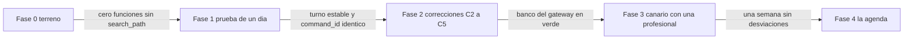

# 06 · Implementación y decisiones

Corte: 2026-09-02.

Este archivo contesta cuatro preguntas y ninguna más: **qué hay desplegado hoy**, **en qué orden se
construye lo que falta**, **con qué se prueba cada cosa** y **por qué el diseño es como es**. No
redefine contratos, no repite textos y no vuelve a explicar el workflow: cita a su dueño.

Es el archivo que se lee **antes de escribir la primera línea de código**, para no reimplementar una
decisión ya tomada ni tropezar con un pendiente conocido.

**Una advertencia de vocabulario, porque la palabra «fase» significa dos cosas y confundirlas cuesta
semanas:**

| Cuál | Qué numera | Dueño |
|---|---|---|
| **Fases del plan** (0, 1, 2, 3, 4) | El **orden de trabajo**: terreno, medición, correcciones, canario, agenda | Este archivo, [Parte B](#parte-b--las-fases) |
| **La guía paso a paso** | Qué se toca, qué se escribe y cómo se sabe que está hecho, en orden de implementación | Este archivo, [Parte F](#parte-f--la-guía-de-implementación-paso-a-paso) |
| **Fases de herramientas** (MVP, 2, 3, pospuesta) | Qué **herramienta de dominio** entra cuándo | `docs/01-producto.md` §6 |

No coinciden. La **Fase 4 del plan** es la que construye las **herramientas de Fase 2 y Fase 3**.
Cuando en este archivo se escribe «Fase 2» a secas, es la del plan.

---

## Índice

**[Parte A · El estado real](#parte-a--el-estado-real)**

- [A.1 Lo que está desplegado, con su versión](#a1-lo-que-está-desplegado-con-su-versión)
- [A.2 `agent_tool_gateway` v35: un cascarón bien blindado y vacío](#a2-agent_tool_gateway-v35-un-cascarón-bien-blindado-y-vacío)
- [A.3 `kapso_inbound_webhook` v32: buen cerrojo, puerta a ninguna parte](#a3-kapso_inbound_webhook-v32-buen-cerrojo-puerta-a-ninguna-parte)
- [A.4 La capa de dominio: las once RPC están todas por construir](#a4-la-capa-de-dominio-las-once-rpc-están-todas-por-construir)
- [A.5 El riel que sí funciona y no se toca](#a5-el-riel-que-sí-funciona-y-no-se-toca)
- [A.6 Lo que no existe y condiciona todo el plan](#a6-lo-que-no-existe-y-condiciona-todo-el-plan)

**[Parte B · Las fases](#parte-b--las-fases)**

- [B.0 Cómo se lee una fase](#b0-cómo-se-lee-una-fase)
- [Fase 0 · El terreno](#fase-0--el-terreno)
- [Fase 1 · La prueba de un día](#fase-1--la-prueba-de-un-día)
- [Fase 2 · Las cuatro correcciones y los ajustes de configuración](#fase-2--las-cuatro-correcciones-y-los-ajustes-de-configuración)
- [Fase 3 · El MVP con una profesional, canario en producción](#fase-3--el-mvp-con-una-profesional-canario-en-producción)
- [Fase 4 · La agenda](#fase-4--la-agenda)
- [B.6 Los nueve pasos del corte, y la reversa](#b6-los-nueve-pasos-del-corte-y-la-reversa)

**[Parte C · Las pruebas](#parte-c--las-pruebas)**

- [C.1 Por qué las anteriores no eran ejecutables](#c1-por-qué-las-anteriores-no-eran-ejecutables)
- [C.2 Los cinco bancos, y qué corre en cada uno](#c2-los-cinco-bancos-y-qué-corre-en-cada-uno)
- [C.3 Qué se prueba dónde](#c3-qué-se-prueba-dónde)
- [C.4 Las cinco pruebas-candado](#c4-las-cinco-pruebas-candado)
- [C.5 Lo que no se puede probar todavía](#c5-lo-que-no-se-puede-probar-todavía)
- [C.6 Observaciones después del corte, que no son pruebas](#c6-observaciones-después-del-corte-que-no-son-pruebas)

**[Parte D · El registro de decisiones](#parte-d--el-registro-de-decisiones)**

- [D.1 Las seis decisiones del fundador](#d1-las-seis-decisiones-del-fundador)
- [D.2 Decisiones ya tomadas, con motivo y riesgo](#d2-decisiones-ya-tomadas-con-motivo-y-riesgo)
- [D.3 Pendientes de verificar](#d3-pendientes-de-verificar)
- [D.4 Los pendientes de los demás archivos](#d4-los-pendientes-de-los-demás-archivos)

**[Parte E · Trazabilidad del anexo de auditoría](#parte-e--trazabilidad-del-anexo-de-auditoría)**

---

# Parte A · El estado real

Todo lo de esta parte está **verificado en lectura contra el proyecto de producción
`ssyzfeadyrczlzjbvxyl`** el **2026-09-02**, o citado con `archivo:línea` del repositorio
`/home/user/Agenda-Psi-V2`. Nada se infiere.

**Resumen en una frase: la superficie HTTP del agente existe y está bien blindada; detrás no hay
nada.** Ni una sola de las once RPC de dominio existe, y las tres rutas que el gateway sí tiene
cableadas apuntan a funciones borradas.

## A.1 Lo que está desplegado, con su versión

Seis Edge Functions activas *(comprobado 2026-09-02)*:

| Función | Versión | `verify_jwt` | Qué es hoy |
|---|---|---|---|
| `agent_tool_gateway` | **35** | `false` | La frontera del agente. Viva y vacía. [A.2](#a2-agent_tool_gateway-v35-un-cascarón-bien-blindado-y-vacío) |
| `kapso_inbound_webhook` | **32** | `false` | La entrada heredada. Llama una RPC borrada. [A.3](#a3-kapso_inbound_webhook-v32-buen-cerrojo-puerta-a-ninguna-parte) |
| `enviar-whatsapp` | 40 | `false` | El riel de plantillas. **Funciona y no se toca** |
| `kapso_status_callback` | 32 | `false` | Los acuses de entrega. **No se toca** |
| `notificar-push` | 43 | `false` | El empuje de avisos a la app. Le faltan los `case` de `crisis` |
| `get-payment-proof-url` | 40 | `true` | La URL firmada del comprobante, para la app |

**`verify_jwt: false` en el gateway y en el webhook entrante no es un descuido**: son endpoints
servidor a servidor y la plataforma no puede validarles un JWT de usuario. Pero significa que **la
única autenticación es la que escribe el handler**, y ahí está el problema de A.2.

## A.2 `agent_tool_gateway` v35: un cascarón bien blindado y vacío

**Lo que está bien, y se conserva entero.** El inventario completo de piezas reutilizables está en
`docs/05-pseudocodigo.md` §B.1 y no se repite. En corto: lectura de cuerpo acotada a 1 MiB
comprobada dos veces —por `content-length` y por bytes reales—, respuesta acotada a 16 KiB medida en
bytes, `no-store` y `nosniff`, comparaciones en tiempo fijo, y un `routePath` con lista blanca que
rechaza `%`, `\`, `//`, `.` y `..`.

**Lo que está mal, y es la razón de C5:**

1. **Su única autenticación es un `Bearer` estático.** El handler importa nada más
   `verifyBearerAuthorization` (`agent_tool_gateway/handler.ts:2`). No hay firma HMAC, ni `nonce`, ni
   `timestamp`, ni atadura a la conversación, ni protección de reenvío. **El HMAC ya existe en la
   casa** (`_shared/agent/crypto.ts:48-65`) y lo usa el webhook entrante
   (`kapso_inbound_webhook/handler.ts:275`); el gateway simplemente no lo llama.
2. **Acuñaría un token de identidad sobre una identidad que afirma el llamador.** Quien tenga ese
   secreto pide un token para cualquier teléfono de cualquier profesional. **Es una llave maestra
   multi-tenant**, y es exactamente lo que corrige la atestación de `docs/04-workflow-y-prompt.md`
   §B.2.
3. **Tres rutas vivas contra tres RPC que no existen.** `/tools/capabilities`, `/workflow/waiting` y
   `/workflow/complete` llaman a `agent_get_capabilities_from_workflow`, `agent_mark_inbound_waiting`
   y `agent_complete_inbound_from_workflow`. Las tres devuelven `NULL` con `to_regproc` *(comprobado
   2026-09-02)*: **responden `503`**. Las otras 25 rutas declaradas contestan
   `403 OPERATION_NOT_ENABLED`.
4. **Ninguna ruta del MVP existe.** No hay `/identity`, ni `/tools/mis_citas`, ni `/tools/confirmar`,
   ni `/tools/mandar_comprobante`, ni `/tools/crisis`. El mapa de rutas final —trece entradas— está
   en `docs/05-pseudocodigo.md` §B.3.

**Y una trampa que sólo se ve comparando el repo local con lo desplegado:** el `BASE_PATH` del repo
local (`agent_tool_gateway/handler.ts:5`) es `'/functions/v1/agent_tool_gateway'` y **nunca hace
match**, porque el Edge Runtime quita ese prefijo antes de invocar `Deno.serve`. La v35 desplegada ya
lo corrigió a `'/agent_tool_gateway'`. Quien despliegue el repo local sin mirar la desplegada publica
un gateway que contesta `404` a todo y no da ninguna pista. El detalle está en
`docs/05-pseudocodigo.md` §B.2.

## A.3 `kapso_inbound_webhook` v32: buen cerrojo, puerta a ninguna parte

**Lo que está bien y se copia tal cual:**

- **Verifica el HMAC sobre los bytes crudos, antes de parsear** (`handler.ts:275`). Ése es el orden
  correcto y es el que hereda `/identity`.
- **Rechaza lotes dos veces:** por encabezado y por la forma del cuerpo, con
  `BATCH_NOT_ENABLED` (`422`). Rechazar en dos capas es deliberado: un atacante que controle un
  encabezado no controla la forma del JSON firmado.
- **Ningún error interno se filtra:** `mapAgentError` (`handler.ts:210-220`) colapsa cualquier caso
  desconocido a `503 TEMPORARY_UNAVAILABLE`.
- **El parser del sobre Kapso v2** (`_shared/agent/kapso-v2.ts`) es el cerrojo entero: normaliza
  dígitos, exige que el `phone_number_id` de nivel superior coincida con el de la conversación cuando
  ambos existen, y exige `message.kapso.origin = 'cloud_api'`.

**Lo que está mal:**

1. **Llama una RPC que ya no existe.** `supabase.rpc('agent_register_inbound_context', ...)`
   (`kapso_inbound_webhook/index.ts:48`) apunta a una función retirada por la migración
   `20260828223432_retirar_andamio_agente_anterior`. **Ese camino de entrada está roto.**
2. **La rotura es potencial, no necesariamente activa.** Si `AGENT_INBOUND_ENABLED` no vale
   `'true'`, el handler contesta `{ok:true,status:'disabled'}` antes de llegar a la RPC
   (`handler.ts:292-294`). No se pudo comprobar el valor de esa variable: los secretos no son
   legibles por SQL ([D.3](#d3-pendientes-de-verificar)).
3. **Es phone-first duro.** Rechaza la identidad sólo-BSUID con `IDENTITY_UNSUPPORTED` y prohíbe
   inventar el mapeo BSUID → paciente. **Esa prohibición es correcta y se conserva**; lo que no
   sirve es que el camino entero dependa de que llegue teléfono, porque `needs_contact` existe
   precisamente para el caso contrario.
4. **Es una segunda máquina de estado.** Convivir con el workflow es lo que produjo el `TURN_BUSY`
   de agosto. **No se reactiva:** en el corte se apaga y no se vuelve a conectar
   ([B.6](#b6-los-nueve-pasos-del-corte-y-la-reversa)).

## A.4 La capa de dominio: las once RPC están todas por construir

`SELECT count(*) FROM pg_proc WHERE proname LIKE 'agent%'` devuelve **0** *(comprobado
2026-09-02)*. No existe `mis_citas`, ni `confirmar`, ni `mandar_comprobante`, ni `crisis`, ni
ninguna de las siete de fases posteriores. **No existe tampoco ninguna función desplegada que
confirme una cita.**

Lo que sí está desplegado y sirve de plantilla —idempotencia con `command_log`, anclaje de propiedad
en Storage, sellos de cita— está inventariado en `docs/05-pseudocodigo.md` §«Cómo leer este
archivo». La tabla `command_log` existe con la forma que el diseño necesita *(comprobado
2026-09-02)*: `scope_type text NOT NULL`, `scope_id uuid NOT NULL`, `command_id uuid NOT NULL`,
`command_type`, `request_hash`, `actor` de tipo `actor_type` —cuyas etiquetas son
`patient | professional | system`—, `result jsonb`, `completed_at`, `created_at`.

**El detalle que decide el diseño de `crisis` y de los avisos:** `actor_type` **admite `patient`**,
pero **ninguna función desplegada lo escribe**; sólo escriben `system` y `professional`. El agente
va a ser el primero en usar esa etiqueta, así que nadie ha ejercitado ese camino y hay que probarlo
como si fuera nuevo, porque lo es.

## A.5 El riel que sí funciona y no se toca

Siete trabajos programados activos *(comprobado 2026-09-02)*:

| Trabajo | Cadencia | Qué hace |
|---|---|---|
| `cron_confirmation_26h` | cada 5 min | Pide confirmación **con plantilla**. Es el que abre la conversación del MVP |
| `cron_appointment_reminder_1h` | cada 5 min | Recordatorio **con plantilla** |
| `cron_sweep_past_pending` | cada 5 min | Barre citas vencidas |
| `sender_whatsapp` | cada minuto | Dispara el envío de `whatsapp_outbox` |
| `purge_command_log` | cada hora, `:17` | Borra `command_log` con más de **90 días** |
| `purge_whatsapp_outbox` | cada hora, `:23` | Purga la cola de salida |
| `purge_whatsapp_inbound` | cada hora, `:29` | Borra `whatsapp_inbound_messages` con más de **30 días** |

**Los dos primeros son la razón por la que el sandbox de Kapso no sirve para probar el MVP**
([Fase 3](#fase-3--el-mvp-con-una-profesional-canario-en-producción)): la conversación del MVP la
abre una plantilla, y el sandbox no las soporta.

**Los dos últimos fijan la retención, y con eso cierra un pendiente de `docs/01-producto.md` §7.**
La bitácora de C5 vive sobre `whatsapp_inbound_messages`, así que **es append-only durante 30 días**
y después se borra por lotes de 5 000. La decisión está en [D.2](#d2-decisiones-ya-tomadas-con-motivo-y-riesgo).

## A.6 Lo que no existe y condiciona todo el plan

Cinco ausencias verificadas que cambian lo que se puede hacer y cuándo:

1. **No hay staging.** El proyecto tiene **cero ramas de desarrollo** *(comprobado 2026-09-02)*, y
   producción es de sólo lectura por hook. **Ninguna prueba que exija escribir corre hoy en ningún
   lado.**
2. **pgTAP no está instalada.** Está **disponible** en el catálogo del proyecto —`pgtap`, versión
   por omisión `1.3.3`— y `installed_version` es `null` *(comprobado 2026-09-02)*. Se instala en la
   rama de pruebas, **nunca en producción**.
3. **`service_role` no tiene ningún privilegio sobre `public.whatsapp_inbound_messages`**
   (`relacl = {postgres=arwdDxtm/postgres}`, RLS habilitado con cero políticas) *(comprobado
   2026-09-02)*. **La bitácora de C5 no se puede escribir hasta que exista el `GRANT`.**
4. **Nadie escribe los tres identificadores de proveedor.** Ninguna función de `public` ni de
   `private` menciona `business_scoped_user_id`, `kapso_contact_id` ni `business_portfolio_id`
   *(comprobado 2026-09-02)*. Las columnas existen y sus índices también
   —`uq_whatsapp_links_prof_portfolio_bsuid`, `uq_whatsapp_links_prof_kapso_contact`,
   `ix_whatsapp_links_portfolio_bsuid`—, así que **hoy son índices sobre columnas siempre nulas**.
5. **Un solo número de WhatsApp y plan FREE.** 100 peticiones por minuto, 5 ejecuciones por segundo
   y por workflow, 2 000 mensajes al mes, un número. No hay un segundo número para probar sin tocar
   a nadie.

---

# Parte B · Las fases

## B.0 Cómo se lee una fase

Cada fase trae **entregable** —qué queda escrito, desplegado o medido— y **criterio de salida
medible** —una comprobación que da verdadero o falso, sin opinión—. Una fase no empieza porque la
anterior «parezca sencilla»: empieza cuando su criterio de salida es verdadero.

**La regla de disciplina que sobrevive de todos los planes anteriores, palabra por palabra:** no se
activa el Agent Node hasta que la identidad impida que `not_patient` e `inactive_patient` lleguen al
modelo.

---

## Fase 0 · El terreno

**No toca el agente.** Son tres arreglos de base que hay que hacer igual, y que si no se hacen antes
convierten los fallos del agente en fallos indistinguibles de los de la base.

### 0.1 Higiene de teléfonos

**Lo que ya está bien, y hay que saberlo antes de «arreglar» nada.** El dominio
`public.e164_phone` es `text` con **dos comprobaciones, las dos validadas** *(comprobado
2026-09-02)*:

- `VALUE ~ '^[+][1-9][0-9]{1,14}$'` — formato E.164 estricto;
- `VALUE !~ '^\+521[0-9]{10}$'` — **prohíbe el «uno» mexicano**.

Y lo usan `patients.phone` (`NOT NULL`), `whatsapp_links.phone` (`NOT NULL`),
`professionals.phone` y `whatsapp_outbox.to_phone`. Como las dos comprobaciones están
`convalidated`, **ninguna fila almacenada puede estar fuera del formato**: la higiene de los datos
guardados no es el problema.

**El problema es el otro lado, y son tres cosas concretas:**

1. **WhatsApp entrega los móviles mexicanos con el «uno»** (`521` + diez dígitos) y la base **no lo
   admite**. Sin un normalizador canónico en la frontera, la búsqueda por teléfono falla siempre
   para México y una paciente real cae en `not_patient`. La unicidad es
   `uq_whatsapp_links_prof_phone UNIQUE (professional_id, phone)`: es **igualdad de texto exacto**,
   no coincidencia difusa.
2. **`whatsapp_inbound_messages.phone` es `text` plano**, no el dominio *(comprobado 2026-09-02)*.
   Eso es lo que permite que la bitácora escriba ahí la clave con prefijo `bsuid:` de
   `docs/04-workflow-y-prompt.md` §B.3. **Hay que declararlo así, explícitamente**, para que nadie
   lo «corrija» a `e164_phone` y rompa la bitácora seis meses después.
3. **El trigger de cambio de teléfono no invalida la identidad de proveedor.**
   `tg_patients_whatsapp_link_phone_au` está desplegado, es `SECURITY DEFINER` con `search_path`
   vacío, y su cuerpo hace exactamente esto: `UPDATE public.whatsapp_links SET phone = NEW.phone,
   updated_at = now() WHERE patient_id = NEW.id`, con `RAISE EXCEPTION 'WHATSAPP_LINK_MISSING'` si
   no afectó exactamente una fila *(comprobado 2026-09-02)*. **No limpia** `kapso_contact_id`,
   `business_portfolio_id`, `business_scoped_user_id`, `parent_business_scoped_user_id`,
   `whatsapp_username` ni `last_inbound_at`. Un cambio de número deja la identidad de proveedor de
   la persona anterior colgada del vínculo nuevo.

**Entregable.** El normalizador canónico documentado y aplicado en la única frontera de entrada
(el portero, `04` §A.4 F1), y el trigger corregido para limpiar las seis columnas **sólo cuando el
teléfono cambia de verdad**, conservando `SECURITY DEFINER`, `search_path` vacío, referencias
calificadas y `EXECUTE` sólo para `service_role`.

**Criterio de salida.**

1. Un banco de casos del normalizador corre en CI y pasa: `521` + 10 dígitos, `52` + 10 dígitos, con
   y sin `+`, con espacios y con guiones **producen el mismo canónico**; cualquier otra cosa produce
   un rechazo explícito, nunca un teléfono adivinado.
2. `SELECT count(*)` de filas de `patients` o `whatsapp_links` fuera del dominio devuelve **cero**
   —lo garantiza el dominio; se comprueba, no se supone— **sin exportar ninguna fila**.
3. Cambiar el teléfono de una ficha de prueba en la rama deja las seis columnas de identidad de
   proveedor en `NULL` y mueve `updated_at`; **no cambiarlo no invalida nada**.

### 0.2 Persistir lo que Kapso ya entrega y hoy nadie guarda

Kapso entrega en cada inbound `business_scoped_user_id`, `kapso_contact_id` y
`business_portfolio_id`, y **ninguna función desplegada los escribe** ([A.6](#a6-lo-que-no-existe-y-condiciona-todo-el-plan)).
Mientras no se guarden, la resolución por BSUID **no puede funcionar nunca**: sus índices están
sobre columnas vacías, y `needs_contact` —el estado que existe justo para el BSUID sin teléfono— es
inalcanzable por construcción, no por diseño.

**Entregable.** Una función de reconciliación perezosa, `SECURITY DEFINER`, `search_path` vacío,
`REVOKE` a `PUBLIC`/`anon`/`authenticated`/`service_role` y `GRANT EXECUTE` sólo a `service_role`,
que escribe los tres identificadores sobre el vínculo ya resuelto y **asigna `updated_at` de forma
explícita**, porque `whatsapp_links` **no tiene ningún trigger de usuario** *(comprobado
2026-09-02)*: si el código no lo escribe, no se mueve.

**Las dos reglas que esa función no puede violar**, y que vienen del portero (`04` §B.4):

- **Un cambio exclusivo de `last_inbound_at` no toca `updated_at`.**
- **Un `identity_conflict` no escribe nada**: ni metadatos de proveedor, ni `last_inbound_at`.

**Criterio de salida.** Sobre la rama de pruebas: un inbound con BSUID nuevo escribe las tres
columnas y mueve `updated_at`; el mismo inbound repetido **no escribe otra vez**; un inbound sólo con
teléfono **no borra** el BSUID que ya estaba; y un BSUID que apunta a otra relación **no sobrescribe
nada** y produce `identity_conflict`.

### 0.3 Fijar `search_path` en las cuatro funciones que no lo tienen

**Son exactamente cuatro, y son las únicas del proyecto.** `private.wa_fecha(timestamptz, text)`,
`private.wa_hora(timestamptz, text)`, `private.wa_modalidad(modality)` y
`private.wa_payload_ok(text, jsonb)` tienen `proconfig = null`; **todas las demás funciones de
`public` y de `private` llevan `search_path` fijado** *(comprobado 2026-09-02)*. Las cuatro son
`SECURITY INVOKER`, así que no son una escalada de privilegios; el riesgo es otro y es real:

- **`wa_payload_ok` se evalúa dentro de un `CHECK`.** La restricción `chk_outbox_variables` de
  `public.whatsapp_outbox` es
  `CHECK ((send_mode <> 'template') OR private.wa_payload_ok(template_key, payload))` *(comprobado
  2026-09-02)*. Una restricción cuyo significado depende del `search_path` de quien inserta **no es
  una restricción**: es una sugerencia. Su cuerpo usa `jsonb_typeof`, `jsonb_array_elements`,
  `btrim` y `jsonb_array_length` sin calificar, y basta un esquema puesto por delante de
  `pg_catalog` para cambiar qué significa cada uno.
- **Las otras tres las llama un `SECURITY DEFINER`.** `tg_outbox_variables_bi` —el trigger
  `outbox_variables_bi` sobre `whatsapp_outbox`— es `SECURITY DEFINER` con `search_path` vacío y usa
  `wa_fecha` *(comprobado 2026-09-02)*. Hoy funciona porque `pg_catalog` es implícito, pero es una
  propiedad frágil que nadie escribió a propósito.

**Entregable.** Las cuatro con `SET search_path = ''` y todas sus referencias calificadas. **No se
cambia su lógica ni su firma.**

**Criterio de salida.** `SELECT count(*) FROM pg_proc p JOIN pg_namespace n ON n.oid = p.pronamespace
WHERE n.nspname IN ('public','private') AND p.prokind = 'f' AND p.proconfig IS NULL` devuelve
**cero**, y el banco de casos de `wa_payload_ok` —los dieciséis `template_key` con su número exacto
de variables, más un `template_key` desconocido que debe dar falso— sigue en verde.

---

## Fase 1 · La prueba de un día

**Es la fase que decide todas las demás, y es un día de trabajo.**

**Por qué existe.** La única evidencia empírica que hay es la del commit `16e0606` (23-ago-2026),
proyecto Kapso «Agenda Psi» `7cacfa3c-18f3-42c7-9623-22503fb947c7`, plan FREE, workflow borrador
`d4ab8c62-f138-4869-a501-19e60c4483ff`. Ahí se midió: `gpt-5.6-luna`, `temperature 0`,
`reasoning medium`, `max_iterations 16`, `max_tokens 2048`; `get_capabilities` llegó a `committed`,
el mensaje se entregó, la ejecución quedó en `Waiting` y el follow-up falló con `TURN_BUSY`.

**Y esto es lo que esa medición no dice, que es lo que importa:**

- **Aquel workflow usaba API Trigger (Start) → Agent Node → Function Node.** El **trigger de mensaje
  entrante nunca se ejercitó.** El camino real —justo donde no hay WAMID— no se probó.
- **La estabilidad del identificador de invocación ante un reintento quedó `PARCIAL`:** la prueba
  corrió, pero `get_capabilities` **no dependía de ese identificador**, así que no lo ejercitó.
- **`TURN_BUSY` ya no aplica:** venía de tener dos máquinas de estado y en este diseño hay una.
- **La rama `main` de aquel repositorio no contiene esta evidencia:** su `provider-model-lock.json`
  sigue diciendo `blocked_unverified`, con `provider_model_id` en `null`. Quien lea sólo `main`
  concluirá, con razón, que nunca se midió nada.

**Entregable.** Un workflow **desechable** en Kapso, con el **trigger de mensajes entrantes** —no
API Trigger—, un Function Node que reenvía el contexto completo a un endpoint de captura propio, y
un webhook tool de juguete que se puede forzar a reintentar. Más un informe de una página con el
payload real, **anonimizado**, y respuesta binaria a siete preguntas:

| # | Pregunta | Cómo se contesta | Qué depende de ella |
|---|---|---|---|
| 1 | Qué identificadores expone el trigger entrante | Capturar el contexto completo de una ejecución real | Todo `04` §A.1 |
| 2 | Si expone BSUID | La misma captura, con un contacto que no haya compartido teléfono | Si `needs_contact` e `identity_conflict` son alcanzables (`01` §3.4) |
| 3 | Si `conversation_id` y el contador de turno son estables en un reintento | Forzar el reintento del webhook tool y comparar | **Candado de las mutaciones** (C2) |
| 4 | Si `enter_waiting` tiene timeout, y de cuánto | Dejar una ejecución esperando y observar | `turn_idle_ttl_minutes`, y si hace falta recuperación |
| 5 | Qué namespaces interpola el `bodyTemplate` de un webhook tool | Un cuerpo con `{{vars.agent_state}}` y `{{context.conversation_id}}` | El ciclo entero del sello (`04` §B.5) |
| 6 | Si la respuesta de un webhook tool puede escribir `vars` | Devolver `vars` y ver si Kapso lo aplica | La salida alterna ya está escrita en `04` §A.6 |
| 7 | Qué hace Kapso al agotar `max_iterations` | Un agente de juguete con `max_iterations: 2` | Si `se_acabo_el_espacio` llega a mandarse |

**Y una llamada de API que se hace el mismo día:** `GET /platform/v1/provider_models` con la llave
del proyecto, que devuelve el `provider_model_id` interno y de paso los
`supported_prompt_cache_ttls`. **Sin ese identificador el Agent Node no se despliega**
(`04` §C.2).

**Criterio de salida.** Las siete preguntas contestadas por observación, no por documentación, y el
`provider_model_id` escrito. **La pregunta 3 es candado:** si el par (`conversation_id`, turno) no
vuelve idéntico en un reintento, **las herramientas de escritura no se habilitan** y la Fase 3 se
reduce a `mis_citas` y `crisis` hasta resolverlo. No se sustituye con la hora, con el texto del
mensaje, con un WAMID inventado ni con un UUID creado por el modelo.

---

## Fase 2 · Las cuatro correcciones y los ajustes de configuración

**Entregables, en este orden.** Cada uno tiene su dueño y aquí sólo se dice qué se construye y cómo
se mide.

| # | Entregable | Dueño del diseño |
|---|---|---|
| 1 | Los textos que faltan dados de alta antes de que exista el flujo que los usa | `docs/02-conversaciones-y-textos.md` §A.4 y §A.6 |
| 2 | **C5 ·** Migración corta de la bitácora: dos columnas, un índice único y el `GRANT` | `04` §B.3, decisión en [D.2](#d2-decisiones-ya-tomadas-con-motivo-y-riesgo) |
| 3 | **C5 ·** `/identity` con atestación del mensaje entrante | `04` §B.2, pseudocódigo en `05` §B.4 |
| 4 | **C2 ·** Acuñación del `command_id` en el gateway y sellado en `vars.agent_state` | `04` §B.6, pseudocódigo en `05` §B.5 |
| 5 | **C3 ·** `pending_step` + `allowed_next_tools` en el candado del gateway | `docs/03-contratos.md` §2, aplicación en `04` §B.7 |
| 6 | **C4 ·** La ruta `/tools/crisis`, que no existía en ningún mapa | `03` §3.4, `05` §A.4 |
| 7 | El mapa de rutas cerrado de trece entradas, sustituyendo las 28 de hoy | `05` §B.3 |
| 8 | Los frenos de admisión aplicados en `/identity` y en el gateway | valores en [D.2](#d2-decisiones-ya-tomadas-con-motivo-y-riesgo), aplicación en `04` §B.8 |
| 9 | La configuración del Agent Node, con sus tres ajustes | `04` §C.2 |

**Los tres ajustes de configuración, porque son los que se olvidan:**

- **`max_iterations` se fija a mano en `16`.** El **default de Kapso es 80**, no 16. Ochenta es
  presupuesto de agente autónomo; esto hace una cosa por turno.
- **`get_variable` no se habilita.** Acepta `"*"` para traer **todas** las variables: habilitarla le
  entrega al modelo el `agent_state` y el `identity_token` sellados. Es la prohibición más importante
  de la lista de `04` §C.2, y arrastra a `get_execution_metadata`, `save_variable` y
  `get_whatsapp_context`, que son la misma fuga por otras puertas.
- **Ninguna variable interpolada entra al system prompt.** Rompería el prefijo cacheable, y **con el
  texto viajando dos veces por turno el caché importa todavía más**: la entrada cacheada cuesta
  0.02 USD/M frente a 0.20 sin caché. El estado del turno viaja en el primer mensaje, no en el
  prompt (`04` §C.1 y §C.4).

**Criterio de salida.** El banco del gateway completo en verde
([C.2](#c2-los-cinco-bancos-y-qué-corre-en-cada-uno), banco 2 y 3), y en particular estas seis, que
son las que distinguen esta fase de la anterior:

1. Un `identity_token` de otra conversación, alterado o vencido **no abre**, y la respuesta es
   `gestion_inactiva`, no una repregunta.
2. **`/identity` sin atestación no acuña nada.** Con atestación repetida devuelve **el mismo turno y
   el mismo token**, y **no inserta una segunda fila** de bitácora.
3. El `command_id` sellado vuelve **idéntico** en un reintento de transporte, y **la operación no
   forma parte del UUID**: dos herramientas mutantes distintas en el mismo turno **chocan**.
4. Un `opcion` de una herramienta que **sí** está en `allowed_next_tools` **se acepta**; una fuera de
   la lista **falla cerrada** y reemite la pregunta. Las dos caras, no sólo el rechazo.
5. `mis_citas` y `crisis` se aceptan siempre y **vuelven a sellar el mismo `next_state`**: contestar
   «la 1» después de una de ellas sigue resolviendo.
6. La traza del Agent Node **no contiene ningún UUID interno** en prompt, mensajes ni argumentos, y
   `get_variable` no aparece entre las herramientas disponibles.

---

## Fase 3 · El MVP con una profesional, canario en producción

**Por qué el canario va en producción y no en un sandbox.** Kapso tiene entorno de pruebas, pero
**no soporta plantillas**, y **la conversación del MVP la abre una plantilla**: `cron_confirmation_26h`
y `cron_appointment_reminder_1h` corren cada cinco minutos y salen por `whatsapp_outbox` →
`sender_whatsapp` → `enviar-whatsapp` ([A.5](#a5-el-riel-que-sí-funciona-y-no-se-toca)). Un sandbox
que no puede mandar la plantilla no puede probar el flujo que empieza con ella. **Y sólo hay un
número.** Así que el canario es producción, acotada por lista blanca.

**Entregables.**

1. Las **cuatro RPC** del MVP: `mis_citas` primero —la única lectura, valida identidad, forma y
   textos—, después `crisis`, `confirmar` y `mandar_comprobante`, cada una con su reclamo en
   `command_log` y su aviso a la profesional **en la misma transacción**. Pseudocódigo en `05`
   §A.1 a §A.4.
2. Los **cuatro adaptadores**, que sólo fijan el nombre de operación (`05` §C.3).
3. La **lista blanca en el gateway, por `whatsapp_link.id`**, nunca por teléfono: el teléfono cambia
   y el vínculo no.
4. El workflow conectado al número, con el webhook heredado apagado.

**Qué le pasa a quien no está en la lista blanca.** El workflow **termina sin mandar nada** y la
profesional la atiende a mano, que es **exactamente lo que pasa hoy**. No es una regresión y **no
necesita ninguna clave de texto nueva**: inventar aquí un «todavía no estoy disponible» sería
prometerle a alguien un servicio que no va a recibir. Riesgo: durante el canario, una paciente fuera
de la lista escribe y no recibe respuesta automática; es el estado actual del producto, no un daño
nuevo.

**Criterio de salida.** **Una semana natural completa** de tráfico real de una sola profesional, con
las cinco condiciones en verde. La semana es la unidad porque el ciclo del producto es semanal: la
confirmación de 26 horas y el recordatorio de 1 hora tocan a cada cita una vez, y una semana cubre
todos los días de consulta de una agenda típica.

| # | Condición | Cómo se mide |
|---|---|---|
| 1 | **Ningún texto entregado distinto del que compuso la RPC** | Auditoría de la regla dura 7 (`04` §C.6) sobre el muestreo declarado ahí. **Es la comprobación del riesgo aceptado de [D.1](#d1-las-seis-decisiones-del-fundador)** |
| 2 | **Ninguna mutación duplicada** | Cero casos de dos efectos de negocio con el mismo `command_id`; cero `command_type` o `request_hash` discordantes sobre un `command_id` existente |
| 3 | **Ninguna gestión rebasa los cuatro salientes** | Conteo por gestión contra el tope de `03` §1.11 |
| 4 | **Ningún turno sin rastro** | Una fila de bitácora por turno validado, lea o mute |
| 5 | **Ningún aviso a la profesional perdido** | Cero mutaciones con `completed_at` y sin su fila en `notifications`. Si el aviso no se pudo escribir, la mutación **no debió ocurrir** (regla 13) |

**Y una condición de salida que no es técnica:** la lista blanca se retira **sólo después** de que
el aviso de `crisis` aterrice en la app como tarjeta con su texto, no como el aviso neutro «Nueva
notificación». Mientras falten los `case` en `notification_models.dart` y en `notificar-push` v43,
`crisis` se despliega y **no cumple su propósito**: es lo único del MVP con esa propiedad
(`03` §8.1). Si el fundador prefiere abrir con la tarjeta neutra, es una decisión suya y se anota
aquí; no se toma por omisión.

---

## Fase 4 · La agenda

Construye las **herramientas de Fase 2 y Fase 3** de `01` §6: `cancelar`, `buscar_horarios`,
`agendar`, `reprogramar`, y después `cambiar_modalidad` y `ver_servicios`. Están **esbozadas** en
`03` §4 y §5 —firma, autorización y forma del resultado— y **no** tienen pseudocódigo fiel: eso es
deliberado y se escribe cuando empiece esta fase.

**Cuatro prerrequisitos que no son de esta fase pero la bloquean**, todos verificados:

1. **No existe el motor de políticas.** Ninguna función desplegada evalúa
   `free_change_notice_minutes`; `update_appointment_policies` acepta el parámetro, así que el valor
   se guarda y nadie lo lee. Sin ese motor no hay «a tiempo» ni «tarde».
2. **`cancel_appointment` exige `p_payment_action`.** Ninguna de sus salidas deja
   `late_change_decision = 'pending'`, así que hace falta una **función gemela** que abra la decisión
   en vez de cerrarla. `reprogramar` necesita la suya (`01` §4.4).
3. **El recorte a seis candidatos no vive en la base ni en la app.** `_get_internal_availability_core`
   sí sirve —con `p_professional_id` explícito y los dos interruptores en `true`— y el paso de 15
   minutos vive en el núcleo, pero **el tope de seis horas no**: vive en una superficie que hoy no
   está identificada (`01` §7). Hasta identificarla, nadie puede decir «la lectura de horarios que
   ya está desplegada».
4. **`_get_internal_availability_core` no tiene `GRANT` a `service_role`.** Su ACL es `{postgres}`,
   así que `agent_buscar_horarios` no puede llamarlo tal cual; se resuelve con un `GRANT` o con una
   envolvente `SECURITY DEFINER`, y cuál de las dos depende del punto 3 (`03` §8.6).

**Criterio de salida, por herramienta.** Cada una entra sólo cuando: su contrato de `03` tiene
pseudocódigo fiel en `05`; su prueba de concurrencia pasa —para `agendar`, dos intentos por el mismo
horario producen **una** escritura y **una** respuesta de horario ocupado, apoyada en
`excl_appointments_no_overlap` y en el bloqueo consultivo por profesional—; y su decisión de dinero
queda **abierta para la profesional**, nunca cobrada sola.

---

## B.6 Los nueve pasos del corte, y la reversa

Sobreviven enteros de los planes anteriores y no los toca ninguna corrección:

1. Desplegar **sin conectar el número**.
2. Pruebas en entorno controlado (Parte C).
3. Confirmar los textos contra `docs/02-conversaciones-y-textos.md`, que es su única fuente.
4. **Aprobar expresamente la reversa degradada.** Es una firma, no un trámite: ver abajo.
5. Dejar terminar las ejecuciones heredadas y **desconectar sus eventos entrantes**.
6. Activar el workflow para el número.
7. Probar **un caso por estado de identidad**, y **una lectura antes de cualquier mutación**.
8. Vigilar duplicados, errores, tokens, entrega y costo.
9. Retirar la lista blanca sólo con el criterio de salida de la Fase 3 en verde.

**La reversa es degradada y hay que decirlo con todas sus letras.** Para revertir se **desactiva el
workflow** y **no se reconecta `kapso_inbound_webhook`**: esa función llama una RPC borrada
([A.3](#a3-kapso_inbound_webhook-v32-buen-cerrojo-puerta-a-ninguna-parte)) y reconectarla no
restauraría el servicio anterior, lo rompería de otra manera. **La reversa devuelve al producto a
atención manual**, que es su estado de hoy. Quien apruebe el corte está aprobando eso.

**Workflow y webhook heredado no pueden estar activos a la vez.** Dos máquinas de estado sobre la
misma conversación es exactamente lo que produjo el `TURN_BUSY` de agosto. Se comprueba en el
despliegue, no en producción.

---

# Parte C · Las pruebas

## C.1 Por qué las anteriores no eran ejecutables

**Primero, el conteo, porque la cifra que circulaba no se reproduce.** La sección de pruebas del
plan anterior se presentaba como «56 pruebas». Contadas una por una tiene **47 viñetas** —14 de
identidad, 18 de herramientas y RPC, 9 del Agent Node, 6 de precio y entrega—, y si se desglosan los
sub-casos que cada viñeta agrupa el total **pasa de 60**. Ningún criterio de conteo da 56. **La
unidad se fija aquí: se cuenta por caso ejecutable, no por viñeta**, y el número real se lee del
banco, no de un párrafo.

**Y después, lo que importa: no eran ejecutables.** Cuatro razones, todas verificadas:

1. **No hay staging** y producción es de sólo lectura: cualquier prueba que exija provocar un
   rechazo —el índice único, una restricción, una carrera— **no tiene dónde correr**
   ([A.6](#a6-lo-que-no-existe-y-condiciona-todo-el-plan)).
2. **No hay pgTAP instalada**, así que no había forma de escribir una aserción de base.
3. **Hay un solo número**, así que no existe un entorno donde equivocarse sin que lo lea una paciente.
4. **Varias pedían datos que no existen.** Éstas son las que se pudieron nombrar una por una:

| Prueba anterior | Por qué no era ejecutable | Qué se hace |
|---|---|---|
| «El mismo lote conserva los mismos WAMID en un reintento» | **El trigger entrante no expone WAMID.** Y era prueba-candado: bloqueaba `confirmar`, `mandar_comprobante` y `crisis` **para siempre** | Se reescribe sobre (`conversation_id`, turno). [C.4](#c4-las-cinco-pruebas-candado) |
| «Las tres lecturas» | En el MVP hay **una** lectura | `mis_citas` con relación activa, inactiva y ajena |
| `dejar_resena`, con ocho sub-casos | **Pospuesta**: no hay moderación | Congelada con la herramienta |
| «Dos intentos por el mismo horario» | Requiere `agendar` | Se conserva entera y **se mueve a la Fase 4** |
| «`opcion` contra otra `pending_tool`» | Codificaba el candado roto de C3: un `agendar(opcion:2)` legítimo daba **PASS por rechazo** | Se prueban **las dos caras** |
| «HEIC/HEIF y PDF normalizados a JPEG» | La normalización **no cabe** en una Edge Function (256 MB, 2 s de CPU) | Cambia la expectativa: **se rechazan**, no se convierten |
| «Creación de cita: completa sólo tras `hecho: true`» | Requiere `agendar` | La misma regla se prueba con `confirmar` y `mandar_comprobante` |
| «Saludo con “muévela” ejecuta reprogramación» | Requiere `reprogramar` | En el MVP: «hola, sí voy el martes» ejecuta `confirmar`, no `mis_citas` |
| «Índice único: rechaza dos identidades iguales» | Exige **intentar un `INSERT` duplicado** | Corre en la rama de pruebas, nunca en producción |
| «Identidades no activas nunca aparecen en trazas» | **Falta el sujeto**: no existe todavía un Agent Node | Se conserva; corre en la Fase 3 |
| Tokens, costo, categoría y precio en los registros de Kapso (dos viñetas) | **No son pruebas**: son observaciones con tráfico real | Se mueven a [C.6](#c6-observaciones-después-del-corte-que-no-son-pruebas) |

**Una que vuelve a ser ejecutable, y es la más importante.** «La RPC devuelve un texto: se envía
idéntico, una vez» estaba marcada como no ejecutable en el borrador donde el modelo ya no recibía el
texto. **Esa idea quedó descartada** ([D.1](#d1-las-seis-decisiones-del-fundador), decisión 1): el
modelo sí recibe el texto y lo copia, así que **la comparación existe otra vez y es la prueba
central del riesgo aceptado**. Su método está en `04` §C.6.

## C.2 Los cinco bancos, y qué corre en cada uno

| # | Banco | Con qué corre | Qué prueba | ¿Se puede hoy? |
|---|---|---|---|---|
| 1 | **Contratos y forma** | Node 22 **sin dependencias**, `node --test`, en CI con acciones pinneadas por SHA de commit y `permissions: contents: read` | Que cada contrato tenga sus secciones obligatorias; que no exista ningún `.sql`; que las once operaciones estén declaradas con su fase; que toda operación mutante declare `command_id` acuñado por el gateway; que toda operación declare `sets_pending_step` y `allowed_next_tools`; que cada contrato privado diga literalmente `patients.patient_status = 'active'` | **Sí** |
| 2 | **Unidad de las Edge Functions** | `deno test`, ya existe | HMAC en tiempo fijo contra el vector RFC 2202 (`crypto.test.ts:12-34`); el tope de 16 KiB **por bytes**, que **lanza en vez de truncar** (`http.test.ts:62`); el cuerpo acotado por `content-length` **y** por stream; el anti-traversal de `routePath` | **Sí** |
| 3 | **Integración del gateway** | La Edge Function levantada contra la **rama de Supabase**, con dobles del proveedor | Atestación, bitácora, acuñación y sellado del `command_id`, candado de `allowed_next_tools`, frenos de admisión, códigos de error seguros | **No**: falta la rama |
| 4 | **SQL con pgTAP** | `pgtap 1.3.3` instalada **en la rama**, nunca en producción | Restricciones, índices únicos, `command_log` y su reclamo, atomicidad de la mutación con su aviso, permisos de las RPC nuevas, carreras con bloqueos | **No**: falta la rama y la extensión |
| 5 | **Workflow contra Kapso** | Un workflow **desechable** y el **número real** | Lo de la Fase 1, la fidelidad del texto, el ciclo `enter_waiting` / `complete_task`, la ausencia de identificadores internos en la traza | **No**: el sandbox no sirve (plantillas) |

**Lo que se hereda de la era A1 y se conserva tal cual:** el esqueleto del CI —dos pasos,
`npm run check` y el chequeo de espacios en blanco con `git diff-tree --check`—, la disciplina de
cero dependencias npm, y la separación **Modelo / Interno** en la entrada de cada contrato, que es
lo que hace visible de un vistazo que el modelo nunca toca un UUID.

**Lo que se invierte, y hay que hacerlo a propósito:** el CI de A1 **prohibía activamente** nombrar
`command_log` en los contratos de control, porque su diseño usaba cinco tablas `agent_*` que
**nunca existieron en producción**. Esa aserción se **invierte**: ahora se exige que el contrato
nombre `command_log` con `scope_type = 'whatsapp_agent'`, `scope_id = whatsapp_link.id` y
`actor = 'patient'`, y se borran las cinco tablas fantasma de la lista de marcadores obligatorios.

## C.3 Qué se prueba dónde

**Identidad** —el bloque más sano del plan anterior: doce de sus catorce casos siguen valiendo tal
cual—. Corre en el banco 4 (pgTAP, rama) salvo donde se indique:

- BSUID conocido sin teléfono; BSUID desconocido sin teléfono; contacto compartido que coincide y
  que no coincide; tarjeta manual con `origin: other`, con `from_user_id` distinto, con varios
  teléfonos o con `wa_id` incoherente; vínculo inactivo; dos relaciones activas; cambio manual de
  teléfono; rotación de BSUID; `status` sólo con BSUID **correlacionado por el WAMID del saliente**,
  que no crea ni autoriza ningún vínculo; envío con `to` frente a `recipient`; y el lote original
  entregado después de `needs_contact` o `needs_professional`.
- **Las tres cruzadas que faltaban:** BSUID de A con teléfono de B; contacto de A con teléfono de B;
  y **varias relaciones compatibles del mismo paciente con profesionales distintas, que no son
  conflicto**.
- **`identity_conflict` completo:** no fusiona, no sobrescribe, **no toca metadatos de proveedor ni
  `last_inbound_at`**, y manda su texto propio, nunca `fuera_de_alcance`.
- **Todos los casos de `last_inbound_at`**, los que sí y los que no: se mueve con inbound
  autenticado incluso si el resultado es `inactive_patient` o `needs_professional`, y **no** se mueve
  sin fila de paciente, en `needs_contact` sin vínculo resuelto, en `identity_conflict` ni con un
  webhook de estado.

**Herramientas y RPC** —bancos 3 y 4—:

- `mis_citas` con relación activa, inactiva y ajena.
- Las tres mutaciones con `command_log`: reclamo, `COMMAND_PAYLOAD_MISMATCH` sin tocar negocio,
  devolución **exacta** del `result` guardado, y guardado también cuando `hecho` es falso.
- **Mismos argumentos públicos con distinto objetivo semántico interno → `request_hash` distinto o
  rechazo.** Sin esto, un mismo «sí» reutiliza el resultado de otra cita, otro pago u otro archivo.
- Estado sellado alterado, vencido o reproducido en otra conversación: **no muta**, y contesta
  `gestion_inactiva`.
- Comprobante: SHA-256 en `storage.objects.user_metadata.sha256` —**no** en `metadata`, que la
  escribe Storage— copiado a `payment_proofs.checksum`; subida `create-only`; y **fallo de
  vinculación → eliminación acotada inmediata; si también falla, alerta estructurada y limpieza
  manual**. No se documenta recuperación automática mientras `storage_cleanup_payment_proofs` no
  tenga consumidor desplegado.
- **JPEG, PNG y WebP hasta 5 MiB se aceptan; HEIC/HEIF y PDF se rechazan sin mutar**, con el texto
  que pide reenviar en formato compatible.
- **El aviso a la profesional falla → toda la mutación revierte.** Con C4 esto pesa más: `crisis`
  existe justamente para que la profesional se entere, y `notifications` es el **único** canal con
  Realtime hacia la app.

**Agent Node y prompt** —banco 5—:

- **La RPC devuelve un texto y el modelo lo manda idéntico, una vez.** Ver [C.4](#c4-las-cinco-pruebas-candado).
- Mutación del MVP: se afirma completada **sólo** después de `hecho: true`.
- Saludo con intención directa ejecuta la herramienta, no `mis_citas`.
- Dos intenciones en un lote: **una sola mutación**; el servidor pega `pendiente_lo_otro` y el modelo
  llama `enter_waiting` aunque la primera gestión trajera `cierra: true`.
- Ningún identificador interno en prompt, mensajes ni argumentos; ninguna identidad no activa en las
  trazas.

## C.4 Las cinco pruebas-candado

Una prueba-candado no informa: **bloquea**. Si falla, no se despliega la pieza que protege.

| # | Candado | Si falla |
|---|---|---|
| 1 | **Estabilidad del turno.** El mismo turno conserva `conversation_id` y `turn_no` en un reintento de herramienta, y el `command_id` sellado vuelve **idéntico** | **No se habilita ninguna mutación.** El MVP se reduce a `mis_citas` y `crisis` |
| 2 | **Fidelidad del texto.** El texto entregado es **carácter por carácter** el que compuso la RPC | No se conecta el número. Es el candado del riesgo aceptado de [D.1](#d1-las-seis-decisiones-del-fundador) |
| 3 | **Sin identificadores internos.** La traza real del Agent Node no contiene ningún UUID interno | No se conecta el número (regla 17) |
| 4 | **Atomicidad del aviso.** Si el aviso a la profesional no se puede escribir, la mutación **no ocurre** | No se habilita esa herramienta (regla 13) |
| 5 | **Una sola máquina de estado.** El workflow y el webhook heredado nunca están activos a la vez | Falla el despliegue, y se corrige antes de producción |

## C.5 Lo que no se puede probar todavía

Se dice con su desbloqueo, no se disfraza:

| Qué | Por qué no | Qué lo desbloquea |
|---|---|---|
| Cualquier rechazo de restricción, índice o carrera | Producción es de **sólo lectura**; no hay ramas | Crear la rama de Supabase e instalar pgTAP |
| El comportamiento del **trigger entrante** | Nunca se ejercitó: la medición de agosto usaba API Trigger | **Fase 1** |
| Si `enter_waiting` tiene timeout | La documentación de Kapso no lo dice | **Fase 1**, pregunta 4 |
| Si el `bodyTemplate` de un webhook tool interpola `{{vars.*}}` y `{{context.*}}` | Documentado para URLs y headers de MCP, no para el cuerpo del webhook | **Fase 1**, pregunta 5 |
| Si la respuesta de un webhook tool puede escribir `vars` | Documentado para function tools, **no** para webhook tools | **Fase 1**, pregunta 6 |
| Qué hace Kapso al agotar `max_iterations` | La documentación no lo dice | **Fase 1**, pregunta 7 |
| El aviso de `crisis` como tarjeta real en la app | Faltan los `case` en `notification_models.dart` y en `notificar-push` v43 | Agregar los dos `case` (`03` §8.1) |
| Si `AGENT_INBOUND_ENABLED` está encendida hoy | Los secretos no son legibles por SQL ni por las herramientas disponibles | Leerla en el panel de Supabase |
| El costo real por turno | Cero tráfico de modelo hasta hoy | **Fase 3**, y ver [C.6](#c6-observaciones-después-del-corte-que-no-son-pruebas) |

## C.6 Observaciones después del corte, que no son pruebas

Tokens consumidos, costo por ejecución, categoría de conversación y precio **sólo existen con
tráfico real**. Se leen en los registros y en la facturación de Kapso, **después** del corte. Ponerlas
entre las pruebas previas es lo que hacía que la lista pareciera más completa de lo que era.

**Y la disciplina que se hereda de A1 y se conserva textual:** no se afirma un costo monetario hasta
verificar el SKU y el precio vivo del `provider_model_id`, y **se miden por separado tres facturas
distintas**: la del proveedor del modelo, la de Kapso y la de Meta. El único número de tokens que
existe en toda la herencia —el techo teórico de salida por turno— es **aritmética, no medición**.

---

# Parte D · El registro de decisiones

## D.1 Las seis decisiones del fundador

### 1 · Quién manda el texto a la paciente — **RESUELTA**

**Contexto.** La RPC compone el texto final dentro de la misma transacción que autoriza y muta. Hubo
un borrador en el que el adaptador lo entregaba directo por la API de Kapso, saltándose al modelo.
La pregunta era si el texto vuelve al Agent Node o no.

**Decisión.** **Vuelve.** El resultado que recibe el modelo lleva el texto:
`{texto, espera, hecho, cierra}`, y el modelo lo manda con **`send_notification_to_user`
copiándolo literal**. La entrega directa por la API de Kapso **queda descartada** y no se reabre.

**Qué implica.**

- **`send_notification_to_user` sigue vivo y es la única vía de salida del texto.** Es una de las
  tres herramientas de control habilitadas (`04` §C.2).
- **La regla dura 7 del prompt se conserva y se refuerza**, no se borra. Es una de las piezas más
  importantes del diseño (`04` §C.3 y §C.6). **No se confunde con la regla 7 de producto** —cinco
  opciones, horizonte de treinta días, servicios hasta ocho—, que es otra y también sigue vigente
  (`01` §2).
- **El texto viaja dos veces por turno**, así que el prefijo cacheable del prompt importa más:
  entrada cacheada 0.02 USD/M frente a 0.20 sin caché (`04` §C.1).
- No hay una segunda capa de idempotencia de entrega, ni el gateway se vuelve transportista de
  WhatsApp.

**RIESGO ACEPTADO.** **La fidelidad del precio, la fecha y el monto descansa en una regla de prompt
ejecutada por el tier más barato de modelo, y hoy ningún componente de runtime compara lo que
compuso la RPC con lo que mandó el modelo.** Si el modelo altera un dígito, la paciente lee un
importe o una hora equivocados y el sistema no se entera. Se acepta a cambio de una sola vía de
respuesta visible, un solo transporte y un solo mecanismo de idempotencia. La comprobación es
**posterior y muestral**, no en línea: la auditoría de `04` §C.6, elevada a prueba-candado en
[C.4](#c4-las-cinco-pruebas-candado).

**Mitigación descrita y NO ADOPTADA.** Que el adaptador devuelva, además del texto, un **hash corto**
del texto compuesto por la RPC, y que el workflow **rechace el envío** cuyo argumento no reproduzca
ese hash. Cuesta un paso más en el workflow y convierte una desviación silenciosa en un fallo
visible; **no se adopta hoy** y queda aquí escrita por si la muestra de la Fase 3 encuentra una sola
desviación.

**Alternativa si se voltea.** Volver a la entrega directa por la API de Kapso obliga a: rehacer el
sobre que ve el modelo, mover `pendiente_lo_otro` de sitio, resolver la idempotencia de entrega con
el identificador que devuelve el proveedor, y **borrar la regla dura 7**. Es un cambio de
arquitectura, no un ajuste.

**Este riesgo se menciona una sola vez, aquí.** No se repite en los demás archivos.

---

### 2 · MVP de cuatro herramientas

**Contexto.** El catálogo son once herramientas de dominio. Construirlas todas antes de conectar el
número retrasa meses la primera conversación real, y cuatro de ellas dependen de un motor de
políticas y de un motor de horarios que no existen.

**Decisión.** **MVP: `mis_citas`, `confirmar`, `mandar_comprobante` y `crisis`**, con pseudocódigo
fiel e implementable. Fase 2 y Fase 3 de herramientas quedan **esbozadas** —firma, autorización y
forma del resultado— y `dejar_resena` pospuesta.

**Qué implica.** La allowlist del gateway es de cuatro, no de once ni de veintiséis; hay cuatro
adaptadores de un catálogo de once; y las rutas de fases posteriores se **declaran apagadas** con
`403 OPERATION_NOT_ENABLED`, porque el interruptor por fase es una variable de entorno y no un
despliegue. `dejar_resena` **no se declara**: una ruta declarada es una promesa (`05` §B.3).

**Alternativa si se voltea.** Ampliar el MVP arrastra los cuatro prerrequisitos de la
[Fase 4](#fase-4--la-agenda). Ninguno es una tarde de trabajo.

**Estado: decidida.** **Pendiente de su confirmación un punto concreto:** `crisis` se despliega
funcionando y, hasta que la app tenga sus dos `case`, el aviso a la profesional llega como tarjeta
neutra. Es lo único del MVP que se puede desplegar y aun así no cumplir su propósito. Si prefiere
esperar a los `case`, se dice ahora.

---

### 3 · La herramienta es un webhook tool directo

**Contexto.** Kapso ofrece dos maneras de que el Agent Node llame a un servicio: una `function tool`
—que corre en un Function Node del workflow— y un `webhook tool` que golpea directo un endpoint.

**Decisión.** **Webhook tool directo contra `agent_tool_gateway`.** El análisis con su costo está en
`04` §A.6.

**Qué implica.** El modelo controla `input` y nada más: no controla la operación real, ni el
contexto, ni el texto. El `command_id` viaja **sellado en `vars.agent_state`**, nunca en la URL
—entre otras cosas porque `routePath` rechaza cualquier ruta con `%`, así que los identificadores
viajan siempre en el cuerpo JSON (`05` §B.2)—. Y todo el ciclo del sello **supone que la respuesta
del webhook tool puede escribir `vars`**, que es la pregunta 6 de la Fase 1.

**Alternativa si se voltea.** Pasar a `function tool` agrega un nodo por herramienta y un salto más
por turno, pero **no cambia el sobre que ve el modelo ni la arquitectura**. La salida está escrita
en `04` §A.6, precisamente para que un «no» en la pregunta 6 no obligue a rediseñar nada.

**Estado: decidida.** No requiere confirmación adicional.

---

### 4 · `/identity` exige atestación del mensaje entrante

**Contexto.** Hoy `/identity` acuñaría un token de identidad sobre una identidad que **afirma el
llamador**, y su única credencial es un `Bearer` estático. Quien tenga ese secreto pide un token para
cualquier teléfono de cualquier profesional.

**Decisión.** **C5.** `/identity` no acuña nada sin atestación: `conversation_id`, huella del lote y
clave de entrega del turno, dentro del cuerpo firmado, verificado **antes de parsear**. Y una
**bitácora append-only**, una fila por turno validado, lea o mute.

**Qué implica.** **La firma prueba quién llama; la atestación prueba que el mensaje existió**, y
hacen falta las dos. La bitácora es además de donde salen el `turn_no` y los frenos de admisión, así
que C5 no es sólo seguridad: es la infraestructura de C2 y de los límites.

**Lo que sigue sin cubrir, y se dice:** un llamador con el secreto y con un `conversation_id` real
que haya visto puede fabricar un lote. La defensa es que la clave de entrega deriva del
identificador de mensaje que sale de `whatsapp_context` —no del trigger— y que uno repetido choca
contra el índice único. **No es una prueba criptográfica de origen**; es la mejor disponible sin que
Kapso firme el contexto que entrega.

**Alternativa si se voltea.** Ninguna aceptable. Sin atestación, el gateway es una llave maestra
multi-tenant.

**Estado: decidida.** **Pendiente de su confirmación un punto concreto:** la bitácora exige una
**migración corta sobre `whatsapp_inbound_messages`, que es una tabla heredada con consumidores
vivos** —dos columnas nuevas, un índice único y un `GRANT` de `INSERT` y `SELECT` a `service_role`—.
Tocar una tabla heredada es una decisión suya. La forma exacta está en [D.2](#d2-decisiones-ya-tomadas-con-motivo-y-riesgo).

---

### 5 · `dejar_resena` queda pospuesta

**Contexto.** La tabla `reviews` existe y el flujo de dos pasos está resuelto y archivado con sus
textos. Pero **no hay moderación desplegada** y `get_marketplace_reviews` **filtra por `published`**
*(comprobado 2026-09-02)*.

**Decisión.** **Pospuesta.** No entra en el MVP ni en las fases 2 y 3 de herramientas.

**Qué implica.** Una reseña escrita por WhatsApp **no se vería** hasta que alguien la publique, y
nadie tiene hoy esa pantalla. Publicar sin moderar texto libre de pacientes en un perfil público no
es una opción. Sus pruebas quedan congeladas con ella; sus contratos siguen escritos para que
retomarla no empiece de cero (`03` §6).

**Alternativa si se voltea.** Habilitarla obliga a construir antes la pantalla de moderación. El
orden no es negociable: primero moderar, después recibir.

**Estado: decidida.** No requiere confirmación adicional.

---

### 6 · Tope de cuatro mensajes salientes por gestión

**Contexto.** Una conversación de agente puede alargarse sin límite si nadie lo pone. El producto no
es una conversación larga: es una gestión que se resuelve.

**Decisión.** **Cuatro mensajes salientes por gestión.** El conteo por guion está en
`docs/02-conversaciones-y-textos.md` Parte B, y el presupuesto en `03` §1.11.

**Qué implica.** Es una regla **de producto**, no de costo: acota lo que la paciente lee. Convive con
otros dos techos que **no son el mismo**: `tool_calls_per_turn = 8`, que acota lo que el gateway
deja llegar a la base, y `max_iterations = 16`, que acota al modelo. Un freno cuenta llamadas; el
tope cuenta mensajes que ella lee.

**Alternativa si se voltea.** Subirlo cambia los guiones de `02` Parte B y el presupuesto de `03`
§1.11, y **puede cambiar el costo** según cómo se resuelva la tarifa de los mensajes de servicio.

**Estado: decidida.** **Pendiente de su confirmación un punto concreto:** si la tarifa de mensajes de
servicio en México resulta ser real ([D.3](#d3-pendientes-de-verificar)), el tope deja de ser una
regla de producto y pasa a ser también una regla de costo. Eso cambia quién puede moverlo y con qué
criterio.

---

## D.2 Decisiones ya tomadas, con motivo y riesgo

### D.2.1 `consent_status` se ignora

**Decisión.** El agente atiende con normalidad aunque `patients.consent_status` esté en `pending`.
No lo consulta, no lo menciona, no lo pide y no lo usa para bloquear ninguna herramienta.

**Motivo, en corto** —el desarrollo completo, con la evidencia de esquema, está en `01` §3.5—:
ninguna función desplegada condiciona nada a ese valor, así que mirarlo haría al agente **más
estricto que el producto que lo contiene**; el valor por omisión es `pending`, así que bloquear por
`pending` es bloquear a todas; y el agente no recoge consentimiento, así que pedirlo por WhatsApp
dejaría un rastro que **parece** consentimiento sin serlo.

**Riesgo aceptado.** El agente atiende a pacientes cuyo consentimiento informado o aviso de
privacidad puede no estar firmado, por un canal donde queda registro escrito.

**Cómo se revierte, si se decide.** El filtro entra como **un séptimo estado de identidad**, no como
una comprobación dentro de cada herramienta, y hay que redactar el texto que lee quien está en
`pending`. **Es una decisión de producto del fundador y de quien lleve el cumplimiento**, no de quien
implementa.

**Y una advertencia:** esto es una **decisión explícita, nunca una omisión**. Quien la encuentre no
debe «arreglarla» metiendo una reja que el producto no quiere.

### D.2.2 Qué se rescata de la era A1, y qué se tira

La era A1 dejó un worktree con 26 operaciones, un WhatsApp Flow, 26 contratos y un CI. **Casi todo
su modelo de control murió con él**, y hay que decirlo porque su documentación se declaraba
«as-built»: las seis tablas que llamaba de control —`agent_sessions`, `agent_turns`,
`agent_tool_calls`, `agent_option_tokens` y dos privadas— **no existen en producción**, y de las RPC
`agent_*` sólo está desplegada `purge_whatsapp_inbound` *(comprobado 2026-09-02)*.

**Se rescata, tal cual:**

| Qué | Para qué | Dónde vive ahora |
|---|---|---|
| **Los frenos de admisión** congelados | Son los frenos que hoy faltan | Valores abajo, aplicación en `04` §B.8 |
| **El texto de crisis completo y verificado**, con 911 y la Línea de la Vida 800 911 2000 | Es el que sirve la RPC de C4 | `02` §A.7 |
| **Los TTL de token** de A1 | Base de los TTL que faltaban | Abajo, y `04` §B.4 y §B.5 |
| **El literal `confirmed: true` en el esquema de la herramienta**, no un booleano libre | El modelo **no puede confirmar por inercia** | `03` §3.2 |
| **«El modelo manda un ordinal, nunca una ruta de Storage»** | Comprobantes | `03` §3.3 |
| **El DTO de pago por ejes independientes**, con `can_upload_proof` verdadero **sólo** si el pago está `pending`, existe `proof_requested_at` y no hay comprobante | Es la precondición exacta de `mandar_comprobante` | `03` §3.3 |
| **El catálogo de errores seguros**, ninguno con valores recibidos | Respuestas del gateway y de las RPC | `03` §1.8 |
| **La lista blanca de tres formatos de imagen y el binding por SHA-256** | Es la salida al límite de 256 MB y 2 s de CPU | `05` §B.10 |
| **El esqueleto del CI** y la plantilla de secciones por contrato | Banco 1 de [C.2](#c2-los-cinco-bancos-y-qué-corre-en-cada-uno) | Este archivo |
| **La regla de métricas sin PII**: contadores y correlación, nunca contenido | Bitácora y observabilidad | `04` §B.3 |

**Se tira, con motivo:** la saga de cancelar-y-agendar en un mismo turno, que era la fuente de casi
toda su complejidad de estado; las cinco tablas `agent_*`; la identidad idempotente derivada de un
`verified_provider_invocation` —el gate que A1 nunca pudo verificar y que dejó todo bloqueado—; y el
`session_id` de todas sus firmas, que apuntaba a una tabla inexistente. **En A3 el contexto sale del
vínculo de WhatsApp**, siempre desde `whatsapp_link.id`.

### D.2.3 `identity_conflict` recibe texto propio

**Decisión.** Cuando los identificadores confiables apuntan a identidades locales incompatibles, se
manda una clave **propia** y se cierra. **No se reutiliza `fuera_de_alcance`.**

**Motivo.** Dos razones, y las dos son fuertes. La primera: `fuera_de_alcance` **deja la conversación
abierta** y ofrece seguir ayudando con citas y comprobantes —exactamente lo que no se le puede
ofrecer a una identidad que no se pudo verificar—. La segunda: `fuera_de_alcance` **lo compone el
prompt**, y `identity_conflict` termina **antes** del modelo, así que el Agent Node ni siquiera
podría mandarlo. Era un texto imposible, no sólo inadecuado.

**Qué implica.** El texto lo manda el workflow, sin Agent Node, y **cierra**. Su redacción es de
`02` §A.4, junto con las otras claves nuevas que el rediseño obligó a dar de alta —`gestion_inactiva`
para el estado caducado, `no_pude_ahorita` para el fallo de infraestructura antes del modelo, y las
del portero—.

**Riesgo.** Un conflicto de identidad legítimo —una paciente que cambió de número y quedó a medias—
recibe un cierre en vez de ayuda. Se acepta: la alternativa es unir dos identidades por adivinanza,
que es peor.

### D.2.4 Los valores fijados

**Este archivo es el dueño del valor; `04` §B.8 es el dueño de dónde se aplica cada uno.** Se citan
de aquí y **no se copian con otro número**.

**Frenos de admisión** —congelados desde A1, se conservan tal cual—:

| Valor | Cuánto | Por qué ése |
|---|---|---|
| `inbound_per_phone_5m` | 10 | Kapso **no tiene límite por conversación ni por contacto**: sus cuotas son de cuenta. El freno por persona lo ponemos nosotros |
| `new_turns_per_phone_5m` | 5 | Idem |
| `new_turns_per_phone_24h` | 30 | Idem |
| `new_turns_per_professional_24h` | 100 | Acota el daño de un fallo a una sola agenda |
| `tool_calls_per_turn` | 8 | Techo del servidor, distinto del techo del modelo |
| `gateway_timeout_ms` | 10 000 | Presupuesto **extremo a extremo**; el plazo por RPC es más corto |
| `gateway_transport_retries` | 1 | **Un reintento de transporte, nunca un reintento semántico de una mutación** |
| `max_inbound_text_chars` | 4 000 | Se **rechaza, no se recorta** |
| `max_tool_result_bytes` | 16 384 | **No es una elección: es el código desplegado**, medido en bytes y que **lanza en vez de truncar** |
| `turn_idle_ttl_minutes` | 30 | TTL del `agent_state` |
| `session_ttl_hours` | 24 | Techo absoluto del `agent_state` |

**TTL y ventanas criptográficas:**

| Valor | Cuánto | Por qué ése |
|---|---|---|
| TTL del `identity_token` | **10 minutos**, no renovable | Un turno entero cabe de sobra: 8 llamadas × 10 s son 80 segundos en el peor caso. Es el valor más corto de los TTL heredados y no hay motivo para estirar un token de turno más allá del turno |
| Ventana del HMAC | **5 minutos**, en **cualquier dirección** | Acota el reenvío sin depender de relojes perfectamente sincronizados. Rotación entre secreto **actual** y **siguiente**; «origen esperado» y CORS **no** cuentan como autenticación |
| Retención de la bitácora | **30 días** | Es lo que ya hace `purge_whatsapp_inbound` por omisión, cada hora al `:29` *(comprobado 2026-09-02)* |
| Retención de `command_log` | **90 días** | Es lo que ya hace `purge_command_log` por omisión, cada hora al `:17` *(comprobado 2026-09-02)* |

**Configuración del Agent Node** —la tabla completa es de `04` §C.2—: `max_iterations` **16**
—fijado a mano porque **el default de Kapso es 80**—, `max_tokens` `2048`, `temperature` `0`,
`prompt_cache_ttl` `5m`, `message_delivery_mode` `tool_only`, `sandbox_enabled` `false`, y
`provider_model_id` **pendiente**.

**Riesgo de fijar valores sin tráfico medido.** Ninguno de estos números se validó con carga real,
porque no ha habido ninguna. **Son valores de arranque, no óptimos**, y el momento de revisarlos es
después de la semana de la Fase 3, con la bitácora en la mano. Lo que **no** se hace es cambiarlos a
ojo durante el canario: un freno que se mueve mientras se mide invalida la medición.

### D.2.5 La bitácora sobre una tabla heredada: la forma exacta

**El choque.** `whatsapp_inbound_messages` tiene `message_sid` y `phone` **`NOT NULL`**, y
`UNIQUE (webhook_delivery_key)`; y un inbound sólo-BSUID **no trae ninguno de los dos**
*(comprobado 2026-09-02)*.

**Decisión, y es la opción recomendada de los archivos que lo levantaron:**

1. **Se conserva la tabla y no se relaja ningún `NOT NULL`.** Relajarlos cambia el contrato de una
   tabla con consumidores heredados, y un `null` inesperado rompe más lejos de donde se escribió.
2. **Se llenan siempre, con prefijo cuando el valor real no existe:** `message_sid` con el
   identificador real del último mensaje del lote y, si no hay ninguno, con `wf:<conversation_id>:<turno>`;
   `phone` en E.164 cuando llega y, si el inbound es sólo-BSUID, con `bsuid:<...>`. **Esto sólo es
   posible porque `whatsapp_inbound_messages.phone` es `text` plano y no el dominio `e164_phone`**
   *(comprobado 2026-09-02)*.
3. **Se agregan `kapso_conversation_id text` y `turn_no integer`** con `UNIQUE (kapso_conversation_id,
   turn_no)`, y `webhook_delivery_key` recibe la clave de entrega del turno, que es la llave natural
   de idempotencia.
4. **El `GRANT` es `INSERT` y `SELECT` a `service_role`, y nada más.** Sin `UPDATE` y sin `DELETE`.
   Así **el append-only no es una promesa de la documentación: es un privilegio que no existe.**

**Riesgo aceptado.** El índice `(phone, received_at DESC)` se ensucia con claves `bsuid:`. Se acepta:
ese índice sirve a la ruta heredada, no a la bitácora, que consulta por conversación y turno.

**Y la retención no contradice el append-only.** `purge_whatsapp_inbound` corre **como su dueña**, no
como `service_role`, así que el `REVOKE DELETE` no la estorba. **Append-only significa que nadie del
camino del agente actualiza ni borra una fila; la retención es una política aparte, declarada, con
una función desplegada que la ejecuta.** Consecuencia que hay que saber: **la trazabilidad de una
gestión de dinero por la bitácora dura 30 días**; más allá, la verdad está en `payments`,
`payment_proofs` y `payment_events`, que es donde debe estar, y en `command_log` durante 90 días.

---

## D.3 Pendientes de verificar

Escritos con las cuatro cosas que exige un pendiente: qué falta, qué se intentó y con qué resultado,
qué se hace mientras tanto, y qué evidencia bastaría para cerrarlo.

### D.3.1 La tarifa de mensajes de servicio en México desde el 1-oct-2026

**Qué falta.** Si un mensaje que no es plantilla, enviado dentro de la ventana de 24 horas, pasa a
costar en México a partir del 1 de octubre de 2026.

**Las dos fuentes, enfrentadas, y no se promedian:**

- **Kapso afirma el cobro.**
- **La documentación de Meta consultada el 1-sep-2026 sigue diciendo que los mensajes que no son
  plantilla son gratuitos dentro de la ventana de 24 horas**, y sus cambios anunciados para octubre
  sólo tocan **Bangladesh, Irak, Nepal, Sri Lanka, Kazajistán, Kuwait, Marruecos, Omán y Ucrania**:
  **México no aparece**.

**Mientras tanto.** **No se escribe ninguna cifra, en ningún archivo.** El tope de cuatro salientes
se sostiene como regla de producto (`03` §1.11), que es cierto pase lo que pase. Y la regla que no
depende de la tarifa sigue igual: **el agente sólo contesta dentro de la ventana abierta por un
mensaje de ella y nunca inicia una conversación**; fuera de la ventana se usan plantillas por la vía
existente de `whatsapp_outbox` (regla 15).

**Quién lo cierra y con qué.** **Se le pregunta a Kapso por escrito** y se guarda la respuesta con
fecha; o Meta publica la lista de países con México dentro. Una captura de un panel de precios **no
basta**: hay que saber si el cobro es de Meta o un margen de Kapso, porque no se arreglan igual.

### D.3.2 Si `enter_waiting` tiene timeout

**Qué falta.** Si una ejecución que quedó esperando caduca sola, y en cuánto tiempo.

**Qué se intentó.** La documentación de Kapso describe `enter_waiting` como una pausa en el nodo
actual y no menciona caducidad. La medición de agosto dejó una ejecución en `Waiting` pero **no midió
cuánto duró**: el follow-up falló antes, con `TURN_BUSY`.

**Mientras tanto.** El `agent_state` tiene TTL propio —30 minutos de inactividad, 24 horas de techo
absoluto— y un estado caducado se responde con `gestion_inactiva` y `complete_task`, **sin
reconstruir estado y sin ejecutar ninguna mutación**. Es decir: **el diseño no depende de que Kapso
caduque nada**, y esa independencia es deliberada.

**Quién lo cierra y con qué.** La [Fase 1](#fase-1--la-prueba-de-un-día), pregunta 4: una ejecución
en espera observada hasta que caduque o hasta que se demuestre que no caduca. Si no caduca, hay que
saber si las ejecuciones abiertas cuentan contra alguna cuota del plan.

### D.3.3 El `provider_model_id`

**Qué falta.** El identificador interno del modelo. **Sin él, el Agent Node no se despliega.**

**Qué se intentó.** El lock de la era A1 lo tiene en `null` con
`verification_status: "blocked_unverified"`, y la medición del commit `16e0606` **no lo resolvió**:
fijó el modelo semántico `gpt-5.6-luna`, la temperatura `0`, el `reasoning medium`, las
`max_iterations 16` y los `max_tokens 2048`, pero no el identificador del proveedor.

**Mientras tanto.** Nada depende de él salvo el despliegue del nodo. Todo lo demás —prompt, sobre,
herramientas— está escrito y es independiente del identificador.

**Quién lo cierra y con qué.** **`GET /platform/v1/provider_models`** con la llave del proyecto, en
la [Fase 1](#fase-1--la-prueba-de-un-día). Devuelve además `supported_prompt_cache_ttls`, que
confirma de paso por qué el TTL de caché es `5m` y no `1h`.

**Y una advertencia que va con él:** `reasoning_effort: medium` es lo único que se midió, pero la
documentación lo describe para otra familia de modelos. **Si el proveedor lo rechaza, se quita el
campo y no se sustituye por otra cosa.**

### D.3.4 El contenido de `whatsapp_context.messages`

**Qué falta.** Qué trae exactamente el arreglo de mensajes que el workflow puede leer: cuántos
mensajes, en qué orden, con qué identificadores por mensaje, y **si ese conjunto es estable entre
dos lecturas del mismo turno**.

**Qué se intentó.** Las dos páginas oficiales de Kapso consultadas el 2026-09-02 **no coinciden**
sobre si el trigger entrante expone BSUID —una no lo lista, la otra sí con la nota «may be null»— y
**sí coinciden** en que ninguna expone un identificador de mensaje en el trigger. El arreglo que sí
lo trae es la **conversación entera**, no un conjunto estable de turno, y la política de entrega de
Kapso declara que **los lotes caen a entrega individual tras agotar reintentos**, así que el conjunto
es inestable **por diseño documentado**.

**Mientras tanto.** **Nada crítico cuelga de ese arreglo.** El `command_id` sale de
(`conversation_id`, turno) y el turno lo acuña el `INSERT` de la bitácora bajo índice único; el
identificador de mensaje se usa **sólo** para la clave de entrega y para llenar `message_sid`, con su
respaldo sintético cuando no llega. Esto es exactamente lo que C2 corrigió, y por eso el diseño no se
rompe con la respuesta que sea.

**Quién lo cierra y con qué.** La [Fase 1](#fase-1--la-prueba-de-un-día), preguntas 1 y 2: la
captura del contexto real de una ejecución con el trigger entrante. Si resulta que **sí** llega
BSUID, hay que **corregir `01` §3.4**, que hoy da por hecho lo contrario y concluye que
`needs_contact` e `identity_conflict` son inalcanzables.

---

## D.4 Los pendientes de los demás archivos

Cada archivo cierra con los suyos y **no se copian aquí**. Éste es el índice, para que ninguno se
pierda:

| Archivo | Cuántos | De qué van |
|---|---|---|
| `docs/01-producto.md` §7 | 7 | Dónde vive el recorte a seis; si el trigger expone BSUID; el `SQLSTATE` del traslape; los valores por omisión del motor de disponibilidad; qué escribe cada función en `late_change_decision`; de qué columna sale `{como_pagar}`; la retención de la bitácora —**cerrado en [D.2.5](#d25-la-bitácora-sobre-una-tabla-heredada-la-forma-exacta)**— |
| `docs/02-conversaciones-y-textos.md` | — | Los suyos, sobre claves y redacción |
| `docs/03-contratos.md` §8 | 7 | El `notifications.type` de `crisis` y sus dos `case`; cómo navega la app desde una tarjeta; la bitácora —**cerrada aquí**—; si el proveedor entrega HEIC; quién pega `pendiente_lo_otro`; el `GRANT` que le falta a `_get_internal_availability_core`; la tarifa —**registrada aquí**— |
| `docs/04-workflow-y-prompt.md` | 13 | Los seis de la Fase 1, más las citas cruzadas que hay que corregir entre archivos |
| `docs/05-pseudocodigo.md` | 10 | El endpoint del medio; las tres contradicciones `02` ↔ `03` que hay que resolver en un solo sitio; los secretos; el contenido de la migración que desmontó el andamiaje |

**Tres de ellos son contradicciones entre archivos, no pendientes de verificación, y se resuelven
eligiendo un dueño, no midiendo nada:** si `mis_citas` abre paso o cierra siempre; si `cita_ya_no_esta`
y `cita_ya_paso` pertenecen a `confirmar` en el MVP; y si el parámetro `pendiente` cuenta como
parámetro de dominio. **Se cierran antes de escribir la migración**, porque el gateway rechaza toda
clave desconocida y una clave no declarada sería un rechazo sistemático.

---

# Parte E · Trazabilidad del anexo de auditoría

El anexo `docs/09-anotaciones-auditoria.md` **se disolvió**: se declaraba a sí mismo no-contrato y
ordenaba corregir el archivo dueño antes de implementar, así que su destino natural era repartirse.
Esta tabla dice **qué traía y dónde quedó cada cosa**, para que nadie lo eche de menos ni lo
resucite.

| Qué traía el anexo | Dónde quedó | Estado |
|---|---|---|
| **Resolución independiente de los tres identificadores** y comparación **antes** de autorizar, en vez de búsqueda secuencial con corte | `01` §3.2 y el portero de `04` §A.4 | **Aplicado.** Cerraba un agujero real: la versión secuencial **ocultaba** el conflicto BSUID→A / teléfono→B |
| **`identity_conflict` con texto propio**, que no reutiliza `fuera_de_alcance` | `02` §A.4, decisión en [D.2.3](#d23-identity_conflict-recibe-texto-propio) | **Aplicado** en las cuatro citas que mandaban al texto equivocado |
| **`identity_conflict` no escribe nada**: ni metadatos de proveedor ni `last_inbound_at` | `04` §B.4 y la prueba de [C.3](#c3-qué-se-prueba-dónde) | **Aplicado** |
| **`updated_at` explícito** al cambiar los cinco campos de identidad de proveedor, y **`last_inbound_at` nunca lo mueve** | `04` §B.4, resuelto **mejor**: el ancla del token ya no es `updated_at` sino una **versión de identidad calculada** sobre los campos que autorizan | **Superado.** La regla del anexo dejó de ser load-bearing |
| **Las dos esperas no son la misma:** la del workflow devuelve el control al portero; `enter_waiting` reanuda en el nodo **sin volver a pasar por identidad** | `04` §A.2 y §B.5 | **Aplicado** |
| **Token o estado vencido: no se reconstruye, no muta, texto exacto y `complete_task`** | `02` §A.4 (`gestion_inactiva`) y `04` §B.9 | **Aplicado.** Manda el anexo sobre el «vuelve a preguntar» anterior |
| **`last_inbound_at` es señal del canal, no bitácora exacta**, con sus casos de sí y de no | `04` §B.4 y las pruebas de [C.3](#c3-qué-se-prueba-dónde) | **Aplicado**, incluida la frase que impide convertir una marca de tiempo en autorización |
| **`request_hash` incluye el objetivo semántico interno** decodificado del estado sellado | `04` §B.6 y `03` §1.9 | **Aplicado.** Era la única anotación del anexo que arreglaba un agujero de **correctitud**, no de redacción |
| **SHA-256 en `storage.objects.user_metadata.sha256`**, no en `metadata`, y copiado a `payment_proofs.checksum` | `03` §3.3 y `05` §A.3 | **Aplicado.** `metadata` la escribe Storage y la sobrescribe |
| **Fallo de vinculación en Storage: borrado acotado inmediato, alerta y limpieza manual**; nada de prometer recuperación automática | `05` §A.3 y §B.10 | **Aplicado.** `storage_cleanup_payment_proofs` no tiene consumidor desplegado |
| **No se escriben directamente las tablas internas de `storage`** | `05` §B.10 | **Aplicado** |
| **Regla 13 con su excepción declarada**, sin excluir `crisis` | `01` §2 | **Aplicado** |
| **Regla 2 con su única constante:** la ventana técnica de 26 horas | `01` §2 y §4.2 | **Aplicado** |
| **Reglas 4 y 5:** recibir un comprobante no acredita; se dice el resultado conocido del pago sin especular | `01` §2 y §4.1 | **Aplicado**, atando «estado autoritativo» al estado real del cobro |
| **D2 se abre en dos casos**, no sólo por cambio tardío | `01` §4.4 | **Aplicado**, con el límite del esquema escrito: `late_change_decision` **no distingue** cuál de los dos la originó |
| **Reseñas**: bloquear/actualizar/insertar, moderación `pending`, «sólo la inicial de tu nombre» | `03` §6 y `02` §A.15 | **Congelado** con `dejar_resena` |
| **Horarios**: sin fallback automático entre modalidades; el prefiltro puede discrepar del cálculo exacto | `01` §5 | **Aplicado**, marcado Fase 2 de herramientas |
| **Nada de conteos de producción** en la documentación | `AGENTS.md` §11 y §2 | **Aplicado** y elevado a regla de edición |
| **Correcciones editoriales** (doble posesivo del acuse, «sin exponer el conflicto interno») | `02` | **Aplicadas** |
| **Las nueve pruebas obligatorias** del anexo | [Parte C](#parte-c--las-pruebas) de este archivo | **Aplicadas**, salvo la de reseña en borrador, congelada |
| **Las dos fuentes de Supabase Storage** que sólo vivían ahí | `05` §B.10 | **Movidas** antes de borrar el anexo |
| **«Estado comprobado y límites»** | [Parte A](#parte-a--el-estado-real) de este archivo, **verificado de nuevo** el 2026-09-02 | **Reemplazado**, no copiado |

**Y tres anotaciones del anexo que hay que leer con cuidado, porque su suerte cambió:**

1. **«Las RPC devuelven el texto final; el modelo no debe reescribirlo» y «las respuestas se mandan
   con `send_notification_to_user`.»** Hubo un borrador donde esto quedaba derogado. **No lo está:**
   la decisión 1 de [D.1](#d1-las-seis-decisiones-del-fundador) la confirma, y hoy es la **regla dura
   7** del prompt. **Sigue vigente y es una de las piezas más importantes del diseño.**
2. **«`command_id` como UUIDv5 sobre WAMID estables.»** **Derogada por C2** en su primera mitad: el
   trigger entrante no expone ninguno, así que la entrada de esa derivación no existe. **Su segunda
   mitad se conserva palabra por palabra:** la operación **no** forma parte del UUID, para que dos
   mutaciones distintas del mismo turno **choquen** con la misma guardia.
3. **«Si más adelante se necesita auditoría exacta de todo mensaje entrante, hará falta un hook
   separado; queda fuera del MVP.»** **Derogada por C5:** la bitácora append-only entra en el MVP y
   es, además, la infraestructura de la que salen el número de turno y los frenos de admisión.

**Con esto el anexo queda disuelto sin pérdida**, y el repositorio vuelve a la lista cerrada de
**ocho archivos** de `AGENTS.md` §3.

---

# Parte F · La guía de implementación, paso a paso

Esta parte existe para una sola cosa: **poder implementar sin volver a decidir nada**. Todo lo que
sigue está verificado contra la base desplegada el **2026-09-02**, en consultas de sólo lectura. Lo
que no se pudo comprobar está marcado y no se estima.

El orden de los pasos **no es el del flujo de un mensaje**. Es el orden en que cada pieza se puede
probar sin la de arriba, y el motivo está en [F.8](#f8-por-qué-este-orden-y-no-el-del-flujo).

---

## F.1 Lo que ya existe y no hay que construir

Verificado hoy. Esto ahorra trabajo y hay que saberlo antes de escribir nada.

| Pieza | Estado | Qué significa |
|---|---|---|
| `command_log.scope_type` | **texto libre** | Entra `'whatsapp_agent'` sin tocar el esquema |
| `command_log.actor` | enum `actor_type` con `patient` | El agente escribe como paciente sin DDL |
| `appointments.confirmation_source` | enum con `patient_booking \| patient_response` | **Confirmar desde WhatsApp usa `patient_response`. Sin DDL** |
| `appointments.origin` | enum con `patient` | Una cita creada por la paciente ya cabe |
| `appointments.confirmed_at`, `updated_at` | existen | Confirmar es escribir estas dos columnas más `confirmation_source` |
| `payments.method`, `proof_requested_at`, `status`, `late_change_decision`, `waive_reason`, `charge_reason` | existen | El modelo económico completo cabe sin DDL |
| `patients.patient_status` | enum `active \| inactive`, NOT NULL | Aquí se resuelve «relación activa» |
| `patients.consent_status` | enum `pending \| signed`, NOT NULL | Se ignora por decisión explícita ([D.2](#parte-d--el-registro-de-decisiones)) |
| `notifications.type` | **texto libre** | Se puede escribir cualquier tipo… con la trampa de F.3 |
| `_get_internal_availability_core` | **no atada a la profesional** | Fase 2 la reusa tal cual; no se reescribe el motor |
| `excl_appointments_no_overlap`, `pg_advisory_xact_lock` | desplegados y en uso | El agente hereda la concurrencia ya probada |

## F.2 Lo que NO existe y hay que escribir de cero

**Ninguna función `agent_*` está desplegada.** Cero. Y hay un hallazgo que cambia el plan:

> **`confirm_appointment` y `attach_payment_proof` no existen.** No hay una función de la profesional
> que «gemelar» para las dos herramientas centrales del MVP. Se escriben desde cero.

Lo que sí existe y sirve de **modelo de estilo**, no de base:

| Función desplegada | Firma | Por qué mirarla |
|---|---|---|
| `cancel_appointment` | `(p_appointment_id uuid, p_payment_action text, p_payment_method text, p_command_id uuid)` | Trae el patrón de idempotencia y el advisory lock. **Exige decisión de dinero**: por eso Fase 2 necesita una gemela |
| `reschedule_appointment` | `(p_appointment_id, p_new_starts_at_local text, p_new_modality text, p_mode text, p_old_payment_action text, p_old_payment_method text, p_expected_updated_at timestamptz, p_command_id uuid)` | Mismo patrón, y muestra la concurrencia optimista |
| `request_appointment_payment_proof` | `(p_appointment_id uuid, p_command_id uuid)` | Es quien sella `proof_requested_at`. **Atada a la profesional** |
| `credit_appointment_payment`, `waive_appointment_payment` | `(p_appointment_id, …, p_command_id)` | Los consumidores del lado profesional. El agente **nunca** los llama |

Las cuatro del MVP a escribir: `agent_mis_citas`, `agent_confirmar`, `agent_mandar_comprobante`,
`agent_crisis`. Su pseudocódigo vive en `05-pseudocodigo.md`.

## F.3 Lo que se dispara solo: cuatro triggers

Esto es lo que más fácil se pasa por alto, porque no está en ninguna llamada. **Al escribir, esto
ocurre sin pedirlo:**

| Trigger | Sobre | Qué hace |
|---|---|---|
| `notificar_push` | `notifications` (AFTER INSERT) | **Escribir una notificación manda un push.** No hay que llamar a nadie más |
| `payment_proofs_degradar_prepago_ai` | `payment_proofs` (AFTER INSERT) | Adjuntar un comprobante **degrada el prepago solo** |
| `payments_apagar_cobro_au` | `payments` (AFTER UPDATE) | Apaga el cobro al cambiar el pago |
| `appointments_apagar_avisos_ad/au` | `appointments` | Apaga los avisos programados al cambiar o borrar la cita |

**Consecuencia para las RPC del agente:** no hay que replicar ninguno de esos efectos. Escribir la
fila basta. Duplicarlos a mano produciría el efecto dos veces.

## F.4 El contrato con Flutter: las claves literales

La app tiene **enums cerrados** y un valor desconocido lanza `FormatException` que **tumba la lista
entera**, no sólo la fila. Y `notifications` es el **único canal con Realtime**: es la única vía por
la que la profesional se entera sola.

Claves exactas del `payload`, verificadas contra las filas existentes:

| `type` | Claves que el payload **debe** traer |
|---|---|
| `appointment_confirmed` | `appointment_starts_at`, `appointment_ends_at`, `appointment_modality`, `patient_first_name`, `patient_last_name` |
| `payment_proof_received` | `appointment_starts_at`, `patient_first_name`, `patient_last_name` |
| `appointment_created_by_patient` | como `appointment_confirmed` |
| `appointment_cancelled_by_patient` | como `appointment_confirmed` |
| `appointment_rescheduled_by_patient` | `previous_starts_at`, `new_starts_at`, `previous_modality`, `new_modality`, `patient_first_name`, `patient_last_name` |
| `modality_changed_by_patient` | `appointment_starts_at`, `previous_modality`, `new_modality`, `patient_first_name`, `patient_last_name` |

**Las dos primeras son las del MVP.** `patient_last_name` es opcional en el sentido de que puede ser
nulo, pero **la clave debe estar**: si falta, la app degrada al aviso neutro «Nueva notificación» y
la profesional pierde el detalle sin que nada falle visiblemente.

**Regla dura de implementación:** una RPC del agente **no inventa un `type` nuevo**. Usa uno de los
seis. Si hiciera falta uno nuevo, primero se agrega al parser de Flutter y se publica la app.

## F.5 El único punto que exige tocar el esquema

Todo lo demás es sin DDL. Éste no:

> **La bitácora de C5 no cabe hoy.** `whatsapp_inbound_messages.phone` y `.message_sid` son **NOT
> NULL sin valor por omisión**. Un inbound BSUID-only —sin teléfono— o un turno sin identificador de
> mensaje **no se puede registrar**.

Tres salidas, con recomendación:

| Opción | Qué cuesta | Veredicto |
|---|---|---|
| **`ALTER COLUMN … DROP NOT NULL` en las dos** | Una migración de dos líneas. Las filas existentes no cambian; nada que hoy lea esas columnas asume que son obligatorias más allá del propio `NOT NULL` | **Recomendada.** Es el cambio más pequeño que resuelve el caso, y es reversible |
| Rellenar con un centinela | Cero DDL, pero corrompe el significado de `phone`: un BSUID guardado ahí ya no es un teléfono | Descartada |
| Tabla nueva para la bitácora | Limpio, pero es una tabla más que mantener y contradice «reusar lo que existe» | Descartada para el MVP |

**Antes de aplicarla hay que comprobar una cosa que no se pudo comprobar hoy:** qué retención tiene
`purge_whatsapp_inbound`. Si borra por antigüedad, la bitácora no es append-only de verdad y el
rastro del dinero se pierde con ella. Es una consulta, no una decisión.

## F.6 Los pasos, en orden

Cada paso dice **qué se toca**, **qué se escribe** y **cómo se sabe que está hecho**. Ninguno
depende de que el siguiente exista.

### Paso 0 · Desbloquear el modelo — 5 minutos

**Sin esto no hay agente, literalmente.** El `provider_model_id` sigue sin fijar y el Agent Node no
se despliega sin él.

- **Se toca:** nada del código.
- **Se hace:** `GET https://api.kapso.ai/platform/v1/provider_models` con la API key del proyecto, y
  se anota el `id` de `gpt-5.6-luna` junto con sus `supported_reasoning_efforts` y
  `supports_custom_sampling`.
- **Hecho cuando:** el identificador está escrito en `04-workflow-y-prompt.md` §C.2, y se sabe si el
  modelo acepta `reasoning_effort` — la documentación lo describe como propio de modelos o1, así que
  puede no aplicar.
- **Necesita:** tu API key. No lo puedo hacer yo.

### Paso 1 · La prueba de un día — 1 a 2 días

Lo que el E2E de agosto **nunca** ejercitó, porque usó API Trigger y no el trigger de mensaje
entrante. Es la fase 1 de la Parte B y su detalle está ahí.

- **Se toca:** un workflow desechable en Kapso, con **una** herramienta que devuelve lo que recibe.
- **Se responde:** qué identificadores llegan por el trigger inbound; si son estables cuando la
  herramienta se reintenta; si `enter_waiting` caduca sola y en cuánto; qué trae de verdad
  `whatsapp_context.messages`.
- **Hecho cuando:** las cuatro respuestas están escritas por **observación**, no por documentación.
- **Por qué antes que todo lo demás:** si los identificadores no son estables, cambia el sellado del
  estado, y eso cambia el gateway. Descubrirlo después de escribir las RPC no cuesta nada; después
  de escribir el gateway, sí.

### Paso 2 · Fase 0 del terreno — 1 semana

Nada de esto toca al agente, y todo mejora el producto que ya existe.

- **Se toca:** los teléfonos de prueba; el nodo que persiste identidad; cuatro funciones del esquema
  `private`.
- **Se escribe:** el `UPDATE` que guarda `business_scoped_user_id`, `kapso_contact_id` y
  `business_portfolio_id` —**que Kapso ya entrega en cada inbound y hoy nadie guarda**—; y el
  `search_path` fijo en `wa_fecha`, `wa_hora`, `wa_modalidad`, `wa_payload_ok`.
- **Hecho cuando:** los criterios de salida de la Fase 0 en la Parte B se cumplen.

### Paso 3 · Las cuatro RPC — 2 semanas

**Aquí empieza el agente, y se puede probar entero sin Kapso y sin modelo.**

- **Se toca:** el esquema `public`, con cuatro funciones nuevas. Más la migración de F.5.
- **Se escribe:** `agent_mis_citas`, `agent_confirmar`, `agent_mandar_comprobante`, `agent_crisis`,
  siguiendo el pseudocódigo de `05-pseudocodigo.md` y el esqueleto de seguridad: `SECURITY DEFINER`,
  `SET search_path = ''`, `REVOKE` a `PUBLIC`/`anon`/`authenticated`, `GRANT` sólo a `service_role`,
  y **todo resuelto desde `whatsapp_link.id`**, nunca desde un `p_patient_id` suelto.
- **Se respeta:** los cuatro triggers de F.3 y las claves literales de F.4.
- **Hecho cuando:** cada una se llama con SQL directo, sobre datos de prueba, y (a) devuelve las
  cuatro claves del contrato, (b) escribe la notificación con las claves que Flutter espera, (c)
  llamada dos veces con el mismo `command_id` no muta dos veces, y (d) la app Flutter abierta al lado
  muestra el aviso sin degradarlo al texto neutro.
- **Lo que NO hace falta todavía:** ni Kapso, ni el gateway, ni el modelo.

### Paso 4 · El gateway — 1 semana

- **Se toca:** `agent_tool_gateway`, que hoy es un cascarón con auth Bearer estático y tres rutas
  que llaman RPC borradas. Se reescribe su enrutado; **se conserva su esqueleto de seguridad**
  (`routePath` anti-traversal, límites de tamaño, `jsonResponse` con `no-store` y `nosniff`,
  `secrets.ts`) y se **activa el HMAC que `crypto.ts` ya tiene implementado y nadie usa**.
- **Se escribe:** las dos rutas —`/identity` con atestación y `/tool`—, el sellado y la apertura de
  `agent_state`, la acuñación del `command_id`, la comparación de `dicho` contra el bloque `match`
  (`03-contratos.md` §2.2.1) y la bitácora.
- **Ojo con el `BASE_PATH`:** el repo local trae `'/functions/v1/agent_tool_gateway'`, que **nunca
  hace match** en Supabase. La desplegada usa `'/agent_tool_gateway'`.
- **Hecho cuando:** con `curl` y un token fabricado a mano, cada ruta responde lo que dice el
  contrato, y `seguimos_en` y `cual_de_esas` se resuelven **sin llamar ninguna RPC**.
- **Lo que NO hace falta todavía:** el modelo.

### Paso 5 · El workflow y el prompt — 1 semana

- **Se toca:** Kapso. Y `kapso_inbound_webhook`, que hoy llama una RPC borrada y por eso responde
  503 con su flag activo.
- **Se escribe:** el grafo nodo por nodo de `04-workflow-y-prompt.md` Parte A, los filtros
  deterministas antes del modelo, y el system prompt de la Parte C con sus once reglas duras y
  **sin ninguna interpolación**, para no romper el prefijo cacheable.
- **Hecho cuando:** un mensaje real recorre el camino entero y la respuesta que lee el teléfono es
  **idéntica carácter por carácter** a la que compuso la RPC.

### Paso 6 · El canario — 3 semanas

Una sola profesional, en producción, con lista blanca en el gateway. El sandbox de Kapso **no
sirve** para esto: no soporta plantillas, y los crons de 26 h y 1 h son plantillas.

Criterios de salida en la Fase 3 de la Parte B.

## F.7 Lo que hay que medir antes de dar por buena la elección de modelo

OpenAI recomienda lo contrario de lo que hizo este diseño:

> *«Build your agent prototype with the **most capable model** for every task to establish a
> performance baseline. From there, try swapping in smaller models to see if they still achieve
> acceptable results.»*

Aquí se arrancó directo en `gpt-5.6-luna`, el tier más barato, **sin línea base**. Importa porque la
regla dura 7 —copiar el texto literal, con el precio y la hora dentro— descansa entera sobre ese
tier, y es el riesgo aceptado de [D.1](#parte-d--el-registro-de-decisiones).

**Qué hacer, y es barato:** en el Paso 5, correr el mismo puñado de casos con un modelo más capaz y
comparar carácter por carácter contra el texto que compuso la RPC. Si `luna` empata, la decisión
queda medida en vez de supuesta. Si no empata, el costo de subir de tier es conocido y pequeño frente
al de un precio mal copiado.

## F.8 Por qué este orden y no el del flujo

La tentación es implementar en el orden en que viaja un mensaje: workflow, agente, gateway, RPC. **Es
el orden que más tarda en dar señal**, porque hasta que la última pieza existe no se puede probar
nada.

El orden de F.6 va al revés, de adentro hacia afuera, y cada capa se prueba sin la de arriba:

| Paso | Se prueba con | No necesita |
|---|---|---|
| 3 · RPC | SQL directo | Kapso, gateway, modelo |
| 4 · Gateway | `curl` y un token a mano | Kapso, modelo |
| 5 · Workflow y prompt | un mensaje real | — |

Tres consecuencias prácticas:

1. **Un fallo aparece en la capa donde nació.** Si la notificación sale mal, se ve en el Paso 3 con
   una consulta, no depurando un turno de conversación entero.
2. **Las decisiones caras se toman con información.** El Paso 1 responde qué identificadores llegan
   *antes* de que el gateway dependa de ellos.
3. **El modelo entra al final**, cuando todo lo demás ya es determinista. Así, lo único que queda por
   depurar en el Paso 5 es el enrutamiento — que es lo único que el modelo hace.

**Lo que sí conviene adelantar del orden natural:** el Paso 0, porque sin `provider_model_id` no hay
nada, y el Paso 1, porque sus respuestas cambian lo que se escribe después.
