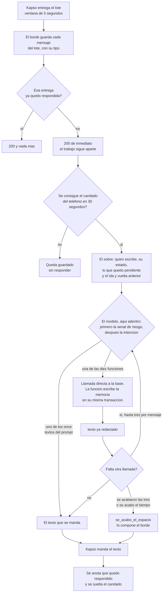

# 07 · El recorrido de un mensaje

Corte: 2026-08-29.

Este archivo cuenta lo que pasa entre que ella escribe y que le llega la respuesta: quién recibe el
mensaje, quién corre el modelo, qué frenos hay, qué se recuerda entre un mensaje y el siguiente, y
qué se siente cuando algo falla. Lo que el agente contesta está en `docs/01-conversaciones.md` y
`docs/02-funciones.md`; lo que hay que construir, en `docs/08-implementacion.md`.

**La memoria de la conversación se define aquí y sólo aquí** (§8.1). Los demás archivos la citan.

Las reglas numeradas se citan por número y viven en `docs/00-el-agente.md`. Los textos se citan por
clave y viven completos en `docs/06-textos.md`.

---

## 1. Quién hace qué

**Kapso es mensajería y nada más.** Guarda el número, guarda las plantillas, nos entrega lo que
llega y manda lo que le damos. No corre el modelo, no decide nada y no sabe qué es una cita.

**El modelo corre en nuestra función de borde**, `kapso_inbound_webhook`. Ese nombre es el que ya
está configurado en Kapso como destino del webhook del número, así que se conserva. La misma
función recibe el mensaje, arma el contexto, corre el modelo, llama a las diez funciones de la base
**directo** y manda la respuesta por Kapso.

**El modelo es `gpt-5.6-luna`**, con 2048 tokens de salida y 16 vueltas máximas de su ciclo (§7).

Un solo componente nuestro, y es a propósito: cada salto que se quita es un lugar menos donde una
conversación se puede quedar a medias.

---

## 2. El recorrido, paso a paso

1. **Ella escribe.** Meta se lo entrega a Kapso.
2. **Kapso agrupa** lo que llegue en los cinco segundos siguientes y nos entrega **un lote** (§4).
3. **El borde guarda cada mensaje del lote**, con su tipo, y mira si esa entrega ya quedó
   **respondida** (§5).
4. **Contesta 200 de inmediato** y sigue trabajando aparte (§3).
5. **Toma el candado de esa conversación** (§6).
6. **Arma el sobre:** quién es, con quién está, en qué estado, qué le permite hacer esa
   profesional, y qué plantilla le mandamos por última vez (`docs/02-funciones.md`, §7). Con él van
   la pregunta que quedó pendiente (§8.1) y el ida y vuelta anterior (§8.2). Nada de esto cuesta
   una llamada. **Aquí no se contesta nunca**, ni siquiera cuando el teléfono no se reconoce o la
   cuenta está dada de baja: ese estado se pone en el sobre y el modelo corre igual.
7. **Corre el modelo.** Primero mira si hay señal de riesgo —vale para todos los estados—, y
   después detecta la intención. Si es uno de los once textos del prompt, no llama a nada. Si es
   una intención del catálogo, llama a la función, y la función devuelve el texto ya redactado **y
   deja escrita la memoria dentro de su misma transacción**. Hasta tres llamadas en este mensaje, y
   con un presupuesto de tiempo (§7).
8. **Manda el texto** por Kapso, dentro de la conversación abierta. No encola nada: la cola de
   salida sólo produce plantillas (regla 15). Si el envío falla, se reintenta una vez a los dos
   segundos.
9. **Anota que el mensaje quedó respondido y suelta el candado.**

**La memoria no depende de que el mensaje salga.** Queda escrita en el paso 7, dentro de la
transacción de la función, no en el paso 9. Si el envío por Kapso se cae, la pregunta pendiente
sigue en pie y el mensaje siguiente retoma donde se quedó.



Es el segundo y último diagrama del repositorio. El otro, el del modelo entero, está en
`docs/00-el-agente.md` §3.

---

## 3. Por qué se contesta 200 antes de trabajar

Kapso espera la respuesta del webhook en segundos, y atender un mensaje tarda más que eso: hay que
leer, pensar, llamar a la base y redactar.

Si esperáramos a terminar para contestar, Kapso daría la entrega por fallida y **la volvería a
mandar: inmediato, 10 s, 40 s y 90 s**. El primer intento sigue vivo de nuestro lado, así que los
dos acabarían contestando y **la paciente recibiría dos respuestas** —y con dinero de por medio,
dos veces la misma acción—.

Por eso el 200 sale en cuanto el mensaje está guardado. **El 200 dice «lo recibí», no «ya lo
contesté».** Esa distinción no es retórica: es la que hace falta para que un reintento sobre un
mensaje guardado y sin responder sí se atienda (§5).

Tiene un precio y se acepta: **una vez que contestamos 200, nadie reintenta.** Si el trabajo de
segundo plano se cae después, ella no recibe nada y hay que esperar a que vuelva a escribir. Es
mejor que la alternativa, porque un reintento montado sobre trabajo que sigue corriendo duplica
respuestas y duplica citas.

Dos consecuencias de la misma regla:

- **Un lote es una solicitud.** Se contesta 200 siempre que el lote se haya podido leer, aunque no
  se conteste ningún mensaje. Un rechazo por un mensaje raro tumba la entrega completa.
- **Cualquier respuesta que no sea 200 cuenta como fallo**, los 4xx incluidos, y los fallos
  alimentan el apagado automático del §10.1.

---

## 4. El agrupamiento, y qué tipo de mensaje llegó

Por WhatsApp se escribe en ráfagas: «hola», «oye», «una pregunta», «¿qué tengo el martes?».
Contestar cada renglón por separado es lo que hace que un agente parezca tonto.

**El agrupamiento es de Kapso y ya está prendido.** Vive en el webhook del número, no en nuestro
código: ventana de **5 segundos** y lote máximo de **50** mensajes. Cada conversación tiene su
propia espera y el orden llega garantizado.

Lo único nuestro es leerlo bien, y ahí está el error clásico: **con el agrupamiento prendido, TODAS
las entregas llegan en formato de lote, aunque venga un solo mensaje.** Un código que espera un
mensaje suelto no falla a veces: falla en todas las entregas, desde la primera, y el §10.1 dice a
dónde lleva eso en quince minutos.

### 4.1 Cada renglón dice de qué tipo es

Un lote de renglones de texto pelado no sirve, porque **una foto sin texto llegaría como un renglón
vacío** y el flujo del comprobante no podría ni arrancar. Por eso el borde marca el tipo cuando el
mensaje no es texto:

| Marca | Qué llegó | A dónde va |
|---|---|---|
| *(sin marca)* | Texto | La intención que sea |
| `[imagen]` · `[pdf]` | Una foto o un PDF | `mandar_comprobante` |
| `[audio]` · `[video]` · `[sticker]` | Nota de voz, video, sticker | `no_entendi` |
| `[ubicación]` · `[contacto]` · `[archivo]` | Una ubicación, una tarjeta de contacto, cualquier otro archivo | `no_entendi` |

La marca la **escribe el borde y el modelo sólo la lee**, delante del texto que traiga el mensaje si
trae alguno. El formato del bloque de mensajes está en `docs/05-prompt.md` §3, y el enrutamiento por
tipo, en el prompt.

### 4.2 Dos cosas que vienen pegadas al agrupamiento

- **Sólo existe en el webhook estándar de Kapso.** El que reenvía el formato crudo de Meta no lo
  soporta.
- **No se sabe si el webhook nos dice a qué mensaje respondió ella** —el botón de responder de
  WhatsApp—. El formato crudo de Meta sí lo trae, pero ése no admite agrupamiento, así que no se
  pueden tener las dos cosas. **Hay que probarlo contra el número real**: no se estima. La columna
  donde iría, `reply_to_provider_message_id`, ya está en la tabla.

Y un intercambio que hay que aceptar, no arreglar: un lote listo para enviar puede perderse del
lado de Kapso antes de que exista su registro de entrega, y entonces **el lote entero desaparece
sin dejar fila**. Con una ventana de cinco segundos pasa rara vez, y cuesta menos que perder el
segundo mensaje de cada ráfaga.

---

## 5. Recibido no es atendido

Kapso reintenta cualquier entrega que no conteste 200, así que la misma ráfaga puede llegar cuatro
veces. `whatsapp_inbound_messages` lo para con dos índices únicos que ya existen:

| Llave | De qué es | Para qué sirve |
|---|---|---|
| `webhook_delivery_key` | **De la entrega**: una por lote | Reconocer que el lote entero es un reintento |
| `message_sid` | **De cada mensaje**: uno por renglón | Reconocer que ese mensaje ya se guardó |

**La llave de entrega se anota en un solo renglón del lote: el del último mensaje**, que es el que
dispara la respuesta. Los demás renglones van sin ella y se defienden con su `message_sid`. Es por
el índice: dos renglones con la misma llave chocarían, y ese choque tumbaría la entrega completa.

Se guarda también `payload_sha256`, el hash del cuerpo. Distingue un reintento idéntico —lo normal—
de la misma llave con otro contenido, que no debería ocurrir nunca y por eso hay que poder verlo.

### 5.1 Guardar el mensaje no es haberlo contestado

Los dos índices marcan **que llegó**, y eso no es lo que hay que saber. Lo que hay que saber es si
ya salió una respuesta. Si el borde se cae después de guardar y antes del 200, los cuatro reintentos
de Kapso chocan contra los índices, se descartan como duplicados, y **ella escribió, quedó guardada
y no recibe nada, nunca**.

Por eso la respuesta se anota aparte, cuando el texto sale: la hora en `processed_at` y el
identificador del mensaje que salió en `response_message_sid`. Las dos columnas ya existen en la
tabla desplegada.

Con eso, la regla queda en tres renglones:

| Lo que encuentra el borde | Qué hace |
|---|---|
| La entrega no está guardada | La guarda y la atiende |
| La entrega está guardada **y respondida** | 200 y nada más. No se ejecuta nada |
| La entrega está guardada **y sin responder** | **Se atiende**: toma el candado y trabaja |

El tercer renglón es seguro por el candado (§6): si el trabajo original sigue vivo, el reintento se
queda esperando y no duplica nada. Y si el original está muerto, el reintento es la única
oportunidad que ella tiene de recibir respuesta sin volver a escribir.

---

## 6. El candado por conversación

**Un candado por teléfono. Si llegan dos entregas del mismo teléfono al mismo tiempo, la segunda
espera a que la primera termine** (regla 16).

Sin candado, «agéndame el martes a las 4» escrito dos veces son **dos citas**: las dos lecturas ven
el hueco libre porque ninguna ha escrito todavía, y las dos escriben. Lo mismo con confirmar, con
cancelar y con el comprobante. Y aunque no se duplicara nada, las dos escribirían la memoria de la
conversación una encima de la otra, y el «la 2» del mensaje siguiente aterrizaría contra la lista
equivocada.

Es lo que más fácil se olvida, porque en una prueba a mano nunca aparece: hay que escribir dos
veces en el mismo segundo para verlo.

El agrupamiento tapa el caso frecuente —la ráfaga llega junta, en un solo lote— pero no todos: dos
mensajes separados por más de la ventana, o un reintento de Kapso montado sobre la entrega
original, llegan como dos entregas.

### 6.1 Cómo se toma, y qué pasa si no se consigue

- **Se toma con `pg_try_advisory_lock` sobre el hash del teléfono**, no sobre el mensaje. Con el
  mensaje no serviría de nada: cada entrega tiene el suyo.
- **Sobre una conexión dedicada**, que se sostiene hasta el final del trabajo y se cierra en el
  `finally`. **Nunca una del pool compartido.** Un candado de sesión sobre una conexión de pool en
  modo transacción no sobrevive a la transacción; y si sobrevive, se queda pegado a una conexión que
  después atiende a otra conversación. Con el trabajo de segundo plano corriendo hasta 60 segundos,
  eso no es un detalle de escritura: es la diferencia entre un candado y una fuga.
- **Se prueba, no se bloquea.** Si no se consigue en **30 segundos**, se abandona el mensaje: queda
  guardado, **sin marca de respuesta**, y el candado del primero sigue vivo. Ella no recibe nada de
  ese mensaje, y lo que escriba después sí se atiende.
- **Se suelta pase lo que pase**, también cuando el trabajo revienta a la mitad. Un candado atorado
  no calla un mensaje: calla la conversación entera hasta que alguien lo note.

---

## 7. El presupuesto de un mensaje

Cuatro números y un desenlace. Todos son por **mensaje**, no por gestión: una gestión se reparte
entre varios mensajes de ella, y cada mensaje trae su presupuesto entero.

| Freno | Cuánto | Por qué |
|---|---|---|
| Llamadas a funciones | **3** | Un modelo confundido llama funciones en círculo y nadie lo detiene (regla 9) |
| Vueltas del ciclo del modelo | **16** | Techo duro del bucle, por si el modelo ni siquiera llega a llamar |
| Tiempo total del trabajo | **60 segundos** | Pasado eso, el silencio ya es peor que un texto que diga la verdad |
| Cada llamada al modelo | **20 segundos** | Un proveedor lento no se lleva el presupuesto entero |

Más: **2048 tokens de salida**, y **un solo reintento** cuando el proveedor devuelve un error de red
o un 5xx. Un segundo reintento no cabe en los 60 segundos.

**El tope de tres es el freno de producto, y es más estricto que las 16 vueltas.** Qué cuenta:

- **Cuenta cada intento de llamada**: la que llega a la base, la que devuelve un «no se puede» ya
  redactado, y **la que el borde rechaza por venir malformada o por no ser una de las diez**. Si los
  rechazos no contaran, el modo de fallo para el que existe el tope —parámetros mal compuestos, una
  y otra vez— sería justo el único que nunca lo tocaría.
- **No cuentan** los once textos del prompt (`docs/06-textos.md` §1): no le preguntan nada al
  servidor.
- **No cuenta** mandar la respuesta.
- **No es una llamada malformada** un número fuera del rango de la última lista. El borde lo recorta
  a nulo y la misma función reemite su lista (`docs/02-funciones.md` §6).

Tres alcanza porque la única concatenación que el prompt autoriza son **dos llamadas en el mismo
mensaje**: la función devuelve la lista, el agente encuentra el número de lo que ella ya había
dicho, y vuelve a llamar. La tercera es margen.

### 7.1 Cuando el presupuesto se acaba

**El borde deja de despachar llamadas y manda `se_acabo_el_espacio`.** Ese texto **lo compone el
borde**, no el modelo: cuando hace falta ya no queda ninguna llamada disponible. Al modelo se le
devuelve un resultado vacío marcado como último, y si aun así escribe otra cosa, el borde la
sustituye por ese texto. Después suelta el candado.

Y el texto dice la verdad: el mensaje siguiente trae el presupuesto entero, y la memoria del §8 hace
que retome donde se quedó.

**Con una excepción que hay que respetar.** Si lo que se agotó fue una llamada **que escribe** y no
alcanzó a contestar, la mutación puede haber ocurrido igual. Antes de mandar `se_acabo_el_espacio`,
el borde **relee el estado con la función de lectura que corresponda y contesta con lo que
encuentre**. Si no lo hiciera, una cita creada acabaría contestada con «se me acabó el espacio», y
el «sí» siguiente de ella terminaría en dos citas.

### 7.2 El tope de tráfico que hoy no existe

No hay ningún tope de mensajes por teléfono, y no se inventa uno aquí: los dos frenos decididos son
el agrupamiento (§4) y el candado (§6). **Anotar la fecha: el 1 de octubre de 2026 Meta deja de dar
gratis las respuestas libres dentro de la ventana de 24 horas**, y cada respuesta del agente empieza
a costar. Ése es el día de fijar el tope, con su ventana y su texto, no antes.

---

## 8. La memoria

**Lo que el agente necesita recordar no son las palabras.** Es qué preguntó, qué función lo
preguntó, qué opciones numeradas ofreció y sobre qué cita se está trabajando. Con eso, un «la 2»
nunca aterriza en la función equivocada, **porque no lo decide el modelo**: el servidor resuelve el
2 contra la lista que él mismo acaba de escribir.

Guardar el hilo entero no serviría para eso, y además envejece: un historial contesta «qué se
dijo», no «qué es verdad». Lo que es verdad está en las citas y en los pagos, y las diez lo vuelven
a leer cada vez que corren. Lo único que sí viaja del hilo es el último ida y vuelta (§8.2), y viaja
por otro motivo.

### 8.1 La tabla

**Ésta es la única definición de la tabla en todo el repositorio.** `docs/02-funciones.md` §6.1 y
`docs/08-implementacion.md` la citan y no la vuelven a describir.

Una fila por teléfono, y lo más chica que se puede.

`public.whatsapp_conversation_state`

| Columna | Tipo | Qué guarda |
|---|---|---|
| `phone` | text, llave primaria | El teléfono. Una fila por teléfono, y no más |
| `professional_id` | uuid, nulo | La profesional elegida cuando el teléfono tiene vínculo con más de una. Nulo cuando sólo hay una |
| `waiting_function` | text, nulo | Cuál de las diez preguntó. Nulo cuando preguntó el borde |
| `waiting_for` | text, nulo | El dato que falta: uno de los siete valores de `espera` de las funciones, o `profesional` cuando preguntó el borde |
| `options` | arreglo de texto, nulo | La última lista numerada, **en el orden en que se numeró**: la posición es el número que ella dice |
| `subject` | text, nulo | **La cita ya elegida de la gestión en curso**, cuando la hay |
| `file_id` | text, nulo | **El archivo del que se preguntó**, cuando se preguntó por uno |
| `updated_at` | timestamptz | Cuándo se escribió |

Ocho columnas, y ninguna que el modelo pueda ver: en `options` va lo que significa cada número —una
cita, un servicio, un horario—, y el modelo sólo ve la lista numerada que ya venía dentro del
`texto` (regla 17). La tabla no existe todavía: hay que crearla (`docs/08-implementacion.md`).

**Quién la escribe: la función, dentro de su misma transacción.** Es la única que conoce el mapa de
los números, porque acaba de componer la lista. El borde no puede llenar `options`: el resultado
sólo trae cuatro claves y ninguna lleva ese mapa. **El borde escribe una sola cosa** —la fila de la
profesional elegida, que es la única pregunta que hace él— y limpia la fila cuando toca.

Cuándo se escribe y cuándo se limpia:

| Qué pasó | Qué le pasa a la fila |
|---|---|
| La función devuelve `cierra: false` | Se guarda: quedó algo pendiente |
| La función devuelve `cierra: true` | Se limpia: no quedó nada que retomar |
| **El modelo mandó uno de los once textos del prompt** | **Se limpia.** La gestión anterior quedó sin contestar y no se retoma con un monosílabo |
| **El modelo llamó a otra función distinta de la que preguntó** | **Se reemplaza entera.** Nunca conviven dos |
| El borde pregunta con cuál profesional | Se guarda con esa lista. Cuando ella contesta, la respuesta queda en `professional_id` y no se vuelve a preguntar |
| Pasaron más de 24 horas desde `updated_at` | Se ignora: pasado un día, un «la 2» es de otra conversación |

El renglón de los once textos del prompt cierra un agujero real. Ella pide cancelar, recibe la
pregunta, escribe algo que dispara `crisis`, y su «sí, gracias» siguiente ejecutaría la cancelación
que ya había abandonado. Ese «sí» es el monosílabo más ambiguo del idioma y del otro lado hay
dinero.

**`options` y `subject` no viven igual.** `options` se reemplaza en cuanto otra función emite otra
lista. `subject` no: se escribe cuando se resuelve el número —o cuando la función resuelve una sola
candidata sin listarla— y se borra cuando la gestión cierra. Hacen falta las dos porque una gestión
encadena varias listas y `options` sólo sobrevive a la última: cuando llega el «la 2» de las horas,
la lista que explicaba qué cita se estaba moviendo ya la borró `buscar_horarios`. Con `subject`, el
servidor sabe cuál es, tanto para escribirla como para excluirla de la búsqueda. El caso está
desarrollado en `docs/02-funciones.md` §6.1.

**`file_id` protege del archivo equivocado.** `mandar_comprobante` siempre pregunta de qué cita es
el comprobante, y entre la pregunta y la respuesta ella puede mandar otra foto. Si llega una nueva,
**la pregunta se rehace sobre la nueva** y la anterior se descarta. Sin esa columna, la pregunta
protege contra la cita equivocada y no contra el archivo equivocado, que es el mismo daño y no tiene
arreglo después (§9).

**Qué pasa si se pierde.** Nada se corrompe. Un número sólo vale contra la lista guardada, así que
sin fila **no hay manera de que un «la 2» toque la cita equivocada**. Lo que pasa es que no resuelve:
**sin fila, un número suelto se contesta `no_entendi`, y no se adivina de qué lista era.** Con fila
viva sí se puede reescribir la lista, porque la fila dice qué función la escribió. Y `pendiente`
viaja al modelo como frase corta —«no hay nada pendiente»—, nunca como un hueco en blanco. Quién es
ella y con quién está no se pierde nunca: eso lo resuelven las diez por su cuenta desde el teléfono.

### 8.2 El ida y vuelta anterior

Al modelo viaja **el último par: lo que ella escribió y lo que se le contestó.** Se lee de
`whatsapp_inbound_messages` y **sólo si tiene menos de 24 horas**.

Sin él, un mensaje que sólo contesta a la pregunta anterior no se puede atender. Ejemplo con nombres
inventados:

```
>>  hola, quiero mover mi cita
<<  Estás con más de una persona de Agenda Psi. ¿Con quién es lo que necesitas?
    1. Lucía   2. Ramiro
>>  con Ramiro
```

La intención «mover» está en el mensaje anterior. Con el par en el contexto, el modelo la ve; sin
él, lee «con Ramiro» a secas y contesta `no_entendi`.

**Y el borde no parte la conversación en dos.** Al resolver la profesional anota la fila y **sigue
en el mismo mensaje**: arma el sobre con ella puesta y corre el modelo con el lote entero. Ella no
tiene que volver a pedir lo que ya pidió.

**Un par y no más.** Dos no aportan: lo que es verdad lo vuelven a leer las funciones cada vez, y
las etiquetas que ella tiene que emparejar —«martes 1 de septiembre, 10:00»— están en ese mismo par.

### 8.3 El texto de los mensajes

Va aparte, en `whatsapp_inbound_messages`: **lo que ella escribió y lo que se le contestó**, dos
columnas nuevas en una tabla que hoy no guarda ni una palabra. Sirve para dos cosas: el par del
§8.2, y poder depurar las primeras semanas, que es cuando se mueve dinero por un camino que nadie ha
visto funcionar.

**Se guarda 30 días.** Es lo que ya hace sola la tabla: el barrido `purge_whatsapp_inbound` corre
cada hora y borra lo que pase de treinta días.

**Y hay que dejarlo dicho: ese número se fija antes de que entren pacientes de verdad, no después.**
Treinta días de conversaciones de terapia es una postura de privacidad, no un valor técnico
heredado. Hoy se fija en treinta a sabiendas; el día que se quiera menos, se cambia el barrido y no
hay nada más que tocar.

---

## 9. Los medios

Cuando ella manda una foto o un PDF del comprobante, el mensaje trae el identificador del archivo.
**Se pide una liga fresca con ese identificador y con ella se baja el archivo**, en vez de usar la
liga que viene en el webhook.

Por qué: **no se sabe si la liga del webhook caduca ni si hace falta llave para bajarla.** No está
documentado y no se ha comprobado. Pedir la liga fresca sí lo está, y funciona siempre. El día que
se compruebe lo otro se podrá ahorrar el paso; hasta entonces no se estima.

**Un lote puede traer varios archivos.** El agrupamiento entrega lotes, y mandar dos fotos seguidas
es una sola entrega con dos renglones. **Se toma el último y se dice** —el texto
`comprobante_varias_imagenes`—, y el identificador de ése es el que queda en `file_id` (§8.1). Se
toma el último porque el caso normal de mandar dos es haberse arrepentido de la primera.

El archivo se guarda y `mandar_comprobante` lo toma del renglón del mensaje entrante. Hoy no hay
una línea que lo descargue ni una columna donde anotarlo, así que **`mandar_comprobante` no
funciona aunque todo lo demás esté**. Eso está en `docs/08-implementacion.md`.

---

## 10. Los modos de fallo

| Fallo | Qué siente ella | Qué queda | Quién lo arregla |
|---|---|---|---|
| Se acaban las tres llamadas del mensaje | Lee `se_acabo_el_espacio` | La memoria intacta | Su siguiente mensaje, con el presupuesto entero |
| Se acaban los 60 segundos, o el modelo falla y el reintento también | Lee `se_acabo_el_espacio`, compuesto por el borde | La memoria intacta, el candado suelto | Su siguiente mensaje |
| Una llamada que escribe vuelve sin texto | Lee lo que el borde encuentre al releer el estado | **Nada escrito si la llamada no llegó a la base**; si la respuesta se perdió después de escribir, la mutación puede existir, y por eso se relee (§7.1) | El borde, en el mismo mensaje |
| **El envío por Kapso falla** | Silencio, y la acción sí ocurrió | La mutación, su aviso a la profesional y la memoria, escritos | Un reintento a los 2 segundos. Si vuelve a fallar, se suelta el candado; su siguiente mensaje lee el estado real |
| **El candado no se consigue en 30 segundos** | Silencio de ese mensaje | El mensaje guardado y sin marca de respuesta | El mensaje que ella escriba después |
| El borde se cae después del 200 | Silencio | El mensaje guardado, sin marca de respuesta | Su siguiente mensaje. Kapso no reintenta: ya recibió 200 |
| El borde se cae antes del 200 | Silencio | Nada, o el mensaje guardado sin respuesta | Los cuatro reintentos de Kapso: como está guardado **y sin responder**, se atiende (§5.1) |
| Se escribió la cita y el texto no salió | Silencio, y la cita existe | La mutación y el aviso a la profesional, en la misma transacción (regla 13) | Su siguiente mensaje: las diez leen el estado real y le cuentan la verdad |
| Dos entregas del mismo teléfono a la vez | La segunda respuesta tarda unos segundos | Nada raro, y una sola cita | El candado (§6) |
| Se acaba el saldo del proveedor del modelo | Silencio | El mensaje guardado | **Una persona**, avisada por monitoreo |
| Kapso apaga el webhook | Silencio del número entero, y de todas | Nada llega y nada se guarda | **Una persona**, a mano, en el panel |

### 10.1 El webhook que se apaga solo y no se vuelve a prender

Es el peor de la lista. **Kapso apaga el webhook del número cuando falla mucho: en 15 minutos, con
al menos 20 entregas, al menos 10 fallidas y 85 % o más de fallo.** Avisa por correo. **Y no lo
vuelve a prender solo.**

O sea: si nuestra función de borde se cae, o si lee mal el formato de lote, en un cuarto de hora el
número deja de recibir mensajes. No se cae una conversación: se caen todas, y siguen caídas hasta
que alguien entre al panel y lo encienda.

De ahí salen tres cosas, y ninguna es de código:

- **El agrupamiento ya está prendido**, así que el borde nuevo tiene que leer lotes desde su primer
  despliegue. Una versión que espere un mensaje suelto no falla en algunas entregas: falla en
  todas, y apaga el número en quince minutos.
- **Hace falta alerta.** Enterarse por monitoreo, no porque una paciente se queje.
- **Hace falta una persona que sepa dónde prenderlo.** Es lo único de esta lista que no se arregla
  solo ni con el mensaje siguiente.

### 10.2 La lista de monitoreo

Son tres, y las tres sólo las arregla una persona:

1. **El webhook apagado** (§10.1).
2. **El saldo del proveedor del modelo**, que se acaba en silencio: todo parece encendido y no sale
   ningún mensaje.
3. **Errores repetidos del borde**, que no son el fallo sino el aviso de que falta poco para el 1.
