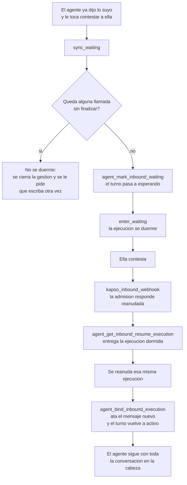

# 07 · El portero

Corte: 2026-08-27.

El portero es la parte del sistema que no habla. Cuenta llamadas, sella identidades, abre y
cierra turnos, y decide si una llamada llega a tocar la base. El agente no lo ve: sólo nota que
una herramienta contestó o que no contestó.

Las reglas numeradas se citan por número y viven en `docs/00-el-agente.md`. Los textos se citan
por clave y viven completos en `docs/06-textos.md`.

---

## 1. El recorrido de un mensaje

**1. Ella escribe.** Meta se lo entrega a Kapso y Kapso nos manda un webhook
`whatsapp.message.received` en formato v2, firmado.

**2. El borde revisa el sobre, no el contenido.** `kapso_inbound_webhook` rechaza cualquier
cuerpo mayor de 1 MiB antes de parsearlo, calcula el HMAC sobre el cuerpo crudo y lo compara en
tiempo constante, exige `payload_version: v2`, comprueba que el número de destino esté encendido
en `private.agent_runtime_targets`, y descarta un mensaje fechado más de cinco minutos en el
futuro. Todavía no sabe quién escribió ni qué dijo, y no le hace falta. Es también **el único
componente que ve el mensaje crudo de WhatsApp**, así que es el único que puede guardar una foto
o un PDF; hoy no hay una sola línea que lo haga, y sin eso `mandar_comprobante` no funciona
aunque todo lo demás esté.

**3. La admisión sella el mensaje y decide el turno.** `agent_register_inbound_context`, en una
sola transacción, hace lo que después ya nadie puede deshacer. Es el §2 entero.

**4. El despachador le pregunta a Kapso qué ejecución vive en esta conversación.** No se lo
pregunta a nuestra base, porque nuestra base no puede saberlo: cuando el agente se duerme, Kapso
no nos avisa (§5). Se queda con la primera viva —`running` y `waiting` lo son; lo demás es
terminal—. Si no hay ninguna, arranca una por API; si hay una dormida, la reanuda —**y ése es el
camino normal de una conversación**, no la excepción—; si hay una ocupada, el mensaje no llega al
agente por esta vía (§7).

**5. Se sella la ejecución con el turno.** `agent_bind_inbound_execution` escribe el
identificador de la ejecución en el turno y en el mensaje, y pasa el turno a `active`. Desde
aquí, ese par —mensaje y ejecución— es la única llave que abre el portero. **La identidad nunca
viaja en los argumentos de una herramienta.**

**6. El agente trabaja.** Cada herramienta va al portal `agent_tool_gateway`, el portal resuelve
una ruta fija —nunca un nombre de función que venga en el cuerpo—, y la función de dominio pasa
por el portero antes de tocar nada: `private.agent_claim_tool_call` para reservar y
`private.agent_finalize_tool_call` para sellar el resultado.

**7. Y el turno termina de una de tres formas:** duerme esperando su respuesta (§5), cierra
después de mutar (§3), o se muere (§8).

---

## 2. La admisión

### 2.1 El sellado de identidad

La identidad se resuelve **una vez, al admitir**, y después nadie la vuelve a preguntar.

1. **El mensaje entra al libro.** `whatsapp_inbound_messages` lo guarda con su llave de entrega y
   su hash: una segunda entrega del mismo mensaje devuelve réplica y no ejecuta nada. Y guarda
   **a cuál mensaje respondió**, que es la mitad de la pista de la última plantilla.
2. **El teléfono contra los vínculos.** `whatsapp_links` con la cuenta de la paciente todavía de
   alta. Cero vínculos es una conversación pública; uno es la gestión normal. Con más de uno, la
   profesional **la resuelve el servidor y no pregunta nunca**: la que le mandó la última
   plantilla; si no hay ninguna, la que tiene su cita viva más próxima; si tampoco, el vínculo
   más reciente. Hoy hay 19 vínculos y **cero teléfonos con dos profesionales**: la regla existe
   para que nadie tenga que decidir en caliente el día que aparezca el primero.
3. **La sesión y el turno.** La sesión vive **24 horas** —la misma ventana en que se puede
   contestar sin plantilla— y se refresca en cada entrada admitida. El turno vive el menor entre
   la sesión y **30 minutos**, y se renueva en cada movimiento: una gestión viva no vence, sólo
   vence una abandonada. Hay **un solo turno abierto por conversación**, por índice único.
4. **El sello se revalida en cada llamada, no sólo al admitir.** El portero comprueba que sesión
   y turno coincidan en conversación, teléfono, número de destino, paciente y profesional, y que
   el vínculo siga vivo. Si la profesional dio de baja a la paciente a media conversación, la
   siguiente llamada sale rechazada. Es correcto y es gratis.

### 2.2 Los topes de tráfico

Cuatro, todos en ventana móvil y todos leídos del cuerpo desplegado:

| Tope | Cuánto |
|---|---|
| Mensajes admitidos o reanudados, por teléfono | 10 en 5 minutos |
| Turnos por teléfono | 5 en 5 minutos |
| Turnos por teléfono | 30 en 24 horas |
| Turnos por profesional | 100 en 24 horas |

**El que de verdad muerde es el primero**, porque cuenta cada mensaje admitido **y cada
reanudación**, mientras que los tres de turnos sólo cuentan aperturas. Una gestión de cinco o
seis mensajes cabe de sobra; dos gestiones seguidas en cinco minutos, no. Es la razón exacta por
la que la conversación vive en **un turno abierto** y no en un turno por mensaje.

El aviso se reclama como mucho **uno cada 15 minutos por teléfono**. El texto es
`vas_muy_rapido`. **Hoy ese envío no existe:** la admisión marca el rechazo y ahí se acaba, así
que ella no recibe nada. Está en lo que hay que construir.

### 2.3 El sobre del turno

La admisión ya resolvió teléfono → paciente → profesional para poder sellar el turno; no puede
no hacerlo. Con eso mismo compone un sobre corto que viaja como variable del workflow hasta el
nodo agente. **No es una llamada: no gasta presupuesto y no puede fallar por tope.**

| Clave | Qué trae |
|---|---|
| `paciente` | Nombre de pila |
| `profesional` | Nombre de pila |
| `estado` | Si hay vínculo y la cuenta sigue de alta, si la cuenta está dada de baja, o si no hay vínculo |
| `puedo` | El menú personalizado, en prosa: sólo los verbos que esa profesional permite |
| `ultimo_aviso` | La pista de la última plantilla, ya redactada, o vacío |

Tope: **400 caracteres**. Si no cabe, se corta `ultimo_aviso`, que es lo único prescindible.

**Por eso siete desenlaces cuestan cero llamadas.** `crisis`, `fuera_de_alcance`,
`asunto_de_dinero`, `no_te_reconocemos`, `paciente_inactivo`, `no_entendi` y
`se_acabo_el_espacio` viven literales en el prompt y se rellenan con `profesional` y con
`puedo`. Ninguno le pregunta nada al servidor, así que ninguno depende de la red ni del
presupuesto. Los dos de identidad además vuelven de cualquiera de las once cuando la llamada ya
se hizo, y entonces cuestan esa llamada y ninguna más.

**El sobre sirve para hablar, no para actuar.** Las once funciones vuelven a resolver la
identidad del contexto sellado del turno, **nunca del sobre**. Ése es el corte de seguridad del
diseño y por eso el sobre puede permitirse estar viejo.

---

## 3. La gestión y el turno

**La gestión es lo que ella quiere resolver**: desde «quiero una cita» hasta que la cita queda
apartada. **El turno es la unidad del servidor**: un renglón con su presupuesto, su cuenta de
mutaciones y su vigencia.

Casi siempre son lo mismo, y ésa es la decisión que hace que agendar por texto quepa. **Entre dos
mensajes de ella el agente duerme, no cierra**, así que el turno sobrevive a sus respuestas y el
presupuesto es de la conversación entera, no de cada mensaje. Una gestión se parte en dos turnos
sólo en dos casos: cuando muta —después de mutar el turno cierra, regla 14— y cuando hubo que
recuperarla de un atasco (§8.1).

### Los estados y quién los mueve

`agent_turns.status` admite ocho valores por restricción verificada: `admitted`, `active`,
`waiting_external`, `completing`, `completed`, `rejected`, `failed`, `expired`. **Sólo seis se
escriben**: `rejected` y `failed` no los escribe ninguna función desplegada.

| De → a | Quién lo mueve | Qué exige |
|---|---|---|
| — → `admitted` | `agent_register_inbound_context` | Identidad resuelta, topes libres, ningún turno abierto en esa conversación |
| `admitted` → `active` | `agent_bind_inbound_execution` | El mensaje sin ejecución sellada y el turno sin ejecución |
| `waiting_external` → `active` | `agent_bind_inbound_execution` | Que el turno ya lleve **esa misma** ejecución |
| `active` → `waiting_external` | `agent_mark_inbound_waiting` | Cero llamadas sin finalizar, y que éste sea el último mensaje del turno |
| `active` → `completing` → `completed` | `agent_complete_inbound_from_workflow` | Lo mismo, más la reserva del cierre, que va fuera del presupuesto |
| Cualquiera abierto → `expired` | `agent_register_inbound_context` | **El siguiente mensaje de esa conversación**, si el turno venció o lleva 30 minutos quieto |

**No hay barrendero.** De los siete trabajos programados de la base, **ninguno toca
`agent_turns`**: cuatro trabajan el dominio y tres purgan filas viejas. La única cosa que expira
un turno muerto es el siguiente mensaje de esa misma conversación. Es simple y es barato, y es
también la raíz de casi todos los modos de fallo del §8. Hoy quedan **dos turnos colgados** de
agosto, uno en `active` y otro en `admitted`; los dos vencieron por vigencia, así que un mensaje
nuevo los expiraría antes de abrir el suyo.

---

## 4. El presupuesto

**Doce llamadas por gestión. Una mutación por turno. El cierre vive fuera del presupuesto**, en
su propio ordinal. Agendar gasta 3 en el camino feliz, así que quedan nueve de margen para quien
pregunta mucho, y ningún flujo pasa de 8 (la cuenta por flujo está en
`docs/01-conversaciones.md`).

Qué cuenta y qué no:

- **Cuenta** cada llamada a una de las once funciones, incluso la que no escribe nada y la que
  devuelve un «no se puede» redactado. El ordinal se asigna **al reservar**, no al terminar.
- **No cuenta** el cierre del turno, que tiene su ordinal propio y nunca refresca el presupuesto.
- **No cuenta** la sincronización de la espera: `agent_mark_inbound_waiting` no pasa por el
  portero (verificado leyendo el cuerpo desplegado). Es gratis y por eso se usa siempre. Si
  costara una llamada, una gestión de cinco mensajes gastaría cinco sólo en dormirse.
- **Una réplica exacta no recuenta.** Misma llave y misma forma de entrada devuelven el resultado
  ya sellado, sin ordinal nuevo y sin volver a ejecutar nada.

**La llave de esa réplica la fabricamos nosotros.** Kapso no pasa ningún identificador estable de
invocación, así que no hay nada que copiar: la llave se compone en el servidor con el mensaje
entrante, la ejecución sellada y un hash del conjunto exacto de parámetros, y el modelo ni la
escribe ni la ve. Si en su lugar se usara algo distinto en cada intento, el cerrojo de la réplica
no mordería nunca y un reintento del mismo comando volvería a escribir.

**Las once operaciones se reclaman como mutación siempre**, y ocho de ellas son capaces de
escribir. La llamada que al final no escribe se finaliza como rechazada **antes** de escribir, y
así no consume la mutación del turno: `reprogramar` preguntando el día, `cancelar` dando el
aviso o negándose, `confirmar` con prepago pidiendo el comprobante. **Hay que verificar contra el
cuerpo desplegado que ese camino deja el turno limpio**, porque de eso depende que una gestión de
tres llamadas no se quede sin su única mutación en la primera.

Cada mutación recibe un identificador de comando nuevo, generado en la base. El resultado sellado
que se guarda va redactado y pesa como máximo 16 KiB.

### Lo desplegado hoy son ocho

**El presupuesto vivo es de 8 llamadas, con el cierre reservado al ordinal 9. No 12.** Y ese ocho
no es una constante suelta: vive repartido en varios objetos que sólo valen si se mueven juntos.
Cuáles son y en qué orden se migran está en `docs/08-implementacion.md`.

Lo que toca decir aquí es la consecuencia. **Si se cambia sólo uno, ninguna gestión vuelve a
cerrar.** Con el tope en 12 el cierre pasa al ordinal 13; si se mueve el portero y no las funciones
de cierre, la reserva entra con 13, la comprobación la compara contra 9, levanta excepción, y el
turno se queda en `completing`. La admisión trata `completing` como ocupado, así que el mensaje
siguiente de ella tampoco pasa hasta que el turno cumpla 30 minutos quieto. No es un caso raro: es
el caso normal.

**Y hay una segunda cosa que hoy no está dada de alta: crear cita.** El portero no tiene ninguna
operación de crear cita que pueda reclamarse desde la conversación, así que agendar por texto
sale rechazado siempre. No es un permiso ni un dato: es que la operación no existe en su lista.

---

## 5. Dormir y despertar

### Por qué la sincronización es obligatoria en cada pausa

`enter_waiting` es una herramienta nativa de Kapso. Cuando el modelo la llama, Kapso duerme la
ejecución y **a nuestro servidor no llega nada**. No hay forma barata de enterarse: la lista de
eventos de webhook del proyecto es cerrada y **no existe ninguno de espera**.

Sin sincronizar, esto pasa: el agente le ofrece cinco horarios y se duerme. Nuestra base sigue
diciendo `active`. Ella contesta «el miércoles a las 6», la admisión ve un turno ocupado y lo
rechaza. **El mensaje que cierra la gestión se cae**, y así hasta que el turno expire a los 30
minutos. Como el diseño es conversacional, **casi todas las respuestas son una pausa**: esto deja
de ser el caso raro y pasa a ser el único camino.

Las reglas, todas del cuerpo desplegado:

- Se llama **inmediatamente antes** de dormir, en la misma iteración. No hay «después»: después
  de dormir el modelo no vuelve a correr.
- **Si falla, no se duerme.** Se cierra la gestión y se le pide que escriba otra vez. Un turno
  cerrado se recupera con el siguiente mensaje; un turno mentiroso, no.
- El cerrojo que la hace valer: se niega si el turno no está `active`, y se niega si queda
  **cualquier llamada sin finalizar**. Un turno no se duerme con una herramienta a medio
  terminar. Se niega también si este mensaje no es el último del turno.

Del lado de despertar, `agent_get_inbound_resume_execution` exige que la admisión haya dicho
reanudada, que el mensaje nuevo aún no tenga ejecución, que el turno esté esperando y ya lleve
ejecución sellada, más **diez** condiciones de identidad, dos de vigencia y una que descarta
mensajes viejos. Y `agent_bind_inbound_execution` es **la única función de toda la base que
escribe la ejecución en el turno**.

**Hay una red de seguridad que ya está puesta y se queda:** cuando la admisión contesta ocupado,
el despachador igual le pregunta a Kapso, y si la ejecución está dormida la reanuda de todas
formas. Olvidar la sincronización ensucia el libro mayor pero no tira la conversación.

### Las trece piezas

`enter_waiting`; la herramienta `sync_waiting`; la función de Kapso que la ejecuta; la ruta de
espera del portal; el portal `agent_tool_gateway`; `agent_mark_inbound_waiting`; `agent_turns`;
`agent_tool_calls`; `agent_sessions`; `whatsapp_inbound_messages`;
`agent_get_inbound_resume_execution`; `agent_bind_inbound_execution`; y el bloque de entrada
—`agent_register_inbound_context`, `private.agent_runtime_targets`, `kapso_inbound_webhook` y su
webhook—.

**Está verificado extremo a extremo y nunca se ha ejercido en producción.** Cero de seis turnos
llegaron a esperar, cero de diez mensajes entraron como reanudación, y cero invocaciones de la
función de espera en treinta días. **La primera vez que el agente nuevo intente dormirse será la
primera vez que ese camino corra de verdad.**

---

## 6. La memoria

**Dentro de una gestión, la ejecución es la memoria.** Cada reanudación continúa la misma
ejecución y el chat está persistido del lado de Kapso, así que el modelo ve la conversación
entera sin que nosotros guardemos nada: los servicios que listó hace tres mensajes, los cinco
horarios que ofreció con sus etiquetas, y que ella ya dijo «en línea». Y los números de lista
siguen valiendo, porque **quien los mata es el cambio de turno, no el reloj**. Ésa es toda la
memoria que una gestión necesita, y no cuesta ni una llamada ni una fila.

**Entre gestiones no queda nada más que lo que la admisión vuelva a componer.** Cuando el turno
cierra o expira, la ejecución muere y con ella el transcript y los números. Al volver, el
contexto es el sobre del §2.3 y nada más; los datos los vuelve a resolver por dentro la función
que se llame. **El costo honesto es que ella repite la intención, no los datos**: el agente no le
pregunta quién es ni con quién va, sí le pregunta qué quería hacer. Y con la pista de la última
plantilla, muchas veces ni eso.

**Por qué no una tabla de resumen.** Sería una segunda copia del estado, escrita por el modelo,
que envejece en cuanto la profesional toque su app. Por lo mismo tampoco se lee el historial de
chat: contesta «qué se dijo», no «qué es verdad». Lo que importa al volver no es que ella haya
escrito «ya te mando el comprobante», sino si hay un comprobante pegado. **La única memoria que
no miente es la que ya está en las citas y en los pagos.**

---

## 7. El agrupamiento de mensajes

Por WhatsApp se escribe en ráfagas, y agendar por texto se conversa exactamente así.

### Qué pasa hoy con el segundo mensaje de una ráfaga

Ella manda «quiero cita» y, dos segundos después, «para el martes». El primero abre el turno. El
segundo llega, la admisión encuentra el turno abierto y lo rechaza como ocupado; el despachador
le pregunta a Kapso, la ejecución está corriendo y no dormida, y el mensaje se descarta de
nuestro lado con un 200. **Doscientos y nada: el mensaje sale de nuestra bitácora, y como
contestamos 200, Kapso ni siquiera reintenta.**

Y hay algo peor. Del lado de Kapso, una ejecución que está corriendo en un paso de agente
**inyecta el mensaje por su cuenta**, así que el modelo puede verlo por un camino que nuestra
bitácora nunca registra: sin fila, sin admisión y sin idempotencia. El libro mayor y la
conversación dejan de contar la misma historia, y si ese mensaje traía una instrucción de dinero,
después nadie puede reconstruir de dónde salió.

### El contrato del lote

| # | Regla | Por qué |
|---|---|---|
| 1 | **Un lote es una solicitud.** Se contesta 200 siempre que el lote se haya podido leer, aunque la admisión lo rechace | Kapso espera un 200 por lote entero; un 422 por un mensaje raro tumba la entrega completa |
| 2 | Se agrupa **por conversación**, con una ventana de pocos segundos y tope chico | Es lo que dura una ráfaga real. El número exacto sigue sin decidirse |
| 3 | **Se sella un solo mensaje: el último.** Los textos de los anteriores viajan como contenido | Ver abajo |
| 4 | La respuesta contesta **la intención completa**, no el último renglón | Ella dijo dos cosas y espera que se le contesten las dos |
| 5 | El agrupamiento propio del workflow, ya encendido, **no sustituye a esto** | Agrupa lo que Kapso inyecta dentro de la ejecución; no agrupa las entregas a nuestro webhook, que llegan una por mensaje |

**Por qué sólo el último.** Un lote lleva **una sola** cabecera de idempotencia para N mensajes, y
la llave de entrega es única en la tabla de entradas: registrar cada mensaje con esa misma llave
haría que el segundo chocara contra el índice y la admisión levantara un desajuste de réplica,
que es un 409, que es no-200. Y derivar una llave por mensaje tampoco sirve: entonces el primero
abre el turno y **todos los demás rebotan como ocupados**, que es exactamente el defecto que
veníamos a arreglar. Además, el último mensaje es el que esperan ver las guardas de «hay un
mensaje posterior»: sellar el primero dejaría al agente sin poder dormirse.

### Por qué encenderlo antes de que el código acepte lotes deja al agente mudo

Con el agrupamiento encendido, **toda entrega pasa a formato de lote, incluso un mensaje solo**.
Y hoy hay dos cerrojos independientes en el borde que rechazan un lote con 422. La secuencia es
mecánica:

1. Cada entrega falla con 422.
2. Kapso reintenta: inmediato, 10 s, 40 s y 90 s. Los cuatro fallan. **Cualquier respuesta que no
   sea 200 cuenta como fallo, los 4xx incluidos.**
3. Se dispara la pausa automática: en 15 minutos con **≥20 entregas, ≥10 fallidas y ≥85 % de
   fallo**, Kapso apaga el webhook y avisa por correo.
4. **No vuelve a intentar hasta que alguien lo rehabilita a mano.**

O sea: encender el interruptor sin tocar el código **apaga el agente entero en un cuarto de hora
y no se recupera solo**. Primero el borde aprende a leer lotes, después se enciende. Nunca al
revés.

Y un intercambio que hay que aceptar, no arreglar: un lote listo para enviar puede tratarse como
basura de limpieza antes de crear su registro de entrega, y **el lote entero desaparece sin dejar
fila**. Encenderlo cambia «perder el segundo mensaje de una ráfaga, siempre» por «perder un lote
completo, rara vez». Con una ventana de pocos segundos el cambio vale la pena, pero es un cambio,
no una mejora limpia.

---

## 8. Los modos de fallo

| Fallo | Qué ve ella | Qué queda en la base | Quién limpia |
|---|---|---|---|
| Resultado de herramienta perdido | Silencio a media frase | Reserva abierta, gestión trabada | Su siguiente mensaje, con §8.1 |
| Presupuesto de la gestión agotado | El texto `se_acabo_el_espacio` | Turno abierto, nada corrupto | Su siguiente mensaje |
| Presupuesto de por vida de la ejecución | Silencio | Turno abierto, nada corrupto | Su siguiente mensaje |
| Gestión trabada por reserva abierta | Silencio | Ni duerme ni cierra | Su siguiente mensaje, con §8.1 |
| El hueco se ocupa mientras conversan | Las alternativas del mismo día | La reserva sellada como rechazada; la cita no | Nadie: la cita nunca se escribió |
| Ejecución muerta con dinero movido | Silencio | La mutación sellada, el mensaje a ella sin mandar | Su siguiente mensaje |
| Créditos de IA agotados | Silencio | Turno abierto | Una persona, avisada por monitoreo |

### 8.1 La ejecución que muere con el resultado perdido

Es el peor, y está confirmado por ingeniería de Kapso: una herramienta puede terminar bien **sin
que se persista su respuesta**. El reintento global de la plataforma vuelve a empujar la
ejecución, el proveedor rechaza un transcript con una llamada sin resultado, y la ejecución pasa
a fallida, que es **terminal**. No hay defensa por reintento.

**Qué ve ella:** nada. El agente se calla a media frase.

**Qué queda:** depende de dónde se perdió. Si el portal alcanzó a contestar, la llamada está
finalizada y el resultado sellado. Si no —el portal aborta cada llamada a la base a los 2
segundos, y **eso no revierte la transacción**—, la reserva queda abierta sin desenlace. Y una
reserva abierta **traba la gestión entera**: ni se puede dormir, ni se puede cerrar, y cualquier
mutación nueva sale rechazada.

**Quién limpia:** hoy, nadie hasta que el turno cumpla 30 minutos quieto y el siguiente mensaje
lo expire. **Media hora de conversación muerta**, con ella escribiendo.

**Lo que hay que agregar es una función de control, no un barrendero.** Cuando la admisión
conteste ocupado, el despachador ya le pregunta a Kapso; si Kapso responde que **no hay ninguna
ejecución viva** en esa conversación, la gestión está muerta por definición: se expira el turno,
se abre uno nuevo con la misma sesión y la misma pareja, y se reapunta este mismo mensaje al
turno nuevo, todo en una transacción. **Con un guardia, porque tal cual mataría gestiones sanas:**
se recupera sólo si el turno abierto **ya tiene ejecución sellada**. Sin ese guardia, un mensaje
que entró hace un instante y cuyo arranque va en vuelo tiraría un turno que estaba a punto de
sellarse.

Dos cosas más que hay que decir. **No es gratis:** el turno nuevo cuenta para el tope de cinco
turnos por teléfono en cinco minutos, así que una conversación que se traba tres veces se come
ese margen. Si el monitoreo ve recuperaciones repetidas en el mismo teléfono, el problema no es
el tope. **Y la única señal que hay** es buscar, en los eventos de la ejecución, una llamada de
herramienta sin su respuesta.

### 8.2 El presupuesto agotado — son dos, y se sienten distinto

**El de la gestión** es el de las doce llamadas. Cuando se acaba, el portero rechaza y el agente
**sí puede hablar**, porque mandar el mensaje es una herramienta nativa que no pasa por el
portero. Por eso este caso no es silencio: tiene texto, y es `se_acabo_el_espacio`. Y es verdad
literal: el siguiente mensaje abre una gestión nueva con el presupuesto entero.

**El de por vida de la ejecución** es otro: un tope de pasos por ejecución, distinto y superior
al de iteraciones, y **cada reanudación continúa la misma ejecución**. La cifra no está
documentada. Es el sospechoso número uno si vemos ejecuciones que mueren después de muchos
mensajes, y conversando importa más que antes, porque ahora una gestión son cinco o seis
reanudaciones en vez de una. Está acotado por construcción: el turno se expira a los 30 minutos
quieto y el despachador termina la ejecución dormida antes de abrir la nueva, así que una
ejecución no vive más allá de su racha de actividad.

### 8.3 La gestión trabada

Es el mismo nudo del §8.1 visto desde el otro lado, y tiene una causa que no es un fallo de red:
**ella escribió dos veces seguidas**. Son dos daños distintos y sólo uno traba el turno. El
frecuente es el mensaje fantasma del §7: entra al contexto del modelo sin fila y sin admisión, y
nada se traba. **El raro es que los dos entren al mismo turno**, cuando llegan mientras el turno
sigue esperando y antes de que aterrice el sello del primero: los dos se admiten contra el mismo
turno, el segundo queda como el último, y la sincronización del primero devuelve falso. El agente
no se puede dormir y el turno se queda activo con la ejecución dormida de todos modos.

**Qué ve ella:** en el primero, una respuesta que ignora la mitad de lo que dijo; en el segundo,
silencio hasta que vuelva a escribir. **Quién limpia:** la red de seguridad del §5 y, si falla,
la recuperación del §8.1. **Y los dos desaparecen de raíz con el agrupamiento del §7**, porque
los mensajes llegan juntos, sólo el último se sella, y los anteriores entran como contenido con
su fila y su idempotencia.

### 8.4 El hueco que se ocupa mientras conversan

Ella ve el miércoles a las 6 libre, se tarda cuatro minutos decidiendo, y alguien más lo toma.

**Qué ve ella:** las alternativas del mismo día, ya renumeradas, en una sola llamada: `agendar`
vuelve a buscar por dentro y devuelve `hecho: false` con las opciones nuevas. No es un rechazo.

**Qué queda:** la cita, nunca. La autoridad es la exclusión de traslapes entre citas vivas, más
los candados de fila. **La disponibilidad nunca se cree entre la lectura y la escritura: la
escritura es la única verdad.**

Una consecuencia contable: un intento perdido **no** gasta la mutación de la gestión —la cuenta
sólo sube cuando algo se comprometió— pero **sí** gasta un renglón del presupuesto, porque el
ordinal se asigna al reservar.

### 8.5 La ejecución que muere con dinero a medio mover

Los dos casos reales son guardar un comprobante y mover una cita.

**Si el portal alcanzó a contestar**, la mutación quedó sellada y lo único que se perdió es el
mensaje a ella. **La profesional sí se enteró**, porque su aviso viaja dentro de la misma
transacción: ése es el punto de meterlo ahí y no en un paso aparte (regla 13). Ella vuelve a
escribir, la función lee las citas y los pagos —no el libro mayor— y le cuenta la verdad.
Recuperación gratis.

**Si el portal se pasó de tiempo**, la reserva queda abierta y la gestión trabada, igual que el
§8.1. El dinero pudo haberse movido y hoy nadie reconcilia. **La respuesta barata y correcta es
no reconciliar:** que las once funciones lean siempre el estado real. Y si el desenlace se selló
como desconocido, el turno queda bloqueado para cualquier mutación posterior, a propósito: nadie
afirma que un efecto ocurrió sin saberlo.

### 8.6 Los créditos de IA se agotan

Los créditos de IA son un libro contable **distinto** del de los mensajes del plan. Al agotarse,
el workflow parece activo y el agente parece estar escribiendo, pero no sale ningún mensaje.

**Qué ve ella:** silencio, indistinguible de los otros. **Quién limpia:** una persona, porque es
lo único de esta lista que no se arregla solo.

**La lista de monitoreo son tres cosas y las tres sólo las arregla una persona:** los créditos de
IA, la pausa automática del webhook (§7), y las recuperaciones repetidas en un mismo teléfono
(§8.1), que no son el fallo sino su síntoma.
