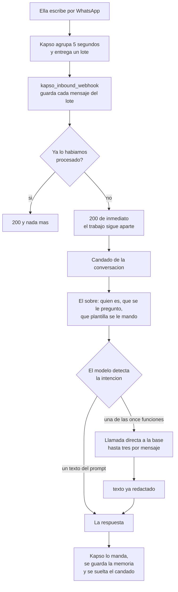

# 07 · El recorrido de un mensaje

Corte: 2026-08-28.

Este archivo cuenta lo que pasa entre que ella escribe y que le llega la respuesta: quién recibe el
mensaje, quién corre el modelo, qué frenos hay, qué se recuerda entre un mensaje y el siguiente, y
qué se siente cuando algo falla. Lo que el agente contesta está en `docs/01-conversaciones.md` y
`docs/02-funciones.md`; lo que hay que construir, en `docs/08-implementacion.md`.

Las reglas numeradas se citan por número y viven en `docs/00-el-agente.md`. Los textos se citan por
clave y viven completos en `docs/06-textos.md`.

---

## 1. Quién hace qué

**Kapso es mensajería y nada más.** Guarda el número, guarda las plantillas, nos entrega lo que
llega y manda lo que le damos. No corre el modelo, no decide nada y no sabe qué es una cita.

**El modelo corre en nuestra función de borde**, `kapso_inbound_webhook`. Ese nombre es el que ya
está configurado en Kapso como destino del webhook del número, así que se conserva. La misma
función recibe el mensaje, arma el contexto, corre el modelo, llama a las once funciones de la base
**directo** y manda la respuesta por Kapso.

Un solo componente nuestro, y es a propósito: cada salto que se quita es un lugar menos donde una
conversación se puede quedar a medias.

---

## 2. El recorrido, paso a paso

1. **Ella escribe.** Meta se lo entrega a Kapso.
2. **Kapso agrupa** lo que llegue en los cinco segundos siguientes y nos entrega **un lote** (§4).
3. **El borde guarda cada mensaje del lote** y descarta los que ya había procesado (§5).
4. **Contesta 200 de inmediato** y sigue trabajando aparte (§3).
5. **Toma el candado de esa conversación** (§6).
6. **Arma el sobre:** quién es, con quién está, en qué estado, qué le permite hacer esa
   profesional, y qué plantilla le mandamos por última vez (`docs/02-funciones.md`, §7). Con él va
   lo que se le preguntó en el mensaje anterior y qué opciones se le ofrecieron (§8). Nada de esto
   cuesta una llamada: sale de lo que la función de borde ya tuvo que resolver para saber de quién
   es el mensaje.
7. **Corre el modelo.** Detecta la intención. Si es uno de los textos que viven en el prompt, no
   llama a nada. Si es una intención del catálogo, llama a la función y la función devuelve el
   texto ya redactado. **Hasta tres llamadas en este mensaje** (§7).
8. **Manda el texto** por Kapso, dentro de la conversación abierta. No encola nada: la cola de
   salida sólo produce plantillas (regla 15).
9. **Guarda la memoria y suelta el candado.**

---

## 3. Por qué se contesta 200 antes de trabajar

Kapso espera la respuesta del webhook en segundos, y atender un mensaje tarda más que eso: hay que
leer, pensar, llamar a la base y redactar.

Si esperáramos a terminar para contestar, Kapso daría la entrega por fallida y **la volvería a
mandar: inmediato, 10 s, 40 s y 90 s**. El primer intento sigue vivo de nuestro lado, así que los
dos acabarían contestando y **la paciente recibiría dos respuestas** —y con dinero de por medio,
dos veces la misma acción—.

Por eso el 200 sale en cuanto el mensaje está guardado. **El 200 dice «lo recibí», no «ya lo
contesté».**

Tiene un precio y se acepta: **una vez que contestamos 200, nadie reintenta.** Si el trabajo de
segundo plano se cae después, ella no recibe nada y hay que esperar a que vuelva a escribir. Es
mejor que la alternativa, porque un reintento montado sobre trabajo que sigue corriendo duplica
respuestas y duplica citas.

Dos consecuencias de la misma regla:

- **Un lote es una solicitud.** Se contesta 200 siempre que el lote se haya podido leer, aunque no
  se conteste ningún mensaje. Un rechazo por un mensaje raro tumba la entrega completa.
- **Cualquier respuesta que no sea 200 cuenta como fallo**, los 4xx incluidos, y los fallos
  alimentan el apagado automático del §10.1.

---

## 4. El agrupamiento

Por WhatsApp se escribe en ráfagas: «hola», «oye», «una pregunta», «¿qué tengo el martes?».
Contestar cada renglón por separado es lo que hace que un agente parezca tonto.

**El agrupamiento es de Kapso y ya está prendido.** Vive en el webhook del número, no en nuestro
código: ventana de **5 segundos** y lote máximo de **50** mensajes. Cada conversación tiene su
propia espera y el orden llega garantizado.

Lo único nuestro es leerlo bien, y ahí está el error clásico: **con el agrupamiento prendido, TODAS
las entregas llegan en formato de lote, aunque venga un solo mensaje.** Un código que espera un
mensaje suelto no falla a veces: falla en todas las entregas, desde la primera, y el §10.1 dice a
dónde lleva eso en quince minutos.

Dos cosas que vienen pegadas al agrupamiento y no se pueden separar:

- **Sólo existe en el webhook estándar de Kapso.** El que reenvía el formato crudo de Meta no lo
  soporta.
- **No se sabe si el webhook nos dice a qué mensaje respondió ella** —el botón de responder de
  WhatsApp—. El formato crudo de Meta sí lo trae, pero ése no admite agrupamiento, así que no se
  pueden tener las dos cosas. **Hay que probarlo contra el número real**: no se estima. La columna
  donde iría, `reply_to_provider_message_id`, ya está en la tabla.

Y un intercambio que hay que aceptar, no arreglar: un lote listo para enviar puede perderse del
lado de Kapso antes de que exista su registro de entrega, y entonces **el lote entero desaparece
sin dejar fila**. Con una ventana de cinco segundos pasa rara vez, y cuesta menos que perder el
segundo mensaje de cada ráfaga.

---

## 5. El mismo mensaje no se procesa dos veces

Kapso reintenta cualquier entrega que no conteste 200, así que la misma ráfaga puede llegar cuatro
veces. `whatsapp_inbound_messages` lo para con dos índices únicos que ya existen:

| Llave | De qué es | Qué pasa si se repite |
|---|---|---|
| `webhook_delivery_key` | **De la entrega**: una por lote | El lote entero es un reintento. Se contesta 200 y no se ejecuta nada |
| `message_sid` | **De cada mensaje**: uno por renglón | Ese mensaje ya se guardó. Se salta, y los demás del lote siguen |

**La llave de entrega se anota en un solo renglón del lote: el del último mensaje**, que es el que
dispara la respuesta. Los demás renglones van sin ella y se defienden con su `message_sid`. Es por
el índice: dos renglones con la misma llave chocarían, y ese choque tumbaría la entrega completa.

Se guarda también `payload_sha256`, el hash del cuerpo. Distingue un reintento idéntico —lo normal—
de la misma llave con otro contenido, que no debería ocurrir nunca y por eso hay que poder verlo.

---

## 6. El candado por conversación

**Un candado por teléfono. Si llegan dos entregas del mismo teléfono al mismo tiempo, la segunda
espera a que la primera termine.**

Sin candado, «agéndame el martes a las 4» escrito dos veces son **dos citas**: las dos lecturas ven
el hueco libre porque ninguna ha escrito todavía, y las dos escriben. Lo mismo con confirmar, con
cancelar y con el comprobante. Y aunque no se duplicara nada, las dos escribirían la memoria de la
conversación una encima de la otra, y el «la 2» del mensaje siguiente aterrizaría contra la lista
equivocada.

Es lo que más fácil se olvida, porque en una prueba a mano nunca aparece: hay que escribir dos
veces en el mismo segundo para verlo.

El agrupamiento tapa el caso frecuente —la ráfaga llega junta, en un solo lote— pero no todos: dos
mensajes separados por más de la ventana, o un reintento de Kapso montado sobre la entrega
original, llegan como dos entregas.

Dos condiciones que el candado tiene que cumplir. **Se toma con el teléfono**, no con el mensaje, o
no serviría de nada. Y **se suelta pase lo que pase**, también cuando el trabajo revienta a la
mitad: un candado atorado no calla un mensaje, calla la conversación entera hasta que alguien lo
note.

---

## 7. Tres llamadas por mensaje

**El tope es por mensaje, no por conversación.** Una gestión se reparte entre varios mensajes de
ella, y **cada mensaje trae sus tres llamadas**. Agendar gasta cuatro en total y ninguna comparte
mensaje con otra, así que el tope no lo roza; la cuenta por flujo está en
`docs/01-conversaciones.md`.

El tope existe para una sola cosa: **un modelo confundido llama funciones en círculo y nadie lo
detiene.** El bucle del agente ahora es nuestro, así que el freno también.

Qué cuenta y qué no:

- **Cuenta** cada llamada a una de las once, incluso la que no escribe nada y la que devuelve un
  «no se puede» ya redactado.
- **No cuentan** los textos que viven en el prompt. Crisis, dinero, fuera de alcance, no te
  reconocemos, cuenta inactiva, con cuál profesional, no te entendí y se acabó el espacio no le
  preguntan nada al servidor.
- **No cuenta** mandar la respuesta.

Tres alcanza porque la única concatenación que el prompt autoriza son **dos llamadas en el mismo
mensaje**: la función devuelve la lista, el agente encuentra el número de lo que ella ya había
dicho, y vuelve a llamar (`docs/02-funciones.md`, §6). La tercera es margen.

Al agotarse, el modelo manda `se_acabo_el_espacio` y cierra. **Y ese texto dice la verdad literal:**
el mensaje siguiente trae tres llamadas nuevas, y la memoria del §8 hace que retome donde se quedó.

---

## 8. La memoria

**Lo que el agente necesita recordar no son las palabras.** Es qué preguntó, qué función lo
preguntó, y qué opciones numeradas ofreció. Con eso, un «la 2» nunca aterriza en la función
equivocada, **porque no lo decide el modelo**: el servidor resuelve el 2 contra la lista que él
mismo acaba de escribir.

Guardar el hilo entero no serviría para eso, y además envejece: un historial contesta «qué se
dijo», no «qué es verdad». Lo que es verdad está en las citas y en los pagos, y las once lo vuelven
a leer cada vez que corren.

### 8.1 La tabla

Una fila por teléfono, y lo más chica que se puede.

`public.whatsapp_conversation_state`

| Columna | Tipo | Qué guarda |
|---|---|---|
| `phone` | text, llave primaria | El teléfono. Una fila, y se reemplaza entera |
| `professional_id` | uuid, nulo | La profesional elegida cuando el teléfono tiene vínculo con más de una. Nulo cuando sólo hay una |
| `waiting_for` | text, nulo | El dato que falta: el mismo valor que la función devolvió en `espera`, o `profesional` cuando la pregunta la hizo el borde |
| `waiting_function` | text, nulo | Cuál de las once lo preguntó. Nulo cuando preguntó el borde |
| `options` | arreglo de texto, nulo | Lo que se ofreció, **en el orden en que se numeró**: la posición es el número que ella dice |
| `updated_at` | timestamptz | Cuándo se escribió |

Seis columnas, y ninguna que el modelo pueda ver: **la fila la escribe y la lee el servidor**. En
`options` va lo que significa cada número —una cita, un servicio, un horario—; el modelo sólo ve la
lista numerada que ya venía dentro del `texto`.

Cuándo se escribe y cuándo se limpia:

- La función devuelve `cierra: false` → se guarda la fila: quedó algo pendiente.
- La función devuelve `cierra: true` → se limpia: no quedó nada que retomar.
- El borde pregunta con cuál profesional → se guarda la fila con esa lista. La respuesta queda en
  `professional_id` y no se vuelve a preguntar.
- Otra función emite otra lista → **se reemplaza entera**. Nunca conviven dos.
- Una fila de más de 24 horas se ignora, que es la ventana en la que se puede contestar sin
  plantilla.

**Qué pasa si se pierde.** Nada se corrompe. Un número sólo vale contra la lista guardada, así que
sin fila **no hay manera de que un «la 2» toque la cita equivocada**: sencillamente no resuelve, y
se contesta reescribiendo la lista. El costo es un mensaje de más. Quién es ella y con quién está
no se pierde nunca, porque eso lo resuelven las once por su cuenta desde el teléfono.

### 8.2 El texto de los mensajes

Va aparte, en `whatsapp_inbound_messages`: **lo que ella escribió y lo que se le contestó**, dos
columnas nuevas en una tabla que ya se limpia sola a los 30 días. No es para el agente, es para
poder depurar las primeras semanas: hoy la base no guarda ni una palabra de ninguna conversación de
WhatsApp, y por ahí se mueve dinero.

**Y hay que decidir cuántos días se guardan antes de que entren pacientes de verdad.** Treinta días
de conversaciones de terapia es una postura de privacidad, no un valor técnico. Se puede borrar el
texto a los siete días y dejar el registro. Es una decisión de producto y hay que tomarla, no
heredarla del valor que ya trae la tabla.

---

## 9. Los medios

Cuando ella manda una foto o un PDF del comprobante, el mensaje trae el identificador del archivo.
**Se pide una liga fresca con ese identificador y con ella se baja el archivo**, en vez de usar la
liga que viene en el webhook.

Por qué: **no se sabe si la liga del webhook caduca ni si hace falta llave para bajarla.** No está
documentado y no se ha comprobado. Pedir la liga fresca sí lo está, y funciona siempre. El día que
se compruebe lo otro se podrá ahorrar el paso; hasta entonces no se estima.

El archivo se guarda y `mandar_comprobante` lo toma del renglón del mensaje entrante. Hoy no hay
una línea que lo descargue ni una columna donde anotarlo, así que **`mandar_comprobante` no
funciona aunque todo lo demás esté**. Eso está en `docs/08-implementacion.md`.

---

## 10. Los modos de fallo

| Fallo | Qué siente ella | Qué queda | Quién lo arregla |
|---|---|---|---|
| Se acaban las tres llamadas del mensaje | Lee `se_acabo_el_espacio` | La memoria intacta | Su siguiente mensaje, con tres llamadas nuevas |
| Una llamada vuelve sin texto | Lee `se_acabo_el_espacio` | Nada escrito: cada mutación se lee de vuelta dentro de su transacción antes de contestar | Su siguiente mensaje |
| El proveedor del modelo falla o tarda de más | Silencio | El mensaje guardado, el candado suelto | Su siguiente mensaje |
| El borde se cae después del 200 | Silencio | El mensaje guardado, sin respuesta | Su siguiente mensaje. Kapso no reintenta: ya recibió 200 |
| El borde se cae antes del 200 | Silencio | Nada, o el mensaje guardado sin respuesta | Los cuatro reintentos de Kapso. Si entra uno, contesta una sola vez (§5) |
| Se escribió la cita y el texto no salió | Silencio, y la cita existe | La mutación y el aviso a la profesional, escritos en la misma transacción (regla 13) | Su siguiente mensaje: las once leen el estado real y le cuentan la verdad |
| Dos entregas del mismo teléfono a la vez | La segunda respuesta tarda unos segundos | Nada raro, y una sola cita | El candado (§6) |
| Se acaba el saldo del proveedor del modelo | Silencio | El mensaje guardado | **Una persona**, avisada por monitoreo |
| Kapso apaga el webhook | Silencio del número entero, y de todas | Nada llega y nada se guarda | **Una persona**, a mano, en el panel |

### 10.1 El webhook que se apaga solo y no se vuelve a prender

Es el peor de la lista. **Kapso apaga el webhook del número cuando falla mucho: en 15 minutos, con
al menos 20 entregas, al menos 10 fallidas y 85 % o más de fallo.** Avisa por correo. **Y no lo
vuelve a prender solo.**

O sea: si nuestra función de borde se cae, o si lee mal el formato de lote, en un cuarto de hora el
número deja de recibir mensajes. No se cae una conversación: se caen todas, y siguen caídas hasta
que alguien entre al panel y lo encienda.

De ahí salen tres cosas, y ninguna es de código:

- **El agrupamiento ya está prendido**, así que el borde nuevo tiene que leer lotes desde su primer
  despliegue. Una versión que espere un mensaje suelto no falla en algunas entregas: falla en
  todas, y apaga el número en quince minutos.
- **Hace falta alerta.** Enterarse por monitoreo, no porque una paciente se queje.
- **Hace falta una persona que sepa dónde prenderlo.** Es lo único de esta lista que no se arregla
  solo ni con el mensaje siguiente.

### 10.2 La lista de monitoreo

Son tres, y las tres sólo las arregla una persona:

1. **El webhook apagado** (§10.1).
2. **El saldo del proveedor del modelo**, que se acaba en silencio: todo parece encendido y no sale
  ningún mensaje.
3. **Errores repetidos del borde**, que no son el fallo sino el aviso de que falta poco para el 1.
