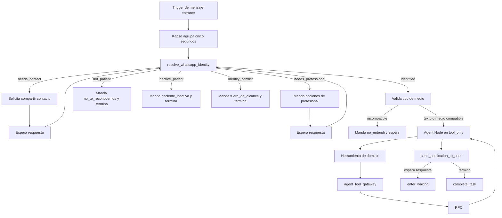

# 07 · El recorrido de un mensaje

Este archivo es el dueño del workflow de Kapso, la identidad de WhatsApp, la espera, la frontera
con Supabase, la idempotencia y los modos de fallo. No define reglas de agenda ni textos.

Documentación oficial de referencia:

- [Agent Node](https://docs.kapso.ai/docs/flows/step-types/agent-node)
- [Function Node](https://docs.kapso.ai/docs/flows/step-types/function-node)
- [Variables y contexto](https://docs.kapso.ai/docs/flows/variables-and-context)
- [Business-Scoped User IDs](https://docs.kapso.ai/docs/whatsapp/business-scoped-user-ids)
- [Solicitud de contacto](https://docs.kapso.ai/docs/whatsapp/send-messages/request-contact-info)

---

## 1. El workflow final



No hay cron para contestar el chat, ni una cola que despierte cada dos segundos. La respuesta se
produce dentro de la ejecución que abrió el mensaje entrante. `whatsapp_outbox` no participa.

---

## 2. Entrada y agrupamiento

El trigger escucha los mensajes entrantes del número de Agenda Psi. El agrupamiento de Kapso usa
una ventana de cinco segundos. Todo lo recibido en esa ventana es **un batch y una solicitud**,
aunque contenga varios renglones.

El workflow conserva:

- los mensajes del batch y su WAMID;
- tipo, texto y medios;
- `context.contact.id` de Kapso;
- conversación y número receptor;
- teléfono, cuando el evento lo trae;
- BSUID, BSUID padre y nombre de usuario cuando WhatsApp los entrega.

Esos valores son contexto del canal. No se copian al `input` que controla el modelo.

Un batch recibe como máximo una respuesta visible. Si contiene dos mutaciones distintas, el agente
atiende una y usa `pendiente_lo_otro`; no ejecuta ambas silenciosamente.

---

## 3. `resolve_whatsapp_identity`

Es una Function Node determinista y corre antes del Agent Node. No clasifica intención y no usa el
modelo. Su resultado tiene uno de estos estados:

| Estado | Significado | Siguiente paso |
|---|---|---|
| `identified` | Hay una relación activa y una profesional resuelta | Agent Node |
| `needs_contact` | Llegó un BSUID no ligado y no hay teléfono confiable | Solicitar contacto y esperar |
| `needs_professional` | La misma identidad tiene más de una relación activa | Mostrar una lista fija y esperar |
| `not_patient` | No existe relación en `whatsapp_links` después de agotar la resolución válida | `no_te_reconocemos` y fin |
| `inactive_patient` | Sí existe la relación, pero está inactiva | `paciente_inactivo` y fin |
| `identity_conflict` | BSUID y teléfono apuntan a relaciones locales incompatibles | No unir; `fuera_de_alcance`, registrar y fin |

`not_patient` no significa “rechazado” en general. Una persona con vínculo inactivo es
`inactive_patient`, conserva su relación local y recibe otro mensaje. Esta separación se prueba de
punta a punta.

### 3.1 Orden de resolución

1. Obtener `business_portfolio_id` desde una configuración confiable del servidor que mapea el
   `phone_number_id` receptor. No se usa el WABA `business_account_id` como sustituto.
2. Buscar por `(business_portfolio_id, business_scoped_user_id)`.
3. Si no resuelve, buscar por `kapso_contact_id` como ancla de reconciliación y validar contra el
   contacto actual de Kapso antes de actualizar un BSUID rotado.
4. Si sigue sin resolver y hay teléfono, normalizarlo a E.164 y buscarlo.
5. Comprobar la actividad de la relación y de los objetos de negocio necesarios.
6. Si hay varias relaciones activas, producir una lista numerada sin UUID.

Todo inbound autenticado actualiza `last_inbound_at` de forma monotónica con el timestamp confiable
del proveedor (`greatest` con el valor actual). Si la identidad coincide con varias relaciones,
actualiza todas antes de pedir profesional. Un status webhook nunca modifica ese campo.

`parent_business_scoped_user_id` y `whatsapp_username` se guardan como metadatos. Nunca autorizan
una acción.

### 3.2 Qué hace la paciente y qué hace el sistema

Kapso y WhatsApp entregan BSUID automáticamente. **La paciente nunca escribe, copia ni aprueba un
BSUID.** En la primera conversación después de la migración puede ocurrir:

- teléfono y BSUID llegan juntos y el teléfono coincide: se completa el vínculo de forma perezosa;
- sólo llega BSUID y ya está ligado: se continúa sin pedir nada;
- sólo llega un BSUID nuevo: se usa la solicitud nativa para compartir contacto;
- la solicitud se envía a ese BSUID con `recipient`, nunca poniendo el BSUID en `to`;
- al compartirlo, se acepta únicamente un mensaje `contacts` cuyo `from_user_id` coincida con el
  BSUID pendiente, con exactamente un contacto `origin: contact_request` y un teléfono/`wa_id`
  coherente; si coincide con un vínculo local, se guardan los datos de proveedor y se continúa;
  si no coincide, el resultado es `not_patient`.

Compartir contacto confirma el número; no crea una relación de negocio. Nunca se inserta una fila
en `whatsapp_links` para alguien desconocido. Una tarjeta con `origin: other`, varios teléfonos o
un contacto que no responde a la solicitud nativa no se usa para buscar ni ligar: se vuelve a pedir
el contacto propio y se espera.

Si teléfono y BSUID apuntan a personas distintas, no se escoge uno, no se fusionan filas y no se
sobrescribe la identidad. Es `identity_conflict`.

Kapso reconcilia internamente `user_changed_number` y `user_changed_user_id`, pero esos eventos no
llegan al Agent Node. En el MVP la reconciliación local es perezosa: el siguiente inbound trae el
contacto actual, el `kapso_contact_id` permite encontrar el vínculo y la Function Node actualiza los
identificadores después de validar que no exista conflicto. No se crea una conversación ni se llama
al modelo para hacer esa actualización.

### 3.3 La tabla `whatsapp_links`

La tabla vigente se conserva como extensión de una relación con paciente, no como espejo genérico
de contactos de Kapso. Por eso `phone` sigue siendo obligatorio.

La identidad de proveedor usa estas columnas existentes:

- `kapso_contact_id`;
- `business_portfolio_id`;
- `business_scoped_user_id`;
- `parent_business_scoped_user_id`;
- `whatsapp_username`;
- `last_inbound_at`.

El índice único parcial por profesional, portafolio y BSUID ya fue implementado. Su alcance por
profesional es deliberado: la misma persona puede relacionarse con más de una profesional. No se
agrega otra tabla ni se vuelve nullable `phone`.

Cuando `patients.phone` cambia manualmente, el trigger que sincroniza `whatsapp_links.phone` debe
limpiar los seis campos anteriores. Así un BSUID viejo no queda autorizado para el teléfono nuevo.
Éste es el primer cambio de código pendiente y se especifica en `docs/08-implementacion.md`.

### 3.4 Destino saliente durante la migración BSUID

El agente no cambia la vía de plantillas. Para las filas actuales, que conservan `phone` no nulo,
`whatsapp_outbox` puede seguir enviando con `to` y el teléfono E.164. No se pide a la paciente un
BSUID ni se inicia una plantilla para “actualizarlo”.

La excepción actual es `needs_contact`: por definición todavía no hay teléfono, así que su mensaje
interactivo `request_contact_info` se envía con `recipient: BSUID`. No pasa por
`whatsapp_outbox` ni por el modelo.

La capa de envío debe aceptar el destino como una unión, aunque el MVP siga usando teléfono:

- si existe teléfono confiable, enviar `to`;
- si en una fase posterior sólo existe un BSUID validado para el mismo portafolio, enviar
  `recipient`;
- nunca poner un BSUID en `to` ni mandar ambos campos;
- no enviar plantillas de autenticación a un destino sólo BSUID.

Los status webhooks pueden traer `recipient_user_id` sin teléfono. El parser debe aceptarlo y
asociarlo por portafolio y BSUID, pero un status nunca crea ni autoriza un `whatsapp_link`. Esto es
compatibilidad de transporte, no memoria del agente ni una migración adicional de la tabla para el
MVP. El costo de las respuestas directas del Agent Node se consulta en logs/billing de Kapso; no se
persiste en `whatsapp_links`.

Referencia: [Business-scoped user IDs en Kapso](https://docs.kapso.ai/docs/whatsapp/business-scoped-user-ids).

---

## 4. Selección de profesional

Si existe una sola relación activa, se fija `professional_id` en variables confiables y se entra al
agente. Si existen varias, la Function Node produce nombres numerados y el workflow manda
`con_cual_profesional` sin IA.

La salida identificada también incluye el nombre visible de la profesional y los verbos que su
configuración permite. El workflow usa esos verbos para componer `no_entendi` ante un medio
incompatible, sin llamar al Agent Node. Los UUID y las reglas crudas permanecen en contexto
privado.

Antes de cualquier espera de identidad, el workflow conserva el batch original en variables
privadas: texto visible, tipos, WAMID e identificadores de medios, nunca URLs. Tras compartir
contacto o elegir profesional, entrega al Agent Node ese batch original y la respuesta útil de la
reanudación; la tarjeta de contacto y los identificadores internos no se interpolan. Así la persona
no tiene que repetir para qué escribió.

La respuesta se resuelve únicamente contra esa lista guardada en la ejecución. Un número fuera de
rango vuelve a mostrarla. Una selección válida fija la relación y vuelve a ejecutar la comprobación
de identidad antes de entrar al Agent Node.

Nunca se elige por la última plantilla, por la cita más cercana ni por el modelo.

---

## 5. Agent Node

Configuración del MVP:

| Campo | Valor |
|---|---|
| Modelo | `gpt-5.6-luna` |
| Temperatura | `0` |
| Entrega | `message_delivery_mode: tool_only` |
| Herramientas incorporadas | `send_notification_to_user`, `enter_waiting`, `complete_task` |
| Sandbox | desactivado |
| Memoria personalizada | ninguna |

No se habilitan `get_variable`, `save_variable`, `contact_conversations`, `handoff_to_human`,
`ask_about_file` ni herramientas de repositorio. El contexto necesario ya llega en la ejecución y
la prueba de pago se procesa en servidor, no con visión del modelo.

Kapso documenta que en `tool_only` el texto normal del asistente queda interno y cada mensaje
visible requiere `send_notification_to_user`. El Agent Node permanece activo hasta
`complete_task`; `enter_waiting` lo pausa y, cuando llega otro mensaje, lo reanuda con el contexto
de la conversación.

### 5.1 La decisión consciente sobre tokens

La RPC ya entrega el texto final, pero el resultado vuelve al modelo para que lo mande. Esto usa
tokens de entrada y de la llamada a `send_notification_to_user`. En el MVP se conserva porque:

- evita que `agent_tool_gateway` también envíe WhatsApp;
- evita otra capa de idempotencia de entrega;
- conserva el ciclo natural de espera del Agent Node;
- mantiene una sola vía de respuesta visible.

El prompt exige copiar `texto` exactamente. No lo resume ni lo reformula; la única excepción es
agregar `pendiente_lo_otro` cuando el batch traía dos intenciones. Los mensajes
deterministas de identidad, contacto y formatos incompatibles no entran al Agent Node y no gastan
tokens. El costo se mide en los registros de Kapso; no se rediseña por una estimación.

### 5.2 Esperar y terminar

Después de mandar `texto`:

- `espera` no nulo o `cierra: false` con una salida abierta: `enter_waiting`;
- `cierra: true`: `complete_task`;
- si el batch traía dos intenciones: agrega `pendiente_lo_otro` y usa `enter_waiting` aunque la
  primera gestión tenga `cierra: true`;
- nunca se llaman ambos.

Consultar `mis_citas` termina. Crear una cita termina cuando la RPC realmente la crea. Pedir una
modalidad o confirmar una propuesta espera. Un mensaje nuevo después de `complete_task` inicia otra
ejecución y vuelve a pasar por identidad.

---

## 6. Herramientas y frontera con Supabase

La misma Edge Function expone dos rutas privadas: `/identity`, llamada por la Function Node antes
del modelo, y `/tool`, llamada por los adaptadores. La Function Node y los adaptadores no reciben
`service_role`; firman cada cuerpo con un secreto estrecho del workflow.

La firma usa HMAC-SHA-256 sobre `timestamp + nonce + SHA-256(cuerpo canónico)`. La Edge compara en
tiempo constante, rechaza timestamps fuera de una ventana corta y permite rotar entre secreto
actual y siguiente. Un replay válido dentro de esa ventana sigue sin repetir mutaciones porque la
guardia del batch y `command_log` son obligatorios; “origen esperado” o CORS no cuentan como
autenticación.

`/identity` produce los seis estados y devuelve un `identity_token` corto, autenticado y cifrado
cuando hay relación o una selección pendiente. Queda ligado a conversación, portafolio, vínculo,
`whatsapp_links.updated_at` y caducidad. Cada `/tool` lo abre y vuelve a consultar actividad y
versión del vínculo; un cambio de teléfono invalida el token anterior. No se crea `agent_sessions`:
al corte auditado esa tabla no existe en el proyecto y el token nunca sustituye la revalidación en
base.

Cada herramienta del agente es una Kapso Function Tool. Kapso inyecta `execution_context`,
`flow_info`, `flow_events` y `whatsapp_context`; el agente sólo controla `input`.

La implementación debe conservar una operación fija por herramienta. Puede hacerse con diez
adaptadores mínimos que comparten código. El adaptador añade la operación declarada y reenvía el
payload a la Edge Function privada `agent_tool_gateway`. No contiene reglas de negocio.

`agent_tool_gateway`:

1. valida método, autenticación de servidor, tamaño y JSON;
2. valida que la operación esté en la lista de diez;
3. abre `identity_token`, extrae WAMID y medios del contexto confiable y revalida el vínculo;
4. rechaza cualquier UUID o clave interna que aparezca en `input`;
5. valida los argumentos públicos de la herramienta;
6. deriva `command_id` para mutaciones;
7. llama la RPC correspondiente con credenciales de servidor;
8. valida que el resultado tenga `texto`, `espera`, `hecho` y `cierra`;
9. si hace falta continuar, sella el siguiente estado y devuelve al adaptador sólo el resultado y
   el token opaco.

La service role nunca llega al navegador, al modelo ni al prompt. La Edge Function no ejecuta
OpenAI y no guarda conversación.

### 6.1 Estado privado de la gestión

Las listas numeradas, la cita en curso y el archivo pendiente necesitan sobrevivir a
`enter_waiting`, pero sus UUID no pueden entrar al modelo. El gateway los sella con cifrado
autenticado y una clave que sólo vive en Supabase, ligado a la conversación, la profesional y una
vigencia corta. En `vars` se guarda sólo ese token; nunca un UUID en claro. Su contenido lógico es:

- herramienta que abrió la pregunta;
- paso pendiente y acciones expresamente permitidas;
- opciones con sus identificadores internos y etiquetas visibles;
- recurso o cita principal de la gestión;
- archivo que se estaba confirmando;
- versión y momento de creación del estado.

El canal entre gateway y adaptador ya contiene únicamente el token opaco:

```json
{
  "result": { "texto": "...", "espera": null, "hecho": false, "cierra": false },
  "state_token": "..."
}
```

El adaptador valida `result` y devuelve a Kapso las cuatro claves públicas más
`vars.agent_state = state_token`. No recibe identificadores en claro ni una clave criptográfica. Si
`cierra` es verdadero y no hay una salida abierta, elimina `agent_state`. `get_variable` y
`save_variable` permanecen deshabilitadas, el token no se interpola en el prompt y el modelo sólo
usa números y textos visibles.

En la siguiente llamada, Kapso vuelve a inyectar `vars.agent_state` en `execution_context`; el
adaptador lo reenvía sin abrirlo. El gateway verifica firma, versión, conversación, profesional y
caducidad antes de recuperar el contexto. El token nunca se acepta desde `input` y no autoriza por
sí solo: la RPC vuelve a comprobar relación y estado. El adaptador llama la Edge Function con un
secreto estrecho propio del workflow; la clave de sellado y la `service_role` permanecen únicamente
en Supabase.

Si el modelo manda `opcion`, `confirmado`, `cita`, `citas`, `pasa_el_pago` o `a_la_proxima`, el
gateway exige que operación, paso y acción coincidan con `pending_tool`, `pending_step` y
`allowed_actions` del token. Una herramienta distinta puede iniciar una gestión nueva sólo sin
reutilizar opciones ni acciones del estado anterior. Una selección suelta o una confirmación contra
otra herramienta falla cerrada y vuelve a preguntar.

Al terminar la ejecución deja de ser necesario. Un token alterado, vencido o ligado a otra
conversación obliga a volver a preguntar; nunca se adivina la selección.

La prueba de seguridad inspecciona la traza real del Agent Node y falla si aparece un UUID interno
en prompt, mensajes o argumentos controlados por el modelo. También prueba alteración, replay en
otra conversación y caducidad del estado sellado.

---

## 7. Idempotencia y concurrencia

Las consultas no necesitan `command_id`. Cuando una rama ya puede escribir, el gateway deriva un
UUIDv5 con namespace fijo a partir de versión, relación resuelta y los
`whatsapp_message_id` únicos, ordenados canónicamente, del batch o reanudación actual. **La operación
no forma parte del UUID:** así dos herramientas mutantes distintas sobre el mismo batch chocan con
la misma guardia en vez de producir dos comandos válidos. `command_type` conserva la operación y
`request_hash` cubre operación, argumentos públicos canónicos y el paso autorizado del estado
sellado.

Kapso documenta el identificador del evento en `system.event.message.id` y cada mensaje de
`whatsapp_context` incluye su WAMID. El mismo batch produce el mismo UUID; otro mensaje de la
persona produce otro. La regla de una sola herramienta de dominio sigue en el prompt, y el servidor
garantiza la parte peligrosa: nunca dos intentos de mutación distintos para el mismo batch.

Antes de habilitar una mutación se prueba que esos identificadores permanezcan iguales durante un
reintento de la Function Tool. Si la ejecución real no entrega un conjunto estable, las
herramientas de escritura permanecen desactivadas; no se sustituye con hora, texto o un UUID creado
por el modelo.

La RPC usa todas las columnas obligatorias de `command_log`. Dentro de la misma transacción:

1. fija `scope_type = whatsapp_agent`, `scope_id = whatsapp_link.id`, `actor = patient`,
   `command_type`, `request_hash` y el UUID recibido sólo del gateway;
2. hace `INSERT ... ON CONFLICT DO NOTHING` y después lee la clave con `SELECT ... FOR UPDATE`;
3. si `command_type` o `request_hash` no coinciden, devuelve `COMMAND_PAYLOAD_MISMATCH` sin tocar
   negocio: incluye tanto un retry alterado como una segunda herramienta mutante;
4. si `completed_at` existe, devuelve exactamente `result`;
5. si es la dueña, toma sólo los bloqueos de negocio necesarios y vuelve a comprobar relación,
   propiedad, estado, horario y reglas;
6. guarda el resultado —también si `hecho` termina falso por una regla de negocio— y
   `completed_at` junto con la mutación y el aviso a la profesional.

`command_log.result` guarda el sobre interno `{result, next_state}`. Así una respuesta perdida
recupera también las opciones o el paso abierto; el gateway vuelve a sellar `next_state` y el Agent
Node sigue viendo sólo las cuatro claves públicas y el token opaco.

Así, si la base confirma una cita pero la respuesta se pierde antes de volver a Kapso, un reintento
no confirma ni crea otra vez: lee el mismo comando y devuelve el resultado ya escrito.

No se mantiene un bloqueo mientras la paciente piensa. La ejecución `waiting` conserva la
conversación y cada RPC protege solamente su transacción. Las restricciones de base siguen siendo
la última barrera contra traslapes y duplicados.

---

## 8. Medios

Para comprobantes se aceptan:

- JPEG, PNG y WebP;
- HEIC o HEIF de iPhone, normalizado en servidor a JPEG;
- PDF de una sola página, rasterizado en servidor a JPEG.

El bucket privado `comprobantes` vigente sólo admite JPEG, PNG o WebP de hasta 5 MiB. Por eso HEIC,
HEIF y PDF son formatos de **entrada**, nunca se guardan crudos ni exigen cambiar el visor de la app.
La salida normalizada debe quedar dentro de ese límite; un PDF de varias páginas o una conversión
que no cabe se rechaza sin mutar. La librería de decodificación y sus límites de dimensiones y
memoria se prueban antes del despliegue; si no puede convertir de forma segura, el formato no se
habilita.

El gateway es el único dueño técnico del archivo; el adaptador sólo reenvía el contexto confiable.
No acepta una URL desde `input`: obtiene una URL fresca por el identificador de medio usando el host
HTTPS configurado de Kapso/Meta, fija allowlist, limita redirects y vuelve a validar el host. La
descarga es por streaming con límite; después contrasta Content-Type, firma mágica, dimensiones y
tamaño para evitar MIME falso y bombas de descompresión.

En la primera llamada descarga, valida y normaliza en memoria, pero **no persiste**. Incluye el
identificador de proveedor en el estado que el propio gateway sella y la RPC responde con la
pregunta de confirmación.

Cuando llega la confirmación, el gateway abre ese estado, vuelve a obtener una URL fresca, descarga,
valida y normaliza otra vez. La ruta es
`<professional_id>/<payment_id>/<object_uuid>.<ext>`, con `object_uuid` UUIDv5 derivado del
`command_id`. Sube con `upsert: false` y guarda SHA-256 en metadata. Si ya existe, sólo lo reutiliza
cuando checksum, MIME y tamaño coinciden.

La RPC bloquea el pago y vuelve a verificar profesional, paciente, bucket `comprobantes`, ruta
exacta, objeto en `storage.objects`, MIME, tamaño, SHA-256 y que no exista otro comprobante antes de
insertar `payment_proofs`. Si no liga el archivo, el gateway intenta borrarlo; si falla, reutiliza el
job vigente `storage_cleanup_payment_proofs`. No se agrega tabla de staging ni cron del chat. Si el
medio ya no está disponible, pide reenviarlo y no muta nada.

El modelo no recibe URL privada, bytes, identificador de medio ni UUID y no analiza la imagen.

Audio, video, sticker, ubicación y archivos no compatibles reciben un texto fijo y no llaman una
RPC.

---

## 9. Recuperación sin cron

No existe un trabajo que revise mensajes cada minuto. La recuperación ocurre en la misma ejecución:

- una consulta puede reintentarse una vez ante un fallo transitorio;
- una mutación puede reintentarse con el mismo `command_id`;
- si el resultado se perdió después del commit, `command_log` lo recupera;
- si no puede obtenerse una respuesta confiable, se envía el texto de indisponibilidad definido en
  `docs/06-textos.md` y se termina, sin afirmar éxito.

La entrega de `send_notification_to_user` pertenece a Kapso. Sus fallos deben quedar visibles en
los registros y alertas del workflow. No se crea una segunda cola para competir con esa entrega.

---

## 10. Ventana de WhatsApp y precio

El agente sólo contesta a un mensaje entrante, dentro de la ventana abierta de WhatsApp. Fuera de
esa ventana se usan plantillas aprobadas por la vía existente de `whatsapp_outbox`; el agente no
inicia mensajes libres.

Al corte del 1 de septiembre de 2026, la página oficial de Meta todavía indica que los mensajes de
servicio enviados dentro de las 24 horas abiertas por la persona no tienen cargo. La guía de Kapso
anuncia que ese tratamiento cambia el 1 de octubre de 2026. Como la fuente oficial aún describe el
régimen vigente, el cambio y su tarifa se vuelven a verificar contra Meta antes del corte; no se
codifica una tarifa ni se presupone un precio futuro.

La regla de producto es una respuesta visible por batch, sin mensajes de progreso ni textos
partidos. Hoy reduce tokens y consumo de Kapso, no el costo de un mensaje de servicio que Meta
declara gratuito. Si Meta activa cobro por mensaje de servicio el 1 de octubre, también reducirá ese
costo sin requerir un cambio de arquitectura.

Referencias: [precios oficiales de WhatsApp Business Platform](https://business.whatsapp.com/products/platform-pricing) y [cambio explicado por Kapso](https://kapso.com/guides/whatsapp-pricing/how-pricing-works/what-meta-charges-for/).

---

## 11. Corte y reversa

No pueden contestar al mismo número el workflow y `kapso_inbound_webhook` al mismo tiempo. En el
corte:

1. se prueba el workflow en borrador;
2. se deja terminar cualquier ejecución del webhook anterior;
3. se desactiva su entrega entrante y se confirma que no queda trabajo en vuelo;
4. se activa el trigger del workflow;
5. se prueba una lectura y luego una mutación con WAMID nuevos;
6. se observa identidad, herramientas, respuestas y duplicados.

La reversa segura del MVP es **degradada**: desactivar el workflow, mantener apagado el webhook
legacy y pasar temporalmente a atención manual. No se reconecta una implementación phone-first que
rechaza batches, porque ante BSUID-only o eventos en vuelo podría contestar mal o duplicar una
mutación.

Sólo podrá llamarse fallback automático a una versión que pruebe batches, payload BSUID-only, los
seis estados de identidad, `origin: contact_request`, la misma guardia de mutación y un corte sin
solape. Construir esa segunda vía no forma parte del MVP simple. Antes de producción se requiere
aceptación explícita del rollback degradado; si el negocio exige reversa automática, el corte queda
bloqueado hasta implementar y probarla.

---

## 12. Modos de fallo que se prueban

| Fallo | Resultado seguro |
|---|---|
| BSUID desconocido sin teléfono | Solicita contacto; no crea vínculo |
| Tarjeta manual `origin: other` o de otro BSUID | No busca por ese teléfono; vuelve a solicitar contacto nativo |
| Contacto compartido sin coincidencia | `not_patient` |
| Relación encontrada pero inactiva | `inactive_patient`, no `not_patient` |
| Teléfono y BSUID se contradicen | `identity_conflict`; no fusiona ni entra al agente |
| Dos relaciones activas | Pregunta con cuál; no adivina |
| Herramienta recibe un UUID en `input` | Gateway lo rechaza |
| Segunda herramienta mutante sobre el mismo batch | Misma guardia; `COMMAND_PAYLOAD_MISMATCH`, sin segundo efecto |
| Confirmación no autorizada por el estado sellado | Rechaza y vuelve a preguntar |
| Mutación commitea y se pierde la respuesta | Mismo `command_id`; devuelve resultado sin repetir |
| Dos intentos ocupan el mismo horario | Bloqueo y restricción de base; uno recibe horario ocupado |
| Formato de comprobante inválido | No guarda ni llama la RPC |
| Workflow y webhook anterior están activos | Falla de despliegue: se corrige antes de producción |
| Kapso no entrega el mensaje visible | Ejecución fallida y alerta; ninguna segunda cola automática |
