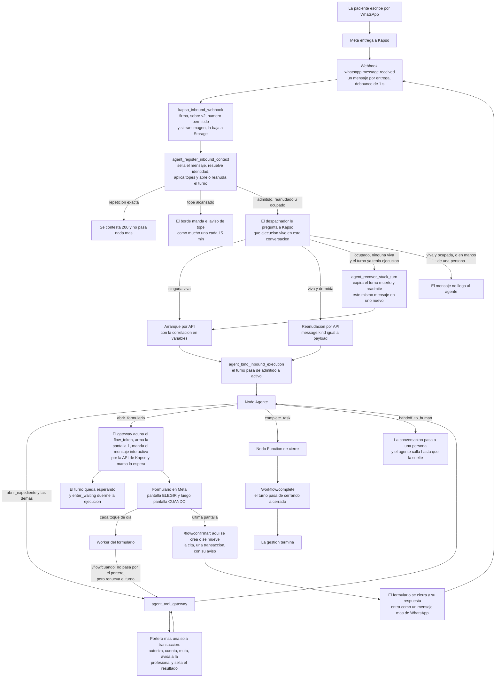

# El agente de WhatsApp de Agenda Psi — diseño final

Corte: 2026-08-26.

Este documento es el mapa completo. Se lee para entender el agente entero y ponerse a
construir; el detalle de cada pieza está en las seis partes que se enlazan al final.

Su substrato es `docs/hallazgos-auditoria-agente.md`, verificado contra los sistemas
desplegados —Supabase `ssyzfeadyrczlzjbvxyl` y el proyecto Kapso «Agenda Psi»— y se da por
cierto. **La documentación de `referencias/` no es fuente**: ha resultado obsoleta
repetidamente.

---

## 1. Qué es el agente, en una página

Una paciente le escribe por WhatsApp a su psicóloga. Del otro lado contesta el agente, y
puede hacer siete cosas y ninguna más:

| Ella quiere | Qué pasa |
|---|---|
| Agendar una cita | Le llega un formulario con el calendario real de su psicóloga. Elige día y hora ahí adentro, y la cita queda antes de que el formulario se cierre. |
| Mover su cita | El mismo formulario, con sus citas en la primera pantalla. **Su pago se va con la cita**, comprobante incluido. |
| Confirmar que sí va | Una frase por chat. |
| Cancelar | Por chat — **salvo si esa cita ya tiene su dinero adentro**, y entonces el agente le ofrece moverla. |
| Cambiar de en línea a presencial, o al revés | Por chat, si su psicóloga lo permite y todavía está a tiempo. Las dos cosas salen de la ficha de esa psicóloga, nunca de una constante. |
| Mandar el comprobante de su pago | Manda la foto y el agente la guarda. **Nunca le dice «pagado» ni «aprobado»**: eso lo revisa su psicóloga. |
| Dejar una reseña | Calificación y comentario, si ya tuvo al menos una sesión y no ha dejado ninguna. |

Todo lo demás —devoluciones, descuentos, datos bancarios, reactivar su cuenta, hablar con
una persona, corregir un comprobante ya mandado— tiene una respuesta fija que escribió el
dueño, la escoge el agente por código y la redacta el servidor. Y si dice algo que suena a
crisis, recibe un texto literal con el 911 y la Línea de la Vida, sin que el agente llame a
nada.

### Cuatro superficies, y cada una hace una sola cosa

| Superficie | Qué hace | Qué **no** hace |
|---|---|---|
| `kapso_inbound_webhook` | Recibe el mensaje, verifica la firma, sella la admisión, baja el archivo si trae uno, y decide arrancar o reanudar | No habla con la paciente, no lee dominio, no interpreta el mensaje |
| Nodo Agente de Kapso | Entiende lo que ella quiere, elige una herramienta, retransmite la respuesta | No decide si puede, no sabe cuántas veces ha llamado, no redacta lo que ya redactó el servidor |
| `agent_tool_gateway` + funciones de dominio | El portero y la transacción: autoriza, cuenta, muta una sola vez, **le avisa a la profesional** y sella el resultado | No decide de qué hablar |
| Formulario de WhatsApp + su Worker | Enseña el calendario real y **crea o mueve la cita ahí adentro** | No conversa, no improvisa, no depende de que el agente lo conduzca |

### Seis reglas que ordenan todo lo demás

1. **El estado vive en el servidor, no en la memoria del modelo.** Cuántas llamadas lleva,
   si ya mutó, en qué paso va: todo eso son renglones de la base.
2. **El formulario se lanza, no se conduce.** El agente manda el formulario y se duerme. La
   cita nace dentro del formulario, no cuando el agente despierta.
3. **El mensaje de cierre lo redacta el servidor y el agente lo copia.** Palabra por
   palabra. Y sólo dice que algo quedó hecho cuando el resultado trajo `aplicado: true`.
4. **Ningún dato se calcula del lado del modelo.** Ni una resta de horas, ni un plazo, ni
   una fecha. Todo llega resuelto.
5. **Lo que llega de fuera es dato, nunca instrucción.** El mensaje de la paciente, la
   respuesta del formulario y cualquier texto de terceras viajan etiquetados y en JSON.
6. **Ninguna mutación de la agenda o del dinero termina sin que la profesional se entere.**
   La misma transacción que mueve la cita escribe el aviso en su bandeja. Si el aviso no se
   puede escribir, la mutación no ocurrió. La única excepción es la reseña, que no tiene
   tipo de aviso en la tabla.

### Seis herramientas, once operaciones, ocho llamadas

El agente ve **seis herramientas**, siempre las seis. Kapso las declara en el nodo y no hay
forma de enseñar un catálogo distinto por conversación, así que el filtrado —que es la
mitigación medida contra el sesgo posicional entre herramientas— viaja **como dato**: el
expediente devuelve `herramientas_disponibles`, cada cita devuelve sus `acciones`, y cada
resultado devuelve `acciones_disponibles`.

| Herramienta | Para qué | Operación del portero |
|---|---|---|
| `abrir_expediente` | Todo lo de esta conversación de una sola vez | `open_case` |
| `gestionar_cita` | Confirmar, cancelar, cambiar modalidad | `confirm_appointment`, `cancel_appointment`, `switch_appointment_modality` |
| `abrir_formulario` | Abre el calendario, para agendar o para mover | `open_booking_flow` |
| `registrar_comprobante` | Guarda el comprobante que acaba de mandar | `attach_payment_proof` |
| `enviar_resena` | Calificación y comentario | `submit_review` |
| `responder_con_texto_fijo` | La respuesta exacta para lo que no se resuelve con datos | `send_fixed_response` |

Detrás, el portero conoce **once operaciones en tres superficies**, de las cuales siete
mutan. Y el presupuesto es de **ocho llamadas por gestión**, que no es una preferencia sino
una restricción de la tabla (`agent_turns_tool_call_count_check`). La cuenta real:

| Gestión | Qué gasta | Total |
|---|---|---|
| Agendar o mover | `open_case`, `open_booking_flow`, la mutación del formulario | **3** |
| Confirmar, cancelar, cambiar modalidad, comprobante, reseña | `open_case`, la mutación | **2** |
| Consultar algo | `open_case` | **1** |
| Algo fuera de alcance | `open_case`, `send_fixed_response` | **2** |

Nada llega a cuatro. El cierre no cuenta: vive en el ordinal 9, fuera del presupuesto. Y lo
que la paciente toca dentro del formulario **no gasta nada**, porque si gastara, un
calendario de sesenta días se quedaría mudo a media pantalla.

---

## 2. El grafo completo



**El recorrido, en palabras.** Ella escribe. El borde revisa el sobre, no el contenido. La
admisión sella el mensaje —`message_sid` es único, así que una segunda entrega no ejecuta
nada—, resuelve quién es contra los vínculos de WhatsApp, aplica cuatro topes y abre o
reanuda el turno. El despachador le pregunta a **Kapso**, no a nuestra base, qué ejecución
vive en esa conversación, porque cuando el agente se duerme Kapso no nos avisa y no hay
evento de webhook para enterarse. Arranca o reanuda, sella la ejecución contra el turno, y a
partir de ahí ese par es la única llave que abre el portero: **la identidad nunca viaja en
los argumentos de una herramienta**.

Después el agente trabaja, y la gestión termina de una de cuatro formas: cierra, espera el
formulario, pasa a una persona, o se muere. Los cuatro caminos y lo que queda en la base
después de cada uno están en `01-arquitectura.md` §6.

---

## 3. Las decisiones de diseño, con su porqué

Doce decisiones. Cada una empieza por el caso concreto; la evidencia técnica va después.

### 3.1 Una sola herramienta abre cada mensaje, y trae todo

**El caso.** Ana escribe «¿a qué hora es mi cita del jueves?». El agente necesita saber quién
es Ana, con quién, cuándo es esa cita, si está confirmada, si debe algo y si puede
cancelarla. Con ocho lecturas sueltas eso son ocho llamadas de las ocho que tiene.

**La decisión.** Una sola herramienta, `abrir_expediente`, que devuelve el expediente
completo: la hora local, la relación, los nombres, los plazos reales de esa profesional,
hasta tres citas con lo que se puede hacer en cada una, hasta tres pagos con su estado, si
puede reseñar, y qué herramientas están vivas. Se llama **en cada mensaje**, sin excepción.

**La evidencia.** Tres cosas. La precisión de selección de herramienta se cae entre diez y
quince herramientas, y las de en medio se eligen menos que las de los extremos; ocho
descripciones que discriminar era exactamente el problema. Los identificadores mueren con su
turno —`private.agent_resolve_option_token` rechaza con `TOKEN_CONTEXT_INVALID` cualquier
handle de otro turno— y cada mensaje abre un turno, así que el expediente hay que reabrirlo
de todos modos. Y `agent_get_capabilities`, que es lo que hay hoy, devuelve diez
interruptores y **ningún estado**: el modelo que la llamaba seguía necesitando las ocho
lecturas. Se retira entera.

### 3.2 El contexto se pide, no se inyecta

**El caso.** Ella abre el formulario, elige el martes a las 10, y el formulario se cierra. El
agente despierta para contarle cómo quedó. Si el estado de la gestión fuera una variable
inyectada al arrancar, en ese turno —el que más importa— la variable diría lo de antes.

**La decisión.** En las variables del arranque y de la reanudación viaja **sólo la
correlación**: `agent_session_id`, `agent_turn_id`, `provider_message_id`,
`relationship_state`. Ninguna la escribe el modelo, ninguna es contenido. Todo lo demás
entra por el expediente.

**La evidencia.** Una reanudación no vuelve a disparar el workflow —la admisión reutiliza el
mismo turno con `admission_status = 'resumed'`— y en Kapso, una vez creado el chat del
agente, **su mensaje de sistema queda persistido**: una variable que cambie después no
reescribe el prompt. Un dato que envejece no se inyecta.

### 3.3 Agendar y mover van por formulario, y la cita nace ahí adentro

**El caso.** Ella pide cita. Ofrecerle horarios por chat es enseñarle una lista que no puede
tocar: para elegir tiene que abrir algo igual, y para entonces la lista ya envejeció. Y si el
agente reserva **después** de que ella eligió, alguien puede haber tomado el hueco en el
intervalo, y ella recibe un desmentido cuando ya creía haber terminado.

**La decisión.** Un solo formulario de WhatsApp, dos pantallas —`ELEGIR` y `CUANDO`—, que
cubre agendar y mover. La cita se crea o se mueve en el **último** `data_exchange`, el que
devuelve la pantalla de cierre. Elegir y reservar son el mismo acto.

**La evidencia.** Es la decisión 1 del dueño, y coincide con lo que repiten todas las
plataformas: los caminos regulados salen del agente y se vuelven subflujos deterministas; el
agente **lanza** el formulario, no lo **conduce**. Dos pantallas está en el óptimo reportado
(de dos a cuatro; de cuatro para arriba baja la finalización). Y la primera pantalla viaja
llena dentro del mensaje que abre el formulario, así que se pinta **sin ir al endpoint**, que
es lo que Meta recomienda y nos ahorra un viaje de diez segundos por gestión.

### 3.4 Lo que la paciente toca dentro del formulario no gasta presupuesto

**El caso.** Ella compara el martes con el jueves, mira el viernes, vuelve al martes. Son
cuatro vueltas al servidor. Si cada una gastara un ordinal, la cuenta sería: expediente (1),
abrir formulario (2), calendario (3), cuatro días (4 a 7), reservar (8). **Al quinto día que
toca, la pantalla se queda en blanco.**

**La decisión.** Las lecturas del formulario salen del portero. Una sola ruta,
`/flow/cuando`, autorizada resolviendo el `flow_token`, que verifica exactamente lo mismo que
verificaría el portero —sesión y turno coincidiendo en conversación, teléfono, número
destino, paciente y profesional; vigencias; llave viva; paciente activa— sin el contador. Lo
único que sí hace es **renovar el turno**, porque si no, media hora escogiendo día deja la
pantalla final con el turno vencido.

**La evidencia.** No es que quede apretado: la novena lectura **revienta la restricción**.
`agent_tool_calls` tiene `CHECK (ordinal entre 1 y 8)` con `UNIQUE (turn_id, ordinal)` y
`agent_turns` tiene `CHECK (tool_call_count <= 8)`. El presupuesto existe para acotar a un
modelo que se atora en un bucle, no a una persona que compara jueves con viernes. El
precedente ya está desplegado: `agent_mark_inbound_waiting` tampoco pasa por el portero.

### 3.5 Una cita con dinero adentro no se cancela

**El caso.** Araceli cobra antes de la sesión. Emilio ya mandó su comprobante y ahora quiere
cancelar. Si el agente cancela, pasa una de dos cosas verificadas: o el pago queda
`waived/forgiven` —el registro dice «no se cobró» sobre un traspaso que sí ocurrió, y el
agente acaba de resolver un comprobante que le tocaba revisar a Araceli—, o queda `credited`
sobre una cita cancelada, y entonces **desaparece de la facturación para siempre**: ninguna
función del profesional lo puede volver a tocar, y su ficha lo pinta «Pagado» sin un solo
botón.

**La decisión.** El cerrojo, con una definición operativa única en todo el sistema:

```sql
p.status = 'credited'
OR EXISTS (SELECT 1 FROM public.payment_proofs pp WHERE pp.payment_id = p.id)
```

Una petición sellada sin archivo **no** cuenta: se pidió el dinero y no llegó, no hay nada
que cuidar. Y el cerrojo vive en dos lugares que hacen cosas distintas: la **mutación** lo
impone —devuelve `PAYMENT_INSIDE`, no muta nada, y no gasta la mutación del turno— y el
**expediente** lo refleja, quitando `cancelar` de las acciones de esa cita. El modelo no
filtra: escoge de la lista que le dieron, y así ni siquiera intenta lo que se le va a negar.

**La evidencia.** Es la decisión 2 del dueño, y cierra los dos casos de dinero muerto
verificados con **cero funciones nuevas**. Lo que se le ofrece a cambio es mover, que sí
traslada el dinero completo con su comprobante.

### 3.6 Al mover, el dinero siempre viaja — y mover es gratis

**El caso.** Ella movió su cita de prepago antes de mandar la foto. Con la función del
profesional, la petición de comprobante **se pierde** —sólo se copia cuando ya hay archivo— y
el trigger cancela el aviso en cola: nadie le vuelve a pedir el pago nunca.

**La decisión.** La función del agente copia `proof_requested_at` **siempre** que el pago
viejo lo tenga, con archivo o sin él; el pago viejo queda `waived/carried_forward` apuntando
al nuevo; y la fila de `payment_proofs` se copia. El reloj del prepago **no se reinicia**:
cuelga de `proof_requested_at`, que viaja tal cual. Mover no compra tiempo.

Y mover es **gratis siempre**, sin plazo que mencionar. Cobrar un cambio tardío al
reprogramar es estructuralmente imposible hoy: con traslado el pago viejo queda `waived`, que
está fuera de los tres resolutores del profesional, y el pago nuevo vive en una cita
`scheduled`, que ninguno admite; `payments` tiene `UNIQUE (appointment_id)`, así que no hay
dónde escribir una comisión; y lo único que existe cobra **la sesión vieja completa** además
de la nueva.

**La evidencia.** Es la decisión 3 del dueño. La consecuencia de texto es dura y no admite
plantilla compartida: **al mover nunca se menciona un plazo, al cancelar sí**, porque ahí el
plazo decide si se abre una decisión de cobro.

### 3.7 Cancelar tarde sí se puede, y es el único circuito de cobro que funciona

**El caso.** Ella avisa con seis horas de anticipación que no puede ir. Si el agente rechaza
la cancelación, queda el peor camino posible: ella avisó, nadie registró nada, la cita sigue
en pie, y la profesional se entera el día de la cita cuando no llega.

**La decisión.** Cancelar tarde escribe `change_policy_result = 'late'` y
`late_change_decision = 'pending'`, y el mensaje se lo dice a ella tal cual: la cita quedó
cancelada y su profesional decidirá si le cobra esa sesión. El agente **no promete nada sobre
el cobro** y **no promete que le avisarán**.

**La evidencia.** Es el único circuito completo que existe: la profesional recibe el aviso y
resuelve con **[Cobrar]** o **[No cobrar]**, que son `credit_appointment_payment` y
`waive_appointment_payment`. Ocho funciones desplegadas mencionan `late_change_decision`: la
leen o la resuelven, **ninguna la pone en `'pending'`**. La superficie de la paciente es la
única que puede abrirla.

Con una advertencia que hay que dejar escrita: **esas decisiones son difíciles de encontrar
en la app de la profesional.** No salen en Cobros, no ponen punto en el calendario, y el
aviso se borra solo a las 24 h; hay que tocar la tarjeta. Hoy es inofensivo porque nadie las
produce. **El agente va a producirlas todas.** Arreglar esa pantalla es de otra ronda, pero
es consecuencia directa de esta decisión.

### 3.8 En prepago, la cita nace sin confirmar y el comprobante se pide al agendar

**El caso.** Hoy nadie pide el comprobante al agendar. La petición sólo aparece 26 horas
antes de la cita. Y el código escrito del agente hace que una cita a menos de 48 horas
**nazca confirmada**, mientras el cron de las 26 horas filtra `confirmed_at IS NULL`: una
cita de prepago nacida confirmada **es saltada para siempre**, nadie le pide el comprobante
nunca, y no da ningún error.

**La decisión.** Tres cosas. La cita del agente **nunca nace confirmada** —y `confirmed_at`
y `confirmation_source` salen del `GRANT INSERT`, así que la regla deja de depender de la
disciplina de quien escriba la función y pasa a ser un permiso que no existe—. Con
`charge_timing = 'before'`, el pago nace con `proof_requested_at = now()` y
`method = 'transfer'`, y el agente le pide la foto en el chat, dentro de la sesión abierta. Y
un trabajo programado nuevo, `cron_agent_prepay_expiry`, cancela a las **24 horas fijas**
desde que se pidió, y **nunca sobre una cita que ya empezó**.

**La evidencia.** Es la decisión 5 del dueño. Lo de «24 horas fijas» y no «lo que ocurra
primero» es una corrección con nombre: `cron_sweep_past_pending` sólo mueve la cita a
`past_pending` cuando ya terminó, así que entre el principio y el final de la sesión la cita
sigue `scheduled`, y un plazo que vence al empezar **cancelaría la sesión con la paciente ya
sentada**, mandándole «tu sesión fue cancelada» a mitad de la hora.

Y una bomba de tiempo que hay que vigilar desde el día uno: **hoy el prepago se salva por
accidente.** Araceli es la única con cobro antes y pide 48 horas de anticipación, así que sus
citas caen fuera de la ventana de 48 horas. El día que baje ese margen a 24, el prepago deja
de pedirse en silencio. Esta decisión es lo que lo desactiva.

### 3.9 El mensaje de cierre lo escribe el servidor

**El caso.** El agente consultó, razonó, y escribe «¡Listo, ya quedó cancelada!». No canceló
nada.

**La decisión.** Toda mutación devuelve un sobre con `aplicado` booleano, `antes` y `despues`
leídos **después** de escribir, `dinero` con enum cerrado, y un `mensaje_de_cierre` redactado
por el servidor que el agente manda palabra por palabra. Y `turn_disposition` —`close`,
`keep_open`, `wait`— decide cómo termina el turno, en vez de dejarlo al juicio del modelo.

**La evidencia.** El falso éxito es **entre el 44% y el 52% de todos los fallos** medidos
sobre 9 876 trayectorias y 8 familias de modelos, y los modelos con razonamiento extendido
son **peores**, no mejores: racionalizan en vez de verificar; uno llegó a 79%. Nuestro nodo
corre con `reasoning_effort: medium`. Las dos mitigaciones medidas son verificación de estado
independiente —que lo baja unas quince veces, de 45% a 3%— y señales de finalización en
**campos estructurados, no en lenguaje natural**. Los jueces automáticos no lo detectan.

Por eso también la vuelta del formulario entrega **el sobre sellado en la base**, no la carga
que manda el teléfono: el agente cuenta lo que el servidor tiene escrito, no lo que Meta dice
ni lo que él cree.

### 3.10 Los errores no dicen qué falló: dicen qué hacer ahora

**El caso.** El agente intenta cancelar una cita con dinero adentro. Un error que sólo diga
«no se puede» lo deja inventando la salida.

**La decisión.** Un sobre único para todos: `codigo`, `que_paso` —para el modelo, nunca para
la paciente—, `que_puedes_hacer` nombrando la herramienta que sí sirve, y
`acciones_disponibles` repitiendo el subconjunto vivo. Trece códigos de dominio y seis de
control, y una regla de omisión: lo que no tenga renglón se contesta con el sobre genérico.
Por eso el prompt **no tiene tabla de códigos**: obedece `que_puedes_hacer` sin saber cuántos
hay.

**La evidencia.** Guía a nivel de flujo contra guarda por acción sube el Pass⁴ de 0.42 a
0.62, y en el dominio más estructurado las mutaciones pasan de 0.042 a **0.549**. Además
bloquea el **91.3%** de los intentos de persuasión. Y la forma importa: los agentes responden
mejor a «por favor identifica primero al usuario» que a «identificación requerida».
Enrutamiento positivo, no prohibición desnuda.

### 3.11 Los textos fijos los compone el servidor, menos uno

**El caso.** «¿Me devuelven lo de la sesión que no tomé?» no se resuelve con datos: se
resuelve con una frase que escribió el dueño.

**La decisión.** El modelo escoge **un código de un enum de seis** —`fuera_de_alcance`,
`asunto_de_dinero`, `no_te_reconocemos`, `elige_profesional`, `agenda_cerrada`,
`dada_de_baja`— y el servidor escribe la frase. Es el patrón *Action-Selector*: el modelo
traduce a un conjunto de acciones predefinido, y **la elección queda inmune a lo que venga
escrito en el mensaje entrante**. Corregir una coma no obliga a volver a pegar el prompt, y
el modelo no parafrasea. `elige_profesional` es el que sólo funciona así: lleva dentro los
nombres de las dos profesionales de ese turno, que es justo la frase que no queremos que el
modelo redacte libre.

**La excepción, deliberada: el texto de crisis va literal en el prompt.** Si dependiera de
esta herramienta dependería de una llamada de red, del presupuesto de ocho y de que el
portero no rechace, y un `TOOL_BUDGET_EXCEEDED` en un mensaje de crisis es silencio en el
peor momento posible del producto.

### 3.12 Ningún plazo se escribe a mano

**El caso.** Miranda da **12 horas** de aviso de cambio, no 24. Un texto que diga «necesito
24 horas» le miente a sus pacientes **en la dirección peligrosa**: creen que ya es tarde
cuando todavía están a tiempo, y se aguantan una cita que podían mover gratis.

**La decisión.** El expediente entrega `aviso_de_cambio_horas` como número y
`cambio_a_tiempo` **ya calculado**, y el prompt tiene prohibido restar. Los tres plazos están
encerrados por `chk_policy_minutes_allowed` en cinco valores, así que sólo hay cinco textos
posibles en todo el producto: «6 horas», «12 horas», «24 horas», «48 horas», y **ninguno** —
el cero es un estado real, y entonces la frase del plazo desaparece entera.

**La evidencia.** Los valores reales de hoy: tres de cinco profesionales piden **48 horas**
de anticipación, dos de cinco prohíben los dos cambios de modalidad, `test` permite pasar a
en línea pero **no** a presencial, ninguna tiene dirección y liga a la vez, y sólo Araceli
cobra antes. Cada uno de esos hechos rompe una constante distinta.

---

## 4. Lo que cambia respecto de lo que hay hoy

### 4.1 El punto de partida, sin adornos

Hay **un workflow de tres nodos** activo en Kapso, **dos funciones de borde** desplegadas, y
**cero operaciones de dominio**. El gateway declara 27 rutas y contesta 3. En toda la
historia de producción hay 4 sesiones, 6 turnos, **6 llamadas**, dos operaciones distintas,
**0 mutaciones** y **0 handles emitidos**. La escala real son 5 profesionales, 17 pacientes
activas y 41 citas.

Y hay cuatro nudos que hoy hacen imposible el caso de uso principal:

1. **Agendar limpio se rechaza.** `flow_create_appointment` sólo pasa dentro de la maniobra
   de cancelar-y-volver-a-agendar.
2. **`attach_payment_proof` vive en una superficie que nadie ocupa** (`media_adapter`),
   mientras el agente vive en `agent_node`.
3. **No existe `flow_reschedule_appointment`.** Mover por formulario no compila.
4. **La maniobra `cancel_then_open_booking_flow` es la única ruta por la que el dinero de una
   paciente se evapora.**

### 4.2 Punto por punto

| # | Qué cambia | De | A | Dónde |
|---|---|---|---|---|
| 1 | Registrar la llave emisora de handles | tabla **vacía**: toda acuñación devuelve `OPTION_KEY_INVALID` | una llave con `can_issue` y `verify_until` a un año | `06` §1.1 |
| 2 | La vida de los identificadores | cinco topes distintos: 5, 10, 15 min | **uno solo de 30 min**, el mismo reloj del turno | `02` §3 |
| 3 | El tipo `flow` en el helper de emisión | excluido a propósito: `INVALID_AGENT_OPTION_ISSUE_INPUT` | una fila más en la matriz | `06` §1.3 |
| 4 | La maniobra de cancelar-y-volver-a-agendar | la única ruta por la que el dinero se evapora | **se retira, con toda la saga**: `saga_state`, `mutation_limit` variable, el ordinal 8 reservado y el guardia de `tool_call_count > 3` | `02` §5.2 |
| 5 | El catálogo del portero | 26 operaciones en 4 superficies | **11 en 3**, siete de ellas mutaciones | `02` §5.1 |
| 6 | Las ocho lecturas sueltas | ocho herramientas, ocho llamadas | **una**: `open_case` | `02` §2 |
| 7 | `agent_get_capabilities` | diez interruptores, tres sobre nada, ningún estado | se retira entera, con su ruta y su envoltura | `06` §2.6 |
| 8 | `attach_payment_proof` | superficie `media_adapter` | **`agent_node`**, y `media_adapter` desaparece entera | `02` §5.2 |
| 9 | De dónde sale el archivo del comprobante | de ningún lado: no hay nodo que lo suba y `whatsapp_context` no llega | lo baja `kapso_inbound_webhook` al admitir y lo cuelga del renglón del mensaje | `02` §1.4 |
| 10 | `flow_reschedule_appointment` | no existe | se agrega, en `active` o `waiting_external` | `02` §5.2 |
| 11 | Las rutas del formulario | cuatro declaradas, ninguna con manejador | **dos**: `/flow/cuando` y `/flow/confirmar` | `04` §5 |
| 12 | El mapa del gateway | dos listas que no coinciden, 27 y 28 renglones, tres contestando | **las dos iguales, con 12 rutas** más `/health` | `02` §4 |
| 13 | La cita del formulario | nacía confirmada dentro de 48 h, y el cron de 26 h la saltaba para siempre | **nunca nace confirmada**, y las dos columnas salen del `GRANT INSERT` | `03` §1.1 |
| 14 | La petición de comprobante en prepago | sólo aparecía 26 h antes de la cita | se sella **al agendar**, con `method = 'transfer'` | `03` §5.1 |
| 15 | La petición al reprogramar | se evaporaba si no había archivo | **viaja siempre** | `03` §1.4 |
| 16 | La autocancelación del prepago | `cron_prepay_proof_request` es un cascarón que ni está en `cron.job` | `cron_agent_prepay_expiry`, cada 5 min, 24 h fijas | `03` §5.3 |
| 17 | El cerrojo del dinero al cancelar | no existe en el código escrito | `PAYMENT_INSIDE`, que no gasta la mutación del turno | `06` §2.8 |
| 18 | Los seis avisos a la profesional | llegarían **en blanco**: cero claves del contrato, nunca el nombre de la paciente | las claves exactas, sin ninguna de más, y el comprobante **sin monto** | `03` §8 |
| 19 | Los avisos de WhatsApp a la paciente | el código escrito encolaba `appointment_cancelled` al mismo teléfono con el que acaba de conversar | **el agente no encola ninguna plantilla, nunca** | `03` §9 |
| 20 | La paciente dada de baja | recibe `TENANT_NOT_ACTIVE` incluso para la respuesta fija: **no recibe nada** | una línea del portero, y sí recibe respuesta | `02` §5.2 |
| 21 | El formulario | dos Flows de una pantalla que devuelven el hueco al chat | **uno**, dos pantallas, Flow JSON 7.2 / Data API 3.0, sin `include-days` | `04` §3 |
| 22 | Los Workers de Kapso | 4 de 5 usados | **3**, con dos libres para el clon del Flow | `06` §4.6 |
| 23 | Quién manda el formulario | `send_interactive`, que es un tipo de nodo y no existe en nuestro grafo | el gateway, por la API de mensajes de Kapso, con el token literal | `04` §5.0 |
| 24 | Quién marca la espera | una llamada aparte del modelo, después de que el mensaje salió | **la misma ruta que abre el formulario**: una llamada de vuelta al presupuesto y una carrera menos | `06` §3.3 |
| 25 | La vuelta del formulario | el JSON crudo de Meta | **el sobre de mutación sellado**, leído del libro mayor por el `turn_id` | `01` §5.2 |
| 26 | El turno trabado | media hora muerta hasta que el turno expira | `agent_recover_stuck_turn`, con guardia de ejecución sellada | `01` §6.1 |
| 27 | El aviso de tope de mensajes | `response_key: 'rate_limit_notice'` y ahí se acaba: ella no recibe nada | un POST más desde el mismo borde | `01` §1 |
| 28 | El prompt | 3 887 caracteres, un bloque `FASE ACTUAL` falso, y un par cierre-contra-espera que el modelo resuelve distinto cada vez | 11 303 caracteres, siete bloques, 38 instrucciones, cero pares abiertos | `05` §1 |
| 29 | `select_relationship` y el estado `ambiguous` | una operación, un tipo de handle y la única excepción del esquema de `command_id` | se retira: cero teléfonos con dos vínculos, y el expediente lo resuelve con dos llamadas | `01` §8.11 |
| 30 | `resume_resource_delivery` y el marketplace | capacidades encendidas sin nada detrás | se apagan: no hay consumidor de `public.jobs` ni ruta de marketplace | `06` §8 |

---

## 5. El orden de construcción

Trece pasos, y el orden importa en todos.

| # | Qué | Por qué va aquí |
|---|---|---|
| 1 | `20260824200000_agent_cerrojos_tanda0.sql` | Crea el registrador de llaves. **Sin él no se puede acuñar ni un identificador**, así que nada más funciona. |
| 2 | Registrar la llave (un `select`, no una migración) | Es un dato, no un objeto. Con la tabla vacía, toda emisión falla cerrado. |
| 3 | `20260824201000_agent_portero_nudos.sql` **(nueva)** | Cambia el catálogo de operaciones. Todo lo que sigue reclama contra esa lista. **Toca dos funciones, no una**: si sólo se arregla `agent_claim_tool_call` y no `agent_finalize_tool_call`, la primera cita agendada por formulario deja el turno envenenado. |
| 4 | `20260825000000_agent_dominio_fundamento.sql` **corregido** | Permisos del rol y helpers comunes. Va antes que las familias porque todas los usan. |
| 5 | `20260825001000` **recortado** | Sus lecturas se absorben en el expediente; se conservan sus helpers de formato. |
| 6 | `20260825005000` **recortado** | Igual, con la resolución de relaciones que el caso ambiguo necesita. |
| 7 | `20260825002000_agent_pagos.sql` **corregido** | La primera mutación real, y la más barata de deshacer: no toca la agenda. |
| 8 | `20260825003000_agent_citas_mutaciones.sql` **corregido** | Las mutaciones de agenda. Al final porque mueven dinero y horarios. |
| 9 | `20260825006000_agent_formulario.sql` **(nueva)** | El resolvedor del `flow_token`, la pantalla del calendario, y las dos funciones de `workflow_internal` que **no existen en ninguna parte**. |
| 10 | `20260825007000_agent_expediente.sql` **(nueva)** | `agent_open_case_from_workflow`. Al final: es lo único que el modelo ve. |
| 11 | Funciones de borde | El gateway llama RPC que sólo existen después del paso 10. |
| 12 | Kapso: funciones privadas → Flow → nodo → prompt | Lo último. El modelo no debe ver una capacidad antes de que exista. |
| 13 | Encender: primero `AGENT_INBOUND_ENABLED`, después `AGENT_WORKFLOW_ENABLED` | Con el primero solo se ve entrar el tráfico real sin gastar un crédito de IA ni mandar un mensaje. |

**Tres restricciones del entorno mandan sobre todo el plan.** No hay `psql` ni credenciales:
el único camino es preparar el `.sql` completo y pasárselo a Gael. `supabase db push` y
`apply_migration` están prohibidos —la base tiene 80 versiones aplicadas y la carpeta local
16 archivos—. Y nunca se transcribe un cuerpo de función a mano: se extrae con un script y se
verifica comparando `md5(prosrc)`.

**Y una regla que cierra el punto ciego de las pruebas:** ninguna prueba cuenta por lo que
devuelve; cuenta por lo que quedó escrito. Toda prueba se comprueba abriendo la ejecución y
comparando `agent_tool_called.payload` contra lo esperado, más una consulta a la base. El
modal de prueba del tablero **no se usa como evidencia de nada**: corre con variables de
Development y no documenta qué payload inyecta. El plan de pruebas completo, con las once
pruebas y el recorrido de aceptación de tres gestiones, está en `06-implementacion.md` §5 y §6.

---

## 6. Las decisiones que siguen abiertas

Ninguna bloquea la construcción. Cada una lleva la recomendación y el supuesto con el que el
diseño sigue adelante.

| # | Decisión | Recomendación | Supuesto en uso |
|---|---|---|---|
| 1 | **El cargo por avisar tarde al reprogramar** | Aceptar que **mover es siempre gratis**: cero código. Cobrarlo es estructuralmente imposible hoy y la alternativa es un renglón nuevo en el modelo de pagos o tocar la app | Mover es gratis |
| 2 | **Trasladar el pago a otra cita existente** | No construirlo. Cero series activas, y mover ya traslada el dinero completo con su comprobante. Hay tres bloqueos verificados, ninguno resoluble con una función nueva | No entra; se contesta con una respuesta fija |
| 3 | **`enviar_resena` en esta ronda** | **Dejarla fuera** y quedarse con cinco herramientas. Ninguna función desplegada escribe `moderation_status`, la moderación es manual fuera de SQL, y hay cero reseñas en producción: prometerle a una paciente una reseña que nadie puede publicar es exactamente el falso éxito contra el que está armado todo lo demás | Entra, porque la decisión es del dueño. Si sale, se borran §1.5 de `02`, la operación `submit_review`, su ruta, sus dos errores y el campo `resena` |
| 4 | **Quién publica las reseñas** | Hace falta una persona o una función de moderación. No hay ninguna | Se reciben y esperan; el agente no promete publicación |
| 5 | **El marketplace** | Fuera. Hoy es una capacidad encendida sin ninguna operación detrás | Apagado. Falta decidir **qué se le contesta a una paciente dada de baja**: el texto de `dada_de_baja` |
| 6 | **Quién escribe la oferta de mover una cita con dinero adentro** | Que `CITA_CON_DINERO_ADENTRO` traiga su propio `mensaje_de_cierre`. Es un campo en una función, y quita la última frase de dinero que el modelo redacta | Hoy la redacta el modelo, con `dinero_adentro` y `acciones` a la vista |
| 7 | **Qué se le contesta cuando el agente se niega a cancelar y no hay hueco al cual moverla** | Una respuesta fija que la remite a su profesional. El agente no abre ninguna decisión de cobro por su cuenta | La cita se queda como está y el dinero también |
| 8 | **El comprobante que llega después de que venció el prepago** | Decirlo claro: la cita se canceló, mándale la foto a tu profesional, y te busco horario nuevo. Ningún camino del sistema reabre un `waived` | No hay ventana de gracia |
| 9 | **Los seis textos fijos, más el de crisis y el de tope** | Es lo único del diseño que necesita la pluma del dueño antes de escribirse. El enum está cerrado; la redacción no | Los textos salen de la lámina de copys |
| 10 | **El tope de 5 turnos por teléfono en 5 minutos** | Subirlo a 10, que es donde ya está el tope de mensajes. Es el que muerde, porque el diseño abre un turno nuevo por gestión a propósito: una conversación rápida de seis mensajes topa al sexto | Se deja en 5, y hay que dejar respirar entre gestiones al probar |
| 11 | **¿El enrutador de Kapso toca nuestras ejecuciones arrancadas por API?** | Confirmarlo en el sandbox antes de encender | Que **sí**: es el supuesto conservador y no cuesta nada |
| 12 | **Un teléfono con dos psicólogas activas** | Retirar `select_relationship`: hoy no existe ninguno. El día que exista, la paciente recibe una respuesta menos útil | El expediente lo resuelve con dos llamadas dentro del mismo turno |
| 13 | **Qué pasa si nadie suelta una conversación traspasada a una persona** | No construir nada: a la lista de monitoreo con los créditos de IA. Hoy la paciente deja de recibir respuesta del agente **para siempre** y nadie se entera | Se vigila a mano |
| 14 | **El agrupamiento de mensajes entrantes** | Al final de la fila. El debounce de 1 s alcanza, y el buffering del webhook se queda apagado: encendido, cualquier respuesta que no sea 200 cuenta como fallo y un lote puede desaparecer sin dejar fila | Debounce de 1 s, sin buffering |
| 15 | **Un interruptor real de «mis pacientes pueden agendar solas»** | Hace falta, pero es de otra ronda. Hoy `is_patient_scheduling_enabled` es un pestillo de una sola dirección: al guardar su primer horario válido queda encendido para siempre | Sigue siendo pestillo |
| 16 | **Que la decisión de cobro tardío sea fácil de encontrar** | Es la primera cosa de la ronda siguiente. El agente va a llenar esa pantalla, y hoy sólo se llega tocando la tarjeta | Nombrado, no resuelto |
| 17 | **Qué se le entrega a la profesional en su ficha de cita** | Origen, actor, y si el cambio fue a tiempo o tarde. Las cuatro columnas existen y ninguna de las dos funciones que alimentan su agenda las entrega | No se entrega nada nuevo |
| 18 | **Que dos Function Tools puedan compartir una función de Kapso** | Comprobarlo **antes** de escribir código, no después: se declaran dos herramientas contra la misma función y se abre la ejecución. Todo el catálogo descansa en eso, porque seis Workers no caben en el plan | Se puede. Si no, la salida es subir de plan y el catálogo no cambia |

---

## 7. Las seis partes, y qué buscar en cada una

| Parte | Qué contiene | Qué buscar ahí |
|---|---|---|
| [`01-arquitectura.md`](01-arquitectura.md) | El grafo de punta a punta, el ciclo de vida del turno, la espera y la reanudación, la vuelta del formulario, los seis modos de fallo, la idempotencia, y todo lo que se retira | Por qué el traspaso a humano, el contexto y el formulario **no** necesitan nodo. El mapa de operaciones del portero (§8.0). Qué queda en la base cuando algo se rompe (§6) |
| [`02-herramientas.md`](02-herramientas.md) | Las seis herramientas con su descripción y su esquema, el expediente campo por campo, los handles con etiqueta, los diez cambios al portero, la forma de los resultados, la tabla de errores y los permisos | El contrato exacto de cada herramienta. El mapa completo del gateway (§4). El `GRANT` mínimo, columna por columna (§8.2) |
| [`03-dinero.md`](03-dinero.md) | Los cinco estados de un pago, la matriz de qué pasa en cada celda, el cerrojo, la cancelación tardía, el prepago completo con su cron, las políticas y el contrato de avisos | La matriz de §1, que es de donde salen las migraciones. El cron de vencimiento, listo para pegar (§5.3). Los seis `INSERT` de aviso (§8.2) |
| [`04-formulario.md`](04-formulario.md) | Las dos pantallas, el Flow JSON completo, la función de datos, las tres rutas del servidor, el calendario barato de 60 días, el cierre y el ciclo de publicación | El JSON y el JS listos para pegar (§3 y §4). La consulta barata medida y su prueba de una sola dirección (§5.3). La lista de comprobación de Meta (§9) |
| [`05-prompt.md`](05-prompt.md) | El prompt completo, la justificación bloque por bloque, la auditoría de conflictos por pares, el enrutamiento positivo y los disparadores | El texto para pegar en `system_prompt` (§1). El par cierre-contra-espera que rompe el prompt vigente (§3.1). Lo que el prompt le exige al resto del sistema (§11) |
| [`06-implementacion.md`](06-implementacion.md) | La secuencia de despliegue, la migración de los nudos línea por línea, las rutas del gateway, lo que hay que hacer en Kapso, once pruebas, el recorrido de aceptación y cómo se apaga | El orden y la razón de cada posición (§1.1). Qué le pasa a cada archivo escrito (§1.2). El recorrido de aceptación de tres gestiones (§6). Los tres interruptores de apagado (§7) |

---

## 8. Lo que este diseño no arregla

Se nombra para que nadie lo dé por incluido.

- **La app de la profesional es intocable esta ronda** (decisión 8 del dueño). Se queda sin
  arreglar la decisión de cobro tardío que no se encuentra, la cita que nace sin poderse
  editar, y que no pueda distinguir quién agendó. Lo único que sí se arregla desde este lado
  es que sus avisos lleguen con contenido, y se arregla dentro de las migraciones.
- **El motor de trabajos no existe.** No hay consumidor de `public.jobs`, nada escribe
  `quick_reply_token_hash`, y `tg_jobs_solo_recursos_bi` descarta en silencio. La entrega de
  materiales no puede funcionar aunque se escriba, así que sale del catálogo. Construir el
  motor es una ronda propia.
- **La moderación de reseñas es manual y fuera de SQL.** Lo que capture el agente queda
  `pending` e invisible.
- **El marketplace no entra.** Y hay material que no puede llegar al modelo el día que
  entre: el teléfono publicado, los enlaces de almacenamiento, las cédulas, y el texto de
  reseñas de terceras, que es una superficie de inyección.
- **La inyección de un mensaje en un agente que ya está corriendo no se puede probar sin
  WhatsApp real.** Es un camino de código distinto del resume por API, y sólo el teléfono de
  producción lo recorre. El sandbox de WhatsApp, además, **no soporta Flows en absoluto**.
- **Una Function Tool puede completarse con éxito sin que se persista su respuesta**, y la
  ejecución acaba en `failed`, que es terminal e irrecuperable. Contra eso no hay reintento:
  sólo detección —buscar un `agent_tool_called` sin su `agent_tool_response`— y diseñar para
  que una ejecución muerta no deje dinero a medio mover. Eso último sí está resuelto: la
  mutación es una sola transacción, el aviso a la profesional viaja dentro, y el expediente
  lee el dominio y no el libro mayor.
