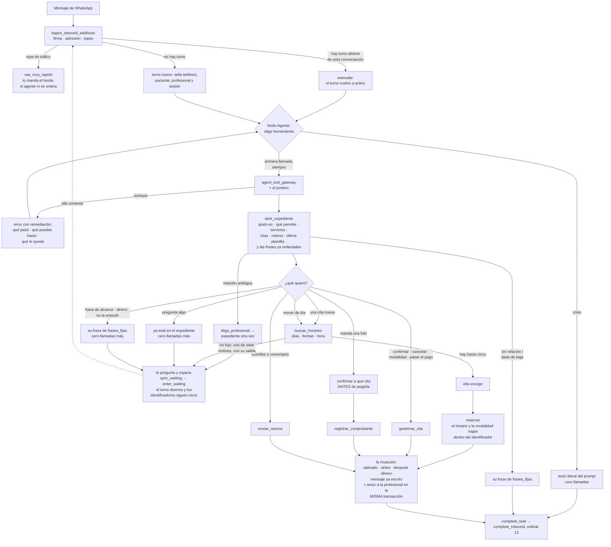

# El agente de WhatsApp de Agenda Psi — diseño final

**Versión conversacional. Corte: 2026-08-26.**

Este documento es la portada de las seis partes: el modelo completo en una página, el grafo, las
decisiones con su porqué, **qué cambia respecto del diseño por formulario que se retira**, el
orden de construcción, y lo que sigue abierto. El detalle vive en las partes, y cada sección dice
a cuál ir.

**La autoridad es `docs/anterior/01-decisiones-del-ensayo.md`** — lo que Gael fijó ensayando el
agente mensaje por mensaje. Si algo de aquí lo contradice, está mal y gana aquél.

---

## 0. La frase que resume el cambio

**El agente conversa.** Agendar y reprogramar se hacen escribiendo, no llenando un formulario de
WhatsApp. Se retiran las pantallas, el `flow_token`, la superficie `flow_data_exchange`, las
cuatro rutas `/flow/*`, la herramienta `abrir_formulario` y la maniobra de cancelar-y-reagendar.

Y entran las dos cosas que el formulario hacía por dentro y que ahora hace la conversación:
**buscar horarios con filtros** y **reservar**.

---

## 1. Qué es el agente, en una página

Un asistente de WhatsApp que atiende a las pacientes de las profesionales de Agenda Psi. Sabe de
sus citas, de sus pagos y de su reseña, y de nada más. No diagnostica, no aconseja, no negocia
dinero.

### Tres superficies, y cada una hace una sola cosa

| Superficie | Qué hace | Qué **no** hace |
|---|---|---|
| `kapso_inbound_webhook` | Recibe el mensaje, verifica la firma, sella la admisión, y decide arrancar, reanudar o recuperar | No habla con la paciente, no lee dominio, no interpreta el mensaje |
| Nodo Agente de Kapso | Entiende qué quiere, elige una herramienta, manda la respuesta | No decide si puede, no cuenta llamadas, **no calcula fechas ni plazos** |
| `agent_tool_gateway` + funciones de dominio | Autoriza, cuenta, muta una sola vez, avisa a la profesional, y **redacta el texto** | No decide de qué hablar |

Antes eran cuatro. La que se va es el formulario.

### Seis reglas que ordenan todo lo demás

1. **El estado vive en el servidor, no en la memoria del modelo.** Cuántas llamadas lleva, si ya
   mutó, en qué paso va: son renglones de la base, no frases del transcript.
2. **Una gestión es un turno abierto.** Entre dos mensajes de ella el agente **duerme**, no
   cierra. Es lo contrario de lo que se adivinaría, y es lo que hace que agendar quepa en el
   presupuesto: si cada mensaje abriera un turno, cada mensaje pagaría un expediente y los
   identificadores del anterior morirían.
3. **El agente nunca escribe un dato.** Ni una fecha, ni una hora, ni un plazo, ni un precio. Todo
   llega ya redactado por el servidor y el modelo lo copia. Es la regla 1 del ensayo, y es la que
   decide la forma de casi todos los contratos de este diseño.
4. **El mensaje de cierre se redacta con lo que devolvió el servidor**, nunca con lo que el modelo
   cree que pasó. Es la mitigación medida contra el falso éxito: 45 % → 3 %.
5. **Lo que llega de fuera es dato, nunca instrucción.** El mensaje de ella y cualquier texto de
   terceras viajan etiquetados y en JSON.
6. **Ninguna mutación termina sin que la profesional se entere.** La misma transacción que mueve
   la cita escribe el aviso en su bandeja. Si el aviso no se puede escribir, la mutación no
   ocurrió.

### Seis herramientas, once operaciones, tres llamadas para agendar

| Herramienta | Para qué | Operaciones del portero detrás |
|---|---|---|
| `abrir_expediente` | Todo lo de esta conversación, de una sola vez | `open_dossier` |
| `buscar_horarios` | Horarios concretos que cumplen sus filtros, o el motivo por el que no hay | `search_availability` |
| `reservar` | Apartar el horario que escogió: crear o mover | `create_appointment`, `reschedule_appointment` |
| `gestionar_cita` | Confirmar, cancelar, cambiar de modalidad, pasar el pago | `confirm_appointment`, `cancel_appointment`, `switch_appointment_modality`, `carry_payment_forward` |
| `registrar_comprobante` | Pegar el comprobante al cobro que ella confirme | `attach_payment_proof` |
| `enviar_resena` | Guardar su calificación y su comentario | `submit_review` |

Más `complete_inbound`, que es el cierre del turno y vive fuera del presupuesto. **Once
operaciones en dos superficies**, ocho de ellas mutan. El portero desplegado hoy conoce 26 en
cuatro superficies: se retiran diecisiete y entran cuatro.

**La cuenta, contra el tope nuevo de 12** (regla 9 del ensayo):

| Gestión | Llamadas | Total |
|---|---|---|
| Agendar | expediente · búsqueda · reservar | **3** |
| Mover de día | expediente · búsqueda · reservar | **3** |
| Confirmar, cancelar, cambiar modalidad, pasar el pago, mandar comprobante, dejar reseña | expediente · la mutación | **2** |
| Consultar (cuándo es, dónde es, cuánto cuesta, si ya llegó su comprobante) | expediente | **1** |
| Fuera de alcance, asunto de dinero, no te entendí, teléfono desconocido, dada de baja | expediente | **1** |
| Agendar preguntando mucho | expediente · hasta diez búsquedas · reservar | **12** |
| El horario que se le ocupó a media elección | una búsqueda y una reserva más | **+2** |

**Agendar gasta 3 y quedan nueve de margen.** Ése es el número de la regla 9, y cuadra por dos
decisiones: el expediente trae de una sola vez lo que antes eran diez lecturas sueltas, y los
textos fijos vienen dentro de él en vez de costar una llamada aparte.

**El cierre no cuenta.** Vive en el ordinal 13, por encima del presupuesto de 12, y nunca lo
refresca.

---

## 2. El grafo completo



**Tres nodos en Kapso y nada más:** Inicio, Agente, y un Function de cierre. El formulario era la
única topología condicional que había, y se va con él.

**Lo único que hay que mirar dos veces en ese grafo** es la flecha punteada de la espera al
webhook. Ahí está la decisión que sostiene todo lo demás: el turno no se cierra, duerme. El
siguiente mensaje de ella no abre una gestión nueva — reanuda ésta, con el expediente todavía
arriba en el transcript y los identificadores todavía vivos.

---

## 3. Las decisiones de diseño, con su porqué

### 3.1 Una sola herramienta abre cada gestión, y trae todo

`abrir_expediente` se llama **una vez por gestión** —no una vez por mensaje— y devuelve de golpe:
quién escribe y con qué profesional, sus plazos y cómo cobra, sus servicios con precio y
modalidad, sus citas próximas con lo que se puede hacer en cada una, los cobros que esperan
comprobante, dónde es la consulta, cuál fue la última plantilla que le mandamos, y **las frases ya
redactadas** para cada momento.

**El porqué inmediato es aritmético.** Antes eran diez operaciones sueltas: capacidades,
servicios, elegibilidad, próximas citas, siguiente cita, ubicación, cobros pendientes, estado de
pago, perfil público y relación. Diez descripciones que el modelo tenía que discriminar, y diez
llamadas contra el presupuesto. Con el expediente, agendar gasta 3 en vez de 6 o 7.

**El porqué de fondo es la regla 3.** Si el expediente devolviera `24` en vez de «Araceli pide 24
horas de aviso para cambios y ya faltan menos, así que se cobran las dos sesiones», el modelo
tendría que escribir el plazo. Y en cuanto escribe un plazo, algún día escribe el de otra
profesional. **Por eso el expediente trae frases, no números** — y hoy la función escrita trae
números, que es el hueco más grande que queda (§6).

→ `02-herramientas.md` §2

### 3.2 Agendar y mover se conversan, y no hay lista de días

Seis pasos, una pregunta a la vez: servicio → el aviso si aplica → modalidad, sólo si el servicio
admite las dos → **una sola pregunta de día y hora** → opciones concretas → escoge, y con eso se
crea.

**No hay paso de «¿confirmo?».** Escoger ya es confirmar.

**No se ofrece lista de días.** Se descartó ensayando: si escoge un día y ninguna hora le sirve,
tiene que retroceder, y cada retroceso cuesta una llamada y un mensaje. Se le dan días y horas
juntos, y si dos días traen las mismas horas se dicen una sola vez.

**La búsqueda es una sola llamada aunque el servidor revise treinta días por dentro.** El
presupuesto cuenta viajes del agente al servidor, no trabajo de la base: recorrer los 30 días
cuesta unos 39 milisegundos en frío y 37 en caliente, medido con `EXPLAIN ANALYZE`.

**Al mover no se pregunta ni servicio ni modalidad:** vienen de la cita que se mueve.

→ `04-horarios.md` §3

### 3.3 Cuando no hay horarios, se dice el motivo — y son siete

Un «no hay» sin salida es una conversación muerta. Cada motivo trae su frase y su alternativa:

| Motivo | Qué se le dice |
|---|---|
| No trabaja a esa hora | «Araceli no da consultas de noche. Sus horarios son de 9:00 a 2:00 y de 3:00 a 6:00.» |
| No trabaja esos días | «Araceli no atiende sábados ni domingos. Entre semana sí tengo.» |
| Esos días no va a estar | «El 15 y el 16 Araceli no va a estar. Lo más cercano es el 17.» |
| Sí trabaja, pero está llena | «Los martes al mediodía ya se le llenaron. Sí tengo miércoles y jueves a esa hora.» |
| Es demasiado pronto | «Para mañana ya no alcanzo: Araceli necesita 48 horas. Lo más cercano es el viernes 28.» |
| Es demasiado lejos | «Todavía no tengo abierta esa fecha; llego hasta el viernes 25 de septiembre.» |
| No ha guardado ni un horario | «Ahorita Araceli no tiene horarios abiertos. Lo mejor es que le escribas directamente.» |

Los cinco primeros son los del ensayo. El sexto sale de su regla 7 —horizonte de 30 días— y sin él
una fecha de noviembre caía por descarte en «está llena», que es mentira. **El séptimo se encontró
cerrando este diseño:** una profesional recién llegada, sin un solo bloque de horario guardado,
caía también en «ya se le llenaron», y la conversación la mandaba a pedir otros días que tampoco
existían.

→ `02-herramientas.md` §3.3

### 3.4 Una cita con dinero adentro no se cancela

Si la cita tiene el pago de ella —acreditado, o con comprobante recibido— **cancelar no aparece
entre sus acciones**. No es que el agente lo intente y falle: no se le ofrece.

**El porqué:** cancelar evapora el dinero. No hay pantalla para devolverlo ni para reasignarlo, y
la única ruta del sistema que hacía justo eso —cancelar y volver a agendar— es la que se retira.
Se le dan las dos salidas honestas:

> Esa cita ya tiene tu comprobante, y si la cancelo se perdería tu pago. Mejor te la reprogramo y
> tu pago sigue contando. ¿Te ayudo a reprogramarla?

Y cuando hay una próxima cita del mismo servicio, la segunda: «o pasar tu pago a tu cita del
martes 8».

**Si insiste, el agente no cede** y da la salida real: escríbele a tu profesional, ella la cancela
desde su app.

→ `03-dinero.md` §2

### 3.5 Cancelar y mover **tarde** sí se puede, y es el único circuito de cobro que funciona

Fuera de plazo no se rechaza: se avisa antes y se hace. Rechazar deja el peor camino de todos —
ella avisó que no puede ir, nadie registró nada, la cita sigue en pie, y la profesional se entera
el día de la cita cuando no llega.

**Al mover tarde el dinero se congela**, no viaja: el pago de la cita vieja se queda como estaba y
abre una decisión de cobro para la profesional; la cita nueva va aparte, con su propio pago. **Al
mover a tiempo el dinero viaja completo**, comprobante incluido, y no se menciona.

Con una advertencia por escrito: esas decisiones son **muy difíciles de encontrar** en la app de
la profesional. Hoy no importa porque hay cero; el agente va a ser su único productor y va a
producirlas todas. Gael decidió no arreglar esa pantalla en esta ronda.

→ `03-dinero.md` §1

### 3.6 En prepago, la cita nace sin confirmar y el reloj arranca al agendar

Si la profesional cobra por adelantado, la cita se crea, se le dan los datos de la transferencia y
se le pide el comprobante **con las 24 horas dichas desde el principio**. El comprobante es lo que
confirma: decir «ahí estaré» no confirma nada.

Si cobra después, se crea y **no se menciona pago**. Es la regla 6 del ensayo.

→ `03-dinero.md` §3

### 3.7 El comprobante siempre se confirma antes de pegarlo

Aunque haya un solo cobro esperando. La base admite **un solo comprobante por cobro, para
siempre**, y no hay pantalla para reemplazarlo: una foto equivocada queda pegada.

El agente **no mira la imagen**. No valida que sea un comprobante: valida que haya un cobro al
cual pegarlo. Y nunca dice «pagado» ni «aprobado»: dice «recibí tu comprobante».

### 3.8 La pista de la última plantilla sustituye al payload de un botón

**Ninguna de las 18 plantillas tiene botones**: todas son texto. Así que cuando llega un mensaje,
el expediente le dice al agente **cuál fue la última plantilla que le mandamos y de qué cita era**.
Eso convierte un «sí» o un «ya lo mandé» en algo interpretable sin adivinar.

**La pista mejora la pregunta, no la elimina.** Con el comprobante siempre se confirma antes de
pegarlo, porque es irreversible.

### 3.9 Los textos fijos viajan dentro del expediente

Ocho textos —no te reconocemos, paciente inactivo, elige profesional, sin horarios, fuera de
alcance, asunto de dinero, no te entendí, se acabó el espacio— llegan **ya redactados** en el
bloque `frases_fijas` del expediente. El de crisis vive literal en el prompt.

**Tres razones, y las dos primeras son mecánicas, no de gusto:**

1. **«Se me acabó el espacio de esta consulta» no se puede pedir con una llamada.** Es el texto de
   «se acabaron las llamadas»: cuando hace falta, ya no queda ninguna.
2. **Cinco de los ocho llevan el nombre de pila de la profesional adentro**, y «no te entendí»
   nombra sólo lo que esa profesional permite. No pueden vivir en el prompt, que es igual para
   todas.
3. **Cuesta una llamada de las doce**, y en el caso más común —«no te entendí»— la gestión entera
   valía una.

La propiedad que importa no se pierde: el modelo escoge de una lista cerrada y manda palabra por
palabra. Lo único que cambia es que la lista llegó con el expediente.

→ `02-herramientas.md` §1.7 · `textos-fijos.md`

### 3.10 Los errores no dicen qué falló: dicen qué hacer ahora

Cada error trae tres cosas: **qué pasó** (para el modelo, nunca para ella), **qué puedes hacer**
(nombrando la herramienta que sí sirve) y **qué te queda** (el subconjunto vivo). Está medido:
guía a nivel de flujo contra guarda por acción sube el Pass⁴ de 0.42 a 0.62; en el dominio más
estructurado, las mutaciones pasan de 0.042 a 0.549.

Y hay un error donde el modelo tiene **prohibido afirmar cualquier cosa**: cuando no se sabe si el
cambio se aplicó. Ahí dice que lo está verificando y que su profesional se lo confirma. Nadie
afirma que un efecto ocurrió.

→ `02-herramientas.md` §8

### 3.11 Después de una mutación, el turno se cierra

El tope de mutaciones por gestión es 1 y el esquema lo hace ley. Si el agente reserva y se queda
dormido, el «y de paso cancélame la del jueves» del mensaje siguiente sale rechazado. Cerrar deja
que el mensaje siguiente abra un turno nuevo con su propia mutación. No cuelga la conversación: su
siguiente mensaje empieza otra.

Y nunca se pregunta «¿te ayudo en algo más?».

---

## 4. Lo que cambia respecto del diseño por formulario

### 4.1 Lo que se retira, entero

| Se va | Dónde vivía |
|---|---|
| El formulario de WhatsApp, sus pantallas y su `flow_token` | Meta + dos Workers de Cloudflare |
| La superficie `flow_data_exchange` y sus cuatro operaciones | El portero |
| La herramienta `abrir_formulario` y la operación `open_booking_flow` | Catálogo y prompt |
| Las cuatro rutas `/flow/*` y `/workflow/open-booking-flow` | `agent_tool_gateway` |
| `cancel_then_open_booking_flow` y **toda la maquinaria de saga** | El portero, la función de finalizar, y cuatro valores de `saga_state` |
| Las diez lecturas sueltas | Catálogo, prompt y diez rutas del gateway |
| `get_availability` de un día suelto | La sustituye `search_availability`, con filtros |
| La superficie `media_adapter` | `attach_payment_proof` se muda a `agent_node` |
| `send_fixed_response` y `/workflow/fixed-response` | Era una operación de nodo, y ningún nodo podía llamarla |
| `resume_resource_delivery` | Nadie consume la cola de materiales |
| `get_capabilities`, entera | La sustituye el expediente, con la regla real de la reseña |

**La saga se va, y eso es lo más importante de esta lista.** Era la única ruta del sistema por la
que el dinero de una paciente se evaporaba: cancelaba su cita pagada y creaba una nueva con un
pago limpio. Con el cerrojo del dinero más «pasar el pago», no tiene para qué nacer.

**Los dos Workers que libera el formulario importan de verdad.** El plan Free admite cinco y dos
están ocupados: quedan tres libres. Las seis herramientas nuevas cuelgan de uno solo,
multiplexadas por la forma exacta de su entrada.

### 4.2 Punto por punto, qué era y qué es

| Antes (formulario) | Ahora (conversación) |
|---|---|
| Agendar: abrir formulario, cuatro pantallas, la cita nacía adentro | Agendar: seis pasos por texto, tres llamadas |
| El día se escogía de una lista y luego las horas de ese día | Días y horas juntos, hasta cinco opciones |
| Lo que ella tocaba dentro del formulario no gastaba presupuesto | Cada pregunta suya cuesta a lo más una búsqueda; caben diez |
| El estado de la gestión se inyectaba en el prompt | El estado se pide, una vez por gestión, con `abrir_expediente` |
| `waiting_external` era el turno esperando una pantalla | `waiting_external` es el turno durmiendo entre dos mensajes suyos. **Mismo nombre, otra cosa** — y ahora es la pieza que sostiene el diseño |
| Cuatro superficies del portero | Dos |
| 26 operaciones | 11 |
| 28 rutas declaradas y 18 con manejador | 12, todas con manejador |
| Tope de 8 llamadas por gestión | 12 |
| Cancelar con dinero adentro: se cancelaba y se reagendaba | No se cancela. Se mueve, o se pasa el pago |
| Cambiar de modalidad no existía por texto | Existe, por dirección, con las dos negativas escritas |
| Los textos fijos salían de una herramienta | Salen del expediente, sin costar llamada |
| El horizonte de la agenda era 60 días | 30 (regla 7) |
| La lectura de horarios daba seis huecos por día, con traslapes | Hasta diez, sin traslapes, y respetando la parte del día |

**Lo que NO se retira, y es el error más caro que se podría cometer en este cambio:**
`enter_waiting`, `sync_waiting`, `agent_mark_inbound_waiting` y el estado `waiting_external`. Con
el formulario sostenían una pantalla; sin él sostienen la gestión entera. Tirarlos porque «eran
del formulario» haría nacer un turno por mensaje, y entonces cada mensaje pagaría un expediente y
los identificadores del anterior morirían: ella escogería una hora que ya no existe, siempre.

---

## 5. El orden de construcción

**Trece archivos de migración, en orden de nombre.** El sello de tiempo garantiza el orden
interno; tres dependencias son duras y no se pueden reordenar.

```
20260824200000  cerrojos      → registra la llave, el barrendero, el apagador
20260825000000  fundamento    → permisos y helpers. TODO lo demás depende de esto
20260825001000  consultas     → helpers de vocabulario, lectura de horarios arreglada
20260825002000  pagos
20260825003000  mutaciones    → agendar, mover, cancelar, confirmar, modalidad
20260825004000  recursos y reseña
20260825005000  perfil y relación
20260826000000  portero       → esquema (sección 0) + claim + finalize + las dos del cierre
20260826001000  datos de pago → las tres columnas de la transferencia
20260826002000  búsqueda      → search_availability, con filtros y siete motivos
20260826003000  expediente    → DESPUÉS de datos de pago: lee esas columnas
20260826004000  pasar el pago → necesita el DELETE de payment_proofs del fundamento
20260826005000  prepago 24 h  → el cron que cancela y libera el horario
```

Las tres dependencias duras: **el fundamento antes que todo** (sin sus permisos las funciones se
crean pero revientan con *permission denied* la primera vez que corren); **datos de pago antes que
el expediente**; y **las cuatro funciones del portero en el mismo archivo**, porque el ordinal del
cierre es un solo número repartido en seis lugares y separarlos deja el sistema roto entre dos
migraciones.

**La secuencia completa de despliegue:**

| # | Paso | Por qué va aquí |
|---|---|---|
| 1 | **Apagar el número** | El paso 2 quita autorizaciones. Con el destino apagado no puede existir un turno a medio camino mientras el catálogo cambia |
| 2 | Aplicar los trece archivos | En orden de nombre |
| 3 | Sembrar la llave de identificadores | Después del 2, porque la función que la registra nace ahí. Sin ella, toda lista aborta |
| 4 | Desplegar `agent_tool_gateway` con las doce rutas | **Pegado al 2.** `get_capabilities` es la única operación que el agente ha ejercido y la que sirve `/tools/capabilities`: al aplicarse el 2, esa ruta muere |
| 5 | Rehacer las seis herramientas del nodo en Kapso | Con `kapso pull` antes de tocar nada: el JSON del repositorio ya mintió una vez |
| 6 | **Prender el número** | La única acción que vuelve a admitir tráfico |
| 7 | Recorrido de aceptación en el sandbox | Con el número prendido y con datos sembrados |

**Antes de nada, sembrar datos.** En producción hoy hay cero series de recurrencia, cero
comprobantes, cero reseñas, cero identificadores emitidos, cero mutaciones del agente y cero
conexiones activas. **Nada de esto se puede probar contra lo que hay.** Es el riesgo real de esta
ronda y no se tapa con más lectura.

→ `06-implementacion.md` §4 y §6

---

## 6. Lo que todavía falta para que el diseño sea cierto

Ordenado por lo que rompe si falta. Ésta es la lista corta; el detalle con archivo y línea está en
`05-prompt.md` §9 y en `06-implementacion.md` §8.

| # | Qué falta | Qué pasa si no está |
|---|---|---|
| 1 | **Ninguna función devuelve la señal de cerrar.** Las escritas devuelven todas «sigue abierto» | El agente reserva la cita, se duerme, y el mensaje siguiente sale rechazado por «ya hiciste un cambio» |
| 2 | **El expediente trae números, no frases.** La función escrita devuelve banderas y contadores | El modelo tendría que escribir los plazos y los datos de la transferencia a mano — justo lo que prohíbe la regla 1 |
| 3 | **El expediente no trae citas, servicios ni cobros: sólo los cuenta** | Agendar costaría 4 llamadas y la regla 9 dice 3. Y tres de los seis ejemplos del prompt son imposibles |
| 4 | **`buscar_horarios` no compone la frase:** devuelve el motivo y las cifras sueltas | Igual que el 2: el modelo termina escribiendo el plazo |
| 5 | **`buscar_horarios` no recibe la cita que se mueve** | Al pedir horarios para mover su cita del viernes a las 4, **su propia cita le tapa ese horario y los vecinos** |
| 6 | **Nadie baja el archivo del comprobante** de los servidores de WhatsApp | Ella manda la foto y no hay nada que pegar |
| 7 | **Las tres rutas nuevas del gateway no existen** (`/tools/expediente`, `/tools/horarios`, `/tools/payments/carry-forward`) | Las funciones de base escritas no tienen quien las llame |
| 8 | **El identificador de hueco vive 5 minutos y tiene que vivir 30** | Comparar el martes con el jueves y volver al martes **revienta la lectura entera**: no devuelve menos huecos, devuelve un error |
| 9 | **Las cinco fichas tienen los datos de transferencia vacíos** | Todo prepago cierra con el texto de respaldo y ella tiene que pedir la CLABE por fuera |
| 10 | **El aviso de «vas muy rápido» no se manda** | Quien pasa un tope de tráfico no recibe absolutamente nada |

---

## 7. Las decisiones que siguen abiertas

Ninguna bloquea la construcción. Cada una lleva el supuesto con el que el diseño sigue adelante.

| # | Decisión | Supuesto con el que se sigue |
|---|---|---|
| 1 | **La rama de modalidad cruzada** — «presencial no tengo mañanas, en línea sí» | El agente busca en la modalidad que ella escogió y no cruza. Si entra, la pregunta de modalidad deja de ser un paso y pasa a ser parte de la búsqueda |
| 2 | **La pantalla que captura los datos de transferencia** | Que entra en esta ronda: es chica, y sin ella el prepago va a medias con las cinco profesionales |
| 3 | **Quién publica las reseñas** | Nadie escribe el estado de moderación desde la base: la moderación es manual. El cierre nunca promete publicación. Si el dueño decide que nadie modera, se retira `enviar_resena` y el catálogo baja a cinco herramientas |
| 4 | **Qué contesta el agente a la plantilla de materiales** | Hoy cae en «no te entendí». Hay 14 trabajos encolados y nadie los consume: entregar materiales sería prometer algo que no llega, así que la capacidad queda apagada |
| 5 | **El tope de 5 turnos por teléfono en 5 minutos** | Se queda en 5. Con la gestión en un turno abierto no se toca; el único consumidor extra son los turnos de recuperación, y ésos son síntoma, no falta de margen |
| 6 | **El agrupamiento de mensajes** | Encendido, pero **después** de que el código acepte lotes: hoy dos salidas del webhook contestan 422 a cualquier lote, y eso apaga el webhook entero quince minutos |
| 7 | **El tope de iteraciones del nodo, hoy en 16** | Se deja hasta la primera prueba real. Antes de tocarlo hay que saber si su contador se reinicia al reanudar, que no está documentado |
| 8 | **Los textos del horario que se ocupó a media elección** | Son propuesta y no están aprobados. El dueño fijó diez textos y éste no es uno |
| 9 | **La decisión de cobro tardío es difícil de encontrar en la app de la profesional** | Gael ya decidió: el aviso alcanza para el MVP. Va primero en la lista de la siguiente ronda |
| 10 | **El marketplace** | Apagado. Un teléfono sin relación recibe «no te reconocemos» |

**Y tres que se cerraron al escribir este documento**, para que nadie las reabra por costumbre: la
operación de horarios se llama `search_availability` y no `get_availability`;
`send_fixed_response` se retira y los textos viajan en el expediente; y el expediente devuelve una
sola lista de lo que se puede hacer, no dos con vocabularios distintos.

---

## 8. Dónde está cada cosa

| Parte | Qué buscar ahí |
|---|---|
| `01-arquitectura.md` | El recorrido de un mensaje, los tres nodos, el ciclo de vida del turno, la espera y la reanudación, los modos de fallo, y qué se retira |
| `02-herramientas.md` | Las seis herramientas con sus esquemas exactos, el expediente campo por campo, la búsqueda con sus siete motivos, los identificadores, el catálogo del portero, y los errores como remediación |
| `03-dinero.md` | La matriz de las siete situaciones, el cerrojo del dinero, el prepago de punta a punta, pasar el pago, las políticas y los seis avisos a la profesional |
| `04-horarios.md` | La lectura de horarios arreglada, la consulta barata del calendario, la función completa de la búsqueda, cómo se ofrecen las horas, y zonas horarias |
| `05-prompt.md` | El prompt completo para pegar, la justificación bloque por bloque, la auditoría de conflictos, y lo que le exige al servidor |
| `06-implementacion.md` | Los trece archivos uno por uno, la secuencia de despliegue, qué hacer en Kapso, el plan de pruebas y cómo se apaga si algo sale mal |
| `textos-fijos.md` | Los diez textos, palabra por palabra |
| `anterior/01-decisiones-del-ensayo.md` | **La autoridad.** Manda sobre todo lo demás |

**Y una advertencia de lectura:** las versiones anteriores de `docs/diseno/00` a `06` describían el
agente por formulario. Cualquier cosa que toque agendar o reprogramar en un documento con fecha
anterior al 26 de agosto está obsoleta.

**El título de `04-horarios.md` es el último resto que queda de aquella versión.** El archivo ya
no habla de formularios: habla de horarios, disponibilidad y la búsqueda. El nombre se conserva
para no romper las referencias de las otras cinco partes.
