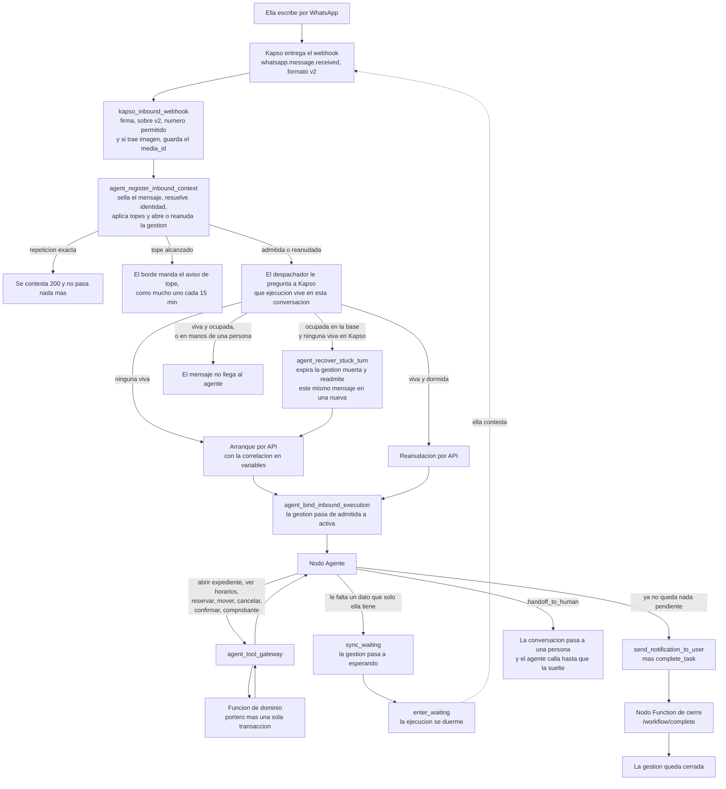

# Arquitectura y topología del agente conversacional

Corte: 2026-08-26. Este documento define el grafo completo, de punta a punta: por dónde entra
un mensaje, quién decide qué, dónde vive el estado, qué recuerda el agente y qué pasa cuando
algo se rompe.

**Manda `docs/anterior/01-decisiones-del-ensayo.md`.** El agente es **conversacional**:
agendar y reprogramar se hacen por texto. Todo lo que en la versión anterior de este documento
hablaba de formulario de WhatsApp, `flow_token`, la superficie `flow_data_exchange` y las
pantallas `ELEGIR` / `CUANDO` **se retira** (§8).

Su substrato son `docs/hallazgos-auditoria-agente.md` y `docs/anterior/04-puente.md`, los dos
verificados contra los sistemas desplegados. Lo que se agrega aquí va con su evidencia propia,
consultada contra la base `ssyzfeadyrczlzjbvxyl`, nunca contra `referencias/`.

---

## 0. La arquitectura en una página

**Tres superficies, y cada una hace una sola cosa.** Antes eran cuatro; la que se va es el
formulario.

| Superficie | Qué hace | Qué **no** hace |
|---|---|---|
| `kapso_inbound_webhook` | Recibe el mensaje, verifica la firma, sella la admisión, y decide arrancar, reanudar o recuperar | No habla con la paciente, no lee dominio, no interpreta el mensaje |
| Nodo Agente de Kapso | Entiende lo que ella quiere, elige una herramienta, redacta la respuesta | No decide si puede, no sabe cuántas veces ha llamado, no calcula fechas ni plazos |
| `agent_tool_gateway` + funciones de dominio | El portero y la transacción: autoriza, cuenta, muta una sola vez, **le avisa a la profesional** y sella el resultado | No redacta texto, no decide de qué hablar |

**Seis reglas que ordenan todo lo demás:**

1. **El estado vive en el servidor, no en la memoria del modelo.** Cuántas llamadas lleva, si
   ya mutó, en qué paso va: todo eso son renglones de la base, no frases del transcript.
2. **Una gestión es un turno abierto.** Entre dos mensajes de ella el agente **duerme**, no
   cierra. Ésa es la decisión que hace que agendar por texto quepa en el presupuesto
   (`04-puente.md` §4.4), y es lo contrario de lo que se adivinaría.
3. **El contexto se pregunta una vez por gestión, no una vez por mensaje.** Mientras el turno
   siga abierto, los identificadores del expediente siguen vivos y el modelo conserva la
   conversación entera.
4. **El mensaje de cierre se redacta con lo que devolvió el servidor.** Nunca con lo que el
   modelo cree que pasó. Es la mitigación medida contra el falso éxito: 45% → 3%.
5. **Lo que llega de fuera es dato, nunca instrucción.** El mensaje de ella y cualquier texto
   de terceras viajan etiquetados y en JSON.
6. **Ninguna mutación de la agenda o del dinero termina sin que la profesional se entere.** La
   misma transacción que mueve la cita escribe el aviso en su bandeja. Si el aviso no se puede
   escribir, la mutación no ocurrió. Los seis tipos y sus claves exactas están en §7.5.

---

## 1. El recorrido de un mensaje



### Paso a paso

**1. Ella escribe.** «Quiero una cita.» Meta se lo entrega a Kapso y Kapso nos manda un webhook
`whatsapp.message.received` en formato v2, firmado. Hoy el agrupamiento del webhook está
**apagado** y lo único que agrupa es el debounce del workflow, de un segundo. El dueño quiere
el agrupamiento encendido; el contrato y el orden seguro están en §6.

**2. El borde revisa el sobre, no el contenido.** `kapso_inbound_webhook` verifica la firma
HMAC, exige `payload_version: v2`, y comprueba que el número de destino esté en la lista
permitida. Todavía no sabe quién escribió ni qué dijo, y no le hace falta.

**3. La admisión sella el mensaje y decide la gestión.** `agent_register_inbound_context` hace,
en una sola transacción, lo que nadie más puede deshacer después:

- Inserta el mensaje en el libro de entradas. `whatsapp_inbound_messages.message_sid` es único:
  una segunda entrega del mismo mensaje devuelve `replay` y no ejecuta nada. **Y guarda a cuál
  mensaje respondió** (`reply_to_provider_message_id`), que es la mitad de la pista de §5.
- Resuelve la identidad: teléfono contra vínculos de WhatsApp con paciente `active`. Cero
  vínculos es `public`, uno es `tenant`, más de uno es `ambiguous`.
- Aplica los topes: 10 entradas admitidas por teléfono en 5 minutos, 5 turnos por teléfono en 5
  minutos, 30 turnos por teléfono en 24 horas, 100 turnos por profesional en 24 horas.
- Abre una gestión nueva (`admitted`) o **reanuda la que está esperando** (`resumed`), y expira
  la que ya no sirve.

Y si el tope se alcanzó, **el aviso lo manda el borde**. Hoy no lo manda nadie: la admisión
devuelve `notice_claimed` y el webhook lo repite en su respuesta 200 como
`response_key: 'rate_limit_notice'`, pero Kapso no lee ese cuerpo. Es un camino que termina en
silencio. El campo existe justamente para permitir un mensaje cada 15 minutos; lo que falta es
mandarlo, y es un POST más desde el mismo borde que ya habla con Kapso. La sesión está abierta
—ella acaba de escribir—, así que es texto libre, no plantilla.

**4. El despachador le pregunta a Kapso quién manda en esta conversación.** No se lo pregunta a
nuestra base, porque nuestra base no puede saberlo: cuando el agente se duerme con
`enter_waiting`, Kapso no nos avisa (§3.4). Así que antes de arrancar o reanudar nada, el
despachador lista las ejecuciones de esa conversación y se queda con la primera viva.
`running`, `waiting` y `handoff` son vivas; todo lo demás es terminal.

**5. Arranque, reanudación o recuperación.** Si no hay ninguna viva, se arranca una por API con
la correlación en las variables. Si hay una dormida, se reanuda —**y éste es el camino normal
de una conversación**, no la excepción—. Si hay una ocupada, el mensaje no llega al agente. Y
si la base dice ocupado pero Kapso no tiene nada vivo, la gestión está muerta y se recupera
(§7.1).

**6. Se sella la ejecución con la gestión.** `agent_bind_inbound_execution` escribe el
`kapso_execution_id` en el turno y en el mensaje, y pasa el turno a `active`. A partir de aquí,
ese par —mensaje y ejecución— es la única llave que abre el portero. **La identidad nunca viaja
en los argumentos de una herramienta.**

**7. El agente trabaja.** Cada herramienta va al gateway, el gateway a una función de dominio,
y la función pasa por el portero antes de tocar nada. El portero cuenta las llamadas, verifica
el estado del turno, comprueba que la sesión y el turno coinciden en conversación, teléfono,
número de destino, paciente y profesional, y le pone tope a las mutaciones: una por gestión.

**8. Y la gestión termina de una de cuatro formas:**

- **Espera algo de ella.** Es lo más frecuente en el diseño conversacional: el agente ya le
  ofreció horarios, o ya le preguntó qué día le queda. Llama a `sync_waiting` y luego a
  `enter_waiting`. La ejecución se duerme y el turno queda en `waiting_external`.
- **Cierra.** `send_notification_to_user` con la respuesta, y `complete_task`. El nodo Function
  de cierre llama a `/workflow/complete` y el turno pasa por `completing` a `completed` en una
  sola transacción. **Se cierra en cuanto la mutación se comprometió**, nunca se duerme después
  de mutar (§3.3).
- **Pasa a una persona.** `handoff_to_human`. La ejecución queda en `handoff` y el agente calla
  hasta que la persona suelte la conversación.
- **Se muere.** Y ahí entra §7.

---

## 2. Los nodos de Kapso

### 2.1 La decisión: se quedan tres

Hoy son tres —Start por API, Agent Node, Function Node de cierre— y **el diseño conversacional
no necesita más ni menos**. Conviene decirlo con precisión, porque quitar el formulario podría
hacer pensar que sobra algo, y porque conversar podría hacer pensar que falta algo.

| Nodo | Tipo | Por qué existe |
|---|---|---|
| **Inicio** | Disparador por API | Es lo que nos deja controlar la admisión. Un disparador de WhatsApp arrancaría el workflow antes de que nuestro portero haya visto el mensaje. |
| **Agente** | Agent Node | Es el único lugar donde vive el modelo. |
| **Cierre** | Function Node | Cerrar la gestión no puede ser una decisión del modelo. El nodo corre **después** de `complete_task`, sí o sí. |

**Con el formulario se va un nodo que nunca existió**, y ésa es la buena noticia: el diseño
anterior ya había decidido lanzar el formulario desde una herramienta y no desde un nodo (para
no darle dos aristas de salida al Agent Node). Al retirarlo no hay topología que desmontar: se
retiran una herramienta, una operación del portero y una ruta del gateway (§8.1).

**Y conversar tampoco pide un nodo nuevo.** La tentación es un nodo de bucle o un nodo de
espera. Los dos ya existen dentro del Agent Node: el bucle es `max_iterations`, y la espera es
`enter_waiting`, que es una herramienta nativa que duerme la ejecución sin salir del nodo.

### 2.2 Por qué el traspaso a humano no necesita nodo

`handoff_to_human` es una herramienta nativa **requerida por defecto** en los workflows creados
después del 5 de febrero de 2026, y no hay vía documentada para desactivar una herramienta
requerida. Se contiene por prompt, no por configuración.

Pero como nodo terminal ya funciona, sin que hagamos nada. Cuando el agente traspasa, la
ejecución queda en `handoff`. Nuestro despachador trata `handoff` como ejecución viva, y como no
está `waiting`, no la reanuda: cada mensaje siguiente de la paciente se descarta del lado del
agente. Ella los sigue viendo en la bandeja de Kapso, que es donde la persona los está leyendo.
**El agente queda callado exactamente mientras la persona tiene la conversación**, y vuelve solo
cuando la persona la suelta. Es terminal sin una línea de código nueva.

**Y hay que decir lo que cuesta, porque es un camino que termina en silencio.** El agente vuelve
**sólo** si alguien termina esa ejecución. Si la persona atiende la conversación en la bandeja y
nunca la cierra, la ejecución se queda en `handoff` para siempre. No se construye nada para eso:
va a la lista de monitoreo, junto con los créditos de IA (§7.6).

### 2.3 Por qué el contexto no necesita nodo: lo pide el agente, en su primera herramienta

Hoy `get_capabilities` es una herramienta, y es literalmente la única que el modelo ha llamado
en toda la historia de producción: 3 de las 6 llamadas del libro mayor. Devuelve una lista de
interruptores, no el estado de la gestión. Lo que hace falta es más grande y más barato: **una
sola llamada que traiga todo** —quién es ella, con quién, los plazos reales de esa profesional,
cómo cobra, **sus datos de transferencia**, sus servicios con precio, sus próximas citas con lo
que se puede hacer en cada una, sus pagos, y la pista de §5—. Ésa es `abrir_expediente`.

**Los datos de transferencia van en el expediente y no hay que crearlos.** El ensayo los pide
como cambio de sistema; verificado, las tres columnas **ya existen** en `public.professionals`:
`payment_bank_name`, `payment_account_holder` y `payment_clabe_or_account`. Lo que falta no es la
migración sino que el expediente las devuelva, junto con el `charge_timing` de
`professional_appointment_policies` —hoy `before` en una de las cinco y `after` en las otras
cuatro—, porque de ese par sale el texto de cierre al agendar: con datos se dicta la
transferencia, sin datos se le pide que se los pida a su profesional, y si cobra después no se
menciona pago.

Dos alternativas parecen mejores y las dos están descartadas por evidencia.

**Un Function Node entre Inicio y Agente.** Es peor por una razón concreta de carrera: el
arranque por API contesta con el id de la ejecución, y el despachador **todavía tiene que
sellarlo** con `agent_bind_inbound_execution`. Mientras tanto Kapso ya empezó a ejecutar. Un
nodo de contexto puede dispararse antes de que el sello aterrice, y encontrarse el turno todavía
en `admitted`, que el portero no autoriza. Con la primera llamada del modelo esa carrera está
tapada por construcción: la primera iteración tarda segundos y para entonces el sello ya llegó.

**Inyectar el contexto como variables del arranque y de la reanudación.** Es la que parecía
obvia y **no funciona**, por dos hechos verificados que se refuerzan entre sí:

- **Una reanudación no vuelve a disparar el workflow.** La admisión reutiliza el mismo turno con
  `admission_status = 'resumed'`; y en Kapso, una vez creado el chat del agente **su mensaje de
  sistema queda persistido**, así que una variable que cambie después no reescribe el prompt.
- **Los identificadores mueren con su gestión.** `private.agent_resolve_option_token` rechaza con
  `TOKEN_CONTEXT_INVALID` cualquier identificador cuyo `turn_id` no sea el del turno que
  pregunta. Así que hay que abrir el expediente de todos modos para tener identificadores vivos.

**Lo que sí viaja en las variables es la correlación, y nada más:**

```json
{
  "agent_session_id": "…",
  "agent_turn_id": "…",
  "provider_message_id": "wamid.…",
  "relationship_state": "tenant"
}
```

Ninguna de las cuatro la escribe el modelo, y ninguna es contenido: son las llaves con las que
el Worker de Kapso arma cada llamada al gateway y con las que el portero ata la llamada a un
turno sellado. El contenido —hora local, nombres, plazos, citas, pagos— entra por el expediente.
**Un dato que envejece no se inyecta: se pregunta.**

**El «ahora» sale del expediente, no del modelo.** Los modelos no comparten una noción
consistente de la hora actual, y en Kapso `system.started_at` se escribe una vez y
`system.last_resume.at` sólo al reanudar: ninguno es un «ahora» vivo. El expediente devuelve
`ahora` y `zona` calculados con `professionals.timezone` en la misma consulta.

**Y el plazo sale de la fila, no de una constante.** Miranda pide 720 minutos de aviso de
cambio y las otras cuatro 1440, leído de
`professional_appointment_policies.free_change_notice_minutes`. El de modalidad vive en otra
columna, `min_lead_to_change_modality_minutes`, y el de agendar en
`patient_min_booking_lead_minutes`, que hoy va de 1440 a 2880 según la profesional. **Son tres
plazos distintos, no uno**, y confundirlos es tan caro como inventarlos: cualquier texto que diga
«24 horas» le miente a las pacientes de Miranda en la dirección peligrosa —creen que ya es tarde
cuando todavía están a tiempo— y usar el plazo de cambio para agendar le cierra días que sí tenía.

**Una consecuencia topológica que hay que decir en voz alta:** `flow_agent_function_tools` es
una lista fija del nodo. **No podemos declararle al modelo sólo las tres herramientas relevantes
a esta gestión**, que es la mitigación medida contra el sesgo posicional. Todas se declaran
siempre, y el filtrado viaja como **dato**: el expediente devuelve qué se puede hacer, cada cita
devuelve sus `acciones`, y cada resultado devuelve `acciones_disponibles`.

### 2.4 Los tres números del nodo que hay que revisar antes de encender

| Qué | Hoy | Qué hay que averiguar |
|---|---|---|
| `max_iterations` | 16 | **Depende de un hecho que no está documentado: si el contador se reinicia al reanudar o si cuenta toda la ejecución.** Si se reinicia, 16 sobra —un mensaje son dos iteraciones—. Si no, una gestión de cinco o seis mensajes en el **mismo** turno lo roza. Se mide en el sandbox antes de tocarlo; el techo útil lo pone el presupuesto del portero, no este número. |
| `max_tokens` | 2048 | Un expediente con servicios, citas y pagos, más cinco horarios ofrecidos, cabe; pero el margen es delgado y el modo de fallo es una respuesta cortada a media frase. |
| `message_delivery_mode` | `tool_only` | **No se toca.** Es obligatorio, no estilístico: si el agente termina un turno con texto plano, el texto se suprime y la siguiente llamada al modelo puede fallar. Cada turno termina en `send_notification_to_user` seguido de `enter_waiting` o `complete_task`. |

---

## 3. El ciclo de vida de la gestión

### 3.1 Qué es una gestión

No es un mensaje. **Una gestión es un turno**, y sobrevive a las respuestas de la paciente
mientras la ejecución siga viva. Evidencia dura: `agent_bind_inbound_execution` acepta volver a
sellar un mensaje nuevo contra la **misma** ejecución sólo si el turno ya la lleva escrita, y
rechaza sellar una ejecución que otro turno ya tenga. Una ejecución pertenece a un turno y a uno
solo, y el turno dura lo que la ejecución.

Eso tiene una consecuencia que en el diseño anterior era una molestia y ahora es el cimiento:
**el presupuesto de llamadas es de toda la gestión, no de cada mensaje.** Conversando, agendar
gasta:

| Lo que ella escribe | Llamadas que gasta | Acumulado |
|---|---|---|
| «quiero una cita» | `abrir_expediente` | **1** |
| «en línea, entre semana por la tarde» | buscar horarios con filtros | **2** |
| «el miércoles a las 6» | reservar — la mutación | **3** |
| — | el cierre vive fuera del presupuesto | 3 |

**Y hay que subir el tope de 8 a 12** (decisión 9 del ensayo). Agendar gasta 3 en el caso
normal, así que quedan **nueve de margen** para quien pregunta mucho: cada «no me queda, ¿tienes
más tarde?» cuesta una búsqueda más y nada más.

**No es una constante: son seis lugares en la base — dos restricciones, un índice y tres
funciones.**
Descubrirlos de a uno en producción es caro, y los dos últimos son los que se olvidan porque no
viven en el portero:

| # | Dónde | Qué dice hoy |
|---|---|---|
| 1 | `agent_turns_tool_call_count_check` | `tool_call_count <= 8` |
| 2 | `agent_tool_calls_check` | ordinales `1..8`, y el `9` reservado al cierre |
| 3 | `private.agent_claim_tool_call` | `IF v_turn.tool_call_count >= 8` → `TOOL_BUDGET_EXCEEDED`, más los tres literales `9` del ordinal del cierre (la comprobación de «ya reclamado», el `INSERT` y el retorno) |
| 4 | `public.agent_complete_inbound` | `AND tool_row.ordinal = 9` dentro de la comprobación de que la reserva pendiente es la del cierre |
| 5 | `public.agent_complete_inbound_from_workflow` | **dos** comprobaciones `(…->>'ordinal')::integer <> 9`, una al reservar y otra al finalizar; cada una levanta su propia excepción |
| 6 | `uq_agent_tool_calls_one_completion_claim` | índice único parcial `WHERE ordinal = 9 AND …complete_inbound`. Es el que se olvida: no aparece en ningún cuerpo de función |

Con el tope en 12, el ordinal del cierre pasa a 13 y **las seis piezas se mueven juntas**. Si se
mueven sólo las tres del medio, el daño no es un caso raro sino el caso normal: la reserva del
cierre entra con ordinal 13, `agent_complete_inbound_from_workflow` la compara contra 9, levanta
`AGENT_WORKFLOW_COMPLETION_CLAIM_REJECTED`, y **ninguna gestión cierra jamás**. El turno se queda
en `completing`, que la admisión trata como `TURN_BUSY`, así que el siguiente mensaje de ella
tampoco pasa hasta que el turno cumpla 30 minutos quieto. Verificado leyendo los tres cuerpos
desplegados.

> **Cómo quedó la migración, y una letra chica que casi la tira entera.**
> `20260826000000_agente_portero_conversacional.sql` trae ya las seis piezas: las dos constantes
> en el cuerpo del portero, el 13 en las dos funciones del cierre, y una **sección 0** con los
> `ALTER TABLE` y el `DROP INDEX`. La letra chica: el `CHECK` nuevo de `agent_tool_calls` va
> **`NOT VALID`**. En producción hay **tres renglones con `ordinal = 9` y
> `operation = 'complete_inbound'`** —los tres cierres de agosto— y contra el `CHECK` nuevo valen
> falso, porque el 9 cae en el rango 1..12 que excluye el cierre y no es el 13. Un
> `ADD CONSTRAINT` normal revisa las filas viejas y **aborta la migración entera** con *check
> constraint is violated by some row*. `NOT VALID` exige el 13 a lo que se inserte de ahí en
> adelante y deja en paz la historia. El de `agent_turns` sí va validado: es más laxo que el que
> sustituye.

**El tope que de verdad muerde no es ése.** Es **10 mensajes admitidos por teléfono en 5
minutos**, y cuenta cada mensaje **admitido o reanudado** —a diferencia de los tres topes de
turnos, que están colgados de `ELSIF NOT v_can_resume` y por lo tanto **no cuentan las
reanudaciones**—. Una gestión de cinco o seis mensajes cabe; dos gestiones seguidas en cinco
minutos, no. Es la razón exacta por la que la conversación vive en **un solo turno abierto** y
no en un turno por mensaje.

### 3.2 La admisión y el sellado de identidad

La identidad se resuelve **una vez, al admitir**, y después nadie la vuelve a preguntar:

1. **El teléfono contra los vínculos.** `whatsapp_links` con paciente `active`, filtrando además
   por `kapso_contact_id` y por el par `business_portfolio_id` / `business_scoped_user_id` cuando
   la sesión los trae.
2. **La sesión.** Vive **24 horas** y se refresca en cada entrada admitida (verificado:
   `expires_at = v_now + interval '24 hours'`). Es la misma ventana que la sesión de WhatsApp, y
   no es casualidad: fuera de ella sólo se puede hablar por plantilla.
3. **El turno.** Vive `LEAST(sesión.expires_at, now() + 30 min)` y muere por inactividad a los
   30 minutos. Se renueva en cada movimiento, así que **una gestión activa no vence; sólo vence
   una abandonada**.
4. **El sello.** `agent_bind_inbound_execution` ata mensaje, turno y ejecución. Desde ahí, cada
   llamada al portero exige que sesión y turno coincidan en conversación, teléfono, número de
   destino, paciente y profesional; si no, `CONTEXT_MISMATCH`.

**Y la identidad se revalida en cada llamada, no sólo al admitir.** El portero comprueba que
siga existiendo el vínculo con paciente `active`; si la profesional dio de baja a la paciente a
media conversación, la siguiente llamada sale con `TENANT_NOT_ACTIVE`. Es correcto y es gratis.

### 3.3 Los estados y quién los mueve

`agent_turns.status` admite ocho valores por restricción verificada: `admitted`, `active`,
`waiting_external`, `completing`, `completed`, `rejected`, `failed`, `expired`. Sólo seis se
escriben; `rejected` y `failed` no los escribe ninguna función desplegada.

| De → a | Quién | Con qué | Qué exige |
|---|---|---|---|
| — → `admitted` | `agent_register_inbound_context` | El webhook, al admitir | Identidad resuelta, topes libres, sin turno abierto |
| `admitted` → `active` | `agent_bind_inbound_execution` | El despachador, tras el arranque | El mensaje sin ejecución sellada y el turno sin ejecución |
| `waiting_external` → `active` | `agent_bind_inbound_execution` | El despachador, tras la reanudación | El turno ya lleva **esa misma** ejecución |
| `active` → `waiting_external` | `agent_mark_inbound_waiting` | **La herramienta `sync_waiting`**, siempre justo antes de `enter_waiting` (§3.4) | **Cero reservas abiertas** y que éste sea el último mensaje del turno |
| `active` → `completing` → `completed` | `agent_complete_inbound_from_workflow` | El nodo de cierre | Lo mismo, más el ordinal del cierre, fuera de presupuesto |
| cualquiera abierto → `expired` | `agent_register_inbound_context` | **El siguiente mensaje de esa conversación** | Que el turno haya vencido o lleve 30 min sin actividad |
| abierto → `expired`, y este mismo mensaje a un turno nuevo `admitted` | `agent_recover_stuck_turn` (**nueva**, §7.1) | El despachador, cuando la base dice ocupado y Kapso dice que no hay ninguna ejecución viva | Que el mensaje esté sellado como `rejected` por `TURN_BUSY` **y que el turno abierto ya tenga `kapso_execution_id`** |

**Dos reglas de prompt salen de esta tabla y no son cosméticas:**

**Dormir mientras se junta información. Cerrar en cuanto se mutó.** `mutation_limit` viene en
**1** por omisión y `agent_turns_check` lo hace ley. Si el agente reserva la cita y se queda
dormido, el «y de paso cancélame la del jueves» del mensaje siguiente cae en `MUTATION_BLOCKED`.
Cerrar tras la mutación deja que el mensaje siguiente abra una gestión nueva con su propia
mutación, y no cuesta nada: una gestión son uno o dos turnos, muy lejos de los cinco en cinco
minutos.

**No hay barrendero.** `cron.job` tiene siete trabajos activos y **ninguno atiende al agente**.
Son, verificados: `cron_sweep_past_pending`, `cron_confirmation_26h`, `cron_appointment_reminder_1h`,
`purge_command_log`, `purge_whatsapp_outbox`, `purge_whatsapp_inbound` y `sender_whatsapp`. La
única cosa que expira un turno muerto es el siguiente mensaje de esa misma conversación. Es
simple y es barato, y es también la raíz de casi todos los modos de fallo de §7.

**Y hay que decir en voz alta lo que esa lista no tiene, porque es dinero sin dueño.** El agente,
al agendar con prepago, promete literalmente «si no llega en 24 horas, la cita se cancela y se
libera el horario». **Hoy no existe ningún trabajo que cumpla esa promesa**: ninguno de los siete
cancela una cita de prepago sin comprobante. Mientras no exista, el horario se queda apartado
para siempre y la promesa es falsa. El trabajo vive en el mundo de las citas y no en el del
agente, y su forma es materia del documento de dinero — pero **es bloqueante del cierre de
prepago**, no un pendiente cómodo, y por eso se nombra aquí.

### 3.4 `sync_waiting` sigue siendo obligatoria, y ahora se usa en cada pausa

Éste es el punto donde el cambio a conversación se puede romper de la forma más cara, así que va
completo.

**Por qué existe.** `enter_waiting` es una herramienta **nativa de Kapso**. Cuando el modelo la
llama, Kapso duerme la ejecución y **a nuestro servidor no llega nada**. No hay forma barata de
enterarse: la lista de eventos de webhook a nivel de proyecto es cerrada
—`whatsapp.phone_number.*`, `whatsapp.account.*`, `workflow.execution.handoff`,
`workflow.execution.failed`, `project.event`— y **no existe `workflow.execution.waiting`**. La
otra vía, `emit_event` más `project.event`, está limitada por plan, con cuota mensual y tope de
10 eventos por ejecución.

Sin `sync_waiting`, esto pasa: el agente le ofrece cinco horarios y se duerme. Nuestra base sigue
diciendo `active`. Ella contesta «el miércoles a las 6», la admisión ve un turno `active` y
contesta `TURN_BUSY`. **El mensaje que cierra la gestión se cae.** Y así hasta que el turno
expire a los 30 minutos.

**Qué cambia ahora que la espera es conversacional.** En el diseño de formulario había dos
formas de esperar, y la que más importaba —abrir el formulario— **no** usaba `sync_waiting`: la
propia ruta del servidor dejaba el turno en `waiting_external` antes de devolver. Esa ruta ya no
existe. Así que:

> **Sin formulario, `sync_waiting` deja de ser el caso raro y pasa a ser el único camino.** Toda
> pausa de la conversación —que ahora son casi todas las respuestas— pasa por ella.

Las reglas son las mismas y ahora se aplican siempre:

- Se llama **inmediatamente antes** de `enter_waiting`, en la misma iteración. No hay «después»:
  después de `enter_waiting` el modelo no vuelve a correr.
- Si falla, **no se llama a `enter_waiting`**. Se cierra la gestión con `complete_task` y se le
  dice a ella que escriba otra vez. Un turno cerrado se recupera con el siguiente mensaje; un
  turno mentiroso, no. Con una advertencia honesta: si `sync_waiting` falló porque quedó una
  reserva abierta, `agent_mark_inbound_completing` se niega por la misma razón y el turno se
  queda en `active` de todos modos. Lo que salva la conversación ahí no es el cierre en la base
  sino que `complete_task` **termina la ejecución de Kapso**: el siguiente mensaje encuentra la
  base ocupada y a Kapso sin nada vivo, que es exactamente el camino de recuperación de §7.1.
- **No gasta presupuesto.** `agent_mark_inbound_waiting` no pasa por
  `private.agent_claim_tool_call` (verificado leyendo el cuerpo desplegado). Es gratis y hay que
  usarla siempre. Eso importa más que antes: si costara una llamada, una gestión de cinco
  mensajes gastaría cinco sólo en dormirse.

**Y hay una red de seguridad que ya está puesta y se queda:** cuando la admisión contesta
`TURN_BUSY`, el despachador **igual le pregunta a Kapso**, y si la ejecución está `waiting`, la
reanuda de todas formas (`kapso-workflow.ts`, rama `busyTurn`). Así que olvidar `sync_waiting`
ensucia el libro mayor pero no tira la conversación. Dos defensas, las dos baratas, ninguna sobra.

**Un detalle de esa rama que es una regla de prompt, no una curiosidad:** esa reanudación se manda
**sin `variables`** —a propósito, y verificado en el cuerpo desplegado—. El turno sigue sellado al
mensaje anterior y un mensaje rechazado no se puede sellar nunca, así que reescribir la
correlación rompería el portero. Consecuencia: **el modelo conserva el `provider_message_id`
viejo, y ése es el correcto**. La regla es que el modelo usa siempre el `provider_message_id` de
sus variables y jamás lo inventa ni lo copia del mensaje que acaba de leer.

Dos acoplamientos que hay que ver, los dos leídos del cuerpo desplegado:

- `agent_mark_inbound_waiting` se niega si queda **alguna reserva abierta** (`outcome IS NULL`),
  y `agent_mark_inbound_completing` se niega por lo mismo. Un resultado de herramienta perdido no
  sólo mata la llamada: impide que el agente se duerma limpio **y** que cierre limpio. Es el nudo
  de §7.1.
- También se niega si este mensaje **no es el último** del turno. Y hay que leer esa guarda con
  precisión, porque es más estrecha de lo que parece: mira `whatsapp_inbound_messages` **filtrando
  por `agent_turn_id` = este turno**, y un mensaje rechazado con `TURN_BUSY` sale de la admisión
  con `agent_turn_id` **en nulo** (verificado: la admisión sólo escribe el turno en las salidas
  admitida y reanudada). Así que **el mensaje que Kapso inyecta en el agente corriendo es
  invisible para la guarda**: `sync_waiting` sigue devolviendo verdadero. El caso en que sí muerde
  es más raro y hay que nombrarlo aparte: dos mensajes que se admiten **en el mismo turno** porque
  los dos llegan mientras el turno sigue en `waiting_external`, antes de que aterrice el sello del
  primero. Ahí el segundo queda como el último del turno y el `sync_waiting` del primero devuelve
  falso. Es otra entrada al mismo camino de recuperación — **y los dos casos, el invisible y el
  raro, son exactamente lo que el agrupamiento de §6 viene a resolver**.

### 3.5 Espera y reanudación: los dos caminos de Kapso, y sólo controlamos uno

| | Reanudación por API | Inyección en agente corriendo |
|---|---|---|
| Cuándo | La ejecución está `waiting` | La ejecución está `running` en un paso de agente |
| Quién lo dispara | Nosotros, desde el despachador | El propio paso del agente, dentro de Kapso |
| Qué ve el modelo | El contenido envuelto en `<external_input>` | El mensaje, por su camino normal |
| Qué probamos nosotros | Todo | Nada sin WhatsApp real |

**Ninguna prueba sin WhatsApp real ejerce la inyección en agente corriendo.** Sólo el sandbox
recorre webhook, debounce y disparador de mensaje entrante. Esa ruta se valida ahí o no se
valida.

**La forma del cuerpo de reanudación.** Contrato verificado: `message.data` es obligatorio,
`message` y `variables` van en la raíz, sólo funciona en `waiting`, y sólo hay un resume
pendiente a la vez.

```json
{
  "message": {
    "kind": "payload",
    "data": {
      "origen": "paciente",
      "provider_message_id": "wamid.HBgMNTIxNTU…",
      "recibido": "2026-08-26T18:40:12Z",
      "texto": "el miércoles a las 6 está bien",
      "texto_previo": [],
      "adjunto": null
    }
  },
  "variables": {
    "provider_message_id": "wamid.HBgMNTIxNTU…",
    "ahora": "miércoles 26 de agosto de 2026, 12:40"
  }
}
```

Cuatro decisiones dentro de esa forma:

1. **`data` es siempre un objeto de forma fija, nunca el objeto crudo de WhatsApp.** Hoy el
   despachador manda el mensaje crudo. El objeto de Meta es grande, cambia cuando Meta quiere, y
   mete texto de terceras sin etiquetar en el contexto del modelo. Se cambia.
2. **`origen` es nuestro discriminante, no el de Kapso.**
3. **`texto_previo` es la lista de los mensajes anteriores del mismo lote**, y va vacía mientras
   el agrupamiento siga apagado. Es el único campo que §6 agrega, y va desde ahora para que
   encender el interruptor no obligue a cambiar el contrato otra vez.
4. **El `adjunto` no lleva rutas ni el archivo, sólo el `media_id` de Meta.** Quién lo baja y
   dónde lo guarda es el gateway (§8.3), no el modelo.

**Y el arranque lleva la misma forma**, en `initial_data`. Es el camino de la mayoría de los
primeros mensajes, así que el objeto de forma fija va ahí exactamente igual. Quien lo arma es
`kapso_inbound_webhook`, que es el único que ve el sobre de Meta.

**`<external_input>`: no peleamos con el envoltorio, lo usamos.** Lo que entra por reanudación
llega envuelto, y el prompt de sistema de Kapso le dice al agente que eso viene de sistemas
externos, **no del usuario de WhatsApp**. Si nuestro prompt asume que todo lo que llega es de la
paciente, el agente cambia de tono justo en el turno que más importa. El envoltorio es de Kapso;
el contenido es nuestro, y el contenido trae la etiqueta `origen: "paciente"`. Nuestras
instrucciones van **fuera** del bloque de datos, en el prompt de sistema.

---

## 4. La memoria

**La decisión del dueño:** memoria nativa de Kapso mientras se completa **una** acción; entre
acciones, el expediente que lee el estado real. **Nada de tabla de resumen, ni metadata de
contacto, ni `contact_conversations`.**

### 4.1 Dentro de una gestión: la ejecución es la memoria

Mientras el turno sigue abierto, la ejecución de Kapso es la misma —**cada reanudación continúa
la misma ejecución**, verificado— y el chat del agente está persistido del lado de Kapso. El
modelo ve la conversación entera sin que nosotros guardemos nada:

- Los servicios que le listó hace tres mensajes.
- Los cinco horarios que le ofreció y sus etiquetas.
- Que ella ya dijo «en línea» y no hay que volver a preguntarlo.

Y del lado nuestro, los **identificadores siguen vivos**, porque quien los mata es el cambio de
turno y no el reloj: `private.agent_resolve_option_token` compara `token.turn_id` contra el turno
que pregunta. Ella escoge «el miércoles a las 6» y el agente reserva contra el mismo
identificador que le mostró.

Ésa es toda la memoria que una acción necesita, y no cuesta ni una llamada ni una fila.

**Los dos ayudantes nativos que parecen útiles y no lo son.** `save_variable` y `get_variable`
guardan variables **de la ejecución**: mueren cuando muere la ejecución, que es justo cuando la
memoria dejaría de ser gratis. Dentro de la ejecución el chat ya recuerda. Serían una segunda
memoria con la misma vida y la misma frontera, con la desventaja de que el modelo tendría que
acordarse de escribirla.

### 4.2 Entre gestiones: el expediente, y nada más

Cuando la gestión cierra —o el turno expira a los 30 minutos— la ejecución muere y con ella el
transcript y los identificadores. Al volver, el contexto se reconstruye con **una sola llamada**:
`abrir_expediente`, en el primer mensaje de la gestión nueva. Trae la hora local, la relación,
los nombres, los plazos reales de esa profesional, cómo cobra y sus datos de transferencia, sus
servicios con precio, sus próximas citas con lo que se puede hacer en cada una, sus pagos con su
estado, y la pista de §5.

**Por qué no una tabla de resumen.** Sería una segunda copia del estado, escrita por el modelo,
que envejece en cuanto la profesional toque su app. El día que ella cancele una cita desde su
teléfono, el resumen diría «tienes cita el jueves» y el dominio diría otra cosa. Y el falso éxito
—el 44-52% de todos los fallos de agentes medidos— nace exactamente de creerle al relato en vez
de a la escritura. **La única memoria que no miente es la que ya está en `appointments` y
`payments`.**

**Por qué no metadata de contacto en Kapso.** Sería un tercer lugar donde vive la identidad, y la
identidad ya vive en `whatsapp_links` más el turno sellado, con revalidación en cada llamada
(§3.2). Dos fuentes de identidad es como una paciente termina hablando con la profesional
equivocada.

**Por qué no `contact_conversations`.** Es una herramienta nativa que lee el historial de chat.
Tres razones, y la tercera basta sola:

1. **Cuesta una llamada del presupuesto** para traer lo que el expediente ya trae mejor.
2. **Mete texto no confiable de vuelta al contexto** —lo que ella escribió hace tres días, más
   cualquier cosa que le hayan reenviado— sin etiquetar y sin acotar.
3. **Contesta «qué se dijo», no «qué es verdad».** Lo que importa al volver no es que ella haya
   dicho «ya te mando el comprobante», sino si hay una fila en `payment_proofs`. El expediente lo
   sabe; el historial de chat, no.

### 4.3 Qué se siente al volver, y qué cuesta

| Ella vuelve… | Qué recuerda el agente | Qué cuesta |
|---|---|---|
| En menos de 30 min, misma gestión | Todo: la conversación y los identificadores | Nada. Se reanuda |
| Después de 30 min, o tras cerrar | Los hechos, no la charla | Una llamada: `abrir_expediente` |
| Después de 24 h | Los hechos, y la sesión nace de nuevo | Igual: una llamada |

**El costo honesto es que ella repite la intención, no los datos.** El agente no le vuelve a
preguntar quién es, con quién va, ni qué citas tiene —eso lo sabe—; sí le vuelve a preguntar qué
quería hacer. Y con la pista de §5, muchas veces ni eso.

---

## 5. La pista de la última plantilla

**Ninguna de las 18 plantillas tiene botones**: todas son texto. Por eso el contexto de qué le
mandamos sustituye al payload de un botón, y por eso esta pieza no es un adorno: es lo único que
convierte «sí» en una respuesta interpretable.

### 5.1 De dónde sale el dato

De dos columnas que **ya existen** y de una tabla que ya se llena sola.

| Pieza | Dónde vive | Verificado |
|---|---|---|
| Qué plantilla le mandamos | `public.whatsapp_outbox.template_key` | 38 filas hoy; 16 combinaciones de estado y plantilla |
| De qué cita era | `whatsapp_outbox.payload`, en **dos claves distintas** | `appointment_id` en confirmación, prepago, recordatorio y los tres comprobantes; **`new_appointment_id`** en `appointment_rescheduled` y en `appointment_rescheduled_payment_proof` |
| Cuándo salió | `whatsapp_outbox.sent_at`, con `status = 'sent'` | — |
| A qué teléfono | `whatsapp_outbox.to_phone` | — |
| El identificador del mensaje que ella ve | `whatsapp_outbox.provider_message_id`, **UNIQUE** | `whatsapp_outbox_provider_message_id_key` |
| A cuál mensaje respondió ella | `whatsapp_inbound_messages.reply_to_provider_message_id` | La columna existe, la admisión la recibe (`p_reply_to_provider_message_id`) y el borde ya la manda (`handler.ts:303`) |

**Nada de esto hay que construirlo.** La cola es la que manda las plantillas —el agente no encola
ninguna, nunca, porque contesta en la misma conversación— así que la última fila `sent` de ese
teléfono **es** la última plantilla. Y como el agente contesta por texto libre y no por la cola,
sus propios mensajes no ensucian la pista.

**Pero la clave de la cita no es una sola, y ése es el error caro.** Leer sólo
`payload ->> 'appointment_id'` deja **sin cita** justo a las dos plantillas de reprogramación, y
una de ellas es `appointment_rescheduled_payment_proof` —la que pide el comprobante después de
mover—. Sus filas reales llevan `old_appointment_id` y `new_appointment_id`, no `appointment_id`
(verificado sobre las 38 filas). Pegarle un comprobante a la cita equivocada es irreversible
(§5.4), así que la lectura toma `coalesce(payload ->> 'appointment_id', payload ->> 'new_appointment_id')`
y **nunca la vieja**: el cobro que se abre al mover es el de la cita nueva.

Y hay filas que no nombran ninguna cita y está bien: `patient_welcome` sólo trae `patient_id`,
`patient_resource_delivery` no trae identificador, y una fila vieja de
`appointment_confirmation_request` trae sólo `variables`. Todas ésas salen con `cita: null` y la
pista se degrada a nombrar la intención sin nombrar la cita, que es lo correcto.

**La pista tiene fecha de caducidad, y es de siete días.** El cron `purge_whatsapp_outbox` corre
cada hora y borra las filas `sent` y `failed` con más de **7 días**
(`purge_whatsapp_outbox(p_older_than default '7 days')`, verificado). Dos consecuencias, las dos
buenas: pasada esa semana la pista sale como `sin_pista` en vez de mentir con una plantilla
vieja; y **la tabla está acotada por construcción**, que es la razón de verdad por la que la
segunda consulta no necesita índice — no que hoy tenga 38 filas por casualidad.

### 5.2 Dos niveles: certeza y pista

```sql
-- Certeza: ella usó el «responder» de WhatsApp.
select ob.template_key,
       coalesce(ob.payload ->> 'appointment_id',
                ob.payload ->> 'new_appointment_id') as cita,
       ob.sent_at
  from public.whatsapp_inbound_messages im
  join public.whatsapp_outbox ob
    on ob.provider_message_id = im.reply_to_provider_message_id
 where im.message_sid = <este mensaje>;

-- Pista: la última plantilla que le mandamos.
select ob.template_key,
       coalesce(ob.payload ->> 'appointment_id',
                ob.payload ->> 'new_appointment_id') as cita,
       ob.sent_at
  from public.whatsapp_outbox ob
 where ob.to_phone = <su teléfono>
   and ob.status = 'sent'
 order by ob.sent_at desc
 limit 1;
```

La primera es un golpe de índice único (`whatsapp_outbox_provider_message_id_key`). La segunda
recorre una tabla que el purgado de siete días mantiene chica —38 filas hoy—: **no hace falta
índice nuevo**, y añadirlo sería complejidad sin caso.

**Y falta un permiso que ya vive en §5.3**, sin el cual las dos consultas devuelven error de
privilegio antes de devolver una fila.

### 5.3 Cómo se le entrega al modelo

**Como un campo más del expediente, no como una herramienta aparte.** Cero llamadas extra, y el
modelo nunca ve un nombre de plantilla: el servidor traduce la clave a una frase, y dice de qué
cita era con el mismo identificador opaco y la misma etiqueta legible que ya usa para todo lo
demás.

```json
{
  "ultimo_aviso": {
    "que": "le pedimos el comprobante de esta cita",
    "invita_a": "comprobante",
    "cita": "9f1c4d2a-6b70-4c11-9a3e-0d5f8e12b447",
    "etiqueta": "miércoles 2 de septiembre, 12:00, presencial",
    "cuando": "ayer a las 7:00 p. m.",
    "certeza": "respondio_a_ese_mensaje"
  }
}
```

`certeza` tiene tres valores y sólo tres: `respondio_a_ese_mensaje`, `es_el_ultimo_que_le_mandamos`
y `sin_pista`. `invita_a` es el enum de lo que la plantilla pedía —`confirmar`, `comprobante`,
`agendar`, `recursos`, `resena`, o `nada`—; nueve de las 18 plantillas invitan a algo concreto y
dos invitan a agendar sin pedir nada. El resto —recordatorios, bienvenida— salen con `nada`, y
está bien: no toda plantilla es una pregunta.

**Qué falta para que esto corra:** una línea.

```sql
GRANT SELECT ON public.whatsapp_outbox TO agenda_psi_agent_owner;
```

Verificado hoy: ese permiso **no existe** (`has_table_privilege` devuelve falso). Sin él, el
expediente no puede leer la pista y el agente vuelve a adivinar.

### 5.4 La regla que gobierna el uso

**El contexto mejora la pregunta, no la elimina.** Con el comprobante siempre se confirma antes
de pegarlo, aunque haya una sola cita pendiente, porque la base admite **un solo comprobante por
cobro, para siempre** (`payment_proofs UNIQUE (payment_id)`) y no hay pantalla para reemplazarlo.
Una foto equivocada queda pegada.

---

## 6. El agrupamiento de mensajes

El dueño lo quiere, y tiene razón: por WhatsApp se escribe en ráfagas, y agendar por texto se
conversa exactamente así.

### 6.1 Qué pasa hoy con el segundo mensaje de una ráfaga

Recorrido verificado línea por línea:

1. Ella manda «quiero cita» y, dos segundos después, «para el martes».
2. El primero se admite y abre una gestión en `admitted`.
3. El segundo llega, la admisión encuentra el turno en `admitted` o `active`, y contesta
   `TURN_BUSY`.
4. El despachador le pregunta a Kapso si hay una ejecución dormida. Está `running`, no `waiting`.
5. El despachador falla con `WORKFLOW_EXECUTION_BUSY`, el manejador lo atrapa y contesta
   `{ ok: true, status: 'rejected' }`.

**Doscientos y nada. El mensaje sale de nuestra bitácora, y como contestamos 200, Kapso ni
siquiera reintenta.** Peor: del lado de Kapso, una ejecución `running` en un paso de agente
**inyecta el mensaje por su cuenta**, así que el modelo puede verlo por un camino que nuestra
bitácora nunca registra —sin fila de entrada, sin admisión, sin idempotencia— y con la guarda de
«hay un mensaje posterior» de `agent_mark_inbound_waiting` ciega ante él.

### 6.2 El contrato del lote

Cinco reglas, y la tercera es la que no es obvia.

| # | Regla | Por qué |
|---|---|---|
| 1 | **Un lote es una solicitud.** Se contesta **200 siempre** que el lote se haya podido leer, aunque la admisión lo rechace | Kapso espera un 200 por lote entero; un 422 por un mensaje raro tumba la entrega completa |
| 2 | El lote se agrupa **por conversación**, con ventana de 5 a 8 segundos y tope chico | Es la ventana en la que se escribe una ráfaga real |
| 3 | **Se sella un solo mensaje: el último del lote.** Los textos de los anteriores viajan como contenido, en `texto_previo` | Ver abajo |
| 4 | La respuesta del agente contesta **la intención completa**, no el último renglón | «Hola Emilio. Sobre tu cita del miércoles 2 a las 4:00: te la puedo mover, o cancelarla. ¿Cuál prefieres?» |
| 5 | El `message_debounce_seconds` del workflow (def. **1**, ya encendido) **no sustituye a esto** | Agrupa lo que Kapso inyecta o reanuda **dentro** de la ejecución; no agrupa las entregas a nuestro webhook, que llegan una por mensaje |

**Por qué se sella sólo el último, con evidencia dura.** Un lote lleva **una sola** cabecera
`x-idempotency-key` para N mensajes, y en la base hay:

```sql
CREATE UNIQUE INDEX uq_whatsapp_inbound_delivery
  ON public.whatsapp_inbound_messages USING btree (webhook_delivery_key);
```

Si el manejador recorriera el lote registrando cada mensaje con esa misma llave, el segundo
chocaría contra el índice, la admisión encontraría un solo candidato, compararía `message_sid`,
no cuadraría, y levantaría `REPLAY_MISMATCH` → **409**. Un 409 es no-200: fallo de entrega,
reintentos, y camino a la pausa automática.

Se podría derivar una llave por mensaje (`<x-idempotency-key>:<message.id>`, cabe de sobra en los
255 caracteres de la columna y no necesita migración), pero entonces el primer mensaje del lote
abre la gestión y **todos los demás rebotan con `TURN_BUSY`**, que es exactamente el defecto que
veníamos a arreglar.

Además, el último mensaje es el que las guardas de «hay un mensaje posterior» de
`agent_bind_inbound_execution` y `agent_mark_inbound_waiting` esperan ver. Sellar el primero
dejaría al agente sin poder dormirse.

### 6.3 Qué hay que cambiar en el borde ANTES de encender el interruptor

| # | Cambio | Dónde |
|---|---|---|
| 1 | `batchHeader` deja de ser fatal: devuelve el tamaño del lote en vez de tumbar la petición | `kapso_inbound_webhook/handler.ts:120` y `:290` (`if (isBatch) return errorResponse('BATCH_NOT_ENABLED', 422)`) |
| 2 | `parseKapsoV2` aprende la forma de lote (`batch: true`, `data: [...]`) y devuelve la lista de mensajes | `_shared/agent/kapso-v2.ts:67` |
| 3 | El manejador sella el último y arma `texto_previo` con los anteriores | `handler.ts`, en el armado del objeto de forma fija |
| 4 | Se contesta 200 siempre que el lote se haya podido leer | `handler.ts` |

Ninguno toca una migración. Los cuatro son del borde.

### 6.4 Por qué encenderlo antes deja al agente mudo

Con el buffering encendido, **toda entrega de Kapso pasa a formato de lote, incluso un mensaje
solo**. Y hoy hay **dos cerrojos independientes** que rechazan un lote con **422**. La secuencia
es mecánica:

1. Cada entrega falla con 422.
2. Kapso reintenta: inmediato, 10 s, 40 s, 90 s. Los cuatro fallan. **Cualquier respuesta que no
   sea 200 cuenta como fallo, los 4xx incluidos.**
3. Se dispara la pausa automática: en 15 minutos con **≥20 entregas, ≥10 fallidas y ≥85% de
   fallo**, Kapso pone el webhook en `active: false`, marca las pendientes como fallidas y manda
   correo a todos los miembros.
4. **No vuelve a intentar hasta que alguien lo rehabilita a mano.**

O sea: encender el interruptor sin tocar el código **apaga el agente entero en un cuarto de hora,
y no se recupera solo**. No es un riesgo teórico: son dos `return` en dos archivos.

**Y un riesgo que hay que dejar escrito y aceptar.** Ingeniería de Kapso confirmó que un lote
listo para enviar puede tratarse como basura de limpieza antes de crear el registro de entrega, y
**el lote entero desaparece sin dejar fila**. Tenerlo apagado nos protegía de eso. Encenderlo
cambia «perder el segundo mensaje de una ráfaga, siempre» por «perder un lote completo, rara
vez». Con la ventana en 5-8 segundos el intercambio vale la pena, pero es un intercambio, no una
mejora limpia.

**Hay una palanca gratis que se puede mover antes:** subir el `message_debounce_seconds` del
workflow, que ya está encendido. No arregla las entregas al webhook, pero mejora el lado de
Kapso sin tocar nada.

---

## 7. Modos de fallo

| Fallo | Qué ve ella | Qué queda en la base | Quién limpia |
|---|---|---|---|
| Resultado de herramienta perdido | Silencio a media frase | Reserva abierta, gestión trabada | Su siguiente mensaje, con §7.1 |
| Presupuesto de la gestión agotado | «Se me acabó el espacio de esta consulta» | Turno abierto, nada corrupto | Su siguiente mensaje |
| Presupuesto de por vida de la ejecución | Silencio | Turno abierto, nada corrupto | Su siguiente mensaje |
| Gestión trabada por reserva abierta | Silencio | Ni duerme ni cierra; `MUTATION_PENDING` a lo nuevo | Su siguiente mensaje, con §7.1 |
| El hueco se ocupa mientras conversan | «Ese horario ya se ocupó, mira estos» | La reserva sellada como rechazada; la cita no | Nadie: la cita nunca se escribió |
| Conversación abandonada | Nada; se fue | Turno esperando, identificadores que vencen solos | Nadie: no hay nada a medias |
| Ejecución muerta con dinero movido | Silencio | La mutación commiteada, el aviso a ella no dado | Su siguiente mensaje |
| Créditos de IA agotados | Silencio | Turno abierto | Una persona, avisada por monitoreo |
| Ella escribe dos veces seguidas | Una respuesta que ignora la mitad | Segundo mensaje sin fila: el modelo lo ve, el libro mayor no | Nadie hoy; lo arregla el agrupamiento de §6 |
| Se venció la llave de identificadores | Silencio, **para todas a la vez** | Turno abierto; ninguna opción se pudo emitir | Una persona, avisada por monitoreo (§8.8) |

### 7.1 La ejecución que muere con el resultado perdido

Es el peor y está confirmado por ingeniería de Kapso: una Function Tool puede terminar bien **sin
que se persista su `agent_tool_response`**. El trabajo global `ResumeStuckFlowExecutionsJob` corre
cada minuto sobre ejecuciones `running` con más de 300 segundos sin evento y reintenta; el
proveedor rechaza un transcript con `tool_use` sin `tool_result`; y la ejecución pasa a `failed`,
que es **terminal**. No hay defensa por reintento.

**Qué ve ella:** nada. El agente se calla a media frase.

**Qué queda en la base:** depende de dónde se perdió. Si el gateway alcanzó a contestar, la
llamada está finalizada y el resultado sellado. Si no —el borde aborta a los 2 segundos en una
lectura y a los 5 en una mutación (`agent_tool_gateway/index.ts:22-23`, con
`AbortSignal.timeout`), y **eso no revierte la transacción de la base**—, la reserva
queda abierta con `outcome IS NULL`. Y una reserva abierta **traba la gestión entera**: ni
`agent_mark_inbound_waiting` ni `agent_mark_inbound_completing` avanzan mientras exista, y el
portero contesta `MUTATION_PENDING` a cualquier mutación nueva.

**Quién limpia:** hoy, nadie hasta que el turno cumpla 30 minutos sin actividad y el siguiente
mensaje lo expire. **Media hora de conversación muerta.** Es demasiado, y conversando es peor que
antes: con formulario, media hora muerta ocurría con la paciente fuera de la app; conversando
ocurre con ella escribiendo.

**Lo que hay que agregar, y es una función de control, no un barrendero:** cuando la admisión
conteste `TURN_BUSY`, el despachador ya le pregunta a Kapso. Si Kapso responde que **no hay
ninguna ejecución viva** en esa conversación, la gestión está muerta por definición y hay que
expirarla y meter este mismo mensaje en una nueva.

**Con un guardia, porque tal cual mataría gestiones sanas.** `TURN_BUSY` también se devuelve
cuando el turno abierto está en `admitted` —es decir, cuando otro mensaje entró hace un instante
y su despacho todavía va en vuelo: la ejecución aún no existe del lado de Kapso, así que la
pregunta contesta «ninguna viva» y la recuperación tiraría un turno que estaba a punto de
sellarse. La condición que separa los dos casos ya está escrita en la fila: **se recupera sólo si
el turno abierto ya tiene `kapso_execution_id`.**

**Y eso no se puede hacer con las funciones que hay.** `whatsapp_inbound_messages.message_sid` es
único y ese renglón ya se insertó: volver a llamar a `agent_register_inbound_context` con el mismo
mensaje devuelve `replay` con el veredicto sellado. Y aunque se readmitiera, el renglón quedó con
`admission_status = 'rejected'` y con `agent_turn_id` en nulo, y `agent_bind_inbound_execution`
exige `admission_status IN ('admitted','resumed')`. **Ninguna función desplegada puede desellar
ese mensaje.**

Hace falta **`agent_recover_stuck_turn(p_provider_message_id, p_kapso_conversation_id)`**, que en
una sola transacción: toma el renglón de entrada y el turno abierto de esa conversación; comprueba
que el veredicto sellado sea `rejected` por `TURN_BUSY` y que el turno lleve ejecución sellada;
pasa el turno a `expired`; abre uno nuevo con la misma sesión, la misma paciente y la misma
profesional; y reescribe el renglón de entrada a `admitted` apuntándolo al turno nuevo. No hay
columna nueva, y el permiso alcanza: `agent_turns` es **propiedad** de `agenda_psi_agent_owner` y
sobre `whatsapp_inbound_messages` ese rol ya tiene `INSERT`, `SELECT` y `UPDATE` (verificado).

**Los topes de este mensaje no se vuelven a evaluar —ya se evaluaron cuando entró— pero el turno
nuevo sí cuenta para los siguientes, y eso hay que decirlo.** Los tres topes de turnos cuentan
filas de `agent_turns` por `created_at`, y el más apretado es **5 turnos por teléfono en 5
minutos**. Una conversación que se traba dos o tres veces seguidas se come ese margen con turnos
de recuperación, y el mensaje que venga después sale con `RATE_LIMIT_TURN_PHONE_5M`, que es
silencio (§9, decisión 4). La recuperación es correcta, pero **no es gratis**: si el monitoreo ve
turnos de recuperación repetidos en el mismo teléfono, el problema no es el tope sino lo que se
está trabando.

**Y el guardia de `kapso_execution_id` también decide qué pasa con un turno en `completing`.**
`TURN_BUSY` se devuelve para `admitted`, `active` y `completing`, y un turno atorado en
`completing` sí lleva ejecución sellada, así que la recuperación lo alcanza. Es lo que se quiere:
si el turno se quedó en `completing`, el mensaje a ella ya salió —`send_notification_to_user`
corre antes de `complete_task`— y expirarlo no le quita nada.

Queda un hueco chico y hay que nombrarlo: el tope de mutaciones es **por turno**, así que un turno
nuevo trae una mutación nueva. Si la vieja alcanzó a commitear, se podría duplicar. En la práctica
no pasa, y no por blindaje sino por la forma del dominio: una cita confirmada no se vuelve a
confirmar, una cancelada no se vuelve a cancelar, `payments` tiene `UNIQUE (appointment_id)` y
`payment_proofs` tiene `UNIQUE (payment_id)`. La única que podría duplicarse de verdad es crear
una cita, y el hueco lo protege `excl_appointments_no_overlap`.

**Detección:** buscar `agent_tool_called` sin su `agent_tool_response` en
`GET /platform/v1/workflow_executions/{id}/events`. Es la única señal que hay.

### 7.2 El presupuesto agotado — son dos, y se sienten distinto

**El presupuesto de la gestión** es el de la restricción: 8 hoy, 12 con el cambio de §3.1. Cuando
se acaba, el portero contesta `TOOL_BUDGET_EXCEEDED` y el agente **sí puede hablar**, porque
`send_notification_to_user` es nativa y no pasa por el portero. Por eso este caso no es silencio:
tiene texto y ya está aprobado.

> Se me acabó el espacio de esta consulta. Escríbeme otra vez y seguimos justo desde donde nos
> quedamos.

Y es verdad literal: el siguiente mensaje abre una gestión nueva con el presupuesto entero, y el
expediente vuelve a traer el estado. **Qué queda:** turno abierto, nada corrupto. **Quién limpia:**
su siguiente mensaje.

**El presupuesto de por vida de la ejecución** es otro: un tope de pasos por ejecución con guardia
de bucle, **distinto y superior a `max_iterations`**, y cada reanudación continúa la **misma**
ejecución e incrementa su contador. **La cifra no está documentada.** Es el sospechoso número uno
si vemos ejecuciones que mueren después de muchos turnos, y conversando importa más que antes,
porque ahora una gestión son cinco o seis reanudaciones de la misma ejecución en vez de una.

**Está acotado por construcción y hay que dejarlo así.** El turno se renueva a 30 minutos en cada
movimiento y se expira si pasa media hora quieto. Cuando se expira, el despachador termina la
ejecución dormida —`PATCH … status: ended`— antes de abrir la nueva. Así que una ejecución no vive
más allá de su racha de actividad. **Qué ve ella:** silencio. **Quién limpia:** su siguiente
mensaje, por §7.1.

### 7.3 La gestión trabada

Es el mismo nudo de §7.1 visto desde el otro lado, y merece su propia entrada porque tiene una
causa que no es un fallo de red: **ella escribió dos veces seguidas**. Pero el mecanismo hay que
contarlo bien, porque son **dos daños distintos** y sólo uno de ellos traba el turno.

**El caso frecuente: el mensaje fantasma.** Ella escribe el segundo mientras el agente corre. La
admisión ve el turno en `active`, lo rechaza con `TURN_BUSY` y lo deja con `agent_turn_id` en
nulo; el despachador le pregunta a Kapso, la ejecución está `running` y no `waiting`, y el
mensaje se descarta de nuestro lado con un 200. Del lado de Kapso, en cambio, **una ejecución
`running` en un paso de agente inyecta el mensaje por su cuenta**: el modelo lo ve. Nada se traba
—`sync_waiting` sigue funcionando, porque la guarda de «hay un mensaje posterior» sólo mira
mensajes atados a ese turno y éste no lo está (§3.4)—, pero **el mensaje entra al contexto sin
fila, sin admisión y sin idempotencia**. Ése es el daño: el libro mayor y la conversación dejan de
contar la misma historia, y si el mensaje traía una instrucción de dinero, nadie puede
reconstruir después de dónde salió.

**El caso raro: los dos entran al mismo turno.** Los dos mensajes llegan mientras el turno sigue
en `waiting_external`, antes de que aterrice el sello del primero. Los dos se admiten como
`resumed` contra el mismo turno, el segundo queda como el último, y el `sync_waiting` del primero
devuelve falso. El agente no se puede dormir y el turno se queda `active` con la ejecución
dormida de todos modos.

**Qué ve ella:** en el primer caso, una respuesta que ignora la mitad de lo que dijo; en el
segundo, silencio hasta que vuelva a escribir. **Qué queda:** en el segundo, turno `active` y
ejecución `waiting`, desalineados. **Quién limpia:** la red de seguridad que ya está puesta
—cuando la admisión contesta `TURN_BUSY` el despachador reanuda igual si Kapso dice `waiting`— y,
si eso falla, §7.1.

**Y los dos son lo que el agrupamiento de §6 elimina de raíz**, porque los mensajes llegan juntos,
sólo el último se sella, y los anteriores entran como contenido con su fila y su idempotencia.

### 7.4 El hueco que se ocupa mientras conversan

Ella ve el miércoles a las 6 libre, se tarda cuatro minutos decidiendo, y alguien más lo toma.

**Qué ve ella:** el desmentido, en el chat, con la lista del día ya actualizada. Es la diferencia
más visible con el formulario, y es un empeoramiento honesto: en el formulario el aviso salía
dentro de la pantalla y ella seguía ahí; conversando es un mensaje más.

**Qué queda en la base:** la cita, nunca. En el libro mayor queda la reserva sellada como
`rejected_prewrite`. La autoridad es `excl_appointments_no_overlap` —exclusión sobre
`professional_id` y el rango de horas, sólo entre citas `scheduled`— más los candados de fila.
**Quién limpia:** nadie, porque la cita nunca se escribió.

La regla que sostiene esto: **la disponibilidad nunca se cree entre la lectura y la escritura. La
escritura es la única verdad.**

**Y hay un detalle que hay que aceptar, no arreglar.** El identificador de horario es de un solo
uso y la función de agendar lo consume **antes** de comprobar que el hueco siga libre. Como
`agent_option_tokens` tiene `UNIQUE (turn_id, kind, stable_key)` y el emisor devuelve el mismo
identificador cuando la clave estable ya existe y sigue viva, **ese horario concreto ya no se puede
volver a ofrecer en esa misma gestión**: al resolverlo saldría `TOKEN_CONSUMED`. No importa,
porque ese horario ya no existe: lo que hay que ofrecerle son **otros**, y ésos se emiten con
claves estables distintas. Cuesta una llamada más, cabe de sobra en el presupuesto, y lo único
inaceptable sería no decírselo.

Una consecuencia contable: un intento perdido **no** gasta la mutación de la gestión
—`committed_mutation_count` sólo sube con `committed`, verificado— pero **sí** gasta un renglón
del presupuesto, porque el ordinal se asigna al reservar.

### 7.5 La ejecución que muere con dinero a medio mover

Los dos casos reales: guardar un comprobante, y mover una cita.

**Si el gateway alcanzó a contestar:** la mutación commiteó y quedó sellada. Lo único que se perdió
es el mensaje a ella. **La profesional sí se enteró**, porque su aviso viaja dentro de la misma
transacción: ése es el punto de meterlo ahí y no en un paso aparte. Ella vuelve a escribir, el
expediente lee el dominio —no el libro mayor— y el agente le cuenta la verdad: «tu comprobante ya
está recibido, tu profesional lo va a revisar». Recuperación gratis.

**Si el gateway se pasó de tiempo:** el borde aborta a los 5 segundos y **la transacción de la base
no se revierte**. La reserva queda abierta y la gestión trabada, igual que §7.1. El dinero pudo
haberse movido, y hoy nadie reconcilia. La respuesta barata y correcta es **no reconciliar: hacer
que el expediente lea siempre el dominio**. El estado de pago que el agente ve al arrancar sale de
`payments` y `payment_proofs`, no de lo que el libro mayor dice que pasó.

**El aviso a la profesional es parte de la mutación.** Cada mutación escribe un renglón en
`public.notifications` dentro de la misma transacción:

| Tipo | Claves de `payload` |
|---|---|
| `appointment_created_by_patient` | `patient_first_name`, `patient_last_name`, `appointment_starts_at`, `appointment_ends_at`, `appointment_modality` |
| `appointment_confirmed` | las mismas cinco |
| `appointment_cancelled_by_patient` | las mismas cinco |
| `appointment_rescheduled_by_patient` | `patient_first_name`, `patient_last_name`, `previous_starts_at`, `previous_modality`, `new_starts_at`, `new_modality` |
| `modality_changed_by_patient` | `patient_first_name`, `patient_last_name`, `appointment_starts_at`, `previous_modality`, `new_modality` |
| `payment_proof_received` | `patient_first_name`, `patient_last_name`, `appointment_starts_at` |

Tres cosas que hay que respetar al pie:

- **El nombre de la paciente siempre.** La app arma el texto con `patient_first_name` y la hora; si
  falta cualquiera de las dos cae a «Tienes una notificación nueva». Las funciones escritas del
  agente no ponen ninguna de las dos, y por eso los seis avisos llegarían en blanco.
- **`payment_proof_received` no lleva monto.** El contrato lo prohíbe expresamente y la función
  escrita del agente lo mete.
- **El renglón cuelga de la cita y de la paciente.** `public.notifications` tiene clave foránea
  compuesta contra `appointments(id, professional_id)` y contra `patients(id, professional_id)`,
  así que al agendar hay que escribir primero la cita y después el aviso, misma transacción.

**Y hay una mutación sin aviso, a propósito:** la reseña. No hay ningún tipo de notificación de
reseña en la tabla y la app del profesional es intocable esta ronda. Inventar un tipo nuevo sería
una fila que su bandeja no sabe pintar.

Falta el permiso: `agenda_psi_agent_owner` **no puede insertar** en `public.notifications` hoy
(verificado).

### 7.6 Los créditos de IA se agotan

Los créditos de IA son un libro contable **distinto** del de mensajes del plan. Al agotarse, el
workflow parece activo y el agente parece escribiendo, pero no sale ningún mensaje.

**Qué ve ella:** silencio, indistinguible de los otros. **Qué queda:** turno abierto, tal vez con
llamadas hechas. **Quién limpia:** una persona, porque es lo único de esta lista que no se arregla
solo.

**La lista de monitoreo completa son cuatro cosas, y las cuatro sólo las arregla una persona:**
los créditos de IA; la pausa automática del webhook (§6.4); la conversación traspasada que nadie
suelta (§2.2); y la fecha de `verify_until` de la llave de identificadores (§8.8), que es la única
que apaga al agente para todas las pacientes al mismo tiempo.

---

## 8. Qué se retira

### 8.0 El mapa que queda

El portero desplegado conoce **26 operaciones en 4 superficies** (contadas en el cuerpo de
`private.agent_claim_tool_call`: 18 en `agent_node`, 4 en `flow_data_exchange`, 1 en
`media_adapter`, 3 en `workflow_internal`). Queda con **11 en 2**, y ocho de ellas mutan. Ésta es
la tabla que manda: si el gateway sella una operación con otra superficie o el turno está en otro
estado, la respuesta es `TOOL_NOT_ALLOWED` y la paciente se queda esperando.

| Superficie | Operación | Estado del turno | ¿Muta? | Sin inquilino vivo |
|---|---|---|---|---|
| `agent_node` | `open_dossier` | `active` | no | **sí** |
| `agent_node` | `search_availability` | `active` | no | no |
| `agent_node` | `create_appointment` | `active` | sí | no |
| `agent_node` | `reschedule_appointment` | `active` | sí | no |
| `agent_node` | `confirm_appointment` | `active` | sí | no |
| `agent_node` | `cancel_appointment` | `active` | sí | no |
| `agent_node` | `switch_appointment_modality` | `active` | sí | no |
| `agent_node` | `carry_payment_forward` | `active` | sí | no |
| `agent_node` | `attach_payment_proof` | `active` | sí | no |
| `agent_node` | `submit_review` | `active` | sí | no |
| `workflow_internal` | `complete_inbound` | `completing`, ordinal del cierre | no | (no aplica) |

Fuera del portero, y a propósito: `agent_mark_inbound_waiting`, que no cuenta llamadas (§3.4).

**Y se va también `send_fixed_response`, que el plan anterior conservaba sin llamador.** Es una
operación de la superficie `workflow_internal`, o sea de un nodo del workflow, no del modelo. Con
tres nodos —Inicio, Agente y el Function de cierre— **no hay ningún nodo que pueda llamarla**: el
de cierre corre después de `complete_task`, cuando ya no hay nada que decir. Cero llamadas en toda
la historia de producción, cero código desplegado detrás, y ninguna ruta del gateway que alguien
use (`/workflow/fixed-response` sólo aparece en la lista de rutas y en su prueba).

**¿Y entonces de dónde salen los textos fijos? Del expediente.** Los seis que compone el servidor
—`no_te_reconocemos`, `paciente_inactivo`, `elige_profesional`, `sin_horarios`,
`fuera_de_alcance`, `asunto_de_dinero`— más los dos que pide el ensayo —`no_entendi` y
`se_acabo_el_espacio`— viajan **ya redactados** dentro de `abrir_expediente`, en el bloque
`frases_fijas`, y salen por `send_notification_to_user`, que es nativa y no cuesta llamada. **No
pueden vivir en el prompt**: cinco de los ocho llevan el nombre de pila de la profesional adentro,
y `no_entendi` nombra sólo lo que esa profesional permite. Y no pueden vivir en una herramienta
aparte por dos razones: costaría una llamada por caso, y `se_acabo_el_espacio` es literalmente el
texto de «se te acabaron las llamadas» —pedirlo con una llamada es imposible por definición—.
`abrir_expediente` está autorizada sin inquilino vivo justamente para esto: es la que dice si el
teléfono no tiene relación, si es ambigua o si la paciente está dada de baja, y trae el texto de
cada caso. El de crisis es el único que vive literal en el prompt, por la razón del ensayo: que ni
un tope de tráfico ni un error del servidor puedan dejarla sin respuesta.

**`get_availability` sale y entra `search_availability`. El nombre sí cambia, y la disputa está
cerrada.** Este documento decía antes que el nombre se conservaba para no tocar el portero; ese
argumento ya no vale, porque el portero se reescribe entero de todos modos (el presupuesto, el
catálogo y el inquilino). Y conservar el nombre viejo tenía un costo real: quien leyera
`get_availability` esperaría la firma de un día, que es justo la que no sirve para conversar. La
disputa entre `01` y `02` queda resuelta a favor de `search_availability`, que es el nombre que
ya llevan **el portero escrito** (`20260826000000`, en la lista de lecturas) y **la función
escrita** (`public.agent_search_availability_from_workflow`, `20260826002000`).

El ensayo pide una búsqueda con filtros —días de la semana, fechas concretas, hora, o los tres—
que recorre los días candidatos por dentro, con **horizonte de 30 días**, y devuelve **hasta
cinco** opciones concretas o el motivo por el que no hay ninguna. El presupuesto cuenta viajes del
agente al servidor, no trabajo de la base: recorrer los 30 días cuesta unos **39 milisegundos en
frío y 37 en caliente**, medido con `EXPLAIN ANALYZE` (el «1.6 ms» que citaba la autoridad está
unas 25 veces por debajo; sigue sin importar, porque son milisegundos).

**Y exige el turno en `active`, como todas las demás.** El doble estado `active` o
`waiting_external` que `get_availability` tenía era para el formulario, que corría con el turno
aparcado. Sin formulario, un turno aparcado es un turno que espera el siguiente mensaje, y
`agent_bind_inbound_execution` lo devuelve a `active` antes de que el modelo pueda llamar a nada
(verificado leyendo su `UPDATE` final en producción). Una excepción de estado que ningún camino
usa es una puerta abierta sin razón.

**Los tres arreglos que el ensayo pidió por nombre ya están escritos**, en
`20260825001000_agent_consultas_agenda.sql` y heredados por la búsqueda: tope de diez horarios por
día (`v_limit := 10`), descarte de traslapes (`IF v_last_end IS NOT NULL AND v_slot.start_local <
v_last_end THEN CONTINUE`) y filtro de franja horaria aplicado **antes** del tope. Medido contra
producción el lunes 31 de agosto, presencial, *Psicoterapia individual* de 50 minutos: la
primitiva devuelve 26 candidatos en pasos de quince minutos y quedan **ocho horarios reales**
—9, 10, 11, 12, 13, 15, 16 y 17—, así que no se trunca nada y la tarde sí aparece. Lo que falta no
es escribirlos: es desplegarlos.

**Tres cosas que hay que vigilar en ese parche, porque el plan escrito antes las rompía:**

1. **La disponibilidad no se puede meter en el expediente.** Se pide por filtros y se pide varias
   veces en la misma gestión, y depende del servicio y de la modalidad, que todavía no se saben
   cuando el expediente se abre. Por eso el catálogo se queda con **dos** lecturas y no con una.
2. **No borrar `reschedule_appointment`.** Ese parche la mandaba al formulario. Sin ella, mover por
   texto sale con `TOOL_NOT_ALLOWED`.
3. **Añadir `create_appointment`.** Hoy no está en la lista de mutaciones de `agent_node`
   (verificado en el cuerpo desplegado), así que agendar por texto se rechaza siempre. **No la
   añade `20260825000000`** —ese archivo no toca el portero, sólo lo menciona en un comentario de
   cabecera, verificado con `grep`—: la añade `20260826000000`, que es la única migración escrita
   que reemplaza `private.agent_claim_tool_call`.

### 8.1 El formulario, entero

Se va **todo**, y con él la única topología condicional que el diseño tenía:

| Qué | Dónde |
|---|---|
| El documento del formulario completo — dos pantallas, Flow JSON, endpoint de datos, calendario de 60 días, ciclo de publicación con Meta | `docs/diseno/04-horarios.md` |
| La herramienta `abrir_formulario`, con su descripción y su esquema | `02-herramientas.md` |
| La operación `open_booking_flow` y su ruta `/workflow/open-booking-flow` | `private.agent_claim_tool_call`, `agent_tool_gateway/handler.ts:38` |
| **La superficie `flow_data_exchange` entera** y sus cuatro operaciones (`flow_list_services`, `flow_get_eligibility`, `flow_get_availability`, `flow_create_appointment`) | `private.agent_claim_tool_call` |
| `flow_reschedule_appointment`, que iba a agregarse y ya no hace falta | — |
| Las cuatro rutas `/flow/*` del gateway y las dos que iban a sustituirlas | `handler.ts:33-36` |
| **El tipo de identificador `flow`**, que no vive sólo en la documentación: es un renglón vivo de la matriz de vigencias del `private.agent_issue_option_handle` **desplegado** (`'flow' … interval '15 minutes'`) y una rama de `chk_agent_option_tokens_kind_matrix` | matriz desplegada + restricción |
| Los tres archivos de Flow y los dos Workers desplegados (`agenda-psi-flow-agendar`, `agenda-psi-flow-reprogramar`) | `kapso/flows/*.json`, `kapso/functions/agenda-psi-flow-*.js` |
| La migración `20260825006000_agent_formulario.sql` y `agent_open_booking_flow_from_workflow`, que no hay que escribir | — |

**El conteo de Workers vuelve a 2 de los 5 del plan Free**, y quedan tres libres. Ya no hay que
pagar la ceremonia de clonar y republicar un Flow inmutable por el Meta Proxy cada vez que cambia
una palabra.

**Y con él se va un modo de fallo entero:** el formulario abandonado, el `flow_token` que caducaba
en la mano de ella a los 15 minutos, y el `TOKEN_CONSUMED` que mataba la pantalla justo después de
decirle «ese horario se acaba de ocupar».

### 8.2 La saga de cancelar-y-reagendar

**Se retira `cancel_then_open_booking_flow` y todo lo que la sostiene.** Es la única ruta del
sistema por la que el dinero de una paciente se evapora: cancela y crea una cita nueva con un pago
limpio, y el dinero viejo no viaja. Contradice de frente el cerrojo del dueño. Con ella se van:

- `agent_turns.saga_state` y sus cuatro valores.
- `mutation_limit` variable: se fija en 1 y se acabó.
- La reserva del ordinal 8 (`WHEN v_is_replacement_create THEN 8`).
- El guardia `tool_call_count > 3`.
- La condición `v_is_replacement_create` dentro del portero.

**Con `saga_state` no se va ninguna protección viva.** El único valor que hacía algo fuera de la
maniobra era `unknown_blocked`, que se escribe cuando una mutación se cierra con
`outcome = 'unknown'`. Pero **nadie escribe nunca `'unknown'`**: el gateway aborta por tiempo y no
finaliza, y el barrendero que el comentario del gateway da por hecho no existe. El caso que ese
valor pretendía cubrir ya lo cubre `MUTATION_PENDING`. Se va la columna, se queda la protección.

Cancelar y volver a agendar, por texto, son **dos gestiones**, cada una con su turno y su mutación.
Y la cancelación con dinero adentro no ocurre: se ofrece mover, o pasar el pago.

### 8.3 La superficie `media_adapter`

**Se retira la superficie completa y `attach_payment_proof` se muda a `agent_node`.**
`media_adapter` tiene una sola operación, cero código desplegado detrás y cero llamadas en
producción. Y es contradictoria: quien decide que una imagen es un comprobante es el agente, que
vive en `agent_node`.

**Pero al quitarla hay que decir quién baja el archivo.** La operación escrita pide
`p_storage_object_path`, `p_mime_type`, `p_size_bytes` y `p_checksum`: la foto ya tiene que estar
en Storage. Lo que el agente tiene en la mano es un `media_id` de Meta. Entre las dos cosas hay una
descarga y una subida que hoy no son de nadie. **Van al gateway:** la ruta recibe el identificador
de la cita y el `media_id`, baja el archivo de Kapso, lo sube a Storage y llama a la operación,
todo en la misma petición. El modelo nunca ve una ruta ni un archivo. La cuenta del tiempo no
cambia: los 5 segundos del gateway son el tope de la llamada a la base, y la descarga ocurre antes;
lo que la acota por fuera son los 30 segundos de Kapso para una función.

### 8.4 `get_capabilities`, entera

La sustituye `open_dossier`. Se van la herramienta del modelo, la ruta `/tools/capabilities` —que pasa
a llamarse `/tools/expediente`—, `agent_get_capabilities_from_workflow` y `agent_get_capabilities`.
Con ella se van además las **ocho lecturas sueltas** que el expediente junta en una sola llamada:
`list_upcoming_appointments`, `get_next_appointment`, `get_location`, `get_pending_payments`,
`get_appointment_payment_status`, `get_professional_share_profile`, `list_services` y
`get_booking_eligibility`.

Y enciende tres interruptores que no tienen nada detrás: `list_marketplace_professionals` (ninguna
ruta de marketplace existe y el Marketplace es intocable), `resume_assigned_resources` (§8.5) y
`submit_review` con la regla equivocada —la enciende para las 17 pacientes activas cuando la regla
real admite 11, o sea que ofrece lo que se le va a negar—.

### 8.5 `resume_resource_delivery`

No puede funcionar aunque la escribamos. Nada en la base desplegada escribe
`quick_reply_token_hash`, no hay ningún consumidor de `public.jobs` —14 trabajos encolados, los 14
en `pending`— y el trigger `tg_jobs_solo_recursos_bi` descarta en silencio casi todo lo que se
inserta ahí. La operación sale del inventario hasta que exista un motor de trabajos.

### 8.6 `select_relationship`, y con ella el estado `ambiguous`

Existe para un caso: un teléfono con vínculo activo a dos profesionales distintas. **Hoy en
producción no hay ninguno.** A cambio se paga una operación en el portero, un tipo de identificador
(`relationship`, con su rama en `chk_agent_option_tokens_kind_matrix` y su renglón en la matriz de
vigencias), y la única excepción de todo el esquema por la que una lectura recibe `command_id`
(`chk_agent_tool_calls_command_allocation`).

Se retira, y `ambiguous` se trata como `public`: respuesta fija que la manda a escribirle directo a
su psicóloga, y cierre. Eso no cambia nada en la admisión, que **ya** hace exactamente eso.

### 8.7 Los avisos que el agente encolaría por duplicado

El código escrito encola `appointment_cancelled` y `appointment_rescheduled` al mismo teléfono con
el que el agente acaba de conversar. En la app del profesional ese aviso tiene sentido porque la
paciente no estaba presente; mandado por el agente es eco. **No se encolan.** Regla general: nada
se encola en `whatsapp_outbox` mientras la paciente está en la conversación.

### 8.8 Lo demás que sobra, y que se encontró revisando

| Qué | Evidencia | Qué hacer |
|---|---|---|
| `public.agent_complete_inbound` expuesta a `service_role` | Es la mitad interna de `agent_complete_inbound_from_workflow`, que sí pasa por el portero. Ninguna función de borde desplegada la llama directo | `REVOKE EXECUTE … FROM service_role`. No es un hueco —exige el turno en `completing` y el ordinal del cierre ya sellado— pero es una segunda puerta sin dueño |
| `agent_turns_mutation_limit_check` admite 1 y 2 | El 2 sólo existía para la saga | No hay que migrarlo: basta con que nadie escriba 2. Quitar la restricción sería trabajo sin caso |
| La matriz de vigencias con cinco topes distintos | `relationship` 10 min, `service` 15, `appointment` 15, `slot` **5**, `flow` 15, mientras el turno vive 30 (leído del `CASE` de `private.agent_issue_option_handle`) | **Un solo tope de 30 minutos**, y sólo para los tres tipos que sobreviven: `service`, `appointment` y `slot` —`flow` se va con §8.1 y `relationship` con §8.6, y las dos ramas salen también de `chk_agent_option_tokens_kind_matrix`—. Con 5 minutos, quien compara dos días y vuelve al primero recibe `TOKEN_EXPIRED_STABLE_KEY` y la lectura entera muere. El emisor ya rechaza cualquier vencimiento que pase del turno o de la sesión, así que con eso basta y sobra el resto de la tabla |
| `private.agent_token_key_registry` **vacía** | Cero filas verificadas, y por eso **cero identificadores emitidos en toda la historia** | Sembrar una fila con `can_issue = true`. **Es bloqueante de todo lo demás**: sin ella, cualquier operación que emita identificadores aborta con `OPTION_KEY_INVALID` antes de devolver nada |
| `verify_until` de esa llave es una fecha fija, sin default y sin quien la mueva | La columna es `NOT NULL` sin valor por omisión, y ningún cron la renueva. El emisor rechaza si `verify_until < expires_at` del identificador, y el resolvedor si `verify_until <= now()` | **Sembrarla con una fecha lejana y ponerla en la lista de monitoreo.** El día que pase, el agente deja de poder ofrecer opciones a **todas** las pacientes a la vez, con `OPTION_KEY_INVALID` al emitir y `TOKEN_KEY_INVALID` al resolver. Es un apagón con fecha, y hoy nadie la vigila |

---

## 9. Decisiones que quedan abiertas

Ninguna bloquea la construcción. Cada una lleva la recomendación y el supuesto con el que el diseño
sigue adelante.

| # | Decisión | Recomendación | Supuesto con el que se sigue |
|---|---|---|---|
| 1 | ¿El enrutador de Kapso toca nuestras ejecuciones arrancadas por API? | Confirmarlo en el sandbox antes de encender | Que **sí**. Es el supuesto conservador y no cuesta nada |
| 2 | La rama de modalidad cruzada — «presencial no tengo mañanas, en línea sí» | Sin decidir; el ensayo la dejó abierta | El agente ofrece huecos de la modalidad que ella pidió y no cruza |
| 3 | ¿Se sube el tope de 5 turnos en 5 minutos a 10? | No hace falta para el diseño conversacional, que vive en un turno abierto. El único consumidor extra es el turno que abre cada recuperación de §7.1, y eso hay que verlo en el monitoreo antes de subir un tope: turnos de recuperación repetidos son un síntoma, no una falta de margen | Se queda en 5 |
| 4 | ¿Qué le decimos cuando alcanza el tope de mensajes? | Un texto libre, uno cada 15 minutos, mandado por el borde. Hoy no se manda nada y ella no recibe nada | Se manda; el texto sale de la lámina de copys |
| 5 | ¿Qué pasa si nadie suelta una conversación traspasada a una persona? | No construir nada: lista de monitoreo, junto con los créditos de IA | Se vigila a mano |
| 6 | El valor de `max_iterations` y `max_tokens` del nodo | Antes de tocar `max_iterations` hay que saber si su contador se reinicia al reanudar; `max_tokens` en 2048 deja margen delgado. Los dos se miden en el sandbox | Se dejan como están hasta la primera prueba real, y se suben si la prueba lo pide |
| 7 | La ventana y el tope del agrupamiento | 5 a 8 segundos, por conversación, tope chico | Ventana corta; el intercambio de §6.4 se acepta |
| 8 | La decisión de cobro tardío es difícil de encontrar en la app de la profesional | El dueño ya decidió no arreglarlo esta ronda: el aviso alcanza para el MVP | Se acepta y se pone primero en la lista de la siguiente ronda |
| 9 | ~~¿Se retira `send_fixed_response`?~~ **Cerrada.** | Se retira, y las cinco partes ya dicen lo mismo. Los ocho textos viajan compuestos dentro del expediente, en `frases_fijas`; el de crisis vive literal en el prompt | Si el dueño quiere que los textos fijos queden anotados en el libro mayor, vuelve — pero entonces hace falta decir qué nodo la llama |
| 10 | ¿Quién cancela la cita de prepago sin comprobante a las 24 horas? | Ningún cron lo hace hoy (§3.3). Es del documento de dinero, pero **bloquea el cierre de prepago**: sin él, el agente promete una cancelación que nadie ejecuta | Se construye antes de encender el prepago por texto |
